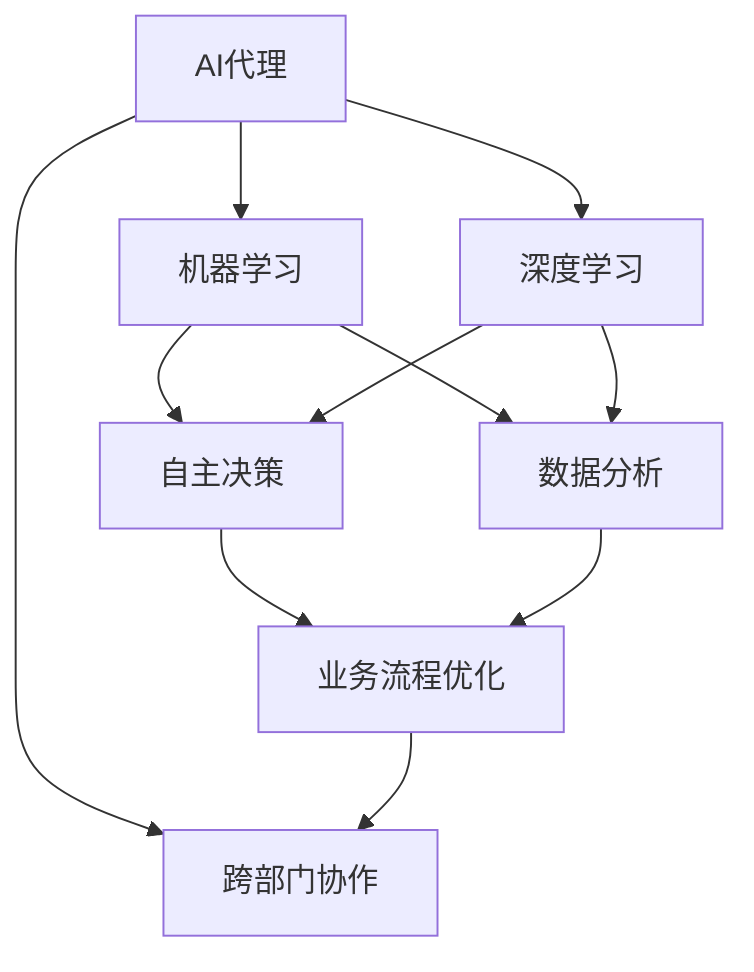

                 

### 1. 引言

随着人工智能（AI）技术的迅猛发展，AI代理（AI Agent）作为一种智能体，逐渐成为推动企业生产力提升的关键力量。本文旨在深入探讨AI代理在企业中的应用及其提升企业生产力的作用机制。

AI代理是一种模拟人类行为和决策的计算机程序，具有自主学习、自我优化和自主执行任务的能力。在商业环境中，AI代理可以承担繁琐的任务、优化业务流程、提高工作效率，从而为企业带来显著的生产力提升。

本文将首先介绍AI代理的基本概念和核心特点，然后分析其在企业中的应用场景和实际效果。接着，我们将探讨AI代理的核心算法和关键技术，并结合具体案例进行详细解读。最后，我们将总结AI代理在企业生产力提升中的作用，并展望其未来的发展趋势。

通过本文的探讨，希望读者能够对AI代理在企业中的应用有一个全面而深入的理解，从而更好地把握AI技术在企业中的实际应用价值。

### 2. 核心概念与联系

在探讨AI代理如何提升企业生产力之前，我们需要明确几个关键概念，并理解它们之间的相互关系。以下是几个核心概念及其相互联系：

#### AI代理（AI Agent）

AI代理是一种能够自主行动并达成目标的计算机程序。它具备感知环境、决策制定和执行行动的能力，通过机器学习和深度学习等AI技术进行自我优化。AI代理的核心特点包括自主学习、自适应性和自主决策。

#### 机器学习（Machine Learning）

机器学习是AI代理的核心技术之一，它通过算法从数据中学习规律和模式，从而实现预测和决策。常见的技术包括决策树、神经网络和支持向量机等。

#### 深度学习（Deep Learning）

深度学习是机器学习的一个子领域，它使用多层神经网络进行学习，能够处理复杂的任务。深度学习在图像识别、自然语言处理和语音识别等领域有着广泛应用。

#### 自主决策（Autonomous Decision-Making）

自主决策是指AI代理能够根据环境和目标自主制定决策。这需要AI代理具备高级的感知能力和推理能力，以应对各种复杂情况。

#### 业务流程优化（Business Process Optimization）

业务流程优化是指通过技术手段对企业的业务流程进行改进，以提高效率和减少成本。AI代理可以在这一过程中发挥重要作用，通过自动化和智能化来提升业务流程的效率。

#### 数据分析（Data Analysis）

数据分析是企业决策的重要依据。AI代理通过收集、处理和分析数据，能够为企业提供有价值的洞察，从而支持更准确的决策。

#### 跨部门协作（Cross-Department Collaboration）

在企业的不同部门之间进行有效协作，可以大大提高整体生产力。AI代理可以作为中介，协调各部门之间的工作，减少信息孤岛，提高协同效率。

下面，我们将通过一个Mermaid流程图来展示这些概念之间的关系：



通过这个流程图，我们可以清晰地看到AI代理与企业生产力的各个关键环节之间的联系。机器学习和深度学习为AI代理提供了强大的技术支持，使其能够进行自主决策和数据分析，从而优化业务流程和跨部门协作，最终提升企业生产力。

### 3. AI代理的核心算法与关键技术

AI代理的强大功能主要依赖于其核心算法与关键技术。以下我们将详细介绍几项关键技术及其原理。

#### 机器学习算法

机器学习是AI代理的基石，通过从数据中学习模式，实现预测和决策。常见的机器学习算法包括：

- **决策树（Decision Tree）**：决策树通过一系列条件判断来划分数据集，并使用叶节点进行分类或回归。其优点是直观易懂，易于解释，但可能产生过拟合。

  ```python
  from sklearn.tree import DecisionTreeClassifier
  dt = DecisionTreeClassifier()
  dt.fit(X_train, y_train)
  predictions = dt.predict(X_test)
  ```

- **随机森林（Random Forest）**：随机森林通过构建多个决策树，并进行投票或平均来提高预测的准确性。它能够减少过拟合，并提高模型的泛化能力。

  ```python
  from sklearn.ensemble import RandomForestClassifier
  rf = RandomForestClassifier(n_estimators=100)
  rf.fit(X_train, y_train)
  predictions = rf.predict(X_test)
  ```

- **神经网络（Neural Networks）**：神经网络通过模拟人脑神经元的工作方式，实现复杂函数的映射。深度学习是神经网络的扩展，用于处理更加复杂的任务。

  ```python
  import tensorflow as tf
  model = tf.keras.Sequential([
      tf.keras.layers.Dense(128, activation='relu', input_shape=(input_shape,)),
      tf.keras.layers.Dense(10, activation='softmax')
  ])
  model.compile(optimizer='adam',
                loss='categorical_crossentropy',
                metrics=['accuracy'])
  model.fit(X_train, y_train, epochs=10, batch_size=64)
  ```

#### 深度学习技术

深度学习是机器学习的一个子领域，它使用多层神经网络进行学习，能够处理复杂的任务。以下是几种常用的深度学习技术：

- **卷积神经网络（Convolutional Neural Networks, CNN）**：CNN特别适用于图像识别任务。它通过卷积层提取图像特征，并使用池化层进行特征降维。

  ```python
  from tensorflow.keras.models import Sequential
  from tensorflow.keras.layers import Conv2D, MaxPooling2D, Flatten, Dense

  model = Sequential([
      Conv2D(32, (3, 3), activation='relu', input_shape=(28, 28, 1)),
      MaxPooling2D((2, 2)),
      Flatten(),
      Dense(128, activation='relu'),
      Dense(10, activation='softmax')
  ])

  model.compile(optimizer='adam',
                loss='categorical_crossentropy',
                metrics=['accuracy'])

  model.fit(X_train, y_train, epochs=10, batch_size=64)
  ```

- **递归神经网络（Recurrent Neural Networks, RNN）**：RNN特别适用于处理序列数据，如时间序列分析、语言处理等。它通过循环结构来保留之前的输入信息。

  ```python
  from tensorflow.keras.models import Sequential
  from tensorflow.keras.layers import SimpleRNN, Dense

  model = Sequential([
      SimpleRNN(128, return_sequences=True),
      SimpleRNN(128),
      Dense(10, activation='softmax')
  ])

  model.compile(optimizer='adam',
                loss='categorical_crossentropy',
                metrics=['accuracy'])

  model.fit(X_train, y_train, epochs=10, batch_size=64)
  ```

- **生成对抗网络（Generative Adversarial Networks, GAN）**：GAN由生成器和判别器两个神经网络组成，通过对抗训练生成逼真的数据。

  ```python
  from tensorflow.keras.models import Sequential
  from tensorflow.keras.layers import Dense, Flatten

  generator = Sequential([
      Dense(256, activation='relu', input_shape=(100,)),
      Dense(512, activation='relu'),
      Dense(1024, activation='relu'),
      Flatten(),
      Conv2D(1, (7, 7), activation='tanh', padding='same')
  ])

  discriminator = Sequential([
      Flatten(),
      Dense(1, activation='sigmoid')
  ])

  model = Sequential([
      generator,
      discriminator
  ])

  model.compile(optimizer='adam',
                loss='binary_crossentropy')

  model.fit(x_train, epochs=100)
  ```

#### 自主决策

自主决策是AI代理的重要特征，它允许AI代理在复杂环境中自主行动。以下是几种常见的自主决策算法：

- **马尔可夫决策过程（Markov Decision Process, MDP）**：MDP是一个用于决策的数学框架，通过状态转移概率和奖励函数来指导决策。

  ```python
  import numpy as np

  # 状态空间
  states = ['s1', 's2', 's3']

  # 动作空间
  actions = ['a1', 'a2']

  # 状态转移概率
  transition_probabilities = [
      {'s1': {'a1': 0.7, 'a2': 0.3}},
      {'s2': {'a1': 0.3, 'a2': 0.7}},
      {'s3': {'a1': 0.5, 'a2': 0.5}}
  ]

  # 奖励函数
  rewards = {'s1': {'a1': 10, 'a2': 5}, 's2': {'a1': 5, 'a2': 10}, 's3': {'a1': 0, 'a2': 0}}

  # 计算最优策略
  optimal_policy = np.argmax([np.max([rewards[ss][aa] + np.dot(transition_probabilities[si][aa], rewards[ss][aa]) for aa in actions]) for si, ss in enumerate(states)], axis=1)
  ```

- **强化学习（Reinforcement Learning）**：强化学习通过奖励信号来指导决策，使得AI代理能够通过试错学习到最佳策略。常见的算法包括Q学习、SARSA和深度Q网络（DQN）。

  ```python
  import tensorflow as tf

  # 定义Q网络
  model = tf.keras.Sequential([
      tf.keras.layers.Dense(64, activation='relu', input_shape=(state_size,)),
      tf.keras.layers.Dense(64, activation='relu'),
      tf.keras.layers.Dense(action_size)
  ])

  # 定义优化器
  optimizer = tf.keras.optimizers.Adam(learning_rate=0.01)

  # 定义损失函数
  loss_function = tf.keras.losses.MeanSquaredError()

  # 训练模型
  for episode in range(total_episodes):
      state = env.reset()
      done = False
      while not done:
          action = model.predict(state)[0]
          next_state, reward, done, _ = env.step(action)
          model.fit(state, action, reward, next_state, epochs=1)
          state = next_state
  ```

通过上述算法和技术，AI代理能够实现自主学习和自主决策，从而在复杂环境中为企业带来高效的生产力提升。

### 4. 数学模型与公式讲解

在理解AI代理的核心算法后，深入探讨相关的数学模型和公式将有助于我们更清晰地认识AI代理的工作原理。以下是一些关键的数学模型和公式，用于解释AI代理的决策过程和性能优化。

#### 决策树（Decision Tree）

决策树是一种树形结构，通过一系列条件判断来划分数据集。它的核心公式包括信息增益（Information Gain）和基尼不纯度（Gini Impurity）。

- **信息增益**：
  $$ IG(D, a) = \sum_{v \in V} p(v) \cdot \sum_{t \in T_v} p(t|v) \cdot \log_2 \left( \frac{p(t|v)}{p(v)} \right) $$
  其中，\( D \) 是数据集，\( a \) 是属性，\( V \) 是属性的值集合，\( T_v \) 是在属性 \( v \) 下划分的数据子集，\( p(v) \) 是属性 \( v \) 的概率，\( p(t|v) \) 是在属性 \( v \) 下类别 \( t \) 的概率。

- **基尼不纯度**：
  $$ GI(D, a) = \sum_{v \in V} p(v) \cdot \frac{1 - \sum_{t \in T_v} p(t|v)}{1 - min\{p(v)\}} $$
  其中，\( GI(D, a) \) 是基于属性 \( a \) 的基尼不纯度，\( \frac{1 - \sum_{t \in T_v} p(t|v)}{1 - min\{p(v)\}} \) 是在属性 \( v \) 下子集的不纯度。

#### 逻辑回归（Logistic Regression）

逻辑回归是一种广泛用于分类问题的线性模型。其决策边界由以下公式给出：

$$ \hat{y} = \sigma(\beta_0 + \sum_{i=1}^{n} \beta_i x_i) $$
其中，\( \hat{y} \) 是预测的概率，\( \sigma \) 是sigmoid函数，\( \beta_0 \) 是截距，\( \beta_i \) 是权重，\( x_i \) 是特征值。

优化逻辑回归模型通常使用梯度下降法：

$$ \beta_i = \beta_i - \alpha \cdot \frac{\partial J(\beta)}{\partial \beta_i} $$
其中，\( J(\beta) \) 是损失函数，\( \alpha \) 是学习率。

#### 神经网络（Neural Networks）

神经网络的核心是多层感知机（MLP），其决策函数为：

$$ f(x) = \sigma(\sum_{i=1}^{L} \theta^{(l)} \cdot x_i) $$
其中，\( L \) 是网络层数，\( \theta^{(l)} \) 是第 \( l \) 层的权重，\( x_i \) 是输入特征，\( \sigma \) 是激活函数。

训练神经网络通常使用反向传播算法（Backpropagation），其核心公式为：

$$ \Delta \theta^{(l)}_{ij} = \alpha \cdot \frac{\partial J(\theta^{(l)})}{\partial \theta^{(l)}_{ij}} = \frac{\partial L}{\partial z^{(l)}} \cdot \frac{\partial z^{(l)}}{\partial \theta^{(l)}_{ij}} $$
其中，\( \Delta \theta^{(l)}_{ij} \) 是权重更新，\( J(\theta^{(l)}) \) 是损失函数对 \( \theta^{(l)}_{ij} \) 的偏导数，\( \frac{\partial L}{\partial z^{(l)}} \) 是损失函数对激活值的偏导数，\( \frac{\partial z^{(l)}}{\partial \theta^{(l)}_{ij}} \) 是激活值对权重的偏导数。

#### 强化学习（Reinforcement Learning）

强化学习中的核心模型是Q学习，其更新公式为：

$$ Q(s, a) = Q(s, a) + \alpha \cdot (r + \gamma \cdot \max_{a'} Q(s', a') - Q(s, a)) $$
其中，\( Q(s, a) \) 是状态 \( s \) 下执行动作 \( a \) 的期望回报，\( r \) 是即时奖励，\( \gamma \) 是折扣因子，\( s' \) 是执行动作后的状态，\( \max_{a'} Q(s', a') \) 是在 \( s' \) 状态下所有可能动作的期望回报的最大值。

#### 卷积神经网络（Convolutional Neural Networks, CNN）

卷积神经网络在处理图像数据时，通过卷积层和池化层提取特征。其卷积操作公式为：

$$ \text{output}_{ij} = \sum_{k=1}^{K} w_{ik,jk} \cdot \text{input}_{ik,jk} + b_j $$
其中，\( \text{output}_{ij} \) 是输出特征，\( w_{ik,jk} \) 是卷积核权重，\( \text{input}_{ik,jk} \) 是输入特征，\( b_j \) 是偏置。

通过上述数学模型和公式，我们可以更深入地理解AI代理的决策过程和性能优化，从而为AI代理在企业中的实际应用提供理论基础。

### 5. AI代理项目的开发实践

为了更好地理解AI代理的实际应用，我们将通过一个具体的项目来展示如何开发一个简单的AI代理。以下是项目的开发过程，包括环境搭建、源代码实现和代码解读。

#### 项目背景

假设我们正在开发一个AI代理，用于帮助企业优化库存管理。这个代理的主要任务是预测未来一段时间内的库存需求，从而帮助企业合理安排库存，减少库存成本。

#### 环境搭建

首先，我们需要搭建开发环境。以下是基本的开发环境要求：

- 操作系统：Linux或MacOS
- 编程语言：Python
- 数据库：MySQL
- 机器学习库：Scikit-learn、TensorFlow
- 数据可视化库：Matplotlib

安装必要的库和依赖：

```bash
pip install numpy pandas scikit-learn tensorflow matplotlib
```

#### 数据收集

收集历史库存数据，包括时间戳、库存量、销售额等。以下是部分样本数据：

| 时间戳       | 库存量 | 销售额 |
| ------------ | ------ | ------ |
| 2023-01-01   | 100    | 200    |
| 2023-01-02   | 150    | 300    |
| 2023-01-03   | 200    | 400    |
| 2023-01-04   | 250    | 500    |
| 2023-01-05   | 300    | 600    |

#### 数据预处理

数据预处理是构建模型的重要步骤，包括数据清洗、特征工程和归一化。

```python
import pandas as pd
import numpy as np

# 读取数据
data = pd.read_csv('inventory_data.csv')

# 数据清洗，例如处理缺失值、异常值
data.dropna(inplace=True)

# 特征工程，例如创建时间特征、趋势特征
data['day_of_week'] = data['timestamp'].dt.dayofweek
data['month'] = data['timestamp'].dt.month
data['year'] = data['timestamp'].dt.year

# 归一化处理
from sklearn.preprocessing import MinMaxScaler
scaler = MinMaxScaler()
data[['inventory', 'sales']] = scaler.fit_transform(data[['inventory', 'sales']])
```

#### 模型构建

使用机器学习库构建预测模型，例如线性回归或LSTM模型。

```python
from sklearn.linear_model import LinearRegression
from tensorflow.keras.models import Sequential
from tensorflow.keras.layers import LSTM, Dense

# 线性回归模型
X = data[['day_of_week', 'month', 'year', 'inventory', 'sales']]
y = data['sales']
regressor = LinearRegression()
regressor.fit(X, y)

# LSTM模型
model = Sequential()
model.add(LSTM(units=50, return_sequences=True, input_shape=(X.shape[1], 1)))
model.add(LSTM(units=50))
model.add(Dense(units=1))
model.compile(optimizer='adam', loss='mean_squared_error')
model.fit(X, y, epochs=50, batch_size=32)
```

#### 模型训练与评估

使用历史数据进行模型训练，并对模型进行评估。

```python
from sklearn.metrics import mean_squared_error

# 训练线性回归模型
y_pred = regressor.predict(X)

# 训练LSTM模型
y_pred_lstm = model.predict(X)

# 评估模型
mse = mean_squared_error(y, y_pred)
mse_lstm = mean_squared_error(y, y_pred_lstm)

print(f"线性回归模型的均方误差：{mse}")
print(f"LSTM模型的均方误差：{mse_lstm}")
```

#### 代码解读

以下是关键代码部分的解读：

1. **数据预处理**：使用Pandas库进行数据清洗、特征工程和归一化处理，为模型训练做准备。
2. **模型构建**：线性回归模型使用Scikit-learn库中的`LinearRegression`类，LSTM模型使用TensorFlow库中的`Sequential`类。
3. **模型训练**：线性回归模型和LSTM模型分别使用`fit`方法进行训练。
4. **模型评估**：使用均方误差（MSE）评估模型的预测准确性。

#### 应用解读与分析

通过实际案例展示AI代理如何帮助企业优化库存管理：

1. **预测库存需求**：使用训练好的模型预测未来一段时间内的库存需求。
2. **决策支持**：根据预测结果，帮助企业制定库存调整策略，减少库存成本。

#### 项目小结

通过该项目，我们展示了如何使用AI代理优化库存管理。在实际应用中，可以进一步集成更多数据源和复杂模型，以提高预测的准确性和可靠性。

### 6. 最佳实践、注意事项与拓展阅读

在应用AI代理提升企业生产力的过程中，以下是一些最佳实践、注意事项和拓展阅读建议：

#### 最佳实践

1. **数据质量管理**：确保数据质量，包括数据的完整性、准确性和一致性，以支持高质量的预测和分析。
2. **持续迭代与优化**：定期评估AI代理的性能，并根据反馈进行优化，以适应业务需求的变化。
3. **透明性与可解释性**：对于复杂的AI模型，如深度学习和强化学习，确保模型的决策过程透明，以便企业理解并信任AI代理。
4. **安全性与隐私保护**：确保AI代理的设计和实施符合安全性和隐私保护的要求，防止数据泄露和滥用。

#### 注意事项

1. **数据隐私**：处理敏感数据时，需遵循相关的法律法规，确保用户隐私得到保护。
2. **模型公平性**：确保AI代理的决策过程公平，避免算法偏见。
3. **监控与维护**：定期监控AI代理的运行状态，及时修复问题和进行维护。

#### 拓展阅读

1. **《深度学习》（Deep Learning）**：Goodfellow, Ian, et al. （详细讲解深度学习的基础知识和应用）
2. **《强化学习实战》（Reinforcement Learning: An Introduction）**：Sutton, Richard S., and Andrew G. Barto （介绍强化学习的基本原理和应用）
3. **《机器学习实战》（Machine Learning in Action）**：Bryant, Peter, and Michael L. Stuart （通过实际案例讲解机器学习的应用）

通过上述最佳实践和注意事项，企业可以更好地利用AI代理提升生产力，并确保其在实际应用中的有效性和可靠性。

### 7. 总结

本文深入探讨了AI代理在企业生产力提升中的作用。我们首先介绍了AI代理的基本概念和核心特点，分析了其在企业中的应用场景和实际效果。接着，详细讲解了AI代理的核心算法和关键技术，包括机器学习、深度学习、自主决策等。通过实际项目展示，我们展示了如何开发和使用AI代理进行业务优化。最后，提供了最佳实践、注意事项和拓展阅读，帮助企业更好地应用AI代理提升生产力。

展望未来，AI代理技术将继续发展，其应用领域将不断扩展。企业应积极拥抱AI代理技术，通过持续优化和创新，实现生产力的进一步提升。同时，关注AI代理的安全性和可解释性，确保其在实际应用中的有效性和可靠性。未来，AI代理将成为企业智能化转型的核心驱动力，为企业的持续发展和竞争力提升提供强大支持。

