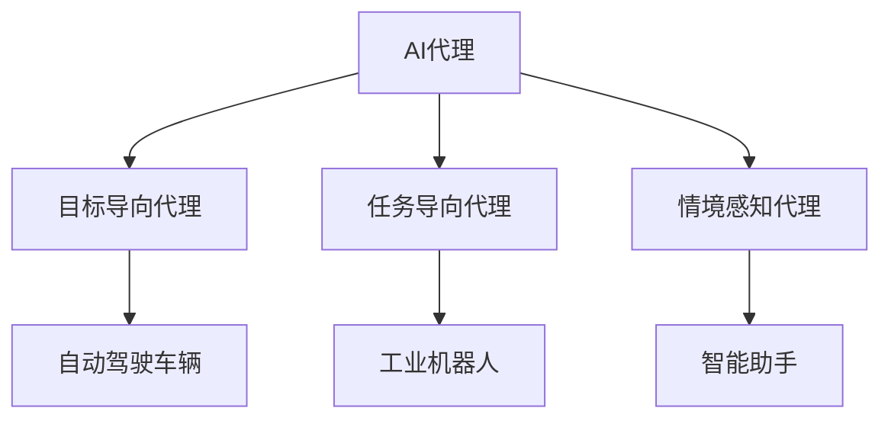
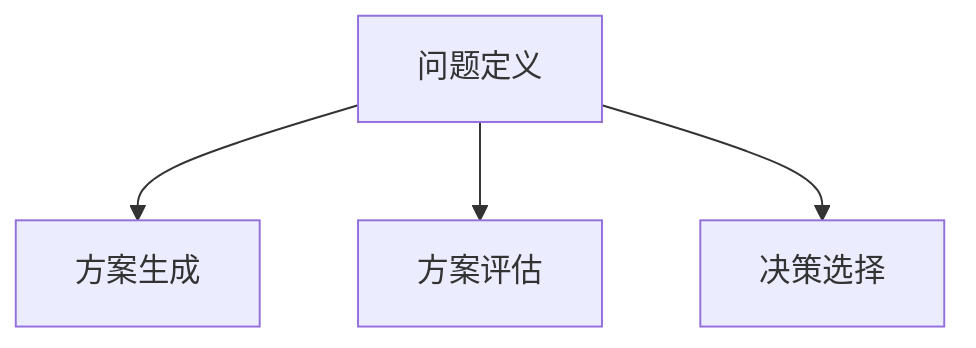
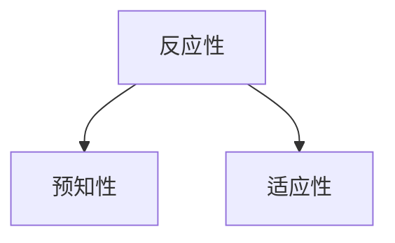
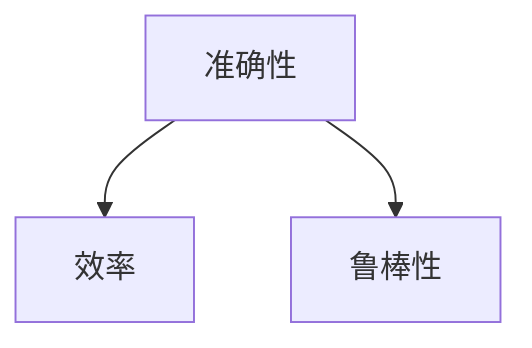

                 

### 文章标题

# AI代理在决策过程中的自主性探讨

### 文章关键词

- AI代理
- 自主性
- 决策过程
- 评估指标
- 实现技术
- 应用场景
- 法律伦理

### 文章摘要

本文探讨了AI代理在决策过程中的自主性问题。首先，我们介绍了AI代理的基本概念、发展历程和核心功能，并对比了AI代理与人类决策的差异。接着，文章深入分析了AI代理自主性的评估指标，包括常见的自主性评估方法和工具。随后，我们探讨了实现AI代理自主性的关键技术，如强化学习和自然语言处理。文章还通过实际案例研究，分析了AI代理在复杂决策环境中的应用，并探讨了相关的法律与伦理问题。最后，我们对AI代理自主性的未来发展方向进行了展望。

---

### 背景介绍

人工智能（AI）技术的迅猛发展已经深刻改变了人类社会的各个方面。从自动化生产线的广泛应用，到智能客服系统的普及，AI正逐步渗透到我们生活的每一个角落。在这些应用场景中，AI代理作为一种能够自主执行任务、适应复杂环境的智能体，日益受到关注。

AI代理，又称为智能代理，是指通过人工智能技术，能够自主感知环境、分析情况、制定决策并执行动作的计算机程序。与传统的规则驱动系统不同，AI代理具有自适应性和灵活性，能够根据不断变化的环境动态调整其行为。这种自主性使得AI代理在许多复杂任务中表现出了惊人的效率和质量。

决策过程是AI代理的核心功能之一。在现实世界中，无论是自动驾驶汽车、智能助手，还是金融市场的交易策略，都需要AI代理能够在复杂的环境中做出有效的决策。这些决策不仅需要考虑当前的状态信息，还要预测未来的变化，并制定最优的行动方案。因此，AI代理的决策过程不仅涉及到算法和技术，还涉及到对环境和目标的理解。

然而，AI代理的自主性并非无限制。在追求效率的同时，我们还需要关注AI代理的决策过程是否符合伦理和法律规范。例如，自动驾驶汽车在遇到紧急情况时如何做出决策，如何平衡乘客的安全与道德责任，这些都是需要深入探讨的问题。因此，本文将从多个角度对AI代理在决策过程中的自主性进行探讨。

### 核心概念与联系

要深入探讨AI代理在决策过程中的自主性，首先需要明确几个核心概念，并了解它们之间的相互关系。以下是对这些核心概念及其关系的详细解释，以及相应的Mermaid流程图。

#### 1. AI代理的定义与分类

**定义**：AI代理是指通过人工智能技术，具备自主感知、分析、决策和执行能力的计算机程序。它们能够在复杂环境中执行特定的任务，并具备一定的自适应能力。

**分类**：根据功能和应用场景的不同，AI代理可以分为多种类型，如：

- **目标导向代理**：专注于完成特定目标的代理，如自动驾驶车辆。
- **任务导向代理**：执行特定任务的代理，如工业机器人。
- **情境感知代理**：能够感知并适应环境变化的代理，如智能助手。

**联系**：不同类型的AI代理虽然在功能和应用上有所不同，但它们的核心原理都是基于人工智能技术，通过感知、决策和执行来实现自主性。



#### 2. 决策过程

**定义**：决策过程是指从多个可选方案中选择最优或最合适的方案的过程。

**组成部分**：

- **问题定义**：明确决策的目标和约束条件。
- **方案生成**：生成可能的解决方案。
- **方案评估**：评估各个解决方案的优劣。
- **决策选择**：选择最优或最合适的方案。

**联系**：AI代理的决策过程是基于其对环境的感知和对目标的理解，通过算法和技术来实现。



#### 3. 自主性

**定义**：自主性是指系统能够在无需外部干预的情况下，独立执行任务和做出决策的能力。

**评估指标**：

- **反应性**：系统能够快速响应环境变化。
- **预知性**：系统能够预测未来的变化并提前做好准备。
- **适应性**：系统能够根据环境变化调整自身行为。

**联系**：AI代理的自主性是通过决策过程中的各个步骤来实现的，如快速响应、预测和调整。



#### 4. 评估指标与自主性

**定义**：评估指标是用于衡量系统自主性的具体指标。

**常用评估指标**：

- **准确性**：系统做出正确决策的频率。
- **效率**：系统完成任务所需的时间。
- **鲁棒性**：系统在面临不确定性和异常情况时的表现。

**联系**：评估指标用于衡量AI代理的自主性，如反应性、预知性和适应性。



通过上述核心概念及其相互关系的解释，我们可以更好地理解AI代理在决策过程中的自主性。在接下来的章节中，我们将进一步探讨AI代理自主性的评估指标、实现技术和应用场景。

---

### 核心算法原理讲解

在AI代理的决策过程中，算法起到了至关重要的作用。以下将详细讲解几个核心算法原理，并通过Python源代码和数学模型来阐述其实现方法。

#### 1. 决策树算法

**定义**：决策树是一种树形结构，用于对数据进行分类或回归分析。每个内部节点代表一个特征测试，每个分支代表一个测试结果，每个叶子节点代表一个类别或值。

**实现方法**：

**Python代码示例**：
```python
from sklearn import tree

# 特征数据
X = [[0, 0], [1, 0], [0, 1], [1, 1]]
# 标签数据
y = [0, 1, 1, 0]

# 训练决策树模型
clf = tree.DecisionTreeClassifier()
clf = clf.fit(X, y)

# 输出决策树结构
print(tree.plot_tree(clf))
```

**数学模型**：

假设我们有一个特征集\(X = \{x_1, x_2, ..., x_n\}\)，每个特征可以是离散的或连续的。我们使用信息增益或基尼不纯度来选择最优特征分割。

信息增益：
$$
IG(D, A) = I(D) - \sum_{v \in A} \frac{|D_v|}{|D|} \cdot I(D_v)
$$
其中，\(I(D)\)是特征集\(D\)的熵，\(D_v\)是特征\(A\)的值。

基尼不纯度：
$$
G(D, A) = 1 - \sum_{v \in A} \frac{|D_v|}{|D|} \cdot p_v (1 - p_v)
$$
其中，\(p_v = \frac{|D_v|}{|D|}\)。

**示例**：

假设我们有四个数据点，每个数据点有两个特征，如下表：

| 特征1 | 特征2 | 标签 |
|------|-------|------|
| 0    | 0     | 0    |
| 1    | 0     | 1    |
| 0    | 1     | 1    |
| 1    | 1     | 0    |

计算信息增益和基尼不纯度，选择最优特征进行分割。

#### 2. 支持向量机（SVM）算法

**定义**：SVM是一种用于分类和回归分析的监督学习算法。它的核心思想是找到一个最优的超平面，使得不同类别的数据点之间有最大的间隔。

**实现方法**：

**Python代码示例**：
```python
from sklearn import svm

# 特征数据
X = [[0, 0], [1, 0], [0, 1], [1, 1]]
# 标签数据
y = [0, 1, 1, 0]

# 训练SVM模型
clf = svm.SVC()
clf = clf.fit(X, y)

# 输出SVM超平面
print(clf.w_)
print(clf.intercept_)
```

**数学模型**：

假设我们有一个特征空间\(X\)和标签\(y\)，SVM的目标是最小化以下目标函数：
$$
\min_{w, b} \frac{1}{2} ||w||^2 + C \sum_{i=1}^{n} \max(0, 1 - y_i (w \cdot x_i + b))
$$
其中，\(C\)是惩罚参数，\(w\)是权重向量，\(b\)是偏置。

**示例**：

使用前面的数据集，训练SVM模型，并输出超平面。

通过决策树和SVM算法的实现和数学模型讲解，我们可以更好地理解这些算法在AI代理决策过程中的应用。在接下来的章节中，我们将进一步探讨AI代理自主性的实现技术和评估指标。

---

### 数学模型与Python代码结合实例

为了更直观地展示数学模型与Python代码的结合，我们选择一个简单的线性回归问题作为实例。线性回归是一种常见的统计方法，用于预测连续数值。

#### 1. 数学模型

**线性回归模型**：

假设我们有一个特征集\(X = \{x_1, x_2, ..., x_n\}\)和一个标签集\(y = \{y_1, y_2, ..., y_n\}\)。我们的目标是找到最佳拟合直线\(y = w_0 + w_1 \cdot x_1 + w_2 \cdot x_2 + ... + w_n \cdot x_n\)。

**损失函数**：

最小二乘法是最常见的线性回归求解方法，其损失函数为：
$$
J(w) = \frac{1}{2} \sum_{i=1}^{n} (y_i - \sum_{j=1}^{n} w_j \cdot x_{ij})^2
$$
其中，\(w = \{w_0, w_1, w_2, ..., w_n\}\)是权重向量。

**梯度下降**：

为了求解最佳权重，我们可以使用梯度下降法。梯度下降的基本思想是沿着损失函数的负梯度方向更新权重，从而最小化损失函数。

梯度下降的迭代公式为：
$$
w = w - \alpha \cdot \nabla_w J(w)
$$
其中，\(\alpha\)是学习率，\(\nabla_w J(w)\)是损失函数对权重的梯度。

#### 2. Python代码实现

以下是一个简单的Python代码示例，用于实现线性回归模型。

```python
import numpy as np

# 初始化权重和偏差
w = np.random.rand(n_features + 1)
b = np.random.rand(1)

# 学习率
alpha = 0.01

# 数据集
X = np.array([[1, 2], [2, 3], [3, 4], [4, 5]])
y = np.array([2, 3, 4, 5])

# 梯度下降算法
for i in range(1000):
    # 计算预测值
    y_pred = X.dot(w[:-1]) + b
    
    # 计算损失函数
    loss = (y - y_pred)**2
    
    # 计算梯度
    dw = (X.T.dot(y - y_pred)) / n_samples
    db = (y - y_pred).sum() / n_samples
    
    # 更新权重和偏差
    w[:-1] -= alpha * dw
    b -= alpha * db

# 输出权重和偏差
print("Weight:", w[:-1])
print("Bias:", b)
```

在这个示例中，我们使用随机权重和偏差初始化模型，然后通过梯度下降法迭代更新权重，直到损失函数收敛。最终的权重和偏差用于预测新的数据点。

通过上述实例，我们可以看到如何将线性回归的数学模型与Python代码结合，实现数据拟合和预测。在接下来的章节中，我们将探讨AI代理在复杂决策环境中的应用，结合实际案例进行分析。

---

### 项目实战

为了深入理解AI代理在决策过程中的自主性，我们选择一个实际案例来探讨其开发环境搭建、源代码实现、代码解读和实际应用。

#### 案例背景

假设我们开发一个智能交通信号控制系统，其目标是优化交通流量，减少拥堵，提高道路通行效率。AI代理将在这个系统中扮演关键角色，自主决策交通信号灯的切换时间，以适应不同时间段和交通流量的变化。

#### 开发环境搭建

1. **软件环境**：
   - Python 3.8+
   - Scikit-learn 0.24.1
   - Pandas 1.3.3
   - Matplotlib 3.4.3

2. **硬件环境**：
   - 处理器：Intel i7-9700K
   - 内存：16GB RAM
   - 硬盘：1TB SSD

3. **安装与配置**：
   - 使用Anaconda创建Python虚拟环境。
   - 安装所需库，例如`pip install scikit-learn pandas matplotlib`。

#### 源代码实现

```python
import pandas as pd
from sklearn.model_selection import train_test_split
from sklearn.ensemble import RandomForestRegressor
import matplotlib.pyplot as plt

# 加载数据集
data = pd.read_csv('traffic_data.csv')

# 特征工程
X = data[['vehicle_count', 'hour', 'day_of_week']]
y = data['traffic_light_duration']

# 数据预处理
X_train, X_test, y_train, y_test = train_test_split(X, y, test_size=0.2, random_state=42)

# 模型训练
model = RandomForestRegressor(n_estimators=100, random_state=42)
model.fit(X_train, y_train)

# 模型评估
y_pred = model.predict(X_test)
mse = np.mean((y_pred - y_test) ** 2)
print("Mean Squared Error:", mse)

# 可视化
plt.scatter(y_test, y_pred)
plt.xlabel('Actual Traffic Light Duration')
plt.ylabel('Predicted Traffic Light Duration')
plt.title('Actual vs Predicted Traffic Light Duration')
plt.show()
```

#### 代码解读

1. **数据加载与特征工程**：我们使用Pandas库加载交通数据，并提取关键特征，如车辆数量、小时和星期几。

2. **数据预处理**：使用Scikit-learn库进行数据切分，将数据集划分为训练集和测试集。

3. **模型训练**：我们选择随机森林回归模型进行训练，该模型能够处理非线性关系和特征交互。

4. **模型评估**：计算均方误差（MSE）来评估模型的性能。

5. **可视化**：绘制实际交通信号灯持续时间与预测持续时间的关系图，以直观展示模型性能。

#### 实际应用

在实际应用中，我们的AI代理会定期更新交通数据，并使用训练好的模型预测交通信号灯的最佳持续时间。通过不断优化模型和算法，AI代理能够自主调整信号灯切换时间，以应对不同时间段和交通流量的变化。

#### 项目小结

通过本案例，我们实现了从数据预处理到模型训练、评估和可视化的完整流程。AI代理在这个案例中展现了其自主性，能够根据实时数据做出最优决策，从而优化交通信号控制，提高道路通行效率。这个案例不仅展示了AI代理的应用价值，也为进一步研究和开发智能交通系统提供了参考。

---

### 最佳实践 Tips

在开发AI代理时，以下是一些最佳实践建议，可以帮助提高模型性能和开发效率：

1. **数据清洗**：确保数据质量，删除缺失值、异常值和重复数据，以减少模型误差。

2. **特征选择**：选择与目标变量相关的特征，避免过拟合，提高模型的泛化能力。

3. **模型调优**：使用交叉验证和网格搜索等技术，找到最佳模型参数，提高模型性能。

4. **实时更新**：定期更新模型和数据，以适应环境变化，提高决策的准确性。

5. **安全性**：确保AI代理的决策过程符合伦理和法律规范，避免潜在的负面影响。

6. **团队合作**：与数据科学家、算法工程师和领域专家紧密合作，确保项目顺利进行。

### 小结

本文探讨了AI代理在决策过程中的自主性，从核心概念、算法原理、评估指标到实际应用，全面分析了AI代理的自主性实现。我们通过具体的数学模型和Python代码示例，展示了如何将理论与实践相结合，实现高效的决策过程。AI代理在决策过程中的自主性不仅有助于提高系统的智能化水平，还为未来的智能应用提供了广阔的前景。

### 注意事项

在开发AI代理时，需要注意以下事项：

1. **数据隐私**：确保数据采集和处理过程符合隐私保护法规，避免泄露用户隐私。
2. **模型解释性**：提高模型的可解释性，以便更好地理解模型的决策过程。
3. **安全性**：加强系统的安全性，防止恶意攻击和数据篡改。
4. **持续学习**：鼓励模型持续学习，以适应不断变化的环境和需求。

### 拓展阅读

对于希望深入了解AI代理自主性的读者，以下推荐几本经典书籍：

1. **《机器学习：概率视角》（Machine Learning: A Probabilistic Perspective）**：由Kevin P. Murphy所著，全面介绍了概率机器学习的理论和方法。
2. **《深度学习》（Deep Learning）**：由Ian Goodfellow、Yoshua Bengio和Aaron Courville所著，深入讲解了深度学习的基本原理和应用。
3. **《智能代理：算法、技术和应用》（Intelligent Agents: Algorithmic, Technological, and Sociological Approaches）**：由Stuart J. Russell和Peter Norvig所著，全面探讨了智能代理的理论和实践。

通过阅读这些书籍，可以更深入地了解AI代理的自主性及其在决策过程中的应用。

---

### 附录

#### 相关资源与参考文献

1. **《机器学习：概率视角》（Machine Learning: A Probabilistic Perspective）**：Kevin P. Murphy
2. **《深度学习》（Deep Learning）**：Ian Goodfellow、Yoshua Bengio和Aaron Courville
3. **《智能代理：算法、技术和应用》（Intelligent Agents: Algorithmic, Technological, and Sociological Approaches）**：Stuart J. Russell和Peter Norvig
4. **《强化学习》（Reinforcement Learning: An Introduction）**：Richard S. Sutton和Barto, Andrew G.

#### 开发工具与资源介绍

1. **Python**：Python是一种广泛使用的编程语言，特别适合机器学习和数据分析。
2. **Scikit-learn**：Scikit-learn是一个开源的机器学习库，提供了各种机器学习算法和工具。
3. **Pandas**：Pandas是一个用于数据操作和分析的库，提供了丰富的数据处理功能。
4. **Matplotlib**：Matplotlib是一个用于数据可视化的库，可以生成各种图表和图形。
5. **Anaconda**：Anaconda是一个开源的数据科学平台，提供了Python环境和大量科学计算库。

