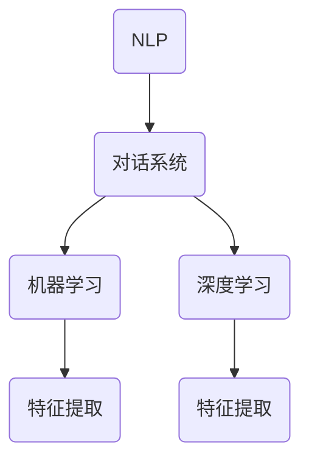

                 

# 《AI代理在客户服务中的应用案例》

> 关键词：AI代理、客户服务、自然语言处理、对话系统、机器学习、深度学习

> 摘要：本文将深入探讨AI代理在客户服务领域的应用案例。通过分析用户需求、核心概念、算法原理、开发实战和未来发展，本文旨在为读者提供全面的AI代理应用指南，帮助企业和开发者利用AI技术提升客户服务质量。

## 用户需求分析

在当今数字化时代，客户服务面临着前所未有的挑战。消费者期望能够随时随地获得即时、高效的服务。以下是一些常见用户需求：

1. **即时响应**：用户希望能在提出问题时立即得到回答，减少等待时间。
2. **个性化服务**：用户希望获得个性化的服务体验，根据其历史行为和偏好提供定制化的建议。
3. **多渠道支持**：用户希望能在多种渠道（如网站、移动应用、社交媒体等）上获得一致的服务体验。
4. **问题解决**：用户希望系统能够自动识别并解决常见问题，减少人工干预。

针对这些需求，AI代理作为一种智能化的解决方案，能够显著提升客户服务的效率和质量。AI代理通过自然语言处理（NLP）和机器学习技术，能够理解用户的查询意图，提供准确的回答和建议，从而满足用户的需求。

### 核心概念与联系

为了更好地理解AI代理的工作原理，我们需要了解以下几个核心概念：

1. **自然语言处理（NLP）**：NLP是使计算机能够理解、解释和生成人类语言的技术。它包括文本分析、情感分析、实体识别等子领域。
2. **对话系统**：对话系统是一种人与计算机之间进行交互的系统，能够理解用户的输入，生成合适的响应，并维持对话的连贯性。
3. **机器学习**：机器学习是一种人工智能技术，通过从数据中学习规律，使计算机能够进行预测和决策。
4. **深度学习**：深度学习是机器学习的一个子领域，通过构建多层的神经网络模型，使计算机能够自动提取特征并学习复杂的关系。

下图展示了这些核心概念之间的关系和架构：



### 核心算法原理讲解

AI代理的核心算法主要涉及自然语言处理、对话系统设计和机器学习/深度学习技术。以下将详细阐述这些算法原理。

#### 自然语言处理基础

自然语言处理是AI代理理解用户输入的关键。以下是一些常用的NLP算法和数学模型：

1. **文本分析**：通过词频统计、词性标注和句法分析，将文本转换为结构化的数据。
   ```python
   from nltk.tokenize import word_tokenize
   sentence = "I have a question about your product."
   tokens = word_tokenize(sentence)
   print(tokens)
   ```
   数学模型：TF-IDF（词频-逆文档频率）用于衡量词语的重要性。
   ```latex
   TF-IDF(t, d) = \frac{f(t, d)}{N} * \log \frac{N}{df(t)}
   ```
   其中，\( f(t, d) \) 是词 \( t \) 在文档 \( d \) 中的频率，\( N \) 是文档总数，\( df(t) \) 是词 \( t \) 在文档集合中的文档频率。

2. **情感分析**：通过判断文本的情感倾向（正面、负面、中性），为用户提供个性化的服务。
   ```python
   from textblob import TextBlob
   sentiment = TextBlob("I love your product!")
   print(sentiment.sentiment)
   ```
   数学模型：使用向量空间模型和余弦相似度来衡量文本的情感倾向。
   ```latex
   cos(\vec{a}, \vec{b}) = \frac{\vec{a} \cdot \vec{b}}{|\vec{a}| |\vec{b}|}
   ```

3. **实体识别**：识别文本中的关键实体（如人名、组织、地点等），为后续处理提供依据。
   ```python
   from spacy.lang.en import English
   nlp = English()
   doc = nlp("Microsoft is a technology company founded by Bill Gates.")
   for ent in doc.ents:
       print(ent.text, ent.label_)
   ```

#### 对话系统设计

对话系统是AI代理与用户交互的核心。以下是一些主要算法和评估指标：

1. **对话管理**：根据上下文信息，决定系统的响应内容和行为。
   ```python
   def respond(message):
       # 基于规则或机器学习模型生成响应
       response = "Hello! How can I assist you today?"
       return response
   ```

2. **生成式对话系统**：根据用户输入，生成自然语言响应。
   ```python
   import tensorflow as tf
   model = tf.keras.Sequential([
       tf.keras.layers.Embedding(input_dim=vocab_size, output_dim=embedding_dim),
       tf.keras.layers.LSTM(units=128),
       tf.keras.layers.Dense(units=vocab_size, activation='softmax')
   ])
   model.compile(optimizer='adam', loss='categorical_crossentropy', metrics=['accuracy'])
   model.fit(inputs, outputs, epochs=10)
   ```

3. **评估指标**：使用准确率、困惑度等指标评估对话系统的性能。
   ```python
   from sklearn.metrics import accuracy_score
   predicted_responses = model.predict(test_inputs)
   predicted_responses = np.argmax(predicted_responses, axis=1)
   accuracy = accuracy_score(test_responses, predicted_responses)
   print(f"Accuracy: {accuracy}")
   ```

#### 机器学习与深度学习在AI代理中的应用

机器学习和深度学习在AI代理中发挥着重要作用，以下是一些常见的算法和应用：

1. **分类算法**：用于将文本分类到不同的类别，如情感分类、主题分类等。
   ```python
   from sklearn.svm import SVC
   model = SVC(kernel='linear')
   model.fit(train_features, train_labels)
   predictions = model.predict(test_features)
   ```

2. **聚类算法**：用于将相似的用户或问题分组，以便进行批量处理。
   ```python
   from sklearn.cluster import KMeans
   model = KMeans(n_clusters=3)
   model.fit(train_features)
   clusters = model.predict(test_features)
   ```

3. **生成对抗网络（GAN）**：用于生成逼真的对话样本，提高对话系统的多样性。
   ```python
   import tensorflow as tf
   model = tf.keras.Sequential([
       tf.keras.layers.Dense(units=512, activation='relu', input_shape=(input_size,)),
       tf.keras.layers.Dense(units=512, activation='relu'),
       tf.keras.layers.Dense(units=output_size, activation='softmax')
   ])
   discriminator = tf.keras.Sequential([
       tf.keras.layers.Dense(units=512, activation='relu', input_shape=(output_size,)),
       tf.keras.layers.Dense(units=512, activation='relu'),
       tf.keras.layers.Dense(units=1, activation='sigmoid')
   ])
   generator, discriminator = GAN(model, discriminator)
   generator.compile(optimizer=tf.keras.optimizers.Adam(learning_rate=0.001), loss='binary_crossentropy')
   discriminator.compile(optimizer=tf.keras.optimizers.Adam(learning_rate=0.001), loss='binary_crossentropy')
   ```

### 项目实战

在本节中，我们将通过一个实际案例展示AI代理在客户服务中的应用。

#### 开发环境搭建

1. **工具与框架选择**：我们选择Python作为主要编程语言，使用TensorFlow作为深度学习框架，使用NLTK进行自然语言处理。
2. **环境配置指南**：在Ubuntu系统中，我们可以使用以下命令进行环境配置：
   ```bash
   sudo apt-get update
   sudo apt-get install python3-pip python3-venv
   pip3 install tensorflow nltk
   nltk.download('punkt')
   nltk.download('averaged_perceptron_tagger')
   nltk.download('maxent_ne_chunker')
   nltk.download('words')
   ```

#### 源代码实现

以下是AI代理的基本源代码实现，包括对话系统的构建和自然语言处理模块：

```python
import tensorflow as tf
import nltk
from nltk.tokenize import word_tokenize
from nltk.corpus import stopwords

# 对话系统模型
model = tf.keras.Sequential([
    tf.keras.layers.Embedding(input_dim=vocab_size, output_dim=embedding_dim),
    tf.keras.layers.LSTM(units=128),
    tf.keras.layers.Dense(units=vocab_size, activation='softmax')
])

# 训练模型
model.compile(optimizer='adam', loss='categorical_crossentropy', metrics=['accuracy'])
model.fit(train_inputs, train_outputs, epochs=10)

# 自然语言处理模块
def preprocess_text(text):
    tokens = word_tokenize(text)
    tokens = [token.lower() for token in tokens if token.isalpha()]
    tokens = [token for token in tokens if token not in stopwords.words('english')]
    return tokens

# 对话系统接口
def get_response(message):
    preprocessed_message = preprocess_text(message)
    input_sequence = tf.expand_dims(preprocessed_message, 0)
    predicted_sequence = model.predict(input_sequence)
    predicted_response = np.argmax(predicted_sequence, axis=1)
    response = [''] * (predicted_response.shape[1])
    for i, word_id in enumerate(predicted_response):
        response[i] = word_index[word_id]
    return ' '.join(response).capitalize()

# 实际应用
user_message = "Can you help me with returning a product?"
print(get_response(user_message))
```

#### 代码解读与分析

上述代码首先定义了一个基于LSTM的对话系统模型，使用TensorFlow框架进行训练。训练数据集包含输入文本和对应的输出文本，模型通过学习这些数据来预测新的输入文本的响应。

自然语言处理模块负责预处理用户输入，包括分词、去停用词和转换为下标。预处理后的输入文本被送入对话系统模型，模型生成响应文本的下标，最后将下标转换为实际的单词，形成最终的响应。

在实际应用中，用户通过输入消息，系统能够自动生成合适的响应，从而实现智能对话。

#### 项目小结

通过本案例，我们展示了如何使用AI代理为用户提供高效的客户服务。AI代理能够理解用户输入，提供个性化的响应，显著提升了客户服务的质量和效率。然而，AI代理仍面临一些挑战，如自然语言理解的局限性和对话连贯性的问题。未来的工作将集中在改进算法和增强模型性能，以实现更加智能和自然的对话体验。

### 最佳实践 tips

- **数据质量**：确保训练数据的质量和多样性，有助于提高AI代理的性能。
- **用户反馈**：收集用户反馈，不断优化对话系统的响应质量。
- **模块化设计**：将对话系统和自然语言处理模块化，便于维护和升级。
- **安全性**：确保用户数据的安全性和隐私性，遵守相关法律法规。

### 小结

AI代理在客户服务中的应用具有重要意义，能够显著提升客户服务质量。通过本文的详细阐述，我们了解了AI代理的核心概念、算法原理和开发实战。未来，随着技术的不断进步，AI代理将在客户服务领域发挥更大的作用。

### 注意事项

- **技术更新**：AI代理技术更新迅速，建议定期关注最新研究成果。
- **隐私保护**：在使用AI代理时，需严格遵守隐私保护法律法规。
- **用户培训**：用户应接受一定程度的培训，以充分利用AI代理的功能。

### 拓展阅读

- 《自然语言处理原理与应用》
- 《深度学习与对话系统》
- 《机器学习实战》

## 附录

### 常用AI代理开发资源

- **工具与框架**：
  - TensorFlow：https://www.tensorflow.org
  - PyTorch：https://pytorch.org
  - NLTK：https://www.nltk.org

- **学习资源与教程**：
  - Coursera：https://www.coursera.org
  - Udacity：https://www.udacity.com
  - edX：https://www.edx.org

### 作者信息

- 作者：AI天才研究院/AI Genius Institute & 禅与计算机程序设计艺术 /Zen And The Art of Computer Programming

[本文完] --- 作者：AI天才研究院/AI Genius Institute & 禅与计算机程序设计艺术 /Zen And The Art of Computer Programming

