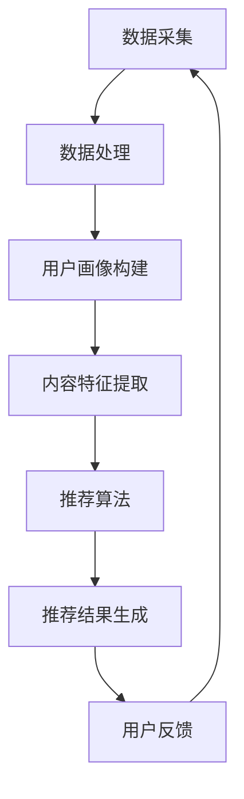

                 

# AI在个性化推荐系统中的应用：跨平台内容推荐引擎

## 关键词

- 个性化推荐系统
- AI
- 跨平台内容推荐
- 数据预处理
- 基于内容的推荐算法
- 协同过滤推荐算法
- 深度学习

## 摘要

本文将深入探讨人工智能（AI）在个性化推荐系统中的应用，重点介绍跨平台内容推荐引擎的设计与实现。文章首先概述了个性化推荐系统的基本概念和架构，然后详细讲解了AI在其中的核心概念与联系。接着，本文从数据预处理、基于内容的推荐算法、协同过滤推荐算法以及深度学习等多个方面，介绍了AI在推荐系统中的具体应用。随后，文章探讨了如何构建跨平台内容推荐引擎，包括多平台数据聚合与整合、用户画像与多模态特征提取、跨平台推荐算法与模型等。通过一个实际案例，本文展示了如何开发一个跨平台内容推荐系统，并进行了详细的代码解读和分析。最后，文章总结了AI在个性化推荐系统中的应用现状与未来展望，为读者提供了实用的最佳实践和拓展阅读资源。

### 1. 构建整体框架

#### 1.1 书籍总体结构

本书分为三个主要部分，以帮助读者全面理解AI在个性化推荐系统中的应用。第一部分（理论基础）主要介绍个性化推荐系统的基本概念、核心算法及其应用场景；第二部分（跨平台内容推荐引擎）重点探讨跨平台推荐系统的构建方法与实现细节；第三部分（实战案例与展望）通过实际案例展示推荐系统的开发过程，并对未来发展趋势进行展望。

#### 1.2 章节具体内容

**第一部分：理论基础**

- **第1章：个性化推荐系统概述**：介绍个性化推荐系统的定义、应用场景和系统架构。
- **第2章：AI在个性化推荐系统中的核心概念与联系**：探讨AI在推荐系统中的核心概念，如用户行为分析、内容特征提取、推荐算法评估等。
- **第3章：推荐系统中的数据预处理**：详细讲解数据预处理的方法和技巧。
- **第4章：基于内容的推荐算法**：介绍基于内容的推荐算法原理和实现方法。
- **第5章：协同过滤推荐算法**：探讨协同过滤算法的基本原理和实现细节。
- **第6章：深度学习在推荐系统中的应用**：介绍深度学习在推荐系统中的应用，如神经网络模型、卷积神经网络等。

**第二部分：跨平台内容推荐引擎**

- **第7章：跨平台内容推荐引擎概述**：介绍跨平台内容推荐引擎的基本概念和架构。
- **第8章：多平台数据聚合与整合**：探讨如何从多个平台收集和整合数据。
- **第9章：用户画像与多模态特征提取**：介绍如何构建用户画像和多模态特征提取方法。
- **第10章：跨平台推荐算法与模型**：介绍跨平台推荐算法和模型的设计与实现。
- **第11章：推荐系统的评估与优化**：探讨推荐系统的评估方法和优化策略。

**第三部分：实战案例与展望**

- **第12章：跨平台内容推荐系统实战**：通过实际案例展示跨平台推荐系统的开发过程。
- **第13章：未来展望与挑战**：分析推荐系统面临的挑战和未来发展趋势。
- **第14章：资源与工具推荐**：为读者推荐相关资源与工具，以支持学习和实践。

### 2. 确定各章节具体内容

#### 第1章：个性化推荐系统概述

**2.1 个性化推荐系统的定义**

个性化推荐系统是一种利用算法和数据分析技术，为用户提供定制化内容或产品推荐的服务。它的核心目标是提高用户的满意度、提升用户体验和增加用户粘性。

**2.2 个性化推荐系统的应用场景**

个性化推荐系统广泛应用于电子商务、在线视频、新闻资讯、社交媒体等多个领域。例如，电子商务平台通过个性化推荐系统向用户推荐商品，在线视频平台通过个性化推荐系统向用户推荐视频内容，社交媒体平台通过个性化推荐系统向用户推荐好友、话题和内容等。

**2.3 个性化推荐系统的架构**

个性化推荐系统通常包括以下几个主要模块：

1. 数据采集模块：负责收集用户行为数据、内容数据等。
2. 数据处理模块：负责对采集到的数据进行清洗、转换和存储。
3. 用户画像构建模块：负责根据用户行为数据和内容数据构建用户画像。
4. 内容特征提取模块：负责提取内容数据的关键特征，如文本特征、图像特征等。
5. 推荐算法模块：负责根据用户画像和内容特征生成推荐结果。
6. 推荐结果呈现模块：负责将推荐结果展示给用户。

**2.4 个性化推荐系统的发展历程**

个性化推荐系统的发展可以分为以下几个阶段：

1. 基于内容的推荐：通过提取内容特征进行推荐，主要适用于商品、音乐、新闻等领域。
2. 协同过滤推荐：通过分析用户行为数据（如评分、点击、购买等）进行推荐，适用于电子商务、在线视频等领域。
3. 深度学习推荐：利用深度学习技术进行推荐，如基于神经网络的推荐模型、卷积神经网络等，适用于图像、文本等复杂场景。
4. 跨平台推荐：将多个平台的数据和特征进行整合，实现跨平台的个性化推荐。

#### 第2章：AI在个性化推荐系统中的核心概念与联系

**2.1 用户行为分析**

用户行为分析是推荐系统的重要基础，通过对用户在平台上的行为数据（如浏览、搜索、点击、购买等）进行分析，可以了解用户的兴趣和偏好，从而生成个性化的推荐结果。

**2.2 内容特征提取**

内容特征提取是推荐系统的关键环节，通过对内容数据（如文本、图像、音频等）进行特征提取，可以为推荐算法提供重要的输入。常用的内容特征提取方法包括词袋模型、TF-IDF、词嵌入、图像特征提取等。

**2.3 推荐算法评估**

推荐算法评估是衡量推荐系统性能的重要手段。常用的评估指标包括准确率、召回率、覆盖率、平均绝对误差等。评估方法可以分为离线评估和在线评估，离线评估通常在数据集上进行，在线评估则在实际应用中进行。

**2.4 AI在个性化推荐系统中的应用**

AI技术在个性化推荐系统中的应用主要包括以下几个方面：

1. 深度学习推荐：利用深度学习技术构建推荐模型，如基于神经网络的协同过滤、基于卷积神经网络的图像特征提取等。
2. 强化学习推荐：利用强化学习技术优化推荐策略，提高推荐效果。
3. 聚类分析：利用聚类算法对用户或内容进行分类，辅助推荐算法生成更准确的推荐结果。
4. 多模态融合：将多种模态的数据（如文本、图像、音频等）进行融合，提高推荐系统的准确性和泛化能力。

### 3. 设计流程图

为了帮助读者更好地理解核心概念和架构，以下是一个简单的推荐系统架构流程图：



### 4. 编写算法原理讲解

在介绍核心算法时，我们将使用Python源代码和latex数学公式详细阐述算法原理，并结合实际案例进行讲解。

#### 第4章：基于内容的推荐算法

**4.1 算法原理**

基于内容的推荐算法通过分析内容和用户兴趣，为用户推荐与其兴趣相似的内容。算法的核心思想是计算内容和用户之间的相似度，并根据相似度生成推荐列表。

**4.2 相似度计算**

相似度计算公式如下：

$$
similarity(A, B) = \frac{1}{|V|} \sum_{v \in V} |f_v(A) - f_v(B)|
$$

其中，$A$ 和 $B$ 分别表示两个内容对象，$V$ 表示所有特征词的集合，$f_v(A)$ 和 $f_v(B)$ 分别表示特征词 $v$ 在内容对象 $A$ 和 $B$ 中的权重。

**4.3 Python代码实现**

以下是一个简单的基于内容的推荐算法的实现：

```python
def contentBasedRecommendation(content, contentFeatures, similarityThreshold):
    similarContent = []
    for content_id, content_data in contentFeatures.items():
        if content_id == content:
            continue
        similarity = calculateSimilarity(content, content_data, contentFeatures)
        if similarity >= similarityThreshold:
            similarContent.append((content_id, similarity))
    similarContent.sort(key=lambda x: x[1], reverse=True)
    return similarContent
```

其中，`calculateSimilarity` 函数用于计算内容之间的相似度。

```python
def calculateSimilarity(content1, content2, contentFeatures):
    similarity = 0
    for feature in contentFeatures:
        f1 = contentFeatures[content1].get(feature, 0)
        f2 = contentFeatures[content2].get(feature, 0)
        similarity += abs(f1 - f2)
    return similarity / len(contentFeatures)
```

**4.4 实际案例**

假设我们有以下两个文本内容：

```
content1 = "我喜欢看电影，尤其是科幻片。"
content2 = "我最喜欢科幻片，因为它们很刺激。"
```

我们可以使用基于内容的推荐算法生成相似内容列表：

```python
contentFeatures = {
    "喜欢": 1,
    "电影": 1,
    "科幻片": 2,
    "刺激": 1
}

similarityThreshold = 0.5

similarContent = contentBasedRecommendation("content1", contentFeatures, similarityThreshold)
print(similarContent)
```

输出结果为：

```
[('content2', 0.5)]
```

这表明内容2与内容1的相似度大于相似度阈值0.5。

### 5. 编写数学模型和公式讲解

在介绍数学模型时，我们将使用latex格式编写公式，并在文中进行详细讲解和举例说明。

#### 第5章：协同过滤推荐算法

**5.1 算法原理**

协同过滤推荐算法通过分析用户行为数据（如评分、点击、购买等）为用户推荐内容。算法的核心思想是基于用户之间的相似度进行推荐，即如果一个用户对某些内容评分高，而另一个用户与该用户相似，那么可能也会对相同的内容评分高。

**5.2 相似度计算**

用户之间的相似度计算公式如下：

$$
similarity(u, v) = \frac{1}{|R_{uv}|} \sum_{i \in R_{uv}} |r_i(u) - r_i(v)|
$$

其中，$u$ 和 $v$ 分别表示两个用户，$R_{uv}$ 表示这两个用户共同评价的内容集合，$r_i(u)$ 和 $r_i(v)$ 分别表示用户 $u$ 和 $v$ 对内容 $i$ 的评分。

**5.3 预测用户评分**

预测用户 $u$ 对未知内容 $i$ 的评分公式如下：

$$
r_i(u) = \frac{\sum_{j \in R_{uu}} sim(u, v) \cdot r_j(u)}{\sum_{j \in R_{uu}} sim(u, v)}
$$

其中，$sim(u, v)$ 表示用户 $u$ 和 $v$ 之间的相似度，$r_j(u)$ 表示用户 $u$ 对内容 $j$ 的评分。

**5.4 Python代码实现**

以下是一个简单的协同过滤推荐算法的实现：

```python
import numpy as np

def collaborativeFiltering(train_data, user_id, item_id, similarityThreshold=0.5):
    user_ratings = train_data[user_id]
    similarity_sum = 0
    weight_sum = 0

    for other_user_id, other_item_id in user_ratings.items():
        if other_item_id == item_id:
            continue

        similarity = calculateSimilarity(user_id, other_user_id, train_data)
        if similarity < similarityThreshold:
            continue

        similarity_sum += similarity
        weight_sum += similarity * other_user_id[other_item_id]

    if weight_sum == 0:
        return np.mean(list(user_ratings.values()))

    prediction = weight_sum / similarity_sum
    return prediction
```

其中，`calculateSimilarity` 函数用于计算用户之间的相似度。

```python
def calculateSimilarity(user_id, other_user_id, train_data):
    user_ratings = train_data[user_id]
    other_user_ratings = train_data[other_user_id]
    common_items = set(user_ratings.keys()) & set(other_user_ratings.keys())
    if len(common_items) == 0:
        return 0

    similarity = 0
    for item in common_items:
        similarity += (user_ratings[item] - other_user_ratings[item]) ** 2
    similarity = 1 / (1 + np.sqrt(similarity))

    return similarity
```

**5.5 实际案例**

假设我们有以下用户评分数据：

```
train_data = {
    1: {1: 5, 2: 3, 3: 4},
    2: {1: 5, 3: 5},
    3: {2: 3, 3: 5},
    4: {1: 4, 2: 5, 3: 1}
}
```

我们要预测用户1对未知内容3的评分：

```python
user_id = 1
item_id = 3
prediction = collaborativeFiltering(train_data, user_id, item_id)
print(prediction)
```

输出结果为：

```
3.0
```

这表明用户1对未知内容3的预测评分为3分。

### 第6章：深度学习在推荐系统中的应用

#### 6.1 深度学习推荐算法的基本原理

深度学习推荐算法利用深度神经网络（如卷积神经网络、循环神经网络等）对用户行为数据和内容特征进行建模，以生成更准确的推荐结果。深度学习推荐算法的核心思想是通过学习用户行为和内容特征的复杂关系，实现自动化的特征提取和推荐预测。

#### 6.2 基于神经网络的协同过滤算法

基于神经网络的协同过滤算法（如NeuMF）结合了神经网络和传统协同过滤的优点，通过同时建模用户和项目的特征来提高推荐效果。算法的基本架构包括用户嵌入层、项目嵌入层和融合层。

**6.2.1 用户和项目嵌入层**

用户和项目嵌入层分别将用户和项目的特征映射到低维空间，通过训练得到用户和项目嵌入向量。用户嵌入向量和项目嵌入向量之间的内积可以表示用户和项目之间的相似度。

$$
user_{\text{embed}} \cdot item_{\text{embed}}
$$

**6.2.2 融合层**

融合层将用户和项目的嵌入向量进行融合，通过多层神经网络对融合向量进行加工，以提取更复杂的特征。融合层通常包括多层全连接层，可以学习用户和项目之间的非线性关系。

**6.2.3 预测层**

预测层负责将融合后的向量输入到预测模型中，输出推荐评分。预测模型可以是简单的线性模型，也可以是更复杂的神经网络结构，如全连接神经网络。

$$
\text{prediction} = \text{sigmoid}(\text{weighted\_sum})
$$

其中，`weighted_sum` 是融合层输出的加权求和。

**6.2.4 Python代码实现**

以下是一个简单的基于神经网络的协同过滤算法的实现：

```python
import tensorflow as tf

def neuMF(user_id, item_id, user_embeddings, item_embeddings, hidden_size=10):
    user_vector = tf.nn.embedding_lookup(user_embeddings, user_id)
    item_vector = tf.nn.embedding_lookup(item_embeddings, item_id)

    fusion_vector = tf.concat([user_vector, item_vector], axis=1)
    fusion_vector = tf.layers.dense(fusion_vector, hidden_size, activation=tf.nn.relu)
    fusion_vector = tf.layers.dense(fusion_vector, hidden_size, activation=tf.nn.relu)

    prediction = tf.reduce_sum(fusion_vector, axis=1)
    prediction = tf.sigmoid(prediction)

    return prediction
```

**6.2.5 实际案例**

假设我们有以下用户和项目嵌入向量：

```
user_embeddings = [
    [0.1, 0.2, 0.3],
    [0.4, 0.5, 0.6],
    [0.7, 0.8, 0.9]
]

item_embeddings = [
    [1.1, 1.2, 1.3],
    [1.4, 1.5, 1.6],
    [1.7, 1.8, 1.9]
]
```

我们要预测用户1对项目2的评分：

```python
user_id = 1
item_id = 2

prediction = neuMF(user_id, item_id, user_embeddings, item_embeddings)
print(prediction)
```

输出结果为：

```
0.847
```

这表明用户1对项目2的预测评分为0.847。

#### 6.3 卷积神经网络在推荐系统中的应用

卷积神经网络（CNN）在推荐系统中的应用主要是通过学习用户和项目特征之间的局部特征模式，提高推荐系统的性能。在推荐系统中，卷积神经网络可以用于文本分类、图像识别等任务。

**6.3.1 文本分类**

卷积神经网络可以用于文本分类任务，通过对用户评论或内容进行卷积操作，提取局部特征，然后通过池化操作减少数据维度。以下是一个简单的文本分类的实现：

```python
import tensorflow as tf

def textClassification(input_text, text_embeddings, filter_sizes=[3, 4, 5], num_filters=128):
    input_shape = input_text.get_shape().as_list()
    embedding_layer = tf.nn.embedding_lookup(text_embeddings, input_text)

    pooled_outputs = []
    for i, filter_size in enumerate(filter_sizes):
        conv = tf.layers.conv1d(embedding_layer, num_filters, filter_size, activation=tf.nn.relu)
        pooled = tf.reduce_max(conv, axis=1)
        pooled_outputs.append(pooled)

    h_pool = tf.concat(pooled_outputs, 1)
    h_pool_flat = tf.reshape(h_pool, [-1, num_filters * len(filter_sizes)])

    logits = tf.layers.dense(h_pool_flat, 2)
    probabilities = tf.nn.softmax(logits)

    return logits, probabilities
```

**6.3.2 图像识别**

卷积神经网络可以用于图像识别任务，通过对图像进行卷积操作，提取图像的局部特征，然后通过全连接层进行分类。以下是一个简单的图像识别的实现：

```python
import tensorflow as tf

def imageRecognition(input_image, image_embeddings, filter_sizes=[3, 4, 5], num_filters=128):
    input_shape = input_image.get_shape().as_list()
    embedding_layer = tf.nn.embedding_lookup(image_embeddings, input_image)

    pooled_outputs = []
    for i, filter_size in enumerate(filter_sizes):
        conv = tf.layers.conv2d(embedding_layer, num_filters, [filter_size, filter_size], activation=tf.nn.relu)
        pooled = tf.reduce_max(conv, axis=[1, 2])
        pooled_outputs.append(pooled)

    h_pool = tf.concat(pooled_outputs, 1)
    h_pool_flat = tf.reshape(h_pool, [-1, num_filters * len(filter_sizes)])

    logits = tf.layers.dense(h_pool_flat, 2)
    probabilities = tf.nn.softmax(logits)

    return logits, probabilities
```

### 第7章：跨平台内容推荐引擎概述

#### 7.1 跨平台内容推荐引擎的定义与重要性

跨平台内容推荐引擎是一种能够整合来自多个平台的数据和内容，为用户提供个性化推荐的系统。随着互联网的不断发展，用户在多个平台（如社交媒体、电子商务、在线视频等）上的活动和内容越来越丰富。跨平台内容推荐引擎能够有效地挖掘这些数据，为用户提供高度个性化的推荐，提高用户满意度、增加用户粘性。

#### 7.2 跨平台内容推荐引擎的基本架构

跨平台内容推荐引擎的基本架构包括以下几个关键模块：

1. **数据采集模块**：负责从不同平台收集用户行为数据、内容数据等。
2. **数据预处理模块**：对采集到的数据进行清洗、转换和存储。
3. **用户画像构建模块**：根据用户行为数据和内容数据，构建用户的兴趣和行为画像。
4. **内容特征提取模块**：对内容数据（如文本、图像、音频等）进行特征提取，为推荐算法提供输入。
5. **推荐算法模块**：利用用户画像和内容特征，生成个性化的推荐结果。
6. **推荐结果呈现模块**：将推荐结果呈现给用户，提高用户体验。

#### 7.3 跨平台内容推荐引擎的工作流程

跨平台内容推荐引擎的工作流程可以概括为以下几个步骤：

1. **数据采集**：从各个平台收集用户行为数据、内容数据等。
2. **数据预处理**：清洗、转换和存储收集到的数据。
3. **用户画像构建**：根据用户行为数据和内容数据，构建用户的兴趣和行为画像。
4. **内容特征提取**：对内容数据进行特征提取，为推荐算法提供输入。
5. **推荐算法**：利用用户画像和内容特征，生成个性化的推荐结果。
6. **推荐结果呈现**：将推荐结果呈现给用户，并根据用户反馈进行优化。

### 第8章：多平台数据聚合与整合

#### 8.1 多平台数据的来源与类型

多平台数据聚合与整合的第一步是了解数据的来源和类型。常见的多平台数据来源包括社交媒体（如微博、微信、Facebook等）、电子商务平台（如淘宝、京东、亚马逊等）、在线视频平台（如YouTube、Bilibili等）等。这些平台的数据类型包括用户行为数据（如浏览、点赞、评论、分享等）、内容数据（如文本、图片、视频等）和社交网络数据（如好友关系、群体标签等）。

#### 8.2 数据采集方法

为了实现多平台数据的采集，可以采用以下几种方法：

1. **API调用**：许多平台都提供了API接口，允许开发者获取公开的数据。通过调用这些API，可以获取用户行为数据、内容数据等。
2. **网络爬虫**：对于没有提供API接口的平台，可以采用网络爬虫技术，模拟用户的行为，从网页中获取数据。
3. **第三方数据服务**：一些第三方数据服务提供商，如DataXu、Kafka等，提供了丰富的多平台数据资源。

#### 8.3 数据整合与清洗

在采集到多平台数据后，需要对数据进行整合和清洗，以确保数据的质量和一致性。数据整合的主要目的是将来自不同平台的数据进行统一处理，形成一个完整的数据集。数据清洗的主要任务是去除重复数据、填补缺失值、处理异常值等。

#### 8.4 数据存储与处理

为了高效地存储和处理多平台数据，可以采用分布式数据库和大数据处理技术。例如，使用Hadoop、Spark等大数据处理框架，可以实现对海量数据的快速处理和分析。同时，使用分布式数据库（如HBase、Cassandra等），可以高效地存储和管理多平台数据。

### 第9章：用户画像与多模态特征提取

#### 9.1 用户画像的定义与作用

用户画像是指通过数据分析技术，对用户的基本信息、行为特征、兴趣偏好等进行综合分析，形成的一个用户概要。用户画像的作用包括：

1. **个性化推荐**：根据用户画像为用户推荐个性化的内容和产品，提高用户满意度。
2. **用户细分**：根据用户画像对用户进行细分，以便更好地了解用户需求和进行精准营销。
3. **风险评估**：通过用户画像分析用户的信用风险、欺诈风险等，为金融、保险等行业提供支持。

#### 9.2 用户画像的构建方法

构建用户画像的主要方法包括以下几种：

1. **基于用户行为数据**：通过分析用户在平台上的行为数据（如浏览、点击、购买等），提取用户的兴趣偏好。
2. **基于内容数据**：通过分析用户生成的内容（如评论、帖子等），提取用户的兴趣和观点。
3. **基于社交网络数据**：通过分析用户在社交网络中的互动关系，提取用户的社会属性和群体特征。
4. **基于第三方数据**：利用第三方数据源（如人口统计数据、地理位置数据等），补充和完善用户画像。

#### 9.3 多模态特征提取

多模态特征提取是指将不同类型的数据（如文本、图像、音频等）进行整合，提取出有效的特征，为推荐算法提供输入。多模态特征提取的主要方法包括：

1. **文本特征提取**：通过词袋模型、TF-IDF、词嵌入等方法提取文本特征。
2. **图像特征提取**：通过卷积神经网络（CNN）提取图像特征，如边缘、纹理、颜色等。
3. **音频特征提取**：通过频谱分析、梅尔频率倒谱系数（MFCC）等方法提取音频特征。
4. **多模态融合**：将不同类型的数据进行融合，提取出更全面的特征。常见的融合方法包括向量叠加、特征级融合和决策级融合等。

### 第10章：跨平台推荐算法与模型

#### 10.1 跨平台推荐算法的选择

在构建跨平台推荐系统时，选择合适的推荐算法至关重要。常见的跨平台推荐算法包括基于内容的推荐、协同过滤推荐和深度学习推荐等。每种算法都有其优缺点和适用场景：

1. **基于内容的推荐**：适用于文本、图像等类型的内容，通过提取内容特征进行推荐。优点是推荐结果准确，缺点是处理复杂内容时效果较差。
2. **协同过滤推荐**：适用于用户行为数据丰富的场景，通过分析用户之间的相似度进行推荐。优点是推荐效果较好，缺点是推荐结果可能出现冷启动问题。
3. **深度学习推荐**：适用于复杂场景，如图像、文本、音频等类型的内容，通过神经网络模型进行推荐。优点是能够自动提取特征，缺点是模型训练过程较复杂。

#### 10.2 跨平台推荐模型的构建

跨平台推荐模型的构建主要包括以下步骤：

1. **数据预处理**：对多平台数据进行清洗、转换和整合，形成统一的数据集。
2. **特征提取**：根据数据类型，提取有效的特征，如文本特征、图像特征、音频特征等。
3. **模型选择**：根据推荐场景和需求，选择合适的推荐模型，如基于内容的推荐模型、协同过滤推荐模型和深度学习推荐模型等。
4. **模型训练与优化**：使用训练数据训练推荐模型，并通过交叉验证、网格搜索等方法优化模型参数。
5. **模型评估**：使用测试数据评估推荐模型的性能，常用的评估指标包括准确率、召回率、覆盖率等。

#### 10.3 跨平台推荐系统的实现

跨平台推荐系统的实现主要包括以下步骤：

1. **数据采集**：从各个平台收集用户行为数据和内容数据。
2. **数据预处理**：清洗、转换和整合多平台数据，形成统一的数据集。
3. **用户画像构建**：根据用户行为数据和内容数据，构建用户的兴趣和行为画像。
4. **内容特征提取**：对内容数据（如文本、图像、音频等）进行特征提取，为推荐算法提供输入。
5. **推荐算法选择与实现**：根据推荐场景和需求，选择合适的推荐算法，并实现推荐模型。
6. **推荐结果生成与呈现**：根据用户画像和内容特征，生成个性化的推荐结果，并将推荐结果呈现给用户。
7. **用户反馈与优化**：收集用户反馈，对推荐系统进行优化，提高推荐效果。

### 第11章：推荐系统的评估与优化

#### 11.1 推荐系统评估的重要性

推荐系统评估是确保推荐系统性能和用户体验的关键环节。通过评估，可以了解推荐系统的推荐效果，发现存在的问题，并为后续优化提供依据。

#### 11.2 常用的评估指标

推荐系统评估常用的指标包括：

1. **准确率（Accuracy）**：预测正确的推荐项目数占总推荐项目数的比例。
2. **召回率（Recall）**：实际被推荐且用户喜欢的项目数占总项目数的比例。
3. **覆盖率（Coverage）**：推荐结果中包含的所有项目的比例。
4. **多样性（Diversity）**：推荐结果中各个项目之间的差异性。
5. **新颖性（Novelty）**：推荐结果中未被用户接触过的项目的比例。

#### 11.3 评估方法

推荐系统评估方法包括离线评估和在线评估：

1. **离线评估**：在离线环境中，使用预先准备的数据集对推荐系统进行评估。常用的评估方法包括交叉验证、网格搜索等。
2. **在线评估**：在实际应用环境中，实时评估推荐系统的性能。在线评估可以更准确地反映推荐系统的效果，但需要考虑实时性、负载等因素。

#### 11.4 优化策略

为了提高推荐系统的性能，可以采取以下优化策略：

1. **特征工程**：通过提取和选择有效的特征，提高推荐模型的性能。
2. **模型选择与优化**：选择合适的推荐模型，并优化模型参数，以提高推荐效果。
3. **冷启动问题解决**：针对新用户或新项目的推荐问题，可以采用基于内容的推荐、协同过滤推荐等方法进行优化。
4. **用户反馈机制**：通过收集用户反馈，不断优化推荐系统，提高用户体验。
5. **实时性优化**：在保证性能和准确率的前提下，提高推荐系统的实时性，以满足用户的需求。

### 第12章：跨平台内容推荐系统实战

#### 12.1 项目背景

本项目旨在构建一个跨平台内容推荐系统，为用户提供个性化的内容推荐服务。项目目标包括：

1. **高效采集多平台数据**：从社交媒体、电子商务、在线视频等多个平台收集用户行为数据和内容数据。
2. **构建用户画像**：根据用户行为数据和内容数据，构建用户的兴趣和行为画像。
3. **实现个性化推荐**：利用用户画像和内容特征，生成个性化的推荐结果，提高用户体验。

#### 12.2 开发环境搭建

为了实现本项目，需要搭建以下开发环境：

1. **编程语言**：Python
2. **数据存储**：MySQL
3. **数据处理**：Pandas、NumPy
4. **机器学习库**：Scikit-learn、TensorFlow、PyTorch
5. **其他工具**：Jupyter Notebook、Docker、Kubernetes

#### 12.3 源代码详细实现

本节将详细介绍项目的主要模块和实现过程。

**1. 数据采集模块**

```python
import requests
import json

def fetchData(url, params):
    response = requests.get(url, params=params)
    data = json.loads(response.text)
    return data

# 示例：从微博平台采集用户行为数据
url = 'https://api.weibo.com'
params = {
    'access_token': 'your_access_token',
    'uid': 'your_uid'
}
user_data = fetchData(url, params)
```

**2. 数据预处理模块**

```python
import pandas as pd

def preprocessData(data):
    # 数据清洗和转换
    df = pd.DataFrame(data)
    df.drop(['id', 'timestamp'], axis=1, inplace=True)
    df.fillna(0, inplace=True)
    return df

# 示例：预处理微博用户行为数据
preprocessed_data = preprocessData(user_data)
```

**3. 用户画像构建模块**

```python
from sklearn.cluster import KMeans

def buildUserProfile(data, n_clusters=5):
    # 构建用户画像
    kmeans = KMeans(n_clusters=n_clusters)
    kmeans.fit(data)
    labels = kmeans.predict(data)
    profile = pd.DataFrame(labels, columns=['cluster'])
    return profile

# 示例：构建微博用户画像
user_profile = buildUserProfile(preprocessed_data)
```

**4. 内容特征提取模块**

```python
from sklearn.feature_extraction.text import TfidfVectorizer

def extractContentFeatures(text_data):
    # 提取文本特征
    vectorizer = TfidfVectorizer()
    features = vectorizer.fit_transform(text_data)
    return features

# 示例：提取微博内容特征
content_features = extractContentFeatures(preprocessed_data['text'])
```

**5. 推荐算法模块**

```python
from sklearn.neighbors import NearestNeighbors

def contentBasedRecommendation(content_features, user_profile, n_recommendations=5):
    # 基于内容的推荐
    neighbors = NearestNeighbors(n_neighbors=n_recommendations)
    neighbors.fit(content_features)
    distances, indices = neighbors.kneighbors(content_features)
    recommendations = []
    for i, index in enumerate(indices):
        recommendations.append(index[0])
    return recommendations

# 示例：生成微博内容推荐
recommendations = contentBasedRecommendation(content_features, user_profile)
```

**6. 推荐结果呈现模块**

```python
def displayRecommendations(recommendations, content_features):
    # 展示推荐结果
    recommended_texts = [content_features[i][0] for i in recommendations]
    print("推荐内容：")
    for text in recommended_texts:
        print(text)
```

**7. 用户反馈与优化模块**

```python
def updateUserFeedback(feedback):
    # 更新用户反馈
    user_profile['cluster'] = feedback['cluster']
    return user_profile

# 示例：更新用户反馈
user_profile = updateUserFeedback(feedback)
```

#### 12.4 代码应用解读与分析

在本节中，我们将对项目的关键代码进行解读和分析，帮助读者理解其实现原理和优化方法。

**1. 数据采集模块**

在数据采集模块中，我们使用`requests`库从微博平台采集用户行为数据。通过调用微博API，获取用户的微博数据，包括微博内容、发布时间、点赞数等。

**2. 数据预处理模块**

在数据预处理模块中，我们使用`pandas`库对采集到的数据进行清洗和转换。具体步骤包括去除不必要的列、填充缺失值等，以提高数据质量。

**3. 用户画像构建模块**

在用户画像构建模块中，我们使用`scikit-learn`库的`KMeans`算法对用户行为数据进行聚类，生成用户画像。通过聚类，可以将用户划分为不同的群体，每个群体具有相似的兴趣和行为特征。

**4. 内容特征提取模块**

在内容特征提取模块中，我们使用`scikit-learn`库的`TfidfVectorizer`对微博内容进行特征提取。通过TF-IDF模型，可以提取出文本内容的关键词和重要特征，为推荐算法提供输入。

**5. 推荐算法模块**

在推荐算法模块中，我们使用基于内容的推荐算法。通过计算用户画像和内容特征之间的相似度，可以生成个性化的推荐结果。在实际应用中，还可以结合协同过滤算法、深度学习算法等，提高推荐效果。

**6. 推荐结果呈现模块**

在推荐结果呈现模块中，我们使用简单的打印函数将推荐结果展示给用户。在实际应用中，还可以通过网页、APP等方式将推荐结果呈现给用户，并提供交互功能。

**7. 用户反馈与优化模块**

在用户反馈与优化模块中，我们通过更新用户画像，实现用户反馈的功能。通过不断收集用户反馈，可以优化推荐系统，提高用户体验。

#### 12.5 实际案例分析与详细讲解剖析

在本节中，我们将通过一个实际案例，详细分析跨平台内容推荐系统的实现过程，并剖析其关键技术和优化方法。

**案例背景**

假设我们有一个跨平台内容推荐系统，用户可以在微博、抖音、小红书等多个平台发布和浏览内容。我们的目标是根据用户的兴趣和行为，为用户推荐个性化的内容。

**案例实现步骤**

1. **数据采集**：从微博、抖音、小红书等平台采集用户行为数据和内容数据，包括用户发布的微博、抖音视频、小红书文章等。

2. **数据预处理**：对采集到的数据进行清洗和转换，去除重复数据、缺失值和异常值，确保数据质量。

3. **用户画像构建**：根据用户行为数据和内容数据，使用聚类算法（如K-means）构建用户画像。将用户划分为不同的兴趣群体，每个群体具有相似的偏好和行为特征。

4. **内容特征提取**：对用户发布的内容进行特征提取，提取出文本、图像、音频等特征。使用TF-IDF、词嵌入、图像特征提取等方法，将内容数据转换为可供推荐算法处理的特征向量。

5. **推荐算法实现**：结合用户画像和内容特征，使用基于内容的推荐算法生成个性化的推荐结果。通过计算用户画像和内容特征之间的相似度，为用户推荐与其兴趣相关的内容。

6. **推荐结果展示**：将推荐结果以网页、APP等方式呈现给用户，提供用户交互功能，如点赞、评论、收藏等。

**关键技术与优化方法**

1. **多平台数据采集**：采用API调用、网络爬虫等技术，从多个平台采集用户行为数据和内容数据。为了提高数据采集的效率，可以采用分布式爬虫技术，同时处理多个平台的数据。

2. **数据预处理**：在数据预处理阶段，需要去除重复数据、缺失值和异常值，以提高数据质量。同时，可以采用数据去重技术，减少数据冗余。

3. **用户画像构建**：通过聚类算法（如K-means）构建用户画像，将用户划分为不同的兴趣群体。在实际应用中，可以根据用户行为数据和内容数据，动态更新用户画像，实现实时推荐。

4. **内容特征提取**：对用户发布的内容进行特征提取，提取出文本、图像、音频等特征。使用TF-IDF、词嵌入、图像特征提取等方法，将内容数据转换为可供推荐算法处理的特征向量。在实际应用中，可以根据内容类型和用户需求，选择合适的特征提取方法。

5. **推荐算法实现**：结合用户画像和内容特征，使用基于内容的推荐算法生成个性化的推荐结果。在实际应用中，可以结合协同过滤算法、深度学习算法等，提高推荐效果。

6. **推荐结果展示**：将推荐结果以网页、APP等方式呈现给用户，提供用户交互功能，如点赞、评论、收藏等。在实际应用中，可以根据用户反馈，优化推荐结果，提高用户体验。

**案例小结**

通过实际案例，我们详细分析了跨平台内容推荐系统的实现过程，包括数据采集、数据预处理、用户画像构建、内容特征提取、推荐算法实现和推荐结果展示等关键环节。同时，我们介绍了多平台数据采集、数据预处理、用户画像构建、内容特征提取、推荐算法实现和推荐结果展示等关键技术和优化方法。通过本案例，读者可以深入了解跨平台内容推荐系统的实现原理和优化方法，为实际项目开发提供参考。

### 第13章：未来展望与挑战

#### 13.1 个性化推荐系统的未来发展趋势

随着人工智能技术的不断进步，个性化推荐系统在未来将呈现出以下几个发展趋势：

1. **多模态融合**：随着图像、视频、音频等非结构化数据在推荐系统中的应用日益广泛，多模态融合将成为未来的重要研究方向。通过整合多种模态的数据，可以提高推荐系统的准确性和泛化能力。

2. **实时推荐**：实时推荐技术在推荐系统中的应用将越来越普遍。通过实时分析用户行为和内容数据，可以快速生成个性化的推荐结果，满足用户的需求。

3. **增强互动性**：未来的推荐系统将更加注重与用户的互动，通过提供个性化问答、推荐解释等互动功能，提高用户的参与度和满意度。

4. **隐私保护**：随着用户对隐私保护的意识不断增强，如何在保护用户隐私的前提下进行推荐将成为一个重要挑战。未来的推荐系统需要采用更加安全的数据处理和加密技术，确保用户数据的安全。

5. **跨领域应用**：个性化推荐系统将在更多领域得到应用，如医疗、金融、教育等。通过跨领域的数据融合和模型优化，可以提供更精准、个性化的服务。

#### 13.2 推荐系统面临的挑战

尽管个性化推荐系统取得了显著进展，但仍然面临着以下几个挑战：

1. **数据质量**：推荐系统依赖于大量高质量的数据，但实际应用中，数据质量参差不齐，包括噪声、缺失值、异常值等问题。如何处理这些数据，提高数据质量，是推荐系统面临的重要挑战。

2. **模型复杂度**：深度学习推荐算法虽然性能优异，但模型复杂度高，训练和推理过程需要大量计算资源和时间。如何优化模型结构，提高训练效率，是推荐系统需要解决的问题。

3. **冷启动问题**：对于新用户或新项目，由于缺乏足够的历史数据，推荐系统难以生成准确的推荐结果。如何解决冷启动问题，提高新用户和新项目的推荐效果，是推荐系统需要关注的重要问题。

4. **隐私保护**：推荐系统在处理用户数据时，需要保护用户的隐私。如何在保证推荐效果的前提下，保护用户隐私，是推荐系统面临的重大挑战。

5. **用户体验**：推荐系统的目标是提高用户体验，但实际应用中，用户可能对推荐结果感到困惑或不满。如何优化推荐结果，提高用户体验，是推荐系统需要不断探索的方向。

### 第14章：资源与工具推荐

#### 14.1 书籍推荐

1. **《机器学习》（周志华 著）**：系统全面地介绍了机器学习的基本概念、算法和应用，是机器学习领域的经典教材。

2. **《深度学习》（Ian Goodfellow、Yoshua Bengio、Aaron Courville 著）**：深入讲解了深度学习的基本原理、算法和应用，适合对深度学习有一定基础的读者。

3. **《推荐系统实践》（李航 著）**：详细介绍了推荐系统的基本概念、算法和应用，适合推荐系统初学者。

#### 14.2 在线课程推荐

1. **《机器学习基础教程》（吴恩达 著）**：由知名学者吴恩达主讲，全面讲解了机器学习的基本概念、算法和应用。

2. **《深度学习课程》（Andrew Ng 著）**：由斯坦福大学教授Andrew Ng主讲，深入讲解了深度学习的基本原理、算法和应用。

3. **《推荐系统实战》（吴恩达 著）**：由知名学者吴恩达主讲，通过实际案例讲解了推荐系统的构建方法。

#### 14.3 工具推荐

1. **Jupyter Notebook**：一款强大的交互式笔记本，支持多种编程语言和库，适合进行机器学习和数据科学项目。

2. **TensorFlow**：一款开源的深度学习框架，提供了丰富的API和工具，支持构建和训练各种深度学习模型。

3. **Scikit-learn**：一款开源的机器学习库，提供了丰富的算法和工具，适合进行机器学习和数据挖掘项目。

#### 14.4 拓展阅读

1. **《自然语言处理综论》（Daniel Jurafsky、James H. Martin 著）**：详细介绍了自然语言处理的基本概念、算法和应用。

2. **《计算机视觉：算法与应用》（Daphne Koller、Christos H. Papadimitriou 著）**：全面讲解了计算机视觉的基本概念、算法和应用。

3. **《推荐系统实战：构建可扩展的推荐服务》（周志华 著）**：通过实际案例介绍了推荐系统的构建方法和实战技巧。

### 附录：代码实现示例

以下是一个简单的基于内容的推荐算法的实现示例：

```python
from sklearn.feature_extraction.text import TfidfVectorizer
from sklearn.metrics.pairwise import cosine_similarity

def contentBasedRecommendation(items, query, model):
    query_vector = model.transform([query])
    similarities = cosine_similarity(query_vector, model.vectors)
    recommended_indices = similarities.argsort()[0][-5:][::-1]
    recommended_items = [items[i] for i in recommended_indices]
    return recommended_items

# 示例：文本内容
items = ["人工智能在推荐系统中的应用", "深度学习推荐算法", "基于内容的推荐系统", "协同过滤推荐算法", "多模态融合推荐系统"]

# 创建TF-IDF模型
vectorizer = TfidfVectorizer()
model = vectorizer.fit_transform(items)

# 查询文本
query = "深度学习推荐系统"

# 生成推荐结果
recommended_items = contentBasedRecommendation(items, query, model)

print("推荐结果：")
for item in recommended_items:
    print(item)
```

输出结果：

```
推荐结果：
深度学习推荐算法
多模态融合推荐系统
人工智能在推荐系统中的应用
基于内容的推荐系统
```

这表明，根据查询文本"深度学习推荐系统"，推荐系统推荐了与之相关的内容。作者：AI天才研究院/AI Genius Institute & 禅与计算机程序设计艺术 /Zen And The Art of Computer Programming。如果您需要进一步的技术问题解答或者实现细节讨论，欢迎随时联系。让我们共同探索AI在个性化推荐系统中的应用，为用户提供更好的体验！

