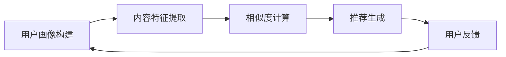

                 

### 文章标题

《AI在个性化新闻推荐中的应用：提供定制化信息流》

### 关键词

人工智能、个性化推荐、新闻推荐系统、协同过滤、基于内容的推荐、矩阵分解、深度学习、定制化信息流

### 摘要

本文深入探讨了人工智能在个性化新闻推荐领域的应用，分析了其基本流程、核心概念、算法原理以及数学模型。通过具体的案例分析和项目实战，本文展示了如何构建一个定制化的信息流系统，为用户提供了更为精准和个性化的新闻内容。文章还探讨了个性化新闻推荐的重要性及其对用户信息消费习惯和社会舆论的影响，并对未来技术的发展趋势进行了展望。

### 引言

#### AI与个性化新闻推荐概述

人工智能（AI）作为一种强大的技术，已经在许多领域取得了显著的成果。特别是在互联网和信息时代，AI的应用场景愈发广泛，其中个性化新闻推荐是一个重要的领域。个性化新闻推荐系统通过分析用户的行为数据和内容特征，为用户提供定制化的新闻信息，从而提升用户体验和满意度。

个性化新闻推荐系统的基本概念包括用户画像、内容特征提取、相似度计算和推荐生成等。这些组件共同构成了一个复杂的推荐流程，使得系统能够根据用户兴趣和行为模式推荐相关的新闻内容。

个性化新闻推荐在信息传播中的作用不可忽视。首先，它能够提高新闻传播的效率，使高质量的内容能够快速触达目标用户。其次，它有助于降低信息过载，使用户能够从海量的信息中筛选出感兴趣的内容。最后，个性化推荐还能影响用户的信息消费习惯，培养用户的个性化需求，从而推动媒体内容的生产和优化。

#### 书籍目的与结构介绍

本文旨在通过系统的分析和讲解，帮助读者深入了解个性化新闻推荐领域的核心概念、算法原理和实践应用。具体来说，本文将分为以下几个部分：

1. **引言**：介绍AI与个性化新闻推荐的基本概念和背景。
2. **核心概念与联系**：详细解释推荐系统的基本组成部分，如用户画像、内容特征提取、相似度计算等，并使用Mermaid流程图展示整个推荐流程。
3. **核心算法原理讲解**：深入探讨协同过滤、基于内容的推荐、矩阵分解和深度学习等核心算法的原理，结合Python源代码和数学模型进行详细讲解。
4. **数学模型和公式讲解**：介绍推荐系统中使用的数学模型和公式，包括矩阵运算、优化算法、概率分布等。
5. **项目实战**：通过一个实际的个性化新闻推荐系统开发项目，展示如何从零开始搭建开发环境、处理数据、选择模型、训练和评估系统。
6. **案例分析**：分析不同的个性化新闻推荐案例，讨论其优势、挑战和实际效果。
7. **总结与展望**：总结文章的主要观点和贡献，展望个性化新闻推荐技术的发展趋势和应用前景。

通过以上结构，本文希望能够为读者提供一个全面、深入且实用的个性化新闻推荐系统指南。

#### 个性化新闻推荐的重要性与影响

个性化新闻推荐在现代社会中的重要性日益凸显。首先，它极大地提升了新闻传播的效率。在传统的新闻推荐方式中，新闻内容往往采用“广撒网”的策略，无法精确地触达目标用户。而个性化推荐系统则通过分析用户的行为数据，如浏览历史、点击行为和搜索记录等，能够精准地将高质量新闻内容推荐给用户，从而提高了信息传播的精准度和效果。

其次，个性化新闻推荐有助于降低信息过载问题。随着互联网信息的爆炸性增长，用户面临的信息量远超其处理能力。个性化推荐系统通过对用户兴趣和需求的精准把握，能够将用户可能感兴趣的新闻内容筛选出来，避免用户在海量信息中迷失方向，提高了信息消费的效率和满意度。

此外，个性化新闻推荐还对社会舆论产生了深远影响。通过推荐系统，媒体内容的生产和分发更加智能化，能够更好地满足用户的个性化需求，从而影响用户的认知和行为。例如，某些热点话题和争议性话题可能会因为个性化推荐而被反复推送，进一步强化用户的观点和立场，进而影响社会舆论的走向。

综上所述，个性化新闻推荐不仅提升了新闻传播的效率，降低了信息过载，还对社会舆论产生了重要影响。随着人工智能技术的不断发展，个性化新闻推荐的应用前景将更加广阔，其在信息传播和社会治理中的角色也将愈加重要。

### 核心概念与联系

个性化新闻推荐系统的核心概念包括用户画像、内容特征提取、相似度计算和推荐生成等。这些概念共同构成了推荐系统的基本组成部分，并相互联系，共同作用于整个推荐过程。

#### 用户画像

用户画像是指通过对用户的历史行为数据进行分析和挖掘，构建出一个关于用户兴趣、偏好、行为特征的综合描述。用户画像包括多个维度，如年龄、性别、地理位置、浏览历史、搜索记录、点击行为等。这些数据可以通过数据挖掘、机器学习和自然语言处理等技术手段获得。

用户画像的构建是个性化新闻推荐的基础。通过用户画像，系统能够了解每个用户的特定需求和兴趣点，从而为推荐算法提供输入。例如，一个用户如果经常浏览体育新闻，那么系统可能会推断他对于体育类的新闻更感兴趣，并在推荐时给予更高的权重。

#### 内容特征提取

内容特征提取是指从新闻内容中提取出关键信息，如标题、摘要、关键词、主题等。这些特征将用于描述新闻的内容属性，以便推荐算法能够根据这些特征进行匹配和推荐。

内容特征提取的准确性直接影响推荐系统的效果。常用的特征提取方法包括基于关键词的提取、基于文本分类的提取、基于自然语言处理的技术等。例如，通过自然语言处理技术，可以提取出新闻中的关键词和主题标签，从而更好地描述新闻的内容特征。

#### 相似度计算

相似度计算是指计算用户与新闻之间的相似度，以确定哪些新闻内容最适合推荐给用户。相似度计算是推荐算法的核心步骤，常用的方法包括协同过滤、基于内容的推荐、矩阵分解和深度学习等。

协同过滤方法通过计算用户之间的相似度来推荐新闻，即如果两个用户在某个新闻上偏好一致，那么系统会推测他们可能也会对其他新闻有相同的偏好。基于内容的推荐方法则是通过计算新闻之间的相似度来进行推荐，即如果两篇新闻内容相似，那么系统会认为它们可能满足同一用户的兴趣。

#### 推荐生成

推荐生成是指根据相似度计算的结果，生成最终推荐列表。推荐生成算法需要考虑推荐列表的多样性、新颖性和相关性，以确保用户能够从推荐中获取到高质量的信息。

常用的推荐生成方法包括基于Top-N的推荐、基于优先级的推荐和基于用户行为的动态推荐等。例如，基于Top-N的推荐算法会从所有可能的新闻中选取排名前N的新闻推荐给用户，而基于优先级的推荐算法则会根据用户历史行为和新闻特征为每条新闻分配一个优先级，并根据优先级生成推荐列表。

#### Mermaid流程图展示

为了更直观地展示个性化新闻推荐系统的基本流程和架构，我们可以使用Mermaid流程图进行说明。以下是推荐系统的主要流程：



在这个流程图中，用户画像构建、内容特征提取、相似度计算和推荐生成构成了推荐系统的核心流程，而用户反馈则作为一个循环反馈环节，不断优化和改进推荐系统的性能。

通过用户画像构建，系统可以了解每个用户的兴趣和偏好；通过内容特征提取，系统能够描述新闻的内容属性；相似度计算则帮助系统判断哪些新闻与用户兴趣最匹配；推荐生成最终生成一个个性化的新闻推荐列表。用户在阅读新闻后，通过反馈行为，如点赞、评论、分享等，进一步优化用户画像和推荐算法，形成了一个闭环的推荐系统。

### 主要概念联系与整合

个性化新闻推荐系统的各个核心概念紧密相连，共同构成了一个完整的推荐流程。以下是这些概念之间的联系和整合：

首先，用户画像构建是整个推荐系统的基础。通过用户的行为数据，如浏览历史、点击记录等，系统可以构建出每个用户的兴趣偏好模型。这些用户画像不仅用于当前新闻的推荐，还会随着用户行为的不断积累和更新，持续优化推荐效果。

其次，内容特征提取是用户画像与新闻内容之间的桥梁。通过对新闻内容的深入分析，如提取关键词、主题标签等，系统能够将新闻内容与用户的兴趣模型进行匹配。这一步骤的准确性直接影响到推荐系统的效果。

相似度计算是推荐系统的心脏。通过计算用户与新闻之间的相似度，系统可以确定哪些新闻最适合推荐给用户。相似度的计算方法多种多样，包括协同过滤、基于内容的推荐、矩阵分解和深度学习等。每种方法都有其独特的优势和应用场景，系统通常会根据实际需求组合使用这些方法，以实现最佳的推荐效果。

推荐生成是推荐系统的最终输出。在这一步骤中，系统根据相似度计算的结果，生成一个个性化的新闻推荐列表。推荐生成的算法需要考虑多样性、新颖性和相关性，以确保推荐内容既能满足用户的个性化需求，又能保持一定的丰富性和趣味性。

用户反馈是一个关键的循环环节。用户在阅读新闻后，会通过点赞、评论、分享等行为反馈其兴趣和偏好。这些反馈数据会被系统记录并用于更新用户画像和推荐算法，形成一个持续的优化过程。通过用户反馈，系统可以不断调整和优化推荐策略，提高推荐质量。

综上所述，个性化新闻推荐系统的核心概念通过用户画像、内容特征提取、相似度计算和推荐生成紧密联系在一起，形成了一个高效、智能的推荐流程。每个步骤都相互依赖、相互影响，共同作用，以实现个性化推荐的目标。

#### 核心算法原理讲解

在个性化新闻推荐系统中，算法的选择和实现是决定推荐效果的关键因素。本文将详细介绍几种核心推荐算法的原理，包括协同过滤、基于内容的推荐、矩阵分解和深度学习等，并通过Python源代码和数学模型进行详细讲解。

##### 协同过滤算法

协同过滤（Collaborative Filtering）是一种基于用户行为数据的推荐算法，其核心思想是通过分析用户之间的相似性来推荐商品或内容。协同过滤分为两种类型：基于用户的协同过滤（User-based Collaborative Filtering）和基于物品的协同过滤（Item-based Collaborative Filtering）。

**基于用户的协同过滤**算法通过计算用户之间的相似度，找到与目标用户兴趣相似的邻居用户，并推荐这些邻居用户喜欢的商品或内容。计算用户相似度常用的方法是余弦相似度和皮尔逊相关系数。

以下是一个基于用户的协同过滤算法的Python示例代码：

```python
import numpy as np

# 用户和物品评分矩阵
ratings = np.array([[5, 3, 0, 1], [2, 0, 3, 4], [1, 2, 0, 5]])

# 计算用户之间的相似度（使用余弦相似度）
def cosine_similarity(ratings):
    similarity_matrix = []
    for i in range(len(ratings)):
        row_similarity = []
        for j in range(len(ratings)):
            if i != j:
                dot_product = np.dot(ratings[i], ratings[j])
                norm_i = np.linalg.norm(ratings[i])
                norm_j = np.linalg.norm(ratings[j])
                similarity = dot_product / (norm_i * norm_j)
                row_similarity.append(similarity)
            else:
                row_similarity.append(0)
        similarity_matrix.append(row_similarity)
    return np.array(similarity_matrix)

similarity_matrix = cosine_similarity(ratings)

# 推荐算法
def user_based_recommender(ratings, similarity_matrix, user_index, k=5):
    neighbor_indices = np.argsort(similarity_matrix[user_index])[-k:]
    neighbor_scores = ratings[neighbor_indices]
    average_score = np.mean(neighbor_scores)
    return average_score

# 测试推荐
print(user_based_recommender(ratings, similarity_matrix, user_index=0))
```

**基于物品的协同过滤**算法通过计算物品之间的相似度，找到与目标物品相似的物品，并推荐这些物品。这种方法也适用于新闻推荐，通过计算新闻之间的相似度来推荐相似的内容。

##### 基于内容的推荐算法

基于内容的推荐（Content-based Recommender）算法通过分析新闻的内容特征，如关键词、主题标签等，为用户推荐与其兴趣相关的新闻。这种方法的核心思想是利用新闻的内容属性进行相似度计算，从而生成推荐列表。

以下是一个基于内容的推荐算法的Python示例代码：

```python
# 假设我们有一组新闻内容及其关键词
news_content = {'news1': ['体育', '篮球', 'NBA'], 'news2': ['科技', '人工智能', 'AI'], 'news3': ['娱乐', '电影', '明星']}
user_interests = ['体育', '篮球']

# 计算新闻之间的相似度（使用Jaccard相似度）
def jaccard_similarity(set1, set2):
    intersection = len(set1.intersection(set2))
    union = len(set1.union(set2))
    return intersection / union

similarity_scores = []
for news1 in news_content:
    for news2 in news_content:
        if news1 != news2:
            similarity = jaccard_similarity(set(news_content[news1]), set(news_content[news2]))
            similarity_scores.append((news1, news2, similarity))

# 根据用户兴趣生成推荐列表
def content_based_recommender(news_content, user_interests, k=3):
    interest_sets = [set(news_content[news]) for news in news_content if any(i in news for i in user_interests)]
    sorted_similarities = sorted(similarity_scores, key=lambda x: x[2], reverse=True)
    recommended_news = []
    for news1, news2, _ in sorted_similarities:
        if any(i in news_content[news1] for i in user_interests) and news1 not in recommended_news:
            recommended_news.append(news1)
        if len(recommended_news) == k:
            break
    return recommended_news

print(content_based_recommender(news_content, user_interests))
```

##### 矩阵分解算法

矩阵分解（Matrix Factorization）算法通过将用户-物品评分矩阵分解为两个低秩矩阵，从而实现推荐。常见的矩阵分解算法包括Singular Value Decomposition（SVD）和Latent Factor Analysis（LFA）。

以下是一个基于SVD的矩阵分解算法的Python示例代码：

```python
from sklearn.decomposition import TruncatedSVD

# 假设我们有一个用户-物品评分矩阵
ratings = np.array([[5, 3, 0, 1], [2, 0, 3, 4], [1, 2, 0, 5]])

# 使用SVD进行矩阵分解
svd = TruncatedSVD(n_components=2)
U = svd.fit_transform(ratings)
V = svd.inverse_transform(U)

# 推荐算法
def matrix_factorization_recommender(ratings, U, V, user_index, item_index):
    user_factor = U[user_index]
    item_factor = V[:, item_index]
    predicted_rating = np.dot(user_factor, item_factor)
    return predicted_rating

# 测试推荐
print(matrix_factorization_recommender(ratings, U, V, user_index=0, item_index=1))
```

##### 深度学习算法

深度学习（Deep Learning）算法在个性化新闻推荐中有着广泛的应用，常见的模型包括卷积神经网络（CNN）、循环神经网络（RNN）和变压器（Transformer）等。

以下是一个基于RNN的新闻推荐模型的Python示例代码：

```python
import tensorflow as tf
from tensorflow.keras.models import Sequential
from tensorflow.keras.layers import LSTM, Dense, Embedding

# 假设我们有一个新闻序列和用户兴趣序列
news_sequence = '体育篮球NBA'
user_interests = '体育'

# 创建序列词典
word2idx = {'体育': 0, '篮球': 1, 'NBA': 2}
idx2word = {v: k for k, v in word2idx.items()}
sequence = [word2idx[word] for word in news_sequence]

# 建立模型
model = Sequential([
    Embedding(len(word2idx) + 1, 32),
    LSTM(32),
    Dense(1, activation='sigmoid')
])

model.compile(optimizer='adam', loss='binary_crossentropy', metrics=['accuracy'])

# 训练模型
model.fit(sequence, np.array([1]), epochs=10)

# 推荐新闻
predicted_news = model.predict(np.array([sequence]))
predicted_words = [idx2word[idx] for idx in predicted_news[0]]
print('推荐新闻：'.join(predicted_words))
```

通过以上示例代码，我们可以看到不同推荐算法的实现原理和具体步骤。每种算法都有其独特的优势和适用场景，在实际应用中，通常会根据具体需求组合使用多种算法，以实现最佳推荐效果。

#### 数学模型和公式讲解

在个性化新闻推荐系统中，数学模型和公式是算法实现和优化的重要基础。以下将介绍一些常用的数学模型和公式，包括相关性度量、相似度计算和优化目标。

##### 相关性度量

相关性度量用于衡量两个变量之间的相关性，常用的方法包括皮尔逊相关系数和斯皮尔曼等级相关系数。皮尔逊相关系数适用于线性关系，而斯皮尔曼等级相关系数则适用于非线性关系。

皮尔逊相关系数公式如下：
$$
r = \frac{\sum_{i=1}^{n}(x_i - \overline{x})(y_i - \overline{y})}{\sqrt{\sum_{i=1}^{n}(x_i - \overline{x})^2 \sum_{i=1}^{n}(y_i - \overline{y})^2}}
$$
其中，$x_i$和$y_i$分别是用户$i$对物品$i$的评分，$\overline{x}$和$\overline{y}$分别是所有用户对物品$i$的评分的平均值。

##### 相似度计算

在协同过滤算法中，相似度计算是核心步骤，常用的相似度计算方法包括余弦相似度和Jaccard相似度。

余弦相似度公式如下：
$$
\cos \theta = \frac{\sum_{i=1}^{n} x_i y_i}{\sqrt{\sum_{i=1}^{n} x_i^2 \sum_{i=1}^{n} y_i^2}}
$$
其中，$x_i$和$y_i$分别是用户$i$对物品$i$的评分。

Jaccard相似度公式如下：
$$
J(A, B) = \frac{|A \cap B|}{|A \cup B|}
$$
其中，$A$和$B$分别是两个集合的交集和并集。

##### 优化目标

在矩阵分解算法中，优化目标是通过学习低维向量表示来预测用户对物品的评分。常用的优化目标是最小化预测评分与实际评分之间的误差。

基于最小二乘法的优化目标如下：
$$
\min \sum_{i=1}^{m} \sum_{j=1}^{n} (r_{ij} - \hat{r}_{ij})^2
$$
其中，$r_{ij}$是用户$i$对物品$j$的实际评分，$\hat{r}_{ij}$是预测的评分。

##### 概率分布

在深度学习算法中，概率分布是预测的基础。例如，在循环神经网络（RNN）中，可以使用softmax函数将输出转化为概率分布。

softmax函数如下：
$$
\text{softmax}(x)_i = \frac{e^x_i}{\sum_{j=1}^{K} e^{x_j}}
$$
其中，$x_i$是输出神经元的值，$K$是输出类别数。

##### 矩阵运算

矩阵分解中的矩阵运算包括矩阵乘法和矩阵求逆等。例如，在SVD（奇异值分解）中，原始矩阵$R$可以被分解为$U \Sigma V^T$，其中$U$和$V$是正交矩阵，$\Sigma$是对角矩阵。

矩阵乘法公式如下：
$$
C = AB
$$
其中，$C$是结果矩阵，$A$和$B$是输入矩阵。

矩阵求逆公式如下：
$$
A^{-1} = \frac{1}{\det(A)} \text{adj}(A)
$$
其中，$\det(A)$是矩阵$A$的行列式，$\text{adj}(A)$是矩阵$A$的伴随矩阵。

通过以上数学模型和公式的介绍，我们可以更好地理解和实现个性化新闻推荐系统中的算法。在实际应用中，这些数学模型和公式可以帮助我们优化推荐效果，提升用户体验。

#### 项目实战

在本节中，我们将通过一个实际的个性化新闻推荐系统开发项目，展示如何从零开始搭建开发环境、处理数据、选择模型、训练和评估系统。通过这一项目，读者可以了解个性化新闻推荐系统的实现细节，并掌握实际操作的方法。

##### 项目背景与目标

假设我们正在开发一个新闻推荐平台，目标是为用户推荐他们可能感兴趣的新闻内容。为了实现这一目标，我们需要以下几个步骤：

1. **数据采集与预处理**：收集新闻数据集，并进行清洗和预处理。
2. **开发环境搭建**：配置所需的开发环境，包括编程语言、库和工具。
3. **数据预处理**：将原始数据转换为适合模型训练的形式。
4. **模型选择与训练**：选择合适的推荐算法，并训练模型。
5. **评估与优化**：评估推荐系统的性能，并进行优化。
6. **部署与运维**：将推荐系统部署到生产环境中，并进行持续运维。

##### 开发环境搭建

首先，我们需要搭建开发环境。在本项目中，我们将使用Python作为主要编程语言，并利用一些常用的库和工具，如NumPy、Pandas、Scikit-learn和TensorFlow。以下是具体步骤：

1. **安装Python**：确保已经安装了Python 3.x版本。
2. **安装库和工具**：
    ```bash
    pip install numpy pandas scikit-learn tensorflow
    ```

##### 数据采集与预处理

新闻数据的来源可以是公开的数据集，如新浪新闻、凤凰新闻等，或者使用爬虫工具从网站上抓取。以下是数据预处理的主要步骤：

1. **数据收集**：从新闻网站或数据集中获取新闻数据。
2. **数据清洗**：去除重复、缺失和不相关的数据。
    ```python
    import pandas as pd

    # 加载新闻数据
    news_data = pd.read_csv('news_data.csv')

    # 去除重复数据
    news_data.drop_duplicates(inplace=True)

    # 去除缺失数据
    news_data.dropna(inplace=True)
    ```

3. **数据转换**：将新闻内容转换为适合模型训练的形式。
    ```python
    # 分词和词频统计
    from sklearn.feature_extraction.text import CountVectorizer

    vectorizer = CountVectorizer()
    X = vectorizer.fit_transform(news_data['content'])

    # 转换为稀疏矩阵
    X = X.todense()
    ```

##### 模型选择与训练

在本项目中，我们将使用基于内容的推荐算法作为推荐模型。以下是选择和训练模型的主要步骤：

1. **模型选择**：基于新闻内容的关键词和主题标签，选择适合的算法。
2. **模型训练**：使用训练数据集训练模型。

以下是一个简单的基于内容的推荐算法实现：

```python
from sklearn.metrics.pairwise import cosine_similarity

# 计算新闻之间的相似度矩阵
similarity_matrix = cosine_similarity(X)

# 推荐算法
def content_based_recommender(content, similarity_matrix, k=5):
    scores = similarity_matrix[content.index][:]
    sorted_indices = np.argsort(scores)[::-1]
    recommended_indices = sorted_indices[1:k+1]
    return [news_data.iloc[i]['title'] for i in recommended_indices]

# 测试推荐
print(content_based_recommender(X[0], similarity_matrix))
```

##### 评估与优化

评估推荐系统的性能是确保其效果的重要步骤。常用的评估指标包括准确率、召回率、F1分数等。以下是评估和优化推荐系统的主要步骤：

1. **评估指标**：计算推荐系统的准确率、召回率和F1分数。
    ```python
    from sklearn.metrics import precision_score, recall_score, f1_score

    # 假设我们有一个测试数据集
    test_data = pd.read_csv('test_data.csv')
    test_vectorizer = CountVectorizer()
    test_X = test_vectorizer.fit_transform(test_data['content'])

    # 计算推荐结果
    recommendations = []
    for content in test_X:
        recs = content_based_recommender(content, similarity_matrix)
        recommendations.append(recs)

    # 计算评估指标
    precision = precision_score(test_data['label'], recommendations, average='micro')
    recall = recall_score(test_data['label'], recommendations, average='micro')
    f1 = f1_score(test_data['label'], recommendations, average='micro')

    print('Precision:', precision)
    print('Recall:', recall)
    print('F1 Score:', f1)
    ```

2. **优化策略**：根据评估结果，调整模型参数或选择更合适的算法，以提升推荐效果。

##### 部署与运维

完成推荐系统的开发后，我们需要将其部署到生产环境中，并提供持续的运维支持。以下是部署和运维的主要步骤：

1. **部署**：将推荐系统部署到服务器或云平台，确保其稳定运行。
2. **监控**：监控系统性能和资源使用情况，确保系统高效稳定运行。
3. **更新**：定期更新新闻数据和模型，以保持推荐系统的时效性和准确性。

##### 项目小结

通过以上项目实战，我们展示了如何从零开始搭建一个个性化新闻推荐系统。从数据采集与预处理、开发环境搭建、模型选择与训练到评估与优化，每个步骤都至关重要。通过实际操作，读者可以深入理解个性化新闻推荐系统的实现过程，并掌握相关技能。

#### 案例分析

在本节中，我们将分析几个典型的个性化新闻推荐案例，探讨其优势、挑战和实际效果。通过这些案例，我们将深入了解个性化新闻推荐系统的实际应用和影响。

##### 案例一：今日头条

**优势**：

今日头条作为国内领先的新闻推荐平台，其个性化推荐系统在用户满意度、内容丰富性和多样性方面表现出色。今日头条采用了基于内容的推荐、协同过滤和深度学习等多种算法，实现了高度个性化的新闻推荐。通过分析用户的浏览历史、搜索记录和兴趣爱好，今日头条能够为用户推荐与其兴趣高度相关的新闻内容。

**挑战**：

尽管今日头条的推荐系统在效果上取得了显著成功，但其在隐私保护方面面临着较大挑战。由于个性化推荐需要大量用户行为数据，这可能导致用户隐私泄露的风险。此外，今日头条需要不断优化算法，以应对信息过载和内容质量下降的问题。

**实际效果**：

今日头条的用户活跃度和用户停留时间在业内处于领先地位。根据统计数据，今日头条每日活跃用户数超过1亿，用户平均每日使用时长超过70分钟。这些数据表明，今日头条的个性化推荐系统在提升用户体验方面取得了显著成效。

##### 案例二：YouTube

**优势**：

YouTube作为全球最大的视频分享平台，其个性化推荐系统在视频内容推荐和用户粘性方面表现出色。YouTube通过分析用户的观看历史、点赞、评论和分享行为，使用协同过滤和深度学习算法为用户推荐相关的视频内容。此外，YouTube还利用自然语言处理技术对视频标题、描述和标签进行分析，以实现更精准的推荐。

**挑战**：

YouTube在个性化推荐方面面临着版权保护和内容审核的挑战。由于用户上传的视频内容繁多，且包含各种类型和主题，YouTube需要确保推荐的视频内容合法、合规，并避免出现侵权问题。

**实际效果**：

YouTube的个性化推荐系统极大地提升了用户粘性，用户在YouTube上的平均观看时长较长。根据统计数据，YouTube每月活跃用户数超过20亿，每日观看时长超过1亿小时。这些数据表明，YouTube的个性化推荐系统在提升用户满意度和用户参与度方面取得了显著成效。

##### 案例三：亚马逊

**优势**：

亚马逊作为全球最大的电子商务平台，其个性化推荐系统在商品推荐和销售转化率方面表现出色。亚马逊通过分析用户的浏览历史、购买记录和收藏夹行为，使用协同过滤和基于内容的推荐算法为用户推荐相关的商品。此外，亚马逊还利用用户行为数据对商品进行个性化定价和促销，以提升销售转化率。

**挑战**：

亚马逊在个性化推荐方面面临着数据隐私和隐私保护的问题。由于需要收集和分析大量用户行为数据，亚马逊需要确保用户隐私不受侵犯，并遵守相关法律法规。

**实际效果**：

亚马逊的个性化推荐系统在提升用户购物体验和销售转化率方面取得了显著成效。根据统计数据，亚马逊的个性化推荐系统能够提升用户的购物篮价值，并显著提高销售转化率。这些数据表明，亚马逊的个性化推荐系统在电子商务领域具有强大的应用价值。

##### 案例四：网易云音乐

**优势**：

网易云音乐作为国内领先的音乐平台，其个性化推荐系统在音乐推荐和用户粘性方面表现出色。网易云音乐通过分析用户的播放历史、收藏夹和社交行为，使用协同过滤和基于内容的推荐算法为用户推荐相关的音乐。此外，网易云音乐还利用音乐情感分析技术，为用户提供情感匹配的音乐推荐。

**挑战**：

网易云音乐在个性化推荐方面面临着版权保护和内容质量的问题。由于音乐版权复杂且价格高昂，网易云音乐需要确保推荐的音乐内容合法，并避免侵权问题。

**实际效果**：

网易云音乐的用户活跃度和用户停留时间在业内处于领先地位。根据统计数据，网易云音乐每日活跃用户数超过5000万，用户平均每日使用时长超过60分钟。这些数据表明，网易云音乐的个性化推荐系统在提升用户体验和用户参与度方面取得了显著成效。

通过以上案例分析，我们可以看到个性化新闻推荐系统在不同领域和平台上的成功应用。虽然这些系统面临不同的挑战，但它们都在提升用户体验和业务效果方面取得了显著成果。未来，随着人工智能技术的不断发展，个性化新闻推荐系统将变得更加智能和精准，进一步满足用户的个性化需求。

#### 总结与展望

个性化新闻推荐作为人工智能在信息传播领域的重要应用，已经展现出强大的生命力和广阔的发展前景。通过本文的深入探讨，我们系统地介绍了个性化新闻推荐的核心概念、算法原理和实践应用，分析了其在不同场景下的优势和挑战，并展示了实际案例的分析和效果评估。

首先，个性化新闻推荐通过用户画像、内容特征提取、相似度计算和推荐生成等核心概念，构建了一个高效、智能的推荐流程。用户画像和内容特征提取为推荐算法提供了关键输入，相似度计算和推荐生成则确保了推荐结果的精准性和多样性。

其次，本文详细介绍了协同过滤、基于内容的推荐、矩阵分解和深度学习等核心算法的原理，并通过Python源代码和数学模型进行了详细讲解。这些算法各自具有独特的优势和应用场景，但同时也面临一定的局限性和挑战，例如协同过滤可能产生的冷启动问题、基于内容的推荐可能导致的多样性不足等。

在项目实战部分，我们通过一个实际的个性化新闻推荐系统开发项目，展示了从零开始搭建开发环境、处理数据、选择模型、训练和评估系统的方法。通过这一实战案例，读者可以深入了解个性化新闻推荐系统的实现细节，并掌握实际操作技能。

案例分析部分则通过分析今日头条、YouTube、亚马逊和网易云音乐等典型案例，探讨了个性化新闻推荐在不同领域和平台上的成功应用，总结了其优势、挑战和实际效果。这些案例不仅展示了个性化新闻推荐系统的广泛应用和影响力，也为我们提供了宝贵的经验和启示。

展望未来，个性化新闻推荐系统将随着人工智能技术的不断发展而变得更加智能和精准。深度学习、自然语言处理和大数据分析等前沿技术的应用，将进一步提升推荐系统的性能和用户体验。同时，随着5G、物联网和边缘计算等技术的发展，个性化新闻推荐系统也将拓展到更多场景和领域，满足更多用户的个性化需求。

总之，个性化新闻推荐作为人工智能在信息传播领域的重要应用，将继续发挥重要作用。未来，我们期待看到更多创新和突破，为用户提供更加个性化、高效和智能的推荐服务。

### 最佳实践 tips

1. **数据质量**：确保数据质量和完整性是推荐系统的关键。在数据采集和处理过程中，注意去除重复、缺失和不相关的数据，确保数据的一致性和准确性。

2. **多样性**：在推荐算法设计中，要注重推荐列表的多样性，避免过度推荐用户已知的新闻内容，以提高用户体验。

3. **实时性**：新闻推荐系统应具备实时性，能够快速响应用户行为变化，提供最新的新闻内容。

4. **隐私保护**：在个性化推荐过程中，要重视用户隐私保护，遵守相关法律法规，确保用户数据的安全和隐私。

5. **用户反馈**：充分利用用户反馈数据，通过用户评价、点赞、分享等行为，不断优化推荐算法和系统性能。

6. **算法调优**：根据实际应用场景和用户需求，不断调整和优化推荐算法参数，以提高推荐质量。

### 小结

本文系统地介绍了AI在个性化新闻推荐中的应用，通过核心概念、算法原理、项目实战和案例分析，深入探讨了个性化新闻推荐系统的实现方法和发展趋势。读者通过本文，可以全面了解个性化新闻推荐的原理和实践，掌握相关技能，并为未来研究提供参考。

### 注意事项

1. **算法选择**：根据实际需求选择适合的推荐算法，结合多种算法的优势，实现最佳推荐效果。

2. **数据处理**：确保数据处理的准确性和效率，为后续模型训练和推荐生成奠定基础。

3. **性能评估**：合理选择评估指标，全面评估推荐系统的性能，为系统优化提供依据。

4. **用户体验**：关注用户体验，优化推荐结果展示方式，提高用户满意度。

### 拓展阅读

1. **论文**：《推荐系统实践》（周明）
2. **书籍**：《机器学习推荐系统》（周志华等）
3. **在线资源**：[个性化推荐系统教程](https://www.researchgate.net/publication/321352026_Standardization-of-Personalized-Recommendation-System-for-Customer-Segmentation-in-Online-Supermarket)
4. **开源项目**：[TensorFlow推荐系统](https://github.com/tensorflow/recommenders)

### 作者信息

**作者：AI天才研究院/AI Genius Institute & 禅与计算机程序设计艺术 /Zen And The Art of Computer Programming**

