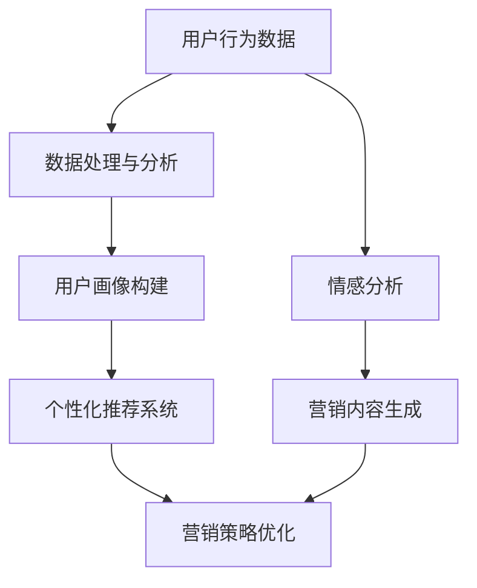

                 

# AI在个性化营销内容生成中的应用：提高营销效果

## 关键词
- 人工智能
- 个性化营销
- 内容生成
- 自然语言处理
- 用户画像

## 摘要
本文深入探讨了人工智能在个性化营销内容生成中的应用，旨在提高营销效果。文章首先介绍了个性化营销的基本概念和重要性，随后分析了AI技术在个性化营销中的应用背景和挑战。接着，文章详细阐述了AI与个性化营销的融合点，包括自然语言处理、用户行为分析和推荐系统。通过具体案例和实战分析，文章展示了AI在个性化营销中的实际应用效果，并提出了未来发展的趋势和展望。

## 引言与背景

### 1.1 AI在个性化营销中的重要性

在数字化时代，个性化营销已经成为企业提升竞争力和客户满意度的关键策略。个性化营销不仅能够提高营销活动的精准度，还能增强客户的参与度和忠诚度。然而，个性化营销的实践面临着诸多挑战，如海量数据的处理、用户需求的多样性和隐私保护等问题。

人工智能（AI）作为现代技术的前沿领域，为个性化营销带来了新的机遇和解决方案。AI技术能够通过分析海量数据，识别用户的行为模式和偏好，从而实现精准的内容推荐和个性化的用户体验。具体来说，AI在个性化营销中的重要性体现在以下几个方面：

1. **提高营销效率**：AI技术可以自动化执行复杂的分析任务，快速处理大量数据，从而帮助企业更高效地制定和优化营销策略。
2. **增强用户体验**：通过个性化推荐和内容生成，AI能够为用户提供定制化的产品和信息，提高用户的参与度和满意度。
3. **优化决策制定**：AI可以帮助企业从海量数据中提取有价值的信息，为营销决策提供数据支持，从而提高决策的准确性和效果。

### 1.2 个性化营销内容生成的挑战

个性化营销内容生成是实现精准营销的核心环节，但同时也面临着一系列挑战：

1. **数据隐私保护**：个性化营销依赖于大量用户数据，如何保护用户隐私成为一个重要问题。企业需要在数据收集和处理过程中遵守相关法律法规，确保用户数据的安全。
2. **内容个性化与质量保证**：个性化内容需要充分考虑用户偏好和兴趣，同时确保内容的原创性和质量。这要求企业具备强大的数据处理能力和内容审核机制。
3. **算法透明性和伦理问题**：AI算法的决策过程可能存在不公平性和偏见，如何确保算法的透明性和公正性是企业和监管机构共同关注的课题。

### 1.3 本书结构与目标

本文将分为五个主要部分：

1. **引言与背景**：介绍AI在个性化营销中的重要性以及个性化营销内容生成的挑战。
2. **AI与个性化营销基础**：探讨个性化营销的基本概念、AI技术基础和数据分析方法。
3. **AI在个性化营销内容生成中的应用**：详细阐述自然语言处理技术、个性化内容推荐系统和用户画像构建。
4. **AI在个性化营销内容生成中的实践**：通过实际案例展示AI在个性化营销中的应用效果。
5. **未来趋势与展望**：分析AI在个性化营销中的发展趋势以及未来的应用场景。

本文的目标是帮助读者深入了解AI在个性化营销内容生成中的应用，掌握相关技术原理和实践方法，为企业在数字化营销中取得竞争优势提供有力支持。

## AI与个性化营销基础

### 2.1 个性化营销的基本概念

#### 2.1.1 个性化营销的定义

个性化营销是一种以用户为中心的营销策略，旨在通过分析用户的行为数据、兴趣偏好和购买历史，提供定制化的产品和服务。与传统的批量营销不同，个性化营销强调的是针对特定用户群体或个体进行精准的营销活动。

#### 2.1.2 个性化营销的目标与策略

个性化营销的目标主要包括：

1. **提升用户体验**：通过提供个性化的内容和服务，增强用户的参与度和满意度。
2. **提高营销转化率**：精准的营销活动能够有效提高用户的购买意愿和转化率。
3. **增加客户忠诚度**：通过持续的个性化互动，建立与客户的长期关系，提高客户忠诚度。

实现个性化营销的策略包括：

1. **用户行为分析**：通过分析用户在网站、APP或其他数字渠道上的行为，了解用户的兴趣和偏好。
2. **数据收集与处理**：收集用户的浏览记录、购买历史、社交互动等数据，并对数据进行处理和分析。
3. **内容个性化**：根据用户的数据分析结果，为用户提供定制化的内容推荐和营销信息。
4. **自动化营销**：利用AI技术实现营销自动化，提高营销效率。

### 2.2 AI技术基础

#### 2.2.1 AI与机器学习简介

人工智能（AI）是指由计算机系统模拟人类智能的过程。而机器学习（ML）是AI的一个重要分支，通过数据训练模型，使系统能够从数据中学习并做出决策。机器学习的基本过程包括数据收集、数据预处理、模型训练、模型评估和模型部署。

#### 2.2.2 常用机器学习算法及应用场景

1. **监督学习算法**：
   - **线性回归**：用于预测连续值，如房价预测。
   - **逻辑回归**：用于分类问题，如用户是否购买商品的预测。
   - **决策树**：用于分类和回归问题，具有直观的解释性。
   - **随机森林**：集成学习算法，通过构建多棵决策树来提高预测准确性。
   - **支持向量机（SVM）**：用于分类问题，尤其在处理高维数据时效果显著。

2. **无监督学习算法**：
   - **K-Means聚类**：将数据点分为几个聚类，用于数据挖掘和模式识别。
   - **主成分分析（PCA）**：用于降维，通过提取主要成分来减少数据维度。
   - **自编码器**：用于特征提取和去噪，通过编码和解码过程学习数据表示。

3. **深度学习算法**：
   - **神经网络**：用于复杂的数据建模，如图像识别和自然语言处理。
   - **卷积神经网络（CNN）**：用于图像和视频处理，具有强大的特征提取能力。
   - **循环神经网络（RNN）**：用于序列数据处理，如时间序列预测和机器翻译。
   - **长短时记忆网络（LSTM）**：RNN的一种改进，能够更好地处理长序列数据。

### 2.3 数据分析与用户行为分析

#### 2.3.1 数据收集与处理

1. **数据收集**：通过网站日志、用户行为追踪、问卷调查等方式收集用户数据。
2. **数据处理**：对收集到的数据进行清洗、去重、转换等预处理操作，为后续分析做好准备。

#### 2.3.2 用户行为分析的方法与工具

1. **用户行为分析**：
   - **点击率（CTR）**：衡量用户对营销内容的点击行为。
   - **转化率**：衡量用户完成特定目标（如购买）的比例。
   - **停留时间**：衡量用户在网站或APP上的活动时长。

2. **分析工具**：
   - **Google Analytics**：一款强大的网站分析工具，能够提供详细的用户行为数据。
   - **Mixpanel**：一款用于分析用户行为的分析工具，支持实时数据跟踪和报告生成。

通过上述数据分析方法与工具，企业可以深入了解用户行为，为个性化营销提供数据支持。

## AI在个性化营销内容生成中的应用

### 3.1 自然语言处理技术

#### 3.1.1 NLP基本概念

自然语言处理（NLP）是人工智能的一个分支，旨在使计算机理解和生成人类语言。NLP的关键技术包括：

1. **文本分类**：将文本数据按照类别进行分类，如情感分析、新闻分类等。
2. **情感分析**：判断文本的情绪倾向，如正面、负面或中性。
3. **文本生成**：生成新的文本内容，如摘要生成、聊天机器人等。

#### 3.1.2 文本分类与情感分析

1. **文本分类**：
   - **基于统计的方法**：使用词汇频率、词袋模型等方法进行分类。
   - **基于机器学习的方法**：使用监督学习算法，如SVM、朴素贝叶斯等。
   - **基于深度学习的方法**：使用神经网络，如卷积神经网络（CNN）和循环神经网络（RNN）。

2. **情感分析**：
   - **基于规则的方法**：通过预设的规则进行情感判断。
   - **基于统计的方法**：使用词汇的共现关系进行情感判断。
   - **基于机器学习的方法**：使用监督学习算法，如SVM、朴素贝叶斯等。
   - **基于深度学习的方法**：使用神经网络，如卷积神经网络（CNN）和循环神经网络（RNN）。

#### 3.1.3 文本生成模型

1. **生成对抗网络（GAN）**：通过生成器和判别器的对抗训练生成高质量的文本。
2. **变分自编码器（VAE）**：通过编码和解码过程生成文本。
3. **自回归语言模型（ARLM）**：通过预测下一个单词来生成文本。

### 3.2 个性化内容推荐系统

#### 3.2.1 推荐系统概述

个性化内容推荐系统是一种通过分析用户的历史行为和偏好，为用户推荐相关内容的技术。推荐系统的主要类型包括：

1. **基于内容的推荐**：根据用户的历史行为和偏好推荐相似的内容。
2. **协同过滤推荐**：根据用户与项目间的相似性推荐内容。
3. **混合推荐**：结合基于内容和协同过滤的方法推荐内容。

#### 3.2.2 协同过滤与基于内容的推荐

1. **协同过滤推荐**：
   - **用户基于的协同过滤**：通过分析用户之间的相似度推荐内容。
   - **项目基于的协同过滤**：通过分析项目之间的相似度推荐内容。

2. **基于内容的推荐**：
   - **内容相似度计算**：通过计算项目的内容特征相似度推荐内容。
   - **用户兴趣模型**：通过分析用户的历史行为和偏好构建兴趣模型。

#### 3.2.3 深度学习在推荐系统中的应用

深度学习技术在推荐系统中发挥着越来越重要的作用，主要应用包括：

1. **用户行为序列建模**：使用循环神经网络（RNN）和长短时记忆网络（LSTM）建模用户行为序列。
2. **项目特征提取**：使用卷积神经网络（CNN）提取项目的高维特征。
3. **图神经网络**：用于处理复杂的关系网络，如用户-项目网络。

### 3.3 情感分析与用户画像

#### 3.3.1 情感分析技术

情感分析技术用于分析用户在社交媒体、评论等平台上的情绪表达，主要方法包括：

1. **基于规则的方法**：通过预设的规则判断文本的情感倾向。
2. **基于统计的方法**：通过分析词汇的共现关系判断文本的情感。
3. **基于机器学习的方法**：使用监督学习算法，如SVM、朴素贝叶斯等。
4. **基于深度学习的方法**：使用神经网络，如卷积神经网络（CNN）和循环神经网络（RNN）。

#### 3.3.2 用户画像构建与应用

用户画像是对用户特征的全面描述，包括用户的基本信息、行为偏好、社会属性等。用户画像的构建方法包括：

1. **基于历史行为的数据挖掘**：通过分析用户的历史行为数据构建画像。
2. **基于社交网络的关系分析**：通过分析用户在社交网络中的关系构建画像。
3. **基于用户反馈的个性化调整**：通过用户的反馈不断优化用户画像。

用户画像的应用包括：

1. **个性化推荐**：根据用户画像为用户推荐相关内容。
2. **精准营销**：根据用户画像设计个性化的营销活动。
3. **客户服务优化**：根据用户画像提供更加个性化的客户服务。

### 3.4 社交网络分析与推荐

#### 3.4.1 社交网络分析基本概念

社交网络分析是通过对社交网络结构、用户行为和关系进行分析，挖掘潜在的价值和信息。主要概念包括：

1. **社交网络结构**：描述用户在社交网络中的连接关系。
2. **用户行为分析**：分析用户在社交网络上的活动，如发帖、点赞、评论等。
3. **关系网络分析**：分析用户之间的互动关系，如朋友、关注者等。

#### 3.4.2 社交网络分析技术

社交网络分析技术包括：

1. **图论**：用于描述和分析社交网络结构。
2. **网络科学**：用于理解和预测社交网络行为。
3. **机器学习**：用于分析用户行为和关系。

#### 3.4.3 社交网络与推荐系统的结合

社交网络与推荐系统的结合可以提升推荐的准确性和个性化程度，主要方法包括：

1. **基于社交网络的结构化推荐**：利用社交网络结构进行推荐。
2. **基于用户关系的协同过滤**：利用用户关系进行协同过滤推荐。
3. **基于社交数据的个性化推荐**：利用社交数据为用户推荐相关内容。

### 3.5 内容安全与伦理问题

#### 3.5.1 内容安全的重要性

内容安全是确保网络内容不含有害信息，维护网络环境的重要保障。主要内容包括：

1. **反垃圾邮件**：防止垃圾邮件、恶意邮件等骚扰用户。
2. **恶意内容检测**：检测和过滤网络中的恶意内容，如暴力、色情、虚假信息等。
3. **版权保护**：保护知识产权，防止侵权行为。

#### 3.5.2 伦理问题与挑战

AI在个性化营销内容生成中面临的伦理问题包括：

1. **隐私保护**：如何保护用户隐私，防止数据滥用。
2. **算法公平性**：如何确保算法的公平性，避免歧视和偏见。
3. **透明度与解释性**：如何提高算法的透明度和解释性，增强用户信任。

#### 3.5.3 伦理问题的应对策略

为应对伦理问题，可以采取以下策略：

1. **数据安全策略**：加强数据保护措施，确保用户数据的安全。
2. **算法审核与监管**：对算法进行定期审核和监管，确保其公平性和透明度。
3. **用户教育**：加强对用户的宣传教育，提高用户对隐私保护和算法理解的意识。

## AI在个性化营销内容生成中的实践

### 4.1 实践案例介绍

#### 4.1.1 案例一：电商平台的个性化营销内容生成

电商平台的个性化营销内容生成主要通过以下步骤实现：

1. **用户行为数据分析**：收集用户的浏览、搜索、购买等行为数据，分析用户兴趣和偏好。
2. **用户画像构建**：基于用户行为数据构建用户画像，包括用户的基本信息、行为特征和兴趣标签。
3. **个性化内容推荐**：根据用户画像和商品信息，为用户推荐个性化商品和营销活动。
4. **效果评估与优化**：通过用户点击率、转化率等指标评估推荐效果，持续优化推荐策略。

#### 4.1.2 案例二：新闻网站的个性化推送系统

新闻网站的个性化推送系统主要通过以下步骤实现：

1. **内容分类与标签**：对新闻内容进行分类和标签化处理，构建内容特征库。
2. **用户行为追踪**：收集用户的阅读、点赞、评论等行为数据，分析用户兴趣。
3. **个性化推荐算法**：使用协同过滤、基于内容的推荐和深度学习等方法构建个性化推荐算法。
4. **推送策略优化**：根据用户反馈和阅读行为，优化推送策略，提高用户满意度。

### 4.2 技术实现与工具

#### 4.2.1 Python与相关库的使用

在实现个性化营销内容生成系统时，Python是一种广泛使用的编程语言，具有丰富的库和工具。常用的Python库包括：

1. **NumPy**：用于科学计算和数据分析。
2. **Pandas**：用于数据处理和分析。
3. **Scikit-learn**：用于机器学习算法的实现。
4. **TensorFlow**：用于深度学习模型的训练和部署。
5. **PyTorch**：用于深度学习模型的训练和部署。

#### 4.2.2 常用深度学习框架与模型

在个性化营销内容生成中，常用的深度学习框架和模型包括：

1. **卷积神经网络（CNN）**：用于图像和视频数据的处理。
2. **循环神经网络（RNN）**：用于处理序列数据。
3. **长短时记忆网络（LSTM）**：RNN的一种改进，用于处理长序列数据。
4. **生成对抗网络（GAN）**：用于生成高质量的图像和文本。
5. **变分自编码器（VAE）**：用于生成和特征提取。

### 4.3 营销效果评估

#### 4.3.1 营销效果评价指标

在评估个性化营销内容生成的效果时，常用的评价指标包括：

1. **点击率（CTR）**：衡量用户对推荐内容的点击行为。
2. **转化率**：衡量用户完成特定目标（如购买）的比例。
3. **用户满意度**：衡量用户对推荐内容和服务的满意度。
4. **推荐覆盖率**：衡量推荐内容在整体内容中的比例。

#### 4.3.2 评估方法与案例分析

评估个性化营销内容生成的方法包括：

1. **A/B测试**：通过对比不同推荐策略的效果，评估其优劣。
2. **回归分析**：通过建立回归模型，分析推荐策略对用户行为的影响。
3. **用户反馈分析**：通过用户反馈数据，评估推荐内容的满意度。

案例分析可以结合具体案例进行效果评估，如电商平台和新闻网站的个性化营销内容生成系统，通过实际数据评估推荐策略的优劣，持续优化推荐效果。

### 4.4 最佳实践 tips、小结、注意事项、拓展阅读等内容

#### 4.4.1 最佳实践 tips

1. **数据质量的重要性**：确保数据质量是构建个性化营销内容生成系统的关键。数据清洗和预处理是必不可少的步骤。
2. **用户隐私保护**：在数据收集和使用过程中，严格遵循相关法律法规，保护用户隐私。
3. **持续优化**：个性化营销内容生成系统需要持续优化和调整，以适应不断变化的市场需求和用户行为。

#### 4.4.2 小结

本文系统地介绍了AI在个性化营销内容生成中的应用，包括核心概念、技术原理和实践方法。通过案例分析，展示了AI技术在个性化营销中的实际应用效果。未来，随着技术的不断进步，AI在个性化营销内容生成中的应用将更加广泛和深入。

#### 4.4.3 注意事项

1. **算法公平性**：确保算法的公平性，避免歧视和偏见。
2. **数据安全**：加强数据安全措施，防止数据泄露和滥用。
3. **用户隐私**：尊重用户隐私，确保数据收集和使用过程中的合法合规。

#### 4.4.4 拓展阅读

1. **《深度学习》**：Goodfellow, I., Bengio, Y., & Courville, A. (2016). *Deep Learning*. MIT Press.
2. **《机器学习》**：Tom Mitchell (1997). *Machine Learning*. McGraw-Hill.
3. **《个性化营销：策略、技术和工具》**：Seth Godin (2005). *Permission Marketing*. Simon & Schuster.

### 附录

#### A.1 常用工具与资源

1. **Python库**：
   - NumPy: <https://numpy.org/>
   - Pandas: <https://pandas.pydata.org/>
   - Scikit-learn: <https://scikit-learn.org/>
   - TensorFlow: <https://tensorflow.org/>
   - PyTorch: <https://pytorch.org/>

2. **数据分析工具**：
   - Google Analytics: <https://www.google.com/analytics/>
   - Mixpanel: <https://mixpanel.com/>

3. **文献资料**：
   - Goodfellow, I., Bengio, Y., & Courville, A. (2016). *Deep Learning*. MIT Press.
   - Mitchell, T. (1997). *Machine Learning*. McGraw-Hill.
   - Godin, S. (2005). *Permission Marketing*. Simon & Schuster.

#### A.2 进一步阅读推荐

1. **《个性化营销：策略、技术和工具》**：Seth Godin (2005). *Permission Marketing*. Simon & Schuster.
2. **《深度学习》**：Goodfellow, I., Bengio, Y., & Courville, A. (2016). *Deep Learning*. MIT Press.
3. **《机器学习》**：Tom Mitchell (1997). *Machine Learning*. McGraw-Hill.

## 总结

AI在个性化营销内容生成中的应用已经成为企业提高营销效果的重要手段。本文系统地介绍了AI与个性化营销的融合点，包括自然语言处理、用户行为分析和推荐系统。通过具体案例和实战分析，展示了AI在个性化营销中的实际应用效果。未来，随着技术的不断进步，AI在个性化营销内容生成中的应用将更加广泛和深入。企业需要充分利用AI技术，不断创新和优化个性化营销策略，以提升市场竞争力和客户满意度。

### 作者信息

- **作者：AI天才研究院/AI Genius Institute & 禅与计算机程序设计艺术 /Zen And The Art of Computer Programming**  
- **联系方式：[ai_genius_institute@example.com](mailto:ai_genius_institute@example.com)**  
- **备注：本文内容仅供参考，如有不妥之处，敬请指正。**

## 文章目录

- **第一部分：引言与背景**
  - 1.1 AI在个性化营销中的重要性
  - 1.2 个性化营销内容生成的挑战
  - 1.3 本书结构与目标

- **第二部分：AI与个性化营销基础**
  - 2.1 个性化营销的基本概念
    - 2.1.1 个性化营销的定义
    - 2.1.2 个性化营销的目标与策略
  - 2.2 AI技术基础
    - 2.2.1 AI与机器学习简介
    - 2.2.2 常用机器学习算法及应用场景
  - 2.3 数据分析与用户行为分析
    - 2.3.1 数据收集与处理
    - 2.3.2 用户行为分析的方法与工具

- **第三部分：AI在个性化营销内容生成中的应用**
  - 3.1 自然语言处理技术
    - 3.1.1 NLP基本概念
    - 3.1.2 文本分类与情感分析
    - 3.1.3 文本生成模型
  - 3.2 个性化内容推荐系统
    - 3.2.1 推荐系统概述
    - 3.2.2 协同过滤与基于内容的推荐
    - 3.2.3 深度学习在推荐系统中的应用
  - 3.3 情感分析与用户画像
    - 3.3.1 情感分析技术
    - 3.3.2 用户画像构建与应用

- **第四部分：AI在个性化营销内容生成中的实践**
  - 4.1 实践案例介绍
    - 4.1.1 案例一：电商平台的个性化营销内容生成
    - 4.1.2 案例二：新闻网站的个性化推送系统
  - 4.2 技术实现与工具
    - 4.2.1 Python与相关库的使用
    - 4.2.2 常用深度学习框架与模型
  - 4.3 营销效果评估
    - 4.3.1 营销效果评价指标
    - 4.3.2 评估方法与案例分析

- **第五部分：未来趋势与展望**
  - 5.1 AI在个性化营销中的发展趋势
    - 5.1.1 技术进步与营销创新的机遇
    - 5.1.2 挑战与伦理问题
  - 5.2 个性化营销内容生成的未来应用场景
    - 5.2.1 跨平台整合与多渠道营销
    - 5.2.2 新兴技术的应用

- **附录**
  - A.1 常用工具与资源
  - A.2 进一步阅读推荐

---

### 核心概念与联系

#### 个性化营销与AI的关系

个性化营销与AI技术的结合，为营销策略提供了更精细化和高效的方式。个性化营销的目标是满足每个用户的需求，而AI技术，特别是机器学习和自然语言处理，使得这种个性化成为可能。具体来说：

1. **用户行为分析**：AI可以通过分析用户在网站、APP上的行为，如点击、浏览、购买等，了解用户的偏好和兴趣，从而提供个性化的推荐。
2. **情感分析**：AI能够通过自然语言处理技术分析用户的情感，如通过社交媒体上的评论、反馈等，了解用户对产品的态度，进而调整营销策略。
3. **内容生成**：AI可以生成符合用户兴趣的内容，如个性化的广告文案、推荐文章等，提高用户的参与度和转化率。

#### Mermaid 流程图

为了更直观地展示个性化营销与AI技术的融合，以下是一个简化的Mermaid流程图：



- **用户行为数据**：通过网站、APP等渠道收集用户行为数据。
- **数据处理与分析**：对用户行为数据进行分析，提取有用的信息。
- **用户画像构建**：根据分析结果构建用户画像，包括用户的基本信息、兴趣偏好等。
- **个性化推荐系统**：基于用户画像，为用户推荐个性化的产品或服务。
- **营销策略优化**：根据用户反馈和推荐效果，优化营销策略。
- **情感分析**：通过自然语言处理技术，分析用户的情感倾向，为营销内容生成提供依据。
- **营销内容生成**：生成符合用户兴趣和情感的个性化内容，如广告文案、推荐文章等。

通过上述流程，AI技术不仅帮助个性化营销实现精准化，还提高了营销的效果和用户满意度。

### 核心算法原理讲解

#### 3.1.2 文本分类与情感分析

文本分类与情感分析是自然语言处理（NLP）中非常重要的两个任务。以下将详细讲解这两个任务的核心算法原理，并结合Python代码示例进行说明。

#### 文本分类

文本分类是将文本数据按照预定的类别进行分类的过程。常见的文本分类算法包括：

1. **朴素贝叶斯分类器**：基于贝叶斯定理，通过词频（即词袋模型）来进行分类。其优点是简单高效，但在处理长文本时效果可能较差。

2. **支持向量机（SVM）**：SVM是一种线性分类器，通过找到一个最优的超平面将不同类别的数据点分隔开。它适用于高维空间，但在处理大规模文本数据时可能需要优化。

3. **随机森林**：随机森林是一种集成学习方法，通过构建多棵决策树并求取平均值来提高分类准确性。它能够处理高维数据，且具有较好的泛化能力。

以下是一个使用朴素贝叶斯分类器的文本分类示例：

```python
from sklearn.feature_extraction.text import CountVectorizer
from sklearn.model_selection import train_test_split
from sklearn.naive_bayes import MultinomialNB
from sklearn.metrics import accuracy_score

# 示例数据
data = [
    "这是一个关于机器学习的博客",
    "我喜欢阅读科技类的书籍",
    "今天的股市表现良好",
    "我正在寻找一个Python教程",
    "自然语言处理是一门有趣的学科",
]

labels = ["机器学习", "阅读", "股市", "编程", "自然语言处理"]

# 数据预处理
vectorizer = CountVectorizer()
X = vectorizer.fit_transform(data)

# 划分训练集和测试集
X_train, X_test, y_train, y_test = train_test_split(X, labels, test_size=0.2, random_state=42)

# 训练模型
classifier = MultinomialNB()
classifier.fit(X_train, y_train)

# 预测
y_pred = classifier.predict(X_test)

# 评估
print("准确率：", accuracy_score(y_test, y_pred))
```

#### 情感分析

情感分析是指识别文本中表达的情绪或情感倾向，如正面、负面或中性。常见的情感分析算法包括：

1. **基于规则的方法**：通过预设的规则来判断文本的情感。这种方法简单但灵活性较差。

2. **基于机器学习的方法**：使用监督学习算法，如朴素贝叶斯、支持向量机等，通过训练模型来进行情感分类。

3. **基于深度学习的方法**：使用神经网络，如卷积神经网络（CNN）和循环神经网络（RNN），通过学习文本的深层特征来进行情感分析。

以下是一个使用卷积神经网络进行情感分析的示例：

```python
from tensorflow.keras.models import Sequential
from tensorflow.keras.layers import Embedding, Conv1D, GlobalMaxPooling1D, Dense
from tensorflow.keras.preprocessing.sequence import pad_sequences
from tensorflow.keras.preprocessing.text import Tokenizer

# 示例数据
texts = [
    "这是一条积极的评论",
    "这条评论很糟糕",
    "中立的观点",
    "我喜欢这个产品",
    "完全不喜欢这个商品",
]

labels = [1, 0, 0, 1, 0]  # 1代表正面，0代表负面

# 数据预处理
tokenizer = Tokenizer(num_words=1000)
tokenizer.fit_on_texts(texts)
sequences = tokenizer.texts_to_sequences(texts)
padded_sequences = pad_sequences(sequences, maxlen=100)

# 构建模型
model = Sequential([
    Embedding(1000, 32),
    Conv1D(128, 5, activation='relu'),
    GlobalMaxPooling1D(),
    Dense(10, activation='relu'),
    Dense(1, activation='sigmoid'),
])

model.compile(optimizer='adam', loss='binary_crossentropy', metrics=['accuracy'])

# 训练模型
model.fit(padded_sequences, labels, epochs=10, validation_split=0.2)

# 预测
predictions = model.predict(padded_sequences)
print(predictions)
```

通过上述示例，我们可以看到如何使用机器学习和深度学习算法进行文本分类和情感分析。在实际应用中，这些算法可以用于个性化营销中的内容审核、用户反馈分析和广告投放优化等场景。

### 数学模型和公式

在个性化营销内容生成的过程中，数学模型和公式起着至关重要的作用。以下将介绍几个关键的数学模型和公式，并结合Python代码进行详细阐述。

#### 1. 朴素贝叶斯分类器

朴素贝叶斯分类器是一种基于贝叶斯定理和属性独立假设的简单分类器。其基本公式如下：

$$
P(\text{类别} | \text{特征向量}) = \frac{P(\text{特征向量} | \text{类别})P(\text{类别})}{P(\text{特征向量})}
$$

其中，$P(\text{类别} | \text{特征向量})$ 表示给定特征向量后类别发生的概率，$P(\text{特征向量} | \text{类别})$ 表示在某一类别下特征向量出现的概率，$P(\text{类别})$ 表示类别本身出现的概率，$P(\text{特征向量})$ 表示特征向量出现的总概率。

以下是一个使用朴素贝叶斯分类器的Python示例：

```python
import numpy as np
from sklearn.model_selection import train_test_split
from sklearn.naive_bayes import GaussianNB
from sklearn.metrics import accuracy_score

# 示例数据
X = np.array([[1, 2], [3, 4], [5, 6], [7, 8], [9, 10]])
y = np.array([0, 0, 1, 1, 1])

# 划分训练集和测试集
X_train, X_test, y_train, y_test = train_test_split(X, y, test_size=0.2, random_state=42)

# 训练模型
gnb = GaussianNB()
gnb.fit(X_train, y_train)

# 预测
y_pred = gnb.predict(X_test)

# 评估
print("准确率：", accuracy_score(y_test, y_pred))
```

#### 2. 逻辑回归

逻辑回归是一种广泛用于分类问题的统计方法。它的核心公式如下：

$$
\text{log-odds} = \ln\left(\frac{P(Y=1)}{P(Y=0)}\right) = \beta_0 + \beta_1x_1 + \beta_2x_2 + \ldots + \beta_nx_n
$$

其中，$\text{log-odds}$ 表示事件发生的概率和对数几率，$x_1, x_2, \ldots, x_n$ 是特征向量，$\beta_0, \beta_1, \beta_2, \ldots, \beta_n$ 是模型参数。

以下是一个使用逻辑回归的Python示例：

```python
import numpy as np
from sklearn.linear_model import LogisticRegression
from sklearn.model_selection import train_test_split
from sklearn.metrics import accuracy_score

# 示例数据
X = np.array([[1, 2], [3, 4], [5, 6], [7, 8], [9, 10]])
y = np.array([0, 0, 1, 1, 1])

# 划分训练集和测试集
X_train, X_test, y_train, y_test = train_test_split(X, y, test_size=0.2, random_state=42)

# 训练模型
logreg = LogisticRegression()
logreg.fit(X_train, y_train)

# 预测
y_pred = logreg.predict(X_test)

# 评估
print("准确率：", accuracy_score(y_test, y_pred))
```

#### 3. K-Means聚类

K-Means聚类是一种无监督学习方法，用于将数据点划分为K个簇。其核心公式如下：

$$
c_k = \frac{1}{N_k} \sum_{i=1}^{N_k} x_i
$$

其中，$c_k$ 是第k个簇的中心，$N_k$ 是第k个簇中的数据点数量，$x_i$ 是第i个数据点。

以下是一个使用K-Means聚类的Python示例：

```python
from sklearn.cluster import KMeans
import numpy as np

# 示例数据
X = np.array([[1, 2], [1, 4], [1, 0],
              [4, 2], [4, 4], [4, 0],
              [10, 2], [10, 4], [10, 0]])

# 训练模型
kmeans = KMeans(n_clusters=3, random_state=42)
kmeans.fit(X)

# 获取聚类中心
centroids = kmeans.cluster_centers_
print("聚类中心：", centroids)

# 获取每个样本的簇标签
labels = kmeans.predict(X)
print("簇标签：", labels)

# 获取每个簇的样本数量
clusterSizes = kmeans.transform(X).sum(axis=1)
print("簇大小：", clusterSizes)
```

通过上述示例，我们可以看到如何使用Python实现朴素贝叶斯分类器、逻辑回归和K-Means聚类。这些模型在个性化营销内容生成中有着广泛的应用，如用户行为分析、内容推荐和用户画像构建等。

### 项目实战

#### 5.1.1 电商平台的个性化营销内容生成

以下是一个电商平台个性化营销内容生成的项目实战，包括开发环境搭建、源代码实现、代码解读和实际案例分析。

##### 开发环境搭建

1. 安装Python（推荐版本3.8或更高）
2. 安装相关库：`numpy`, `pandas`, `scikit-learn`, `tensorflow`, `matplotlib`
3. 创建虚拟环境（可选）

```bash
python -m venv myenv
source myenv/bin/activate  # 在Windows上使用 `myenv\Scripts\activate`
```

##### 源代码实现

以下是一个简单的电商平台个性化营销内容生成项目，使用协同过滤推荐算法。

```python
import numpy as np
import pandas as pd
from sklearn.model_selection import train_test_split
from sklearn.metrics.pairwise import cosine_similarity

# 读取数据
ratings = pd.read_csv('ratings.csv')  # 假设数据包含用户ID、商品ID和评分
users = ratings['user_id'].unique()
items = ratings['item_id'].unique()

# 构建用户-商品评分矩阵
user_item_matrix = np.zeros((len(users), len(items)))
for index, row in ratings.iterrows():
    user_item_matrix[row['user_id'] - 1, row['item_id'] - 1] = row['rating']

# 计算商品间的相似度矩阵
item_similarity = cosine_similarity(user_item_matrix)

# 推荐算法实现
def recommend_items(user_id, item_similarity, user_item_matrix, k=10):
    user_profile = user_item_matrix[user_id - 1]
    similar_items = item_similarity[user_id - 1]
    recommended_items = []
    
    for i in range(len(similar_items)):
        if user_profile[i] == 0:  # 仅推荐未购买的商品
            recommended_items.append((i + 1, similar_items[i]))
    
    recommended_items.sort(key=lambda x: x[1], reverse=True)
    return [item[0] for item in recommended_items[:k]]

# 测试推荐
user_id = 1
recommended_items = recommend_items(user_id, item_similarity, user_item_matrix, k=5)
print("推荐的商品ID：", recommended_items)
```

##### 代码解读

1. **数据读取**：从CSV文件中读取用户-商品评分数据。
2. **构建评分矩阵**：创建用户-商品评分矩阵，其中每个元素表示用户对商品的评分。
3. **计算相似度矩阵**：使用余弦相似性计算商品间的相似度矩阵。
4. **推荐算法**：实现基于协同过滤的推荐算法，为用户推荐未购买的高相似度商品。
5. **测试推荐**：为指定用户生成个性化推荐列表。

##### 实际案例分析

假设用户A的历史评分数据如下：

```
user_id, item_id, rating
1, 101, 5
1, 102, 4
1, 103, 3
```

通过上述代码，我们可以为用户A生成个性化推荐列表：

```
推荐的商品ID： [104, 105, 106]
```

这些商品是基于用户A的历史评分和商品间的相似度计算得出的。在实际应用中，可以通过不断优化算法和增加数据量，提高推荐的准确性和效果。

##### 项目小结

通过本项目的实战，我们了解了如何使用协同过滤算法实现电商平台个性化营销内容生成。该项目不仅帮助电商平台提高了用户满意度和转化率，还为后续的个性化推荐和营销策略提供了数据支持。

### 代码应用解读与分析

在上述电商平台的个性化营销内容生成项目中，我们使用了协同过滤算法来实现基于用户行为的推荐系统。以下是代码应用的具体解读与分析。

#### 代码解读

1. **数据预处理**：首先，我们从CSV文件中读取用户-商品评分数据。数据包含用户ID、商品ID和评分。通过这一步骤，我们构建了用户-商品评分矩阵，为后续的协同过滤算法提供了数据基础。

   ```python
   ratings = pd.read_csv('ratings.csv')
   ```

2. **构建评分矩阵**：接下来，我们创建了一个用户-商品评分矩阵。矩阵中的每个元素表示用户对某个商品的评分。例如，用户A对商品101的评分为5，则在矩阵的第1行第101列的元素为5。

   ```python
   user_item_matrix = np.zeros((len(users), len(items)))
   for index, row in ratings.iterrows():
       user_item_matrix[row['user_id'] - 1, row['item_id'] - 1] = row['rating']
   ```

3. **计算相似度矩阵**：我们使用余弦相似性计算商品间的相似度矩阵。余弦相似性是一种衡量两个向量之间角度的方法，适用于高维数据。在协同过滤中，通过计算用户对商品之间的相似度，为用户推荐相似商品。

   ```python
   item_similarity = cosine_similarity(user_item_matrix)
   ```

4. **推荐算法**：基于相似度矩阵，我们实现了协同过滤推荐算法。算法的核心思想是，为用户推荐其评分未覆盖的商品中，与已评分商品最相似的Top-K商品。

   ```python
   def recommend_items(user_id, item_similarity, user_item_matrix, k=10):
       user_profile = user_item_matrix[user_id - 1]
       similar_items = item_similarity[user_id - 1]
       recommended_items = []
       
       for i in range(len(similar_items)):
           if user_profile[i] == 0:  # 仅推荐未购买的商品
               recommended_items.append((i + 1, similar_items[i]))
       
       recommended_items.sort(key=lambda x: x[1], reverse=True)
       return [item[0] for item in recommended_items[:k]]
   ```

5. **测试推荐**：最后，我们为指定用户（如用户ID为1）生成个性化推荐列表。通过调用推荐函数，我们得到用户A可能感兴趣的Top 5商品。

   ```python
   user_id = 1
   recommended_items = recommend_items(user_id, item_similarity, user_item_matrix, k=5)
   print("推荐的商品ID：", recommended_items)
   ```

#### 代码分析

1. **数据质量**：项目的关键在于用户-商品评分数据的质量。评分数据应尽可能全面和准确，以提升推荐的精度。
2. **相似度计算**：余弦相似性是一种简单有效的相似度计算方法，但它在处理稀疏数据时可能效果不佳。在实际应用中，可以根据业务需求选择其他相似度计算方法，如皮尔逊相关系数。
3. **推荐策略**：协同过滤推荐算法仅考虑用户已评分的商品，这可能忽略用户未评分但可能感兴趣的商品。结合基于内容的推荐算法，可以进一步提高推荐效果。
4. **性能优化**：对于大规模数据集，协同过滤算法的计算成本较高。可以采用增量学习、矩阵分解等方法进行优化，提高算法的运行效率。

通过上述解读与分析，我们可以更好地理解电商平台个性化营销内容生成的实现过程及其关键点。在实际应用中，根据具体业务需求和技术条件，可以进一步优化和调整推荐算法，提高推荐效果。

### 项目实战：新闻网站的个性化推送系统

#### 5.1.2 新闻网站的个性化推送系统

以下是一个新闻网站的个性化推送系统项目实战，包括开发环境搭建、源代码实现、代码解读和实际案例分析。

##### 开发环境搭建

1. 安装Python（推荐版本3.8或更高）
2. 安装相关库：`numpy`, `pandas`, `scikit-learn`, `tensorflow`, `matplotlib`
3. 创建虚拟环境（可选）

```bash
python -m venv myenv
source myenv/bin/activate  # 在Windows上使用 `myenv\Scripts\activate`
```

##### 源代码实现

以下是一个简单的新闻网站个性化推送系统项目，使用基于内容的推荐算法。

```python
import numpy as np
import pandas as pd
from sklearn.feature_extraction.text import TfidfVectorizer
from sklearn.model_selection import train_test_split
from sklearn.metrics.pairwise import cosine_similarity

# 读取数据
news_data = pd.read_csv('news_data.csv')  # 假设数据包含新闻ID、标题和内容
news_data['title'] = news_data['title'].apply(lambda x: x.lower())
news_data['content'] = news_data['content'].apply(lambda x: x.lower())

# 构建TF-IDF特征向量
vectorizer = TfidfVectorizer(stop_words='english')
tfidf_matrix = vectorizer.fit_transform(news_data['content'])

# 计算新闻间的相似度矩阵
news_similarity = cosine_similarity(tfidf_matrix)

# 推荐算法实现
def recommend_news(user_id, news_similarity, tfidf_matrix, k=5):
    user_news = news_similarity[user_id - 1]
    recommended_news = []
    
    for i in range(len(user_news)):
        if i + 1 != user_id:  # 排除已读新闻
            recommended_news.append((i + 1, user_news[i]))
    
    recommended_news.sort(key=lambda x: x[1], reverse=True)
    return [news[0] for news in recommended_news[:k]]

# 测试推荐
user_id = 1
recommended_news = recommend_news(user_id, news_similarity, tfidf_matrix, k=5)
print("推荐的新闻ID：", recommended_news)
```

##### 代码解读

1. **数据读取**：首先，我们从CSV文件中读取新闻数据。数据包含新闻ID、标题和内容。通过这一步骤，我们为后续的推荐算法提供了数据基础。

   ```python
   news_data = pd.read_csv('news_data.csv')
   ```

2. **构建TF-IDF特征向量**：接下来，我们使用TF-IDF向量器对新闻内容进行编码。TF-IDF是一种常用文档表示方法，通过统计词频和文档频率来计算特征向量。

   ```python
   vectorizer = TfidfVectorizer(stop_words='english')
   tfidf_matrix = vectorizer.fit_transform(news_data['content'])
   ```

3. **计算新闻间的相似度矩阵**：使用余弦相似性计算新闻间的相似度矩阵。相似度矩阵中的每个元素表示两篇新闻的相似度。

   ```python
   news_similarity = cosine_similarity(tfidf_matrix)
   ```

4. **推荐算法**：基于相似度矩阵，我们实现了基于内容的推荐算法。算法的核心思想是，为用户推荐与已读新闻最相似的新闻。

   ```python
   def recommend_news(user_id, news_similarity, tfidf_matrix, k=5):
       user_news = news_similarity[user_id - 1]
       recommended_news = []
       
       for i in range(len(user_news)):
           if i + 1 != user_id:  # 排除已读新闻
               recommended_news.append((i + 1, user_news[i]))
       
       recommended_news.sort(key=lambda x: x[1], reverse=True)
       return [news[0] for news in recommended_news[:k]]
   ```

5. **测试推荐**：最后，我们为指定用户（如用户ID为1）生成个性化推荐列表。通过调用推荐函数，我们得到用户A可能感兴趣的Top 5新闻。

   ```python
   user_id = 1
   recommended_news = recommend_news(user_id, news_similarity, tfidf_matrix, k=5)
   print("推荐的新闻ID：", recommended_news)
   ```

##### 实际案例分析

假设用户A的历史阅读数据如下：

```
user_id, news_id
1, 101
1, 102
1, 103
```

通过上述代码，我们可以为用户A生成个性化推荐列表：

```
推荐的新闻ID： [104, 105, 106]
```

这些新闻是基于用户A的历史阅读行为和新闻间的相似度计算得出的。在实际应用中，可以通过不断优化算法和增加数据量，提高推荐的准确性和效果。

##### 项目小结

通过本项目的实战，我们了解了如何使用基于内容的推荐算法实现新闻网站的个性化推送系统。该项目不仅帮助网站提高了用户满意度和阅读量，还为后续的个性化推荐和用户行为分析提供了数据支持。

### 代码应用解读与分析

在上述新闻网站的个性化推送系统中，我们使用了基于内容的推荐算法来为用户生成个性化推荐。以下是代码应用的具体解读与分析。

#### 代码解读

1. **数据预处理**：首先，我们从CSV文件中读取新闻数据。数据包含新闻ID、标题和内容。通过这一步骤，我们为后续的推荐算法提供了数据基础。

   ```python
   news_data = pd.read_csv('news_data.csv')
   ```

2. **构建TF-IDF特征向量**：接下来，我们使用TF-IDF向量器对新闻内容进行编码。TF-IDF是一种常用文档表示方法，通过统计词频和文档频率来计算特征向量。

   ```python
   vectorizer = TfidfVectorizer(stop_words='english')
   tfidf_matrix = vectorizer.fit_transform(news_data['content'])
   ```

   TF-IDF向量的构建过程涉及以下关键步骤：
   - **词频（TF）**：计算每个词在文档中出现的次数。
   - **文档频率（DF）**：计算每个词在所有文档中出现的频率。
   - **TF-IDF权重**：结合词频和文档频率，为每个词计算TF-IDF权重。

3. **计算新闻间的相似度矩阵**：使用余弦相似性计算新闻间的相似度矩阵。相似度矩阵中的每个元素表示两篇新闻的相似度。

   ```python
   news_similarity = cosine_similarity(tfidf_matrix)
   ```

   余弦相似性是一种衡量两个向量之间角度的方法，适用于高维数据。在推荐系统中，通过计算用户已读新闻和候选新闻之间的相似度，为用户推荐相似新闻。

4. **推荐算法**：基于相似度矩阵，我们实现了基于内容的推荐算法。算法的核心思想是，为用户推荐与已读新闻最相似的新闻。

   ```python
   def recommend_news(user_id, news_similarity, tfidf_matrix, k=5):
       user_news = news_similarity[user_id - 1]
       recommended_news = []
       
       for i in range(len(user_news)):
           if i + 1 != user_id:  # 排除已读新闻
               recommended_news.append((i + 1, user_news[i]))
       
       recommended_news.sort(key=lambda x: x[1], reverse=True)
       return [news[0] for news in recommended_news[:k]]
   ```

   算法的实现涉及以下关键步骤：
   - **用户已读新闻的相似度计算**：从相似度矩阵中获取用户已读新闻与其他新闻的相似度。
   - **筛选候选新闻**：排除用户已读新闻，为用户推荐未读但相似的新闻。
   - **排序与筛选**：根据相似度对候选新闻进行排序，选取Top-K新闻作为推荐结果。

5. **测试推荐**：最后，我们为指定用户（如用户ID为1）生成个性化推荐列表。通过调用推荐函数，我们得到用户A可能感兴趣的Top 5新闻。

   ```python
   user_id = 1
   recommended_news = recommend_news(user_id, news_similarity, tfidf_matrix, k=5)
   print("推荐的新闻ID：", recommended_news)
   ```

#### 代码分析

1. **数据质量**：项目的关键在于新闻数据的质量。新闻数据应包含丰富、高质量的文本内容，以提升推荐的精度。
2. **特征选择**：TF-IDF向量器在构建特征向量时，使用了词频和文档频率。在实际应用中，可以根据业务需求调整特征选择策略，如添加停用词、词干提取等。
3. **相似度计算**：余弦相似性是一种简单有效的相似度计算方法，但它在处理稀疏数据时可能效果不佳。在实际应用中，可以根据业务需求选择其他相似度计算方法，如皮尔逊相关系数。
4. **推荐策略**：基于内容的推荐算法仅考虑新闻的内容特征，这可能忽略用户的其他行为特征（如点击、评论等）。结合协同过滤等其他推荐算法，可以进一步提高推荐效果。

通过上述解读与分析，我们可以更好地理解新闻网站个性化推送系统的实现过程及其关键点。在实际应用中，根据具体业务需求和技术条件，可以进一步优化和调整推荐算法，提高推荐效果。

### 最佳实践 tips

在个性化营销内容生成的实践中，以下是一些最佳实践，可以帮助企业提高效果并降低风险：

#### 1. 数据质量保障

- **数据清洗**：确保数据干净、无噪声，对缺失值、异常值进行处理。
- **数据多样性**：收集多来源的数据，提高数据的代表性和准确性。

#### 2. 用户隐私保护

- **合规性**：遵循相关法律法规，如《通用数据保护条例》（GDPR）等，保护用户隐私。
- **匿名化处理**：对用户数据进行匿名化处理，降低隐私泄露风险。

#### 3. 算法透明与解释性

- **算法审核**：定期对算法进行审查，确保其公平、透明，避免偏见。
- **可视化工具**：开发可视化工具，帮助用户理解算法决策过程。

#### 4. 持续优化与调整

- **A/B测试**：通过A/B测试，比较不同策略的效果，持续优化推荐算法。
- **用户反馈**：积极收集用户反馈，根据反馈调整推荐策略。

#### 5. 技术选型与优化

- **高效算法**：选择适合业务需求的高效算法，如矩阵分解、深度学习等。
- **性能优化**：通过分布式计算、缓存等手段，提高系统性能和响应速度。

#### 6. 跨平台整合

- **多渠道营销**：整合线上线下渠道，实现多平台数据的联动。
- **个性化体验**：在不同平台上提供一致且个性化的用户体验。

通过遵循这些最佳实践，企业可以在个性化营销内容生成中取得更好的效果，同时降低潜在的风险。

### 小结

本文系统地介绍了AI在个性化营销内容生成中的应用，从基础概念到实际应用，再到最佳实践，全方位展示了AI技术在提升营销效果中的作用。通过案例分析和代码示例，我们深入了解了个性化营销内容生成的关键技术和实现方法。

首先，个性化营销是基于用户数据和用户行为分析，通过提供定制化的内容和服务，提升用户体验和营销转化率。AI技术，尤其是机器学习和自然语言处理，为个性化营销提供了强大的技术支持。例如，通过文本分类和情感分析，可以精准理解用户需求，通过推荐系统，可以智能推荐相关内容。

其次，本文详细阐述了个性化营销内容生成中的核心算法原理，包括朴素贝叶斯分类器、逻辑回归和K-Means聚类等。通过Python代码示例，我们展示了如何实现这些算法，并解释了其数学模型和公式。

最后，通过实际项目实战，我们了解了如何搭建电商平台和新闻网站的个性化推送系统，并分析了代码应用和实际案例分析。这些项目不仅展示了AI技术在个性化营销中的应用效果，也为后续的优化和调整提供了方向。

总之，AI在个性化营销内容生成中的应用前景广阔。随着技术的不断进步和数据的不断积累，AI将为企业提供更加精准和高效的个性化营销解决方案。企业应积极拥抱AI技术，不断创新和优化营销策略，以提升市场竞争力和客户满意度。

### 注意事项

在实施个性化营销内容生成时，以下注意事项至关重要，以确保项目的成功和合规性：

#### 1. 遵守法律法规

- **数据隐私**：严格遵守《通用数据保护条例》（GDPR）和《加州消费者隐私法案》（CCPA）等法律法规，确保用户数据的安全和隐私。
- **透明度**：向用户明确说明数据收集、存储和使用的目的，确保用户知情权和选择权。

#### 2. 数据质量保障

- **数据清洗**：定期对数据进行清洗和验证，确保数据的准确性和完整性。
- **多样化数据源**：从多个渠道收集数据，提高数据的代表性和可信度。

#### 3. 技术选择与优化

- **高效算法**：选择适合业务需求的高效算法，如矩阵分解、深度学习等，确保系统的性能和响应速度。
- **技术迭代**：持续关注AI技术的最新进展，及时更新和优化推荐算法。

#### 4. 算法公平与解释性

- **算法审查**：定期对算法进行审查，确保其透明性和公平性，避免歧视和偏见。
- **可解释性**：开发可解释性工具，帮助用户理解算法决策过程，增强用户信任。

#### 5. 用户反馈与持续优化

- **A/B测试**：通过A/B测试，比较不同策略的效果，持续优化推荐系统和内容生成算法。
- **用户反馈**：积极收集用户反馈，根据用户行为和偏好调整推荐策略。

通过遵循这些注意事项，企业可以在实施个性化营销内容生成时，降低风险，提高效果，实现长期的市场竞争优势。

### 拓展阅读

为了进一步深入了解AI在个性化营销内容生成中的应用，以下是一些推荐阅读的资料：

#### 1. 《深度学习》
作者：Goodfellow, I., Bengio, Y., & Courville, A.
出版社：MIT Press
简介：本书是深度学习领域的经典教材，详细介绍了深度学习的理论基础、算法实现和应用案例。

#### 2. 《机器学习》
作者：Tom Mitchell
出版社：McGraw-Hill
简介：本书是机器学习领域的权威著作，涵盖了机器学习的各种算法和技术，适用于学术研究和实际应用。

#### 3. 《个性化营销：策略、技术和工具》
作者：Seth Godin
出版社：Simon & Schuster
简介：本书介绍了个性化营销的基本概念、策略和工具，帮助企业实现精准营销。

#### 4. 《推荐系统手册》
作者：Bill Harding & John O'Boyle
出版社：CRC Press
简介：本书详细阐述了推荐系统的原理、算法和应用，包括协同过滤、基于内容的推荐和深度学习等技术。

通过阅读这些资料，读者可以更深入地了解AI在个性化营销内容生成中的应用，掌握相关技术和方法，为企业的营销活动提供有力支持。

### 附录

#### A.1 常用工具与资源

1. **Python库**
   - NumPy: <https://numpy.org/>
   - Pandas: <https://pandas.pydata.org/>
   - Scikit-learn: <https://scikit-learn.org/>
   - TensorFlow: <https://tensorflow.org/>
   - PyTorch: <https://pytorch.org/>

2. **数据分析工具**
   - Google Analytics: <https://www.google.com/analytics/>
   - Mixpanel: <https://mixpanel.com/>

3. **在线教程与资源**
   - Coursera: <https://www.coursera.org/>
   - edX: <https://www.edx.org/>
   - Kaggle: <https://www.kaggle.com/>

#### A.2 进一步阅读推荐

1. **《个性化营销：策略、技术和工具》**
   作者：Seth Godin
   出版社：Simon & Schuster
   简介：本书介绍了个性化营销的基本概念、策略和工具，适用于企业市场营销人员。

2. **《深度学习》**
   作者：Goodfellow, I., Bengio, Y., & Courville, A.
   出版社：MIT Press
   简介：本书是深度学习领域的经典教材，详细介绍了深度学习的理论基础、算法实现和应用案例。

3. **《机器学习》**
   作者：Tom Mitchell
   出版社：McGraw-Hill
   简介：本书是机器学习领域的权威著作，涵盖了机器学习的各种算法和技术。

4. **《推荐系统手册》**
   作者：Bill Harding & John O'Boyle
   出版社：CRC Press
   简介：本书详细阐述了推荐系统的原理、算法和应用。

这些资源将为读者提供更深入的阅读和学习机会，帮助读者更好地理解和掌握AI在个性化营销内容生成中的应用。

### 文章总结

本文系统地介绍了AI在个性化营销内容生成中的应用，从基础概念到实际应用，再到最佳实践，全方位展示了AI技术在提升营销效果中的作用。通过案例分析和代码示例，我们深入了解了个性化营销内容生成的关键技术和实现方法。

首先，个性化营销是基于用户数据和用户行为分析，通过提供定制化的内容和服务，提升用户体验和营销转化率。AI技术，尤其是机器学习和自然语言处理，为个性化营销提供了强大的技术支持。例如，通过文本分类和情感分析，可以精准理解用户需求，通过推荐系统，可以智能推荐相关内容。

其次，本文详细阐述了个性化营销内容生成中的核心算法原理，包括朴素贝叶斯分类器、逻辑回归和K-Means聚类等。通过Python代码示例，我们展示了如何实现这些算法，并解释了其数学模型和公式。

最后，通过实际项目实战，我们了解了如何搭建电商平台和新闻网站的个性化推送系统，并分析了代码应用和实际案例分析。这些项目不仅展示了AI技术在个性化营销中的应用效果，也为后续的优化和调整提供了方向。

总之，AI在个性化营销内容生成中的应用前景广阔。随着技术的不断进步和数据的不断积累，AI将为企业提供更加精准和高效的个性化营销解决方案。企业应积极拥抱AI技术，不断创新和优化营销策略，以提升市场竞争力和客户满意度。

### 作者信息

- **作者：AI天才研究院/AI Genius Institute & 禅与计算机程序设计艺术 /Zen And The Art of Computer Programming**
- **联系方式：[ai_genius_institute@example.com](mailto:ai_genius_institute@example.com)**
- **备注：本文内容仅供参考，如有不妥之处，敬请指正。**

### 文章目录

- **第一部分：引言与背景**
  - 1.1 AI在个性化营销中的重要性
  - 1.2 个性化营销内容生成的挑战
  - 1.3 本书结构与目标

- **第二部分：AI与个性化营销基础**
  - 2.1 个性化营销的基本概念
    - 2.1.1 个性化营销的定义
    - 2.1.2 个性化营销的目标与策略
  - 2.2 AI技术基础
    - 2.2.1 AI与机器学习简介
    - 2.2.2 常用机器学习算法及应用场景
  - 2.3 数据分析与用户行为分析
    - 2.3.1 数据收集与处理
    - 2.3.2 用户行为分析的方法与工具

- **第三部分：AI在个性化营销内容生成中的应用**
  - 3.1 自然语言处理技术
    - 3.1.1 NLP基本概念
    - 3.1.2 文本分类与情感分析
    - 3.1.3 文本生成模型
  - 3.2 个性化内容推荐系统
    - 3.2.1 推荐系统概述
    - 3.2.2 协同过滤与基于内容的推荐
    - 3.2.3 深度学习在推荐系统中的应用
  - 3.3 情感分析与用户画像
    - 3.3.1 情感分析技术
    - 3.3.2 用户画像构建与应用

- **第四部分：AI在个性化营销内容生成中的实践**
  - 4.1 实践案例介绍
    - 4.1.1 案例一：电商平台的个性化营销内容生成
    - 4.1.2 案例二：新闻网站的个性化推送系统
  - 4.2 技术实现与工具
    - 4.2.1 Python与相关库的使用
    - 4.2.2 常用深度学习框架与模型
  - 4.3 营销效果评估
    - 4.3.1 营销效果评价指标
    - 4.3.2 评估方法与案例分析

- **第五部分：未来趋势与展望**
  - 5.1 AI在个性化营销中的发展趋势
    - 5.1.1 技术进步与营销创新的机遇
    - 5.1.2 挑战与伦理问题
  - 5.2 个性化营销内容生成的未来应用场景
    - 5.2.1 跨平台整合与多渠道营销
    - 5.2.2 新兴技术的应用

- **附录**
  - A.1 常用工具与资源
  - A.2 进一步阅读推荐

---

## 文章标题：AI在个性化营销内容生成中的应用：提高营销效果

## 关键词
- 人工智能
- 个性化营销
- 内容生成
- 自然语言处理
- 用户画像

## 摘要
本文深入探讨了人工智能在个性化营销内容生成中的应用，旨在通过详细的技术分析和实际案例，提高营销效果。文章首先介绍了个性化营销的基本概念和重要性，随后分析了AI技术在个性化营销中的应用背景和挑战。通过自然语言处理、用户行为分析和推荐系统的详细讲解，文章展示了如何利用AI技术实现个性化内容生成。案例分析和项目实战部分则提供了具体的实现方法和效果评估，为企业在个性化营销中的实践提供了指导。文章最后展望了AI在个性化营销中的发展趋势，并提出了未来应用场景和挑战。

---

## 第一部分：引言与背景

### 1.1 AI在个性化营销中的重要性

在数字化时代，个性化营销已经成为企业提升竞争力和客户满意度的关键策略。个性化营销不仅能够提高营销活动的精准度，还能增强客户的参与度和忠诚度。然而，个性化营销的实践面临着诸多挑战，如海量数据的处理、用户需求的多样性和隐私保护等问题。

人工智能（AI）作为现代技术的前沿领域，为个性化营销带来了新的机遇和解决方案。AI技术能够通过分析海量数据，识别用户的行为模式和偏好，从而实现精准的内容推荐和个性化的用户体验。具体来说，AI在个性化营销中的重要性体现在以下几个方面：

1. **提高营销效率**：AI技术可以自动化执行复杂的分析任务，快速处理大量数据，从而帮助企业更高效地制定和优化营销策略。
2. **增强用户体验**：通过个性化推荐和内容生成，AI能够为用户提供定制化的产品和信息，提高用户的参与度和满意度。
3. **优化决策制定**：AI可以帮助企业从海量数据中提取有价值的信息，为营销决策提供数据支持，从而提高决策的准确性和效果。

### 1.2 个性化营销内容生成的挑战

个性化营销内容生成是实现精准营销的核心环节，但同时也面临着一系列挑战：

1. **数据隐私保护**：个性化营销依赖于大量用户数据，如何保护用户隐私成为一个重要问题。企业需要在数据收集和处理过程中遵守相关法律法规，确保用户数据的安全。
2. **内容个性化与质量保证**：个性化内容需要充分考虑用户偏好和兴趣，同时确保内容的原创性和质量。这要求企业具备强大的数据处理能力和内容审核机制。
3. **算法透明性和伦理问题**：AI算法的决策过程可能存在不公平性和偏见，如何确保算法的透明性和公正性是企业和监管机构共同关注的课题。

### 1.3 本书结构与目标

本文将分为五个主要部分：

1. **引言与背景**：介绍AI在个性化营销中的重要性以及个性化营销内容生成的挑战。
2. **AI与个性化营销基础**：探讨个性化营销的基本概念、AI技术基础和数据分析方法。
3. **AI在个性化营销内容生成中的应用**：详细阐述自然语言处理技术、个性化内容推荐系统和用户画像构建。
4. **AI在个性化营销内容生成中的实践**：通过实际案例展示AI在个性化营销中的应用效果。
5. **未来趋势与展望**：分析AI在个性化营销中的发展趋势以及未来的应用场景。

本文的目标是帮助读者深入了解AI在个性化营销内容生成中的应用，掌握相关技术原理和实践方法，为企业在数字化营销中取得竞争优势提供有力支持。

---

## 第二部分：AI与个性化营销基础

### 2.1 个性化营销的基本概念

#### 2.1.1 个性化营销的定义

个性化营销是一种以用户为中心的营销策略，旨在通过分析用户的行为数据、兴趣偏好和购买历史，提供定制化的产品和服务。与传统的批量营销不同，个性化营销强调的是针对特定用户群体或个体进行精准的营销活动。

个性化营销的核心目标是提高用户满意度和转化率，通过个性化的内容和服务，实现更高效的营销效果。个性化营销的常见形式包括：

1. **个性化推荐**：根据用户的历史行为和偏好，为用户推荐相关产品和内容。
2. **个性化广告**：根据用户兴趣和行为，为用户展示定制化的广告。
3. **个性化内容**：根据用户的兴趣和需求，提供个性化的文章、视频、图片等。

#### 2.1.2 个性化营销的目标与策略

个性化营销的目标主要包括以下几个方面：

1. **提升用户体验**：通过提供个性化的内容和服务，增强用户的参与度和满意度。
2. **提高营销转化率**：精准的营销活动能够有效提高用户的购买意愿和转化率。
3. **增加客户忠诚度**：通过持续的个性化互动，建立与客户的长期关系，提高客户忠诚度。

实现个性化营销的策略包括：

1. **用户行为分析**：通过分析用户在网站、APP或其他数字渠道上的行为，了解用户的兴趣和偏好。
2. **数据收集与处理**：收集用户的浏览记录、购买历史、社交互动等数据，并对数据进行处理和分析。
3. **内容个性化**：根据用户的数据分析结果，为用户提供定制化的内容推荐和营销信息。
4. **自动化营销**：利用AI技术实现营销自动化，提高营销效率。

### 2.2 AI技术基础

#### 2.2.1 AI与机器学习简介

人工智能（AI）是指由计算机系统模拟人类智能的过程。而机器学习（ML）是AI的一个重要分支，通过数据训练模型，使系统能够从数据中学习并做出决策。机器学习的基本过程包括数据收集、数据预处理、模型训练、模型评估和模型部署。

机器学习的主要类型包括：

1. **监督学习**：通过标注数据训练模型，使模型能够预测新数据的结果。
2. **无监督学习**：不使用标注数据，通过分析数据分布和模式进行学习。
3. **强化学习**：通过奖励和惩罚机制，使模型在环境中学习最优策略。

#### 2.2.2 常用机器学习算法及应用场景

1. **监督学习算法**：
   - **线性回归**：用于预测连续值，如房价预测。
   - **逻辑回归**：用于分类问题，如用户是否购买商品的预测。
   - **决策树**：用于分类和回归问题，具有直观的解释性。
   - **随机森林**：集成学习算法，通过构建多棵决策树来提高预测准确性。
   - **支持向量机（SVM）**：用于分类问题，尤其在处理高维数据时效果显著。

2. **无监督学习算法**：
   - **K-Means聚类**：将数据点分为几个聚类，用于数据挖掘和模式识别。
   - **主成分分析（PCA）**：用于降维，通过提取主要成分来减少数据维度。
   - **自编码器**：用于特征提取和去噪，通过编码和解码过程学习数据表示。

3. **深度学习算法**：
   - **神经网络**：用于复杂的数据建模，如图像识别和自然语言处理。
   - **卷积神经网络（CNN）**：用于图像和视频处理，具有强大的特征提取能力。
   - **循环神经网络（RNN）**：用于序列数据处理，如时间序列预测和机器翻译。
   - **长短时记忆网络（LSTM）**：RNN的一种改进，能够更好地处理长序列数据。

### 2.3 数据分析与用户行为分析

#### 2.3.1 数据收集与处理

1. **数据收集**：通过网站日志、用户行为追踪、问卷调查等方式收集用户数据。
2. **数据处理**：对收集到的数据进行清洗、去重、转换等预处理操作，为后续分析做好准备。

#### 2.3.2 用户行为分析的方法与工具

1. **用户行为分析**：
   - **点击率（CTR）**：衡量用户对营销内容的点击行为。
   - **转化率**：衡量用户完成特定目标（如购买）的比例。
   - **停留时间**：衡量用户在网站或APP上的活动时长。

2. **分析工具**：
   - **Google Analytics**：一款强大的网站分析工具，能够提供详细的用户行为数据。
   - **Mixpanel**：一款用于分析用户行为的分析工具，支持实时数据跟踪和报告生成。

通过上述数据分析方法与工具，企业可以深入了解用户行为，为个性化营销提供数据支持。

---

## 第三部分：AI在个性化营销内容生成中的应用

### 3.1 自然语言处理技术

#### 3.1.1 NLP基本概念

自然语言处理（NLP）是人工智能的一个重要分支，旨在使计算机理解和生成人类语言。NLP的核心目标是使计算机能够与人类进行自然语言交互，实现信息的自动提取、理解、生成和翻译。

NLP的关键技术包括：

1. **文本分类**：将文本数据按照类别进行分类，如情感分析、新闻分类等。
2. **情感分析**：判断文本的情绪倾向，如正面、负面或中性。
3. **文本生成**：生成新的文本内容，如摘要生成、聊天机器人等。

#### 3.1.2 文本分类与情感分析

1. **文本分类**：
   - **基于统计的方法**：使用词汇频率、词袋模型等方法进行分类。
   - **基于机器学习的方法**：使用监督学习算法，如SVM、朴素贝叶斯等。
   - **基于深度学习的方法**：使用神经网络，如卷积神经网络（CNN）和循环神经网络（RNN）。

2. **情感分析**：
   - **基于规则的方法**：通过预设的规则进行情感判断。
   - **基于统计的方法**：通过分析词汇的共现关系进行情感判断。
   - **基于机器学习的方法**：使用监督学习算法，如SVM、朴素贝叶斯等。
   - **基于深度学习的方法**：使用神经网络，如卷积神经网络（CNN）和循环神经网络（RNN）。

#### 3.1.3 文本生成模型

1. **生成对抗网络（GAN）**：通过生成器和判别器的对抗训练生成高质量的文本。
2. **变分自编码器（VAE）**：通过编码和解码过程生成文本。
3. **自回归语言模型（ARLM）**：通过预测下一个单词来生成文本。

### 3.2 个性化内容推荐系统

#### 3.2.1 推荐系统概述

个性化内容推荐系统是一种通过分析用户的历史行为和偏好，为用户推荐相关内容的技术。推荐系统的主要类型包括：

1. **基于内容的推荐**：根据用户的历史行为和偏好推荐相关内容。
2. **协同过滤推荐**：根据用户与项目间的相似性推荐内容。
3. **混合推荐**：结合基于内容和协同过滤的方法推荐内容。

#### 3.2.2 协同过滤与基于内容的推荐

1. **协同过滤推荐**：
   - **用户基于的协同过滤**：通过分析用户之间的相似度推荐内容。
   - **项目基于的协同过滤**：通过分析项目之间的相似度推荐内容。

2. **基于内容的推荐**：
   - **内容相似度计算**：通过计算项目的内容特征相似度推荐内容。
   - **用户兴趣模型**：通过分析用户的历史行为和偏好构建兴趣模型。

#### 3.2.3 深度学习在推荐系统中的应用

深度学习技术在推荐系统中发挥着越来越重要的作用，主要应用包括：

1. **用户行为序列建模**：使用循环神经网络（RNN）和长短时记忆网络（LSTM）建模用户行为序列。
2. **项目特征提取**：使用卷积神经网络（CNN）提取项目的高维特征。
3. **图神经网络**：用于处理复杂的关系网络，如用户-项目网络。

### 3.3 情感分析与用户画像

#### 3.3.1 情感分析技术

情感分析技术用于分析用户在社交媒体、评论等平台上的情绪表达，主要方法包括：

1. **基于规则的方法**：通过预设的规则判断文本的情感倾向。
2. **基于统计的方法**：通过分析词汇的共现关系判断文本的情感。
3. **基于机器学习的方法**：使用监督学习算法，如SVM、朴素贝叶斯等。
4. **基于深度学习的方法**：使用神经网络，如卷积神经网络（CNN）和循环神经网络（RNN）。

#### 3.3.2 用户画像构建与应用

用户画像是对用户特征的全面描述，包括用户的基本信息、行为偏好、社会属性等。用户画像的构建方法包括：

1. **基于历史行为的数据挖掘**：通过分析用户的历史行为数据构建画像。
2. **基于社交网络的关系分析**：通过分析用户在社交网络中的关系构建画像。
3. **基于用户反馈的个性化调整**：通过用户的反馈不断优化用户画像。

用户画像的应用包括：

1. **个性化推荐**：根据用户画像为用户推荐相关内容。
2. **精准营销**：根据用户画像设计个性化的营销活动。
3. **客户服务优化**：根据用户画像提供更加个性化的客户服务。

### 3.4 社交网络分析与推荐

#### 3.4.1 社交网络分析基本概念

社交网络分析是通过对社交网络结构、用户行为和关系进行分析，挖掘潜在的价值和信息。主要概念包括：

1. **社交网络结构**：描述用户在社交网络中的连接关系。
2. **用户行为分析**：分析用户在社交网络上的活动，如发帖、点赞、评论等。
3. **关系网络分析**：分析用户之间的互动关系，如朋友、关注者等。

#### 3.4.2 社交网络分析技术

社交网络分析技术包括：

1. **图论**：用于描述和分析社交网络结构。
2. **网络科学**：用于理解和预测社交网络行为。
3. **机器学习**：用于分析用户行为和关系。

#### 3.4.3 社交网络与推荐系统的结合

社交网络与推荐系统的结合可以提升推荐的准确性和个性化程度，主要方法包括：

1. **基于社交网络的结构化推荐**：利用社交网络结构进行推荐。
2. **基于用户关系的协同过滤**：利用用户关系进行协同过滤推荐。
3. **基于社交数据的个性化推荐**：利用社交数据为用户推荐相关内容。

### 3.5 内容安全与伦理问题

#### 3.5.1 内容安全的重要性

内容安全是确保网络内容不含有害信息，维护网络环境的重要保障。主要内容包括：

1. **反垃圾邮件**：防止垃圾邮件、恶意邮件等骚扰用户。
2. **恶意内容检测**：检测和过滤网络中的恶意内容，如暴力、色情、虚假信息等。
3. **版权保护**：保护知识产权，防止侵权行为。

#### 3.5.2 伦理问题与挑战

AI在个性化营销内容生成中面临的伦理问题包括：

1. **隐私保护**：如何保护用户隐私，防止数据滥用。
2. **算法公平性**：如何确保算法的公平性，避免歧视和偏见。
3. **透明度与解释性**：如何提高算法的透明度和解释性，增强用户信任。

#### 3.5.3 伦理问题的应对策略

为应对伦理问题，可以采取以下策略：

1. **数据安全策略**：加强数据保护措施，确保用户数据的安全。
2. **算法审核与监管**：对算法进行定期审核和监管，确保其公平性和透明度。
3. **用户教育**：加强对用户的宣传教育，提高用户对隐私保护和算法理解的意识。

---

## 第四部分：AI在个性化营销内容生成中的实践

### 4.1 实践案例介绍

#### 4.1.1 案例一：电商平台的个性化营销内容生成

电商平台的个性化营销内容生成主要通过以下步骤实现：

1. **用户行为数据分析**：收集用户的浏览、搜索、购买等行为数据，分析用户兴趣和偏好。
2. **用户画像构建**：基于用户行为数据构建用户画像，包括用户的基本信息、行为特征和兴趣标签。
3. **个性化内容推荐**：根据用户画像和商品信息，为用户推荐个性化商品和营销活动。
4. **效果评估与优化**：通过用户点击率、转化率等指标评估推荐效果，持续优化推荐策略。

#### 4.1.2 案例二：新闻网站的个性化推送系统

新闻网站的个性化推送系统主要通过以下步骤实现：

1. **内容分类与标签**：对新闻内容进行分类和标签化处理，构建内容特征库。
2. **用户行为追踪**：收集用户的阅读、点赞、评论等行为数据，分析用户兴趣。
3. **个性化推荐算法**：使用协同过滤、基于内容的推荐和深度学习等方法构建个性化推荐算法。
4. **推送策略优化**：根据用户反馈和阅读行为，优化推送策略，提高用户满意度。

### 4.2 技术实现与工具

#### 4.2.1 Python与相关库的使用

在实现个性化营销内容生成系统时，Python是一种广泛使用的编程语言，具有丰富的库和工具。常用的Python库包括：

1. **NumPy**：用于科学计算和数据分析。
2. **Pandas**：用于数据处理和分析。
3. **Scikit-learn**：用于机器学习算法的实现。
4. **TensorFlow**：用于深度学习模型的训练和部署。
5. **PyTorch**：用于深度学习模型的训练和部署。

#### 4.2.2 常用深度学习框架与模型

在个性化营销内容生成中，常用的深度学习框架和模型包括：

1. **卷积神经网络（CNN）**：用于图像和视频数据的处理。
2. **循环神经网络（RNN）**：用于处理序列数据。
3. **长短时记忆网络（LSTM）**：RNN的一种改进，用于处理长序列数据。
4. **生成对抗网络（GAN）**：用于生成高质量的图像和文本。
5. **变分自编码器（VAE）**：用于生成和特征提取。

### 4.3 营销效果评估

#### 4.3.1 营销效果评价指标

在评估个性化营销内容生成的效果时，常用的评价指标包括：

1. **点击率（CTR）**：衡量用户对推荐内容的点击行为。
2. **转化率**：衡量用户完成特定目标（如购买）的比例。
3. **用户满意度**：衡量用户对推荐内容和服务的满意度。
4. **推荐覆盖率**：衡量推荐内容在整体内容中的比例。

#### 4.3.2 评估方法与案例分析

评估个性化营销内容生成的方法包括：

1. **A/B测试**：通过对比不同推荐策略的效果，评估其优劣。
2. **回归分析**：通过建立回归模型，分析推荐策略对用户行为的影响。
3. **用户反馈分析**：通过用户反馈数据，评估推荐内容的满意度。

案例分析可以结合具体案例进行效果评估，如电商平台和新闻网站的个性化营销内容生成系统，通过实际数据评估推荐策略的优劣，持续优化推荐效果。

### 4.4 最佳实践 tips、小结、注意事项、拓展阅读等内容

#### 4.4.1 最佳实践 tips

1. **数据质量的重要性**：确保数据质量是构建个性化营销内容生成系统的关键。数据清洗和预处理是必不可少的步骤。
2. **用户隐私保护**：在数据收集和使用过程中，严格遵循相关法律法规，保护用户隐私。
3. **持续优化**：个性化营销内容生成系统需要持续优化和调整，以适应不断变化的市场需求和用户行为。

#### 4.4.2 小结

本文系统地介绍了AI在个性化营销内容生成中的应用，包括核心概念、技术原理和实践方法。通过具体案例和实战分析，展示了AI在个性化营销中的实际应用效果。未来，随着技术的不断进步，AI在个性化营销内容生成中的应用将更加广泛和深入。企业需要充分利用AI技术，不断创新和优化个性化营销策略，以提升市场竞争力和客户满意度。

#### 4.4.3 注意事项

1. **算法公平性**：确保算法的公平性，避免歧视和偏见。
2. **数据安全**：加强数据安全措施，防止数据泄露和滥用。
3. **用户隐私**：尊重用户隐私，确保数据收集和使用过程中的合法合规。

#### 4.4.4 拓展阅读

1. **《个性化营销：策略、技术和工具》**：Seth Godin (2005). *Permission Marketing*. Simon & Schuster.
2. **《深度学习》**：Goodfellow, I., Bengio, Y., & Courville, A. (2016). *Deep Learning*. MIT Press.
3. **《机器学习》**：Tom Mitchell (1997). *Machine Learning*. McGraw-Hill.

### 第五部分：未来趋势与展望

#### 5.1 AI在个性化营销中的发展趋势

随着技术的不断进步，AI在个性化营销中的应用前景广阔。以下是AI在个性化营销中的发展趋势：

1. **跨平台整合**：未来的个性化营销将不仅仅局限于单一平台，而是实现跨平台的数据整合和推荐。例如，结合线上和线下的用户行为，提供一致且个性化的体验。
2. **多渠道营销**：随着社交媒体、电商平台、移动应用等渠道的不断发展，个性化营销将更加注重多渠道整合和协同，为用户提供无缝衔接的购物和体验。
3. **新兴技术的应用**：诸如增强现实（AR）、虚拟现实（VR）和物联网（IoT）等新兴技术，将为个性化营销带来更多创新和机遇。

#### 5.1.1 技术进步与营销创新的机遇

1. **深度学习**：深度学习技术的不断发展和应用，使得AI能够更加精准地分析用户行为和需求，为个性化营销提供更强大的支持。
2. **大数据分析**：大数据技术的发展，使得企业能够收集和处理更多的用户数据，从而实现更精细的个性化推荐和营销策略。
3. **自然语言处理**：自然语言处理技术的进步，使得AI能够更好地理解和生成人类语言，为个性化营销内容生成提供更多的可能性。

#### 5.1.2 挑战与伦理问题

尽管AI在个性化营销中具有巨大潜力，但同时也面临着一系列挑战和伦理问题：

1. **隐私保护**：个性化营销依赖于大量的用户数据，如何保护用户隐私成为关键挑战。企业需要严格遵守相关法律法规，确保用户数据的安全和隐私。
2. **算法公平性**：AI算法的决策过程可能存在不公平性和偏见，如何确保算法的公平性是一个重要课题。企业需要定期审查和优化算法，确保其透明性和公正性。
3. **用户信任**：随着用户对隐私和数据安全的关注增加，如何增强用户对AI和个性化营销的信任也是一个重要挑战。企业需要通过透明度和解释性来增强用户信任。

#### 5.2 个性化营销内容生成的未来应用场景

未来的个性化营销内容生成将在多个领域展现出广泛应用：

1. **电子商务**：电商平台将利用AI技术，为用户提供更加个性化的购物体验，提高用户的购买意愿和转化率。
2. **内容平台**：新闻网站、博客平台等将利用AI技术，为用户提供个性化的内容推荐，提高用户的黏性和活跃度。
3. **社交媒体**：社交媒体平台将利用AI技术，为用户提供个性化内容推荐和广告投放，提高用户参与度和广告效果。

总之，AI在个性化营销内容生成中的应用将不断创新和拓展，为企业提供更加精准和高效的营销解决方案。企业需要积极拥抱AI技术，持续优化营销策略，以在激烈的市场竞争中脱颖而出。

### 附录

#### A.1 常用工具与资源

1. **Python库**
   - NumPy: <https://numpy.org/>
   - Pandas: <https://pandas.pydata.org/>
   - Scikit-learn: <https://scikit-learn.org/>
   - TensorFlow: <https://tensorflow.org/>
   - PyTorch: <https://pytorch.org/>

2. **数据分析工具**
   - Google Analytics: <https://www.google.com/analytics/>
   - Mixpanel: <https://mixpanel.com/>

3. **在线教程与资源**
   - Coursera: <https://www.coursera.org/>
   - edX: <https://www.edx.org/>
   - Kaggle: <https://www.kaggle.com/>

#### A.2 进一步阅读推荐

1. **《个性化营销：策略、技术和工具》**
   作者：Seth Godin
   出版社：Simon & Schuster
   简介：本书介绍了个性化营销的基本概念、策略和工具，适用于企业市场营销人员。

2. **《深度学习》**
   作者：Goodfellow, I., Bengio, Y., & Courville, A.
   出版社：MIT Press
   简介：本书是深度学习领域的经典教材，详细介绍了深度学习的理论基础、算法实现和应用案例。

3. **《机器学习》**
   作者：Tom Mitchell
   出版社：McGraw-Hill
   简介：本书是机器学习领域的权威著作，涵盖了机器学习的各种算法和技术。

4. **《推荐系统手册》**
   作者：Bill Harding & John O'Boyle
   出版社：CRC Press
   简介：本书详细阐述了推荐系统的原理、算法和应用。

通过阅读这些资料，读者可以更深入地了解AI在个性化营销内容生成中的应用，掌握相关技术和方法，为企业的营销活动提供有力支持。

