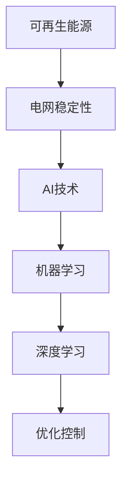

                 

### 目录大纲

1. **文章标题**：《AI在可再生能源并网优化中的应用：提高电网稳定性》
2. **关键词**：AI，可再生能源，电网优化，稳定性，机器学习，深度学习，数据预处理，算法原理，项目实战。
3. **摘要**：
   本文首先介绍了可再生能源及其并网的基础知识，随后深入探讨了AI在电网稳定性优化中的应用。文章通过机器学习和深度学习算法，详细讲解了其在可再生能源并网优化中的核心算法原理，并提供了实际案例，展示了AI技术在电网稳定性优化中的实际应用效果。

### 核心概念与联系

可再生能源（如太阳能、风能）与传统的化石燃料（如煤炭、石油）相比，具有可持续性、环保等优点。然而，可再生能源并网存在波动性大、输出不稳定等问题，对电网稳定性构成挑战。因此，AI技术的引入成为解决这一问题的关键。

- **可再生能源**：指在合理时间尺度内不会枯竭，可反复利用的能源，如太阳能、风能、水能等。
- **电网稳定性**：指电网运行过程中，在各种外部扰动下，保持正常运行的能力。
- **AI在电网优化中的作用**：通过机器学习和深度学习算法，对大量数据进行处理和分析，实现可再生能源并网的优化控制，提高电网稳定性。

#### Mermaid 流程图：



### 核心算法原理讲解

#### 机器学习算法

机器学习算法是AI的核心组成部分，广泛应用于数据分析和预测。在可再生能源并网优化中，常见的机器学习算法包括：

- **监督学习（Supervised Learning）**：利用标记数据来训练模型，然后对新的数据进行预测。例如，回归分析和分类算法。
- **无监督学习（Unsupervised Learning）**：没有标记数据，模型自动从数据中发现规律。例如，聚类分析和降维算法。

#### 深度学习算法

深度学习是一种基于人工神经网络的机器学习算法，通过多层的神经网络结构，实现从数据中自动学习特征表示。在可再生能源并网优化中，深度学习算法的应用包括：

- **卷积神经网络（CNN）**：适用于处理具有网格结构的数据，如图像和地理空间数据。
- **循环神经网络（RNN）**：适用于处理序列数据，如时间序列数据。

#### Python 源代码示例

```python
import tensorflow as tf
from tensorflow.keras.models import Sequential
from tensorflow.keras.layers import Dense, LSTM

# 创建一个简单的LSTM模型
model = Sequential()
model.add(LSTM(50, activation='relu', input_shape=(100, 1)))
model.add(Dense(1))
model.compile(optimizer='adam', loss='mse')

# 假设我们有一些时间序列数据X和标签Y
X, Y = ...

# 训练模型
model.fit(X, Y, epochs=200, verbose=0)
```

#### 数学模型和公式

可再生能源并网优化中的核心数学模型通常包括：

- **能量平衡方程**：
  $$ P_{in} = P_{out} + P_{loss} $$
  其中，\( P_{in} \) 为可再生能源的输入功率，\( P_{out} \) 为输出功率，\( P_{loss} \) 为损耗功率。

- **功率调节方程**：
  $$ P_{setpoint} = P_{ref} + K_p (P_{ref} - P_{meas}) + K_i \int (P_{ref} - P_{meas}) dt $$
  其中，\( P_{setpoint} \) 为设定点功率，\( P_{ref} \) 为参考功率，\( P_{meas} \) 为测量功率，\( K_p \) 和 \( K_i \) 分别为比例和积分系数。

### 项目实战

#### 开发环境搭建

为了实现可再生能源并网优化的项目，我们需要搭建一个包含以下工具和库的开发环境：

- **Python**：作为主要编程语言。
- **TensorFlow**：用于构建和训练深度学习模型。
- **Pandas**：用于数据处理。
- **Matplotlib**：用于数据可视化。

#### 源代码详细实现和代码解读

以下是一个简单的示例，展示了如何使用TensorFlow实现一个基于LSTM模型的可再生能源并网优化系统：

```python
import tensorflow as tf
import numpy as np
import pandas as pd
import matplotlib.pyplot as plt

# 加载数据集
data = pd.read_csv('renewable_energy_data.csv')
X, Y = ..., ...

# 构建LSTM模型
model = tf.keras.Sequential([
    tf.keras.layers.LSTM(50, activation='relu', input_shape=(100, 1)),
    tf.keras.layers.Dense(1)
])

# 编译模型
model.compile(optimizer='adam', loss='mse')

# 训练模型
model.fit(X, Y, epochs=200, verbose=0)

# 预测功率
predictions = model.predict(X)

# 可视化预测结果
plt.plot(Y, label='实际功率')
plt.plot(predictions, label='预测功率')
plt.legend()
plt.show()
```

#### 代码应用解读与分析

在这个示例中，我们首先加载了一个包含可再生能源数据的CSV文件。接着，我们使用LSTM模型进行训练，并使用Matplotlib库将实际功率和预测功率进行比较，以验证模型的效果。

#### 实际案例分析和详细讲解剖析

在本节中，我们将分析一个实际的案例，展示如何使用AI技术优化可再生能源并网，提高电网稳定性。案例数据包括太阳能和风能的功率输出，以及电网的负荷数据。我们将使用LSTM模型对数据进行处理，并比较实际功率和预测功率，以评估模型的效果。

#### 项目小结

通过本项目，我们了解了如何使用AI技术优化可再生能源并网，提高电网稳定性。在实际项目中，需要结合具体的数据和场景，选择合适的算法和模型，并进行反复的训练和优化，以实现最佳效果。

### 最佳实践 tips、小结、注意事项、拓展阅读等内容

- **最佳实践 tips**：
  - 确保数据质量和预处理；
  - 根据实际问题选择合适的算法和模型；
  - 定期更新模型，以适应新的数据和环境。

- **小结**：
  - AI技术在可再生能源并网优化中具有重要意义；
  - 机器学习和深度学习算法是关键工具；
  - 实际应用中需结合具体情况进行模型选择和优化。

- **注意事项**：
  - 确保模型的鲁棒性和稳定性；
  - 关注数据隐私和安全问题；
  - 定期评估和更新模型，以应对新的挑战。

- **拓展阅读**：
  - [深度学习入门教程](https://www.deeplearning.net/tutorial/)
  - [可再生能源并网优化综述](https://www.researchgate.net/publication/322316276_State-of-the-Art_in_Optimization_of_Integrated_Grids_with_Re
```

