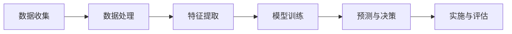

                 

## AI在城市规划中的应用：从交通流优化到土地利用

### 关键词

- **AI**、**城市规划**、**交通流优化**、**土地利用**、**深度学习**、**机器学习**

### 摘要

本文探讨了人工智能（AI）在城市规划中的应用，重点关注交通流优化和土地利用两个方面。通过介绍AI的核心概念及其在具体应用场景中的实现，文章旨在展示AI技术如何提高城市规划的科学性和效率，为城市的可持续发展提供强有力的技术支持。

## 引言

### 城市规划中的AI应用背景

城市作为人类文明的集中体现，其规划与建设的重要性不言而喻。然而，现代城市面临的问题日益复杂，传统的城市规划方法往往难以应对。人工智能技术的快速发展为城市规划提供了新的视角和工具。AI技术可以处理大量数据，提取有价值的信息，从而辅助决策者制定更科学、合理的城市规划方案。

### AI在城市规划中的核心概念

人工智能的核心概念包括深度学习、机器学习、数据挖掘等。深度学习通过模拟人脑神经网络结构，实现数据的自动学习和特征提取；机器学习则利用算法从数据中学习规律，进行预测和分类；数据挖掘则是对大量数据进行挖掘，寻找潜在的模式和关联。这些技术共同构成了AI在城市规划中的应用基础。

### AI在城市规划中的应用价值

AI在城市规划中的应用价值主要体现在以下几个方面：

1. **提高规划效率**：AI可以快速处理大量数据，提供实时分析结果，大大提高了规划效率。
2. **优化资源分配**：AI可以帮助优化土地利用，提高城市资源利用率，降低能源消耗。
3. **改善生活质量**：通过智能交通系统等技术的应用，可以减少交通拥堵，提高居民生活质量。
4. **增强决策科学性**：AI技术可以提供基于数据的决策支持，减少主观偏见，提高决策的科学性。

## AI在城市规划中的核心概念

### 深度学习与机器学习

深度学习是人工智能的一个分支，它通过多层神经网络对数据进行训练，从而实现复杂的数据特征提取和模式识别。机器学习则是利用算法从数据中学习规律，进行预测和分类。深度学习和机器学习是AI在城市规划中的核心技术，它们共同构成了城市规划的智能决策系统。

### Mermaid流程图：AI在城市规划中的应用流程



### 核心概念原理与架构

在AI应用于城市规划时，深度学习和机器学习发挥着至关重要的作用。深度学习通过多层神经网络对数据进行训练，可以自动提取数据中的隐藏特征，从而实现高精度的预测。而机器学习则通过优化算法，从历史数据中学习规律，为城市规划提供决策支持。

### 深度学习在规划中的应用

深度学习在规划中的应用主要包括以下两个方面：

1. **交通流量预测**：利用深度学习算法对交通流量进行预测，为交通信号控制提供数据支持。
2. **土地利用优化**：通过深度学习算法分析土地利用数据，优化土地利用方案，提高土地利用效率。

### 机器学习在规划中的应用

机器学习在规划中的应用主要体现在以下两个方面：

1. **规划方案评估**：利用机器学习算法对不同的规划方案进行评估，选择最优方案。
2. **环境监测与治理**：通过机器学习算法分析环境数据，监测城市环境质量，并提出治理方案。

## 交通流优化中的AI应用

### 智能交通信号控制系统的AI应用

智能交通信号控制系统是AI技术在城市规划中的重要应用之一。它通过收集交通数据，利用机器学习算法分析交通流量，动态调整信号灯时长，以减少交通拥堵，提高道路通行效率。

### 伪代码：交通信号控制算法

```python
def traffic_signal_control(input_data):
    # 输入数据预处理
    preprocessed_data = preprocess_data(input_data)
    
    # 使用神经网络预测交通流量
    traffic_flow = neural_network_predict(preprocessed_data)
    
    # 根据预测结果调整信号灯状态
    adjust_signals(traffic_flow)
```

### 自动驾驶技术在城市规划中的应用

自动驾驶技术是另一个重要领域，它通过深度学习算法实现车辆的自主驾驶，对城市规划产生深远影响。自动驾驶车辆可以实时感知环境，根据交通状况做出决策，从而提高道路利用率，减少交通事故。

### 伪代码：自动驾驶算法

```python
def autonomous_driving(input_data):
    # 输入数据预处理
    preprocessed_data = preprocess_data(input_data)
    
    # 使用深度学习算法预测路径
    path = deep_learning_predict(preprocessed_data)
    
    # 根据预测路径控制车辆
    control_vehicle(path)
```

## 土地利用规划中的AI应用

### 土地价值评估模型

土地价值评估是土地利用规划的关键环节。AI技术可以通过机器学习算法分析土地的地理位置、市场需求、基础设施等因素，评估土地的价值。

### 数学模型与公式

$$ V = f(\text{土地位置}, \text{市场需求}, \text{基础设施}) $$

### 详细讲解与举例说明

土地价值评估模型中的变量包括土地位置、市场需求和基础设施。通过机器学习算法，可以建立这些变量与土地价值之间的函数关系，从而实现对土地价值的预测。

### 规划方案优化算法

土地利用规划需要考虑多种因素，如交通流量、环境保护、经济效益等。AI技术可以通过优化算法，从多个规划方案中选出最优方案。

### 伪代码：规划方案优化

```python
def optimize_planning(input_data):
    # 输入数据预处理
    preprocessed_data = preprocess_data(input_data)
    
    # 使用遗传算法优化规划方案
    planning_solution = genetic_algorithm.optimize(preprocessed_data)
```

## 城市环境监测与治理中的AI应用

### 空气质量监测

空气质量监测是城市环境治理的重要方面。AI技术可以通过传感器收集数据，利用机器学习算法分析空气质量，及时发现污染源，并提出治理方案。

### 噪声控制

噪声控制是另一个重要领域。AI技术可以通过声学传感器收集数据，利用深度学习算法分析噪声源，并提出噪声控制方案。

## 城市安全与应急响应中的AI应用

### 火灾预警

火灾预警是城市安全的重要保障。AI技术可以通过视频监控和传感器数据，利用机器学习算法预测火灾风险，及时发出警报。

### 地震预警

地震预警是城市应急响应的关键环节。AI技术可以通过地震监测数据，利用深度学习算法预测地震风险，为城市抗震提供科学依据。

## 总结与展望

AI在城市规划中的应用前景广阔，从交通流优化到土地利用，AI技术正逐步改变城市规划的传统模式。未来，随着AI技术的不断发展和成熟，城市规划将更加科学、智能，为城市的可持续发展提供更强有力的支持。## AI在城市规划中的应用：从交通流优化到土地利用

### 引言

随着全球城市化进程的加速，城市规划面临着前所未有的挑战。传统的方法和工具已经难以应对日益复杂的城市问题，如交通拥堵、土地利用不足、环境污染等。人工智能（AI）技术的发展为城市规划提供了新的视角和解决方案。本文将从交通流优化、土地利用、城市环境监测与治理、城市安全与应急响应等多个方面，探讨AI在城市规划中的应用。

### AI在城市规划中的核心概念

#### 深度学习与机器学习

深度学习和机器学习是AI技术中的两个核心概念。深度学习通过多层神经网络对数据进行自动学习和特征提取，而机器学习则通过算法从数据中学习规律，进行预测和分类。这些技术为城市规划提供了强大的数据分析和决策支持能力。

#### 数据挖掘

数据挖掘是对大量数据进行分析，以发现潜在的模式和关联。在城市规划中，数据挖掘可以帮助识别城市中的关键问题，为规划决策提供依据。

### 交通流优化中的AI应用

#### 智能交通信号控制系统

智能交通信号控制系统是AI在交通流优化中的一个重要应用。它通过收集实时交通数据，利用机器学习算法分析交通流量，动态调整信号灯时长，以减少交通拥堵，提高道路通行效率。

#### 自动驾驶技术

自动驾驶技术是另一个重要的应用领域。自动驾驶车辆通过深度学习算法实现自主驾驶，可以实时感知环境，根据交通状况做出决策，从而提高道路利用率，减少交通事故。

#### 伪代码：交通信号控制算法

```python
def traffic_signal_control(input_data):
    # 输入数据预处理
    preprocessed_data = preprocess_data(input_data)
    
    # 使用神经网络预测交通流量
    traffic_flow = neural_network_predict(preprocessed_data)
    
    # 根据预测结果调整信号灯状态
    adjust_signals(traffic_flow)
```

#### 伪代码：自动驾驶算法

```python
def autonomous_driving(input_data):
    # 输入数据预处理
    preprocessed_data = preprocess_data(input_data)
    
    # 使用深度学习算法预测路径
    path = deep_learning_predict(preprocessed_data)
    
    # 根据预测路径控制车辆
    control_vehicle(path)
```

### 土地利用规划中的AI应用

#### 土地价值评估模型

土地价值评估是土地利用规划的关键环节。AI技术可以通过机器学习算法分析土地的地理位置、市场需求、基础设施等因素，评估土地的价值。

#### 数学模型与公式

$$ V = f(\text{土地位置}, \text{市场需求}, \text{基础设施}) $$

#### 规划方案优化算法

土地利用规划需要考虑多种因素，如交通流量、环境保护、经济效益等。AI技术可以通过优化算法，从多个规划方案中选出最优方案。

#### 伪代码：规划方案优化

```python
def optimize_planning(input_data):
    # 输入数据预处理
    preprocessed_data = preprocess_data(input_data)
    
    # 使用遗传算法优化规划方案
    planning_solution = genetic_algorithm.optimize(preprocessed_data)
```

### 城市环境监测与治理中的AI应用

#### 空气质量监测

空气质量监测是城市环境治理的重要方面。AI技术可以通过传感器收集数据，利用机器学习算法分析空气质量，及时发现污染源，并提出治理方案。

#### 噪声控制

噪声控制是另一个重要领域。AI技术可以通过声学传感器收集数据，利用深度学习算法分析噪声源，并提出噪声控制方案。

### 城市安全与应急响应中的AI应用

#### 火灾预警

火灾预警是城市安全的重要保障。AI技术可以通过视频监控和传感器数据，利用机器学习算法预测火灾风险，及时发出警报。

#### 地震预警

地震预警是城市应急响应的关键环节。AI技术可以通过地震监测数据，利用深度学习算法预测地震风险，为城市抗震提供科学依据。

### 总结与展望

AI在城市规划中的应用具有广阔的前景。从交通流优化到土地利用，AI技术正在逐步改变城市规划的传统模式。未来，随着AI技术的不断发展和成熟，城市规划将更加科学、智能，为城市的可持续发展提供更强有力的支持。作者：AI天才研究院/AI Genius Institute & 禅与计算机程序设计艺术 /Zen And The Art of Computer Programming

