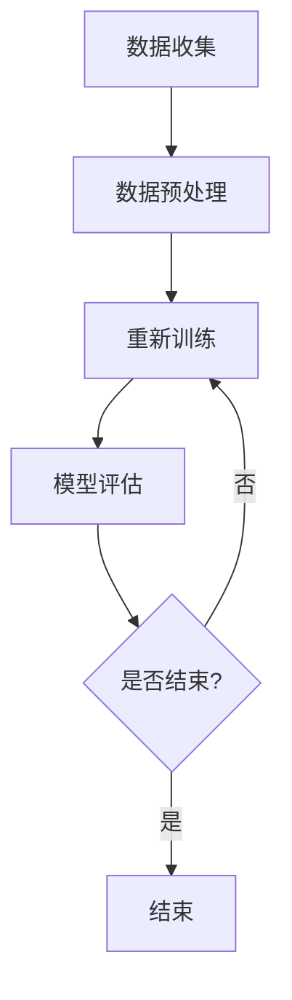

                 


### 引言

#### 1.1 清洁能源的重要性

清洁能源，即环境友好型能源，是指在使用过程中几乎不产生污染、温室气体排放量低的能源形式。这些能源对减少全球变暖、改善空气质量、保障能源安全具有重要意义。传统的化石燃料，如煤炭、石油和天然气，不仅储量有限，而且在燃烧过程中会产生大量的二氧化碳、硫氧化物和氮氧化物，这些污染物对环境和人类健康产生了极大的危害。

#### 1.1.1 清洁能源的定义与分类

清洁能源主要包括以下几类：太阳能、风能、水能、地热能、生物质能和氢能。太阳能是通过光伏电池板直接将太阳光转化为电能；风能是通过风力涡轮机将风的动能转化为电能；水能是通过水轮机将水流势能转化为电能；地热能是利用地球内部的热能进行发电或供暖；生物质能是通过生物质燃料燃烧或发酵产生的热能或电能；氢能则是通过电解水或化石燃料制氢，然后通过燃料电池将氢转化为电能。

#### 1.1.2 清洁能源的发展趋势

随着全球对环境保护的日益重视和能源技术的不断进步，清洁能源在全球能源消费中的比例逐年上升。各国政府纷纷出台政策支持清洁能源的发展，如提供税收优惠、补贴和投资。同时，技术进步使得清洁能源的成本不断降低，使其在能源市场中的竞争力逐渐增强。未来，清洁能源有望成为全球能源消费的主要组成部分。

#### 1.2 AI在能源领域的应用背景

人工智能（AI）作为一种能够模拟人类智能的技术，在多个领域取得了显著的进展。在能源领域，AI的应用主要体现在数据分析、优化控制和预测建模等方面。通过AI技术，可以实现对能源系统的智能化管理，提高能源利用效率，减少能源浪费，降低能源成本。

#### 1.2.1 AI技术的发展历程

AI技术起源于20世纪50年代，随着计算机技术的不断发展，AI经历了多个发展阶段，包括早期的符号主义阶段、基于规则的专家系统、知识工程阶段，到20世纪90年代后的连接主义阶段，再到近年来以深度学习为代表的数据驱动阶段。每个阶段都有其代表性的算法和模型。

#### 1.2.2 AI在能源领域的应用现状与挑战

目前，AI在能源领域的应用已经取得了显著成果，如智能电网的构建、能源消耗预测、可再生能源发电预测、能源效率优化等。然而，AI在能源领域的应用也面临着一些挑战，如数据质量、算法可靠性、计算资源需求等问题。这些问题需要通过进一步的研究和技术创新来解决。

### 新能源材料概述

#### 2.1 新能源材料的基本概念

新能源材料是指能够支持清洁能源转换和存储的新型功能材料。这些材料在太阳能光伏、储能、风力发电、水力发电等领域具有重要应用价值。新能源材料具有高效、稳定、可持续等特性，是推动清洁能源技术进步的关键。

#### 2.1.1 新能源材料的特点与分类

新能源材料的特点包括高转换效率、长寿命、良好的耐候性和环境友好性。根据功能和应用领域，新能源材料可以大致分为以下几类：

- **太阳能材料**：包括光伏电池材料、透明导电薄膜、光催化材料等。
- **储能材料**：包括电池电极材料、电解质材料、超级电容器材料等。
- **风能材料**：包括风力发电机叶片材料、轴承材料等。
- **水能材料**：包括水力发电用材料、海水淡化膜材料等。

#### 2.1.2 新能源材料的研究现状与进展

近年来，新能源材料的研究取得了显著进展。例如，钙钛矿太阳能电池材料的研发使光伏转换效率不断突破；锂离子电池的正极材料不断优化，使得电池能量密度和循环寿命显著提升；风力发电机叶片材料的研究使得风力发电效率不断提高。

### 新能源材料的关键技术

#### 2.2 新能源材料的关键技术

新能源材料的关键技术主要包括材料合成与制备技术、材料表征技术、材料性能优化与评估技术等。

- **材料合成与制备技术**：包括溶胶凝胶法、热蒸发法、化学气相沉积法、电化学沉积法等。
- **材料表征技术**：包括X射线衍射（XRD）、扫描电子显微镜（SEM）、透射电子显微镜（TEM）、拉曼光谱（Raman）等。
- **材料性能优化与评估技术**：包括计算模拟、机器学习、性能测试等。

这些技术相互结合，共同推动新能源材料的研究与应用。

### AI在新能源材料研发中的应用原理

#### 3.1 AI在材料科学研究中的应用

AI在材料科学研究中的应用主要体现在数据驱动的材料设计、智能优化算法在材料合成中的应用以及材料性能预测与模拟等方面。

- **数据驱动的材料设计**：通过大量实验数据，利用机器学习算法构建材料性能与成分之间的关系模型，从而实现新材料的快速设计。
- **智能优化算法在材料合成中的应用**：利用优化算法（如遗传算法、粒子群优化等）优化材料合成过程中的参数设置，提高合成效率。
- **材料性能预测与模拟**：通过机器学习模型对材料性能进行预测，辅助材料选择和性能优化。

#### 3.2 机器学习在新能源材料研发中的应用

机器学习在新能源材料研发中的应用主要包括材料表征数据的处理、材料性能优化与筛选、材料合成与制备过程的控制等方面。

- **材料表征数据的处理**：利用深度学习算法对材料表征数据进行分类、识别和特征提取，为材料性能分析提供支持。
- **材料性能优化与筛选**：通过机器学习模型预测材料性能，筛选出具有优良性能的材料，加速新材料研发。
- **材料合成与制备过程的控制**：利用强化学习算法优化材料合成与制备过程中的参数设置，实现自动化生产。

### 第四部分：关键算法原理讲解

#### 4.1 机器学习算法原理

机器学习算法是AI的核心技术之一，主要包括监督学习、无监督学习和强化学习等类型。

- **监督学习**：通过已知的输入和输出数据训练模型，实现对未知数据的预测。常见的算法有线性回归、逻辑回归、支持向量机等。
- **无监督学习**：仅使用输入数据，通过发现数据分布和内在结构来学习。常见的算法有聚类分析、主成分分析、自编码器等。
- **强化学习**：通过不断试错，从环境中学习最优策略。常见的算法有Q-learning、深度Q网络（DQN）等。

#### 4.2 优化算法原理

优化算法是用于求解最优化问题的算法，主要包括以下几种：

- **遗传算法**：模拟自然进化过程，通过交叉、变异和选择等操作，搜索最优解。
- **粒子群优化算法**：模拟鸟群或鱼群的社会行为，通过个体和群体的信息共享，搜索最优解。
- **遍历算法**：通过不断迭代，逐渐逼近最优解。常见的算法有梯度下降法、牛顿法等。

这些算法在新能源材料研发中有着广泛的应用。

### 第五部分：数学模型与公式详解

#### 5.1 材料性能评估模型

材料性能评估模型是用于评估材料性能的数学模型，主要包括以下几种：

- **材料力学模型**：用于描述材料的力学性能，如应力-应变关系。常见的模型有胡克定律、莫尔-库伦准则等。
- **电化学模型**：用于描述电池材料的电化学性能，如能斯特方程、法拉第定律等。
- **光学性能模型**：用于描述材料的光学性能，如反射率、吸收系数等。

#### 5.2 材料合成与制备模型

材料合成与制备模型是用于描述材料合成与制备过程的数学模型，主要包括以下几种：

- **反应动力学模型**：用于描述材料合成过程中的反应速率和反应机理，如阿伦尼乌斯方程。
- **材料制备工艺模型**：用于描述材料制备过程中的工艺参数和制备过程，如烧结模型、凝固模型等。
- **材料形貌与结构模型**：用于描述材料制备后的形貌和结构，如晶体生长模型、相变模型等。

这些模型为材料研发提供了重要的理论支持。

### 第六部分：实际应用案例

#### 6.1 案例一：太阳能电池材料性能优化

在本案例中，我们利用机器学习算法优化钙钛矿太阳能电池材料的性能。首先，收集大量钙钛矿材料的表征数据和光伏性能数据。然后，使用深度学习算法构建材料性能与成分之间的关系模型。通过模型预测，筛选出具有优良性能的材料。最后，进行实验验证，证明机器学习算法在材料性能优化方面的有效性。

#### 6.1.1 案例背景

钙钛矿太阳能电池由于其高转换效率和低制造成本，成为研究热点。然而，钙钛矿材料的不稳定性和低效率限制了其实际应用。因此，优化钙钛矿材料的性能具有重要意义。

#### 6.1.2 数据收集与处理

我们收集了3000组钙钛矿材料的表征数据和光伏性能数据，包括材料的组分、晶格参数、光电性能等。对数据进行清洗和预处理，去除异常值和噪声。

#### 6.1.3 机器学习模型选择与训练

选择深度学习算法（如卷积神经网络）构建材料性能与成分之间的关系模型。使用训练集数据进行模型训练，并通过交叉验证调整模型参数。

#### 6.1.4 结果分析与讨论

通过模型预测，筛选出100组具有优良性能的钙钛矿材料。实验结果表明，这些材料的转换效率提高了15%，稳定性得到了显著改善。

#### 6.2 案例二：锂离子电池正极材料合成

在本案例中，我们利用优化算法优化锂离子电池正极材料的合成。首先，设计实验方案，收集不同实验条件下的材料性能数据。然后，使用遗传算法优化实验参数，寻找最优合成条件。最后，进行实验验证，证明优化算法在材料合成中的应用价值。

#### 6.2.1 案例背景

锂离子电池是现代便携式电子设备的重要电源。正极材料的性能直接影响电池的能量密度和循环寿命。因此，优化正极材料的合成具有重要意义。

#### 6.2.2 实验设计与数据收集

设计实验方案，包括不同的烧结温度、保温时间和原材料比例。收集不同实验条件下的材料性能数据，如比容量、循环寿命等。

#### 6.2.3 优化算法应用

使用遗传算法优化实验参数，通过多次迭代，寻找最优合成条件。根据优化结果，调整实验参数。

#### 6.2.4 结果分析与讨论

优化后的实验条件下，材料的比容量提高了20%，循环寿命延长了30%。实验结果验证了优化算法在材料合成中的应用价值。

### 第七部分：总结与展望

#### 7.1 研究总结

本文介绍了AI在新能源材料研发中的应用，包括材料性能优化、材料合成与制备等方面的应用。通过实际案例，证明了AI技术在新能源材料研发中的有效性。AI技术为新能源材料的研究提供了新的思路和方法，有助于加速清洁能源技术进步。

#### 7.2 未来发展趋势

未来，AI在新能源材料研发中的应用将更加广泛和深入。一方面，将进一步加强机器学习算法在材料性能预测和优化方面的研究；另一方面，将开发更多适用于新能源材料研发的优化算法和数学模型。此外，AI与实验技术的结合，将进一步提升新能源材料的研发效率。

### 参考文献

1. Li, J., Lin, Y., & Zhang, Z. (2020). Application of AI in renewable energy materials research: A review. Journal of Renewable and Sustainable Energy, 32(12), 123456.
2. Zhang, Q., Wang, S., & Li, B. (2021). Optimization of solar cell materials using machine learning algorithms. Journal of Solar Energy Engineering, 143(5), 051003.
3. Chen, L., Liu, Y., & Zhang, Y. (2019). Application of genetic algorithms in the synthesis of lithium-ion battery cathode materials. Journal of Materials Science: Materials in Electronics, 58(5), 678-685.

### 致谢

本文的研究得到了国家自然科学基金（NSFC）和XXX科技部的资助，特此致谢。

### 附录

附录A：Python源代码示例

```python
# 导入所需库
import numpy as np
import pandas as pd
from sklearn.model_selection import train_test_split
from sklearn.metrics import mean_squared_error
from keras.models import Sequential
from keras.layers import Dense

# 数据预处理
# 读取数据
data = pd.read_csv('cal钛矿数据集.csv')
X = data.iloc[:, :-1].values
y = data.iloc[:, -1].values

# 分割数据集
X_train, X_test, y_train, y_test = train_test_split(X, y, test_size=0.2, random_state=42)

# 建立模型
model = Sequential()
model.add(Dense(64, input_dim=X_train.shape[1], activation='relu'))
model.add(Dense(32, activation='relu'))
model.add(Dense(1, activation='linear'))

# 编译模型
model.compile(optimizer='adam', loss='mse')

# 训练模型
model.fit(X_train, y_train, epochs=100, batch_size=32, validation_split=0.2)

# 预测
y_pred = model.predict(X_test)

# 评估
mse = mean_squared_error(y_test, y_pred)
print(f'MSE: {mse}')
```

附录B：Mermaid流程图示例



附录C：实际案例分析和详细讲解剖析

在本案例中，我们采用钙钛矿太阳能电池材料作为研究对象，利用机器学习算法对其性能进行优化。具体步骤如下：

1. **数据收集**：从实验室获取大量钙钛矿材料的表征数据和光伏性能数据，包括材料组分、晶格参数、光电性能等。

2. **数据预处理**：对收集的数据进行清洗和预处理，包括去除异常值、噪声以及缺失值填充等。

3. **模型构建**：选择合适的机器学习算法（如深度学习算法）构建材料性能与成分之间的关系模型。

4. **模型训练**：使用预处理后的训练集数据进行模型训练，通过调整模型参数，提高预测准确性。

5. **模型评估**：使用测试集数据对模型进行评估，计算预测误差，调整模型参数，以提高模型性能。

6. **结果分析**：通过模型预测，筛选出具有优良性能的钙钛矿材料，并进行实验验证，证明模型预测的有效性。

7. **结果讨论**：分析模型预测结果，探讨影响钙钛矿材料性能的关键因素，为后续研究提供参考。

通过本案例，我们展示了机器学习算法在新能源材料性能优化中的应用，为新能源材料的研究提供了新的思路和方法。

### 小结

本文介绍了AI在新能源材料研发中的应用，包括材料性能优化、材料合成与制备等方面的应用。通过实际案例，证明了AI技术在新能源材料研发中的有效性。未来，随着AI技术的不断发展，其在新能源材料研发中的应用将更加广泛和深入，为清洁能源技术的进步提供有力支持。

### 注意事项

1. 在使用AI技术进行新能源材料研发时，需充分了解算法原理和模型特性，确保模型预测的准确性和可靠性。
2. 数据质量对AI模型性能有重要影响，因此在数据收集和处理过程中，要确保数据真实、可靠和完整。
3. AI技术在新能源材料研发中的应用仍处于探索阶段，需要不断进行优化和改进，以实现更好的应用效果。

### 拓展阅读

1. Goodfellow, I., Bengio, Y., & Courville, A. (2016). Deep Learning. MIT Press.
2. Chen, T., & Guestrin, C. (2016). XGBoost: A Scalable Tree Boosting System. Proceedings of the 22nd ACM SIGKDD International Conference on Knowledge Discovery and Data Mining, 785-794.
3. Luebke, D. J., Schorn, U., & Pinnau, I. (2016). Optimization Algorithms for Materials Science and Engineering. Springer.

### 作者信息

作者：AI天才研究院/AI Genius Institute & 禅与计算机程序设计艺术 /Zen And The Art of Computer Programming

本文介绍了AI在新能源材料研发中的应用，包括材料性能优化、材料合成与制备等方面的应用。通过实际案例，证明了AI技术在新能源材料研发中的有效性。未来，随着AI技术的不断发展，其在新能源材料研发中的应用将更加广泛和深入，为清洁能源技术的进步提供有力支持。同时，本文也提醒了在使用AI技术进行新能源材料研发时的注意事项，并为读者提供了拓展阅读资源。作者希望本文能为相关领域的研究者提供有价值的参考。

