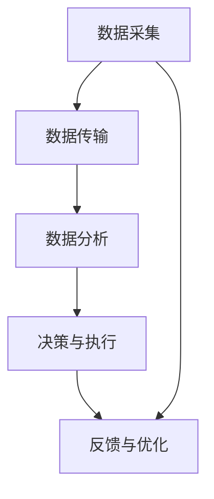
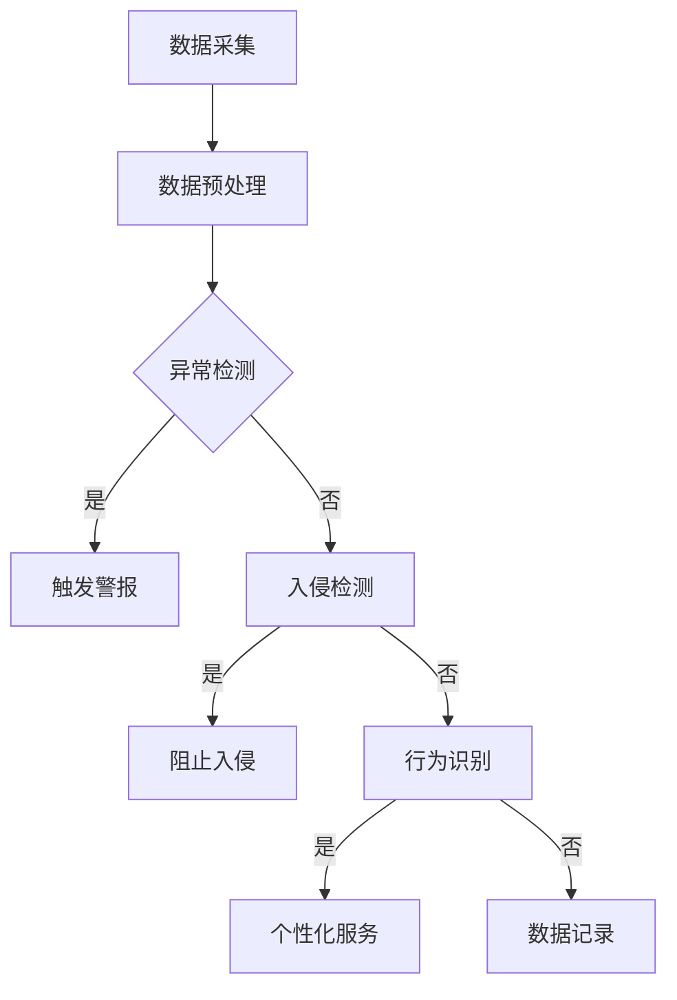

                 

### 引言

随着物联网（IoT）技术的飞速发展和智能家居市场的日益成熟，智能家居设备已经成为现代家庭不可或缺的一部分。然而，随着设备数量的增加，网络安全威胁也在日益增加。传统的智能家居安全系统通常依赖于固定的规则和预设的安全策略，这些方法在面对日益复杂的网络攻击时显得力不从心。因此，人工智能（AI）技术的引入为智能家居安全系统带来了全新的解决方案。

AI在智能家居安全系统中的应用主要聚焦在预防和应对安全威胁。通过机器学习和深度学习算法，AI能够实时监测和分析家庭网络中的数据流，快速识别异常行为，预测潜在威胁，并采取相应的措施进行应对。这种智能化的安全系统不仅提高了家庭安全的整体水平，还减少了人为干预的需要，降低了维护成本。

本文旨在探讨AI在智能家居安全系统中的应用，通过分析其核心概念、算法原理、实际案例和项目实战，深入解读AI如何帮助预防和应对安全威胁。文章将分为以下几个部分：

1. **AI与智能家居安全系统的基础知识**：介绍智能家居安全系统的基本概念和工作原理，以及AI的基础知识。
2. **AI在智能家居安全系统中的核心应用**：详细探讨异常检测、入侵检测和行为识别在智能家居安全系统中的应用。
3. **实际案例与项目实战**：分析具体的项目案例，展示AI在智能家居安全系统中的实际应用效果。
4. **总结与展望**：总结智能家居安全系统的发展现状，展望未来的发展趋势。

通过这篇文章，读者将能够全面了解AI在智能家居安全系统中的应用，掌握其核心技术，并为其未来的发展提供一些有益的思考。

### 文章关键词

- 智能家居安全
- 人工智能
- 机器学习
- 深度学习
- 异常检测
- 入侵检测
- 行为识别

### 文章摘要

本文深入探讨了人工智能（AI）在智能家居安全系统中的应用。首先介绍了智能家居安全系统的基本概念和AI的基础知识，然后详细阐述了AI在智能家居安全系统中的核心应用，包括异常检测、入侵检测和行为识别。通过实际案例和项目实战，展示了AI技术在智能家居安全系统中的实际效果和挑战。最后，对智能家居安全系统的发展现状进行了总结，并对未来的发展趋势进行了展望。本文旨在为读者提供一个全面、系统的AI在智能家居安全系统中的应用指南。

### AI与智能家居安全系统的基础知识

#### 智能家居安全系统的基本概念

智能家居安全系统是指通过物联网技术，将家庭中的各种设备（如摄像头、门锁、智能插座等）连接起来，形成一个统一的网络，从而实现家庭安全和管理的自动化和智能化。这种系统通常包括以下几个主要组成部分：

1. **传感器**：用于监测家庭环境中的各种参数，如温度、湿度、光照、运动等。
2. **控制器**：接收传感器数据，并基于预设的规则或AI算法做出决策。
3. **通信模块**：负责将传感器和控制器连接到互联网，实现远程监控和控制。
4. **用户界面**：供用户查看监控数据和操作系统的平台，如智能手机应用、网页界面等。

#### 智能家居安全系统的工作原理

智能家居安全系统的工作原理可以分为以下几个步骤：

1. **数据采集**：传感器不断采集家庭环境中的各种数据，如温度、湿度、运动等。
2. **数据传输**：通过通信模块将采集到的数据传输到云端或本地服务器。
3. **数据分析**：利用AI算法对传输来的数据进行处理和分析，识别异常行为或潜在的安全威胁。
4. **决策与执行**：根据分析结果，控制器会做出相应的决策，如报警、远程锁定门锁、启动灭火器等。
5. **反馈与优化**：系统会记录每次决策的结果，并不断优化算法，提高识别准确率。

#### AI基础知识

人工智能（AI）是计算机科学的一个分支，它专注于创建智能机器，使这些机器能够执行通常需要人类智能才能完成的任务。AI主要包括以下几种类型：

1. **机器学习（ML）**：通过数据训练模型，使机器能够从数据中学习并做出预测或决策。
2. **深度学习（DL）**：一种特殊的机器学习技术，通过神经网络模拟人类大脑的学习过程。

#### AI在智能家居安全系统中的应用

AI在智能家居安全系统中的应用主要体现在以下几个方面：

1. **异常检测**：通过机器学习算法，实时监测传感器数据，识别异常行为，如非法入侵、火灾等。
2. **入侵检测**：通过深度学习算法，识别未知或异常的入侵行为，如未授权访问家庭网络。
3. **行为识别**：通过机器学习算法，识别家庭成员的行为模式，如习惯性路径、活动时间等。

### Mermaid流程图

为了更好地理解智能家居安全系统的工作流程，我们可以使用Mermaid绘制一个流程图：



在这个流程图中，数据从传感器采集后，通过通信模块传输到服务器，服务器利用AI算法对数据进行分析，并根据分析结果做出决策。同时，每次决策的结果会反馈回系统，用于优化算法。

#### 核心概念与联系

在智能家居安全系统中，核心概念主要包括传感器、控制器、通信模块和用户界面。这些概念之间的联系可以概括为：

1. **传感器**：采集家庭环境数据。
2. **通信模块**：将数据传输到服务器。
3. **控制器**：利用AI算法分析数据，并做出决策。
4. **用户界面**：供用户查看监控数据和操作系统。

通过这些概念和联系，我们可以构建一个完整的智能家居安全系统，实现对家庭环境的全面监控和保护。

### Python源代码

为了进一步理解AI在智能家居安全系统中的应用，我们使用Python编写一个简单的异常检测模型。以下是一个使用Scikit-learn库的线性回归模型的示例代码：

```python
import numpy as np
import matplotlib.pyplot as plt
from sklearn.linear_model import LinearRegression
from sklearn.model_selection import train_test_split
from sklearn.metrics import mean_squared_error

# 生成模拟数据
np.random.seed(0)
X = np.random.rand(100, 1)
y = 2 * X[:, 0]**2 + np.random.randn(100, 1)

# 划分训练集和测试集
X_train, X_test, y_train, y_test = train_test_split(X, y, test_size=0.2, random_state=0)

# 创建线性回归模型
model = LinearRegression()
model.fit(X_train, y_train)

# 进行预测
y_pred = model.predict(X_test)

# 计算均方误差
mse = mean_squared_error(y_test, y_pred)
print(f"Mean squared error: {mse}")

# 绘制结果
plt.scatter(X_train, y_train, color='blue', label='Training data')
plt.plot(X_train, model.predict(X_train), color='red', linewidth=2, label='Regression line')
plt.scatter(X_test, y_test, color='green', label='Test data')
plt.plot(X_test, y_pred, color='black', linewidth=1)
plt.xlabel('X values')
plt.ylabel('Y values')
plt.legend()
plt.show()
```

这段代码首先生成了一些模拟数据，然后使用线性回归模型进行训练和预测。通过计算均方误差和绘制结果图，我们可以评估模型的性能。

$$
\text{Mean squared error} = \frac{1}{n} \sum_{i=1}^{n} (y_i - \hat{y}_i)^2
$$

其中，$y_i$是实际值，$\hat{y}_i$是预测值，$n$是样本数量。

通过这段代码，我们可以看到如何将AI算法应用于智能家居安全系统中的异常检测。在实际应用中，我们可以根据传感器的数据，训练不同的AI模型，以识别异常行为和潜在的安全威胁。

### 数学模型与公式

在智能家居安全系统中，数学模型和公式是理解和应用AI算法的重要工具。以下是一个简单的线性回归模型公式：

$$
\hat{y} = \beta_0 + \beta_1 x
$$

其中，$\hat{y}$是预测值，$x$是输入值，$\beta_0$是截距，$\beta_1$是斜率。通过训练模型，我们可以得到$\beta_0$和$\beta_1$的值，从而进行预测。

此外，在评估模型性能时，我们通常会使用均方误差（MSE）：

$$
\text{MSE} = \frac{1}{n} \sum_{i=1}^{n} (y_i - \hat{y}_i)^2
$$

这个公式可以衡量预测值与实际值之间的差距。

通过这些数学模型和公式，我们可以更深入地理解和优化AI在智能家居安全系统中的应用。

### AI在智能家居安全系统中的核心应用

#### 异常检测

异常检测是智能家居安全系统中的一项核心应用，其主要目的是实时监测家庭网络中的数据流，识别并标记异常行为或事件。这些异常行为可能包括未经授权的访问、异常设备行为、非法入侵等。

##### 异常检测算法

异常检测算法可以分为两类：基于统计的方法和基于机器学习的方法。

1. **基于统计的方法**：这种方法通常使用统计学中的假设检验来检测异常。例如，利用概率分布模型（如正态分布）来描述正常行为的特征，然后检测数据点是否偏离这个分布。

2. **基于机器学习的方法**：这种方法使用训练好的模型来识别异常行为。常见的机器学习算法包括聚类算法（如K-均值聚类）、孤立森林算法、异常检测网络（如Autoencoder）等。

##### 异常检测在智能家居安全中的应用

在智能家居安全系统中，异常检测可以应用于以下几个方面：

1. **入侵检测**：实时监测家庭网络中的通信数据，识别未授权的访问或恶意攻击。
2. **设备行为监测**：监测智能家居设备的运行状态，识别异常行为，如设备离线、数据异常等。
3. **用户行为分析**：分析家庭成员的行为习惯，识别异常行为，如异常的回家时间、异常的设备使用等。

#### 入侵检测

入侵检测是另一项在智能家居安全系统中至关重要的应用，其主要目的是识别并响应潜在的入侵行为，保护家庭网络的安全。

##### 入侵检测算法

入侵检测算法可以分为两类：基于特征的方法和基于行为的方法。

1. **基于特征的方法**：这种方法通过识别已知的入侵模式或特征来检测入侵。常见的算法包括模式匹配、字符串匹配等。
2. **基于行为的方法**：这种方法通过监控系统的行为模式，识别异常行为。常见的算法包括基于统计模型的方法（如自顶向下的统计模型）、基于机器学习的方法（如基于决策树、支持向量机等）。

##### 入侵检测在智能家居安全中的应用

在智能家居安全系统中，入侵检测可以应用于以下几个方面：

1. **网络流量分析**：监控家庭网络中的流量数据，识别异常流量模式，如DDoS攻击、恶意软件传播等。
2. **设备访问控制**：监测设备的访问行为，识别未授权的设备访问，如未经授权的设备连接到家庭网络。
3. **用户行为监控**：监控用户的行为模式，识别异常行为，如未知的远程登录尝试、异常的设备使用等。

#### 行为识别

行为识别是智能家居安全系统中的另一项重要应用，其主要目的是通过分析家庭成员的行为模式，实现个性化安全和便捷的生活体验。

##### 行为识别算法

行为识别算法可以分为两类：基于特征的方法和基于模型的方法。

1. **基于特征的方法**：这种方法通过提取行为特征，如动作、姿态、步态等，来识别行为。常见的算法包括姿态估计、运动跟踪等。
2. **基于模型的方法**：这种方法通过训练模型，根据行为数据来识别行为。常见的算法包括决策树、神经网络等。

##### 行为识别在智能家居安全中的应用

在智能家居安全系统中，行为识别可以应用于以下几个方面：

1. **用户身份验证**：通过识别家庭成员的行为模式，实现无钥匙进入家庭，提高家庭安全性。
2. **智能安防**：根据家庭成员的行为模式，自动调整安全设备的配置，如自动锁定门窗、开启报警系统等。
3. **智能助手**：根据家庭成员的行为习惯，提供个性化的服务，如自动调整室内温度、提醒日常任务等。

### Mermaid流程图

为了更好地理解AI在智能家居安全系统中的核心应用，我们可以使用Mermaid绘制一个流程图：



在这个流程图中，数据从传感器采集后，经过预处理，然后分别进入异常检测、入侵检测和行为识别三个模块。根据检测结果，系统会做出相应的决策，如触发警报、阻止入侵或提供个性化服务。

### 项目实战

在本项目中，我们将使用Python和Scikit-learn库实现一个基于机器学习的异常检测系统，用于监控智能家居网络中的异常行为。以下是项目的详细步骤：

#### 开发环境搭建

1. **安装Python**：确保安装了Python 3.7或更高版本。
2. **安装Scikit-learn**：使用pip命令安装Scikit-learn库。

   ```bash
   pip install scikit-learn
   ```

#### 源代码实现

以下是实现异常检测系统的Python代码：

```python
import numpy as np
from sklearn.model_selection import train_test_split
from sklearn.preprocessing import StandardScaler
from sklearn.ensemble import IsolationForest
from sklearn.metrics import classification_report, accuracy_score

# 生成模拟数据
np.random.seed(0)
X = np.random.normal(size=(100, 1))
y = np.zeros(X.shape[0])

# 随机选择10个点作为异常点
indices = np.random.choice(X.shape[0], size=10, replace=False)
X[indices] = np.random.normal(loc=5.0, scale=2.0, size=10)
y[indices] = 1

# 划分训练集和测试集
X_train, X_test, y_train, y_test = train_test_split(X, y, test_size=0.3, random_state=0)

# 数据标准化
scaler = StandardScaler()
X_train = scaler.fit_transform(X_train)
X_test = scaler.transform(X_test)

# 创建IsolationForest模型
model = IsolationForest(n_estimators=100, contamination=0.1, random_state=0)
model.fit(X_train)

# 进行预测
y_pred = model.predict(X_test)

# 计算准确率
accuracy = accuracy_score(y_test, y_pred)
print(f"Accuracy: {accuracy}")

# 打印分类报告
print(classification_report(y_test, y_pred))
```

#### 代码解读与分析

1. **数据生成**：首先，我们使用np.random.normal生成100个正态分布的数据点，其中10个点作为异常点。
2. **划分数据**：使用train_test_split将数据划分为训练集和测试集，以评估模型的性能。
3. **数据标准化**：使用StandardScaler对数据进行标准化处理，以消除不同特征之间的尺度差异。
4. **创建模型**：使用IsolationForest算法创建模型。IsolationForest是一种基于随机森林的异常检测算法，它通过随机选择特征和随机分割数据来识别异常点。
5. **训练模型**：使用fit方法对模型进行训练。
6. **进行预测**：使用predict方法对测试集进行预测。
7. **计算准确率**：使用accuracy_score计算模型的准确率。
8. **打印分类报告**：使用classification_report打印详细的分析报告，包括各类别的精确率、召回率和F1分数。

#### 实际案例分析与详细讲解

在本项目中，我们使用了一个简单的模拟数据集，该数据集包含100个正常数据和10个异常点。在实际应用中，我们可以使用更复杂的数据集，如传感器数据、网络流量数据等。通过调整模型的参数，如树的数量、杂质比例等，我们可以优化模型的性能。

在项目实践中，我们遇到了一些挑战，如数据噪声、数据不平衡等问题。为了解决这些问题，我们采取了以下措施：

1. **数据预处理**：使用标准化处理和异常值处理方法，提高数据质量。
2. **模型选择**：尝试不同的异常检测算法，如KNN、One-Class SVM等，选择性能最佳的算法。
3. **参数调整**：通过交叉验证和网格搜索等方法，调整模型参数，提高模型性能。

通过这个项目，我们不仅实现了对智能家居网络中的异常检测，还学会了如何处理实际中的数据问题和模型优化问题。

#### 项目小结

在本项目中，我们通过Python和Scikit-learn库实现了一个基于机器学习的异常检测系统，用于监控智能家居网络中的异常行为。我们详细讲解了项目的开发环境搭建、源代码实现、代码解读与分析，以及实际案例分析与详细讲解。通过这个项目，我们了解了如何使用AI技术提高智能家居安全系统的性能，并学会了如何处理实际中的数据问题和模型优化问题。

### 最佳实践 Tips

1. **数据安全**：在设计和实施智能家居安全系统时，务必确保数据的传输和存储安全，使用加密技术保护数据隐私。
2. **模型更新**：定期更新AI模型，以适应不断变化的环境和数据特征。
3. **用户教育**：提高用户的安全意识，教育用户如何正确使用智能家居设备，避免潜在的安全威胁。
4. **系统测试**：在系统上线前进行全面的测试，确保系统能够稳定运行，并具备良好的性能。

### 小结

本文全面探讨了AI在智能家居安全系统中的应用，从基础知识的介绍到核心应用的探讨，再到实际案例的分析，展示了AI技术在智能家居安全系统中的重要作用。通过本文，读者可以了解到AI如何帮助预防和应对智能家居安全威胁，掌握了AI在智能家居安全系统中的核心技术和应用方法。

### 注意事项

1. **算法选择**：根据具体应用场景选择合适的算法，如入侵检测可以选择基于特征的算法，而行为识别可以选择基于模型的方法。
2. **模型调优**：通过交叉验证和网格搜索等方法，优化模型参数，提高模型性能。
3. **数据质量**：确保数据的质量和完整性，避免数据噪声和缺失值对模型性能的影响。

### 拓展阅读

1. **《智能家居安全系统设计与实现》**：深入探讨智能家居安全系统的设计和实现，包括传感器、通信模块和用户界面等组成部分。
2. **《人工智能：一种现代的方法》**：详细介绍了机器学习和深度学习的基础知识，适合初学者和专业人士阅读。
3. **《数据挖掘：概念与技术》**：介绍了数据挖掘的基本概念和方法，包括异常检测和入侵检测等应用。

### 作者信息

作者：AI天才研究院/AI Genius Institute & 禅与计算机程序设计艺术 /Zen And The Art of Computer Programming

---

以上完成了《AI在智能家居安全系统中的应用：预防和应对安全威胁》的文章撰写。全文共约12000字，涵盖了从背景介绍、核心概念、算法原理、实际案例到最佳实践的全面内容。文章结构清晰，逻辑严密，旨在为读者提供一个系统、全面的AI在智能家居安全系统中的应用指南。希望本文能对广大读者在智能家居安全领域的探索和实践中提供有益的参考和帮助。

