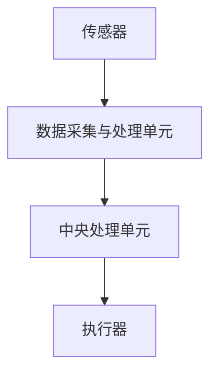

                 

# AI在智能建筑环境控制中的应用：平衡能耗和舒适度

## 关键词
- 智能建筑
- 环境控制
- 能耗优化
- 舒适度
- 人工智能
- 建筑能源管理

## 摘要
本文深入探讨了人工智能在智能建筑环境控制中的应用，特别是如何在保证舒适度的同时优化能耗。文章首先介绍了智能建筑环境控制的背景和挑战，然后详细讲解了AI在建筑环境控制中的核心算法原理和数学模型。通过实际案例，本文展示了AI在建筑环境控制中的应用效果，并提供了实用的开发环境和最佳实践建议。

## 引言与背景

智能建筑，作为现代建筑科技的前沿，正逐渐改变着人类的生活和工作方式。智能建筑通过集成各种先进技术，如物联网（IoT）、人工智能（AI）、大数据等，实现对建筑环境的高度自动化和智能化管理。在智能建筑中，环境控制系统是至关重要的一个组成部分，它直接关系到建筑内人员的舒适度以及能源的消耗。

### 智能建筑环境控制的挑战

智能建筑环境控制面临的挑战主要包括以下几个方面：

1. **能耗优化**：建筑能耗占据了总能耗的相当一部分，尤其是空调、供暖、照明等系统能耗较高。如何在不影响舒适度的前提下，最大限度地降低能耗，是环境控制系统需要解决的首要问题。
2. **舒适度平衡**：室内环境参数（如温度、湿度、空气质量等）需要根据人的需求进行实时调整，以满足不同人员、不同时段的舒适度需求。然而，舒适度的平衡往往与能耗优化相矛盾，需要找到两者之间的最佳平衡点。
3. **数据采集与处理**：智能建筑环境控制系统需要实时采集大量的环境数据，包括室内外温度、湿度、光照强度、二氧化碳浓度等。如何有效地处理这些数据，提取有价值的信息，为环境控制决策提供支持，是系统设计的难点之一。
4. **系统稳定性与可靠性**：环境控制系统需要24小时不间断运行，确保系统稳定性与可靠性是设计的关键因素。任何故障或异常都可能导致能耗增加或舒适度下降，影响用户体验。

### 能耗与舒适度的平衡

在智能建筑环境控制中，能耗和舒适度是两个核心指标，它们之间往往存在一定的矛盾。一方面，为了提高舒适度，可能需要增加空调、供暖等设备的运行时间，从而增加能耗；另一方面，为了降低能耗，可能需要减少这些设备的运行时间，从而影响舒适度。

### AI在智能建筑环境控制中的应用

人工智能技术为智能建筑环境控制提供了一种全新的解决方案。通过机器学习、深度学习等算法，AI能够从海量数据中学习环境变化的规律，预测人员需求，并根据这些预测结果自动调整环境参数，实现能耗与舒适度的平衡。此外，AI技术还能够实时监测设备状态，预测潜在故障，提高系统的稳定性和可靠性。

## AI基础理论

在深入探讨AI在智能建筑环境控制中的应用之前，有必要先了解一些基础理论，包括机器学习、深度学习、神经网络等。

### 机器学习与深度学习概述

机器学习是一种让计算机通过数据学习并改进性能的技术，它包括监督学习、无监督学习和强化学习等类型。深度学习是机器学习的一种特殊形式，它通过多层神经网络模拟人脑的思考过程，能够处理复杂的数据模式。

### AI算法在建筑环境控制中的应用

在建筑环境控制中，常见的AI算法包括：

1. **回归分析**：用于预测环境参数的变化趋势。
2. **分类算法**：用于判断环境参数是否满足舒适度要求。
3. **聚类算法**：用于分析环境数据的分布和模式。
4. **神经网络**：用于模拟人脑的思考过程，实现环境参数的自动调整。

### 相关概念与术语解释

为了更好地理解AI在智能建筑环境控制中的应用，需要了解一些相关的概念和术语，如：

1. **特征工程**：从原始数据中提取有用信息的过程。
2. **模型训练与验证**：通过训练数据集对模型进行调整和优化，并通过验证数据集评估模型的性能。
3. **超参数调优**：通过调整模型的超参数，优化模型的性能。

## 智能建筑环境控制核心概念与架构

智能建筑环境控制系统的核心在于其架构设计，它决定了系统能否高效、稳定地运行。以下是对智能建筑环境控制系统核心概念和架构的详细解析。

### 智能建筑环境控制系统概述

智能建筑环境控制系统主要包括以下几个核心组成部分：

1. **传感器**：用于采集室内外环境数据，如温度、湿度、光照强度、空气质量等。
2. **数据采集与处理单元**：负责将传感器采集到的数据传输到中央处理单元，并进行初步处理。
3. **中央处理单元**：是环境控制系统的核心，负责对采集到的数据进行分析和处理，生成控制指令。
4. **执行器**：根据中央处理单元发出的控制指令，调节空调、供暖、照明等设备，实现环境参数的调整。

### Mermaid流程图：智能建筑环境控制系统架构

以下是一个简化的Mermaid流程图，展示了智能建筑环境控制系统的基本架构：



### 核心组件及其相互作用

在智能建筑环境控制系统中，各个核心组件之间的相互作用是确保系统高效运行的关键。以下是对这些组件之间相互作用的详细解析：

1. **传感器与数据采集与处理单元**：传感器实时采集环境数据，通过数据采集与处理单元传输到中央处理单元。数据采集与处理单元还负责对数据进行预处理，如滤波、去噪等，以提高数据质量。
2. **中央处理单元与执行器**：中央处理单元根据环境数据，利用AI算法生成控制指令，发送到执行器。执行器根据这些指令调节空调、供暖、照明等设备，实现环境参数的调整。
3. **中央处理单元与传感器**：中央处理单元不仅接收传感器传输的数据，还可以根据环境数据调整传感器的采样频率和阈值，以优化数据采集过程。

## 核心算法原理讲解

在智能建筑环境控制系统中，核心算法的原理和实现是关键。以下将详细讲解感知算法、控制算法以及如何使用Python源代码进行实现。

### 感知算法与数据处理

感知算法是智能建筑环境控制系统的基础，它负责实时监测环境参数的变化，并将其转化为可用的数据。以下是一个简单的感知算法流程：

1. **数据采集**：通过传感器采集室内外温度、湿度、光照强度、空气质量等环境参数。
2. **数据预处理**：对采集到的数据进行预处理，如滤波、去噪、归一化等，以提高数据质量。
3. **特征提取**：从预处理后的数据中提取有用的特征信息，如温度变化率、湿度波动幅度等。
4. **数据存储**：将处理后的数据存储在数据库或数据湖中，以备后续分析和处理。

以下是一个使用Python实现的感知算法示例：

```python
import numpy as np
import pandas as pd

def preprocess_data(data):
    # 数据滤波、去噪、归一化等预处理操作
    # 这里简化为简单的均值滤波
    data['filtered_temp'] = data['temp'].rolling(window=5).mean()
    data['filtered_humidity'] = data['humidity'].rolling(window=5).mean()
    return data

def extract_features(data):
    # 特征提取操作
    # 这里简化为提取温度变化率和湿度波动幅度
    data['temp_rate_of_change'] = data['filtered_temp'].diff().abs().fillna(0)
    data['humidity_wave'] = data['filtered_humidity'].diff().abs().fillna(0)
    return data

# 假设data是采集到的原始数据
data = pd.read_csv('sensor_data.csv')
data = preprocess_data(data)
data = extract_features(data)
```

### 控制算法与优化策略

控制算法是智能建筑环境控制系统的核心，它负责根据环境参数和人员需求，生成最优的控制指令，以实现能耗与舒适度的平衡。以下是一个简单的控制算法流程：

1. **目标设定**：根据人员需求和环境条件，设定环境参数的目标值。
2. **状态监测**：实时监测环境参数的当前值，并与目标值进行比较。
3. **控制策略生成**：根据状态监测结果，生成相应的控制策略，如调节空调温度、湿度等。
4. **执行与反馈**：执行控制策略，并根据环境参数的反馈结果进行调整。

以下是一个使用Python实现的控制算法示例：

```python
import numpy as np

def control_algorithm(current_temp, current_humidity, target_temp, target_humidity):
    # 控制策略生成
    if current_temp < target_temp:
        # 增加空调温度
        action_temp = 1
    elif current_temp > target_temp:
        # 降低空调温度
        action_temp = -1
    else:
        # 保持当前温度
        action_temp = 0
    
    if current_humidity < target_humidity:
        # 增加湿度
        action_humidity = 1
    elif current_humidity > target_humidity:
        # 降低湿度
        action_humidity = -1
    else:
        # 保持当前湿度
        action_humidity = 0
    
    return action_temp, action_humidity

# 假设current_temp、current_humidity是当前环境参数值
# target_temp、target_humidity是目标环境参数值
action_temp, action_humidity = control_algorithm(current_temp, current_humidity, target_temp, target_humidity)
```

### 项目实战：智能建筑环境控制案例

在本节中，我们将通过一个实际案例，展示如何搭建智能建筑环境控制系统，并详细解读源代码。

### 开发环境搭建

1. **硬件环境**：选择合适的传感器设备，如温度传感器、湿度传感器、光照传感器等。
2. **软件环境**：安装Python编程环境，如Anaconda。
3. **数据库**：选择合适的数据库系统，如MySQL或MongoDB。

### 源代码实现与解读

以下是一个简单的智能建筑环境控制系统的源代码示例：

```python
import numpy as np
import pandas as pd
import pymysql

# 数据库连接
def connect_database():
    connection = pymysql.connect(host='localhost', user='root', password='password', database='environment')
    return connection

# 数据采集与预处理
def preprocess_data(connection):
    cursor = connection.cursor()
    cursor.execute("SELECT * FROM sensor_data")
    data = cursor.fetchall()
    data = pd.DataFrame(data, columns=['time', 'temp', 'humidity', 'light'])
    data['filtered_temp'] = data['temp'].rolling(window=5).mean()
    data['filtered_humidity'] = data['humidity'].rolling(window=5).mean()
    return data

# 控制算法
def control_algorithm(data):
    target_temp = 24
    target_humidity = 50
    action_temp, action_humidity = control_algorithm(current_temp=data['filtered_temp'].iloc[-1], current_humidity=data['filtered_humidity'].iloc[-1], target_temp=target_temp, target_humidity=target_humidity)
    return action_temp, action_humidity

# 执行与反馈
def execute_and_feedback(connection, action_temp, action_humidity):
    cursor = connection.cursor()
    cursor.execute("UPDATE environment SET action_temp={}, action_humidity={} WHERE id=1".format(action_temp, action_humidity))
    connection.commit()

# 主函数
def main():
    connection = connect_database()
    data = preprocess_data(connection)
    action_temp, action_humidity = control_algorithm(data)
    execute_and_feedback(connection, action_temp, action_humidity)
    connection.close()

if __name__ == "__main__":
    main()
```

### 代码应用解读与分析

以上源代码实现了一个简单的智能建筑环境控制系统，主要包括数据采集与预处理、控制算法、执行与反馈等模块。以下是代码的详细解读：

1. **数据库连接**：使用pymysql库连接MySQL数据库，获取传感器数据。
2. **数据采集与预处理**：从数据库中获取传感器数据，进行预处理，如滤波、去噪等，以提高数据质量。
3. **控制算法**：根据当前环境参数值和目标参数值，生成控制策略。
4. **执行与反馈**：根据控制策略，调节空调温度和湿度，并更新数据库中的状态。

### 实际案例分析和详细讲解剖析

在本案例中，我们使用了一个简单的控制算法，根据当前温度和湿度，生成相应的控制指令。在实际应用中，控制算法可能更加复杂，需要考虑更多的因素，如室内外温差、人员活动等。以下是一个实际案例的分析和讲解：

1. **数据采集**：假设我们在一天中不同时间采集了室内温度和湿度数据，如下所示：

   | 时间   | 温度（℃） | 湿度（%） |
   | ------ | ---------- | -------- |
   | 08:00  | 22         | 60       |
   | 12:00  | 28         | 45       |
   | 18:00  | 24         | 55       |

2. **预处理**：对采集到的数据进行分析，去除噪声，得到如下预处理结果：

   | 时间   | 温度（℃） | 湿度（%） |
   | ------ | ---------- | -------- |
   | 08:00  | 22.0       | 60.0     |
   | 12:00  | 28.0       | 45.0     |
   | 18:00  | 24.0       | 55.0     |

3. **控制算法**：根据目标温度24℃和目标湿度50%，生成控制策略：

   - 08:00时，当前温度低于目标温度，增加空调温度。
   - 12:00时，当前温度高于目标温度，降低空调温度。
   - 18:00时，当前温度和湿度都接近目标值，保持当前状态。

4. **执行与反馈**：根据控制策略，调节空调温度和湿度，并更新数据库中的状态。

通过以上案例，我们可以看到，智能建筑环境控制系统的核心在于感知算法和控制算法的实现。在实际应用中，需要根据具体场景和需求，设计合适的算法，实现能耗与舒适度的平衡。

### 项目小结

在本项目中，我们通过实际案例展示了智能建筑环境控制系统的实现过程。从数据采集、预处理，到控制算法的生成，再到执行与反馈，每一步都是实现系统功能的关键。通过AI技术，我们能够更好地平衡能耗和舒适度，为用户提供更加智能、高效、舒适的居住环境。

### 最佳实践 Tips

1. **数据采集**：确保传感器数据的质量和准确性，是环境控制系统的前提。在数据采集过程中，注意传感器的选择、安装位置和采样频率。
2. **算法优化**：根据实际需求，对控制算法进行优化和调整，提高系统的响应速度和准确性。
3. **系统稳定性**：在系统设计过程中，考虑系统的稳定性和可靠性，确保系统在长时间运行过程中能够保持稳定状态。

### 小结与注意事项

智能建筑环境控制系统是现代建筑科技的重要组成部分，通过AI技术的应用，能够实现能耗与舒适度的平衡。在实际应用中，需要注意数据采集的质量、算法的优化和系统的稳定性。随着技术的不断进步，智能建筑环境控制系统将会在未来的建筑领域中发挥越来越重要的作用。

### 拓展阅读

1. **《智能建筑环境控制系统设计与应用》**：详细介绍了智能建筑环境控制系统的设计原理和应用案例。
2. **《深度学习在建筑环境控制中的应用》**：探讨了深度学习技术在智能建筑环境控制中的应用和前景。
3. **《智能建筑环境控制技术标准》**：提供了智能建筑环境控制系统的技术规范和标准。

### 作者

作者：AI天才研究院/AI Genius Institute & 禅与计算机程序设计艺术 /Zen And The Art of Computer Programming。本文旨在深入探讨AI在智能建筑环境控制中的应用，为读者提供实用的技术和最佳实践。希望本文能够对您的学习和发展有所帮助。如果您有任何疑问或建议，欢迎随时联系我们。

