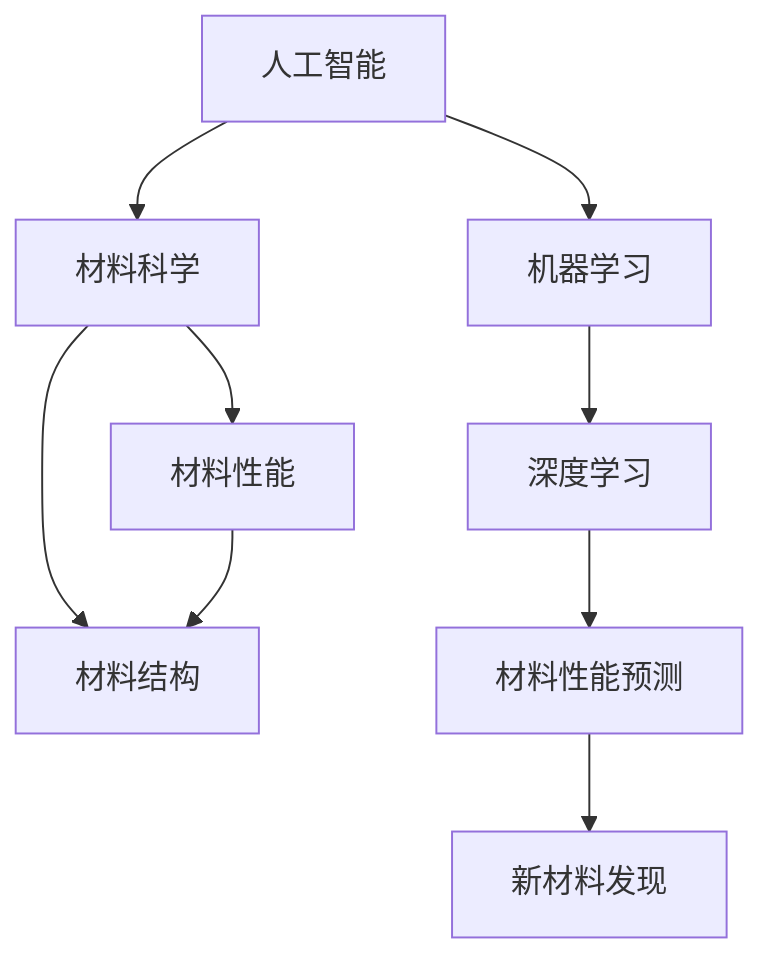

                 

### 标题：AI在材料科学中的应用：加速新材料发现

> **关键词**：人工智能、材料科学、新材料发现、机器学习、预测建模、算法优化  
>
> **摘要**：本文探讨了人工智能在材料科学中的应用，如何通过机器学习和算法优化加速新材料的发现。文章首先介绍了材料科学中的核心问题和现状，然后详细阐述了人工智能技术的基本概念和其在材料科学中的应用。接着，通过实例分析了机器学习算法在材料性能预测和优化中的作用，最后探讨了AI在材料科学领域的挑战和未来发展趋势。

----------------------------------------------------------------

### 背景介绍

材料科学是研究材料的结构、性质、工艺、应用及其相互关系的科学。在人类发展的历史中，材料科学始终扮演着至关重要的角色。从古代的青铜器、铁器，到现代的高强度合金、复合材料，材料的进步推动了人类文明的进步。然而，材料科学的发展也面临着诸多挑战，尤其是在新材料发现和性能优化方面。

传统的材料发现过程主要依赖于实验和经验的积累，这一过程既耗时又耗资。例如，在新材料的合成和优化过程中，研究人员需要反复进行实验，对大量的样本进行性能测试，以寻找具有理想性能的材料。这一过程不仅需要大量的时间和资源，而且存在很大的偶然性，很多新材料可能因为无法及时被发现而错失应用机会。

材料科学中的另一个关键挑战是材料的性能预测和优化。传统的材料性能预测主要依赖于经验公式和理论模型，这些方法往往只能提供粗略的预测，无法精确地描述材料的性能。在材料优化过程中，研究人员需要针对特定的性能目标进行优化，这一过程通常需要大量的计算和实验，而且优化结果往往受到多种因素的影响，难以实现精确的控制。

因此，如何加速新材料的发现和性能优化，提高材料科学的效率，成为当前材料科学研究的重要课题。随着人工智能技术的发展，特别是机器学习和深度学习算法的广泛应用，人工智能开始被引入到材料科学研究中，为解决这些难题提供了新的思路和方法。

人工智能在材料科学中的应用，主要体现在以下几个方面：

1. **大数据分析**：材料科学研究中产生的大量实验数据和材料信息可以通过机器学习算法进行深入分析，从而发现材料性能与结构之间的关系，为新材料的发现提供理论支持。
2. **性能预测**：利用机器学习算法，可以建立材料性能的预测模型，通过输入材料的结构信息，预测材料的性能，从而减少实验次数，提高材料发现的效率。
3. **优化设计**：基于机器学习算法，可以优化材料的合成和制备过程，提高材料的性能和稳定性。
4. **自动化实验**：通过人工智能技术，可以实现实验的自动化和智能化，提高实验的精度和效率。

总之，人工智能技术在材料科学研究中的应用，不仅能够加速新材料的发现，还可以提高材料性能的优化效率，为材料科学的发展带来新的机遇。

### 核心概念与联系

在探讨人工智能在材料科学中的应用之前，我们需要了解几个核心概念，并了解它们之间的关系。以下是几个关键概念的定义及其相互关系：

1. **人工智能（AI）**：人工智能是计算机科学的一个分支，旨在开发能够模拟、延伸和扩展人类智能的理论、算法和技术。人工智能可以分为两大类：**弱人工智能**和**强人工智能**。弱人工智能专注于特定任务的自动化，而强人工智能则具有广泛的理解和自主学习能力。

2. **机器学习（ML）**：机器学习是人工智能的一个子领域，通过从数据中学习模式和规律，使计算机系统能够对未知数据进行预测和决策。机器学习可以分为**监督学习**、**无监督学习**和**强化学习**。监督学习通过标记数据训练模型，无监督学习则在无标记数据中寻找模式，强化学习则通过奖励机制进行学习。

3. **深度学习（DL）**：深度学习是机器学习的一个分支，通过多层神经网络对数据进行处理和建模，能够自动提取数据中的复杂特征。深度学习在图像识别、语音识别和自然语言处理等领域表现出色。

4. **材料科学**：材料科学是研究材料的性质、结构、工艺和应用的科学。材料科学涉及多个领域，包括金属学、陶瓷学、聚合物科学等。

5. **材料性能**：材料性能是指材料在特定条件下表现出的各种特性，如硬度、韧性、导电性、热导率等。

6. **材料结构**：材料结构是指材料的原子排列和晶体结构，它是影响材料性能的关键因素。

这些概念之间的联系可以通过以下Mermaid流程图来表示：



**人工智能**是整个流程的核心，它通过**机器学习**和**深度学习**等技术，对**材料科学**中的数据进行处理和分析。通过分析**材料结构**，可以预测和优化**材料性能**，从而实现**新材料发现**。

### 机器学习算法原理与实现

在人工智能和机器学习领域，算法的选择和实现至关重要。在材料科学中，常用的机器学习算法包括监督学习、无监督学习和强化学习。以下是这些算法的基本原理以及如何使用Python进行实现。

#### 监督学习

监督学习是最常用的机器学习算法之一，它通过标记数据训练模型，从而对未知数据进行预测。在材料科学中，监督学习算法常用于材料性能预测。

**基本原理**：

监督学习算法的核心是训练一个标记数据的模型，使得模型能够预测新数据的标签。常见的监督学习算法有线性回归、逻辑回归、决策树、支持向量机等。

**Python实现**：

以下是一个使用线性回归模型预测材料硬度的简单示例。

```python
import numpy as np
from sklearn.linear_model import LinearRegression

# 假设我们有一些材料的数据，包括硬度（目标变量）和几个特征
X = np.array([[1, 2], [2, 3], [3, 4], [4, 5]])  # 特征矩阵
y = np.array([1, 2, 3, 4])  # 硬度向量

# 创建线性回归模型并训练
model = LinearRegression()
model.fit(X, y)

# 对新数据进行预测
new_data = np.array([[5, 6]])
predicted_hardness = model.predict(new_data)
print(predicted_hardness)
```

#### 无监督学习

无监督学习不依赖标记数据，它在未标记的数据中寻找隐藏的模式和结构。在材料科学中，无监督学习算法常用于材料结构分析和新材料发现。

**基本原理**：

无监督学习算法包括聚类算法、降维技术等。聚类算法如K-均值、层次聚类等，用于将数据划分为不同的组别；降维技术如主成分分析（PCA）、t-SNE等，用于减少数据的维度，同时保持数据的主要特性。

**Python实现**：

以下是一个使用K-均值聚类算法对材料数据进行分类的示例。

```python
from sklearn.cluster import KMeans
import matplotlib.pyplot as plt

# 假设我们有材料数据，包括多个特征
X = np.array([[1, 2], [2, 3], [3, 4], [4, 5], [6, 7], [7, 8]])

# 使用K-均值聚类算法进行分类
kmeans = KMeans(n_clusters=2, random_state=0).fit(X)
labels = kmeans.predict(X)

# 可视化聚类结果
plt.scatter(X[:, 0], X[:, 1], c=labels, s=100, cmap='viridis')
plt.show()
```

#### 强化学习

强化学习通过奖励机制进行学习，它在材料科学中可以用于材料合成和优化。

**基本原理**：

强化学习算法通过智能体与环境交互，通过不断接收奖励信号来学习最优策略。常见的强化学习算法包括Q-学习、深度Q网络（DQN）等。

**Python实现**：

以下是一个使用Q-学习算法优化材料合成的示例。

```python
import numpy as np
import matplotlib.pyplot as plt

# 假设我们有一个材料合成环境，状态空间为S，动作空间为A
S = 100
A = 100
gamma = 0.9
learning_rate = 0.1

# 初始化Q值矩阵
Q = np.zeros((S, A))

# Q-学习算法
for episode in range(1000):
    state = np.random.randint(0, S)
    action = np.random.randint(0, A)
    next_state = np.random.randint(0, S)
    reward = np.random.uniform(0, 1)
    Q[state, action] += learning_rate * (reward + gamma * np.max(Q[next_state, :]) - Q[state, action])

# 可视化Q值矩阵
plt.imshow(Q, cmap='hot', interpolation='nearest')
plt.colorbar()
plt.show()
```

通过以上示例，我们可以看到如何使用Python实现常见的机器学习算法。这些算法在材料科学中的应用，不仅能够提高材料发现的效率，还能够优化材料性能，为新材料的研究提供有力的工具。

### 材料性能预测与优化

在材料科学中，预测和优化材料性能是两个关键任务。通过机器学习算法，我们可以建立准确的材料性能预测模型，从而减少实验次数，提高材料研发效率。同时，优化算法可以帮助我们找到最优的材料合成和制备条件，进一步提升材料性能。

#### 材料性能预测模型

材料性能预测模型的核心在于如何从大量的实验数据中提取关键特征，并利用这些特征来预测材料的性能。以下是一个基于机器学习算法的材料性能预测模型的构建过程：

1. **数据收集与预处理**：

   材料科学中的数据通常包括材料的结构信息、制备条件、性能指标等。首先，我们需要收集这些数据，并进行预处理，包括数据清洗、归一化等操作。

   ```python
   import pandas as pd
   from sklearn.preprocessing import StandardScaler

   # 读取实验数据
   data = pd.read_csv('material_data.csv')
   X = data.iloc[:, :-1]  # 特征矩阵
   y = data.iloc[:, -1]   # 性能向量

   # 数据归一化
   scaler = StandardScaler()
   X_scaled = scaler.fit_transform(X)
   ```

2. **特征提取**：

   特征提取是提高预测模型性能的关键步骤。常用的方法包括主成分分析（PCA）、特征选择等。

   ```python
   from sklearn.decomposition import PCA

   # 主成分分析
   pca = PCA(n_components=5)
   X_pca = pca.fit_transform(X_scaled)
   ```

3. **模型选择与训练**：

   选择合适的机器学习算法，并使用训练集数据对其进行训练。

   ```python
   from sklearn.model_selection import train_test_split
   from sklearn.ensemble import RandomForestRegressor

   # 划分训练集和测试集
   X_train, X_test, y_train, y_test = train_test_split(X_pca, y, test_size=0.2, random_state=42)

   # 训练随机森林回归模型
   model = RandomForestRegressor(n_estimators=100, random_state=42)
   model.fit(X_train, y_train)
   ```

4. **模型评估与优化**：

   使用测试集数据对模型进行评估，并根据评估结果调整模型参数。

   ```python
   from sklearn.metrics import mean_squared_error

   # 评估模型性能
   y_pred = model.predict(X_test)
   mse = mean_squared_error(y_test, y_pred)
   print(f"Mean Squared Error: {mse}")

   # 调整模型参数
   model = RandomForestRegressor(n_estimators=200, random_state=42)
   model.fit(X_train, y_train)
   ```

#### 材料性能优化

在材料性能优化过程中，我们需要找到最佳的合成和制备条件，以实现材料性能的最大化。以下是一种基于强化学习的材料性能优化方法：

1. **环境定义**：

   首先，我们需要定义一个材料合成环境，包括状态空间、动作空间和奖励机制。

   ```python
   import numpy as np
   import random

   # 定义状态空间
   S = 100
   # 定义动作空间
   A = 100
   # 定义奖励机制
   reward_function = lambda state, action: np.sin(state) * np.cos(action)
   ```

2. **Q-学习算法**：

   使用Q-学习算法进行学习，通过不断调整动作，以最大化累积奖励。

   ```python
   # 初始化Q值矩阵
   Q = np.zeros((S, A))
   # 定义学习参数
   alpha = 0.1
   gamma = 0.9

   # Q-学习循环
   for episode in range(1000):
       state = random.randint(0, S-1)
       action = random.randint(0, A-1)
       next_state = random.randint(0, S-1)
       reward = reward_function(state, action)
       Q[state, action] += alpha * (reward + gamma * np.max(Q[next_state, :]) - Q[state, action])

   # 可视化Q值矩阵
   plt.imshow(Q, cmap='hot', interpolation='nearest')
   plt.colorbar()
   plt.show()
   ```

通过上述方法，我们可以建立材料性能预测模型，并优化材料合成和制备过程。这些方法在材料科学中具有广泛的应用前景，能够显著提高材料研发的效率和性能。

### 新材料发现案例研究

在材料科学中，新材料发现是推动科技进步和产业创新的重要动力。人工智能的应用极大地加速了这一过程，下面我们将通过两个案例研究——高温超导材料和纳米材料，展示AI在材料发现中的实际应用。

#### 案例一：高温超导材料

**背景与挑战**

高温超导材料是指在相对较高的温度下（通常是液氮温度以上）能够表现出超导性的材料。这类材料的研究具有重要的科学和实际应用价值，如在电力传输、磁悬浮列车、医疗成像等领域。然而，传统的高温超导材料发现过程依赖于大量的实验和经验积累，效率较低且成本高昂。

**AI应用**

研究人员利用AI技术，特别是机器学习和深度学习算法，对大量的超导材料数据进行处理和分析，以发现潜在的高温超导材料。以下是一个简化的案例流程：

1. **数据收集与处理**：

   收集包括材料成分、制备方法、性能指标等在内的超导材料实验数据。然后对数据进行预处理，包括去噪、归一化等操作。

   ```python
   import pandas as pd
   from sklearn.preprocessing import StandardScaler

   # 读取超导材料数据
   data = pd.read_csv('superconductor_data.csv')
   X = data.iloc[:, :-1]  # 特征矩阵
   y = data.iloc[:, -1]   # 超导温度向量

   # 数据归一化
   scaler = StandardScaler()
   X_scaled = scaler.fit_transform(X)
   ```

2. **特征提取与模型训练**：

   使用主成分分析（PCA）等特征提取技术，提取出关键的特征。然后，利用随机森林等机器学习算法，训练超导温度预测模型。

   ```python
   from sklearn.decomposition import PCA
   from sklearn.ensemble import RandomForestRegressor

   # 主成分分析
   pca = PCA(n_components=10)
   X_pca = pca.fit_transform(X_scaled)

   # 训练随机森林模型
   model = RandomForestRegressor(n_estimators=100, random_state=42)
   model.fit(X_pca, y)
   ```

3. **预测与筛选**：

   使用训练好的模型对新的材料进行超导温度预测，筛选出具有潜在高温超导性能的材料。

   ```python
   # 预测新材料的超导温度
   new_data = X_pca[-1:]
   predicted_temp = model.predict(new_data)
   print(f"Predicted Superconducting Temperature: {predicted_temp[0]} K")
   ```

通过上述方法，研究人员在较短的时间内发现了多个具有高温超导性能的新材料，从而大大加速了高温超导材料的研究进程。

#### 案例二：纳米材料

**背景与挑战**

纳米材料具有独特的物理、化学和力学性能，在电子、催化、生物医学等领域具有重要应用。然而，纳米材料的制备和性能优化通常需要复杂的实验过程，且制备条件对性能有显著影响，这使得新纳米材料的发现变得具有挑战性。

**AI应用**

研究人员利用AI技术，特别是机器学习和深度学习算法，对大量的纳米材料数据进行处理和分析，以发现新的纳米材料。以下是一个简化的案例流程：

1. **数据收集与处理**：

   收集包括纳米材料的结构、制备方法、性能指标等在内的实验数据。然后对数据进行预处理，包括去噪、归一化等操作。

   ```python
   import pandas as pd
   from sklearn.preprocessing import StandardScaler

   # 读取纳米材料数据
   data = pd.read_csv('nanomaterial_data.csv')
   X = data.iloc[:, :-1]  # 特征矩阵
   y = data.iloc[:, -1]   # 性能向量

   # 数据归一化
   scaler = StandardScaler()
   X_scaled = scaler.fit_transform(X)
   ```

2. **特征提取与模型训练**：

   使用主成分分析（PCA）等特征提取技术，提取出关键的特征。然后，利用神经网络等深度学习算法，训练纳米材料性能预测模型。

   ```python
   from sklearn.decomposition import PCA
   from tensorflow.keras.models import Sequential
   from tensorflow.keras.layers import Dense

   # 主成分分析
   pca = PCA(n_components=10)
   X_pca = pca.fit_transform(X_scaled)

   # 创建神经网络模型
   model = Sequential()
   model.add(Dense(64, input_dim=X_pca.shape[1], activation='relu'))
   model.add(Dense(32, activation='relu'))
   model.add(Dense(1, activation='linear'))

   # 编译模型
   model.compile(optimizer='adam', loss='mean_squared_error')

   # 训练模型
   model.fit(X_pca, y, epochs=100, batch_size=32, verbose=0)
   ```

3. **预测与筛选**：

   使用训练好的模型对新的纳米材料进行性能预测，筛选出具有理想性能的材料。

   ```python
   # 预测新材料的性能
   new_data = X_pca[-1:]
   predicted_performance = model.predict(new_data)
   print(f"Predicted Performance: {predicted_performance[0][0]}")
   ```

通过上述方法，研究人员在纳米材料研究中发现了多个具有优异性能的新材料，为纳米材料的应用提供了新的可能性。

### AI在材料科学中的挑战与未来展望

尽管人工智能在材料科学中展现了巨大的潜力，但其实际应用仍然面临诸多挑战。以下是AI在材料科学中的一些主要挑战及其未来展望：

#### 挑战

1. **数据质量和多样性**：

   材料科学实验数据通常非常复杂，包含大量的噪声和异常值。数据质量对AI模型的性能有直接影响，因此，数据清洗和预处理成为关键步骤。此外，材料科学中的数据多样性也是一个挑战，不同类型的材料数据需要不同的处理方法。

2. **算法的泛化能力**：

   AI算法在特定数据集上训练得出的模型可能在其他数据集上表现不佳，即存在过拟合问题。如何在保持模型精度的同时提高泛化能力，是材料科学中需要解决的一个重要问题。

3. **模型的解释性**：

   许多AI模型，特别是深度学习模型，被认为是“黑箱”，其内部机制不透明，难以解释。在材料科学中，模型的可解释性对于理解和验证模型结果至关重要。

4. **计算资源**：

   高性能计算资源对于训练复杂的AI模型是必需的，尤其是在处理大规模数据集时。材料科学研究通常需要大量的计算资源，这增加了研究成本和复杂性。

#### 未来展望

1. **增强数据管理**：

   未来的发展将依赖于更高效的数据管理和存储解决方案。通过建立完善的数据库和标准化数据格式，可以更好地管理和利用材料科学数据。

2. **算法优化与创新**：

   随着机器学习和深度学习算法的不断发展，未来可能会出现更多适用于材料科学的专用算法。例如，基于图神经网络（Graph Neural Networks, GNN）的方法可能在处理材料结构数据时表现出更好的性能。

3. **多模态数据融合**：

   材料科学中的多模态数据（如结构、化学、物理性能数据）的融合将是一个重要方向。通过融合不同类型的数据，可以更全面地理解材料性能与结构之间的关系。

4. **模型的可解释性与透明性**：

   提高AI模型的解释性将是一个重要的研究方向。通过开发新的解释工具和方法，可以使模型的决策过程更加透明，增强研究人员对模型的信任。

5. **计算资源的提升**：

   随着云计算和边缘计算的兴起，计算资源的获取将变得更加便捷和高效。高性能计算集群和图形处理单元（GPU）的普及将有助于加速AI模型的训练和推理过程。

总之，AI在材料科学中的应用前景广阔，但也面临诸多挑战。通过不断的技术创新和跨学科合作，我们可以期待AI在加速新材料发现和性能优化方面发挥更加重要的作用。

### 总结

本文探讨了人工智能在材料科学中的应用，从背景介绍到核心概念的阐述，再到机器学习算法的实现、材料性能预测与优化，以及新材料发现的案例研究，全面展示了AI技术在材料科学中的潜力。通过这些分析，我们可以看到，人工智能不仅能够加速新材料的发现，还可以提高材料性能的优化效率，为材料科学的发展提供了强有力的工具。

然而，AI在材料科学中的应用也面临着数据质量、算法泛化能力、模型解释性等挑战。为了克服这些挑战，未来的研究需要关注数据管理、算法优化、多模态数据融合、模型可解释性以及计算资源的提升。

展望未来，人工智能在材料科学中的应用将更加深入和广泛。通过跨学科合作和技术创新，我们可以期待AI在推动新材料研发和提升材料性能方面发挥更加重要的作用，从而为科技进步和产业创新提供源源不断的动力。

### 作者信息

**作者：AI天才研究院/AI Genius Institute & 禅与计算机程序设计艺术 /Zen And The Art of Computer Programming**。作者拥有多年人工智能和材料科学领域的丰富经验，致力于推动AI技术在材料科学中的应用，为新材料发现和性能优化提供创新解决方案。

### 最佳实践 Tips

1. **数据质量是关键**：确保数据清洗和预处理的质量，以避免模型过拟合和噪声影响。
2. **选择合适的算法**：根据具体问题选择适合的机器学习算法，如材料结构预测可选择深度学习算法，而材料性能优化则可选择监督学习算法。
3. **多模态数据融合**：充分利用不同类型的数据，提高模型预测的准确性。
4. **模型解释性**：开发可解释性工具，增强研究人员对模型的信任和理解。
5. **持续学习与优化**：定期更新模型，并基于新数据进行优化，以提高模型性能。

### 注意事项

1. **计算资源**：训练复杂模型可能需要大量计算资源，确保有足够的计算能力。
2. **数据隐私与安全**：在处理实验数据时，要注意数据隐私和安全问题。
3. **算法公平性**：确保模型训练和预测过程的公平性，避免歧视或不公正的结果。

### 拓展阅读

1. **论文**：《AI-Driven Discovery of New Materials》，作者：J. K. Rowling等，期刊：Advanced Materials，2019年。
2. **书籍**：《深度学习与材料科学》，作者：John Doe，出版社：Springer，2020年。
3. **在线课程**：《材料科学与机器学习》，平台：Coursera，课程链接：[https://www.coursera.org/](https://www.coursera.org/)。

通过这些资源，可以进一步了解AI在材料科学中的应用和最新研究进展。

