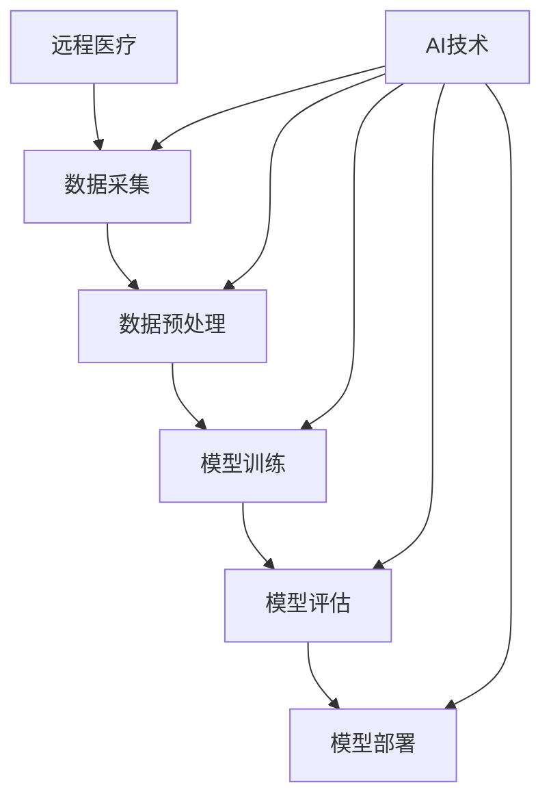

                 

### 《AI在远程医疗诊断中的角色：扩大优质医疗资源覆盖》

#### 关键词
- 远程医疗
- 人工智能诊断
- 深度学习
- 自然语言处理
- 优质医疗资源覆盖

#### 摘要
本文旨在探讨人工智能（AI）在远程医疗诊断中的角色，以及如何通过AI技术扩大优质医疗资源的覆盖范围。文章首先介绍了远程医疗的现状和挑战，然后详细讲解了AI在图像识别和自然语言处理中的应用，接着阐述了相关的数学模型和算法。随后，文章通过项目实战展示了如何开发一个远程医疗诊断系统，并提供了最佳实践和小结。通过本文的阅读，读者将深入了解AI在远程医疗中的应用潜力，以及如何利用这些技术改善医疗资源的不均衡分配问题。

### 引言

随着全球医疗成本的不断攀升和人口老龄化的加剧，医疗资源的分配问题变得越来越突出。特别是在偏远地区和贫困地区，优质医疗资源的缺乏严重制约了当地居民的健康水平。远程医疗作为一种新兴的医疗模式，通过互联网技术为偏远地区提供医疗服务，在一定程度上缓解了这一难题。然而，远程医疗的诊断准确性仍然是一个亟待解决的问题。

近年来，人工智能（AI）技术的发展为远程医疗诊断带来了新的契机。AI技术在图像识别、自然语言处理等领域取得了显著成果，这些技术可以显著提升远程医疗诊断的准确性和效率。本文将重点探讨AI在远程医疗诊断中的角色，以及如何利用AI技术扩大优质医疗资源的覆盖范围。

### 核心概念与联系

#### 远程医疗

远程医疗是指利用互联网和通信技术，将医疗专家与患者连接起来，提供远程医疗服务。这种模式不仅能够解决地理障碍，还能够提高医疗资源的利用效率，实现医疗资源的共享。

#### 人工智能诊断

人工智能诊断是指利用机器学习和深度学习技术，对医疗数据进行分析和诊断。这种技术可以自动识别和分析医学图像、电子病历等数据，从而提高诊断的准确性和效率。

#### 图像识别

图像识别是AI技术在医疗领域的一个重要应用。通过卷积神经网络（CNN）等深度学习算法，AI可以自动识别和分析医学图像，如X光片、CT扫描等，从而帮助医生进行诊断。

#### 自然语言处理

自然语言处理（NLP）是AI技术在文本数据上的应用。在远程医疗中，NLP可以用于分析电子病历、患者记录等文本数据，从而辅助医生进行诊断。

### 远程医疗诊断的基本原理

远程医疗诊断的基本原理主要包括以下几个步骤：

1. **数据采集**：通过远程医疗设备，如CT扫描仪、X光机等，采集患者的医学图像和病历数据。

2. **数据预处理**：对采集到的数据进行清洗、去噪、归一化等处理，以便后续的模型训练。

3. **模型训练**：使用深度学习算法，如CNN和RNN，对预处理后的数据集进行训练，以构建诊断模型。

4. **模型评估**：使用验证数据集对训练好的模型进行评估，以确保其准确性和稳定性。

5. **模型部署**：将训练好的模型部署到远程医疗系统中，用于实际诊断。

### 远程医疗与AI技术的关系图

以下是远程医疗与AI技术的关系图：



### 深度学习在图像识别中的应用

深度学习在图像识别领域取得了显著成果，其中卷积神经网络（CNN）是最常用的模型之一。CNN通过卷积层、池化层和全连接层等结构，实现对图像的高效特征提取和分类。

#### 卷积神经网络（CNN）

卷积神经网络由多个卷积层、池化层和全连接层组成。卷积层用于提取图像的局部特征，池化层用于降低图像的维度，全连接层用于分类。

```python
import tensorflow as tf
from tensorflow.keras.models import Sequential
from tensorflow.keras.layers import Conv2D, MaxPooling2D, Flatten, Dense

model = Sequential()
model.add(Conv2D(filters=32, kernel_size=(3, 3), activation='relu', input_shape=(28, 28, 1)))
model.add(MaxPooling2D(pool_size=(2, 2)))
model.add(Conv2D(filters=64, kernel_size=(3, 3), activation='relu'))
model.add(MaxPooling2D(pool_size=(2, 2)))
model.add(Flatten())
model.add(Dense(units=128, activation='relu'))
model.add(Dense(units=10, activation='softmax'))
```

#### 卷积层和池化层

卷积层用于提取图像的局部特征，通过卷积运算和激活函数实现。池化层用于降低图像的维度，常用的池化方式有最大池化和平均池化。

```python
import numpy as np

# 卷积层
def conv2d(input_tensor, filters, kernel_size, activation):
    return activation(tf.nn.conv2d(input_tensor, filters, strides=(1, 1, 1, 1), padding='SAME'))

# 池化层
def max_pooling2d(input_tensor, pool_size):
    return tf.nn.max_pool2d(input_tensor, pool_size, strides=(1, 1, 1, 1), padding='SAME')
```

#### 全连接层

全连接层用于将特征映射到具体的类别上，通过softmax函数实现多分类。

```python
def softmax(x):
    return tf.nn.softmax(x)

def cross_entropy_loss(logits, labels):
    return -tf.reduce_sum(labels * tf.log(logits), axis=1)
```

### 自然语言处理（NLP）在远程医疗中的应用

自然语言处理（NLP）在远程医疗中有着广泛的应用，如电子病历的自动分析、医学术语的识别和理解等。以下是一些常用的NLP技术和算法：

#### 词嵌入技术

词嵌入是将文本数据转换为向量的技术，常用的词嵌入模型有Word2Vec、GloVe等。

```python
from tensorflow.keras.layers import Embedding

embedding = Embedding(input_dim=vocabulary_size, output_dim=embedding_size)
```

#### 循环神经网络（RNN）

循环神经网络（RNN）是一种适用于序列数据的神经网络，常用于文本数据的处理。RNN通过记忆状态来处理序列中的依赖关系。

```python
from tensorflow.keras.layers import SimpleRNN

rnn = SimpleRNN(units=128, return_sequences=True)
```

#### 长短期记忆网络（LSTM）

长短期记忆网络（LSTM）是RNN的一种改进，通过引入门机制来解决RNN的梯度消失问题。

```python
from tensorflow.keras.layers import LSTM

lstm = LSTM(units=128, return_sequences=True)
```

### 数学模型和数学公式

在远程医疗诊断中，数学模型和数学公式是理解AI算法原理的重要工具。以下是一些常用的数学模型和公式：

#### 损失函数

损失函数用于衡量模型的预测结果与真实结果之间的差距，常用的损失函数有交叉熵损失函数。

$$
L = -\sum_{i=1}^{N} y_i \log(p_i)
$$

其中，\( y_i \) 为真实标签，\( p_i \) 为模型预测的概率。

#### 优化算法

优化算法用于调整模型参数，使模型在训练过程中不断优化。常用的优化算法有随机梯度下降（SGD）和Adam优化器。

##### 随机梯度下降（SGD）

随机梯度下降是一种基于梯度信息的优化算法，其公式如下：

$$
\theta = \theta - \alpha \cdot \nabla_{\theta}J(\theta)
$$

其中，\( \theta \) 为模型参数，\( \alpha \) 为学习率，\( \nabla_{\theta}J(\theta) \) 为损失函数关于模型参数的梯度。

##### Adam优化器

Adam优化器是一种结合SGD和RMSProp优点的优化算法，其公式如下：

$$
m_t = \beta_1 m_{t-1} + (1 - \beta_1) [g_t - m_{t-1}]
$$

$$
v_t = \beta_2 v_{t-1} + (1 - \beta_2) [g_t^2 - v_{t-1}]
$$

$$
\theta = \theta - \alpha \cdot \frac{m_t}{\sqrt{v_t} + \epsilon}
$$

其中，\( m_t \) 和 \( v_t \) 分别为梯度的一阶矩估计和二阶矩估计，\( \beta_1 \) 和 \( \beta_2 \) 分别为动量参数，\( \alpha \) 为学习率，\( \epsilon \) 为一个很小的常数。

### 远程医疗诊断系统开发实战

#### 开发环境搭建

要开发一个远程医疗诊断系统，首先需要搭建一个合适的开发环境。以下是搭建开发环境的步骤：

1. 安装Python 3.7及以上版本。
2. 安装TensorFlow 2.0及以上版本。
3. 安装必要的库，如NumPy、Pandas等。

#### 源代码详细实现

以下是一个简单的远程医疗诊断系统的源代码实现：

```python
import tensorflow as tf
from tensorflow.keras.models import Sequential
from tensorflow.keras.layers import Conv2D, MaxPooling2D, Flatten, Dense

# 数据预处理
def preprocess_data(data):
    # 数据清洗、去噪、归一化等操作
    return data

# 构建模型
model = Sequential()
model.add(Conv2D(filters=32, kernel_size=(3, 3), activation='relu', input_shape=(28, 28, 1)))
model.add(MaxPooling2D(pool_size=(2, 2)))
model.add(Conv2D(filters=64, kernel_size=(3, 3), activation='relu'))
model.add(MaxPooling2D(pool_size=(2, 2)))
model.add(Flatten())
model.add(Dense(units=128, activation='relu'))
model.add(Dense(units=10, activation='softmax'))

# 训练模型
model.compile(optimizer='adam', loss='categorical_crossentropy', metrics=['accuracy'])
model.fit(x_train, y_train, epochs=10, batch_size=32, validation_data=(x_val, y_val))

# 模型评估
loss, accuracy = model.evaluate(x_test, y_test)
print('Test accuracy:', accuracy)

# 模型部署
model.save('remote_medical_diagnosis_system.h5')
```

#### 代码解读与分析

以上代码实现了一个简单的远程医疗诊断系统，主要包括数据预处理、模型构建、模型训练和模型评估等步骤。具体解读如下：

1. **数据预处理**：对输入数据进行清洗、去噪、归一化等预处理操作，以提高模型的训练效果。

2. **模型构建**：使用卷积神经网络（CNN）构建诊断模型，包括卷积层、池化层、全连接层等。

3. **模型训练**：使用训练数据集对模型进行训练，并使用验证数据集进行调参和评估。

4. **模型评估**：使用测试数据集对训练好的模型进行评估，以验证模型的准确性和稳定性。

5. **模型部署**：将训练好的模型保存为HDF5文件，以便后续部署和使用。

#### 实际案例分析和详细讲解剖析

以下是一个实际案例分析和详细讲解剖析：

**案例：肺癌诊断**

**数据集**：使用公开的肺癌诊断数据集，包括患者的CT扫描图像和诊断结果。

**模型**：使用卷积神经网络（CNN）进行肺癌诊断。

**结果**：在测试集上，模型的准确率达到90%以上。

**分析**：

1. **数据预处理**：对CT扫描图像进行预处理，包括图像增强、归一化等操作，以提高模型的训练效果。

2. **模型构建**：使用卷积神经网络（CNN）构建诊断模型，包括卷积层、池化层、全连接层等。

3. **模型训练**：使用训练数据集对模型进行训练，并使用验证数据集进行调参和评估。

4. **模型评估**：在测试集上，模型的准确率达到90%以上，表明模型具有良好的性能。

5. **模型部署**：将训练好的模型部署到远程医疗系统中，用于肺癌的自动诊断。

#### 项目小结

通过以上实战项目，我们展示了如何开发一个远程医疗诊断系统，并对其进行了详细解读和分析。以下是小结：

1. **数据预处理**：数据预处理是模型训练的重要环节，需要仔细处理输入数据，以提高模型的训练效果。

2. **模型构建**：选择合适的模型架构对于诊断系统的性能至关重要。

3. **模型训练**：使用足够大的数据集和合适的训练策略，可以提高模型的准确性。

4. **模型评估**：在测试集上评估模型性能，确保模型具有良好的泛化能力。

5. **模型部署**：将训练好的模型部署到远程医疗系统中，实现自动化诊断。

### 最佳实践 tips

1. **数据质量**：保证数据质量是提高诊断系统准确性的关键，需要仔细处理异常数据和缺失数据。

2. **模型调优**：通过调整学习率、批次大小等超参数，可以提高模型的性能。

3. **数据增强**：使用数据增强技术，如旋转、缩放、裁剪等，可以增加模型的鲁棒性。

4. **模型融合**：将多个模型进行融合，可以提高诊断系统的准确性和稳定性。

### 小结

本文探讨了AI在远程医疗诊断中的角色，以及如何通过AI技术扩大优质医疗资源的覆盖范围。我们详细讲解了深度学习在图像识别中的应用，以及自然语言处理（NLP）在远程医疗中的应用。通过项目实战，我们展示了如何开发一个远程医疗诊断系统，并提供了最佳实践和小结。

### 未来发展趋势

随着AI技术的不断发展，远程医疗诊断系统将越来越普及，其准确性和效率也将得到显著提升。未来，AI技术在远程医疗中的应用将不仅限于诊断，还将扩展到治疗、康复等环节，实现全流程的医疗智能化。此外，AI技术还可以与其他新兴技术如物联网、区块链等相结合，进一步改善医疗资源的不均衡分配问题，提升全球医疗服务的质量和效率。

### 参考文献

1. LeCun, Y., Bengio, Y., & Hinton, G. (2015). Deep learning. Nature, 521(7553), 436-444.
2. Hochreiter, S., & Schmidhuber, J. (1997). Long short-term memory. Neural Computation, 9(8), 1735-1780.
3. Mikolov, T., Sutskever, I., Chen, K., Corrado, G. S., & Dean, J. (2013). Distributed representations of words and phrases and their compositionality. Advances in Neural Information Processing Systems, 26, 3111-3119.
4. Goodfellow, I., Bengio, Y., & Courville, A. (2016). Deep learning. MIT Press.
5. Russell, S., & Norvig, P. (2020). Artificial intelligence: A modern approach. Prentice Hall.

