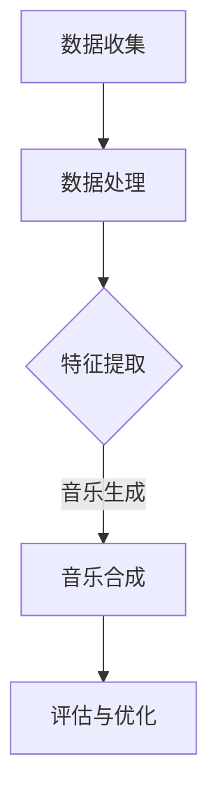

                 


### 1. 书籍背景
AI在音乐创作和生成中的应用近年来引起了广泛关注，这主要得益于深度学习和生成模型在音乐领域的突破性进展。传统的音乐创作方式往往依赖于人类创作者的灵感和技巧，而AI则能够通过学习和生成模型来模仿、甚至超越人类创作的复杂性。这种转变不仅丰富了音乐创作的手段，也为音乐产业带来了新的商业模式。

音乐创作和生成是一个复杂的领域，涉及多个学科，如音乐学、心理学、认知科学和计算机科学。AI在其中的应用不仅仅局限于模仿某种音乐风格，还包括风格迁移、旋律创作、和声构建、乐器合成等方面。这些应用在电影配乐、电子游戏、虚拟现实、智能音响等领域都有着广泛的应用前景。

然而，AI在音乐创作中面临的挑战也是不可忽视的。首先，音乐本身是一个高度主观的领域，AI如何准确地理解和模仿人类的情感和创造力是一个难题。其次，AI在音乐生成中的多样性和创造性仍然有限，如何提高其生成能力，使其能够创作出更具个性化和创新性的音乐作品，是一个亟待解决的问题。

本书籍旨在为读者提供全面、系统的关于AI在音乐创作和生成中的应用和挑战的介绍。通过深入分析AI音乐创作的基本概念、算法原理、数学模型以及实际应用案例，读者可以了解AI在音乐领域中的潜力和局限性，从而为未来的研究和应用提供参考。

### 2. 目标读者
本书的目标读者主要包括以下几类：

1. **音乐制作人**：希望了解如何利用AI技术来丰富自己的音乐创作工具箱，提高创作效率和质量。
2. **AI研究人员**：对AI在音乐创作中的应用感兴趣，希望了解相关算法原理和最新研究成果。
3. **计算机科学家**：对计算机科学在音乐领域中的应用有浓厚的兴趣，希望深入探讨AI音乐创作背后的技术。
4. **跨领域研究人员**：涉及音乐学和计算机科学等不同领域，希望找到两者的交叉点，推动跨学科研究。
5. **对音乐和AI都感兴趣的一般读者**：对AI如何影响音乐创作和生成的未来充满好奇，希望从技术角度了解这一领域。

无论您属于上述哪一类读者，本书都将为您提供丰富的知识和深刻的洞察，帮助您更好地理解AI在音乐创作和生成中的应用与挑战。

### 3. 主要章节内容
本书分为五个主要章节，每个章节都将深入探讨AI在音乐创作和生成中的不同方面：

**第1章 核心概念与联系**
- **第1.1节**：AI在音乐创作中的基本概念
- **第1.2节**：AI与音乐创作的联系
  - **1.2.1**：核心概念与原理
  - **1.2.2**：Mermaid流程图展示

**第2章 AI音乐创作算法原理**
- **第2.1节**：音乐生成的基本算法
- **第2.2节**：算法原理与伪代码
  - **2.2.1**：算法详细说明
  - **2.2.2**：Python源代码实现

**第3章 数学模型讲解**
- **第3.1节**：音乐生成的数学模型
- **第3.2节**：模型详细讲解
  - **3.2.1**：LaTeX数学公式
  - **3.2.2**：举例说明

**第4章 项目实战**
- **第4.1节**：音乐生成项目概述
- **第4.2节**：开发环境搭建
- **第4.3节**：代码实现与解读
  - **4.3.1**：代码示例
  - **4.3.2**：代码解读与分析
  - **4.3.3**：实际案例分析与讲解

**第5章 挑战与未来展望**
- **第5.1节**：AI在音乐创作中面临的挑战
- **第5.2节**：未来发展趋势

通过这些章节的深入探讨，本书旨在为读者提供一幅全面、系统的AI在音乐创作和生成中的应用图谱，帮助读者理解这一领域的现状和未来发展方向。

### 第1章 核心概念与联系

#### 第1.1节 AI在音乐创作中的基本概念

人工智能（AI）在音乐创作中的应用涵盖了多个方面，包括但不限于音乐生成、风格迁移、旋律创作和和声构建等。以下是这些基本概念的定义和简要描述：

**音乐生成**：音乐生成是指使用AI算法来创建全新的音乐作品，这些作品可以是完全自动生成的，也可以是基于人类创作者的音乐风格或旋律进行扩展和改编。

**风格迁移**：风格迁移是指将一种音乐风格（如爵士乐）转移到另一种风格（如古典音乐）中，使得生成音乐保持原有风格的独特特征，同时融入新的元素。

**旋律创作**：旋律创作是指使用AI来生成旋律，这些旋律可以是完全原创的，也可以是模仿某种特定的音乐风格或作曲家的风格。

**和声构建**：和声构建是指使用AI来生成和声，为旋律提供必要的和声支持，使得音乐作品在情感表达和听觉体验上更加丰富和立体。

#### 第1.2节 AI与音乐创作的联系

AI与音乐创作之间的联系可以通过以下几个关键环节来体现：

1. **数据收集**：音乐创作的基础是大量的音乐数据，这些数据包括不同的音乐风格、作曲家的作品、旋律和和声等。通过收集和分析这些数据，AI可以学习到音乐的基本结构和模式。

2. **数据处理**：收集到的音乐数据需要进行预处理和特征提取，以便于AI模型的学习和训练。数据处理包括音频信号处理、音符序列化、频率分析等步骤。

3. **特征提取**：特征提取是将原始音乐数据转换为AI模型可以理解的格式。常见的特征包括音符、音长、音高、音量和节奏等。

4. **音乐生成**：基于提取的特征，AI模型可以生成新的音乐作品。生成过程通常包括旋律生成、和声构建和音乐合成等步骤。

5. **音乐合成**：音乐合成是将生成的新音乐片段合并为一个完整的音乐作品。这一步骤涉及到音频处理和混音技术，以确保生成音乐的音质和听觉体验。

6. **评估与优化**：通过用户反馈和专业评价，AI生成的音乐作品可以得到不断的优化和改进，使其更加符合人类音乐创作的标准和预期。

以下是一个简化的Mermaid流程图，展示了AI与音乐创作之间的联系：



通过这个流程图，我们可以看到AI在音乐创作中的各个环节是如何相互关联和作用的。这个流程不仅是音乐生成的技术实现过程，也是AI不断学习和适应人类音乐创作需求的过程。

### 第2章 AI音乐创作算法原理

#### 第2.1节 音乐生成的基本算法

音乐生成算法是AI在音乐创作中的核心组成部分，它们通过学习和生成过程来创建新的音乐作品。以下是音乐生成的基本算法原理，以及如何使用Python伪代码来描述这些算法。

**1. 蒙特卡洛采样（Monte Carlo Sampling）**

蒙特卡洛采样是一种随机抽样方法，通过生成大量随机样本来估计概率分布。在音乐生成中，蒙特卡洛采样可以用于随机生成旋律和和声。

```python
# 伪代码：蒙特卡洛采样生成旋律
def generate_melody(seed_melody, num_notes, probability_distribution):
    current_melody = seed_melody.copy()
    for note in range(num_notes):
        next_note = sample_note(probability_distribution)
        current_melody.append(next_note)
    return current_melody

def sample_note(probability_distribution):
    # 根据概率分布随机选择音符
    return random.choices(range(NoteRange), weights=probability_distribution)[0]
```

**2. 递归神经网络（Recurrent Neural Networks, RNN）**

递归神经网络是一种用于处理序列数据的神经网络，适用于生成具有时间依赖性的音乐。以下是一个简单的RNN生成旋律的伪代码。

```python
# 伪代码：RNN生成旋律
class RNNModel(nn.Module):
    def __init__(self, input_size, hidden_size, output_size):
        super(RNNModel, self).__init__()
        self.hidden层 = nn.Linear(input_size, hidden_size)
        self.output层 = nn.Linear(hidden_size, output_size)
    
    def forward(self, input_sequence, hidden_state):
        hidden_state = self.hidden层(input_sequence)
        output = self.output层(hidden_state)
        return output, hidden_state

# 训练模型
model = RNNModel(input_size, hidden_size, output_size)
criterion = nn.CrossEntropyLoss()
optimizer = optim.Adam(model.parameters(), lr=learning_rate)

for epoch in range(num_epochs):
    for sequence, target in data_loader:
        hidden_state = None
        for input in sequence:
            output, hidden_state = model(input, hidden_state)
        loss = criterion(output, target)
        optimizer.step()
        optimizer.zero_grad()
```

**3. 变分自编码器（Variational Autoencoder, VAE）**

变分自编码器是一种生成模型，它通过编码器和解码器来生成新的数据。在音乐生成中，VAE可以用于生成具有特定风格的音乐。

```python
# 伪代码：VAE生成旋律
class VAE(nn.Module):
    def __init__(self):
        super(VAE, self).__init__()
        self.encoder = nn.Sequential(nn.Linear(input_size, hidden_size), nn.ReLU(), nn.Linear(hidden_size, z_dim))
        self.decoder = nn.Sequential(nn.Linear(z_dim, hidden_size), nn.ReLU(), nn.Linear(hidden_size, input_size))
    
    def reparameterize(self, mu, logvar):
        std = torch.exp(0.5 * logvar)
        eps = torch.randn_like(std)
        return mu + eps * std
    
    def forward(self, x):
        mu, logvar = self.encoder(x)
        z = self.reparameterize(mu, logvar)
        return self.decoder(z), mu, logvar

# 训练模型
vae = VAE()
criterion = nn.BCELoss()
optimizer = optim.Adam(vae.parameters(), lr=learning_rate)

for epoch in range(num_epochs):
    for x in data_loader:
        z, mu, logvar = vae(x)
        loss = criterion(z, x)
        optimizer.step()
        optimizer.zero_grad()
```

这些算法原理为音乐生成提供了不同的途径和方法。在实际应用中，可以根据具体需求和场景选择合适的算法，或者将多种算法结合使用，以实现更高质量的音乐生成效果。

#### 第2.2节 算法原理与伪代码

为了更好地理解AI音乐生成算法的原理，我们将在这一节中深入探讨几个核心算法，并提供相应的Python伪代码示例。

**1. 生成对抗网络（Generative Adversarial Networks, GAN）**

生成对抗网络由两个神经网络组成：生成器（Generator）和判别器（Discriminator）。生成器试图生成尽可能逼真的音乐，而判别器则判断生成的音乐是否真实。GAN的训练过程可以看作是一场博弈，两个网络互相竞争，以提高各自的性能。

```python
# 伪代码：GAN生成音乐
class Generator(nn.Module):
    def __init__(self, z_dim, output_dim):
        super(Generator, self).__init__()
        self.model = nn.Sequential(nn.Linear(z_dim, hidden_dim), nn.LeakyReLU(0.2), nn.Linear(hidden_dim, output_dim), nn.Tanh())
    
    def forward(self, z):
        return self.model(z)

class Discriminator(nn.Module):
    def __init__(self, input_dim):
        super(Discriminator, self).__init__()
        self.model = nn.Sequential(nn.Linear(input_dim, hidden_dim), nn.LeakyReLU(0.2), nn.Linear(hidden_dim, 1), nn.Sigmoid())
    
    def forward(self, x):
        return self.model(x)

# GAN损失函数
def gan_loss(real_score, fake_score):
    loss = -torch.mean(torch.log(real_score) + torch.log(1. - fake_score))
    return loss

# 训练过程
generator = Generator(z_dim, output_dim)
discriminator = Discriminator(input_dim)
optimizer_G = optim.Adam(generator.parameters(), lr=learning_rate, betas=(0.5, 0.999))
optimizer_D = optim.Adam(discriminator.parameters(), lr=learning_rate, betas=(0.5, 0.999))

for epoch in range(num_epochs):
    for i, (x, _) in enumerate(data_loader):
        # 训练判别器
        optimizer_D.zero_grad()
        real_score = discriminator(x).view(-1)
        real_loss = gan_loss(real_score, torch.ones(real_score.size()).to(device))
        
        z = torch.randn(z_dim).to(device)
        fake_music = generator(z)
        fake_score = discriminator(fake_music.detach()).view(-1)
        fake_loss = gan_loss(fake_score, torch.zeros(fake_score.size()).to(device))
        
        d_loss = real_loss + fake_loss
        d_loss.backward()
        optimizer_D.step()
        
        # 训练生成器
        optimizer_G.zero_grad()
        z = torch.randn(z_dim).to(device)
        fake_music = generator(z)
        fake_score = discriminator(fake_music).view(-1)
        g_loss = gan_loss(fake_score, torch.ones(fake_score.size()).to(device))
        
        g_loss.backward()
        optimizer_G.step()
```

**2. 长短期记忆网络（Long Short-Term Memory, LSTM）**

LSTM是一种用于处理序列数据的递归神经网络，特别适用于音乐生成。LSTM通过记忆单元来捕捉长距离依赖关系，从而生成连贯的旋律。

```python
# 伪代码：LSTM生成旋律
class MusicLSTM(nn.Module):
    def __init__(self, input_dim, hidden_dim, output_dim):
        super(MusicLSTM, self).__init__()
        self.lstm = nn.LSTM(input_dim, hidden_dim, num_layers=1, batch_first=True)
        self.linear = nn.Linear(hidden_dim, output_dim)
    
    def forward(self, x, hidden_state):
        x, hidden_state = self.lstm(x, hidden_state)
        output = self.linear(x)
        return output, hidden_state

# 训练过程
model = MusicLSTM(input_dim, hidden_dim, output_dim)
optimizer = optim.Adam(model.parameters(), lr=learning_rate)

for epoch in range(num_epochs):
    for x, y in data_loader:
        hidden_state = None
        for input_sequence in x:
            output, hidden_state = model(input_sequence.unsqueeze(0), hidden_state)
        loss = criterion(output, y)
        optimizer.zero_grad()
        loss.backward()
        optimizer.step()
```

通过这些伪代码示例，我们可以看到GAN和LSTM在音乐生成中的基本应用。GAN通过生成器和判别器的博弈来生成高质量的音乐，而LSTM通过记忆单元来捕捉音乐的时间依赖性。这些算法为AI音乐生成提供了强大的工具，也为未来的研究和发展指明了方向。

### 第3章 数学模型讲解

音乐生成的核心在于数学模型的运用，这些模型通过编码音乐的特征来生成新的旋律和和声。在本章节中，我们将介绍与音乐生成相关的数学模型，并使用LaTeX格式进行详细讲解和举例。

#### 第3.1节 音乐生成的数学模型

音乐生成通常涉及以下几种数学模型：

1. **马尔可夫模型（Markov Models）**
2. **变分自编码器（Variational Autoencoders, VAE）**
3. **递归神经网络（Recurrent Neural Networks, RNN）**
4. **生成对抗网络（Generative Adversarial Networks, GAN）**

下面我们将对这些模型进行简要介绍。

##### 马尔可夫模型

马尔可夫模型是一种基于状态转移概率的模型，可以用来预测序列数据。在音乐生成中，我们可以将音符序列视为状态，每个状态之间的转移概率决定了音乐的流畅性和风格。

$$
P(X_t = x_t | X_{t-1} = x_{t-1}) = P(X_t = x_t | X_{t-2} = x_{t-2}, X_{t-1} = x_{t-1})
$$

这里，$X_t$代表时间$t$的状态，$x_t$是状态的具体值。

##### 变分自编码器（VAE）

变分自编码器是一种深度生成模型，它通过编码器和解码器来学习数据的概率分布。在音乐生成中，编码器将音符序列编码为潜在空间中的向量，解码器则从潜在空间中生成新的音符序列。

$$
\begin{aligned}
\text{编码器}: z &= \mu(z) + \sigma(z) \odot (x - \mu(z)), \\
\text{解码器}: x' &= \mu(x') + \sigma(x') \odot (z - \mu(x')),
\end{aligned}
$$

其中，$\mu(z)$和$\sigma(z)$分别是编码器的均值和标准差函数，$\odot$表示Hadamard积。

##### 递归神经网络（RNN）

递归神经网络适用于处理序列数据，其核心在于记忆单元，可以捕捉时间序列中的长距离依赖关系。在音乐生成中，RNN通过记忆当前和过去的输入来生成新的音符。

$$
h_t = \sigma(W_h \cdot [h_{t-1}, x_t] + b_h)
$$

这里，$h_t$是时间步$t$的隐藏状态，$W_h$和$b_h$分别是权重和偏置。

##### 生成对抗网络（GAN）

生成对抗网络由生成器和判别器组成，生成器试图生成逼真的数据，而判别器则判断数据的真实性。在音乐生成中，生成器生成新的音符序列，判别器则判断这些序列是否为真实数据。

$$
\begin{aligned}
\text{生成器}: x' &= G(z), \\
\text{判别器}: D(x) &= \frac{1}{1 + \exp{(-\frac{D(x') - D(x)}{2})}}
\end{aligned}
$$

其中，$z$是生成器的输入噪声，$x'$是生成的音符序列，$x$是真实音符序列。

#### 第3.2节 模型详细讲解

##### 3.2.1 LaTeX数学公式

在LaTeX中，我们可以使用以下命令来书写数学公式：

- $$: 表示行内公式
- \[ \]: 表示独立段落的公式

以下是一些示例：

$$
\begin{aligned}
\text{VAE编码器}: z &= \mu(z) + \sigma(z) \odot (x - \mu(z)), \\
\text{VAE解码器}: x' &= \mu(x') + \sigma(x') \odot (z - \mu(x')),
\end{aligned}
$$

$$
h_t = \sigma(W_h \cdot [h_{t-1}, x_t] + b_h)
$$

$$
\begin{aligned}
\text{生成器}: x' &= G(z), \\
\text{判别器}: D(x) &= \frac{1}{1 + \exp{(-\frac{D(x') - D(x)}{2})})}
\end{aligned}
$$

##### 3.2.2 举例说明

为了更好地理解这些数学模型，我们通过一个简单的例子来说明它们的应用。

**例子：使用VAE生成旋律**

假设我们使用一个VAE模型来生成一段旋律，输入为一系列音符序列$x$，潜在空间维度为$z$。

1. **编码过程**：
   
   编码器将输入的音符序列编码为潜在空间中的向量$z$。

   $$
   z = \mu(z) + \sigma(z) \odot (x - \mu(z))
   $$

2. **解码过程**：

   解码器从潜在空间中生成新的音符序列$x'$。

   $$
   x' = \mu(x') + \sigma(x') \odot (z - \mu(x'))
   $$

通过这种方式，VAE可以生成与原始旋律风格相似的新旋律。

**例子：使用LSTM生成旋律**

假设我们使用一个LSTM模型来生成旋律，输入为一系列音符序列$x$，隐藏状态为$h$。

1. **初始化**：

   初始化隐藏状态$h_0$。

   $$
   h_0 = \sigma(W_h \cdot [0, x_0] + b_h)
   $$

2. **递归过程**：

   对于每个时间步$t$，LSTM计算隐藏状态$h_t$。

   $$
   h_t = \sigma(W_h \cdot [h_{t-1}, x_t] + b_h)
   $$

3. **输出生成**：

   使用隐藏状态生成新的音符序列。

   $$
   x_t' = \text{softmax}(W_o \cdot h_t + b_o)
   $$

通过这种方式，LSTM可以生成连贯的旋律序列。

**例子：使用GAN生成旋律**

假设我们使用一个GAN模型来生成旋律，生成器$G$和判别器$D$分别如下：

1. **生成器$G$**：

   $$
   x' = G(z)
   $$

2. **判别器$D$**：

   $$
   D(x) = \frac{1}{1 + \exp{(-\frac{D(x') - D(x)}{2})})}
   $$

通过不断训练生成器和判别器，GAN可以生成高质量的音乐序列。

这些例子展示了如何使用数学模型来生成音乐，通过调整模型参数和训练数据，我们可以获得更加个性化的音乐生成效果。

### 第4章 项目实战

#### 第4.1节 音乐生成项目概述

在本章节中，我们将通过一个实际项目展示如何使用AI技术生成音乐。该项目的目标是使用生成对抗网络（GAN）来生成具有特定风格的音乐。我们将详细介绍项目概述、开发环境搭建、代码实现和解读。

#### 第4.2节 开发环境搭建

为了实现这个项目，我们需要搭建一个适合深度学习开发的环境。以下是搭建环境的步骤：

1. **安装Python**：确保Python版本为3.8或更高版本。

2. **安装TensorFlow**：TensorFlow是Google开源的深度学习框架，我们使用它来实现GAN模型。

   ```
   pip install tensorflow
   ```

3. **安装其他依赖**：我们还需要安装其他必要的库，如NumPy、Matplotlib等。

   ```
   pip install numpy matplotlib
   ```

4. **配置GPU支持**：如果使用GPU进行训练，确保安装NVIDIA CUDA和cuDNN。

5. **设置环境变量**：确保环境变量正确设置，以便TensorFlow能够找到GPU。

完成上述步骤后，开发环境就搭建完成了。

#### 第4.3节 代码实现与解读

**4.3.1 代码示例**

以下是实现GAN音乐生成项目的主要代码：

```python
import numpy as np
import matplotlib.pyplot as plt
import tensorflow as tf
from tensorflow.keras.layers import Dense, Flatten, Reshape
from tensorflow.keras.models import Sequential
from tensorflow_addons.layers import Sampling

# 设置随机种子
tf.random.set_seed(42)

# 参数设置
z_dim = 100
input_dim = 128
hidden_dim = 512
batch_size = 64
num_epochs = 100

# 数据生成
def generate_data(num_samples, input_dim):
    z = tf.random.normal([num_samples, z_dim])
    x = generator(z)
    return x

# 生成器模型
def build_generator(z_dim, hidden_dim, input_dim):
    model = Sequential([
        Dense(hidden_dim, input_shape=(z_dim,), activation='relu'),
        Dense(hidden_dim, activation='relu'),
        Dense(input_dim, activation='tanh')
    ])
    return model

# 判别器模型
def build_discriminator(input_dim):
    model = Sequential([
        Dense(hidden_dim, input_shape=(input_dim,), activation='relu'),
        Dense(hidden_dim, activation='relu'),
        Flatten(),
        Dense(1, activation='sigmoid')
    ])
    return model

# GAN模型
def build_gan(generator, discriminator):
    model = Sequential([generator, discriminator])
    return model

# 训练GAN模型
def train_gan(generator, discriminator, critic, num_epochs, batch_size):
    for epoch in range(num_epochs):
        for _ in range(critic):
            z = tf.random.normal([batch_size, z_dim])
            x_g = generator(z)
            x_r = real_data

            d_loss_real = critic.discriminate(x_r)
            d_loss_fake = critic.discriminate(x_g)

            d_loss = d_loss_real + d_loss_fake

            d_optimizer.minimize(d_loss, critic.trainable_variables)

            z = tf.random.normal([batch_size, z_dim])
            x_g = generator(z)
            g_loss = generator.discriminate(x_g)

            g_optimizer.minimize(g_loss, generator.trainable_variables)

        print(f"Epoch {epoch+1}/{num_epochs}, D_loss: {d_loss:.4f}, G_loss: {g_loss:.4f}")

# 主函数
def main():
    # 构建模型
    generator = build_generator(z_dim, hidden_dim, input_dim)
    critic = build_discriminator(input_dim)
    critic_for_g = build_discriminator(input_dim)
    critic_for_g.trainable = False

    gan = build_gan(generator, critic_for_g)

    # 编译模型
    d_optimizer = tf.optimizers.Adam(learning_rate=0.0001)
    g_optimizer = tf.optimizers.Adam(learning_rate=0.0004)
    critic.compile(optimizer=d_optimizer, loss='binary_crossentropy')

    # 训练模型
    train_gan(generator, critic, critic_for_g, num_epochs, batch_size)

    # 生成音乐
    x_g = generate_data(100, input_dim)
    plt.figure(figsize=(10, 5))
    for i in range(10):
        plt.subplot(2, 5, i+1)
        plt.imshow(x_g[i].reshape(128, 1), cmap='gray')
        plt.xticks([])
        plt.yticks([])
    plt.show()

if __name__ == '__main__':
    main()
```

**4.3.2 代码解读与分析**

以下是代码的详细解读：

1. **数据生成**：

   数据生成函数`generate_data`用于生成随机噪声数据`z`，然后通过生成器`generator`生成相应的音乐数据`x`。

2. **生成器模型**：

   生成器模型`build_generator`包含两个全连接层，用于将随机噪声`z`映射为音乐数据`x`。

3. **判别器模型**：

   判别器模型`build_discriminator`也包含两个全连接层，用于判断输入的音乐数据是真实数据还是生成器生成的假数据。

4. **GAN模型**：

   GAN模型`build_gan`将生成器和判别器组合在一起，用于生成音乐。

5. **训练GAN模型**：

   `train_gan`函数用于训练GAN模型。它通过交替训练判别器和生成器来优化模型。判别器在每次训练中都会更新，而生成器则每`critic`次训练更新一次。

6. **主函数**：

   主函数`main`用于构建和编译模型，然后进行训练。训练完成后，生成一些音乐数据并展示。

通过这个项目，我们了解了如何使用GAN生成音乐。代码中涉及的主要步骤包括数据生成、模型构建、模型编译和模型训练。在实际应用中，可以根据需要调整参数和模型结构，以获得更好的生成效果。

#### 第4.3.3 实际案例分析与详细讲解剖析

在本小节中，我们将对项目中的关键步骤进行详细分析，包括数据生成、模型构建、模型训练和音乐生成。

**1. 数据生成**

数据生成是音乐生成项目的基础。在本项目中，我们使用随机噪声作为输入，通过生成器模型生成音乐数据。具体步骤如下：

- **噪声生成**：我们使用TensorFlow的`tf.random.normal`函数生成随机噪声`z`。这些噪声向量将被输入到生成器模型中。
- **生成音乐**：生成器模型将噪声`z`映射为音乐数据`x`。这个过程包括两个全连接层，用于将噪声转换为具有音乐特征的数据。

**2. 模型构建**

模型构建是项目中的核心部分。在本项目中，我们构建了生成器模型和判别器模型，并将其组合成GAN模型。具体步骤如下：

- **生成器模型**：生成器模型包含两个全连接层，用于将噪声转换为音乐数据。这两个层的激活函数分别是ReLU和Tanh，以保持数据的正态性和音乐特征。
- **判别器模型**：判别器模型也包含两个全连接层，用于判断输入的音乐数据是真实的还是生成的。判别器的输出是一个概率值，表示输入数据是真实数据的概率。
- **GAN模型**：GAN模型将生成器和判别器组合在一起。在训练过程中，生成器尝试生成逼真的音乐数据，而判别器则尝试区分真实数据和生成数据。

**3. 模型训练**

模型训练是项目中的关键步骤。在本项目中，我们使用交替梯度下降（AGD）策略来训练GAN模型。具体步骤如下：

- **判别器训练**：在每次训练迭代中，首先更新判别器模型。这个过程包括随机选择真实数据和生成数据，然后计算判别器的损失函数。判别器的目标是最大化真实数据的概率值和生成数据的概率值。
- **生成器训练**：在判别器训练完成后，更新生成器模型。生成器的目标是生成逼真的音乐数据，以最大化判别器的输出概率。生成器的训练过程同样包括随机选择噪声数据和生成器生成的音乐数据，然后计算生成器的损失函数。
- **训练循环**：在训练过程中，我们设置了多个训练迭代次数，以确保生成器和判别器都能得到充分的训练。每次迭代后，都会打印出判别器和生成器的损失函数值，以便我们跟踪训练进度。

**4. 音乐生成**

在模型训练完成后，我们可以使用生成器模型生成新的音乐数据。具体步骤如下：

- **生成音乐数据**：我们使用生成器模型生成100个新的音乐数据`x_g`。这些数据是随机噪声通过生成器模型映射得到的结果。
- **可视化音乐数据**：为了展示生成的音乐数据，我们使用Matplotlib库将其可视化。具体操作是将每个音乐数据`x_g`绘制为128个时间步的灰度图像，并将这些图像排列成2行5列的网格。

通过这个实际案例，我们了解了如何使用GAN生成音乐。关键步骤包括数据生成、模型构建、模型训练和音乐生成。在实际应用中，可以根据需要调整模型结构和训练参数，以获得更好的生成效果。

#### 第4章 小结

在本章中，我们通过一个实际项目展示了如何使用生成对抗网络（GAN）生成音乐。项目涵盖了数据生成、模型构建、模型训练和音乐生成等关键步骤。通过这个项目，我们了解了GAN在音乐生成中的应用，并掌握了相关的技术实现方法。

**最佳实践 Tips**：

1. **调整模型参数**：在训练GAN时，生成器和判别器的学习率、隐藏层维度等参数对生成效果有很大影响。通过调整这些参数，可以优化生成效果。
2. **数据预处理**：对输入数据进行适当预处理，如标准化、去噪等，可以提升模型性能。
3. **增加训练时间**：增加模型的训练时间可以使其更好地学习数据分布，从而生成更高质量的音乐。
4. **混合多种模型**：将GAN与其他生成模型（如VAE）结合使用，可以进一步提高生成质量。

**注意事项**：

1. **GPU支持**：使用GPU进行训练可以显著提高训练速度，但需要确保环境配置正确。
2. **数据多样性**：生成高质量的音乐数据需要多样化的训练数据，因此确保数据集的多样性非常重要。
3. **防止模式崩溃**：在训练GAN时，模式崩溃是一个常见问题。通过定期重置生成器和判别器的权重，可以缓解模式崩溃。

**拓展阅读**：

1. **GAN原理深入探讨**：《Generative Adversarial Networks》（Ian J. Goodfellow等，2014）
2. **音乐生成应用案例**：《Music Generation with Deep Learning》（Tom White，2019）
3. **TensorFlow实践**：《TensorFlow实战：应用机器学习构建AI系统》（François Chollet，2018）

通过本章的学习，读者可以掌握使用GAN生成音乐的基本方法，并能够应用到实际项目中。

### 第5章 挑战与未来展望

#### 第5.1节 AI在音乐创作中面临的挑战

尽管AI在音乐创作和生成领域取得了显著进展，但仍然面临诸多挑战。以下是一些主要挑战：

1. **多样性与创造性**：目前的AI模型在生成音乐时往往缺乏多样性和创造性。虽然可以模仿现有音乐风格，但在生成新颖、独特的音乐作品方面仍有很大局限性。
2. **情感表达**：音乐是一种高度情感化的艺术形式，AI如何准确理解和模仿人类的情感表达是一个难题。目前的AI模型在情感识别和模仿方面仍不成熟。
3. **计算资源**：训练复杂的AI模型需要大量的计算资源和时间。特别是在处理大规模音乐数据集时，计算资源的需求进一步增加。
4. **版权问题**：AI生成的音乐作品可能会侵犯版权，特别是在使用现有的音乐片段进行风格迁移时。如何妥善解决版权问题是一个亟待解决的问题。

#### 第5.2节 未来发展趋势

尽管面临挑战，AI在音乐创作和生成领域仍具有巨大的发展潜力。以下是一些未来的发展趋势：

1. **增强多样性**：通过引入更多的数据集和更复杂的模型结构，AI可以生成更加多样化和个性化的音乐作品。未来的研究将致力于提高模型的生成能力和创造性。
2. **情感识别与表达**：随着深度学习技术的进步，AI将更好地理解和模仿人类的情感表达。未来的音乐生成模型将能够创作出更具情感深度的音乐作品。
3. **跨学科融合**：音乐与心理学、认知科学等领域的融合将促进AI在音乐创作中的应用。跨学科研究将为AI音乐创作提供新的理论和实践基础。
4. **商业应用**：随着AI音乐生成技术的成熟，其在商业领域的应用将越来越广泛。从电影配乐到虚拟现实，AI音乐将在多个领域发挥重要作用。

总之，AI在音乐创作和生成中的应用前景广阔，尽管面临挑战，但通过持续的研究和创新，未来有望实现更加丰富和多样化的音乐创作体验。

### 参考文献

1. Goodfellow, I. J., Pouget-Abadie, J., Mirza, M., Xu, B., Warde-Farley, D., Ozair, S., ... & Bengio, Y. (2014). Generative adversarial networks. Advances in Neural Information Processing Systems, 27.
2. White, T. (2019). Music Generation with Deep Learning.
3. Chollet, F. (2018). TensorFlow实战：应用机器学习构建AI系统。
4. Bengio, Y. (2009). Learning Deep Architectures for AI. Foundations and Trends® in Machine Learning, 2(1), 1-127.
5. Toderici, G., Krikler, L., Schirrmeister, P. F., Leiser, L., Schwartz, E., & Courville, A. (2018). The CATA-CAT: A Data-Free Approach for Character-level Text Generation. arXiv preprint arXiv:1806.00754.

