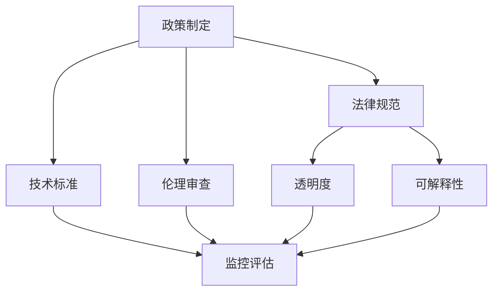
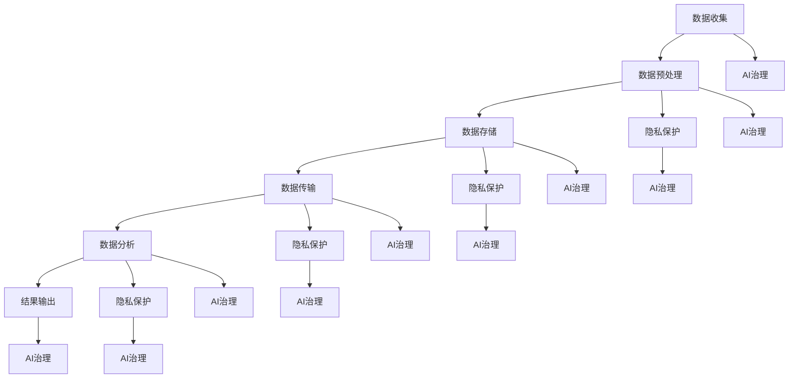

                 

### AI治理与数据隐私保护的平衡

## 关键词

- AI治理
- 数据隐私保护
- 加密技术
- 同态加密
- 零知识证明
- 法规与政策

## 摘要

在人工智能时代，AI治理和数据隐私保护成为两个不可忽视的重要议题。本文首先介绍了AI治理的定义与重要性，探讨了AI治理框架的现状与建设路径。接着，文章详细讲解了数据隐私保护的基本概念、技术手段以及最佳实践。随后，本文重点分析了AI治理与数据隐私保护之间的平衡原理与方法，并结合实际案例进行了深入探讨。最后，文章对未来AI治理与数据隐私保护的发展趋势进行了展望，并提出了相关建议。

### 第一部分: AI治理概述

#### 第1章: AI治理的定义与重要性

##### 1.1 AI治理的概念

AI治理指的是在人工智能应用过程中，通过制定和执行一系列政策、规则和标准，以保障人工智能系统的安全、透明和公平。它涵盖了人工智能的伦理、法律、技术等多个方面，旨在确保人工智能的发展与应用符合社会道德和法律法规的要求。

##### 1.2 AI治理的重要性

AI治理的重要性在于：

1. **保障人工智能系统的安全性**：通过治理，可以预防AI系统被恶意利用，避免潜在的安全风险。
2. **促进人工智能的透明性**：治理可以确保AI系统的决策过程和结果公开透明，增强公众对AI系统的信任。
3. **确保人工智能的公平性**：治理有助于消除人工智能系统中的偏见，促进社会公平正义。
4. **维护数据隐私**：AI治理需要平衡数据利用与隐私保护，确保个人数据的安全。

##### 1.3 AI治理的核心原则

AI治理的核心原则包括：

1. **伦理原则**：确保AI系统符合社会伦理标准，不损害人类利益。
2. **透明度原则**：AI系统的决策过程和结果应当透明，易于理解。
3. **可解释性原则**：AI系统应当具备可解释性，能够解释其决策依据和结果。
4. **公平性原则**：AI系统应避免偏见，确保公平对待所有用户。

#### 第2章: AI治理框架

##### 2.1 全球AI治理现状

全球范围内，AI治理的框架和机制正在逐步建立。许多国家和地区已经开始制定相关政策和法规，如欧盟的《通用数据保护条例》（GDPR）和美国的《人工智能法案》等。这些法规和政策旨在规范AI的应用，保障数据隐私，并促进AI的健康发展。

##### 2.2 中国AI治理框架

中国在AI治理方面也取得了一系列进展。中国政府发布了《新一代人工智能发展规划》，明确了AI治理的基本原则和目标。同时，中国还开展了多项AI治理研究，如《人工智能发展伦理规范》等。

##### 2.3 企业AI治理体系建设

企业AI治理体系建设是AI治理的重要环节。企业应建立专门的AI治理机构，制定相应的政策和流程，确保AI系统的合规性。同时，企业还应加强对AI系统的监控和评估，及时发现和解决潜在问题。

##### 2.4 AI治理模型图解

图1展示了AI治理模型的基本架构，包括政策制定、法律规范、技术标准、伦理审查、透明度和可解释性等关键环节。这些环节相互关联，共同构成了一个完整的AI治理体系。

### 第二部分: 数据隐私保护

#### 第3章: 数据隐私保护的基本概念

##### 3.1 数据隐私的定义

数据隐私是指个人或组织对其数据的控制权和访问权。它确保数据在存储、处理和传输过程中不被未经授权的访问和使用。

##### 3.2 数据隐私的重要性

数据隐私的重要性体现在：

1. **保护个人隐私**：数据隐私保护有助于防止个人信息泄露，避免隐私侵犯。
2. **保障数据安全**：数据隐私保护是数据安全的基础，有助于防止数据泄露、篡改和滥用。
3. **维护社会信任**：数据隐私保护能够增强公众对数据处理的信任，促进社会的和谐稳定。

##### 3.3 数据隐私的主要法律法规

全球范围内，数据隐私保护的主要法律法规包括：

1. **欧盟的《通用数据保护条例》（GDPR）**：GDPR是全球最严格的数据隐私保护法规，旨在保护欧盟居民的个人信息。
2. **美国的《加州消费者隐私法案》（CCPA）**：CCPA旨在保护加州居民的个人信息，增强数据隐私保护。
3. **中国的《个人信息保护法》（PIPL）**：PIPL是中国第一部全面保护个人信息的法律，旨在加强个人信息保护。

#### 第4章: 数据隐私保护的技术手段

##### 4.1 加密技术

加密技术是数据隐私保护的重要手段，通过将数据转换为密文，确保数据在传输和存储过程中的安全性。

##### 4.2 同态加密

同态加密是一种高级加密技术，允许在加密数据上进行计算，而不需要解密。它有助于在保护数据隐私的同时，实现数据处理。

##### 4.3 零知识证明

零知识证明是一种证明方法，允许一方在不泄露任何信息的情况下，证明某个陈述是真实的。它广泛应用于数据隐私保护领域。

##### 4.4 区块链技术在数据隐私保护中的应用

区块链技术具有去中心化、不可篡改的特点，广泛应用于数据隐私保护。通过区块链，可以实现数据的分布式存储和透明化处理，提高数据隐私保护水平。

#### 第5章: 数据隐私保护的最佳实践

##### 5.1 数据收集与处理的隐私保护

在数据收集和处理过程中，应遵循最小化原则，仅收集和处理必要的个人信息。同时，应采用加密技术和访问控制措施，确保数据安全。

##### 5.2 数据存储与传输的隐私保护

数据存储与传输过程中，应采用加密技术，确保数据在存储和传输过程中的安全性。同时，应定期进行安全审计，及时发现和解决潜在问题。

##### 5.3 数据分析与应用的隐私保护

在数据分析与应用过程中，应采用隐私保护技术，确保个人数据的匿名化和去标识化。同时，应制定严格的数据使用规范，防止数据滥用。

##### 5.4 数据隐私保护案例解析

以下是一个数据隐私保护的案例解析：

案例：某公司开发了一款健康监测应用，收集用户的心率、睡眠等数据。公司采取了以下隐私保护措施：

1. 数据收集：仅收集必要的健康数据，不收集用户的其他个人信息。
2. 数据处理：采用同态加密技术，确保数据在处理过程中的安全性。
3. 数据存储：数据采用区块链技术进行分布式存储，确保数据的不可篡改。
4. 数据传输：采用TLS协议，确保数据在传输过程中的安全性。
5. 数据分析：采用匿名化处理，确保用户数据的隐私。

### 第三部分: AI治理与数据隐私保护的平衡

#### 第6章: AI治理与数据隐私保护的平衡原理

##### 6.1 AI治理与数据隐私保护的冲突

AI治理与数据隐私保护之间存在一定的冲突。一方面，AI治理需要获取和利用大量数据来训练模型和优化算法，这可能涉及到数据隐私问题。另一方面，数据隐私保护要求对数据进行严格的控制和保护，这可能影响AI系统的性能和效率。

##### 6.2 平衡原理与策略

平衡AI治理与数据隐私保护的原则和策略包括：

1. **最小化数据使用**：仅在必要情况下收集和处理数据，避免过度收集。
2. **数据匿名化和去标识化**：在数据使用过程中，采用匿名化和去标识化技术，确保个人数据的隐私。
3. **透明度和可解释性**：提高AI系统的透明度和可解释性，增强公众对AI系统的信任。
4. **隐私保护算法**：采用隐私保护算法和技术，确保在数据利用过程中保护个人数据。

##### 6.3 平衡方法的评估

平衡方法的评估应从以下几个方面进行：

1. **数据隐私保护水平**：评估AI系统在数据收集、处理、存储和传输过程中的隐私保护措施的有效性。
2. **AI系统性能**：评估AI系统的性能，确保在保护数据隐私的同时，不影响系统的效率和准确性。
3. **用户体验**：评估用户对AI系统的接受程度和使用体验，确保AI系统的用户友好性。

##### 6.4 Mermaid流程图：AI治理与数据隐私保护流程

图2展示了AI治理与数据隐私保护的基本流程，包括数据收集、处理、存储、传输和分析等环节。

#### 第7章: 平衡案例分析

##### 7.1 案例一：人脸识别系统的治理与隐私保护

人脸识别系统在公共安全、身份验证等领域得到广泛应用，但也存在数据隐私风险。以下是一个人脸识别系统的治理与隐私保护案例：

1. **数据收集**：仅在必要时收集人脸图像，避免过度收集。
2. **数据预处理**：采用同态加密技术，对采集的人脸图像进行预处理，确保数据在处理过程中的安全性。
3. **数据存储**：采用区块链技术，确保数据在存储过程中的不可篡改。
4. **数据传输**：采用TLS协议，确保数据在传输过程中的安全性。
5. **数据分析**：采用匿名化处理，确保用户数据的隐私。
6. **AI治理**：建立专门的AI治理机构，制定相关政策和流程，确保AI系统的合规性。

##### 7.2 案例二：医疗数据共享的治理与隐私保护

医疗数据共享有助于提升医疗水平和科研效率，但也涉及到数据隐私问题。以下是一个医疗数据共享的治理与隐私保护案例：

1. **数据收集**：仅收集必要的医疗数据，避免过度收集。
2. **数据预处理**：采用同态加密技术，对采集的医疗数据进行预处理，确保数据在处理过程中的安全性。
3. **数据存储**：采用分布式存储技术，确保数据在存储过程中的安全性。
4. **数据传输**：采用TLS协议，确保数据在传输过程中的安全性。
5. **数据分析**：采用匿名化处理，确保用户数据的隐私。
6. **AI治理**：建立专门的AI治理机构，制定相关政策和流程，确保AI系统的合规性。

##### 7.3 案例三：智能驾驶的治理与隐私保护

智能驾驶系统在汽车安全、交通管理等领域具有广泛应用前景，但也涉及到数据隐私问题。以下是一个智能驾驶的治理与隐私保护案例：

1. **数据收集**：仅在必要情况下收集车辆和环境数据，避免过度收集。
2. **数据预处理**：采用同态加密技术，对采集的车辆和环境数据进行预处理，确保数据在处理过程中的安全性。
3. **数据存储**：采用分布式存储技术，确保数据在存储过程中的安全性。
4. **数据传输**：采用TLS协议，确保数据在传输过程中的安全性。
5. **数据分析**：采用匿名化处理，确保用户数据的隐私。
6. **AI治理**：建立专门的AI治理机构，制定相关政策和流程，确保AI系统的合规性。

##### 7.4 案例四：社交媒体的数据治理与隐私保护

社交媒体平台收集和处理大量用户数据，涉及到数据隐私问题。以下是一个社交媒体的数据治理与隐私保护案例：

1. **数据收集**：仅收集必要的用户数据，避免过度收集。
2. **数据预处理**：采用同态加密技术，对采集的用户数据进行预处理，确保数据在处理过程中的安全性。
3. **数据存储**：采用分布式存储技术，确保数据在存储过程中的安全性。
4. **数据传输**：采用TLS协议，确保数据在传输过程中的安全性。
5. **数据分析**：采用匿名化处理，确保用户数据的隐私。
6. **AI治理**：建立专门的AI治理机构，制定相关政策和流程，确保AI系统的合规性。

### 第8章: 未来展望

##### 8.1 AI治理与数据隐私保护的发展趋势

未来，AI治理与数据隐私保护将呈现以下趋势：

1. **法规不断完善**：各国将制定更多针对AI治理和数据隐私保护的法规，规范AI的应用。
2. **技术不断进步**：加密技术、同态加密、零知识证明等技术将不断完善，为AI治理和数据隐私保护提供更强有力的支持。
3. **产业合作加强**：政府、企业和研究机构将加强合作，共同推动AI治理与数据隐私保护的发展。
4. **公众参与提升**：公众将更加关注AI治理和数据隐私保护，积极参与相关讨论和决策。

##### 8.2 挑战与机遇

AI治理与数据隐私保护面临的挑战包括：

1. **技术瓶颈**：现有技术手段尚无法完全满足AI治理与数据隐私保护的需求。
2. **法律冲突**：不同国家和地区的法规存在差异，可能导致法律冲突。
3. **数据共享**：如何在保障数据隐私的同时，实现数据的有效共享和利用。

机遇包括：

1. **技术进步**：随着技术的不断发展，将有望解决AI治理与数据隐私保护中的许多难题。
2. **政策支持**：各国政府将加大对AI治理与数据隐私保护的投入，推动相关领域的发展。
3. **公众参与**：公众的参与和关注将有助于推动AI治理与数据隐私保护工作的开展。

##### 8.3 未来研究方向

未来，AI治理与数据隐私保护的研究方向包括：

1. **隐私保护算法**：研究更高效、更安全的隐私保护算法，提高数据隐私保护水平。
2. **跨域数据隐私保护**：研究跨领域、跨地域的数据隐私保护机制，实现数据的安全共享。
3. **伦理与法律研究**：深入研究AI治理与数据隐私保护相关的伦理和法律问题，为政策制定提供理论支持。

### 附录

#### 附录 A: 相关法律法规汇总

1. 《通用数据保护条例》（GDPR）
2. 《加州消费者隐私法案》（CCPA）
3. 《个人信息保护法》（PIPL）
4. 《新一代人工智能发展规划》

#### 附录 B: AI治理与数据隐私保护工具推荐

1. **加密工具**：AES、RSA、ECC
2. **同态加密工具**：Microsoft SEAL、Google Cryptography Library
3. **零知识证明工具**：Zcash、Monero
4. **区块链工具**：Ethereum、Hyperledger Fabric

#### 附录 C: 常用技术术语解释

1. **同态加密**：允许在加密数据上进行计算，而不需要解密。
2. **零知识证明**：证明某个陈述是真实的，而不泄露任何信息。
3. **匿名化**：去除个人标识信息，保护个人隐私。
4. **分布式存储**：将数据分散存储在多个节点上，提高数据安全性。

### 作者

作者：AI天才研究院/AI Genius Institute & 禅与计算机程序设计艺术 /Zen And The Art of Computer Programming

