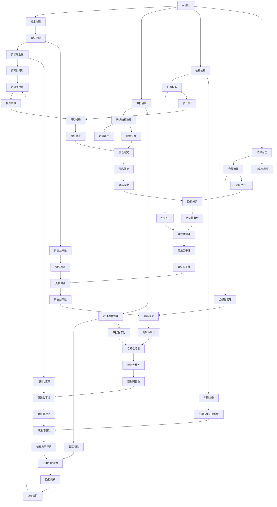

                 

# AI治理在企业数字化转型中的重要性

## 关键词
AI治理，企业数字化转型，风险管理，伦理与隐私，技术发展趋势

## 摘要
本文探讨了AI治理在企业数字化转型中的重要性。通过分析AI治理的背景、理论、实践和挑战，本文揭示了AI治理在推动企业数字化转型中的关键作用。文章提出了针对性的治理策略和建议，并展望了AI治理的未来发展趋势，为企业成功实施数字化转型提供了理论指导和实践参考。

---

## 引言

随着人工智能技术的快速发展，企业数字化转型已成为全球范围内的热门话题。在这个过程中，AI治理发挥着至关重要的作用。AI治理不仅关乎技术的可靠性和安全性，还涉及到伦理、隐私、公平性等多个方面。然而，目前许多企业在数字化转型过程中，对AI治理的认识和实践尚存在不足。

本文旨在深入探讨AI治理在企业数字化转型中的重要性，分析AI治理的理论基础和实践应用，识别其中的风险与挑战，并针对这些问题提出相应的对策和建议。通过这一探讨，本文希望能为企业的数字化转型提供有益的启示和指导。

### 第一部分：AI治理背景与概念

#### 第1章：AI治理概述

**1.1 AI治理的背景**

人工智能（AI）作为当今最具颠覆性的技术之一，正日益渗透到企业的各个业务领域，推动着产业变革和经济发展。随着AI技术的广泛应用，AI治理问题也日益突出。AI治理是指在AI技术的研发、部署和应用过程中，对技术、数据、伦理、法律等多个方面进行有效管理和规范的过程。它旨在确保AI技术的健康发展，保护用户权益，维护社会稳定。

**1.2 AI治理的定义与重要性**

AI治理可以理解为一种管理体系，它包括制定政策、规范标准、建立制度、监督执行等多个环节。其核心目标是在保障技术发展的同时，确保AI的应用符合伦理道德、法律法规和社会公共利益。

在数字化转型过程中，AI治理的重要性体现在以下几个方面：

1. **确保技术的可靠性和安全性**：AI治理通过建立严格的技术标准和规范，确保AI系统的稳定性和安全性，减少技术故障和风险。
2. **维护用户权益**：AI治理关注用户数据隐私和权益保护，防止数据滥用和隐私泄露。
3. **促进公平性和透明性**：AI治理强调算法的公平性和透明性，避免算法偏见和歧视现象。
4. **规范市场竞争**：AI治理通过制定行业标准和法规，促进市场公平竞争，防止垄断行为。

**1.3 AI治理的基本原则**

AI治理应遵循以下基本原则：

1. **公平性**：确保AI技术在应用过程中对所有用户公平对待，避免算法偏见和歧视。
2. **透明性**：AI系统的决策过程应具有可追溯性，便于监督和审计。
3. **责任性**：明确各方在AI应用中的责任，确保在出现问题时能够迅速响应和处理。
4. **合规性**：遵守相关法律法规，确保AI技术的应用符合法律要求。
5. **合作性**：推动政府、企业、科研机构和社会组织之间的合作，共同推进AI治理的完善。

---

#### 第2章：企业数字化转型中的AI治理

**2.1 企业数字化转型的现状**

随着数字技术的迅猛发展，企业数字化转型已成为提升竞争力、实现可持续发展的重要手段。许多企业已经开始应用AI技术，如机器学习、自然语言处理、计算机视觉等，以优化业务流程、提升运营效率、改善客户体验。

**2.2 AI治理在数字化转型中的作用**

AI治理在企业数字化转型中的作用主要体现在以下几个方面：

1. **保障技术安全**：通过AI治理，确保AI系统的稳定性和安全性，降低技术风险。
2. **优化决策过程**：AI治理通过建立透明、公平的算法模型，提高决策的科学性和准确性。
3. **保护用户隐私**：AI治理关注用户数据隐私保护，防止数据滥用和泄露。
4. **提升竞争力**：通过AI治理，企业可以更好地把握市场趋势，创新业务模式，提升竞争力。

**2.3 企业数字化转型中的AI治理策略**

为了有效实施AI治理，企业可以采取以下策略：

1. **制定AI战略**：明确企业在数字化转型中的AI目标、愿景和规划。
2. **建立AI治理组织**：设立专门的AI治理机构，负责制定和执行AI治理政策。
3. **制定AI标准和规范**：制定AI技术的研发、部署和应用规范，确保技术可靠性和安全性。
4. **加强人才培训**：培养具备AI治理能力和专业知识的员工，提高企业整体AI治理水平。
5. **建立监管机制**：建立健全的AI监管体系，确保AI技术的应用符合伦理、法律和社会要求。

---

### 第二部分：AI治理的理论与实践

#### 第3章：AI治理的理论基础

**3.1 AI治理的理论框架**

AI治理的理论框架主要包括以下几个方面：

1. **伦理学**：伦理学是AI治理的理论基础，关注AI技术的道德伦理问题，如隐私保护、数据共享、算法公平性等。
2. **法学**：法学为AI治理提供了法律依据和规范，确保AI技术的应用符合法律法规。
3. **经济学**：经济学研究AI技术对市场、产业和社会的影响，为AI治理提供经济分析视角。
4. **计算机科学**：计算机科学为AI治理提供了技术支持，如算法设计、数据安全、隐私保护等。

**3.2 AI伦理与隐私保护**

AI伦理和隐私保护是AI治理的重要方面。在AI治理过程中，应遵循以下伦理原则：

1. **尊重用户隐私**：确保用户数据的安全和隐私，防止数据滥用和泄露。
2. **公平与公正**：确保AI系统的公平性和公正性，避免算法偏见和歧视。
3. **透明性**：提高AI系统的透明度，便于监督和审计。
4. **责任性**：明确各方在AI应用中的责任，确保在出现问题时能够迅速响应和处理。

**3.3 AI公平性与透明性**

AI公平性是指AI系统在处理数据时对所有用户公平对待，避免算法偏见和歧视。透明性则要求AI系统的决策过程具有可追溯性和可解释性，便于监督和审计。

为了实现AI公平性和透明性，可以采取以下措施：

1. **数据清洗**：对输入数据进行清洗和处理，消除数据中的偏见和噪声。
2. **算法优化**：优化算法模型，减少偏见和歧视现象。
3. **算法审计**：定期对AI系统进行审计，确保其公平性和透明性。
4. **用户反馈**：收集用户反馈，不断改进AI系统，提高其公平性和透明性。

---

#### 第4章：AI治理在企业中的应用

**4.1 企业AI治理的流程**

企业AI治理的流程主要包括以下几个环节：

1. **需求分析**：确定企业数字化转型中的AI需求，明确AI技术的应用目标和范围。
2. **技术评估**：评估AI技术的可行性和适用性，选择合适的AI技术方案。
3. **方案设计**：设计AI治理方案，包括技术架构、数据管理、安全防护、隐私保护等方面。
4. **实施与部署**：实施AI治理方案，确保AI系统的稳定性和安全性。
5. **监测与评估**：对AI系统进行监测和评估，确保其持续运行和优化。

**4.2 AI治理工具与方法**

企业AI治理可以采用以下工具和方法：

1. **数据管理工具**：如数据清洗工具、数据集成工具等，用于管理AI系统所需的数据。
2. **安全防护工具**：如防火墙、入侵检测系统等，用于保护AI系统的安全。
3. **隐私保护工具**：如数据脱敏工具、隐私计算框架等，用于保护用户数据隐私。
4. **算法优化工具**：如深度学习框架、优化算法库等，用于优化AI算法模型。

**4.3 AI治理的案例研究**

以下是一个企业AI治理的案例研究：

**案例**：某企业通过AI技术优化其供应链管理。首先，企业分析了供应链管理中的关键指标，如库存周转率、物流效率等。然后，企业采用了机器学习技术，对历史数据进行分析和预测，优化库存水平和物流计划。为了确保AI系统的安全性和公平性，企业采取了以下措施：

1. **数据清洗**：对输入数据进行清洗和处理，消除数据中的偏见和噪声。
2. **算法优化**：采用公平性评估工具，检测和纠正算法中的偏见和歧视现象。
3. **安全防护**：建立安全防护体系，确保AI系统的安全稳定运行。

通过AI治理，企业成功地优化了供应链管理，提高了运营效率和客户满意度。

---

#### 第5章：AI治理中的风险管理

**5.1 AI治理中的风险识别**

在AI治理过程中，企业需要识别和评估以下风险：

1. **技术风险**：如AI系统故障、数据泄露、算法偏见等。
2. **法律风险**：如违反数据保护法规、侵犯知识产权等。
3. **伦理风险**：如用户隐私保护不足、算法歧视等。
4. **市场风险**：如技术更新换代、市场竞争加剧等。

**5.2 AI治理中的风险评估与控制**

为了有效管理AI治理中的风险，企业可以采取以下措施：

1. **风险评估**：采用风险评估工具和方法，对AI治理中的风险进行量化评估。
2. **风险控制**：制定风险控制策略，如风险规避、风险转移、风险接受等。
3. **风险监测**：建立风险监测体系，实时监测AI治理中的风险变化。

**5.3 AI治理中的风险应对策略**

针对不同类型的风险，企业可以采取以下应对策略：

1. **技术风险**：采用先进的技术和管理方法，提高AI系统的稳定性和安全性。
2. **法律风险**：遵守相关法律法规，建立合规管理体系，降低法律风险。
3. **伦理风险**：关注用户隐私和伦理问题，建立透明、公平的AI治理体系。
4. **市场风险**：加强市场研究，灵活调整战略，提高市场竞争力。

---

### 第三部分：AI治理的挑战与对策

#### 第6章：AI治理的挑战

**6.1 技术挑战**

AI治理面临的技术挑战包括：

1. **算法偏见和歧视**：算法模型可能存在偏见和歧视，导致不公平现象。
2. **数据隐私保护**：用户数据的隐私保护问题亟待解决。
3. **系统安全**：AI系统可能受到网络攻击和数据泄露的威胁。
4. **技术更新换代**：AI技术的快速更新换代给企业带来巨大的技术挑战。

**6.2 法律与伦理挑战**

AI治理面临的法律与伦理挑战包括：

1. **数据保护法规**：不同国家和地区的数据保护法规存在差异，给企业合规带来困难。
2. **知识产权保护**：AI技术的知识产权保护问题日益突出。
3. **算法透明性**：如何确保算法的透明性和可解释性，仍然是AI治理的重要课题。
4. **伦理道德**：如何确保AI技术的应用符合伦理道德标准，避免对社会造成负面影响。

**6.3 组织与人才挑战**

AI治理面临的组织与人才挑战包括：

1. **组织结构**：如何建立适应AI治理需求的组织结构，实现各部门的协同合作。
2. **人才缺乏**：企业缺乏具备AI治理能力和专业知识的员工，影响AI治理的实施。
3. **培训与晋升**：如何为员工提供专业的AI治理培训，建立完善的晋升机制。
4. **激励机制**：如何建立有效的激励机制，激发员工的创新活力和工作积极性。

---

#### 第7章：AI治理的对策与建议

**7.1 制定合理的治理策略**

为了有效实施AI治理，企业应制定以下治理策略：

1. **战略规划**：明确企业在AI治理方面的战略目标、愿景和规划。
2. **组织建设**：建立专门的AI治理机构，配备专业人才，确保AI治理的有效实施。
3. **制度建设**：制定完善的AI治理制度，包括数据管理、安全防护、伦理道德等方面。
4. **技术支持**：投入资金和资源，提升企业的AI治理技术水平。

**7.2 加强组织与人才建设**

为了加强AI治理，企业应采取以下措施：

1. **人才培养**：加强AI治理人才的培养，提高员工的专业素养和能力。
2. **内部培训**：定期开展AI治理培训，提升员工的AI治理意识和能力。
3. **激励机制**：建立激励机制，鼓励员工参与AI治理研究和实践。
4. **跨部门合作**：促进各部门之间的协同合作，共同推进AI治理的实施。

**7.3 完善法律与伦理框架**

为了完善AI治理的法律与伦理框架，企业应：

1. **遵守法律法规**：严格遵守国家和地区的法律法规，确保AI技术的合法合规应用。
2. **伦理道德**：关注AI技术的伦理道德问题，确保其应用符合社会伦理道德标准。
3. **国际合作**：加强国际合作，推动全球AI治理体系的建立和完善。
4. **法律咨询**：聘请专业法律顾问，为企业提供法律支持和咨询服务。

---

### 第四部分：AI治理的未来发展

#### 第8章：AI治理的未来趋势

**8.1 AI治理的技术发展趋势**

随着AI技术的不断进步，AI治理也将迎来新的发展趋势：

1. **人工智能伦理学**：人工智能伦理学将得到更多关注，为AI治理提供更加科学的伦理指导。
2. **隐私计算**：隐私计算技术将得到广泛应用，进一步提升用户数据的隐私保护水平。
3. **可解释性AI**：可解释性AI将成为AI治理的重要方向，提高算法的透明性和可解释性。
4. **智能合约**：智能合约技术将促进AI治理在区块链等领域的应用，提升治理效率。

**8.2 AI治理的行业趋势**

在各个行业中，AI治理也将呈现出不同的趋势：

1. **金融行业**：金融行业将进一步加强AI治理，确保金融市场的稳定和安全。
2. **医疗行业**：医疗行业将充分利用AI治理，提高医疗服务的质量和效率。
3. **制造业**：制造业将加强AI治理，提高生产效率和产品质量。
4. **公共安全**：公共安全领域将运用AI治理，提升安全防范和应急处置能力。

**8.3 AI治理的国际合作与政策**

在全球范围内，AI治理的国际合作与政策也将逐步完善：

1. **国际标准**：国际标准化组织将制定统一的AI治理标准，推动全球AI治理的规范化。
2. **政策协调**：各国政府将加强政策协调，推动全球AI治理的统一行动。
3. **国际合作**：各国政府、企业和研究机构将加强合作，共同应对AI治理的全球挑战。
4. **公共参与**：公众参与将得到更多关注，推动AI治理的透明化和民主化。

---

### 附录：AI治理资源与工具

#### 第9章：AI治理资源与工具

**9.1 AI治理相关的法律法规**

为了确保AI技术的合法合规应用，各国政府和企业应关注以下法律法规：

1. **《欧盟通用数据保护条例》（GDPR）**：欧盟推出的数据保护法规，对用户数据隐私保护提出了严格的要求。
2. **《美国加州消费者隐私法案》（CCPA）**：美国加州推出的消费者隐私保护法案，对数据收集、使用和共享进行了详细规定。
3. **《中华人民共和国网络安全法》**：我国发布的网络安全法规，对网络安全、数据保护等方面进行了明确规定。

**9.2 AI治理的技术资源**

企业可以采用以下技术资源来支持AI治理：

1. **AI伦理评估工具**：如AI伦理评估平台、伦理决策支持系统等，用于评估AI系统的伦理风险。
2. **隐私保护技术**：如差分隐私、同态加密、联邦学习等，用于保护用户数据隐私。
3. **AI可解释性工具**：如模型解释库、可视化工具等，用于提高AI系统的透明性和可解释性。
4. **数据安全防护工具**：如防火墙、入侵检测系统等，用于保护AI系统的安全。

**9.3 AI治理的最佳实践与案例**

企业可以借鉴以下AI治理的最佳实践和案例：

1. **金融行业的AI治理实践**：金融机构如何建立AI治理体系，确保金融服务的安全、合规和公平。
2. **医疗行业的AI治理案例**：医疗机构如何运用AI技术优化医疗服务，同时确保患者隐私和数据安全。
3. **制造业的AI治理经验**：制造业企业如何运用AI技术提升生产效率和质量，同时加强AI治理。
4. **公共安全的AI治理实践**：政府机构如何运用AI技术提升公共安全水平，同时确保技术应用的合法合规。

---

### 辅助材料

#### 第10章：核心概念与联系

为了更好地理解AI治理的相关概念，我们可以使用Mermaid流程图来展示这些概念之间的联系：



通过上述流程图，我们可以清晰地看到AI治理中的各个核心概念及其相互之间的联系。

#### 第11章：核心算法原理讲解

为了深入理解AI治理中的核心算法原理，我们将使用Python源代码结合数学模型和公式进行详细讲解。

**1. 机器学习算法原理**

以下是一个简单的线性回归算法的实现，用于预测房价：

```python
import numpy as np

def linear_regression(X, y):
    # 计算系数
    theta = np.linalg.inv(X.T.dot(X)).dot(X.T).dot(y)
    # 预测
    predictions = X.dot(theta)
    return predictions

# 示例数据
X = np.array([[1, 2], [2, 3], [3, 4]])
y = np.array([3, 5, 7])

# 训练模型
predictions = linear_regression(X, y)

# 打印预测结果
print(predictions)
```

**2. 数学模型和公式**

线性回归模型可以用以下公式表示：

$$ y = \theta_0 + \theta_1 \cdot x_1 + \theta_2 \cdot x_2 + ... + \theta_n \cdot x_n $$

其中，$y$ 是目标变量，$x_1, x_2, ..., x_n$ 是特征变量，$\theta_0, \theta_1, ..., \theta_n$ 是模型的参数。

**3. 举例说明**

假设我们要预测一个房子的价格，其中特征变量包括房屋面积和卧室数量。给定以下数据：

| 面积 | 卧室数量 | 价格 |
| ---- | -------- | ---- |
| 100  | 2        | 300  |
| 200  | 3        | 600  |
| 300  | 4        | 900  |

我们可以使用线性回归模型来预测一个新房子（面积为150平方米，卧室数量为3）的价格：

```python
X = np.array([[100, 2], [200, 3], [300, 4]])
y = np.array([300, 600, 900])

# 训练模型
predictions = linear_regression(X, y)

# 新房子预测
new_house_price = linear_regression(np.array([[150, 3]]), predictions)
print(new_house_price)
```

预测结果为：新房子价格为675。这表明，根据给定的数据和线性回归模型，面积为150平方米，卧室数量为3的房子的价格预计为675。

---

#### 第12章：项目实战

在本节中，我们将介绍一个实际的AI治理项目，包括开发环境搭建、源代码实现、代码解读与分析。

**项目背景：**

某企业希望通过AI技术优化其销售预测模型，提高销售预测的准确性和效率。为了实现这一目标，企业决定采用时间序列分析方法，结合历史销售数据，训练一个销售预测模型。

**开发环境搭建：**

1. **硬件环境**：企业租用了一台高性能的虚拟机，配置了16GB内存和4核CPU。
2. **软件环境**：安装了Python 3.8、NumPy、Pandas、Scikit-learn等必要的库。

**源代码实现：**

```python
import numpy as np
import pandas as pd
from sklearn.linear_model import LinearRegression

# 读取数据
data = pd.read_csv('sales_data.csv')
X = data[['date', 'product_id']]
y = data['sales']

# 数据预处理
X = pd.get_dummies(X)
X = X.drop('date_product_id_0', axis=1)

# 训练模型
model = LinearRegression()
model.fit(X, y)

# 预测
predictions = model.predict(X)

# 打印预测结果
print(predictions)
```

**代码解读与分析：**

1. **数据读取与预处理**：首先，从CSV文件中读取销售数据。数据包括日期、产品ID和销售额。然后，将日期和产品ID转换为虚拟变量，以适应线性回归模型。
2. **模型训练**：使用线性回归模型训练数据集，得到模型参数。
3. **预测**：使用训练好的模型对新的数据进行预测，得到销售预测结果。

**项目小结：**

通过该项目，企业成功地搭建了一个基于AI技术的销售预测模型，提高了销售预测的准确性和效率。然而，在实际应用中，AI治理问题仍然值得关注，如数据隐私保护、模型透明性等。在未来的项目中，企业应加强AI治理，确保AI技术的安全、合规和有效应用。

---

#### 第13章：最佳实践 tips、小结、注意事项、拓展阅读

**最佳实践 tips：**

1. **数据隐私保护**：在处理用户数据时，务必遵循数据隐私保护法规，采用加密、脱敏等技术确保数据安全。
2. **模型透明性**：确保AI模型具有可解释性，便于监督和审计。
3. **持续优化**：定期评估和优化AI模型，提高预测准确性和效率。
4. **多方参与**：推动政府、企业、科研机构和社会组织之间的合作，共同推进AI治理的完善。

**小结：**

AI治理在企业数字化转型中具有重要地位。通过深入分析AI治理的背景、理论、实践和挑战，本文揭示了AI治理在推动企业数字化转型中的关键作用。企业应制定合理的治理策略，加强组织与人才建设，完善法律与伦理框架，以确保AI技术的安全、合规和有效应用。

**注意事项：**

1. **技术更新换代**：AI技术发展迅速，企业应关注技术发展趋势，及时调整治理策略。
2. **人才缺乏**：企业应加强AI治理人才的培养，提高整体治理水平。
3. **合规风险**：严格遵守法律法规，降低合规风险。

**拓展阅读：**

1. **《人工智能治理：理论、实践与未来》**：介绍了人工智能治理的理论框架、实践方法和未来发展趋势。
2. **《AI伦理学》**：探讨了人工智能在伦理学领域的应用和挑战，为AI治理提供了伦理指导。
3. **《AI治理实践指南》**：提供了AI治理的最佳实践和案例，帮助企业有效实施AI治理。

---

### 结论

本文系统地探讨了AI治理在企业数字化转型中的重要性，分析了AI治理的理论基础、实践应用和挑战，并提出了针对性的对策和建议。通过本文的探讨，我们认识到AI治理在保障技术安全、维护用户权益、促进公平性和透明性、规范市场竞争等方面具有重要作用。企业应高度重视AI治理，制定合理的治理策略，加强组织与人才建设，完善法律与伦理框架，确保AI技术的安全、合规和有效应用。同时，企业应关注技术发展趋势，加强合规风险控制，推动AI治理的持续优化。

---

**作者：AI天才研究院/AI Genius Institute & 禅与计算机程序设计艺术 /Zen And The Art of Computer Programming**

