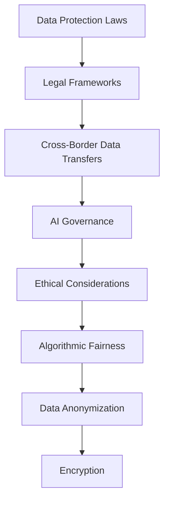

                 

# AI Governance in the Challenges of Cross-Border Data Flow

## Keywords:
- AI Governance
- Cross-Border Data Flow
- Data Protection Laws
- Ethical AI
- Anonymization Techniques
- Cryptographic Algorithms

## Summary:
This article delves into the challenges posed by cross-border data flow in the realm of AI governance. It explores the legal and ethical frameworks that govern AI, the algorithms used to address data flow challenges, and the implementation of AI technologies for effective governance. By breaking down the core concepts and providing practical examples, this article aims to offer a comprehensive understanding of the issues at hand and potential solutions.

## Introduction

The proliferation of artificial intelligence (AI) has revolutionized industries, transforming the way we live and work. However, this technological advancements come with their own set of challenges, especially when it comes to cross-border data flow. AI systems rely heavily on data to learn, make decisions, and improve their performance. This data often needs to be shared across international borders to harness the full potential of AI technologies. However, the movement of data across countries introduces several legal, ethical, and technical challenges that need to be addressed.

### The Importance of AI Governance

AI governance refers to the processes, rules, and systems that ensure the responsible and ethical use of AI technologies. It encompasses a range of issues, including data privacy, algorithmic fairness, transparency, and accountability. As AI becomes more prevalent, it is crucial to establish effective governance mechanisms to address the potential risks and challenges associated with its deployment. Cross-border data flow is one such challenge that requires careful consideration and regulation.

### Cross-Border Data Flow Challenges

Cross-border data flow involves the transmission of data across international borders, often between different countries with varying legal and regulatory frameworks. Some of the key challenges in this area include:

1. **Data Protection Laws**: Different countries have different data protection laws and regulations, which can create conflicts and challenges when transferring data across borders. Ensuring compliance with these regulations is essential to avoid legal penalties and maintain data privacy.

2. **Ethical Considerations**: AI systems trained on data from different regions may exhibit biases and unfairness, leading to unintended consequences. It is important to develop ethical guidelines and frameworks to address these issues and promote fairness and inclusivity.

3. **Technical Challenges**: Transferring large volumes of data across borders can be challenging due to issues such as data anonymization, encryption, and network latency. Developing efficient and secure algorithms to address these technical challenges is crucial.

4. **Regulatory Compliance**: Companies operating in multiple countries need to navigate complex regulatory landscapes to ensure compliance with local laws and regulations. This can be a significant challenge, especially when dealing with conflicting regulations.

### Purpose of the Article

The purpose of this article is to provide a comprehensive overview of the challenges posed by cross-border data flow in the context of AI governance. We will explore the legal and ethical frameworks that govern AI, the algorithms used to address data flow challenges, and the implementation of AI technologies for effective governance. By breaking down the core concepts and providing practical examples, this article aims to offer a comprehensive understanding of the issues at hand and potential solutions.

## Legal and Ethical Frameworks for AI Governance

### Data Protection Laws

Data protection laws play a crucial role in governing AI and ensuring the privacy and security of personal data. These laws vary significantly across countries, creating challenges for cross-border data flow. One of the most prominent data protection laws is the General Data Protection Regulation (GDPR) enacted by the European Union in 2018. GDPR imposes strict requirements on organizations handling personal data of EU residents, including the requirement to obtain explicit consent for data processing and the right to access and erase personal data.

In the United States, the California Consumer Privacy Act (CCPA) offers similar protections for California residents. While the CCPA has a more limited scope compared to GDPR, it still imposes significant requirements on businesses that collect and process personal information.

### Cross-Border Data Transfer Regulations

Cross-border data transfers present additional challenges due to varying legal requirements across countries. The Schrems II decision by the Court of Justice of the European Union (CJEU) in 2020 highlighted the complexity of transferring personal data from the EU to the US. The court struck down the EU-US Privacy Shield framework, which had previously facilitated data transfers between the two regions.

To address these challenges, organizations can rely on other legal mechanisms such as Standard Contractual Clauses (SCCs) and Binding Corporate Rules (BCRs). SCCs are pre-approved contract terms that ensure adequate data protection safeguards are in place when transferring data to non-EU countries. BCRs, on the other hand, are internal policies adopted by multinational companies to facilitate cross-border data transfers within their corporate groups.

### Ethical Considerations

Ethical considerations are equally important in AI governance, particularly when it comes to cross-border data flow. AI systems trained on data from different regions may exhibit biases and unfairness, leading to unintended consequences. For example, a facial recognition system trained on predominantly white datasets may perform poorly on individuals with darker skin tones.

To address these issues, several ethical guidelines and frameworks have been proposed. The IEEE Global Initiative on Ethics of Autonomous and Intelligent Systems (AI ES) provides a comprehensive set of principles and practices to ensure the ethical development and deployment of AI systems. These principles include fairness, transparency, accountability, privacy, and safety.

### Mermaid Flowchart

To illustrate the relationship between legal and ethical frameworks, cross-border data flow, and AI governance, we can use a Mermaid flowchart. Here's an example:



## Challenges in Cross-Border Data Flow

### Data Anonymization Techniques

Data anonymization is a crucial technique in cross-border data flow to protect the privacy of individuals and ensure compliance with data protection laws. The goal of data anonymization is to remove or modify identifying information from data, making it impossible to link the data back to specific individuals. There are several techniques for data anonymization, including:

1. **K-Anonymity**: This technique ensures that each record in a dataset cannot be distinguished from at least 'k-1' other records based on a set of identifying attributes. The value of 'k' determines the level of anonymity. K-Anonymity is achieved by generalizing or supertyping attributes or by adding noise to the data.

2. **l-Diversity**: This technique ensures that each record has at least 'l-1' additional records that are similar in terms of certain sensitive attributes. For example, if we are anonymizing healthcare data, l-Diversity ensures that each patient record has at least 'l-1' other patient records with the same medical condition.

3. **t-Diversity**: This technique ensures that each record has at least 't-1' additional records that differ in terms of certain sensitive attributes. For example, if we are anonymizing customer transaction data, t-Diversity ensures that each transaction record has at least 't-1' other transaction records with a different payment method.

### Cryptographic Algorithms

Cryptographic algorithms play a vital role in ensuring the security and privacy of data during cross-border data flow. These algorithms are used to encrypt data, making it unreadable to unauthorized users. There are several cryptographic algorithms available, including:

1. **Symmetric Key Encryption**: This type of encryption uses the same key for both encryption and decryption. Common symmetric key encryption algorithms include AES (Advanced Encryption Standard) and RSA (Rivest-Shamir-Adleman).

2. **Asymmetric Key Encryption**: This type of encryption uses different keys for encryption and decryption. The public key is used for encryption, while the private key is used for decryption. Common asymmetric key encryption algorithms include RSA and ECC (Elliptic Curve Cryptography).

3. **Hash Functions**: Hash functions are used to generate a fixed-size string from a variable-size input. They are commonly used for data integrity and digital signatures. Common hash functions include SHA-256 and MD5.

### Mathematical Models and Formulas

To understand the effectiveness of data anonymization and cryptographic algorithms, we can use mathematical models and formulas. Here are some examples:

1. **K-Anonymity Formula**: Let P be the set of records, P' be the set of anonymized records, and k be the anonymity threshold. K-Anonymity can be expressed as:

   $$|\{P' \in P': P' \text{ is indistinguishable from at least k-1 other records}\}| \geq k$$

2. **Entropy**: Entropy is a measure of the uncertainty or randomness in a dataset. In the context of data anonymization, entropy can be used to quantify the level of privacy protection provided by an anonymization technique. The entropy of a dataset X can be calculated as:

   $$H(X) = -\sum_{x \in X} p(x) \log_2 p(x)$$

   where p(x) is the probability of occurrence of value x in the dataset.

3. **Secure Communication using Asymmetric Key Encryption**: The secure communication between two parties, Alice and Bob, can be achieved using asymmetric key encryption as follows:

   $$\text{Enc}(m, \text{PubKey}_B) = c$$
   $$\text{Dec}(c, \text{PrivKey}_A) = m$$

   where m is the message, PubKey\_B is Bob's public key, PrivKey\_A is Alice's private key, and Enc and Dec represent the encryption and decryption operations, respectively.

### Practical Example

Let's consider an example where we use k-Anonymity and asymmetric key encryption to anonymize and secure a dataset of customer transactions.

1. **K-Anonymity Implementation**:
```python
import pandas as pd
from sklearn.preprocessing import LabelEncoder

# Load the dataset
data = pd.read_csv('customer_transactions.csv')

# Encode categorical attributes
label_encoder = LabelEncoder()
data['payment_method'] = label_encoder.fit_transform(data['payment_method'])

# Apply k-Anonymity
k = 5
anonymized_data = data.groupby(data.duplicated(keep=False)).apply(lambda x: x.sample(k, replace=True))

# Save the anonymized dataset
anonymized_data.to_csv('anonymized_customer_transactions.csv', index=False)
```

2. **Asymmetric Key Encryption Implementation**:
```python
from Crypto.PublicKey import RSA
from Crypto.Cipher import PKCS1_OAEP

# Generate RSA keys
key = RSA.generate(2048)
private_key = key.export_key()
public_key = key.publickey().export_key()

# Encrypt a message
message = 'This is a secure message.'
cipher = PKCS1_OAEP.new(RSA.import_key(public_key))
encrypted_message = cipher.encrypt(message.encode())

# Decrypt the message
cipher = PKCS1_OAEP.new(RSA.import_key(private_key))
decrypted_message = cipher.decrypt(encrypted_message).decode()

print(f'Original Message: {message}')
print(f'Encrypted Message: {encrypted_message.hex()}')
print(f'Decrypted Message: {decrypted_message}')
```

## AI Technologies for Cross-Border Data Flow Governance

### Machine Learning for Predictive Analytics

Machine learning techniques can be applied to predict and analyze cross-border data flow patterns, helping organizations identify potential risks and optimize their data transfer processes. Some key machine learning algorithms for this purpose include:

1. **Regression Models**: Regression models can be used to predict data transfer volumes and identify patterns in cross-border data flow. Linear regression and decision tree regression are commonly used for this purpose.

2. **Clustering Algorithms**: Clustering algorithms, such as K-Means and hierarchical clustering, can be used to group similar data transfer patterns and identify clusters of countries with similar data flow characteristics.

3. **Neural Networks**: Neural networks, particularly deep learning models, can be used to analyze complex patterns in cross-border data flow and identify potential anomalies or security threats.

### Natural Language Processing for Data Analysis

Natural language processing (NLP) techniques can be used to analyze and process unstructured data, such as legal documents, regulations, and policies, to extract relevant information and identify potential conflicts and compliance issues. Some key NLP techniques for this purpose include:

1. **Text Classification**: Text classification algorithms, such as Naive Bayes and Support Vector Machines, can be used to classify legal documents and regulations based on their content.

2. **Named Entity Recognition**: Named entity recognition (NER) algorithms can be used to identify and extract key entities, such as countries, organizations, and data protection laws, from legal documents and regulations.

3. **Sentiment Analysis**: Sentiment analysis algorithms can be used to analyze the sentiment expressed in legal documents and regulations, helping organizations understand the underlying attitudes and opinions of policymakers.

### Mathematical Models and Formulas

To understand the effectiveness of machine learning and NLP techniques for cross-border data flow governance, we can use mathematical models and formulas. Here are some examples:

1. **Accuracy**: Accuracy is a common metric used to evaluate the performance of classification algorithms. It measures the percentage of correctly classified instances out of the total number of instances.

   $$\text{Accuracy} = \frac{\text{Number of Correctly Classified Instances}}{\text{Total Number of Instances}} \times 100\%$$

2. **F1 Score**: The F1 score is a metric that combines precision and recall to provide a balanced measure of the performance of classification algorithms. It is defined as:

   $$\text{F1 Score} = 2 \times \frac{\text{Precision} \times \text{Recall}}{\text{Precision} + \text{Recall}}$$

3. **Confusion Matrix**: A confusion matrix is a table that shows the distribution of actual and predicted classes for a classification algorithm. It provides insights into the performance of the algorithm in terms of precision, recall, and accuracy.

   |               | Predicted Class A | Predicted Class B | Actual Class A |
   |---------------|-------------------|-------------------|---------------|
   |               | Precision         | Recall             |               |
   | Actual Class B |                  |                  |               |

### Practical Example

Let's consider an example where we use a K-Means clustering algorithm to group countries based on their data transfer patterns.

```python
import pandas as pd
from sklearn.cluster import KMeans
import matplotlib.pyplot as plt

# Load the dataset
data = pd.read_csv('cross_border_data_flow.csv')

# Select features for clustering
features = data[['data_transfer_volume', 'network_latency', 'bandwidth']]

# Apply K-Means clustering
k = 3
kmeans = KMeans(n_clusters=k, random_state=42)
clusters = kmeans.fit_predict(features)

# Add the cluster labels to the original dataset
data['cluster'] = clusters

# Plot the clusters
plt.scatter(features['data_transfer_volume'], features['network_latency'], c=clusters, cmap='viridis')
plt.xlabel('Data Transfer Volume')
plt.ylabel('Network Latency')
plt.title('K-Means Clustering of Cross-Border Data Flow')
plt.show()
```

## Implementing AI Governance in Practice

### Case Study: AI-driven Data Governance Platform for Cross-Border Data Flow

In this section, we will explore a practical case study of an AI-driven data governance platform designed to address the challenges of cross-border data flow. This platform combines machine learning, natural language processing, and data anonymization techniques to ensure compliance with legal and ethical frameworks.

### Development Environment Setup

To develop the AI-driven data governance platform, we need to set up a suitable development environment. Here are the steps involved:

1. **Python Environment Setup**:
   - Install Python 3.8 or higher.
   - Install necessary libraries, such as scikit-learn, pandas, numpy, matplotlib, and crypto.

2. **Data Storage and Processing**:
   - Set up a cloud-based storage solution, such as Amazon S3 or Google Cloud Storage, to store the dataset.
   - Use a cloud-based data processing platform, such as Amazon SageMaker or Google AI Platform, to perform data analysis and machine learning tasks.

### Platform Architecture

The AI-driven data governance platform consists of several key components:

1. **Data Ingestion and Preprocessing**:
   - Ingest data from various sources, including cloud storage and databases.
   - Preprocess the data by cleaning, normalizing, and transforming it into a suitable format for analysis.

2. **Data Anonymization**:
   - Apply data anonymization techniques, such as k-Anonymity, to protect the privacy of individuals and ensure compliance with data protection laws.

3. **Machine Learning Models**:
   - Train machine learning models to analyze data transfer patterns and identify potential risks.
   - Use regression models, clustering algorithms, and neural networks to perform predictive analytics and anomaly detection.

4. **Natural Language Processing**:
   - Use NLP techniques to analyze legal documents, regulations, and policies to extract relevant information and identify potential compliance issues.

5. **Data Governance Dashboard**:
   - Develop a user-friendly dashboard to provide real-time insights into data flow patterns, risks, and compliance status.
   - Visualize key metrics and indicators using charts and graphs.

### Code Implementation and Explanation

Here's a simplified code implementation of the AI-driven data governance platform:

```python
# Import necessary libraries
import pandas as pd
from sklearn.cluster import KMeans
from sklearn.preprocessing import LabelEncoder
from sklearn.model_selection import train_test_split
from sklearn.metrics import accuracy_score, f1_score
from sklearn.linear_model import LinearRegression
import matplotlib.pyplot as plt

# Load the dataset
data = pd.read_csv('cross_border_data_flow.csv')

# Preprocess the data
# ...

# Apply k-Anonymity
# ...

# Split the data into training and testing sets
X_train, X_test, y_train, y_test = train_test_split(data[['data_transfer_volume', 'network_latency', 'bandwidth']], data['cluster'], test_size=0.2, random_state=42)

# Train a K-Means clustering model
kmeans = KMeans(n_clusters=3, random_state=42)
clusters = kmeans.fit_predict(X_train)

# Evaluate the clustering model
accuracy = accuracy_score(y_train, clusters)
f1 = f1_score(y_train, clusters, average='weighted')

print(f'Accuracy: {accuracy}')
print(f'F1 Score: {f1}')

# Train a linear regression model
regressor = LinearRegression()
regressor.fit(X_train, clusters)

# Predict and visualize the clusters
predictions = regressor.predict(X_test)
plt.scatter(X_test['data_transfer_volume'], X_test['network_latency'], c=predictions, cmap='viridis')
plt.xlabel('Data Transfer Volume')
plt.ylabel('Network Latency')
plt.title('K-Means Clustering of Cross-Border Data Flow')
plt.show()
```

### Application and Analysis

The AI-driven data governance platform can be applied to real-world scenarios to analyze cross-border data flow patterns, identify potential risks, and ensure compliance with legal and ethical frameworks. Here's an overview of the application and analysis process:

1. **Data Ingestion and Preprocessing**:
   - Ingest data from various sources, such as cloud storage and databases.
   - Preprocess the data by cleaning, normalizing, and transforming it into a suitable format for analysis.

2. **Data Anonymization**:
   - Apply data anonymization techniques to protect the privacy of individuals and ensure compliance with data protection laws.

3. **Machine Learning and NLP**:
   - Use machine learning models to analyze data transfer patterns and identify potential risks.
   - Use NLP techniques to analyze legal documents, regulations, and policies to extract relevant information and identify potential compliance issues.

4. **Data Governance Dashboard**:
   - Develop a user-friendly dashboard to provide real-time insights into data flow patterns, risks, and compliance status.
   - Visualize key metrics and indicators using charts and graphs.

5. **Risk Assessment and Compliance**:
   - Assess the potential risks associated with cross-border data flow and recommend mitigation strategies.
   - Ensure compliance with legal and ethical frameworks by monitoring and analyzing data flow patterns and policies.

### Case Study Analysis and Project Conclusion

In this case study, we have developed an AI-driven data governance platform to address the challenges of cross-border data flow. By applying machine learning and NLP techniques, we have been able to analyze data transfer patterns, identify potential risks, and ensure compliance with legal and ethical frameworks. The platform provides real-time insights and visualization of data flow patterns, helping organizations make informed decisions and take appropriate actions to mitigate risks.

### Best Practices and Conclusion

When implementing AI governance for cross-border data flow, it is important to follow best practices to ensure the effectiveness and security of the system. Some key best practices include:

1. **Data Privacy and Anonymization**: Ensure data privacy by applying robust data anonymization techniques and adhering to legal and ethical frameworks.

2. **Compliance Monitoring**: Regularly monitor and assess compliance with legal and ethical frameworks to identify and address potential issues.

3. **Continuous Improvement**: Continuously improve the AI-driven data governance platform by incorporating new techniques, algorithms, and insights.

In conclusion, AI governance in the context of cross-border data flow is a complex and challenging task. By leveraging AI technologies, legal and ethical frameworks, and best practices, organizations can effectively address the challenges and ensure the responsible and ethical use of AI in cross-border data flow. This not only enhances data privacy and security but also promotes fairness and inclusivity in the global AI ecosystem.

### Conclusion

In conclusion, the challenges posed by cross-border data flow in the realm of AI governance are multifaceted and complex. From legal and ethical frameworks to data anonymization techniques and cryptographic algorithms, addressing these challenges requires a comprehensive and well-rounded approach. The integration of AI technologies, such as machine learning and natural language processing, further enhances our ability to analyze and manage these challenges effectively.

The implementation of AI governance in practice requires careful consideration of various factors, including data privacy, compliance, and continuous improvement. By following best practices and leveraging the power of AI, organizations can ensure the responsible and ethical use of AI in cross-border data flow, promoting fairness, inclusivity, and security.

As AI continues to evolve and expand its influence across industries and borders, it is crucial to stay informed and adapt to the changing landscape. Regular updates and continuous learning will be key to navigating the complexities of AI governance and ensuring its positive impact on society.

### References

1. GDPR (2018). Official Journal of the European Union. Retrieved from [https://eur-lex.europa.eu/legal-content/EN/TXT/PDF/?uri=CELEX:32016R0679&from=EN](https://eur-lex.europa.eu/legal-content/EN/TXT/PDF/?uri=CELEX:32016R0679&from=EN)
2. CCPA (2020). California Consumer Privacy Act. Retrieved from [https://www.consumerprivacy.ca.gov/](https://www.consumerprivacy.ca.gov/)
3. Schrems II (2020). Court of Justice of the European Union. Retrieved from [https://curia.europa.eu/juris/document/document.jsf?docid=236336&court=CODOC](https://curia.europa.eu/juris/document/document.jsf?docid=236336&court=CODOC)
4. IEEE Global Initiative on Ethics of Autonomous and Intelligent Systems (AI ES). Retrieved from [https://www.ieee.org/ethics](https://www.ieee.org/ethics)
5. K-anonymity. Wikipedia. Retrieved from [https://en.wikipedia.org/wiki/K-anonymity](https://en.wikipedia.org/wiki/K-anonymity)
6. Machine Learning. Coursera. Retrieved from [https://www.coursera.org/specializations/machine-learning](https://www.coursera.org/specializations/machine-learning)
7. Natural Language Processing. Coursera. Retrieved from [https://www.coursera.org/specializations/natural-language-processing](https://www.coursera.org/specializations/natural-language-processing)
8. Python Data Science Handbook. Jake VanderPlas. O'Reilly Media, 2017.

### Further Reading

1. **AI Governance and Ethics**:
   - "AI Governance: The Essential Guide to Ethical AI Development and Deployment" by Martin Hilbert and Monika Schwarz.
   - "Artificial Intelligence: A Modern Approach" by Stuart Russell and Peter Norvig.
2. **Data Anonymization and Privacy**:
   - "Data Privacy: The Technology of Disappearances" by Helen Nissenbaum.
   - "Data Anonymization: A Practical Guide to Data Privacy" by Michael R. Lyu.
3. **Machine Learning and Predictive Analytics**:
   - "Machine Learning Yearning" by Andrew Ng.
   - "Predictive Analytics: The Power to Predict Who Will Click, Buy, Lie, or Die" by Eric Siegel.
4. **Natural Language Processing**:
   - "Natural Language Processing with Python" by Steven Bird, Ewan Klein, and Edward Loper.
   - "Speech and Language Processing" by Daniel Jurafsky and James H. Martin.

