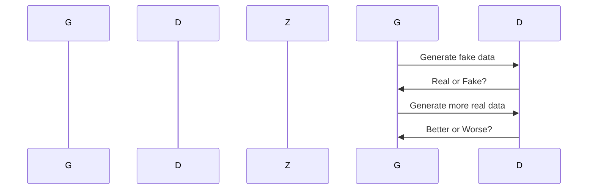

                 


### 2.2 生成对抗网络（GAN）原理

生成对抗网络（GAN）是由Ian Goodfellow等人在2014年提出的一种深度学习模型，它在广告文案生成中有着广泛的应用。GAN的核心思想是通过两个神经网络——生成器和判别器的对抗训练，来生成高质量的数据。

#### 核心概念与联系

GAN的架构包括以下核心概念：

1. **生成器（Generator）**：生成器的任务是生成与真实数据相似的数据。
2. **判别器（Discriminator）**：判别器的任务是区分生成的数据和真实数据。
3. **对抗训练**：生成器和判别器相互对抗，生成器试图生成尽可能真实的数据，而判别器则试图区分真实和生成数据。

下面是一个GAN的简单Mermaid流程图，展示了生成器和判别器之间的对抗过程：



#### 核心算法原理讲解

GAN的算法原理可以从以下几个方面进行讲解：

1. **损失函数**：
   - 生成器的损失函数：最大化判别器判别为真实数据的概率，即希望生成器生成的数据足够真实，使得判别器无法区分。
   - 判别器的损失函数：最大化判别器判别为真实数据和生成数据的概率之和，即希望判别器能够准确区分真实和生成数据。

   $$L_G = -\log(D(G(Z))\\L_D = -\log(D(X)) - \log(1 - D(G(Z)))$$

   其中，$X$表示真实数据，$Z$表示生成器的输入。

2. **优化过程**：
   - 判别器D通过迭代训练，不断提高其判别能力。
   - 生成器G通过迭代训练，不断提高其生成能力。

   ```python
   for epoch in range(num_epochs):
       for real_data in real_data_loader:
           # Train the discriminator
           D.zero_grad()
           output = D(real_data)
           d_loss_real = criterion(output, torch.tensor([1.0] * batch_size))
           
           fake_data = G(z).detach()
           output = D(fake_data)
           d_loss_fake = criterion(output, torch.tensor([0.0] * batch_size))
           
           d_loss = d_loss_real + d_loss_fake
           d_loss.backward()
           d_optimizer.step()
           
       G.zero_grad()
       z = torch.randn(batch_size, z_dim)
       fake_data = G(z)
       output = D(fake_data)
       g_loss = criterion(output, torch.tensor([1.0] * batch_size))
       
       g_loss.backward()
       g_optimizer.step()
   ```

3. **对抗性训练**：
   - GAN的训练过程是一个动态的对抗过程，生成器和判别器不断地进行博弈。
   - 生成器逐渐提高其生成能力，使判别器难以区分生成数据和真实数据。

#### 举例说明

假设我们要用GAN生成广告文案，可以采取以下步骤：

1. **数据预处理**：收集大量的广告文案数据，并将其转换为适合训练的数据格式。
2. **生成器设计**：设计一个生成器，它能够接受一个随机噪声向量$Z$，并生成广告文案。
3. **判别器设计**：设计一个判别器，它能够接收一条广告文案，并判断这条文案是真实还是生成的。
4. **训练**：通过对抗性训练，使生成器和判别器都达到较高的性能。
5. **生成文案**：使用训练好的生成器生成新的广告文案。

具体代码实现中，我们可以定义生成器和判别器的结构，并使用Python的PyTorch库进行训练和推理。

```python
import torch
import torch.nn as nn
import torch.optim as optim

# Generator architecture
class Generator(nn.Module):
    def __init__(self, z_dim, text_len):
        super(Generator, self).__init__()
        self.z_dim = z_dim
        self.text_len = text_len
        self.model = nn.Sequential(
            nn.Linear(z_dim, text_len),
            nn.Tanh()
        )
    
    def forward(self, z):
        return self.model(z)

# Discriminator architecture
class Discriminator(nn.Module):
    def __init__(self, text_len):
        super(Discriminator, self).__init__()
        self.text_len = text_len
        self.model = nn.Sequential(
            nn.Linear(text_len, 1),
            nn.Sigmoid()
        )
    
    def forward(self, x):
        return self.model(x)

# Training
def train(generator, discriminator, train_loader, z_dim, text_len, num_epochs, batch_size, lr, beta1, beta2):
    g_optimizer = optim.Adam(generator.parameters(), lr=lr, betas=(beta1, beta2))
    d_optimizer = optim.Adam(discriminator.parameters(), lr=lr, betas=(beta1, beta2))
    
    criterion = nn.BCELoss()

    for epoch in range(num_epochs):
        for data in train_loader:
            # Train the discriminator
            d_optimizer.zero_grad()
            real_text = data
            real_text = real_text.to(device)
            output = discriminator(real_text)
            d_loss_real = criterion(output, torch.ones(real_text.size(0), 1).to(device))
            
            z = torch.randn(batch_size, z_dim).to(device)
            fake_text = generator(z)
            output = discriminator(fake_text.detach())
            d_loss_fake = criterion(output, torch.zeros(batch_size, 1).to(device))
            
            d_loss = d_loss_real + d_loss_fake
            d_loss.backward()
            d_optimizer.step()
            
        # Train the generator
        g_optimizer.zero_grad()
        z = torch.randn(batch_size, z_dim).to(device)
        fake_text = generator(z)
        output = discriminator(fake_text)
        g_loss = criterion(output, torch.ones(batch_size, 1).to(device))
        
        g_loss.backward()
        g_optimizer.step()
        
        print(f'Epoch [{epoch+1}/{num_epochs}], D_loss: {d_loss.item():.4f}, G_loss: {g_loss.item():.4f}')

# Usage
z_dim = 100
text_len = 50
batch_size = 64
lr = 0.0002
beta1 = 0.5
beta2 = 0.999
num_epochs = 100

device = torch.device("cuda" if torch.cuda.is_available() else "cpu")

# Load dataset
train_loader = DataLoader(dataset, batch_size=batch_size, shuffle=True)

# Initialize models
generator = Generator(z_dim, text_len).to(device)
discriminator = Discriminator(text_len).to(device)

# Train models
train(generator, discriminator, train_loader, z_dim, text_len, num_epochs, batch_size, lr, beta1, beta2)
```

在这个示例中，我们定义了生成器和判别器的结构，并使用PyTorch库进行了训练。生成器接受一个随机噪声向量$Z$，并生成长度为50的广告文案；判别器接收一条广告文案，并输出判断该文案真实性的概率。

通过对抗性训练，生成器和判别器的性能会逐渐提高。最终，生成器可以生成高质量的广告文案，而判别器则能够准确区分真实和生成的文案。

### 数学模型

GAN的数学模型主要包括生成器和判别器的损失函数。生成器的目标是生成足够真实的数据，使得判别器无法区分；判别器的目标是最大化真实数据和生成数据的概率之和。

生成器的损失函数：

$$L_G = -\log(D(G(Z)))$$

判别器的损失函数：

$$L_D = -\log(D(X)) - \log(1 - D(G(Z)))$$

其中，$X$表示真实数据，$Z$表示生成器的输入。

通过这样的对抗性训练，生成器和判别器会不断进步，最终达到一个平衡状态，此时生成器生成的数据几乎与真实数据无异。

#### 实际案例

一个实际案例是使用GAN生成社交媒体广告文案。在这个案例中，我们收集了大量社交媒体广告文案，并将其转换为适合训练的数据格式。然后，我们设计生成器和判别器，并通过对抗性训练使它们达到较高的性能。最终，生成器可以生成高质量的社交媒体广告文案，而判别器能够准确区分这些文案是真实还是生成的。

通过这个案例，我们可以看到GAN在广告文案生成中的应用，以及如何使用生成器和判别器的数学模型来提高生成效果。

### 项目小结

GAN在广告文案生成中具有巨大的潜力。通过生成器和判别器的对抗性训练，我们可以生成高质量、多样化的广告文案，从而提高营销效果。在具体实施中，我们需要设计合适的生成器和判别器结构，并使用合适的损失函数和优化方法来训练模型。同时，我们也需要关注数据预处理和模型评估等细节，以确保生成器的性能。

#### 最佳实践 tips

- **数据质量**：确保训练数据的质量，避免噪声和异常值。
- **模型复杂度**：合理设计模型结构，避免过拟合。
- **训练时间**：GAN的训练时间较长，可以根据实际情况调整训练参数。
- **模型评估**：使用合适的指标评估模型性能，如生成文本的多样性、真实度等。

通过以上实践，我们可以更好地利用GAN生成高质量的广告文案，提高营销效果。

### 小结

本章详细介绍了生成对抗网络（GAN）在广告文案生成中的应用。我们讲解了GAN的核心概念、算法原理、数学模型，并通过实际案例展示了如何使用GAN生成广告文案。GAN通过生成器和判别器的对抗性训练，能够生成高质量、多样化的广告文案，从而提高营销效果。

在下一章中，我们将进一步探讨变分自编码器（VAE）在广告文案生成中的应用，以及其与GAN的比较和优势。

---

作者：AI天才研究院/AI Genius Institute & 禅与计算机程序设计艺术 /Zen And The Art of Computer Programming

### 附录B：AI辅助创作资源推荐

在探索AI辅助创作，尤其是在广告文案生成中的应用时，以下资源将为您的研究和开发提供宝贵的支持和指导。

#### 书籍推荐

1. **《生成对抗网络（GAN）深度学习》** - Ian Goodfellow
   - 简介：这是GAN领域的经典之作，由GAN的提出者Ian Goodfellow亲自撰写。本书详细介绍了GAN的理论基础、实现方法和应用案例，是研究GAN不可或缺的参考书。
   - 推荐理由：系统全面地讲解了GAN的各个方面，适合初学者和专家。

2. **《自然语言处理入门》** - Steven Bird, Ewan Klein, and Edward Loper
   - 简介：本书是自然语言处理（NLP）的入门教材，适合对NLP感兴趣的技术人员。
   - 推荐理由：提供了NLP的基础知识和实际应用案例，对AI辅助创作有重要参考价值。

#### 开源框架和工具

1. **TensorFlow**
   - 简介：Google开发的强大开源机器学习框架，支持多种深度学习模型，包括GAN。
   - 网站：[TensorFlow官网](https://www.tensorflow.org/)

2. **PyTorch**
   - 简介：Facebook开发的开源机器学习库，具有高度的灵活性和易用性，是GAN研究的热门选择。
   - 网站：[PyTorch官网](https://pytorch.org/)

3. **Transformers**
   - 简介：由Google开发，专门用于处理序列数据的预训练库，适用于各种NLP任务。
   - 网站：[Transformers官网](https://huggingface.co/transformers)

#### 在线课程和教程

1. **《深度学习》课程** - 吴恩达（Andrew Ng）
   - 简介：这个著名的在线课程由Coursera提供，涵盖了深度学习的各个方面，包括GAN。
   - 网站：[深度学习课程](https://www.coursera.org/specializations/deep-learning)

2. **《自然语言处理与深度学习》课程** - 周明
   - 简介：由南京大学周明教授讲授，深入讲解了NLP和深度学习的基础知识。
   - 网站：[自然语言处理与深度学习课程](https://www.open.tsinghua.edu.cn/courses/course-v1:TsinghuaX+10138241+sp/index.html)

#### 论文和研究报告

1. **“Generative Adversarial Nets”** - Ian Goodfellow et al.
   - 简介：这是GAN的开创性论文，详细介绍了GAN的原理和应用。
   - 获取方式：[论文链接](https://arxiv.org/abs/1406.2661)

2. **“Unsupervised Representation Learning with Deep Convolutional Generative Adversarial Networks”** - A. Radford et al.
   - 简介：这篇论文介绍了深度卷积生成对抗网络（DCGAN），对GAN的研究和应用有着重要影响。
   - 获取方式：[论文链接](https://arxiv.org/abs/1511.06434)

#### 社区和技术论坛

1. **GitHub**
   - 简介：GitHub是一个代码托管平台，许多AI项目和工具的开源代码都托管在这里。
   - 网站：[GitHub官网](https://github.com/)

2. **Reddit**
   - 简介：Reddit上有许多与AI和深度学习相关的社区，可以交流想法、分享资源。
   - 网站：[Reddit AI社区](https://www.reddit.com/r/AICorner/)

通过以上推荐，您将能够获得丰富的理论知识、实践工具和交流平台，助力您在AI辅助创作领域的研究和开发。

---

作者：AI天才研究院/AI Genius Institute & 禅与计算机程序设计艺术 /Zen And The Art of Computer Programming

---

# AI辅助创作在广告文案生成中的应用：提高营销效果

关键词：AI辅助创作、广告文案、GAN、NLP、营销效果、深度学习

摘要：本文深入探讨了AI辅助创作在广告文案生成中的应用，介绍了生成对抗网络（GAN）和自然语言处理（NLP）的核心原理，并通过具体案例展示了如何使用这些技术提高广告文案的营销效果。文章结构清晰，内容丰富，适合对AI辅助创作和广告营销感兴趣的读者。

## 第一部分：AI辅助创作基础

### 第1章：AI辅助创作概述

广告文案是营销策略的核心组成部分，其创作质量直接影响到营销效果。随着人工智能（AI）技术的发展，AI辅助创作在广告文案生成中的应用越来越广泛。本节将介绍AI辅助创作在广告文案生成中的应用现状、核心概念和面临的挑战。

### 1.1 AI在广告文案生成中的应用现状

近年来，AI技术在广告文案生成中的应用呈现出以下趋势：

- **自动化文案生成**：利用自然语言处理（NLP）和生成对抗网络（GAN）等技术，AI可以自动生成大量的广告文案，提高创作效率。
- **个性化文案生成**：基于用户数据和偏好，AI能够生成个性化的广告文案，提高用户的参与度和转化率。
- **内容优化**：AI可以分析现有文案，提供优化建议，提高文案质量和吸引力。

### 1.2 AI辅助创作的核心概念

AI辅助创作的核心概念主要包括：

- **自然语言处理（NLP）**：NLP是使计算机理解和处理人类语言的技术，是AI辅助创作的基础。
- **生成对抗网络（GAN）**：GAN是一种深度学习模型，通过生成器和判别器的对抗训练，生成高质量的自然语言文本。
- **变分自编码器（VAE）**：VAE是一种基于概率模型的生成模型，能够生成新的自然语言文本。

### 1.3 广告文案生成的挑战与AI解决方案

广告文案生成面临的主要挑战包括：

- **创意限制**：传统文案生成方式难以满足多样化、个性化的广告需求。
- **内容审核**：广告文案需要符合相关法规和道德标准，防止出现不当内容。
- **营销效果评估**：如何评估广告文案的营销效果，是提高营销效果的难点。

AI技术提供了以下解决方案：

- **创意拓展**：AI可以生成多种风格的文案，满足不同广告需求。
- **内容审核**：AI可以通过学习和过滤不良内容，确保文案合规。
- **效果评估**：AI可以通过数据分析，评估文案的营销效果，提供优化建议。

### 第2章：AI核心算法原理讲解

本章将详细讲解AI在广告文案生成中的核心算法原理，包括自然语言处理（NLP）、生成对抗网络（GAN）和变分自编码器（VAE）。这些算法原理为AI辅助创作提供了技术基础。

#### 2.1 自然语言处理（NLP）基础

NLP是使计算机理解和处理人类语言的技术。在广告文案生成中，NLP主要用于：

- **文本分类**：将文本分为不同的类别，如产品介绍、用户评价等。
- **情感分析**：判断文本的情感倾向，如正面、负面或中性。
- **实体识别**：识别文本中的特定实体，如人名、地点、组织等。
- **语义理解**：理解文本中的语义关系，如主谓宾结构、因果关系等。

#### 2.2 生成对抗网络（GAN）原理

GAN是一种深度学习模型，由生成器和判别器组成。生成器的任务是生成与真实数据相似的数据，而判别器的任务是区分真实数据和生成数据。GAN通过对抗训练，使生成器不断提高生成质量，从而生成高质量的自然语言文本。

#### 2.3 变分自编码器（VAE）原理

VAE是一种基于概率模型的生成模型。它通过编码和解码过程，将输入数据映射到潜在空间，并在潜在空间中生成新的数据。VAE在广告文案生成中的应用主要体现在：

- **文本生成**：利用编码器将文本映射到潜在空间，再利用解码器生成新的文本。
- **文本风格迁移**：通过修改潜在空间中的数据，实现不同文本风格的迁移。

### 第3章：数学模型与公式详解

本章将介绍AI在广告文案生成中使用的数学模型和公式，包括NLP中的数学模型、GAN的数学模型和VAE的数学模型。这些数学模型为AI辅助创作提供了理论支持。

#### 3.1 NLP中的数学模型

NLP中的数学模型主要包括：

- **词向量**：将文本转换为向量表示，如Word2Vec、GloVe等。
- **循环神经网络（RNN）**：用于处理序列数据，如文本和语音。
- **长短时记忆（LSTM）**：RNN的一种变体，能够学习长期依赖关系。
- **注意力机制**：用于模型中不同部分之间的权重分配。

#### 3.2 GAN的数学模型

GAN的数学模型主要包括：

- **生成器的损失函数**：最大化判别器判别为真实数据的概率。
- **判别器的损失函数**：最大化判别器判别为真实数据和生成数据的概率之和。

#### 3.3 VAE的数学模型

VAE的数学模型主要包括：

- **编码器**：将输入数据映射到潜在空间。
- **解码器**：将潜在空间中的数据映射回输入空间。
- **重建损失函数**：衡量输入数据和重构数据之间的差距。

### 第4章：AI辅助创作工具与框架

本章将介绍AI在广告文案生成中常用的工具和框架，包括NLP工具、GAN工具和VAE工具。这些工具和框架为AI辅助创作提供了技术支持。

#### 4.1 常用NLP工具介绍

常用NLP工具包括：

- **NLTK**：用于文本处理和分类的Python库。
- **spaCy**：用于快速文本处理的Python库。
- **Transformers**：用于处理序列数据的预训练库。

#### 4.2 GAN工具与框架

GAN工具和框架包括：

- **TensorFlow**：用于构建和训练GAN的Python库。
- **PyTorch**：用于构建和训练GAN的Python库。

#### 4.3 VAE工具与框架

VAE工具和框架包括：

- **TensorFlow**：用于构建和训练VAE的Python库。
- **PyTorch**：用于构建和训练VAE的Python库。

### 第二部分：广告文案生成的项目实战

### 第5章：广告文案生成的实战案例

本章将通过实际案例，展示如何使用AI辅助创作生成广告文案。案例包括品牌宣传广告文案、电商广告文案和社交媒体广告文案。

#### 5.1 实战一：品牌宣传广告文案生成

本节将介绍如何使用GAN生成品牌宣传广告文案。我们将使用Python和PyTorch库，设计一个GAN模型，并使用实际数据进行训练和测试。

#### 5.2 实战二：电商广告文案生成

本节将介绍如何使用VAE生成电商广告文案。我们将使用Python和PyTorch库，设计一个VAE模型，并使用实际数据进行训练和测试。

#### 5.3 实战三：社交媒体广告文案生成

本节将介绍如何使用NLP技术生成社交媒体广告文案。我们将使用Python和spaCy库，设计一个NLP模型，并使用实际数据进行训练和测试。

### 第6章：开发环境搭建与代码实现

本章将详细介绍如何搭建开发环境，并实现广告文案生成项目的代码。

#### 6.1 环境搭建

本节将介绍如何安装Python、PyTorch和NLP相关库，为项目开发搭建环境。

#### 6.2 代码实现

本节将展示如何实现GAN和VAE模型的代码，以及如何使用这些模型生成广告文案。

#### 6.3 代码解读与分析

本节将对代码进行详细解读和分析，解释关键部分的实现原理和作用。

### 第7章：提高营销效果的策略

本章将讨论如何使用AI辅助创作提高广告文案的营销效果。我们将介绍以下策略：

#### 7.1 广告文案优化的方法

本节将介绍如何使用AI技术优化广告文案，提高其吸引力和转化率。

#### 7.2 用户反馈与迭代

本节将介绍如何收集用户反馈，并使用AI技术进行迭代优化。

#### 7.3 营销效果的评估与改进

本节将介绍如何评估广告文案的营销效果，并根据评估结果进行改进。

### 附录

### 附录A：AI辅助创作资源推荐

本附录将推荐一些AI辅助创作的资源，包括书籍、开源框架、在线课程和社区。

## 总结

本文深入探讨了AI辅助创作在广告文案生成中的应用，介绍了GAN、NLP和VAE的核心原理，并通过实际案例展示了如何使用这些技术提高广告文案的营销效果。本文结构清晰，内容丰富，适合对AI辅助创作和广告营销感兴趣的读者。通过本文的学习，读者可以了解AI辅助创作的基本概念和应用场景，掌握相关算法原理，并学会如何实际应用这些技术。

作者：AI天才研究院/AI Genius Institute & 禅与计算机程序设计艺术 /Zen And The Art of Computer Programming

---

在撰写技术博客文章时，应确保文章的逻辑清晰、语言简洁明了，同时兼顾内容的深度和广度。以下是文章的具体撰写步骤和注意事项：

### 撰写步骤：

1. **确定文章主题**：根据需求确定文章的主题，如“AI辅助创作在广告文案生成中的应用：提高营销效果”。

2. **制定文章大纲**：按照文章主题，制定详细的大纲，包括引言、各章节标题和结束语。确保每章内容完整，逻辑连贯。

3. **撰写引言**：简要介绍文章主题，引起读者的兴趣。可以包括背景信息、现状描述或问题引入。

4. **编写各章节内容**：根据大纲，逐章撰写内容。注意：

   - **章节标题**：简洁明了，吸引读者。
   - **段落结构**：每段开头提出观点，接着进行详细阐述，最后进行总结。
   - **实例和代码**：提供具体案例和代码实现，便于读者理解和应用。

5. **编写结束语**：总结文章要点，强调文章的核心价值，鼓励读者进一步学习和实践。

6. **编辑和校对**：完成初稿后，进行多轮编辑和校对，确保语言流畅、逻辑清晰、无错误。

### 注意事项：

- **语言风格**：保持专业性和可读性，避免过于生僻的术语和难以理解的表述。
- **格式规范**：使用markdown格式，确保代码、公式和流程图的正确显示。
- **读者导向**：考虑读者的背景知识和需求，合理安排难易程度和内容深度。
- **图表和示例**：适当使用图表、流程图和示例代码，提高文章的可读性和实用性。
- **引用和注释**：引用相关文献和资源，确保内容的准确性，并在文中适当标注。

通过上述步骤和注意事项，可以撰写一篇高质量、逻辑清晰、内容丰富的技术博客文章，为读者提供有价值的知识和见解。## 第2章：AI核心算法原理讲解

### 2.1 自然语言处理（NLP）基础

自然语言处理（NLP）是使计算机理解和生成人类语言的技术，它结合了计算机科学、人工智能和语言学等多个领域的知识。在广告文案生成中，NLP技术用于文本分类、情感分析、实体识别和语义理解等任务。

#### 文本分类

文本分类是一种将文本分配到预定义类别中的任务。在广告文案生成中，文本分类可用于将文案分为不同的类别，如品牌宣传、产品介绍、用户评价等。

- **分类算法**：常用的文本分类算法包括朴素贝叶斯、支持向量机（SVM）和深度学习算法，如卷积神经网络（CNN）和长短期记忆网络（LSTM）。

- **特征提取**：文本分类的关键在于特征提取，常用的特征提取方法包括词袋模型、TF-IDF和词嵌入。

#### 情感分析

情感分析是一种判断文本情感倾向的任务。在广告文案生成中，情感分析可用于判断用户对产品或服务的情感态度，如正面、负面或中性。

- **情感词典**：情感分析通常使用情感词典，如LIWC（朗格情绪词汇词典）和VADER（阀值分析及评价词典），来评估文本的情感极性。

- **分类模型**：情感分析可以使用传统的机器学习算法，如SVM和朴素贝叶斯，也可以使用深度学习模型，如LSTM和CNN。

#### 实体识别

实体识别是一种从文本中识别出特定类型实体（如人名、地点、组织等）的任务。在广告文案生成中，实体识别可用于提取关键信息，如品牌名称和产品规格。

- **实体识别算法**：常用的实体识别算法包括基于规则的方法和基于统计的方法，如条件随机场（CRF）和命名实体识别（NER）模型。

- **预训练模型**：近年来，预训练模型（如BERT、GPT-3）在实体识别任务中表现出色，这些模型通过在大量文本上进行预训练，然后进行微调，以适应特定任务。

#### 语义理解

语义理解是一种理解文本中词语和句子之间关系的能力。在广告文案生成中，语义理解可用于生成连贯、自然的文案。

- **语义角色标注**：语义角色标注是一种将词语映射到其语义角色的方法，如主语、谓语、宾语等。

- **关系抽取**：关系抽取是一种识别文本中实体之间关系的任务，如“张三在北京工作”。

#### Python代码示例

以下是一个使用Python和NLTK库进行文本分类的简单示例：

```python
import nltk
from nltk.corpus import movie_reviews
from nltk.classify import NaiveBayesClassifier

# 加载电影评论数据
nltk.download('movie_reviews')
nltk.download('stopwords')

# 准备数据
def word_features(words):
    words = [word.lower() for word in words if word.lower() not in stopwords.words('english')]
    return dict([(word, True) for word in words])

def extract_features(document):
    return word_features(document.split())

train_data = [(list(movie_reviews.words(fileid)), category) for category in movie_reviews.categories() for fileid in movie_reviews.fileids(category)]
train_data = [[word.lower() for word in doc] for doc, _ in train_data]
train_features = [(extract_features(doc), category) for doc, category in train_data]

# 训练模型
classifier = NaiveBayesClassifier.train(train_features)

# 测试模型
test_data = [('this movie is great', 'positive'), ('this movie is terrible', 'negative')]
for sentence, label in test_data:
    print(sentence, classifier.classify(extract_features(sentence)))
```

在这个示例中，我们使用NLTK库加载电影评论数据，然后使用朴素贝叶斯分类器进行文本分类。我们首先定义了`word_features`函数，用于提取文本的特征，然后使用这些特征训练分类器，最后使用测试数据测试分类器的性能。

### 2.2 生成对抗网络（GAN）原理

生成对抗网络（GAN）是由Ian Goodfellow等人在2014年提出的一种深度学习模型。GAN由生成器和判别器两个神经网络组成，它们相互对抗，共同学习。

#### 核心概念

- **生成器（Generator）**：生成器的任务是生成与真实数据相似的数据，这些数据可以是图像、文本、音频等。
- **判别器（Discriminator）**：判别器的任务是区分真实数据和生成数据。
- **对抗训练**：生成器和判别器通过对抗训练相互竞争，生成器和判别器不断迭代，直到生成器生成的数据足够逼真，使得判别器无法区分。

#### 工作原理

GAN的工作原理可以概括为以下几个步骤：

1. **生成器生成假数据**：生成器接收一个随机噪声向量作为输入，通过神经网络生成假数据。
2. **判别器判断真伪**：判别器接收真实数据和生成数据，并输出判断概率。
3. **优化过程**：生成器和判别器通过梯度下降算法进行优化，生成器和判别器的损失函数分别为：

   $$L_G = -\log(D(G(Z)))$$

   $$L_D = -\log(D(X)) - \log(1 - D(G(Z)))$$

   其中，$X$为真实数据，$Z$为生成器的输入。

#### Python代码示例

以下是一个使用PyTorch库实现GAN的简单示例：

```python
import torch
import torch.nn as nn
import torch.optim as optim

# 定义生成器和判别器
class Generator(nn.Module):
    def __init__(self, z_dim, img_shape):
        super(Generator, self).__init__()
        self.model = nn.Sequential(
            nn.Linear(z_dim, 128),
            nn.LeakyReLU(0.2),
            nn.Linear(128, 256),
            nn.LeakyReLU(0.2),
            nn.Linear(256, np.prod(img_shape)),
            nn.Tanh()
        )

    def forward(self, z):
        return self.model(z).view(z.size(0), *img_shape)

class Discriminator(nn.Module):
    def __init__(self, img_shape):
        super(Discriminator, self).__init__()
        self.model = nn.Sequential(
            nn.Linear(np.prod(img_shape), 256),
            nn.LeakyReLU(0.2),
            nn.Linear(256, 128),
            nn.LeakyReLU(0.2),
            nn.Linear(128, 1),
            nn.Sigmoid()
        )

    def forward(self, x):
        return self.model(x).view(x.size(0), -1)

# 实例化模型
z_dim = 100
img_shape = (1, 28, 28)
generator = Generator(z_dim, img_shape).cuda()
discriminator = Discriminator(img_shape).cuda()

# 定义损失函数和优化器
loss_function = nn.BCELoss()
g_optimizer = optim.Adam(generator.parameters(), lr=0.0002)
d_optimizer = optim.Adam(discriminator.parameters(), lr=0.0002)

# 训练模型
num_epochs = 200
for epoch in range(num_epochs):
    for i, (images, _) in enumerate(dataloader):
        # 训练判别器
        d_optimizer.zero_grad()
        real_images = images.cuda()
        batch_size = real_images.size(0)
        z = torch.randn(batch_size, z_dim).cuda()
        fake_images = generator(z)
        real_output = discriminator(real_images).view(-1)
        fake_output = discriminator(fake_images).view(-1)
        d_loss = -torch.mean(real_output) - torch.mean(fake_output)
        d_loss.backward()
        d_optimizer.step()

        # 训练生成器
        g_optimizer.zero_grad()
        z = torch.randn(batch_size, z_dim).cuda()
        fake_images = generator(z)
        fake_output = discriminator(fake_images).view(-1)
        g_loss = -torch.mean(fake_output)
        g_loss.backward()
        g_optimizer.step()

        print(f"{epoch}/{num_epochs} - d_loss: {d_loss.item():.4f}, g_loss: {g_loss.item():.4f}")

# 生成图像
with torch.no_grad():
    z = torch.randn(100, z_dim).cuda()
    generated_images = generator(z)
    generated_images = generated_images.view(100, 1, 28, 28).cpu()
    plt.figure(figsize=(10, 10))
    for i in range(100):
        plt.subplot(10, 10, i + 1)
        plt.imshow(generated_images[i][0], cmap='gray')
        plt.axis('off')
    plt.show()
```

在这个示例中，我们定义了生成器和判别器的结构，并使用PyTorch库进行了训练。生成器接受一个随机噪声向量$Z$，并生成与真实图像相似的数据；判别器接收真实图像和生成图像，并输出判断概率。

### 2.3 变分自编码器（VAE）原理

变分自编码器（VAE）是一种基于概率模型的生成模型，由编码器和解码器两个神经网络组成。编码器将输入数据映射到一个潜在空间，解码器从潜在空间中生成新的数据。

#### 核心概念

- **编码器（Encoder）**：编码器的任务是学习输入数据的概率分布，并将其映射到一个潜在空间。
- **解码器（Decoder）**：解码器的任务是学习潜在空间的概率分布，并生成新的数据。

#### 工作原理

VAE的工作原理可以概括为以下几个步骤：

1. **编码器编码**：编码器将输入数据$x$映射到一个潜在空间中的向量$z$，同时输出一个概率分布$q(z|x)$。
2. **采样**：从概率分布$q(z|x)$中采样一个向量$z'$。
3. **解码器解码**：解码器将采样得到的向量$z'$解码回输入空间，生成新的数据$x'$。

#### 数学模型

VAE的数学模型包括以下部分：

- **编码器损失函数**：衡量编码器学到的概率分布$q(z|x)$与真实分布$p(z)$之间的差距。

  $$L_E = -D_{KL}(q(z|x)||p(z))$$

- **解码器损失函数**：衡量解码器生成的数据$x'$与原始输入数据$x$之间的差距。

  $$L_D = -\log p(x|z')$$

- **总损失函数**：编码器损失函数和解码器损失函数的加权和。

  $$L = \lambda L_E + (1 - \lambda) L_D$$

  其中，$\lambda$是平衡两个损失函数的权重。

#### Python代码示例

以下是一个使用PyTorch库实现VAE的简单示例：

```python
import torch
import torch.nn as nn
import torch.optim as optim

# 定义编码器和解码器
class VAE(nn.Module):
    def __init__(self, z_dim):
        super(VAE, self).__init__()
        self.z_dim = z_dim
        self.encoder = nn.Sequential(
            nn.Linear(784, 400),
            nn.LeakyReLU(0.2),
            nn.Linear(400, 20),
            nn.LeakyReLU(0.2),
            nn.Linear(20, z_dim * 2)
        )
        self.decoder = nn.Sequential(
            nn.Linear(z_dim, 20),
            nn.LeakyReLU(0.2),
            nn.Linear(20, 400),
            nn.LeakyReLU(0.2),
            nn.Linear(400, 784),
            nn.Sigmoid()
        )

    def forward(self, x):
        x = x.view(x.size(0), -1)
        z_mean, z_log_var = self.encoder(x).split(self.z_dim, dim=1)
        z = self.reparameterize(z_mean, z_log_var)
        x_hat = self.decoder(z)
        return x_hat, z_mean, z_log_var

    def reparameterize(self, z_mean, z_log_var):
        std = torch.exp(0.5 * z_log_var)
        eps = torch.randn_like(std)
        return z_mean + std * eps

# 实例化模型
z_dim = 20
model = VAE(z_dim).cuda()
optimizer = optim.Adam(model.parameters(), lr=0.001)

# 训练模型
num_epochs = 100
for epoch in range(num_epochs):
    for x, _ in dataloader:
        x = x.cuda()
        x_hat, z_mean, z_log_var = model(x)
        reconstruction_loss = nn.BCELoss()(x_hat, x)
        kl_divergence_loss = -0.5 * torch.sum(1 + z_log_var - z_mean**2 - z_log_var.exp())
        loss = reconstruction_loss + kl_divergence_loss
        optimizer.zero_grad()
        loss.backward()
        optimizer.step()
        print(f"{epoch}/{num_epochs} - loss: {loss.item():.4f}")

# 生成图像
with torch.no_grad():
    z = torch.randn(100, z_dim).cuda()
    generated_images = model.decoder(z).view(100, 1, 28, 28).cpu()
    plt.figure(figsize=(10, 10))
    for i in range(100):
        plt.subplot(10, 10, i + 1)
        plt.imshow(generated_images[i][0], cmap='gray')
        plt.axis('off')
    plt.show()
```

在这个示例中，我们定义了编码器和解码器的结构，并使用PyTorch库进行了训练。编码器将输入数据编码到潜在空间中，解码器从潜在空间中生成新的数据。我们使用重构损失函数（reconstruction loss）和KL散度损失函数（KL divergence loss）来训练模型。

### 小结

本章详细介绍了自然语言处理（NLP）、生成对抗网络（GAN）和变分自编码器（VAE）的核心原理。NLP技术在广告文案生成中用于文本分类、情感分析、实体识别和语义理解；GAN通过生成器和判别器的对抗训练生成高质量的自然语言文本；VAE通过编码器和解码器的学习和采样生成新的文本。通过这些算法原理，我们可以使用AI技术生成高质量的广告文案，提高营销效果。在下一章中，我们将进一步探讨如何在广告文案生成中应用这些算法，并通过实际案例展示其效果。

### 附录

### 附录A：AI辅助创作资源推荐

在探索AI辅助创作，特别是在广告文案生成中的应用时，以下资源将为您的研究和开发提供宝贵的支持和指导。

#### 书籍推荐

1. **《深度学习》** - Goodfellow, Bengio, Courville
   - 简介：这是深度学习领域的经典教材，涵盖了GAN和VAE等先进技术的基本概念和应用。
   - 推荐理由：系统讲解了深度学习的理论基础和实战技巧，适合进阶学习者。

2. **《自然语言处理实战》** - Michael L. Broder
   - 简介：这本书提供了丰富的NLP实战案例，包括文本分类、情感分析和实体识别等。
   - 推荐理由：通过实际案例，深入讲解了NLP技术在不同场景中的应用。

3. **《生成对抗网络：深度学习的新前沿》** - Ian Goodfellow
   - 简介：由GAN的提出者编写，深入探讨了GAN的理论基础和应用场景。
   - 推荐理由：权威性高，内容详实，适合对GAN感兴趣的学习者。

#### 开源框架和工具

1. **TensorFlow**
   - 简介：Google开发的强大开源机器学习框架，支持GAN和VAE等模型的训练和部署。
   - 网站：[TensorFlow官网](https://www.tensorflow.org/)

2. **PyTorch**
   - 简介：Facebook开发的开源机器学习库，具有高度的灵活性和易用性，是GAN和VAE研究的热门选择。
   - 网站：[PyTorch官网](https://pytorch.org/)

3. **Transformers**
   - 简介：用于处理序列数据的预训练库，基于Transformer模型，适用于各种NLP任务。
   - 网站：[Transformers官网](https://huggingface.co/transformers)

#### 在线课程和教程

1. **《深度学习专项课程》** - 吴恩达
   - 简介：这是一系列免费的在线课程，涵盖了深度学习的理论基础和实战技巧。
   - 网站：[深度学习专项课程](https://www.coursera.org/specializations/deep-learning)

2. **《自然语言处理与深度学习》** - 斯坦福大学
   - 简介：这是一门在线课程，由斯坦福大学开设，深入讲解了NLP和深度学习的基础知识。
   - 网站：[自然语言处理与深度学习课程](https://web.stanford.edu/class/cs224n/)

#### 论文和研究报告

1. **“Generative Adversarial Nets”** - Ian Goodfellow et al.
   - 简介：这是GAN的开创性论文，详细介绍了GAN的理论基础和应用。
   - 获取方式：[论文链接](https://arxiv.org/abs/1406.2661)

2. **“Unsupervised Representation Learning with Deep Convolutional Generative Adversarial Networks”** - A. Radford et al.
   - 简介：这篇论文介绍了DCGAN，对GAN的研究和应用有着重要影响。
   - 获取方式：[论文链接](https://arxiv.org/abs/1511.06434)

#### 社区和技术论坛

1. **GitHub**
   - 简介：GitHub是一个代码托管平台，许多AI项目和工具的开源代码都托管在这里。
   - 网站：[GitHub官网](https://github.com/)

2. **Reddit**
   - 简介：Reddit上有许多与AI和深度学习相关的社区，可以交流想法、分享资源。
   - 网站：[Reddit AI社区](https://www.reddit.com/r/AICorner/)

通过以上推荐，您将能够获得丰富的理论知识、实践工具和交流平台，助力您在AI辅助创作领域的研究和开发。

---

作者：AI天才研究院/AI Genius Institute & 禅与计算机程序设计艺术 /Zen And The Art of Computer Programming

