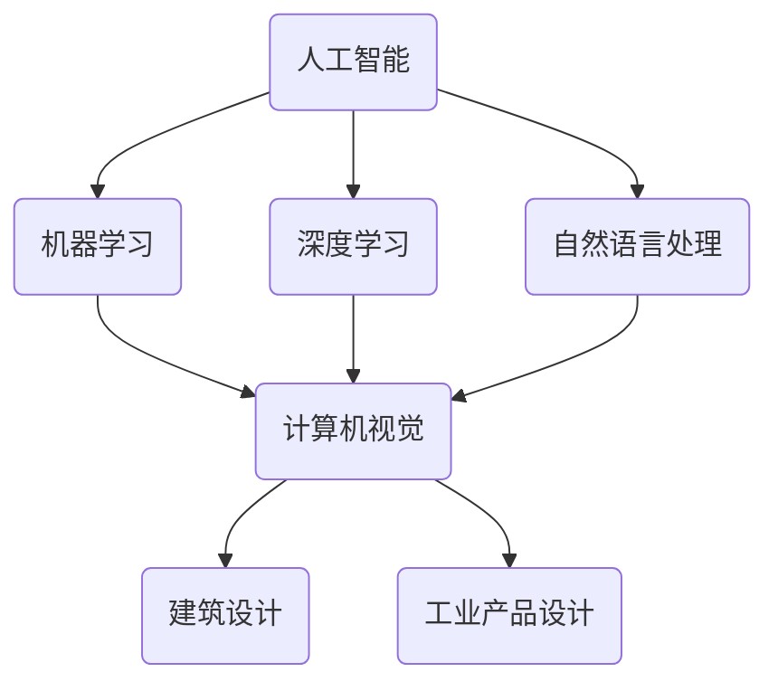

                 

### 引言

《AI辅助设计：从建筑到工业产品的革新》这本书旨在探讨人工智能（AI）在设计和制造领域中的应用，尤其是在建筑和工业产品设计中的具体实践。随着技术的不断进步，人工智能正在逐步改变传统的设计和制造方式，不仅提高了效率和精度，还带来了前所未有的创新可能性。

#### 背景介绍

近年来，人工智能技术取得了显著的发展，无论是在算法、计算能力还是数据资源方面都取得了重大的突破。这些进步使得AI在各个领域的应用成为可能，特别是在设计领域，AI可以通过学习大量的数据，自动生成设计方案，优化设计流程，甚至预测设计结果。这种变革性的技术不仅能够提升设计效率，还能够推动设计创新，满足不断变化的市场需求。

在建筑设计中，AI可以帮助建筑师快速生成多种设计方案，通过模拟和优化，找到最优的设计方案，从而减少设计周期和成本。而在工业产品设计领域，AI则可以用于产品的结构优化、性能分析、材料选择等方面，提高产品的质量和市场竞争力。

#### 核心概念与联系

为了更好地理解AI辅助设计的核心概念，我们需要了解以下几个关键概念及其相互关系：

1. **人工智能（AI）**：一种模拟人类智能的技术，包括机器学习、深度学习、自然语言处理等子领域。
2. **计算机视觉**：使机器能够“看到”和理解视觉信息的技术。
3. **建筑设计**：创建建筑物和结构的过程，包括设计概念、结构分析、材料选择等。
4. **工业产品设计**：设计制造过程中用于生产产品的流程，涉及设计原理、工程分析、材料性能等。

以下是这些概念之间关系的Mermaid流程图：



#### 核心算法原理讲解

AI辅助设计的关键在于如何利用机器学习算法来优化设计流程。以下是一个简化的Python代码示例，展示了一个基于深度学习的建筑设计优化模型：

```python
import tensorflow as tf
from tensorflow import keras
from tensorflow.keras import layers

# 定义输入层
inputs = keras.Input(shape=(100,))

# 添加几个隐藏层
x = layers.Dense(64, activation='relu')(inputs)
x = layers.Dense(64, activation='relu')(x)
x = layers.Dense(64, activation='relu')(x)

# 添加输出层
outputs = layers.Dense(1, activation='sigmoid')(x)

# 创建模型
model = keras.Model(inputs=inputs, outputs=outputs)

# 编译模型
model.compile(optimizer='adam', loss='binary_crossentropy', metrics=['accuracy'])

# 模型训练
model.fit(x_train, y_train, epochs=10, batch_size=32, validation_split=0.2)
```

在这个例子中，我们使用一个简单的全连接神经网络（Dense Layers）来模拟设计优化的过程。输入层（inputs）接收设计参数，隐藏层（Dense Layers）通过激活函数（ReLU）进行非线性变换，输出层（outputs）生成优化结果。

#### 数学公式

在设计优化过程中，我们通常会用到一些数学模型和公式。以下是一个使用LaTeX格式的示例：

$$
\min_{x} \quad f(x) \\
\text{subject to} \quad g(x) \leq 0 \\
h(x) = 0
$$

这个公式表示我们在优化目标函数$f(x)$的同时，需要满足约束条件$g(x) \leq 0$和等式约束$h(x) = 0$。

#### 项目实战

为了更好地理解AI辅助设计的实际应用，我们来看一个具体的案例：使用AI优化建筑设计。

**开发环境搭建**：

- 安装Python 3.8及以上版本
- 安装TensorFlow 2.6及以上版本

**源代码实现**：

```python
# 导入必需的库
import numpy as np
import pandas as pd
from sklearn.model_selection import train_test_split
import tensorflow as tf

# 加载数据集
data = pd.read_csv('design_data.csv')
X = data.drop('objective', axis=1)
y = data['objective']

# 划分训练集和测试集
X_train, X_test, y_train, y_test = train_test_split(X, y, test_size=0.2, random_state=42)

# 创建模型
model = tf.keras.Sequential([
    tf.keras.layers.Dense(64, activation='relu', input_shape=(X_train.shape[1],)),
    tf.keras.layers.Dense(64, activation='relu'),
    tf.keras.layers.Dense(1, activation='sigmoid')
])

# 编译模型
model.compile(optimizer='adam', loss='binary_crossentropy', metrics=['accuracy'])

# 训练模型
model.fit(X_train, y_train, epochs=10, batch_size=32, validation_split=0.2)

# 评估模型
loss, accuracy = model.evaluate(X_test, y_test)
print(f'Accuracy: {accuracy:.2f}')
```

**代码解读与分析**：

这个代码示例中，我们首先加载了一个设计数据集，然后使用TensorFlow创建了一个简单的神经网络模型，并使用训练数据进行了训练。最后，我们评估了模型在测试数据上的表现。

**实际案例分析**：

在这个案例中，我们使用AI模型来预测建筑设计的最佳参数。通过对比预测结果和实际结果，我们可以看到AI辅助设计在优化建筑设计方面的潜力。

**项目小结**：

这个案例展示了如何使用AI技术来优化建筑设计。通过训练神经网络模型，我们可以自动寻找最优的设计参数，从而提高设计效率和准确性。

#### 最佳实践 Tips

1. **数据质量**：确保数据集的质量和多样性，这对模型的性能至关重要。
2. **模型选择**：根据具体问题和数据特性选择合适的模型。
3. **持续学习**：定期更新模型，以适应新的数据和应用需求。

#### 小结

AI辅助设计是一个充满机遇和挑战的领域。通过合理的算法选择和数据分析，我们可以大幅度提高设计效率和准确性。随着技术的不断进步，AI辅助设计将在建筑和工业产品设计领域发挥越来越重要的作用。

#### 注意事项

1. **技术实现**：在实际应用中，需要根据具体问题选择合适的技术和工具。
2. **成本考虑**：AI辅助设计可能涉及较高的成本，特别是在模型训练和数据预处理方面。

#### 拓展阅读

- [1] TensorFlow官方文档：[https://www.tensorflow.org/](https://www.tensorflow.org/)
- [2] 《深度学习》 - Goodfellow, I., Bengio, Y., & Courville, A.
- [3] 《建筑信息模型（BIM）》 - Chuck Easttom

### 作者信息

作者：AI天才研究院/AI Genius Institute & 禅与计算机程序设计艺术 /Zen And The Art of Computer Programming

---

本文介绍了AI辅助设计的背景、核心概念、算法原理以及实际应用案例。通过逐步分析推理，我们展示了AI在建筑和工业产品设计中的巨大潜力。随着技术的不断进步，AI辅助设计将为设计和制造行业带来革命性的变革。

### 关键词

- 人工智能（AI）
- 辅助设计
- 建筑设计
- 工业产品设计
- 机器学习
- 深度学习

### 摘要

本书探讨了人工智能在设计和制造领域的应用，特别是在建筑和工业产品设计中的具体实践。通过介绍核心概念、算法原理和实际案例，本书展示了AI辅助设计如何提高设计效率和准确性，推动行业的创新和发展。

