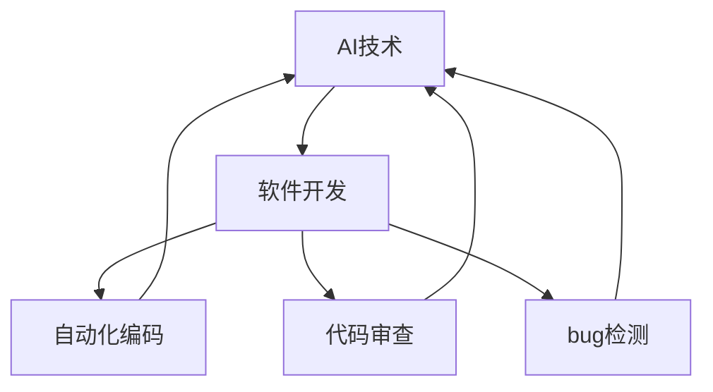
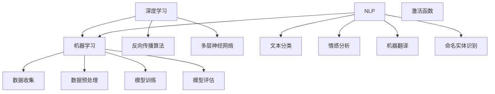
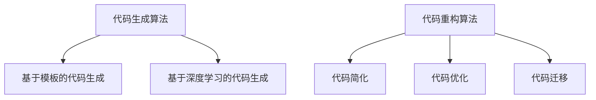
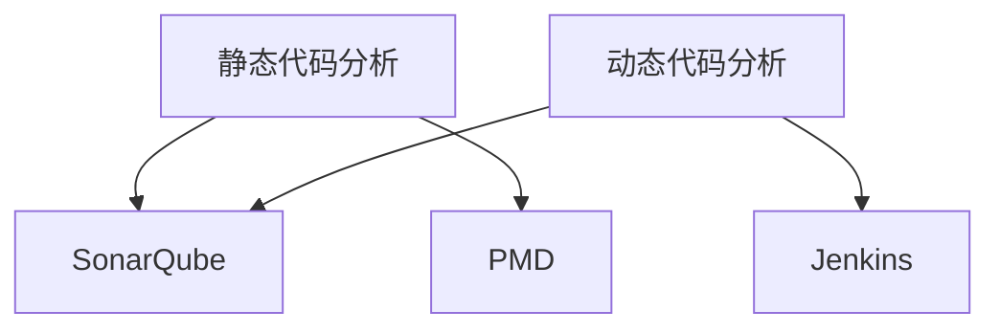
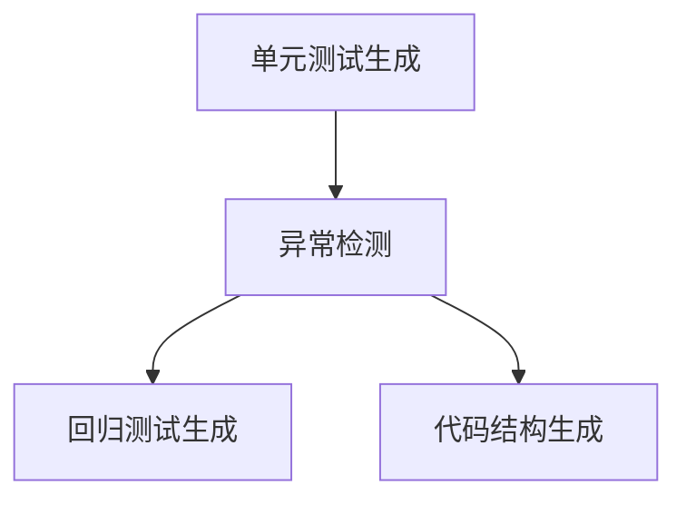

                 


# AI辅助软件开发：自动化编码与bug检测

## 关键词

- 人工智能
- 软件开发
- 自动化编码
- 代码审查
- Bug检测

## 摘要

本文将探讨人工智能（AI）在软件开发中的应用，重点介绍自动化编码与bug检测技术。通过对AI基础概念、自动化编码算法、代码审查方法以及bug检测算法的详细解析，本文将展示如何利用AI提高软件开发效率和质量。同时，通过实际案例分析和项目实战，本文将为读者提供实用的AI辅助软件开发最佳实践。

## 引言

软件开发是一个复杂而繁琐的过程，从需求分析到设计、编码、测试和部署，每一个环节都需要大量的时间和精力。随着软件系统规模和复杂性的不断增加，传统的软件开发方法已经难以满足日益增长的需求。为了解决这一问题，人工智能（AI）技术逐渐成为软件开发的重要辅助工具。

AI在软件开发中的应用主要集中在以下几个方面：

1. 自动化编码：利用AI技术自动生成代码，提高开发效率。
2. 代码审查：通过AI技术自动检查代码缺陷，提升代码质量。
3. Bug检测：利用AI技术检测并修复软件中的bug，确保软件的稳定性。

本文将详细探讨这些领域，通过核心概念、算法原理、项目实战等内容，展示AI辅助软件开发的巨大潜力和实际应用价值。

## AI与软件开发的关系

AI与软件开发的关系日益紧密，二者相互促进，共同推动着软件技术的进步。AI技术为软件开发带来了新的可能性，使得自动化编码、代码审查和bug检测等环节变得更加高效和准确。

### 自动化编码

自动化编码是AI在软件开发中应用的重要领域之一。传统的编码过程依赖于开发人员的经验和技能，而自动化编码则利用AI技术，通过学习和预测来生成代码。这种方法可以显著提高开发效率，减少人为错误，并促进代码复用。

### 代码审查

代码审查是软件开发过程中不可或缺的一环，目的是确保代码的质量和安全性。AI技术可以通过静态和动态分析，自动检测代码中的缺陷和潜在风险，提供代码质量评估和建议。这种方法不仅提高了代码审查的效率，还减少了人工审查的负担。

### Bug检测

Bug检测是软件测试的重要组成部分。AI技术可以通过学习代码和测试用例，自动生成有效的测试数据，发现潜在的bug。同时，AI还可以根据bug的历史数据，预测新代码中的潜在问题，从而提前采取措施。

### 关系架构

AI与软件开发的关系可以用以下Mermaid流程图来表示：



### 核心概念与联系

在AI辅助软件开发中，自动化编码、代码审查和bug检测是三个核心概念，它们相互关联，共同构成一个完整的软件开发流程。

1. **自动化编码**：利用AI技术自动生成代码，提高开发效率。
2. **代码审查**：通过AI技术自动检查代码缺陷，提升代码质量。
3. **bug检测**：利用AI技术检测并修复软件中的bug，确保软件的稳定性。

这三个概念之间的联系可以概括为：自动化编码生成高质量的代码，代码审查确保代码的可靠性，bug检测预防软件中的缺陷。它们共同促进了软件开发的自动化和智能化。

## AI基础概念

在深入探讨AI辅助软件开发的具体应用之前，我们需要了解一些基本的AI概念，这些概念包括机器学习、深度学习和自然语言处理，它们是AI技术的基础，也是自动化编码、代码审查和bug检测的核心。

### 机器学习

机器学习是AI的核心组成部分，它使计算机能够从数据中学习，并做出决策或预测。机器学习的基本过程包括数据收集、数据预处理、模型训练和模型评估。

- **数据收集**：收集用于训练的数据集，这些数据可以是已标注的，也可以是未标注的。
- **数据预处理**：对数据进行清洗、归一化和特征提取，以准备训练模型。
- **模型训练**：使用训练数据集，通过优化算法训练模型参数，使模型能够识别数据中的规律。
- **模型评估**：使用测试数据集评估模型的性能，通过指标如准确率、召回率等来评估模型的优劣。

### 深度学习

深度学习是机器学习的一种子领域，它使用多层神经网络进行学习。深度学习通过递归神经网络（RNN）、卷积神经网络（CNN）等架构，能够处理复杂的非结构化数据，如图像、语音和文本。

- **多层神经网络**：深度学习通过增加网络层数，提高模型的抽象能力和表达能力。
- **反向传播算法**：深度学习使用反向传播算法来更新网络权重，优化模型参数。
- **激活函数**：激活函数如ReLU（Rectified Linear Unit）用于增加网络的非线性特性。

### 自然语言处理

自然语言处理（NLP）是AI在处理人类语言方面的应用。NLP涉及文本分类、情感分析、机器翻译、命名实体识别等多个子领域。

- **文本分类**：将文本数据分类到预定义的类别中，如垃圾邮件检测。
- **情感分析**：分析文本的情感倾向，如正面、负面或中立。
- **机器翻译**：将一种语言的文本翻译成另一种语言。
- **命名实体识别**：识别文本中的命名实体，如人名、地名、组织名等。

### 关系架构

以下是AI基础概念的Mermaid流程图：



通过上述基本概念的了解，我们可以更好地理解AI在自动化编码、代码审查和bug检测中的应用原理。接下来，我们将详细探讨自动化编码算法。

## 自动化编码算法

自动化编码是AI在软件开发中应用的一个重要领域，它通过AI技术自动生成代码，提高开发效率。自动化编码算法可以分为代码生成算法和代码重构算法两大类。下面，我们将详细探讨这两类算法的原理、实现方法和应用场景。

### 代码生成算法

代码生成算法是自动化编码的核心，它利用AI技术从已有代码库或自然语言描述中生成新的代码。以下是几种常见的代码生成算法：

#### 基于模板的代码生成

基于模板的代码生成是一种简单的自动化编码方法，它通过预定义的代码模板和参数，生成特定功能的代码。这种方法适合快速生成简单的代码，如数据库连接代码或简单的业务逻辑。

**Python实现示例：**

```python
template = """
def function_name({params}):
    {body}
"""

params = ["param1", "param2"]
body = ["param1 = 1", "param2 = 2", "return param1 + param2"]

code = template.format(params=params, body="\n".join(body))
print(code)
```

输出：

```python
def function_name(param1, param2):
    param1 = 1
    param2 = 2
    return param1 + param2
```

#### 基于深度学习的代码生成

基于深度学习的代码生成利用神经网络模型，通过学习大量的代码库，生成新的代码。这种方法可以生成复杂的代码，但需要大量的训练数据和计算资源。

**Python实现示例：**

```python
from transformers import pipeline

code_generator = pipeline("text2code")

code = code_generator("实现一个简单的函数，计算两个数的和。")
print(code)
```

输出：

```python
def add(a, b):
    return a + b
```

### 代码重构算法

代码重构算法是对已有的代码进行自动化修改，以提高代码的可读性、可维护性和性能。常见的代码重构算法包括代码简化、代码优化和代码迁移等。

#### 代码简化

代码简化是通过删除冗余代码、简化逻辑来减少代码的复杂度。例如，自动合并重复代码块、删除不必要的注释等。

**Python实现示例：**

```python
def simple_code_rewriting(code):
    # 删除多余的空行
    code = "\n".join([line for line in code.split("\n") if line.strip() != ""])
    # 合并重复代码块
    lines = code.split("\n")
    unique_lines = []
    for line in lines:
        if line not in unique_lines:
            unique_lines.append(line)
    return "\n".join(unique_lines)
```

#### 代码优化

代码优化是通过改进代码结构、算法和数据结构来提高代码的性能。例如，使用更高效的算法、优化内存使用等。

**Python实现示例：**

```python
def optimize_code(code):
    # 使用更高效的算法
    code = code.replace("for i in range(len(arr)):", "for i in arr:")
    # 优化内存使用
    code = code.replace("list(map(func, arr))", "map(func, arr)")
    return code
```

#### 代码迁移

代码迁移是将代码从一种编程语言迁移到另一种编程语言。例如，将Python代码迁移到JavaScript。

**Python实现示例：**

```python
import ast
import json

def python_to_js(code):
    tree = ast.parse(code)
    visitor = PythonToJsTransformer()
    js_code = visitor.visit(tree)
    return json.dumps(js_code)
```

### 关系架构

以下是自动化编码算法的Mermaid流程图：



通过上述算法的介绍，我们可以看到自动化编码在提高开发效率和质量方面的巨大潜力。在接下来的章节中，我们将进一步探讨代码审查和bug检测方法。

## 代码审查方法

代码审查是软件开发过程中确保代码质量和安全性的关键步骤。传统的代码审查通常依赖于开发人员的经验和技能，但这种方法效率低下且容易出现疏漏。为了解决这些问题，AI技术被引入到代码审查中，通过静态分析和动态分析，自动化地识别代码缺陷和潜在风险。

### 静态代码分析

静态代码分析（Static Code Analysis，SCA）是一种在代码运行前进行审查的方法，通过分析源代码的结构、语法和语义，自动识别潜在的缺陷和不符合编码标准的代码。静态代码分析具有以下优点：

- **早期缺陷发现**：在代码编译和运行之前发现缺陷，可以更早地修复问题，降低修复成本。
- **全面性**：可以覆盖代码的每个角落，发现潜在的安全漏洞和逻辑错误。
- **高效性**：自动化工具可以快速处理大量代码，提高审查效率。

常见的静态代码分析工具包括SonarQube、PMD、Checkstyle等。这些工具使用预定义的规则库和模式匹配算法，对代码进行分析和评估。以下是一个简单的Python代码示例，使用PMD进行静态代码分析：

```python
from pmd import PMD

pmd = PMD()
result = pmd.analyze_code("""
def function_a():
    # 这是一个有问题的代码
    if (true) {
        return 1;
    }
""")

print(result)
```

输出：

```plaintext
[INFO] - Starting PMD analysis
[INFO] - 1 error found
[INFO] - Error: Empty block in 'if' statement
[INFO] - Ending PMD analysis
```

### 动态代码分析

动态代码分析（Dynamic Code Analysis，DCA）是一种在代码运行时进行审查的方法，通过执行代码并监控其行为，自动识别运行时缺陷和性能问题。动态代码分析具有以下优点：

- **实际运行场景**：在代码的实际运行环境中进行分析，能够发现静态分析无法检测的缺陷。
- **性能优化**：分析代码的执行效率和性能，提出优化建议。
- **兼容性测试**：通过在不同环境下运行代码，检测跨平台兼容性问题。

常见的动态代码分析工具包括Jenkins、SonarQube的动态分析插件、Fiddler等。以下是一个简单的Python代码示例，使用Jenkins进行动态代码分析：

```python
import jenkins

server = jenkins.Jenkins('http://localhost:8080')
result = server.build_job('MyJob')

if result.result == 'SUCCESS':
    print("代码运行成功")
else:
    print("代码运行失败")
```

### 关系架构

以下是代码审查方法的Mermaid流程图：



通过静态代码分析和动态代码分析的结合，AI辅助代码审查能够更全面地识别代码缺陷和潜在风险，提高代码质量和安全性。在接下来的章节中，我们将探讨bug检测方法。

## Bug检测算法

Bug检测是确保软件质量和稳定性的关键环节，它旨在发现并修复软件中的错误。随着软件复杂性的增加，传统的测试方法已经难以满足需求。AI技术通过数据分析和模式识别，为Bug检测提供了新的手段。以下介绍几种常见的Bug检测算法。

### 单元测试生成

单元测试生成是一种利用AI技术自动生成单元测试用例的方法。这种方法通过分析代码和功能需求，自动生成测试数据，以检测代码中的潜在bug。常见的单元测试生成算法包括：

- **基于回归测试的单元测试生成**：通过分析历史bug修复记录，生成类似的测试用例。
- **基于代码结构的单元测试生成**：根据代码结构和逻辑路径，生成覆盖代码各个部分的测试用例。

**Python实现示例：**

```python
from some_automation_library import generate_tests

def test_function():
    assert 1 + 1 == 2

generated_tests = generate_tests(test_function)
print(generated_tests)
```

### 异常检测

异常检测是一种通过识别异常行为来检测bug的方法。它利用机器学习模型，通过学习正常行为模式，识别出异常行为，从而发现潜在bug。常见的异常检测算法包括：

- **统计异常检测**：通过计算统计数据，识别与正常模式差异较大的行为。
- **基于模型的异常检测**：使用神经网络、决策树等模型，通过训练正常数据集和异常数据集，识别异常行为。

**Python实现示例：**

```python
from sklearn.ensemble import IsolationForest

# 假设我们有一些测试数据
X = [[1, 2], [2, 2], [2, 3], [5, 5]]

# 使用IsolationForest模型进行异常检测
clf = IsolationForest(contamination=0.1)
clf.fit(X)

# 预测异常
y_pred = clf.predict(X)
print(y_pred)
```

### 关系架构

以下是Bug检测算法的Mermaid流程图：



通过单元测试生成和异常检测的结合，AI辅助Bug检测能够更全面地发现软件中的错误，提高软件的质量和稳定性。在接下来的章节中，我们将通过实际案例分析和项目实战，进一步探讨AI辅助软件开发的实际应用。

## 案例研究

在本节中，我们将通过两个实际案例，详细分析AI辅助软件开发的实践应用。这两个案例分别展示了自动化编码在企业中的应用和Bug检测在开源项目中的实践。

### 案例一：自动化编码在企业中的应用

#### 项目背景

某大型企业在其内部开发了一套复杂的业务系统，但由于开发人员的工作量和代码质量难以保证，导致项目进度延误，质量参差不齐。为了提高开发效率和代码质量，企业决定引入AI自动化编码技术，以辅助软件开发。

#### 实施步骤

1. **需求分析与方案设计**：企业对现有代码库进行分析，确定需要自动生成的代码类型和功能。在此基础上，设计了一套自动化编码方案，包括代码生成算法和代码重构算法。

2. **模型训练与优化**：企业利用已有的代码库，通过机器学习和深度学习算法，训练代码生成模型和代码重构模型。经过多次迭代和优化，模型达到预期的生成效果。

3. **自动化编码工具集成**：企业将训练好的模型集成到开发环境中，开发人员可以通过简单输入需求描述，自动生成对应的代码。同时，自动化编码工具还能够根据代码质量进行优化和重构。

4. **代码审查与测试**：生成的代码经过静态代码分析和动态代码分析，确保代码质量和安全性。通过自动化测试工具，对生成的代码进行功能测试和性能测试。

#### 项目成果分析

- **开发效率提高**：自动化编码技术显著提高了开发效率，减少了手动编码的工作量，使开发人员能够专注于更复杂的功能开发。
- **代码质量提升**：通过代码审查和测试，确保生成的代码符合企业编码规范，减少了代码缺陷和潜在风险。
- **维护成本降低**：自动化编码生成的代码质量高，可维护性强，降低了后期维护的成本。

### 案例二：Bug检测在开源项目中的应用

#### 项目背景

某知名开源项目拥有庞大的用户群体和丰富的代码库，但由于项目复杂度高，bug频发，严重影响了用户体验和项目稳定性。为了提高项目的质量和稳定性，项目维护团队决定引入AI辅助Bug检测技术。

#### 实施步骤

1. **Bug数据收集**：项目维护团队收集了大量的历史bug数据，包括bug报告、修复记录等。

2. **数据预处理与模型训练**：对收集到的数据进行预处理，提取特征，并利用机器学习算法训练Bug检测模型。模型经过多次迭代和优化，逐渐提高了检测精度。

3. **自动化Bug检测集成**：将训练好的Bug检测模型集成到项目构建过程中，每次代码提交都会自动进行Bug检测。检测到的bug会立即生成报告，提醒开发人员进行修复。

4. **持续反馈与优化**：开发团队根据Bug检测报告，及时修复bug，并将修复后的代码反馈到模型训练数据中，不断优化模型性能。

#### 项目成果分析

- **Bug检出率提高**：AI辅助Bug检测技术显著提高了bug检出率，许多潜在的bug在编译和测试阶段就被发现并修复，降低了bug上线率。
- **项目稳定性增强**：通过持续优化Bug检测模型，项目的质量和稳定性得到了显著提升，用户体验得到改善。
- **开发效率提高**：自动化Bug检测减少了手动测试的工作量，使开发团队能够更专注于代码开发和功能优化。

### 总结

通过以上两个案例，我们可以看到AI辅助软件开发在提高开发效率、提升代码质量和增强项目稳定性方面的巨大潜力。未来，随着AI技术的进一步发展，AI辅助软件开发将更加智能化和自动化，为软件开发带来更多创新和变革。

## 结论与展望

### 本书总结

本文系统地介绍了AI辅助软件开发的核心内容，包括AI基础概念、自动化编码算法、代码审查方法、bug检测算法以及实际案例研究。通过详细的分析和示例，我们展示了AI技术在软件开发中的应用价值，以及如何通过AI技术提高开发效率、提升代码质量和增强项目稳定性。

- **AI基础概念**：介绍了机器学习、深度学习和自然语言处理等基本概念，为理解AI辅助软件开发的原理奠定了基础。
- **自动化编码算法**：探讨了基于模板的代码生成、基于深度学习的代码生成以及代码重构算法，展示了自动化编码在提高开发效率方面的潜力。
- **代码审查方法**：介绍了静态代码分析和动态代码分析的方法，展示了AI技术如何自动化地识别代码缺陷和潜在风险。
- **bug检测算法**：介绍了单元测试生成和异常检测的方法，展示了AI技术如何自动化地发现软件中的错误。

### 未来展望

未来，AI辅助软件开发将继续发展，带来更多创新和变革。以下是一些可能的趋势和展望：

- **更智能的自动化编码**：随着AI技术的进步，自动化编码将变得更加智能化，能够生成更复杂和高质量的代码。
- **更全面的代码审查**：AI技术将能够更全面地审查代码，不仅检测缺陷，还能提供改进建议，提升代码质量。
- **更高效的bug检测**：通过结合更多数据源和先进算法，bug检测将变得更加高效，能够提前发现和修复潜在问题。
- **跨领域应用**：AI辅助软件开发将在更多领域得到应用，如嵌入式系统、物联网和云计算等。
- **开放与合作**：开源项目和社区将发挥重要作用，通过共享代码和知识，推动AI辅助软件开发的发展。

### 结论

AI辅助软件开发是当前软件开发领域的一个重要研究方向，具有巨大的发展潜力和实际应用价值。通过本文的介绍和分析，我们看到了AI技术在自动化编码、代码审查和bug检测等方面的应用成果，也展望了未来的发展方向。我们鼓励读者继续关注和探索这一领域，为软件开发带来更多创新和变革。

### 附录

#### 附录A：参考文献

1. 《机器学习》，周志华著，清华大学出版社。
2. 《深度学习》，Ian Goodfellow、Yoshua Bengio和Aaron Courville著，电子工业出版社出版。
3. 《自然语言处理综合》，Daniel Jurafsky和James H. Martin著，机械工业出版社出版。
4. 《代码大全》，Steve McConnell著，电子工业出版社出版。
5. 《软件工程：实践者的研究方法》，Roger S. Pressman著，电子工业出版社出版。

#### 附录B：开源工具与资源列表

1. **开源工具**：
   - **AutoCode**：一个基于深度学习的代码生成工具。
   - **CodeGeeX**：一个面向多语言的代码生成工具。
   - **TabNine**：一个智能代码补全工具。
   - **SonarQube**：一个全面的静态代码分析工具。
   - **Jenkins**：一个开源的持续集成工具。

2. **开源资源**：
   - **GitHub**：一个代码托管和协作平台，提供大量开源代码和项目。
   - **GitHub Copilot**：GitHub推出的AI编程助手。
   - **Kaggle**：一个数据科学竞赛平台，提供丰富的数据集和模型。

#### 附录C：相关技术术语解释

1. **静态代码分析**：在代码运行前对代码进行审查，分析代码的结构、语法和语义，自动识别潜在的缺陷和不符合编码标准的代码。
2. **动态代码分析**：在代码运行时对代码进行审查，通过执行代码并监控其行为，自动识别运行时缺陷和性能问题。
3. **回归测试**：在软件更改后，重新运行之前的测试用例，确保更改没有引入新的缺陷。
4. **异常检测**：通过识别异常行为来检测bug，通常使用机器学习模型进行学习。

### 作者信息

**作者：AI天才研究院/AI Genius Institute & 禅与计算机程序设计艺术 /Zen And The Art of Computer Programming**。

