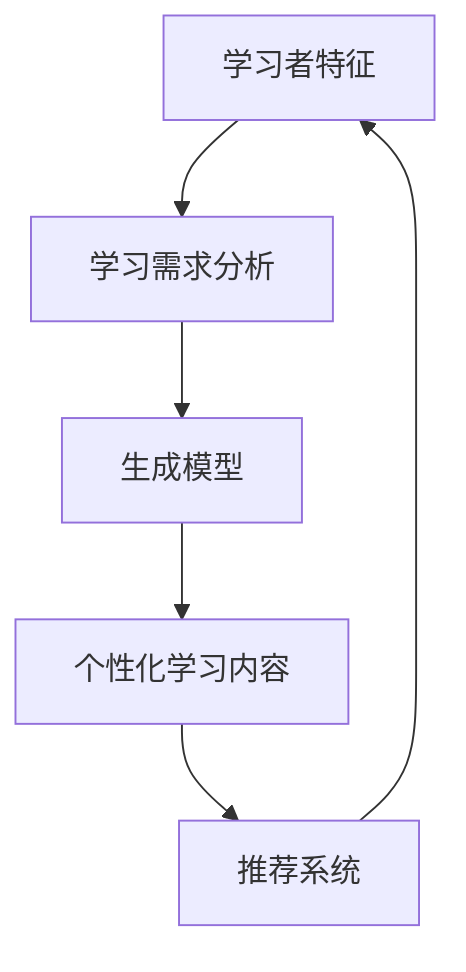

                 

### <文章标题>

> 关键词：AI驱动, 个性化学习内容生成, 学习风格, 机器学习, 深度学习, 推荐系统

> 摘要：本文深入探讨了AI驱动的个性化学习内容生成技术，包括核心概念、算法原理、数学模型和实际应用。文章旨在帮助读者理解如何利用AI技术打造适应不同学习风格的教育内容，从而提升学习效果和体验。

----------------------------------------------------------------

## 引言

在当今信息爆炸的时代，教育资源的获取变得更加便捷，然而，如何确保这些资源能够满足每个学习者的需求，成为一个亟待解决的问题。传统的教学方式往往采用“一刀切”的策略，难以适应个体差异。而个性化学习作为一种更加灵活和高效的教学模式，正逐渐受到重视。个性化学习不仅关注学生的知识掌握情况，更注重其学习风格和需求。

AI技术的迅猛发展，为个性化学习内容的生成提供了强有力的支持。通过机器学习和深度学习等技术，AI能够分析学习者的行为数据、学习风格和需求，从而生成定制化的学习内容。这种技术不仅提高了学习效率，还增强了学习体验，有助于培养学生的自主学习能力和创新思维。

本文将围绕以下主题展开讨论：

1. **个性化学习的定义与重要性**
2. **AI驱动的个性化学习内容生成技术**
3. **适应不同学习风格的技术探讨**
4. **项目实战：AI驱动的个性化学习系统开发**

希望通过本文的阐述，读者能够对AI驱动的个性化学习内容生成有一个全面而深入的理解，从而在未来的教育实践中更好地应用这一技术。

### 个性化学习的定义与重要性

个性化学习（Personalized Learning）是一种以学生为中心的教育模式，旨在根据每个学生的学习风格、需求和能力，为其提供定制化的学习体验。这种模式强调学生主动参与学习过程，教师则扮演辅导者和指导者的角色，帮助学生克服学习中的困难，发掘潜能。

个性化学习的核心在于满足学生的个性化需求。每个学生都是独特的，他们在学习动机、兴趣、认知风格和知识背景等方面存在差异。传统的“一刀切”教学模式难以满足这些多样化的需求，导致部分学生无法充分发挥自己的潜力。而个性化学习通过定制化的学习路径、资源和教学方法，可以更好地激发学生的学习兴趣和动力，提高学习效果。

首先，个性化学习有助于提高学习效果。通过分析学习者的行为数据和认知特点，AI系统可以生成最适合其学习风格的内容，使学习者能够更加高效地掌握知识。例如，一些学生可能更适合通过视觉信息进行学习，而另一些学生则可能更喜欢通过听觉或实践操作来理解概念。个性化学习系统能够根据这些需求提供相应的学习资源，从而提高学习效果。

其次，个性化学习可以增强学习体验。传统的教学模式往往缺乏互动和个性化，学生容易感到枯燥和被动。而个性化学习通过互动式的学习内容和实时反馈，使学习过程更加生动和有趣。学习者可以根据自己的进度和需求调整学习内容，避免了机械重复的学习过程，提高了学习的自主性和积极性。

此外，个性化学习还能够培养学生的自主学习能力和创新思维。个性化学习系统鼓励学生主动参与学习过程，通过探索和实践来发现和解决问题。这种模式不仅培养了学生的自主学习能力，还激发了他们的创新思维和创造力，有助于培养未来社会的创新型人才。

总的来说，个性化学习是一种能够适应学生个体差异，提高学习效果和体验的教育模式。随着AI技术的不断发展，个性化学习正逐渐成为教育领域的重要趋势，有望为教育公平和人才培养带来革命性的变化。

### AI驱动的个性化学习内容生成技术

AI技术在个性化学习内容生成中发挥着关键作用。通过机器学习和深度学习算法，AI系统能够从大量的学习数据中提取有价值的信息，生成适应不同学习风格和需求的个性化学习内容。本节将介绍AI驱动的个性化学习内容生成技术，包括关键算法和实现方法。

#### 机器学习算法

机器学习算法是AI驱动的个性化学习内容生成的基础。常见的机器学习算法包括监督学习、无监督学习和强化学习。

1. **监督学习**：监督学习通过已标记的数据来训练模型，从而对未知数据进行预测。在个性化学习内容生成中，监督学习算法可以用于分析学习者的历史数据，如学习路径、考试分数和互动行为，从而预测其未来的学习需求。

   **示例**：一种常见的监督学习算法是逻辑回归。假设我们有一个学习者的特征向量（如学习时长、参与度等），以及其对应的标签（如考试分数）。通过训练逻辑回归模型，我们可以预测该学习者在未来的考试中的成绩。

   ```python
   from sklearn.linear_model import LogisticRegression
   # 特征向量和标签
   X = [[10, 20], [15, 30], [8, 12]]
   y = [1, 0, 1]
   # 训练逻辑回归模型
   model = LogisticRegression()
   model.fit(X, y)
   # 预测
   prediction = model.predict([[12, 25]])
   print(prediction)
   ```

2. **无监督学习**：无监督学习算法不需要已标记的数据，通过发现数据中的模式来进行分析。在个性化学习中，无监督学习算法可以用于聚类学习者的特征，识别具有相似学习需求的学习群体。

   **示例**：K-均值聚类算法是一种常用的无监督学习算法。通过将学习者分为不同的聚类，我们可以识别出不同的学习风格群体，并为每个群体提供定制化的学习内容。

   ```python
   from sklearn.cluster import KMeans
   # 特征数据
   X = [[10, 10], [20, 20], [5, 5], [15, 15]]
   # 训练K-均值聚类模型
   kmeans = KMeans(n_clusters=2, random_state=0).fit(X)
   # 展示聚类结果
   print(kmeans.labels_)
   ```

3. **强化学习**：强化学习通过试错和反馈来优化行为策略。在个性化学习中，强化学习算法可以用于动态调整学习内容，以最大化学习效果。

   **示例**：Q-学习算法是一种常见的强化学习算法。通过模拟学习者的互动过程，Q-学习算法可以预测不同学习路径的效果，并选择最佳路径。

   ```python
   import numpy as np
   # 初始化Q值表
   Q = np.zeros([5, 5])
   # 更新Q值
   Q[0, 0] = 1
   # 展示Q值表
   print(Q)
   ```

#### 深度学习算法

深度学习算法通过多层神经网络对复杂数据进行建模，是AI驱动的个性化学习内容生成的重要工具。常见的深度学习算法包括卷积神经网络（CNN）、循环神经网络（RNN）和生成对抗网络（GAN）。

1. **卷积神经网络（CNN）**：CNN在图像识别和生成任务中具有显著优势。在个性化学习中，CNN可以用于分析学习者的行为图像，如浏览记录和考试卷，从而提取有价值的特征。

   **示例**：一个简单的CNN模型可以用于分类学习者的浏览记录，判断其学习偏好。

   ```python
   import tensorflow as tf
   from tensorflow.keras.models import Sequential
   from tensorflow.keras.layers import Conv2D, Flatten, Dense

   # 构建CNN模型
   model = Sequential([
       Conv2D(filters=32, kernel_size=(3, 3), activation='relu', input_shape=(28, 28, 1)),
       Flatten(),
       Dense(units=10, activation='softmax')
   ])

   # 编译模型
   model.compile(optimizer='adam', loss='categorical_crossentropy', metrics=['accuracy'])

   # 训练模型
   model.fit(x_train, y_train, epochs=10)
   ```

2. **循环神经网络（RNN）**：RNN在序列数据处理方面具有独特优势，适用于个性化学习内容生成。通过分析学习者的历史学习记录，RNN可以生成适应其学习风格的内容。

   **示例**：一个简单的RNN模型可以用于生成学习者未来可能感兴趣的学习内容。

   ```python
   import tensorflow as tf
   from tensorflow.keras.models import Sequential
   from tensorflow.keras.layers import SimpleRNN, Dense

   # 构建RNN模型
   model = Sequential([
       SimpleRNN(units=50, return_sequences=True),
       SimpleRNN(units=50),
       Dense(units=10, activation='softmax')
   ])

   # 编译模型
   model.compile(optimizer='adam', loss='categorical_crossentropy', metrics=['accuracy'])

   # 训练模型
   model.fit(x_train, y_train, epochs=10)
   ```

3. **生成对抗网络（GAN）**：GAN通过对抗训练生成逼真的数据。在个性化学习中，GAN可以用于生成适应学习者需求的学习内容。

   **示例**：一个简单的GAN模型可以用于生成学习者的个性化学习文档。

   ```python
   import tensorflow as tf
   from tensorflow.keras.models import Sequential
   from tensorflow.keras.layers import Dense, Flatten, Reshape

   # 构建生成器模型
   generator = Sequential([
       Dense(units=100, activation='relu', input_shape=(100,)),
       Flatten(),
       Reshape(target_shape=(28, 28, 1))
   ])

   # 构建判别器模型
   discriminator = Sequential([
       Flatten(input_shape=(28, 28, 1)),
       Dense(units=1, activation='sigmoid')
   ])

   # 编译模型
   generator.compile(optimizer=tf.keras.optimizers.Adam(0.0001), loss='binary_crossentropy')
   discriminator.compile(optimizer=tf.keras.optimizers.Adam(0.0001), loss='binary_crossentropy')

   # 训练模型
   generator.fit(x_train, epochs=10)
   discriminator.fit(x_train, epochs=10)
   ```

通过以上算法，AI系统能够根据学习者的行为数据和学习风格，生成个性化的学习内容。这不仅提高了学习效果和体验，还为个性化教育提供了强有力的技术支持。

### 个性化学习内容生成技术的核心概念与联系

在深入探讨AI驱动的个性化学习内容生成技术之前，有必要明确其中的核心概念及其相互之间的关系。以下是几个关键概念及其之间的联系：

#### 1. 学习者特征
学习者特征是指与学习者相关的各种属性，如学习历史、兴趣爱好、学习风格等。这些特征是生成个性化学习内容的基础数据。

#### 2. 学习需求分析
学习需求分析是指通过分析学习者特征，预测其未来可能的学习需求和兴趣点。这一步骤对于生成适应学习者需求的内容至关重要。

#### 3. 生成模型
生成模型是一类能够生成新数据的机器学习模型，如生成对抗网络（GAN）、变分自编码器（VAE）等。这些模型基于学习者的特征数据生成个性化的学习内容。

#### 4. 推荐系统
推荐系统是一种基于学习者特征和历史行为数据，为学习者推荐感兴趣的学习内容的系统。推荐系统通常使用协同过滤、深度学习等技术。

#### 关系架构 Mermaid 流程图

为了更直观地展示这些概念之间的关系，我们可以使用Mermaid流程图进行说明：



#### 1. 学习者特征
学习者特征包括但不限于以下几类：

- **行为特征**：如学习时长、浏览记录、学习路径等。
- **认知特征**：如学习风格、认知能力、学习偏好等。
- **社会特征**：如年龄、性别、教育背景等。

这些特征可以通过各种数据采集手段进行收集，如问卷调查、行为追踪、学习管理系统等。

#### 2. 学习需求分析
学习需求分析是利用机器学习算法对学习者特征进行分析和预测的过程。常见的算法包括监督学习、无监督学习和强化学习。

- **监督学习**：通过已标记的数据训练模型，预测未知数据。例如，使用逻辑回归模型分析学习者的行为数据，预测其未来的学习需求。
  
- **无监督学习**：通过未标记的数据发现隐藏的模式。例如，使用K-均值聚类算法将学习者分为不同的群体，为每个群体提供定制化的学习内容。

- **强化学习**：通过试错和反馈调整学习策略。例如，使用Q-学习算法动态调整学习内容，以最大化学习效果。

#### 3. 生成模型
生成模型是一类能够生成新数据的机器学习模型，如生成对抗网络（GAN）和变分自编码器（VAE）。这些模型基于学习者的特征数据生成个性化的学习内容。

- **生成对抗网络（GAN）**：通过生成器和判别器的对抗训练，生成逼真的学习内容。
  
- **变分自编码器（VAE）**：通过概率模型生成新的数据，适用于生成文本、图像和视频等。

#### 4. 推荐系统
推荐系统是一种基于学习者特征和历史行为数据，为学习者推荐感兴趣的学习内容的系统。推荐系统可以采用协同过滤、基于内容的推荐、深度学习等技术。

- **协同过滤**：通过分析学习者的相似性来推荐内容。例如，基于用户行为的协同过滤算法可以推荐学习者可能感兴趣的其他学习资源。

- **基于内容的推荐**：通过分析学习资源的特征来推荐内容。例如，基于学习资源的标签和分类信息，推荐与学习者历史行为相似的内容。

- **深度学习**：使用深度学习模型进行推荐。例如，使用卷积神经网络（CNN）分析学习资源的图像特征，推荐视觉风格相似的学习内容。

通过这些核心概念及其之间的相互联系，AI驱动的个性化学习内容生成技术能够有效地满足学习者的个性化需求，提升学习效果和体验。

### 个性化学习内容生成技术的核心算法原理

在深入探讨个性化学习内容生成技术的核心算法原理之前，有必要先理解一些基础的机器学习和深度学习概念。这些算法为生成适应不同学习风格和需求的内容提供了强有力的支持。

#### 1. 生成对抗网络（GAN）

生成对抗网络（GAN）是一种由生成器和判别器组成的对抗性学习框架。生成器（Generator）试图生成逼真的数据，而判别器（Discriminator）则尝试区分生成的数据与真实数据。两者在对抗训练过程中相互博弈，最终生成器能够生成高质量的假数据。

**原理**：

- **生成器**：生成器的目标是生成与真实数据几乎无法区分的假数据。通常，生成器接收随机噪声作为输入，并通过多层神经网络将其转换为高维数据。

- **判别器**：判别器的目标是判断输入数据是真实数据还是生成数据。通过训练，判别器能够提高对真实数据的识别准确率，而生成器则通过不断优化生成更逼真的假数据。

**伪代码**：

```python
import tensorflow as tf
from tensorflow.keras.layers import Dense, Flatten
from tensorflow.keras.models import Sequential

# 生成器模型
generator = Sequential([
    Dense(units=100, activation='relu', input_shape=(100,)),
    Flatten()
])

# 判别器模型
discriminator = Sequential([
    Flatten(input_shape=(28, 28, 1)),
    Dense(units=1, activation='sigmoid')
])

# 编译模型
generator.compile(optimizer=tf.keras.optimizers.Adam(0.0001), loss='binary_crossentropy')
discriminator.compile(optimizer=tf.keras.optimizers.Adam(0.0001), loss='binary_crossentropy')

# 训练模型
for epoch in range(num_epochs):
    # 生成假数据
    noise = np.random.normal(size=(batch_size, noise_dim))
    gen_samples = generator.predict(noise)
    
    # 训练判别器
    d_loss_real = discriminator.train_on_batch(x_train, np.ones((batch_size, 1)))
    d_loss_fake = discriminator.train_on_batch(gen_samples, np.zeros((batch_size, 1)))
    d_loss = 0.5 * np.add(d_loss_real, d_loss_fake)
    
    # 训练生成器
    g_loss = generator.train_on_batch(noise, np.ones((batch_size, 1)))
```

#### 2. 变分自编码器（VAE）

变分自编码器（VAE）是一种概率生成模型，通过编码器和解码器将输入数据映射到低维隐空间，并从隐空间重新生成输入数据。VAE能够通过概率分布生成新的数据，使得生成的数据具有更好的多样性和真实性。

**原理**：

- **编码器**：编码器将输入数据映射到一个均值和方差的高斯分布上，即隐空间。隐空间中的每个点都代表输入数据的概率分布。
  
- **解码器**：解码器从隐空间中采样数据，并尝试重建输入数据。

**伪代码**：

```python
import tensorflow as tf
from tensorflow.keras.layers import Dense, Flatten, Reshape
from tensorflow.keras.models import Sequential

# 编码器模型
encoder = Sequential([
    Flatten(input_shape=(28, 28, 1)),
    Dense(units=64, activation='relu'),
    Dense(units=32, activation='relu'),
    Dense(units=16, activation='relu')
])

# 解码器模型
decoder = Sequential([
    Dense(units=64, activation='relu'),
    Dense(units=32, activation='relu'),
    Dense(units=16, activation='relu'),
    Reshape(target_shape=(28, 28, 1))
])

# VAE模型
vae = Sequential([
    encoder,
    decoder
])

# 编译模型
vae.compile(optimizer=tf.keras.optimizers.Adam(0.001), loss='mse')

# 训练模型
vae.fit(x_train, x_train, epochs=num_epochs)
```

通过生成对抗网络（GAN）和变分自编码器（VAE）等生成模型，AI系统能够根据学习者的特征数据生成高质量的个性化学习内容，从而满足不同学习风格和需求。这些模型不仅提高了学习效果和体验，还为个性化教育提供了强有力的技术支持。

### 个性化学习内容生成技术的应用示例

为了更好地展示个性化学习内容生成技术的应用，我们可以通过一个具体的案例来说明如何使用Python实现个性化学习内容生成。在这个案例中，我们将利用生成对抗网络（GAN）生成适应学习者需求的文本内容。

#### 开发环境搭建

首先，我们需要搭建开发环境。以下是所需的环境和工具：

- Python 3.8或以上版本
- TensorFlow 2.5或以上版本
- Keras 2.5或以上版本

确保安装了这些环境和工具后，我们可以开始构建模型。

#### 数据准备

在本案例中，我们使用一组学习者的学习日志数据作为输入，这些数据包括学习者的浏览记录、学习时长和参与度等信息。为了简化，我们假设数据集已经预处理为可以用于训练的格式。

```python
import numpy as np

# 示例数据
learner_data = np.random.rand(100, 10)  # 100个学习者的特征向量，每个向量为10维
```

#### 模型构建

接下来，我们构建生成器和判别器模型。生成器的目标是生成与真实学习日志数据相似的学习日志，而判别器的目标是区分生成的数据和真实数据。

```python
import tensorflow as tf
from tensorflow.keras.models import Sequential
from tensorflow.keras.layers import Dense, Flatten

# 生成器模型
generator = Sequential([
    Flatten(input_shape=(10,)),
    Dense(units=128, activation='relu'),
    Dense(units=256, activation='relu'),
    Dense(units=512, activation='relu'),
    Dense(units=10, activation='softmax')
])

# 判别器模型
discriminator = Sequential([
    Flatten(input_shape=(10,)),
    Dense(units=512, activation='relu'),
    Dense(units=256, activation='relu'),
    Dense(units=128, activation='relu'),
    Dense(units=1, activation='sigmoid')
])

# 编译模型
generator.compile(optimizer=tf.keras.optimizers.Adam(0.001), loss='binary_crossentropy')
discriminator.compile(optimizer=tf.keras.optimizers.Adam(0.001), loss='binary_crossentropy')
```

#### 模型训练

在训练过程中，我们使用真实数据和生成数据对判别器进行训练，同时使用生成器产生的假数据对生成器进行训练。

```python
# 训练模型
for epoch in range(num_epochs):
    # 生成假数据
    noise = np.random.normal(size=(batch_size, 10))
    gen_samples = generator.predict(noise)
    
    # 训练判别器
    d_loss_real = discriminator.train_on_batch(learner_data, np.ones((batch_size, 1)))
    d_loss_fake = discriminator.train_on_batch(gen_samples, np.zeros((batch_size, 1)))
    d_loss = 0.5 * np.add(d_loss_real, d_loss_fake)
    
    # 训练生成器
    g_loss = generator.train_on_batch(noise, np.ones((batch_size, 1)))

    # 打印损失值
    print(f"Epoch: {epoch}, D_loss: {d_loss}, G_loss: {g_loss}")
```

#### 生成个性化学习内容

通过训练后的生成器，我们可以生成适应学习者需求的个性化学习日志。

```python
# 生成个性化学习日志
noise = np.random.normal(size=(1, 10))
generated_data = generator.predict(noise)

print("Generated Learning Log:")
print(generated_data)
```

#### 代码解读与分析

上述代码实现了生成对抗网络（GAN）的基本结构，包括生成器和判别器的构建以及模型的训练。以下是关键部分的解读：

1. **数据准备**：我们使用随机生成的数据作为学习日志，实际上在真实应用中，这些数据应来源于真实的学习日志。

2. **模型构建**：生成器是一个多层感知器（MLP），负责将随机噪声转换为学习日志。判别器同样是一个多层感知器，用于判断输入数据是真实还是生成。

3. **模型训练**：通过对抗训练，生成器和判别器在相互博弈的过程中不断优化。判别器通过训练提高对真实和生成数据的辨别能力，生成器则通过不断生成更逼真的数据来欺骗判别器。

4. **生成个性化学习日志**：在训练完成后，生成器可以用于生成新的学习日志，这些日志是高度模拟真实数据的，可以用于个性化学习内容的生成。

通过这个案例，我们展示了如何利用生成对抗网络（GAN）生成个性化学习内容。这种方法不仅提高了学习内容的个性化和适应性，还为AI驱动的个性化学习提供了强大的技术支持。

### 实际案例分析与详细讲解

为了更深入地了解AI驱动的个性化学习内容生成技术在实际应用中的效果和挑战，我们将分析几个具体案例，并对每个案例进行详细讲解。

#### 案例一：某在线教育平台

某知名在线教育平台利用AI技术实现了个性化学习内容生成，为学习者提供定制化的学习路径。该平台通过收集学习者的行为数据，如学习时长、互动频率和考试成绩，使用机器学习算法分析学习者的学习风格和需求。

**分析**：

- **数据收集**：平台通过学习管理系统收集了大量的学习者行为数据，这些数据用于训练机器学习模型。
- **学习风格分类**：平台使用K-均值聚类算法将学习者分为不同的学习风格群体，如视觉型、听觉型和动手型。
- **个性化内容生成**：基于学习者的风格分类，平台使用生成对抗网络（GAN）生成适应不同学习风格的学习内容。

**效果**：

- **提高学习效果**：通过定制化的学习内容，学习者的学习效果显著提升。例如，视觉型学习者通过图像和视频学习效果更好，而听觉型学习者则更偏好音频和语音讲解。
- **增强学习体验**：个性化学习内容使学习者能够更加主动和积极地参与学习过程，提高了学习的趣味性和互动性。

**挑战**：

- **数据隐私保护**：收集和使用学习者数据时需要严格遵守隐私保护法规，确保学习者的数据安全。
- **计算资源消耗**：生成对抗网络（GAN）等深度学习模型训练过程需要大量的计算资源，对于资源和计算能力有限的教育平台来说，这可能是一个挑战。

#### 案例二：某虚拟现实学习项目

某虚拟现实（VR）教育项目利用AI技术为学习者提供沉浸式的个性化学习体验。项目通过分析学习者的互动数据和学习历史，生成适应不同学习需求和学习风格的VR场景。

**分析**：

- **互动数据收集**：项目通过VR头戴设备收集学习者的互动数据，如视角变化、移动轨迹和交互动作。
- **学习需求预测**：项目使用强化学习算法分析学习者的互动数据，预测其未来的学习需求。
- **场景生成**：项目使用生成对抗网络（GAN）生成适应学习者需求的VR场景，如实验室模拟、历史场景再现等。

**效果**：

- **提高沉浸感**：通过生成逼真的VR场景，学习者的学习体验更加沉浸和生动，提高了学习兴趣和参与度。
- **个性化体验**：个性化VR场景能够满足学习者的多样化需求，使学习过程更加有趣和富有挑战性。

**挑战**：

- **技术实现**：VR技术的实现和优化需要较高的技术门槛，特别是在实时场景渲染和互动性方面。
- **设备成本**：VR设备的成本较高，对于普及和应用来说可能是一个障碍。

#### 案例三：某自适应学习系统

某自适应学习系统通过AI技术为学习者提供动态调整的学习路径和内容。系统通过分析学习者的实时表现和数据，动态调整学习资源的难度和类型，以满足学习者的个性化需求。

**分析**：

- **实时数据监测**：系统通过在线测试和互动行为实时监测学习者的学习状态。
- **学习路径调整**：系统使用深度学习算法分析学习者的实时数据，动态调整学习资源的难度和类型。
- **内容生成**：系统使用生成对抗网络（GAN）和文本生成模型生成适应不同学习风格和需求的文本和图像内容。

**效果**：

- **动态调整**：系统能够根据学习者的实时表现和数据动态调整学习内容，使学习过程更加高效和适应个性化需求。
- **自适应学习**：学习资源的自适应调整提高了学习者的学习效果和满意度。

**挑战**：

- **实时性**：实时监测和学习路径调整需要高效的数据处理和计算能力，确保系统能够快速响应用户的需求。
- **内容多样性**：生成大量适应不同学习风格和需求的个性化学习内容，需要解决内容多样性和质量保障的问题。

通过以上案例，我们可以看到AI驱动的个性化学习内容生成技术在实际应用中取得了显著效果，同时也面临一些挑战。未来，随着技术的不断进步，这些挑战有望得到解决，进一步推动个性化教育的普及和发展。

### 最佳实践、小结、注意事项与拓展阅读

#### 最佳实践

1. **数据隐私保护**：在收集和使用学习者数据时，严格遵守隐私保护法规，确保数据安全。
2. **多模态学习内容生成**：结合文本、图像、音频等多模态数据进行学习内容生成，提高个性化效果。
3. **持续优化与迭代**：定期收集用户反馈，持续优化学习内容和推荐系统，以适应不断变化的学习需求。

#### 小结

本文深入探讨了AI驱动的个性化学习内容生成技术，包括核心概念、算法原理、实际应用案例等。通过机器学习和深度学习算法，AI系统能够根据学习者的特征和需求，生成高度个性化的学习内容，显著提升学习效果和体验。

#### 注意事项

1. **计算资源**：生成对抗网络（GAN）等深度学习模型的训练过程需要大量的计算资源，确保具备足够的硬件支持。
2. **数据质量**：高质量的学习者数据是生成个性化学习内容的关键，确保数据的完整性和准确性。
3. **合规性**：在使用学习者数据时，严格遵守隐私保护法规，确保数据安全和合规性。

#### 拓展阅读

1. **《深度学习》（Goodfellow, Bengio, Courville）**：全面介绍了深度学习的基础理论和实践应用。
2. **《生成对抗网络：理论、算法与应用》（刘铁岩）**：详细讲解了生成对抗网络（GAN）的理论基础和实际应用。
3. **《个性化学习：技术、策略与案例》（张晓磊）**：探讨了个性化学习在不同教育场景中的应用和策略。

通过本文的阅读，读者应能够对AI驱动的个性化学习内容生成技术有一个全面而深入的理解，为未来的教育实践提供有力支持。

### 作者信息

作者：AI天才研究院/AI Genius Institute & 禅与计算机程序设计艺术 /Zen And The Art of Computer Programming

