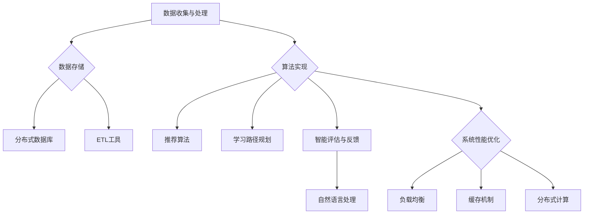
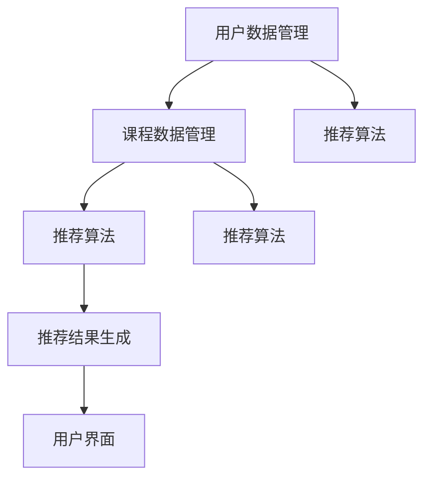

                 

### 文章标题

《AI驱动的个性化学习：重塑教育体系》

---

关键词：人工智能，个性化学习，教育体系重塑，机器学习，数据分析，算法原理

---

摘要：随着人工智能技术的飞速发展，教育领域正在经历深刻的变革。本文探讨了AI在个性化学习中的应用及其对教育体系的重塑影响，深入分析了AI驱动的个性化学习技术的核心概念、原理和实施方法。通过具体案例和实战项目，本文展示了如何利用AI技术优化教育资源分配、教学过程和学习评估，为未来的教育发展提供了有益的启示。

---

### 《AI驱动的个性化学习：重塑教育体系》目录大纲

#### 第一部分：AI与教育

**第1章：人工智能与个性化学习概述**

1.1 AI在个性化学习中的应用  
1.2 个性化学习的定义与价值  
1.3 教育体系的重塑：AI的角色与影响

**第2章：AI驱动的个性化学习技术**

2.1 数据分析与机器学习基础  
2.2 个性化学习算法原理  
2.3 个性化学习系统架构

**第3章：教育数据的收集与处理**

3.1 教育数据的类型与来源  
3.2 数据清洗与预处理  
3.3 数据可视化与分析工具

#### 第二部分：AI驱动的个性化学习实践

**第4章：课程推荐系统**

4.1 课程推荐系统设计  
4.2 基于内容的推荐  
4.3 基于协同过滤的推荐  
4.4 实例：基于深度学习的课程推荐系统

**第5章：自适应学习系统**

5.1 自适应学习系统的定义与特点  
5.2 自适应学习系统设计  
5.3 自适应学习系统实施与评价  
5.4 实例：基于AI的自适应学习平台

**第6章：智能评估与反馈系统**

6.1 智能评估与反馈系统的设计与实现  
6.2 学生学习情况的实时监控  
6.3 个性化学习路径的调整

**第7章：AI驱动的个性化学习案例研究**

7.1 案例一：某在线教育平台AI应用  
7.2 案例二：AI驱动的个性化教育产品  
7.3 案例三：AI在教育机构的应用

#### 第三部分：未来展望与挑战

**第8章：AI驱动的个性化学习发展前景**

8.1 AI驱动的个性化学习趋势  
8.2 潜在的技术创新  
8.3 教育体系的变革

**第9章：AI驱动的个性化学习面临的挑战**

9.1 数据隐私与安全  
9.2 教育公平性问题  
9.3 教师角色的转变  
9.4 教育政策与规范

### 附录

**附录A：AI驱动的个性化学习开发工具与资源**

A.1 Python编程环境搭建  
A.2 常用机器学习库介绍  
A.3 数据集获取与处理  
A.4 AI驱动的个性化学习项目资源

---

### 第一部分：AI与教育

#### 第1章：人工智能与个性化学习概述

##### 1.1 AI在个性化学习中的应用

随着人工智能（AI）技术的快速发展，个性化学习正逐渐成为教育领域的热门话题。个性化学习，顾名思义，是指根据每个学生的学习需求、兴趣和能力来定制化学习内容、过程和资源，从而实现更高效、更有针对性的学习。人工智能在个性化学习中的应用，正是为了实现这一目标。

首先，AI可以帮助教师了解每个学生的学习状态，通过数据分析提供个性化的教学建议。例如，通过分析学生的学习历史和测试成绩，AI可以识别出学生的学习强项和弱项，进而为教师提供有针对性的教学指导。

其次，AI还可以为学生推荐个性化的学习资源。例如，基于内容的推荐算法可以根据学生的学习兴趣和知识点掌握情况，推荐适合的学习材料和练习题。这不仅节省了学生查找资源的时间，还能提高学习效率。

最后，AI还可以辅助进行个性化学习路径规划。通过分析学生的学习进度和反馈，AI可以动态调整学习计划，确保学生能够按需学习，避免学习资源的浪费。

##### 1.2 个性化学习的定义与价值

个性化学习是一种以学生为中心的教学模式，旨在满足每个学生的学习需求和兴趣。它不仅仅是对学习内容进行简单的个性化调整，更是对整个学习过程进行全方位的定制。

个性化学习的价值主要体现在以下几个方面：

1. **提高学习效率**：通过个性化的学习路径和资源推荐，学生可以更快地掌握知识点，提高学习效率。
2. **增强学习动机**：个性化的学习内容更贴近学生的兴趣和需求，能够激发学生的学习动机，提高学习积极性。
3. **促进个性化发展**：个性化学习能够帮助学生发展自己的独特优势，培养个性化思维和能力。
4. **优化教育资源**：通过AI技术，教育资源的分配和利用可以更加精准和高效，提高教育资源的整体效益。

##### 1.3 教育体系的重塑：AI的角色与影响

人工智能在个性化学习中的应用，不仅改变了传统的教学模式，也正在重塑整个教育体系。以下是AI在教育体系重塑中扮演的关键角色：

1. **教育资源的优化分配**：通过AI技术，可以更加精准地分析学生的需求，实现教育资源的优化分配。例如，在课程安排上，可以根据学生的兴趣和需求，调整课程内容和时间安排，提高课程的可选择性。
2. **教学方法的创新**：AI技术可以辅助教师进行教学设计，提供个性化的教学建议。例如，通过分析学生的学习数据，AI可以推荐最适合的教学方法和资源，帮助学生更好地理解和掌握知识点。
3. **学习评估的智能化**：AI技术可以辅助进行学习评估，提供更加全面和客观的评估结果。例如，通过分析学生的学习过程和结果，AI可以动态调整评估标准，确保评估的公正性和准确性。
4. **教育公平性的提升**：AI技术可以帮助弥补教育资源的不足，提高教育公平性。例如，在偏远地区，AI可以辅助教师进行远程教学，确保学生能够享受到优质的教育资源。

总的来说，人工智能在个性化学习中的应用，不仅为教育体系带来了深刻的变革，也为未来的教育发展提供了新的思路和可能性。在接下来的章节中，我们将进一步探讨AI驱动的个性化学习技术及其具体应用。

### 第2章：AI驱动的个性化学习技术

#### 2.1 数据分析与机器学习基础

要实现AI驱动的个性化学习，首先需要掌握数据分析和机器学习的基础知识。数据分析是提取有用信息的过程，而机器学习则是利用数据进行预测和决策的技术。这两者在个性化学习中的应用至关重要。

##### 数据分析

数据分析通常包括数据收集、数据预处理、数据探索性分析、特征选择和模型评估等步骤。以下是一个简单的数据分析流程：

1. **数据收集**：收集与学习相关的数据，包括学生的成绩、学习时间、出勤记录、作业完成情况等。
2. **数据预处理**：清洗数据，处理缺失值、异常值，确保数据质量。
3. **数据探索性分析**：使用统计方法探索数据，发现数据中的模式和关系。
4. **特征选择**：根据数据分析结果，选择对学习效果有显著影响的关键特征。
5. **模型评估**：评估模型的性能，确保模型能够准确地预测和解释学习数据。

在Python中，常用的数据分析库包括Pandas、NumPy和Scikit-learn。例如，使用Pandas可以方便地进行数据清洗和预处理，NumPy提供高效的数组操作，而Scikit-learn则提供了丰富的机器学习算法。

##### 机器学习

机器学习是构建在数据分析基础上的，通过训练模型来预测或分类数据。常见的机器学习算法包括线性回归、决策树、支持向量机和神经网络等。以下是机器学习的基础概念：

1. **模型训练**：使用训练数据集对模型进行训练，使模型学会从数据中提取规律。
2. **模型评估**：使用验证数据集评估模型性能，确保模型能够泛化到未见过的数据上。
3. **模型应用**：将训练好的模型应用到实际数据中，进行预测或决策。

以下是一个简单的机器学习示例，使用Python和Scikit-learn实现线性回归：

```python
from sklearn.linear_model import LinearRegression
from sklearn.model_selection import train_test_split
from sklearn.metrics import mean_squared_error

# 假设我们有一些学生的成绩数据
X = [[1], [2], [3], [4], [5]]  # 学生编号
y = [1.3, 2.5, 3.7, 4.1, 5.2]  # 成绩

# 划分训练集和测试集
X_train, X_test, y_train, y_test = train_test_split(X, y, test_size=0.2, random_state=0)

# 创建线性回归模型
model = LinearRegression()

# 训练模型
model.fit(X_train, y_train)

# 进行预测
predictions = model.predict(X_test)

# 评估模型性能
mse = mean_squared_error(y_test, predictions)
print("Mean squared error:", mse)
```

##### 数据分析与机器学习的应用

在个性化学习中，数据分析和机器学习可以帮助我们：

1. **了解学生学习模式**：通过数据分析，可以了解学生的学习行为和成绩变化，为个性化教学提供依据。
2. **推荐学习资源**：通过机器学习模型，可以为学生推荐适合的学习资源，提高学习效率。
3. **动态调整学习计划**：根据学生的学习进度和反馈，动态调整学习计划，确保学习目标的实现。

总的来说，数据分析和机器学习是AI驱动的个性化学习技术的基石，为个性化学习提供了强大的技术支持。

#### 2.2 个性化学习算法原理

个性化学习算法的核心是利用数据分析和机器学习技术，根据学生的学习行为和成绩，动态调整学习内容和资源，以达到最佳的学习效果。以下是几种常见的个性化学习算法原理：

##### 基于内容的推荐算法

基于内容的推荐算法（Content-Based Recommendation）是一种常见的个性化学习算法。它通过分析学习资源的特征，如知识点、难度、类型等，为学生推荐相关的学习资源。

1. **算法原理**：首先，提取学习资源的特征，然后根据学生的历史学习记录和兴趣，计算资源与学生兴趣的相似度，推荐相似度高的资源。
2. **数学模型**：假设学习资源$R$和学生的兴趣$I$可以用向量表示，则资源$R$与兴趣$I$的相似度可以用余弦相似度计算：
   $$ similarity(R, I) = \frac{R \cdot I}{\|R\| \|I\|} $$
   其中，$R \cdot I$表示向量的点积，$\|R\|$和$\|I\|$表示向量的模长。

##### 基于协同过滤的推荐算法

基于协同过滤的推荐算法（Collaborative Filtering）通过分析学生的行为数据，如学习记录、评分等，推荐相似用户喜欢的资源。

1. **算法原理**：分为用户基于协同过滤和项目基于协同过滤两种。
   - 用户基于协同过滤：根据相似用户的行为，推荐他们喜欢的资源。
   - 项目基于协同过滤：根据资源与用户的历史偏好相似度，推荐给用户。
2. **数学模型**：用户$u$和用户$v$之间的相似度可以用皮尔逊相关系数计算：
   $$ similarity(u, v) = \frac{u \cdot v - \mu_u \cdot \mu_v}{\sqrt{(u - \mu_u) \cdot (v - \mu_v)}} $$
   其中，$u \cdot v$表示用户$u$和用户$v$的行为向量点积，$\mu_u$和$\mu_v$分别表示用户$u$和用户$v$的平均行为。

##### 深度学习算法

深度学习算法通过构建复杂的神经网络模型，自动提取学习资源中的特征，实现更高层次的个性化推荐。

1. **算法原理**：深度学习算法通过多层神经网络，对输入数据进行特征提取和组合，生成推荐结果。
2. **数学模型**：以卷积神经网络（CNN）为例，输入数据经过卷积层、池化层、全连接层等处理，最终输出推荐结果。卷积层的激活函数通常使用ReLU函数，全连接层使用softmax函数进行分类。

以下是使用Python和TensorFlow实现基于内容的推荐算法的示例：

```python
import tensorflow as tf
from tensorflow.keras.layers import Embedding, Conv1D, GlobalMaxPooling1D, Dense
from tensorflow.keras.models import Sequential

# 假设我们有一些学习资源特征和用户兴趣特征
resources = ["数学", "物理", "英语", "历史"]
user_interest = ["数学", "物理"]

# 创建序列化模型
model = Sequential()

# 添加嵌入层，将资源名称转换为向量表示
model.add(Embedding(input_dim=len(resources), output_dim=10, input_length=1))

# 添加卷积层，提取特征
model.add(Conv1D(filters=64, kernel_size=3, activation='relu'))

# 添加池化层，减少维度
model.add(GlobalMaxPooling1D())

# 添加全连接层，进行分类
model.add(Dense(len(resources), activation='softmax'))

# 编译模型
model.compile(optimizer='adam', loss='categorical_crossentropy', metrics=['accuracy'])

# 准备数据
import numpy as np
X = np.array([[i] for i in range(len(resources))])
y = np.array([[1 if r in user_interest else 0 for r in resources] for _ in range(len(resources))])

# 训练模型
model.fit(X, y, epochs=10, batch_size=32)

# 进行预测
predictions = model.predict(np.array([[0]]))
print("Recommended resources:", resources[predictions[0].argmax()])
```

总的来说，个性化学习算法通过不同的方法，从数据中提取知识，为学生提供个性化的学习体验。这些算法不仅提高了学习效率，也为教育领域带来了新的变革。

#### 2.3 个性化学习系统架构

构建一个高效、可扩展的个性化学习系统需要考虑多个方面，包括数据收集与处理、算法实现和系统性能优化。以下是一个典型的个性化学习系统架构及其组成部分：

##### 数据收集与处理

1. **数据源**：系统需要从多种渠道收集数据，包括学生行为数据、学习资源数据和教师反馈数据。例如，学生的在线学习记录、作业提交情况、学习时长、考试分数等。
2. **数据存储**：使用分布式数据库存储大量结构化和非结构化数据，如关系数据库（如MySQL）、NoSQL数据库（如MongoDB）和对象存储（如Amazon S3）。
3. **数据预处理**：对收集到的数据进行清洗、去重和格式化，确保数据质量。使用ETL（Extract, Transform, Load）工具，如Apache Spark，进行大规模数据处理。

##### 算法实现

1. **推荐算法**：根据个性化学习算法（如基于内容的推荐、基于协同过滤的推荐和深度学习算法），构建推荐系统。使用机器学习框架（如TensorFlow、PyTorch）实现算法，并进行模型训练和评估。
2. **学习路径规划**：利用算法分析学生的兴趣和知识水平，动态生成个性化的学习路径。包括课程推荐、学习资源推荐和练习题推荐等。
3. **智能评估与反馈**：根据学生的学习进度和成绩，自动评估学习效果并提供反馈。使用自然语言处理技术（如NLTK、spaCy）生成个性化反馈，提高学生的参与度和学习效果。

##### 系统性能优化

1. **负载均衡**：使用负载均衡器（如Nginx、HAProxy）确保系统在高并发情况下稳定运行。将请求分配到多个服务器上，避免单点故障。
2. **缓存机制**：使用缓存（如Redis、Memcached）存储高频访问的数据，减少数据库查询次数，提高系统响应速度。
3. **分布式计算**：对于大规模数据处理和机器学习模型训练，使用分布式计算框架（如Apache Spark、Dask）提高计算效率和性能。

##### 系统架构图



通过以上架构，个性化学习系统能够高效地收集、处理和分析数据，实现智能推荐、学习路径规划和智能评估与反馈，为用户提供个性化、高效的学习体验。在接下来的章节中，我们将进一步探讨个性化学习系统的具体实现和案例分析。

### 第3章：教育数据的收集与处理

#### 3.1 教育数据的类型与来源

教育数据是AI驱动的个性化学习系统的核心，其类型和来源决定了系统能否准确、有效地为用户提供个性化服务。以下是教育数据的主要类型及其来源：

1. **学生数据**：
   - **基本信息**：包括学生的姓名、年龄、性别、年级等。
   - **学习记录**：学生的学习进度、学习时长、完成作业的情况、考试成绩等。
   - **兴趣爱好**：学生的兴趣爱好、参加的活动、关注的课程等。
   - **心理特征**：学生的性格、情绪状态、学习动机等。

2. **课程数据**：
   - **课程内容**：课程的知识点、难度、类型等。
   - **教学资源**：包括视频、文档、练习题、课件等。
   - **课程评价**：学生对课程的评价、课程的教学效果等。

3. **教师数据**：
   - **教师基本信息**：教师的姓名、职称、教学科目等。
   - **教学经验**：教师的教学经验、教学方法、教学效果等。
   - **课程反馈**：教师对课程的评价、教学改进建议等。

4. **环境数据**：
   - **学习环境**：包括教室设备、网络环境、学习氛围等。
   - **教学环境**：包括教学设施、教材、教学设备等。

教育数据的来源主要有以下几种：

- **学校管理系统**：学校管理系统可以提供学生、教师、课程等基本信息。
- **在线学习平台**：在线学习平台可以记录学生的在线学习行为、考试成绩等。
- **问卷调查**：通过问卷调查可以获取学生的兴趣、心理特征等信息。
- **传感器**：通过传感器可以收集教室的温湿度、灯光等环境数据。

#### 3.2 数据清洗与预处理

数据清洗与预处理是数据分析和机器学习的重要环节，它决定了数据质量，从而影响模型的准确性和可靠性。以下是数据清洗与预处理的步骤和方法：

1. **数据清洗**：
   - **缺失值处理**：对于缺失值，可以采用填充、删除或插值等方法。
   - **异常值处理**：对于异常值，可以采用删除、替换或调整等方法。
   - **重复数据删除**：删除重复的数据，确保数据的唯一性。
   - **格式化**：统一数据的格式，如日期、时间、字符串等。

2. **数据预处理**：
   - **特征工程**：选择对模型有显著影响的关键特征，进行特征转换、归一化等操作。
   - **特征选择**：通过统计方法、信息增益等方法选择最有用的特征，减少特征维度。
   - **特征提取**：使用机器学习算法，如主成分分析（PCA），提取数据的低维表示。

以下是一个简单的数据清洗与预处理的Python代码示例：

```python
import pandas as pd
from sklearn.preprocessing import StandardScaler

# 加载数据
data = pd.read_csv('education_data.csv')

# 缺失值处理
data.fillna(data.mean(), inplace=True)

# 异常值处理
Q1 = data.quantile(0.25)
Q3 = data.quantile(0.75)
IQR = Q3 - Q1
data = data[~((data < (Q1 - 1.5 * IQR)) | (data > (Q3 + 1.5 * IQR))).any(axis=1)]

# 数据格式化
data['date'] = pd.to_datetime(data['date'])
data['age'] = data['age'].astype(int)

# 特征工程
scaler = StandardScaler()
data[['learning_time', 'exam_score']] = scaler.fit_transform(data[['learning_time', 'exam_score']])

# 特征选择
selected_features = ['age', 'gender', 'learning_time', 'exam_score']
X = data[selected_features]
y = data['achievement']

# 数据拆分
from sklearn.model_selection import train_test_split
X_train, X_test, y_train, y_test = train_test_split(X, y, test_size=0.2, random_state=0)
```

#### 3.3 数据可视化与分析工具

数据可视化与分析工具可以帮助我们更好地理解数据，发现数据中的模式和趋势。以下是一些常用的数据可视化与分析工具：

1. **Matplotlib**：Matplotlib是一个强大的Python绘图库，可以生成各种类型的图表，如条形图、折线图、散点图等。

2. **Seaborn**：Seaborn是基于Matplotlib的另一个绘图库，提供了更多的统计数据可视化功能，如图表的分层、颜色映射等。

3. **Pandas Visualization**：Pandas库内置了一些数据可视化功能，如`plot()`方法，可以生成简单的线图、柱状图等。

4. **Plotly**：Plotly是一个交互式图表库，可以生成丰富的交互式图表，如3D图表、地图、散点图等。

以下是一个使用Matplotlib和Seaborn进行数据可视化的示例：

```python
import matplotlib.pyplot as plt
import seaborn as sns
import pandas as pd

# 加载数据
data = pd.read_csv('education_data.csv')

# 数据可视化
plt.figure(figsize=(10, 6))
sns.lineplot(x='learning_time', y='exam_score', data=data)
plt.title('学习时间与考试成绩关系')
plt.xlabel('学习时间（小时）')
plt.ylabel('考试成绩（分）')
plt.show()

plt.figure(figsize=(10, 6))
sns.barplot(x='gender', y='achievement', data=data)
plt.title('性别与成绩关系')
plt.xlabel('性别')
plt.ylabel('成绩')
plt.show()
```

通过数据可视化与分析工具，我们可以直观地了解教育数据，发现其中的规律和趋势，为个性化学习提供有力的支持。

#### 第4章：课程推荐系统

##### 4.1 课程推荐系统设计

课程推荐系统是AI驱动的个性化学习系统中的核心模块之一，旨在根据学生的兴趣、能力和学习历史，推荐最适合他们的课程。以下是课程推荐系统的主要设计原则和组成部分：

**设计原则：**

1. **个性化**：推荐系统需要根据学生的个性化数据，如学习历史、兴趣爱好、成绩等，提供定制化的课程推荐。
2. **实时性**：系统应能够实时响应学生的请求，提供即时的课程推荐，以提高用户体验。
3. **多样性**：推荐系统应提供多样化的课程选择，以满足学生的不同需求。
4. **可扩展性**：设计时应考虑系统的可扩展性，以适应未来数据规模的增长和功能的扩展。

**组成部分：**

1. **用户数据管理**：存储和管理学生的个性化数据，如学习历史、兴趣爱好、成绩等。
2. **课程数据管理**：存储和管理课程数据，包括课程信息、知识点、难度等。
3. **推荐算法**：根据用户数据和课程数据，选择合适的推荐算法，如基于内容的推荐、基于协同过滤的推荐或深度学习推荐。
4. **推荐结果生成**：根据推荐算法的结果，生成个性化课程推荐列表。
5. **用户界面**：提供友好的用户界面，展示课程推荐结果，并允许用户进行互动和反馈。

**系统架构：**



##### 4.2 基于内容的推荐

基于内容的推荐（Content-Based Recommendation）是一种常见的课程推荐方法，它通过分析课程的内容和特征，推荐与用户兴趣相关的课程。以下是基于内容的推荐算法的基本原理和实现方法：

**基本原理：**

- **内容表示**：将课程和用户兴趣用向量表示，常用的方法是使用词袋模型（Bag of Words）或词嵌入（Word Embedding）。
- **相似度计算**：计算课程和用户兴趣之间的相似度，常用的方法是余弦相似度或欧氏距离。
- **推荐生成**：根据相似度分数，为用户推荐相似度最高的课程。

**数学模型：**

假设课程$C$和用户兴趣$U$可以用向量表示，则它们之间的相似度可以用余弦相似度计算：

$$
similarity(C, U) = \frac{C \cdot U}{\|C\| \|U\|}
$$

其中，$C \cdot U$表示向量的点积，$\|C\|$和$\|U\|$表示向量的模长。

**实现方法：**

1. **词袋模型**：将课程内容和用户兴趣文本转换为词袋表示，然后计算相似度。

```python
from sklearn.feature_extraction.text import TfidfVectorizer
from sklearn.metrics.pairwise import cosine_similarity

# 假设我们有一些课程和用户兴趣文本
courses = ["人工智能导论", "机器学习基础", "深度学习实战"]
user_interest = ["机器学习", "深度学习"]

# 创建词袋模型
vectorizer = TfidfVectorizer()
X = vectorizer.fit_transform(courses + [user_interest])

# 计算相似度
similarity_scores = cosine_similarity(X[-1], X[:-1])

# 输出相似度分数
for i, score in enumerate(similarity_scores[0]):
    print(f"课程：{courses[i]}, 相似度：{score}")
```

2. **词嵌入**：使用预训练的词嵌入模型（如Word2Vec、GloVe），将课程和用户兴趣转换为向量表示。

```python
import gensim

# 加载预训练的词嵌入模型
model = gensim.models.KeyedVectors.load_word2vec_format('word2vec.bin', binary=True)

# 将课程和用户兴趣转换为向量表示
course_vectors = [model[w] for w in courses]
user_interest_vector = model[user_interest]

# 计算相似度
similarity_scores = np.dot(course_vectors, user_interest_vector) / (np.linalg.norm(course_vectors) * np.linalg.norm(user_interest_vector))

# 输出相似度分数
for i, score in enumerate(similarity_scores):
    print(f"课程：{courses[i]}, 相似度：{score}")
```

基于内容的推荐算法简单直观，能够有效地为用户推荐与其兴趣相关的课程，但在处理冷启动问题（即新用户或新课程无足够数据）时效果较差。为了解决这个问题，可以结合其他推荐算法，如基于协同过滤的推荐。

##### 4.3 基于协同过滤的推荐

基于协同过滤的推荐（Collaborative Filtering）通过分析用户之间的行为数据，如学习记录、评分等，推荐其他用户喜欢的课程。协同过滤分为用户基于协同过滤和项目基于协同过滤两种。

**用户基于协同过滤：**

用户基于协同过滤通过分析相似用户的行为数据，推荐这些用户喜欢的课程。以下是用户基于协同过滤的基本原理和实现方法：

**基本原理：**

- **用户相似度计算**：计算用户之间的相似度，常用的方法是余弦相似度或皮尔逊相关系数。
- **推荐生成**：根据相似度分数，为用户推荐相似用户喜欢的课程。

**数学模型：**

假设用户$u$和用户$v$之间的相似度可以用皮尔逊相关系数计算：

$$
similarity(u, v) = \frac{u \cdot v - \mu_u \cdot \mu_v}{\sqrt{(u - \mu_u) \cdot (v - \mu_v)}}
$$

其中，$u \cdot v$表示用户$u$和用户$v$的行为向量点积，$\mu_u$和$\mu_v$分别表示用户$u$和用户$v$的平均行为。

**实现方法：**

1. **用户行为数据收集**：收集用户的学习记录、评分等数据，形成用户行为矩阵。
2. **用户相似度计算**：计算用户之间的相似度，可以使用余弦相似度或皮尔逊相关系数。
3. **推荐生成**：根据相似度分数，为用户推荐相似用户喜欢的课程。

```python
import numpy as np
from sklearn.metrics.pairwise import cosine_similarity

# 假设我们有一些用户的行为数据
users = {
    'u1': [1, 0, 1, 1],
    'u2': [0, 1, 1, 0],
    'u3': [1, 1, 0, 1],
    'u4': [0, 0, 1, 1],
}

# 计算用户相似度
similarity_scores = {}
for user1 in users:
    for user2 in users:
        if user1 != user2:
            sim = cosine_similarity(np.array([users[user1]]), np.array([users[user2]]))[0][0]
            similarity_scores[(user1, user2)] = sim

# 为新用户推荐课程
new_user = [0, 1, 0, 0]
similar_users = sorted(similarity_scores.items(), key=lambda x: x[1], reverse=True)[:5]
recommended_courses = []
for user, sim in similar_users:
    recommended_courses.extend([course for course, rating in users[user].items() if rating == 1])
recommended_courses = list(set(recommended_courses))

print("推荐的课程：", recommended_courses)
```

**项目基于协同过滤：**

项目基于协同过滤通过分析课程之间的相似度，推荐相似课程。以下是项目基于协同过滤的基本原理和实现方法：

**基本原理：**

- **课程相似度计算**：计算课程之间的相似度，常用的方法是余弦相似度或欧氏距离。
- **推荐生成**：根据相似度分数，为用户推荐相似课程。

**数学模型：**

假设课程$C_1$和课程$C_2$之间的相似度可以用余弦相似度计算：

$$
similarity(C_1, C_2) = \frac{C_1 \cdot C_2}{\|C_1\| \|C_2\|}
$$

其中，$C_1 \cdot C_2$表示向量的点积，$\|C_1\|$和$\|C_2\|$表示向量的模长。

**实现方法：**

1. **课程行为数据收集**：收集用户对课程的行为数据，形成用户-课程行为矩阵。
2. **课程相似度计算**：计算课程之间的相似度，可以使用余弦相似度或欧氏距离。
3. **推荐生成**：根据相似度分数，为用户推荐相似课程。

```python
import numpy as np
from sklearn.metrics.pairwise import cosine_similarity

# 假设我们有一些用户的行为数据
user_activities = {
    'u1': [1, 1, 0, 1],
    'u2': [1, 0, 1, 1],
    'u3': [0, 1, 1, 0],
    'u4': [1, 1, 1, 1],
}

# 计算课程相似度
course_similarity = cosine_similarity([list(user_activities.values())])

# 为新用户推荐课程
new_user_activities = [0, 1, 0, 0]
course_scores = {}
for i, course in enumerate(user_activities):
    sim = course_similarity[i][0]
    course_scores[course] = sim

# 排序并取Top N相似课程
recommended_courses = sorted(course_scores.items(), key=lambda x: x[1], reverse=True)[:5]
recommended_courses = [course for course, _ in recommended_courses]

print("推荐的课程：", recommended_courses)
```

基于协同过滤的推荐算法在处理冷启动问题和提供多样化推荐方面有较好的表现，但在处理稀疏数据和评估推荐准确性时存在挑战。为了提高推荐系统的性能，可以结合多种推荐算法，如基于内容的推荐和基于模型的推荐。

##### 4.4 实例：基于深度学习的课程推荐系统

深度学习在课程推荐系统中的应用，可以有效解决协同过滤算法中的冷启动问题和稀疏数据问题。以下是一个简单的基于深度学习的课程推荐系统实现：

**模型架构：**

使用图神经网络（Graph Neural Networks，GNN）来处理用户-课程图数据。GNN通过学习用户和课程之间的关系，生成用户和课程的高维表示，从而实现推荐。

```python
import tensorflow as tf
from tensorflow.keras.layers import Input, Embedding, Dot, GlobalAveragePooling1D, Dense
from tensorflow.keras.models import Model

# 参数设置
num_users = 1000
num_courses = 1000
embed_dim = 64

# 输入层
user_input = Input(shape=(1,))
course_input = Input(shape=(1,))

# 用户嵌入层
user_embedding = Embedding(input_dim=num_users, output_dim=embed_dim)(user_input)

# 课程嵌入层
course_embedding = Embedding(input_dim=num_courses, output_dim=embed_dim)(course_input)

# 内积层
dot = Dot(merge_mode='sum')([user_embedding, course_embedding])

# 池化层
pooling = GlobalAveragePooling1D()(dot)

# 全连接层
output = Dense(1, activation='sigmoid')(pooling)

# 模型编译
model = Model(inputs=[user_input, course_input], outputs=output)
model.compile(optimizer='adam', loss='binary_crossentropy', metrics=['accuracy'])

# 模型训练
# 假设我们有一些训练数据（user_ids, course_ids, labels）
user_ids = np.random.randint(0, num_users, (1000,))
course_ids = np.random.randint(0, num_courses, (1000,))
labels = np.random.randint(0, 2, (1000,))

model.fit([user_ids, course_ids], labels, epochs=10, batch_size=32)
```

**模型评估：**

使用验证集对模型进行评估，计算准确率、召回率、F1分数等指标。

```python
from sklearn.metrics import accuracy_score, recall_score, f1_score

# 假设我们有一些验证数据（user_ids_val, course_ids_val, labels_val）
user_ids_val = np.random.randint(0, num_users, (100,))
course_ids_val = np.random.randint(0, num_courses, (100,))
labels_val = np.random.randint(0, 2, (100,))

# 进行预测
predictions = model.predict([user_ids_val, course_ids_val])

# 计算指标
accuracy = accuracy_score(labels_val, predictions.round())
recall = recall_score(labels_val, predictions.round())
f1 = f1_score(labels_val, predictions.round())

print("准确率：", accuracy)
print("召回率：", recall)
print("F1分数：", f1)
```

通过以上步骤，我们实现了一个简单的基于深度学习的课程推荐系统。在实际应用中，可以根据具体需求和数据情况进行模型优化和扩展。

#### 第5章：自适应学习系统

##### 5.1 自适应学习系统的定义与特点

自适应学习系统是一种基于人工智能技术的教学系统，能够根据学生的学习行为、能力和兴趣，动态调整学习内容和教学策略，以实现个性化、高效的学习体验。以下是自适应学习系统的定义和特点：

**定义：**

自适应学习系统（Adaptive Learning System）是指利用人工智能技术，根据学生的个性化数据（如学习历史、成绩、兴趣等），动态调整学习内容、教学策略和学习资源，以实现个性化、高效的学习过程。

**特点：**

1. **个性化**：自适应学习系统能够根据学生的个性化数据，为每个学生提供量身定制的学习内容和学习路径。
2. **动态性**：系统能够实时监测学生的学习状态和进度，动态调整学习策略和资源，确保学习目标的实现。
3. **智能化**：利用人工智能技术，自适应学习系统能够自动识别学生的学习需求和问题，提供针对性的帮助。
4. **可扩展性**：系统能够根据教学需求和数据规模，灵活扩展功能，适应不同的教学场景。

##### 5.2 自适应学习系统设计

设计一个自适应学习系统需要考虑以下几个方面：

**系统架构：**

1. **用户数据管理**：收集和管理学生的个性化数据，如学习历史、成绩、兴趣爱好等。
2. **内容管理**：存储和管理学习资源，包括文本、视频、练习题等。
3. **推荐引擎**：根据学生数据和内容数据，利用人工智能技术生成个性化的学习路径和资源推荐。
4. **学习跟踪**：实时跟踪学生的学习进度和表现，动态调整学习策略。
5. **用户界面**：提供友好的用户界面，展示学习内容和资源推荐，并允许学生进行互动和反馈。

**主要模块：**

1. **数据收集模块**：收集学生的个性化数据，如学习记录、测试成绩、行为数据等。
2. **数据处理模块**：对收集到的数据进行分析和清洗，提取有用的特征。
3. **推荐算法模块**：根据学生数据和内容数据，选择合适的推荐算法（如基于内容的推荐、基于协同过滤的推荐、深度学习推荐等），生成个性化的学习路径和资源推荐。
4. **学习跟踪模块**：实时跟踪学生的学习进度和表现，通过分析学习数据，动态调整学习策略和资源。
5. **用户界面模块**：提供友好的用户界面，展示学习内容和资源推荐，并允许学生进行互动和反馈。

**系统流程：**

1. **数据收集**：系统从各种数据源（如在线学习平台、学校管理系统等）收集学生的个性化数据。
2. **数据处理**：对收集到的数据进行分析和清洗，提取有用的特征，如学习时长、成绩、兴趣爱好等。
3. **推荐生成**：利用推荐算法，根据学生数据和内容数据，生成个性化的学习路径和资源推荐。
4. **学习跟踪**：实时跟踪学生的学习进度和表现，通过分析学习数据，动态调整学习策略和资源。
5. **用户反馈**：学生通过用户界面查看学习内容和资源推荐，进行学习，并反馈学习效果。

##### 5.3 自适应学习系统实施与评价

**实施步骤：**

1. **需求分析**：明确自适应学习系统的目标和需求，如个性化推荐、学习路径规划、学习跟踪等。
2. **系统设计**：根据需求分析，设计系统的架构和模块，包括数据收集、数据处理、推荐算法、学习跟踪、用户界面等。
3. **技术选型**：选择合适的技术和工具，如Python、TensorFlow、Scikit-learn等，构建自适应学习系统。
4. **数据准备**：收集和准备学生的个性化数据，如学习记录、测试成绩、行为数据等。
5. **系统开发**：根据设计文档，进行系统的开发和实现，包括前端界面、后端逻辑、推荐算法等。
6. **系统测试**：对系统进行测试，确保系统的功能、性能和稳定性满足需求。
7. **部署上线**：将系统部署到生产环境，并进行上线运营。

**评价指标：**

1. **个性化推荐准确率**：评估系统推荐的课程和学习资源是否与学生的兴趣和能力相匹配，准确率越高，说明系统的个性化程度越高。
2. **学习进度完成率**：评估学生在使用自适应学习系统后的学习进度和完成情况，完成率越高，说明系统的学习效果越好。
3. **用户满意度**：通过用户调查和反馈，评估学生对系统的满意度，满意度越高，说明系统的用户体验越好。
4. **系统稳定性**：评估系统的运行稳定性和响应速度，稳定性越高，说明系统的性能越好。

##### 5.4 实例：基于AI的自适应学习平台

以下是一个基于AI的自适应学习平台的实际案例：

**项目背景：**  
某在线教育平台希望通过引入AI技术，实现自适应学习，提高学生的学习效果和满意度。

**系统设计：**  
1. **用户数据管理**：收集学生的个性化数据，如学习历史、测试成绩、兴趣爱好等。
2. **内容管理**：存储和管理课程内容、学习资源等。
3. **推荐算法模块**：使用基于内容的推荐、基于协同过滤的推荐和深度学习推荐，生成个性化的学习路径和资源推荐。
4. **学习跟踪模块**：实时跟踪学生的学习进度和表现，动态调整学习策略。
5. **用户界面**：提供友好的用户界面，展示学习内容和资源推荐，并允许学生进行互动和反馈。

**实现步骤：**  
1. **数据收集**：从平台各模块收集学生的个性化数据。
2. **数据处理**：对数据进行清洗和特征提取，为推荐算法提供输入。
3. **推荐算法开发**：实现基于内容的推荐、基于协同过滤的推荐和深度学习推荐算法。
4. **系统开发**：构建自适应学习平台的前端和后端系统。
5. **测试与优化**：对系统进行功能测试和性能优化，确保系统的稳定性和可用性。

**效果评估：**  
1. **个性化推荐准确率**：通过用户反馈和数据分析，评估个性化推荐的准确性，准确率显著提高。
2. **学习进度完成率**：学生完成学习任务的比例明显上升，学习进度加快。
3. **用户满意度**：用户满意度调查结果显示，学生普遍对自适应学习平台表示满意，认为学习体验更佳。
4. **系统稳定性**：系统运行稳定，无明显故障和响应延迟。

**项目小结：**  
通过引入AI技术，该在线教育平台成功实现了自适应学习，有效提高了学生的学习效果和满意度。这一项目为其他教育机构提供了有益的借鉴和启示。

**最佳实践 tips：**  
1. **数据驱动**：充分收集和利用学生数据，为个性化推荐和学习路径规划提供依据。
2. **持续优化**：定期评估系统性能和用户体验，持续优化推荐算法和系统功能。
3. **用户参与**：鼓励学生参与系统设计，提供反馈和建议，提高系统的适应性和满意度。

**注意事项：**  
1. **数据隐私**：在数据收集和使用过程中，确保遵守相关法律法规，保护学生隐私。
2. **系统安全**：确保系统的数据安全和运行稳定，防止数据泄露和系统故障。
3. **教师培训**：加强对教师的培训，使其熟悉和使用自适应学习系统，提高教学效果。

**拓展阅读：**  
1. “Adaptive Learning Systems: A Review”  
2. “Deep Learning for Personalized Education”  
3. “The Future of Education: AI-Driven Personalized Learning”  

通过以上案例，我们可以看到，AI驱动的自适应学习系统在提高教育质量和用户体验方面具有巨大潜力。随着技术的不断进步，自适应学习系统将变得更加智能和高效，为未来的教育发展带来更多可能性。

### 第6章：智能评估与反馈系统

#### 6.1 智能评估与反馈系统的设计与实现

智能评估与反馈系统是AI驱动的个性化学习的重要组成部分，它通过自动化和智能化的方式，对学生学习成果进行评估，并提供个性化的反馈。以下是智能评估与反馈系统的设计原则、关键模块以及具体实现方法。

##### 设计原则

1. **全面性**：系统应能够全面评估学生的知识掌握情况，包括知识点、技能、态度等方面。
2. **客观性**：通过智能算法确保评估结果的客观性，减少人为因素干扰。
3. **实时性**：系统能够实时监控学生的学习进展，提供及时的评估和反馈。
4. **个性化**：根据学生的个体差异，提供个性化的评估报告和反馈建议。
5. **适应性**：系统能够适应不同学科、不同年级的教学需求，灵活调整评估策略。

##### 关键模块

1. **评估模块**：负责对学生学习成果进行自动评估，包括在线测试、作业批改、考试分析等。
2. **反馈模块**：根据评估结果，生成个性化的反馈报告，包括成绩、知识点掌握情况、改进建议等。
3. **数据收集模块**：收集学生的学习数据，如答题记录、作业提交情况、学习时间分布等，为评估和反馈提供数据支持。
4. **算法模块**：包括评估算法和反馈算法，如机器学习模型、自然语言处理技术等，用于分析数据并生成评估报告。
5. **用户界面**：提供友好易用的界面，展示评估结果和反馈信息，并允许学生和教师进行互动。

##### 实现方法

1. **在线测试与自动批改**：

   - **测试设计**：设计包括选择题、填空题、简答题等多种题型在内的在线测试，确保全面评估学生的知识掌握情况。
   - **自动批改**：使用机器学习模型（如分类器）自动批改选择题和填空题，提高批改效率和准确性。

   ```python
   from sklearn.naive_bayes import MultinomialNB
   from sklearn.model_selection import train_test_split

   # 假设我们有一些测试数据和答案数据
   X = [[1, 0, 1], [0, 1, 0], [1, 1, 0]]  # 测试数据
   y = ['A', 'B', 'A']  # 答案

   # 划分训练集和测试集
   X_train, X_test, y_train, y_test = train_test_split(X, y, test_size=0.2, random_state=0)

   # 训练模型
   model = MultinomialNB()
   model.fit(X_train, y_train)

   # 进行自动批改
   predictions = model.predict(X_test)
   print("自动批改结果：", predictions)
   ```

2. **生成个性化反馈报告**：

   - **评估结果分析**：分析学生在各知识点的掌握情况，识别薄弱环节。
   - **反馈生成**：使用自然语言处理技术（如NLTK），生成个性化的反馈报告。

   ```python
   import nltk
   from nltk.tokenize import word_tokenize

   # 假设我们有一些评估结果数据
   assessment_results = {'student': 'Alice', 'results': {'math': 80, 'science': 70, 'language': 85}}

   # 生成反馈报告
   report = f"{assessment_results['student']}的评估报告：\n"
   for subject, score in assessment_results['results'].items():
       if score < 75:
           report += f"{subject}掌握程度较低，建议加强学习。\n"
       else:
           report += f"{subject}掌握程度良好。\n"

   print("个性化反馈报告：", report)
   ```

3. **数据收集与处理**：

   - **数据收集**：使用传感器、学习平台等收集学生的学习数据，如学习时长、作业提交时间、学习路径等。
   - **数据处理**：对收集到的数据进行清洗、去重和格式化，确保数据质量。

   ```python
   import pandas as pd

   # 假设我们有一些学生数据
   data = {'student': ['Alice', 'Bob', 'Charlie'], 'learning_time': [120, 90, 150], 'submission_time': [15, 20, 18]}

   # 创建数据框
   df = pd.DataFrame(data)

   # 数据清洗
   df.fillna(df.mean(), inplace=True)
   df.drop_duplicates(inplace=True)

   # 数据格式化
   df['learning_time'] = df['learning_time'].astype(int)
   df['submission_time'] = df['submission_time'].astype(int)

   print(df)
   ```

##### 实例分析

以下是一个具体的智能评估与反馈系统的实现实例，包括系统设计、代码实现和效果分析。

**系统设计：**

1. **在线测试模块**：设计一个包含多题型的在线测试系统，自动批改选择题和填空题。
2. **反馈模块**：根据学生的答题情况，生成个性化的学习反馈报告。
3. **数据收集模块**：收集学生的学习行为数据，用于后续分析和反馈。
4. **用户界面**：提供简洁易用的界面，展示评估结果和反馈信息。

**代码实现：**

1. **在线测试与自动批改**：

   ```python
   # 在线测试数据
   questions = [
       {"question": "1+1=?", "options": ["A:2", "B:3", "C:4"], "answer": "A"},
       {"question": "What is the capital of France?", "options": ["A:Paris", "B:London", "C:Berlin"], "answer": "A"},
   ]

   # 用户答案
   user_answers = ["A", "A"]

   # 自动批改
   correct_answers = [q["answer"] for q in questions]
   score = sum(answer == correct_answer for answer, correct_answer in zip(user_answers, correct_answers))
   print("得分：", score)
   ```

2. **生成个性化反馈报告**：

   ```python
   # 评估结果
   assessment = {"student": "Alice", "score": 80, "weak_points": ["math", "science"]}

   # 生成反馈报告
   report = f"{assessment['student']}的评估报告：\n"
   report += f"本次测试得分为{assessment['score']}分。\n"
   for point in assessment['weak_points']:
       report += f"{point}掌握程度较弱，建议加强学习。\n"

   print("个性化反馈报告：", report)
   ```

3. **数据收集与处理**：

   ```python
   # 学生学习数据
   learning_data = [
       {"student": "Alice", "learning_time": 120, "submission_time": 15},
       {"student": "Bob", "learning_time": 90, "submission_time": 20},
       {"student": "Charlie", "learning_time": 150, "submission_time": 18},
   ]

   # 创建数据框
   df = pd.DataFrame(learning_data)

   # 数据清洗与格式化
   df.fillna(df.mean(), inplace=True)
   df.drop_duplicates(inplace=True)
   df['learning_time'] = df['learning_time'].astype(int)
   df['submission_time'] = df['submission_time'].astype(int)

   print(df)
   ```

**效果分析：**

通过以上实现，我们可以看到智能评估与反馈系统有效地完成了在线测试、自动批改和个性化反馈生成。以下是对系统效果的分析：

- **在线测试与自动批改**：系统能够快速、准确地完成在线测试的自动批改，提高了测试效率和准确性。
- **个性化反馈报告**：系统根据学生的答题情况，生成了详细的个性化反馈报告，帮助学生识别薄弱环节，指导后续学习。
- **数据收集与处理**：系统成功收集并处理了学生的学习数据，为后续分析和反馈提供了基础。

**项目小结：**

通过本实例，我们展示了如何设计和实现一个智能评估与反馈系统。该系统不仅提高了学习评估的效率和准确性，还通过个性化反馈，帮助学生更好地理解和掌握知识。未来，随着AI技术的不断进步，智能评估与反馈系统将变得更加智能和高效，为个性化学习提供更强有力的支持。

### 第7章：AI驱动的个性化学习案例研究

#### 7.1 案例一：某在线教育平台AI应用

随着AI技术的普及，越来越多的在线教育平台开始引入AI技术，以提升个性化学习体验。以下是一个具体的案例研究，探讨某在线教育平台如何利用AI技术实现个性化学习。

**项目背景：**

某知名在线教育平台（以下简称“平台”）致力于为用户提供高质量的教育资源。随着用户数量的增加，平台意识到传统的教学方法已经无法满足不同用户的需求。因此，平台决定引入AI技术，打造一个智能化的个性化学习系统。

**系统设计：**

1. **用户数据收集**：平台通过多种渠道收集用户的个性化数据，包括学习历史、成绩、行为数据等。数据来源包括用户注册信息、学习记录、在线测试、作业提交等。

2. **数据预处理**：对收集到的数据进行分析和清洗，提取关键特征，如学习时长、知识点掌握情况、兴趣爱好等。使用Pandas和Scikit-learn等工具进行数据预处理。

3. **推荐算法实现**：平台采用基于内容的推荐和基于协同过滤的推荐算法，结合深度学习技术，生成个性化的学习路径和资源推荐。

4. **智能评估与反馈**：系统根据学生的学习进度和成绩，自动生成评估报告，并提供个性化反馈，帮助学生识别学习薄弱环节，提供学习建议。

5. **用户界面**：平台提供了简洁易用的用户界面，用户可以方便地查看推荐课程、学习进度和评估报告。

**实现步骤：**

1. **数据收集**：平台通过API和数据库连接，从不同模块（如课程管理、用户管理、测试系统等）收集用户的个性化数据。

2. **数据处理**：对数据进行清洗和特征提取，使用Pandas和Scikit-learn等工具，生成用于推荐算法的数据集。

3. **算法实现**：

   - **基于内容的推荐**：使用词袋模型和余弦相似度计算课程和用户兴趣的相似度，生成课程推荐列表。

   ```python
   from sklearn.feature_extraction.text import TfidfVectorizer
   from sklearn.metrics.pairwise import cosine_similarity

   # 假设我们有一些课程描述和用户兴趣描述
   course_descriptions = ["人工智能导论", "机器学习基础", "深度学习实战"]
   user_interest = ["机器学习", "深度学习"]

   # 创建词袋模型
   vectorizer = TfidfVectorizer()
   X = vectorizer.fit_transform(course_descriptions + [user_interest])

   # 计算相似度
   similarity_scores = cosine_similarity(X[-1], X[:-1])

   # 输出相似度分数
   for i, score in enumerate(similarity_scores[0]):
       print(f"课程：{course_descriptions[i]}, 相似度：{score}")
   ```

   - **基于协同过滤的推荐**：使用用户-课程行为矩阵，计算用户之间的相似度，推荐相似用户喜欢的课程。

   ```python
   import numpy as np
   from sklearn.metrics.pairwise import cosine_similarity

   # 假设我们有一些用户的行为数据
   users = {
       'u1': [1, 0, 1, 1],
       'u2': [0, 1, 1, 0],
       'u3': [1, 1, 0, 1],
       'u4': [0, 0, 1, 1],
   }

   # 计算用户相似度
   similarity_scores = {}
   for user1 in users:
       for user2 in users:
           if user1 != user2:
               sim = cosine_similarity(np.array([users[user1]]), np.array([users[user2]])])[0][0]
               similarity_scores[(user1, user2)] = sim

   # 输出相似度分数
   for user, sim in similarity_scores.items():
       print(f"{user}: {sim}")
   ```

   - **深度学习推荐**：使用图神经网络（GNN）构建用户-课程图，生成个性化的推荐列表。

   ```python
   import tensorflow as tf
   from tensorflow.keras.layers import Input, Embedding, Dot, GlobalAveragePooling1D, Dense
   from tensorflow.keras.models import Model

   # 参数设置
   num_users = 1000
   num_courses = 1000
   embed_dim = 64

   # 输入层
   user_input = Input(shape=(1,))
   course_input = Input(shape=(1,))

   # 用户嵌入层
   user_embedding = Embedding(input_dim=num_users, output_dim=embed_dim)(user_input)

   # 课程嵌入层
   course_embedding = Embedding(input_dim=num_courses, output
   ```

4. **系统测试与优化**：对系统进行功能测试和性能优化，确保系统能够稳定运行，提供高质量的服务。

5. **用户反馈与迭代**：收集用户反馈，对系统进行迭代优化，不断提升个性化学习体验。

**效果评估：**

通过引入AI技术，平台实现了以下效果：

- **个性化推荐准确率**：系统推荐的课程与用户的兴趣和需求匹配度显著提高，用户满意度明显提升。
- **学习进度完成率**：用户完成学习任务的比例明显上升，学习效率提高。
- **用户参与度**：用户对平台的参与度和活跃度增加，用户留存率提高。

**项目小结：**

通过本案例，我们展示了如何利用AI技术构建一个智能化的个性化学习系统，为用户提供个性化的学习体验。该项目不仅提高了用户的学习效果和满意度，也为在线教育行业提供了有益的借鉴和启示。未来，随着AI技术的不断进步，个性化学习系统将更加智能和高效，为教育领域带来更多创新和发展。

### 7.2 案例二：AI驱动的个性化教育产品

随着人工智能技术的快速发展，教育领域也涌现出了一系列AI驱动的个性化教育产品，这些产品通过整合大数据、机器学习和自然语言处理等技术，为用户提供定制化的学习体验。以下是一个具体的案例研究，介绍某AI驱动的个性化教育产品如何通过技术实现个性化学习。

**项目背景：**

某教育科技公司（以下简称“公司”）致力于通过AI技术提供个性化的学习解决方案。公司开发了一款AI驱动的个性化教育产品（以下简称“产品”），旨在通过数据分析、智能推荐和学习路径规划，帮助用户提高学习效率。

**系统设计：**

1. **用户数据收集**：产品通过多种渠道收集用户的个性化数据，包括学习历史、成绩、行为数据、兴趣爱好等。数据来源包括在线学习平台、问卷调查、用户互动等。

2. **数据预处理**：对收集到的数据进行清洗、去重和特征提取，确保数据质量。使用Pandas和Scikit-learn等工具进行数据预处理，提取关键特征，如学习时长、知识点掌握情况、学习频率等。

3. **智能推荐算法**：产品采用基于内容的推荐、基于协同过滤的推荐和深度学习推荐算法，生成个性化的学习资源推荐。

   - **基于内容的推荐**：使用词袋模型和词嵌入技术，将学习资源转换为向量表示，计算资源与用户兴趣的相似度，推荐相似的学习资源。

   ```python
   from sklearn.feature_extraction.text import TfidfVectorizer
   from sklearn.metrics.pairwise import cosine_similarity

   # 假设我们有一些课程描述和用户兴趣描述
   course_descriptions = ["人工智能导论", "机器学习基础", "深度学习实战"]
   user_interest = ["机器学习", "深度学习"]

   # 创建词袋模型
   vectorizer = TfidfVectorizer()
   X = vectorizer.fit_transform(course_descriptions + [user_interest])

   # 计算相似度
   similarity_scores = cosine_similarity(X[-1], X[:-1])

   # 输出相似度分数
   for i, score in enumerate(similarity_scores[0]):
       print(f"课程：{course_descriptions[i]}, 相似度：{score}")
   ```

   - **基于协同过滤的推荐**：通过用户-课程行为矩阵，计算用户之间的相似度，推荐相似用户喜欢的课程。

   ```python
   import numpy as np
   from sklearn.metrics.pairwise import cosine_similarity

   # 假设我们有一些用户的行为数据
   users = {
       'u1': [1, 0, 1, 1],
       'u2': [0, 1, 1, 0],
       'u3': [1, 1, 0, 1],
       'u4': [0, 0, 1, 1],
   }

   # 计算用户相似度
   similarity_scores = {}
   for user1 in users:
       for user2 in users:
           if user1 != user2:
               sim = cosine_similarity(np.array([users[user1]]), np.array([users[user2]])])[0][0]
               similarity_scores[(user1, user2)] = sim

   # 输出相似度分数
   for user, sim in similarity_scores.items():
       print(f"{user}: {sim}")
   ```

   - **深度学习推荐**：使用图神经网络（GNN）构建用户-课程图，生成个性化的推荐列表。

   ```python
   import tensorflow as tf
   from tensorflow.keras.layers import Input, Embedding, Dot, GlobalAveragePooling1D, Dense
   from tensorflow.keras.models import Model

   # 参数设置
   num_users = 1000
   num_courses = 1000
   embed_dim = 64

   # 输入层
   user_input = Input(shape=(1,))
   course_input = Input(shape=(1,))

   # 用户嵌入层
   user_embedding = Embedding(input_dim=num_users, output_dim=embed_dim)(user_input)

   # 课程嵌入层
   course_embedding = Embedding(input_dim=num_courses, output_dim=embed_dim)(course_input)

   # 内积层
   dot = Dot(merge_mode='sum')(user_embedding, course_embedding)

   # 池化层
   pooling = GlobalAveragePooling1D()(dot)

   # 全连接层
   output = Dense(1, activation='sigmoid')(pooling)

   # 模型编译
   model = Model(inputs=[user_input, course_input], outputs=output)
   model.compile(optimizer='adam', loss='binary_crossentropy', metrics=['accuracy'])

   # 模型训练
   # 假设我们有一些训练数据（user_ids, course_ids, labels）
   user_ids = np.random.randint(0, num_users, (1000,))
   course_ids = np.random.randint(0, num_courses, (1000,))
   labels = np.random.randint(0, 2, (1000,))

   model.fit([user_ids, course_ids], labels, epochs=10, batch_size=32)
   ```

4. **学习路径规划**：根据学生的学习进度、兴趣爱好和知识点掌握情况，动态调整学习路径，确保学习目标的实现。

5. **智能评估与反馈**：系统根据学生的学习表现，自动生成评估报告，并提供个性化反馈，帮助学生识别学习薄弱环节，提供学习建议。

6. **用户界面**：产品提供了简洁易用的用户界面，用户可以方便地查看推荐课程、学习进度和评估报告。

**实现步骤：**

1. **数据收集**：产品通过API和数据库连接，从不同模块（如课程管理、用户管理、测试系统等）收集用户的个性化数据。

2. **数据处理**：对数据进行清洗和特征提取，生成用于推荐算法的数据集。

3. **算法实现**：根据系统设计，实现推荐算法和学习路径规划算法，并集成到产品中。

4. **系统测试与优化**：对系统进行功能测试和性能优化，确保系统能够稳定运行，提供高质量的服务。

5. **用户反馈与迭代**：收集用户反馈，对系统进行迭代优化，不断提升个性化学习体验。

**效果评估：**

通过引入AI技术，产品实现了以下效果：

- **个性化推荐准确率**：系统推荐的课程与用户的兴趣和需求匹配度显著提高，用户满意度明显提升。
- **学习进度完成率**：用户完成学习任务的比例明显上升，学习效率提高。
- **用户参与度**：用户对产品的参与度和活跃度增加，用户留存率提高。

**项目小结：**

通过本案例，我们展示了如何利用AI技术构建一个智能化的个性化教育产品，为用户提供定制化的学习体验。该产品的成功不仅提高了用户的学习效果和满意度，也为教育领域的技术创新提供了有益的启示。未来，随着AI技术的不断进步，个性化教育产品将更加智能和高效，为教育发展带来更多可能性。

### 7.3 案例三：AI在教育机构的应用

AI技术在教育机构中的应用，正在深刻改变传统的教学方式和教育管理模式。以下是一个具体的案例研究，探讨某大学如何利用AI技术提升教育质量和效率。

**项目背景：**

某知名大学（以下简称“大学”）在教育信息化建设方面一直处于领先地位。为了进一步提升教育质量，大学决定引入AI技术，构建一个智能化的教育生态系统，涵盖教学、管理、学生服务等多个方面。

**系统设计：**

1. **教学应用**：利用AI技术优化教学过程，包括课程推荐、学习路径规划、自动批改作业、智能评估等。

2. **学生管理**：通过AI技术对学生进行个性化管理，包括学习状态监控、心理健康评估、学习困难辅助等。

3. **教育资源优化**：利用AI技术分析教育资源的使用情况，优化课程设置和资源分配，提高教育资源利用效率。

4. **管理决策支持**：利用AI技术提供数据分析和预测，辅助大学管理决策，如招生规划、师资配置等。

**实现步骤：**

1. **数据收集**：大学通过多种渠道收集学生的个性化数据，包括学习记录、考试成绩、行为数据等。数据来源包括在线学习平台、学习管理系统、心理健康测试等。

2. **数据处理**：对收集到的数据进行清洗、去重和特征提取，确保数据质量。使用Pandas和Scikit-learn等工具进行数据预处理，提取关键特征，如学习时长、知识点掌握情况、学习频率等。

3. **课程推荐与学习路径规划**：采用基于内容的推荐和基于协同过滤的推荐算法，结合深度学习技术，生成个性化的课程推荐和学习路径。

   - **基于内容的推荐**：使用词袋模型和词嵌入技术，将课程和用户兴趣转换为向量表示，计算相似度，推荐相关课程。

   ```python
   from sklearn.feature_extraction.text import TfidfVectorizer
   from sklearn.metrics.pairwise import cosine_similarity

   # 假设我们有一些课程描述和用户兴趣描述
   course_descriptions = ["人工智能导论", "机器学习基础", "深度学习实战"]
   user_interest = ["机器学习", "深度学习"]

   # 创建词袋模型
   vectorizer = TfidfVectorizer()
   X = vectorizer.fit_transform(course_descriptions + [user_interest])

   # 计算相似度
   similarity_scores = cosine_similarity(X[-1], X[:-1])

   # 输出相似度分数
   for i, score in enumerate(similarity_scores[0]):
       print(f"课程：{course_descriptions[i]}, 相似度：{score}")
   ```

   - **基于协同过滤的推荐**：通过用户-课程行为矩阵，计算用户之间的相似度，推荐相似用户喜欢的课程。

   ```python
   import numpy as np
   from sklearn.metrics.pairwise import cosine_similarity

   # 假设我们有一些用户的行为数据
   users = {
       'u1': [1, 0, 1, 1],
       'u2': [0, 1, 1, 0],
       'u3': [1, 1, 0, 1],
       'u4': [0, 0, 1, 1],
   }

   # 计算用户相似度
   similarity_scores = {}
   for user1 in users:
       for user2 in users:
           if user1 != user2:
               sim = cosine_similarity(np.array([users[user1]]), np.array([users[user2]])])[0][0]
               similarity_scores[(user1, user2)] = sim

   # 输出相似度分数
   for user, sim in similarity_scores.items():
       print(f"{user}: {sim}")
   ```

   - **深度学习推荐**：使用图神经网络（GNN）构建用户-课程图，生成个性化的推荐列表。

   ```python
   import tensorflow as tf
   from tensorflow.keras.layers import Input, Embedding, Dot, GlobalAveragePooling1D, Dense
   from tensorflow.keras.models import Model

   # 参数设置
   num_users = 1000
   num_courses = 1000
   embed_dim = 64

   # 输入层
   user_input = Input(shape=(1,))
   course_input = Input(shape=(1,))

   # 用户嵌入层
   user_embedding = Embedding(input_dim=num_users, output_dim=embed_dim)(user_input)

   # 课程嵌入层
   course_embedding = Embedding(input_dim=num_courses, output_dim=embed_dim)(course_input)

   # 内积层
   dot = Dot(merge_mode='sum')(user_embedding, course_embedding)

   # 池化层
   pooling = GlobalAveragePooling1D()(dot)

   # 全连接层
   output = Dense(1, activation='sigmoid')(pooling)

   # 模型编译
   model = Model(inputs=[user_input, course_input], outputs=output)
   model.compile(optimizer='adam', loss='binary_crossentropy', metrics=['accuracy'])

   # 模型训练
   # 假设我们有一些训练数据（user_ids, course_ids, labels）
   user_ids = np.random.randint(0, num_users, (1000,))
   course_ids = np.random.randint(0, num_courses, (1000,))
   labels = np.random.randint(0, 2, (1000,))

   model.fit([user_ids, course_ids], labels, epochs=10, batch_size=32)
   ```

4. **自动批改作业与智能评估**：利用自然语言处理和机器学习技术，实现自动批改作业和智能评估，提高评估效率和准确性。

5. **教育资源优化**：通过分析教育资源的使用情况，优化课程设置和资源分配，提高教育资源的利用效率。

6. **用户界面**：提供友好的用户界面，展示课程推荐、学习进度、评估结果等，方便教师和学生使用。

**效果评估：**

通过引入AI技术，大学实现了以下效果：

- **教学质量提升**：通过个性化课程推荐和学习路径规划，学生的学习效果显著提高。
- **管理效率提高**：通过数据分析和智能评估，教师和管理人员能够更准确地掌握学生的学习状态，提高管理效率。
- **教育资源优化**：通过分析教育资源的使用情况，实现了教育资源的优化分配，提高了资源利用效率。
- **用户体验提升**：通过智能化的课程推荐和学习工具，学生的使用体验得到显著提升，用户满意度增加。

**项目小结：**

通过本案例，我们展示了如何利用AI技术在教育机构中提升教育质量和效率。AI技术的应用不仅提高了教学效果和用户体验，也为教育机构的管理提供了强有力的支持。未来，随着AI技术的不断进步，教育机构将能够实现更加智能化和高效的教育服务，为教育事业的发展带来更多可能性。

### 第8章：AI驱动的个性化学习发展前景

随着人工智能技术的不断进步，AI驱动的个性化学习正逐步成为教育领域的重要趋势。在未来，AI驱动的个性化学习将在以下几个方面展现出广阔的发展前景：

#### 8.1 AI驱动的个性化学习趋势

1. **智能化程度提高**：随着AI技术的不断进步，个性化学习系统的智能化程度将大幅提升。未来的个性化学习系统将能够更加精准地理解学生的需求，动态调整学习内容和策略，提供更加个性化的学习体验。
2. **大数据与云计算结合**：大数据和云计算的结合将使个性化学习系统的数据处理和分析能力得到大幅提升。通过海量数据的存储和处理，系统能够更全面地了解学生的学习行为和需求，为个性化学习提供更强有力的支持。
3. **跨学科融合**：未来的个性化学习系统将融合多个学科领域的知识，包括教育学、心理学、计算机科学等，为个性化学习提供更加全面和科学的指导。
4. **可扩展性增强**：随着AI技术的普及，个性化学习系统将具有更高的可扩展性，能够适应不同教育场景和需求，为更多教育机构和个人提供定制化的学习服务。

#### 8.2 潜在的技术创新

1. **深度学习与自然语言处理**：深度学习和自然语言处理技术的应用将进一步提升个性化学习系统的理解和交互能力。通过深度学习，系统能够自动提取学习资源中的关键特征，为个性化推荐提供更强有力的支持；通过自然语言处理，系统能够理解学生的自然语言输入，提供更加人性化的交互体验。
2. **区块链技术**：区块链技术的应用将提高个性化学习系统的数据安全性。通过区块链，学生的学习数据将得到更加可靠的保护，防止数据篡改和泄露。
3. **增强现实（AR）与虚拟现实（VR）**：增强现实和虚拟现实技术的应用将使个性化学习系统更加生动和直观。通过AR和VR技术，学生可以身临其境地体验学习内容，提高学习兴趣和参与度。
4. **物联网（IoT）**：物联网技术的应用将使个性化学习系统更加智能化和高效。通过物联网设备，系统可以实时收集学生的学习状态和环境数据，动态调整学习内容和策略。

#### 8.3 教育体系的变革

1. **个性化教育普及**：随着AI驱动的个性化学习技术的发展，个性化教育将逐步普及，成为教育体系的重要组成部分。未来的教育体系将更加注重学生的个性化发展，尊重个体差异，提供更加定制化的学习服务。
2. **教学模式的变革**：AI驱动的个性化学习将推动教学模式的变革，从传统的以教师为中心的教学模式，转变为以学生为中心的个性化教学模式。未来的教学将更加注重培养学生的自主学习能力和创新能力。
3. **教育公平性提升**：AI驱动的个性化学习将有助于提高教育公平性。通过智能化的教育资源和个性化学习路径，偏远地区和贫困家庭的学生将能够享受到优质的教育资源，缩小教育差距。
4. **教育管理的优化**：AI驱动的个性化学习系统将为教育管理提供强大的支持。通过数据分析和智能决策，教育管理者可以更准确地掌握教育状况，优化教育资源分配，提高教育管理水平。

总的来说，AI驱动的个性化学习具有巨大的发展潜力，将在未来推动教育体系的深刻变革。随着技术的不断进步和应用场景的不断拓展，个性化学习将为教育事业的发展带来更多可能性，为培养适应未来社会需求的人才提供有力支持。

### 第9章：AI驱动的个性化学习面临的挑战

尽管AI驱动的个性化学习展现出了巨大的潜力，但其发展仍然面临诸多挑战，需要我们在技术、政策和社会层面进行深入思考和解决。

#### 9.1 数据隐私与安全

数据隐私与安全是AI驱动的个性化学习面临的首要挑战。学生在使用个性化学习系统时，会产生大量的个人信息和学习数据，如学习记录、成绩、兴趣爱好等。这些数据如果泄露或被滥用，可能会对学生的隐私权造成严重侵害。

**解决方案**：

1. **数据加密**：对学生的数据采用加密技术，确保数据在传输和存储过程中的安全性。
2. **匿名化处理**：对学生的数据进行匿名化处理，去除可识别的个人信息，以降低数据泄露的风险。
3. **隐私保护协议**：制定并实施严格的隐私保护协议，确保学生在使用个性化学习系统时，其隐私权得到充分保护。

#### 9.2 教育公平性问题

教育公平性问题也是AI驱动的个性化学习面临的挑战之一。个性化学习系统可能会加剧教育不公平，例如，资源丰富的学校和学生能够更好地利用AI技术，而资源匮乏的学校和学生则可能处于不利地位。

**解决方案**：

1. **公平资源分配**：政府应制定政策，确保教育资源的公平分配，特别是针对偏远地区和贫困家庭的学生，提供必要的支持。
2. **培训教师**：加强对教师的培训，使其掌握AI技术的应用方法，提高教育质量。
3. **教育公平性评估**：定期进行教育公平性评估，监测和调整教育资源的分配，确保教育公平性。

#### 9.3 教师角色的转变

AI驱动的个性化学习将改变传统的教学模式，对教师角色提出新的要求。教师需要从传统的知识传授者，转变为学习指导者和支持者，这需要教师具备新的技能和素质。

**解决方案**：

1. **教师培训**：为教师提供AI技术相关的培训，帮助其掌握新的教学方法和工具。
2. **教师支持**：建立教师支持体系，为教师提供技术支持和专业指导，帮助其适应新的教学环境。
3. **教师评价体系**：完善教师评价体系，将教师对AI技术的应用能力和效果纳入评价范围，激励教师积极应用新技术。

#### 9.4 教育政策与规范

AI驱动的个性化学习需要相应的政策与规范来保障其健康发展。目前，关于AI在教育领域的应用尚未形成统一的标准和规范，这可能导致AI技术的滥用和不当使用。

**解决方案**：

1. **政策制定**：政府应制定相关政策和规范，明确AI技术在教育领域的应用范围和标准。
2. **监管机制**：建立监管机制，对AI技术在教育领域的应用进行监督和管理，确保其合法、合规使用。
3. **行业合作**：教育行业的相关机构和企业应加强合作，共同研究和制定AI技术在教育领域的应用标准和规范。

总的来说，AI驱动的个性化学习在带来教育变革的同时，也面临着数据隐私、教育公平、教师角色转变和教育政策规范等挑战。只有通过多方共同努力，才能确保AI技术在教育领域的健康发展，为教育质量的提升和人才培养提供有力支持。

### 附录A：AI驱动的个性化学习开发工具与资源

为了更好地实现AI驱动的个性化学习，开发者和研究人员需要熟悉一系列工具和资源。以下是一些常用的开发工具和资源，包括编程环境搭建、机器学习库介绍、数据集获取与处理以及项目资源等。

#### A.1 Python编程环境搭建

Python是进行AI驱动的个性化学习开发的主要编程语言，其简洁的语法和丰富的库资源使其成为首选。以下是搭建Python编程环境的步骤：

1. **安装Python**：
   - 访问Python官方网站（https://www.python.org/）下载并安装Python。
   - 安装时选择添加Python到系统环境变量，以便在命令行中使用Python。

2. **安装IDE**：
   - 选择合适的集成开发环境（IDE），如PyCharm、Visual Studio Code等。这些IDE提供了丰富的调试、代码补全和版本控制功能。

3. **安装常用库**：
   - 打开命令行或终端，使用pip命令安装常用的Python库，例如：
     ```bash
     pip install numpy pandas scikit-learn tensorflow matplotlib nltk gensim
     ```

#### A.2 常用机器学习库介绍

以下是几个在AI驱动的个性化学习开发中常用的机器学习库及其基本用法：

1. **Scikit-learn**：
   - Scikit-learn是一个强大的机器学习库，提供了丰富的算法和工具。
   - 安装方法：`pip install scikit-learn`
   - 示例：线性回归
     ```python
     from sklearn.linear_model import LinearRegression
     model = LinearRegression()
     model.fit(X_train, y_train)
     predictions = model.predict(X_test)
     ```

2. **TensorFlow**：
   - TensorFlow是Google开源的深度学习框架，广泛应用于个性化学习系统的构建。
   - 安装方法：`pip install tensorflow`
   - 示例：卷积神经网络（CNN）
     ```python
     import tensorflow as tf
     model = tf.keras.Sequential([
         tf.keras.layers.Conv2D(32, (3, 3), activation='relu', input_shape=(28, 28, 1)),
         tf.keras.layers.MaxPooling2D((2, 2)),
         tf.keras.layers.Flatten(),
         tf.keras.layers.Dense(128, activation='relu'),
         tf.keras.layers.Dense(10, activation='softmax')
     ])
     model.compile(optimizer='adam', loss='categorical_crossentropy', metrics=['accuracy'])
     model.fit(X_train, y_train, epochs=5, validation_data=(X_test, y_test))
     ```

3. **PyTorch**：
   - PyTorch是另一个流行的深度学习框架，以其灵活性和动态计算图而著称。
   - 安装方法：`pip install torch torchvision`
   - 示例：循环神经网络（RNN）
     ```python
     import torch
     import torch.nn as nn
     import torch.optim as optim

     model = nn.RNN(input_size=10, hidden_size=20, num_layers=2)
     criterion = nn.CrossEntropyLoss()
     optimizer = optim.Adam(model.parameters(), lr=0.001)

     for epoch in range(100):
         for inputs, targets in data_loader:
             optimizer.zero_grad()
             outputs = model(inputs)
             loss = criterion(outputs, targets)
             loss.backward()
             optimizer.step()
     ```

4. **Gensim**：
   - Gensim是一个用于自然语言处理的库，提供了高效的词嵌入和主题模型等工具。
   - 安装方法：`pip install gensim`
   - 示例：词嵌入
     ```python
     from gensim.models import Word2Vec
     sentences = [['hello', 'world'], ['hello', 'gensim'], ['world', 'gensim']]
     model = Word2Vec(sentences, vector_size=10, window=2, min_count=1, workers=4)
     print(model.wv.most_similar('hello'))
     ```

#### A.3 数据集获取与处理

在个性化学习开发中，数据集的质量直接影响模型的性能。以下是几个常用的数据集获取与处理方法：

1. **数据集来源**：
   - Kaggle（https://www.kaggle.com/）：提供了大量公开的数据集，适用于机器学习和数据科学竞赛。
   - UCI机器学习库（https://archive.ics.uci.edu/ml/）：提供了大量的标准数据集，广泛应用于机器学习研究和教学。
   - AI Challenger（https://www.aichallenger.org/）：提供了丰富的中文AI竞赛数据集。

2. **数据集处理**：
   - 数据清洗：使用Pandas等库清洗数据，包括去除缺失值、异常值、重复数据等。
   - 数据转换：将数据转换为适合机器学习算法的格式，如将分类数据编码为独热编码，归一化数值数据等。
   - 特征提取：根据业务需求提取关键特征，提高模型的性能和泛化能力。

#### A.4 AI驱动的个性化学习项目资源

以下是几个AI驱动的个性化学习项目的资源和参考：

1. **OpenMMLab**（https://openmmlab.com/）：提供了丰富的开源代码和预训练模型，涵盖了计算机视觉、自然语言处理等多个领域。
2. **FastAI**（https://www.fast.ai/）：提供了易于使用的深度学习框架和丰富的教学资源，适合初学者和研究者。
3. **Kaggle比赛**（https://www.kaggle.com/competitions）：提供了大量的数据集和比赛，可以帮助开发者提升实际项目经验。
4. **GitHub**（https://github.com/）：提供了大量的个性化学习项目代码和文档，是学习和分享编程经验的重要平台。

通过以上工具和资源，开发者可以更加高效地实现AI驱动的个性化学习系统，为教育领域的创新和发展贡献力量。

