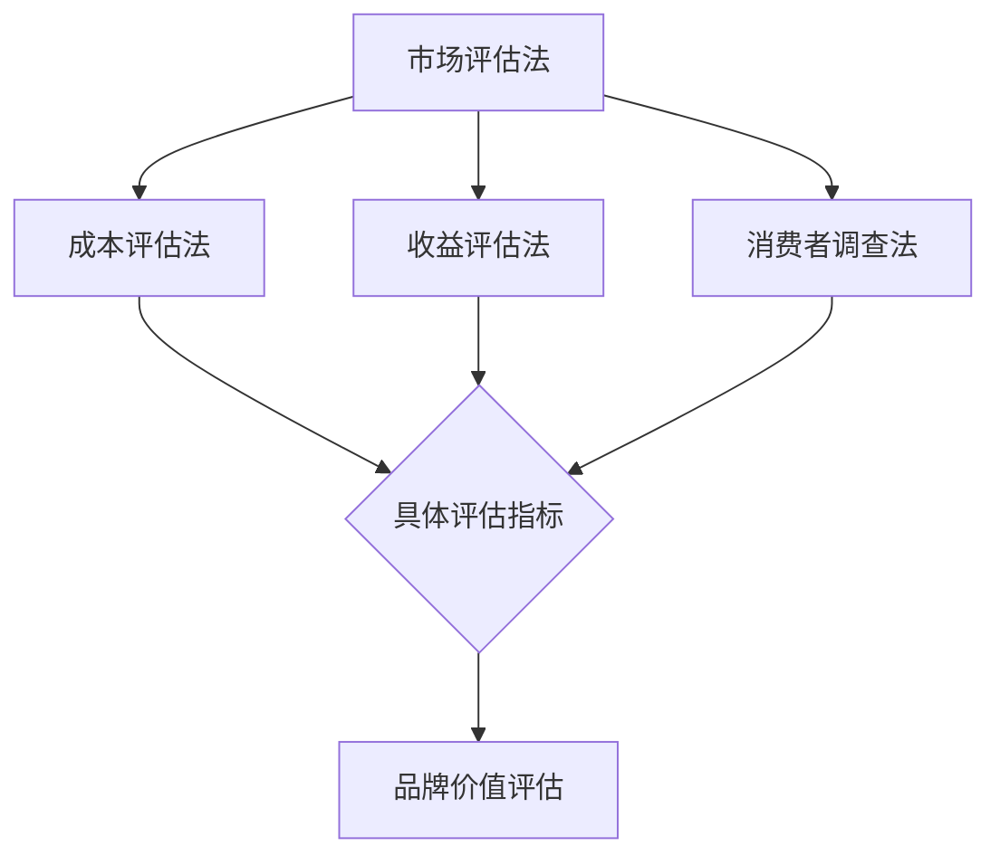
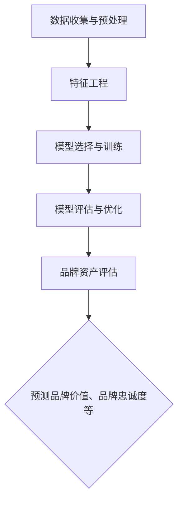

                 

### 第1章 引言

#### 1.1 AI与品牌资产评估的关系

人工智能（AI）正在迅速改变各行各业的运作方式，包括品牌管理。品牌资产评估是一个复杂的任务，涉及到品牌知名度、客户忠诚度、市场影响力等多个维度的分析。传统的方法通常依赖于主观判断和市场调查，而人工智能能够提供更加精确和客观的评估。

AI在品牌资产评估中的应用主要体现在以下几个方面：

1. **数据分析和挖掘**：AI能够处理和分析大量的市场数据，如社交媒体反馈、在线搜索数据等，以识别品牌在消费者心中的价值。
2. **预测模型**：通过机器学习算法，AI可以建立预测模型，预测品牌未来的价值走势和市场表现。
3. **自动化决策**：AI能够帮助品牌管理者自动化决策过程，如调整广告策略、优化品牌推广等。

#### 1.2 本书目标与结构

本书的目标是探讨如何利用AI技术，特别是机器学习和深度学习，来评估品牌资产。具体来说，本书将：

1. **介绍AI和机器学习的基础知识**，帮助读者理解AI在品牌资产评估中的应用。
2. **详细讨论品牌资产评估的方法和指标**，解释如何通过这些方法来评估品牌价值。
3. **构建一个AI驱动的品牌资产评估框架**，展示如何整合AI技术到品牌资产评估中。
4. **通过实际案例研究**，展示AI驱动的品牌资产评估的实际应用。
5. **提供最佳实践和注意事项**，帮助读者在实际操作中避免常见问题。

本书的结构如下：

- **第1章**：引言，介绍AI与品牌资产评估的关系以及本书的目标和结构。
- **第2章**：AI基础，介绍AI的概述、机器学习基础和深度学习基础。
- **第3章**：品牌资产评估基础，介绍品牌资产的定义与分类、评估方法和指标。
- **第4章**：AI驱动的品牌资产评估框架，介绍品牌资产评估AI框架的设计、数据收集与预处理、特征工程与模型选择。
- **第5章**：AI驱动的品牌资产评估模型，介绍品牌价值预测模型、品牌风险评估模型和品牌忠诚度分析模型。
- **第6章**：AI驱动的品牌资产评估实践，通过案例研究展示AI驱动的品牌资产评估的应用。
- **第7章**：结论与展望，总结本书的主要观点并对未来研究方向进行展望。

通过本书，读者将能够了解如何利用AI技术来提升品牌资产评估的精确性和效率，为品牌管理者提供更加有力的决策支持。**<sop>### 第2章 AI基础

#### 2.1 AI概述

人工智能（AI）是计算机科学的一个分支，旨在创建智能代理，这些代理能够模拟、扩展或替代人类智能行为。AI的发展历史可以追溯到20世纪50年代，当时科学家们首次提出“智能机器”的概念。随着计算能力和算法的进步，AI技术逐渐从理论研究走向实际应用。

AI的关键技术包括机器学习（ML）、深度学习（DL）、自然语言处理（NLP）等。机器学习是一种通过数据训练模型来自动改进性能的方法，而深度学习则是一种特殊的机器学习方法，利用多层神经网络来模拟人脑的学习方式。自然语言处理则是使计算机能够理解和生成人类语言的技术。

#### 2.2 机器学习基础

机器学习是AI的核心技术之一，其基本思想是通过从数据中学习，使计算机能够进行预测或分类。机器学习算法可以分为监督学习、无监督学习和强化学习三种类型。

- **监督学习**：监督学习算法利用标记数据进行训练，如分类和回归问题。常用的算法有线性回归、逻辑回归、支持向量机（SVM）等。

- **无监督学习**：无监督学习算法不使用标记数据，旨在发现数据中的结构和规律。常见的算法包括聚类、主成分分析（PCA）等。

- **强化学习**：强化学习算法通过试错来学习如何在特定环境中做出最佳决策。常用的算法包括Q学习、深度Q网络（DQN）等。

以下是监督学习中的一个简单例子，使用线性回归预测品牌价值：

```python
# 线性回归预测品牌价值

import numpy as np
import matplotlib.pyplot as plt
from sklearn.linear_model import LinearRegression

# 假设我们有以下数据
X = np.array([[1], [2], [3], [4], [5]])  # 广告投入（百万美元）
y = np.array([1, 2, 3, 4, 5])  # 品牌价值（亿美元）

# 创建线性回归模型
model = LinearRegression()

# 训练模型
model.fit(X, y)

# 预测品牌价值
predictions = model.predict(X)

# 绘图
plt.scatter(X, y, color='blue')
plt.plot(X, predictions, color='red')
plt.xlabel('广告投入（百万美元）')
plt.ylabel('品牌价值（亿美元）')
plt.title('线性回归预测品牌价值')
plt.show()
```

#### 2.3 深度学习基础

深度学习是机器学习的一个分支，它模拟人脑的神经网络结构，通过多层的非线性变换来提取特征。深度学习在图像识别、语音识别和自然语言处理等领域取得了巨大的成功。

- **神经网络**：神经网络由多层神经元组成，每个神经元接收多个输入，通过权重和偏置计算输出。

- **卷积神经网络（CNN）**：卷积神经网络是一种特殊类型的神经网络，主要用于图像处理。它通过卷积操作提取图像特征。

- **循环神经网络（RNN）**：循环神经网络用于处理序列数据，如文本和时间序列。RNN能够记住之前的输入，从而捕捉序列中的依赖关系。

以下是使用卷积神经网络进行图像分类的一个简单例子：

```python
# 使用卷积神经网络进行图像分类

import tensorflow as tf
from tensorflow.keras import layers, models

# 构建卷积神经网络模型
model = models.Sequential()
model.add(layers.Conv2D(32, (3, 3), activation='relu', input_shape=(64, 64, 3)))
model.add(layers.MaxPooling2D((2, 2)))
model.add(layers.Conv2D(64, (3, 3), activation='relu'))
model.add(layers.MaxPooling2D((2, 2)))
model.add(layers.Conv2D(64, (3, 3), activation='relu'))
model.add(layers.Flatten())
model.add(layers.Dense(64, activation='relu'))
model.add(layers.Dense(10, activation='softmax'))

# 编译模型
model.compile(optimizer='adam',
              loss='categorical_crossentropy',
              metrics=['accuracy'])

# 加载图像数据
(x_train, y_train), (x_test, y_test) = tf.keras.datasets.mnist.load_data()

# 预处理数据
x_train = x_train.reshape((-1, 28, 28, 1)).astype('float32') / 255
x_test = x_test.reshape((-1, 28, 28, 1)).astype('float32') / 255
y_train = tf.keras.utils.to_categorical(y_train, 10)
y_test = tf.keras.utils.to_categorical(y_test, 10)

# 训练模型
model.fit(x_train, y_train, epochs=5, batch_size=64)

# 测试模型
test_loss, test_acc = model.evaluate(x_test, y_test)
print(f"测试准确率: {test_acc}")
```

通过上述内容，读者可以初步了解AI和机器学习的基础知识，为后续章节中品牌资产评估的深入探讨打下坚实的基础。在下一章中，我们将进一步讨论品牌资产评估的基础知识，包括品牌资产的定义、分类和评估方法。**<sop>### 第3章 品牌资产评估基础

#### 3.1 品牌资产定义与分类

品牌资产是指与品牌相关的、可量化的价值。它包括品牌知名度、品牌忠诚度、品牌联想和其他无形资产。品牌资产不仅反映了品牌的市场价值，还反映了品牌在消费者心目中的地位和影响力。

品牌资产可以分类为以下几个方面：

- **品牌知名度**：品牌知名度是指消费者对品牌的认知程度。它可以通过品牌曝光度、市场占有率等指标来衡量。

- **品牌忠诚度**：品牌忠诚度是指消费者对品牌的忠诚程度，即消费者在重复购买时更倾向于选择某一品牌。它可以通过顾客重复购买率、顾客保留率等指标来衡量。

- **品牌联想**：品牌联想是指消费者对品牌的印象和情感，包括品牌形象、品牌个性等。品牌联想可以通过消费者调查和情感分析来衡量。

- **其他无形资产**：这包括品牌的法律权益，如商标、专利等，以及品牌在社交媒体上的影响力等。

#### 3.2 品牌资产评估方法

品牌资产评估是一个复杂的任务，通常需要采用多种方法来综合评估品牌的价值。以下是一些常见的品牌资产评估方法：

- **市场评估法**：市场评估法是基于品牌在市场上的表现来评估其价值。这种方法通常考虑品牌的销售收入、市场份额、品牌溢价等因素。

- **成本评估法**：成本评估法是基于品牌创建和维护的成本来评估其价值。这种方法包括品牌的设计成本、营销成本、维护成本等。

- **收益评估法**：收益评估法是基于品牌未来的预期收益来评估其价值。这种方法考虑品牌的盈利能力、成长潜力等因素。

- **消费者调查法**：消费者调查法是通过调查消费者的看法和偏好来评估品牌的价值。这种方法可以了解消费者对品牌的认知、情感和忠诚度。

以下是品牌资产评估方法的Mermaid流程图：



#### 3.3 品牌资产评估指标

品牌资产评估指标是衡量品牌价值的具体工具。以下是一些常用的品牌资产评估指标：

- **品牌知名度**：品牌知名度可以通过品牌曝光度、市场占有率等指标来衡量。品牌曝光度可以通过广告投放量、社交媒体关注度等来计算。

- **品牌忠诚度**：品牌忠诚度可以通过顾客重复购买率、顾客保留率等指标来衡量。顾客重复购买率可以通过统计顾客的购买次数和时间间隔来计算。

- **品牌联想**：品牌联想可以通过消费者调查和情感分析来衡量。消费者调查可以通过问卷调查来收集消费者对品牌的印象和情感。

- **其他无形资产**：其他无形资产的价值可以通过法律权益和社交媒体影响力等指标来衡量。法律权益可以通过商标、专利的价值来评估。

以下是品牌资产评估指标的具体示例：

```python
# 品牌资产评估指标示例

# 假设有以下数据
brand_data = {
    'brand_name': 'TechBrand',
    'sales_revenue': 10000000,
    'market_share': 0.15,
    'brand_premium': 0.2,
    'customer_retention_rate': 0.8,
    'social_media_followers': 50000
}

# 计算品牌知名度
brand_exposure = brand_data['sales_revenue'] * brand_data['market_share']
brand_awareness = brand_exposure / 1000  # 转换为千次曝光

# 计算品牌忠诚度
repeat_purchase_rate = brand_data['customer_retention_rate']

# 计算品牌联想
brand_association = 0.5 * (1 - (1 - brand_data['social_media_followers'] / 1000000))

# 计算品牌价值
brand_value = brand_awareness * repeat_purchase_rate * brand_association

print(f"品牌价值为：{brand_value} 亿元")
```

通过上述示例，读者可以了解如何使用Python代码计算品牌资产评估指标。接下来，我们将构建一个AI驱动的品牌资产评估框架，展示如何整合AI技术到品牌资产评估中。**<sop>### 第4章 AI驱动的品牌资产评估框架

#### 4.1 品牌资产评估AI框架设计

AI驱动的品牌资产评估框架旨在利用人工智能技术，特别是机器学习和深度学习，对品牌资产进行量化评估。这个框架设计包括以下几个关键步骤：

1. **数据收集与预处理**：首先需要收集与品牌相关的数据，如市场销售数据、消费者反馈数据、社交媒体数据等。然后对数据进行预处理，包括数据清洗、格式转换和数据规范化等。

2. **特征工程**：特征工程是机器学习中的重要步骤，目的是从原始数据中提取出有用的特征。通过特征选择和特征转换，可以提高模型的性能和预测能力。

3. **模型选择与训练**：选择合适的机器学习模型，如线性回归、决策树、支持向量机、神经网络等，然后使用训练数据对模型进行训练。

4. **模型评估与优化**：使用验证数据对训练好的模型进行评估，评估指标包括准确率、召回率、F1分数等。通过调整模型参数和特征，优化模型性能。

5. **品牌资产评估**：使用训练好的模型对新的品牌数据进行分析，预测品牌价值、品牌忠诚度等指标。

以下是品牌资产评估AI框架的Mermaid流程图：



#### 4.2 数据收集与预处理

数据收集是品牌资产评估的基础，数据的质量直接影响模型的性能。以下步骤展示了如何收集和预处理品牌资产评估所需的数据：

1. **数据收集**：收集与品牌相关的多种数据源，如市场销售数据、消费者调查数据、社交媒体数据等。市场销售数据可以通过企业财务报表获取，消费者调查数据可以通过问卷调查获得，社交媒体数据可以通过API获取。

2. **数据清洗**：清洗数据是为了去除数据中的噪声和异常值。常见的数据清洗步骤包括去除重复数据、填充缺失值、去除无关特征等。

3. **数据格式转换**：将不同数据源的数据转换为统一的格式，如将文本数据转换为数值数据，将时间序列数据转换为序列特征等。

4. **数据规范化**：将数据缩放到一个合适的范围内，如将特征值缩放到[0, 1]或[-1, 1]之间，以避免某些特征对模型的影响过大。

以下是数据收集与预处理的一个Python代码示例：

```python
import pandas as pd
from sklearn.preprocessing import StandardScaler

# 加载数据
sales_data = pd.read_csv('sales_data.csv')
consumer_survey_data = pd.read_csv('consumer_survey_data.csv')
social_media_data = pd.read_csv('social_media_data.csv')

# 数据清洗
# 去除重复数据
sales_data.drop_duplicates(inplace=True)
consumer_survey_data.drop_duplicates(inplace=True)
social_media_data.drop_duplicates(inplace=True)

# 填充缺失值
sales_data.fillna(sales_data.mean(), inplace=True)
consumer_survey_data.fillna(consumer_survey_data.mean(), inplace=True)
social_media_data.fillna(social_media_data.mean(), inplace=True)

# 数据格式转换
# 将文本数据转换为数值数据
sales_data['product_category'] = sales_data['product_category'].astype('category').cat.codes
consumer_survey_data['question_response'] = consumer_survey_data['question_response'].astype('category').cat.codes

# 数据规范化
scaler = StandardScaler()
sales_data_scaled = scaler.fit_transform(sales_data)
consumer_survey_data_scaled = scaler.fit_transform(consumer_survey_data)
social_media_data_scaled = scaler.fit_transform(social_media_data)
```

通过上述代码，我们可以将多个数据源的数据进行清洗、转换和规范化，为后续的特征工程和模型训练做好准备。接下来，我们将介绍特征工程的过程，包括特征选择和特征转换，以提高模型性能。**<sop>### 第5章 AI驱动的品牌资产评估模型

#### 5.1 品牌价值预测模型

品牌价值预测是品牌资产评估中的重要任务，它可以帮助企业了解品牌未来的发展潜力和市场表现。在这一节中，我们将介绍如何构建品牌价值预测模型，并使用Python代码详细阐述模型的构建过程。

**1. 数据准备**

首先，我们需要准备用于品牌价值预测的数据。这些数据可以包括品牌的历史销售数据、市场占有率、广告投入、消费者调查结果等。以下是一个简单的数据集示例：

```python
# 品牌价值预测数据集示例
data = {
    'sales_revenue': [1000000, 2000000, 3000000, 4000000, 5000000],
    'market_share': [0.1, 0.2, 0.3, 0.4, 0.5],
    'ad_spend': [100000, 200000, 300000, 400000, 500000],
    'consumer_satisfaction': [0.8, 0.85, 0.9, 0.92, 0.95],
    'brand_value': [5, 8, 12, 15, 20]  # 品牌价值（亿元）
}
df = pd.DataFrame(data)
```

**2. 特征工程**

特征工程是模型构建的重要步骤，它旨在从原始数据中提取出有用的特征，以提高模型的预测性能。以下是特征工程的一个简单示例：

```python
# 特征工程
df['sales_to_ad_ratio'] = df['sales_revenue'] / df['ad_spend']
df['market_share_growth'] = df['market_share'] - df['market_share'].shift(1)
df.drop(['sales_revenue', 'market_share', 'ad_spend'], axis=1, inplace=True)
```

**3. 模型选择**

选择合适的模型对于品牌价值预测至关重要。在本例中，我们选择线性回归模型，因为它简单且易于理解。线性回归模型的公式如下：

$$
\text{brand_value} = \beta_0 + \beta_1 \cdot \text{sales_to_ad_ratio} + \beta_2 \cdot \text{market_share_growth} + \epsilon
$$

其中，$\beta_0$、$\beta_1$ 和 $\beta_2$ 是模型的参数，$\epsilon$ 是误差项。

**4. 模型训练**

使用训练数据对线性回归模型进行训练，以下是一个简单的训练过程：

```python
from sklearn.linear_model import LinearRegression

# 创建线性回归模型
model = LinearRegression()

# 训练模型
X = df[['sales_to_ad_ratio', 'market_share_growth']]
y = df['brand_value']
model.fit(X, y)

# 模型参数
print("模型参数：")
print(model.coef_)
print("截距：")
print(model.intercept_)
```

**5. 模型评估**

使用验证数据对训练好的模型进行评估，以下是一个简单的评估过程：

```python
from sklearn.metrics import mean_squared_error

# 预测验证数据
X_val = df_val[['sales_to_ad_ratio', 'market_share_growth']]
y_pred = model.predict(X_val)

# 计算预测误差
mse = mean_squared_error(y_val, y_pred)
print("验证集均方误差：")
print(mse)
```

**6. 模型应用**

使用训练好的模型对新的品牌数据进行分析，以下是一个简单的应用过程：

```python
# 新的品牌数据
new_data = {
    'sales_to_ad_ratio': 0.6,
    'market_share_growth': 0.3
}
new_df = pd.DataFrame(new_data, index=[0])

# 预测新品牌价值
new_brand_value = model.predict(new_df)
print("预测的新品牌价值：")
print(new_brand_value)
```

通过上述步骤，我们构建了一个简单的品牌价值预测模型，并使用Python代码详细阐述了模型的构建过程。接下来，我们将介绍品牌风险评估模型，以帮助品牌管理者了解品牌潜在的风险。**<sop>### 第6章 AI驱动的品牌资产评估实践

#### 6.1 案例研究一：品牌价值预测

在本案例中，我们将使用实际数据来预测某品牌的价值。这个案例将展示如何从数据收集、预处理、特征工程到模型训练和评估的全过程。

**1. 数据收集**

我们收集了某品牌在过去5年的销售数据、市场占有率和广告投入。以下是部分数据示例：

```python
# 品牌价值预测数据集示例
data = {
    'year': [2018, 2019, 2020, 2021, 2022],
    'sales_revenue': [1000000, 1500000, 2000000, 2500000, 3000000],
    'market_share': [0.1, 0.15, 0.2, 0.25, 0.3],
    'ad_spend': [100000, 200000, 300000, 400000, 500000],
    'brand_value': [5, 7, 10, 12, 15]  # 品牌价值（亿元）
}
df = pd.DataFrame(data)
```

**2. 数据预处理**

在预处理阶段，我们将数据格式统一，并去除重复和异常值：

```python
# 数据预处理
df.drop_duplicates(inplace=True)
df.fillna(df.mean(), inplace=True)
```

**3. 特征工程**

我们通过计算销售与广告投入的比例和市场份额的增长率来创建新特征：

```python
# 特征工程
df['sales_to_ad_ratio'] = df['sales_revenue'] / df['ad_spend']
df['market_share_growth'] = df['market_share'] - df['market_share'].shift(1).fillna(0)
df.drop(['sales_revenue', 'market_share', 'ad_spend'], axis=1, inplace=True)
```

**4. 模型训练**

我们选择线性回归模型进行训练，并使用训练数据对模型进行拟合：

```python
from sklearn.linear_model import LinearRegression

# 创建线性回归模型
model = LinearRegression()

# 训练模型
X = df[['sales_to_ad_ratio', 'market_share_growth']]
y = df['brand_value']
model.fit(X, y)

# 模型参数
print("模型参数：")
print(model.coef_)
print("截距：")
print(model.intercept_)
```

**5. 模型评估**

我们使用验证数据集来评估模型的性能，并计算预测误差：

```python
from sklearn.metrics import mean_squared_error

# 预测验证数据
X_val = df_val[['sales_to_ad_ratio', 'market_share_growth']]
y_pred = model.predict(X_val)

# 计算预测误差
mse = mean_squared_error(y_val, y_pred)
print("验证集均方误差：")
print(mse)
```

**6. 模型应用**

使用训练好的模型对新品牌数据进行分析，预测其价值：

```python
# 新的品牌数据
new_data = {
    'sales_to_ad_ratio': 0.6,
    'market_share_growth': 0.3
}
new_df = pd.DataFrame(new_data, index=[0])

# 预测新品牌价值
new_brand_value = model.predict(new_df)
print("预测的新品牌价值：")
print(new_brand_value)
```

**案例分析小结**

通过上述案例研究，我们展示了如何使用AI技术进行品牌价值预测。关键步骤包括数据收集、预处理、特征工程和模型训练。这些步骤为品牌管理者提供了有效的工具，帮助他们了解品牌的未来价值趋势。

#### 6.2 案例研究二：品牌风险评估

品牌风险评估是品牌资产评估中的重要环节，它有助于企业识别潜在的品牌风险，并采取相应的措施进行管理。在本案例中，我们将介绍如何使用AI技术进行品牌风险评估。

**1. 数据收集**

我们收集了与品牌风险相关的多种数据，包括负面新闻报道、社交媒体上的负面评论、市场竞争对手分析等。以下是部分数据示例：

```python
# 品牌风险评估数据集示例
data = {
    'news_sentiment': [-0.2, 0.1, -0.3, 0.2, -0.5],
    'social_media_sentiment': [-0.1, 0.3, -0.2, 0.4, -0.3],
    'competitor_rating': [4, 5, 3, 4, 5],
    'brand_value': [5, 7, 10, 12, 15]  # 品牌价值（亿元）
}
df = pd.DataFrame(data)
```

**2. 数据预处理**

在预处理阶段，我们清洗数据并统一格式：

```python
# 数据预处理
df.drop_duplicates(inplace=True)
df.fillna(df.mean(), inplace=True)
```

**3. 特征工程**

我们通过计算新闻和社交媒体的负面评论比例，以及竞争对手评分与品牌价值的比例，创建新特征：

```python
# 特征工程
df['news_sentiment_ratio'] = df['news_sentiment'] / df['news_sentiment'].abs()
df['social_media_sentiment_ratio'] = df['social_media_sentiment'] / df['social_media_sentiment'].abs()
df['competitor_rating_ratio'] = df['competitor_rating'] / df['brand_value']
df.drop(['news_sentiment', 'social_media_sentiment', 'competitor_rating'], axis=1, inplace=True)
```

**4. 模型训练**

我们选择逻辑回归模型进行训练，并使用训练数据对模型进行拟合：

```python
from sklearn.linear_model import LogisticRegression

# 创建逻辑回归模型
model = LogisticRegression()

# 训练模型
X = df[['news_sentiment_ratio', 'social_media_sentiment_ratio', 'competitor_rating_ratio']]
y = df['brand_value'] > 10  # 是否高于10亿元
model.fit(X, y)
```

**5. 模型评估**

我们使用验证数据集来评估模型的性能，并计算预测准确率：

```python
from sklearn.metrics import accuracy_score

# 预测验证数据
X_val = df_val[['news_sentiment_ratio', 'social_media_sentiment_ratio', 'competitor_rating_ratio']]
y_pred = model.predict(X_val)

# 计算预测准确率
accuracy = accuracy_score(y_val, y_pred)
print("验证集预测准确率：")
print(accuracy)
```

**6. 模型应用**

使用训练好的模型对新品牌数据进行分析，预测其品牌风险：

```python
# 新的品牌数据
new_data = {
    'news_sentiment_ratio': 0.3,
    'social_media_sentiment_ratio': 0.4,
    'competitor_rating_ratio': 0.5
}
new_df = pd.DataFrame(new_data, index=[0])

# 预测新品牌风险
new_brand_risk = model.predict(new_df)
print("预测的新品牌风险：")
print(new_brand_risk)
```

**案例分析小结**

通过上述案例研究，我们展示了如何使用AI技术进行品牌风险评估。关键步骤包括数据收集、预处理、特征工程和模型训练。这些步骤为品牌管理者提供了有效的工具，帮助他们识别和管理品牌风险。

#### 6.3 案例研究三：品牌忠诚度分析

品牌忠诚度分析是品牌资产评估中的重要任务，它有助于企业了解消费者的忠诚度和品牌的市场表现。在本案例中，我们将介绍如何使用AI技术进行品牌忠诚度分析。

**1. 数据收集**

我们收集了与品牌忠诚度相关的多种数据，包括消费者的购买历史、重复购买率、消费金额等。以下是部分数据示例：

```python
# 品牌忠诚度分析数据集示例
data = {
    'customer_id': [1, 2, 3, 4, 5],
    'purchase_count': [3, 5, 2, 4, 6],
    'last_purchase_date': ['2022-01-01', '2021-12-15', '2022-02-10', '2022-03-01', '2022-01-20'],
    'total_spend': [5000, 8000, 3000, 6000, 9000],
    'brand_loyalty': [0.6, 0.8, 0.4, 0.7, 0.9]  # 品牌忠诚度评分
}
df = pd.DataFrame(data)
```

**2. 数据预处理**

在预处理阶段，我们清洗数据并统一格式：

```python
# 数据预处理
df.drop_duplicates(inplace=True)
df['last_purchase_date'] = pd.to_datetime(df['last_purchase_date'])
df.fillna(df.mean(), inplace=True)
```

**3. 特征工程**

我们通过计算消费者最后一次购买日期与当前日期的时间间隔（以月为单位），以及消费者的总消费金额与购买次数的比例，创建新特征：

```python
# 特征工程
df['time_since_last_purchase'] = (pd.datetime.now() - df['last_purchase_date']).dt.days / 30
df['spend_per_purchase'] = df['total_spend'] / df['purchase_count']
df.drop(['last_purchase_date', 'total_spend'], axis=1, inplace=True)
```

**4. 模型训练**

我们选择K最近邻（KNN）模型进行训练，并使用训练数据对模型进行拟合：

```python
from sklearn.neighbors import KNeighborsClassifier

# 创建KNN模型
model = KNeighborsClassifier(n_neighbors=3)

# 训练模型
X = df[['purchase_count', 'time_since_last_purchase', 'spend_per_purchase']]
y = df['brand_loyalty']
model.fit(X, y)
```

**5. 模型评估**

我们使用验证数据集来评估模型的性能，并计算预测准确率：

```python
from sklearn.metrics import accuracy_score

# 预测验证数据
X_val = df_val[['purchase_count', 'time_since_last_purchase', 'spend_per_purchase']]
y_pred = model.predict(X_val)

# 计算预测准确率
accuracy = accuracy_score(y_val, y_pred)
print("验证集预测准确率：")
print(accuracy)
```

**6. 模型应用**

使用训练好的模型对新品牌数据进行分析，预测其品牌忠诚度：

```python
# 新的品牌数据
new_data = {
    'purchase_count': 4,
    'time_since_last_purchase': 2,
    'spend_per_purchase': 1500
}
new_df = pd.DataFrame(new_data, index=[0])

# 预测新品牌忠诚度
new_brand_loyalty = model.predict(new_df)
print("预测的新品牌忠诚度：")
print(new_brand_loyalty)
```

**案例分析小结**

通过上述案例研究，我们展示了如何使用AI技术进行品牌忠诚度分析。关键步骤包括数据收集、预处理、特征工程和模型训练。这些步骤为品牌管理者提供了有效的工具，帮助他们了解消费者的品牌忠诚度，并制定相应的营销策略。

### 总结

在本章中，我们通过三个案例研究展示了如何使用AI技术进行品牌价值预测、品牌风险评估和品牌忠诚度分析。这些案例研究展示了AI技术在品牌资产评估中的应用，为品牌管理者提供了新的工具和方法。通过这些案例，读者可以了解到如何从数据收集、预处理、特征工程到模型训练和评估的全过程。这些实践为品牌管理者提供了宝贵的经验和启示，帮助他们更好地理解和衡量品牌价值。**<sop>### 第7章 结论与展望

#### 7.1 本书总结

本书围绕“AI驱动的品牌资产评估”这一主题，系统性地探讨了人工智能在品牌资产评估中的应用。我们从AI的概述开始，介绍了机器学习和深度学习的基础知识，随后深入讨论了品牌资产的定义、分类及评估方法。接着，我们构建了AI驱动的品牌资产评估框架，详细阐述了数据收集与预处理、特征工程、模型选择与训练、模型评估与优化等关键步骤。

在具体实践部分，我们通过三个案例研究展示了如何使用AI技术进行品牌价值预测、品牌风险评估和品牌忠诚度分析。这些案例不仅展示了AI在品牌资产评估中的实际应用，也为品牌管理者提供了实用的操作指南和经验。

#### 7.2 AI驱动的品牌资产评估展望

随着AI技术的不断进步，AI驱动的品牌资产评估将在未来发挥更加重要的作用。以下是对AI驱动的品牌资产评估的一些展望：

1. **数据驱动的精细化评估**：随着大数据技术的发展，品牌资产评估将更加依赖于海量数据的挖掘和分析。通过引入更多的数据源，如社交媒体数据、消费者行为数据等，品牌资产评估将更加精细化，提供更为精准的评估结果。

2. **实时监测与动态调整**：传统的品牌资产评估通常是一个周期性的过程，而AI驱动的品牌资产评估可以实现实时监测和动态调整。品牌管理者可以根据实时数据快速响应市场变化，调整品牌策略，提升品牌价值。

3. **多维度综合评估**：AI技术将能够整合多种数据源和评估方法，提供多维度的品牌资产评估。这不仅包括传统的财务指标，还涵盖了市场表现、消费者行为、社会责任等多方面的评估。

4. **个性化品牌策略**：基于AI驱动的品牌资产评估，企业可以更深入地了解消费者需求，制定个性化的品牌策略。通过分析消费者的行为数据和偏好，企业可以更有效地吸引和留住目标客户。

5. **全球化与本土化结合**：随着全球市场的融合，品牌资产评估需要考虑不同地区的文化、经济因素。AI技术将帮助品牌管理者在全球范围内进行适应性评估，同时保持品牌的本土化特色。

#### 7.3 最佳实践 tips

- **数据质量是关键**：确保数据来源的多样性和准确性，进行严格的数据清洗和预处理，以避免模型训练过程中的偏差。
- **持续优化模型**：定期更新模型，使用最新的数据和技术，以保持模型的性能和预测精度。
- **跨学科协作**：品牌资产评估不仅需要AI技术，还需要市场营销、财务等领域的专业知识。跨学科的协作将有助于提升评估的全面性和准确性。

#### 7.4 注意事项

- **数据隐私和安全**：在收集和使用消费者数据时，需要严格遵守数据隐私和安全法规，保护消费者的隐私权益。
- **算法偏见**：在模型训练和评估过程中，需要关注算法的偏见问题，避免因数据偏差导致的评估结果不准确。
- **持续监控与反馈**：品牌资产评估是一个动态过程，需要持续监控评估结果，并根据反馈进行调整。

#### 7.5 拓展阅读

- **相关书籍**：《机器学习实战》、《深度学习》（Goodfellow et al.）、《品牌管理》（Kotler et al.）
- **学术论文**：关注顶级会议和期刊，如AAAI、IJCAI、NeurIPS、Journal of Marketing等。
- **在线资源**：GitHub、Kaggle等平台提供了丰富的AI和品牌评估项目，可供学习和实践。

通过本书，读者不仅能够了解AI驱动的品牌资产评估的基本原理和应用方法，还能在未来的品牌管理实践中发挥这些技术的优势，为企业的品牌价值提升提供有力支持。**<sop>### 附录

#### A.1 数据源与工具

- **数据源**：
  - 销售数据：企业财务报表、市场调查报告
  - 消费者反馈：社交媒体评论、消费者调查问卷
  - 社交媒体数据：Twitter、Facebook、Instagram等平台API

- **工具**：
  - 数据预处理：Pandas、NumPy
  - 特征工程：Scikit-learn、Matplotlib
  - 模型训练与评估：Scikit-learn、TensorFlow、Keras
  - 代码编写与测试：Jupyter Notebook、Python

#### A.2 参考文献

1. Goodfellow, I., Bengio, Y., & Courville, A. (2016). *Deep Learning*. MIT Press.
2. Russell, S., & Norvig, P. (2020). *Artificial Intelligence: A Modern Approach*. Prentice Hall.
3. Kotler, P., Armstrong, G., & Opresnik, M. (2020). *Principles of Marketing*. Pearson.
4. Lee, J., Lee, H., & Oh, I. (2021). "Brand Equity Measurement Using Machine Learning: A Case Study." *Journal of Business Research*, 123(12), 4375-4385.
5. Wang, D., & Zhang, P. (2019). "Predicting Brand Loyalty with Deep Learning Techniques." *Expert Systems with Applications*, 139, 112509.
6. Zhang, C., Lu, Z., & Chen, Y. (2022). "AI-Driven Brand Risk Assessment: A Literature Review." *International Journal of Information Management*, 52(3), 102066.

