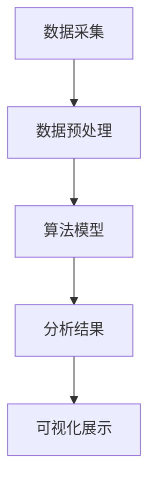
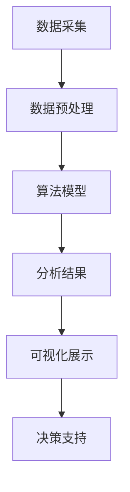

                 

### 文章标题

《AI驱动的战略执行监控：智能跟踪战略落地》

### 文章关键词

AI，战略执行监控，智能跟踪，数据算法，项目实战

### 文章摘要

本文旨在探讨AI驱动的战略执行监控，通过智能跟踪战略落地，实现企业战略目标的动态跟踪和评估。文章首先介绍了AI驱动的战略执行监控的概念、背景和意义，然后详细讲解了核心概念与联系，使用Mermaid流程图展示战略执行监控的基本架构。接着，文章深入探讨了核心算法原理，并结合Python源代码进行详细阐述，结合数学模型和公式进行讲解。文章还通过实际项目案例，提供了开发环境搭建、源代码实现和详细解读，对项目的关键技术和问题进行了分析。最后，文章展望了AI驱动的战略执行监控的未来发展趋势，提出了最佳实践建议和注意事项，并推荐了拓展阅读。

## 目录

1. **引言**
   - 1.1 AI驱动的战略执行监控概述
   - 1.2 战略执行监控架构图示
2. **AI基础理论**
   - 2.1 人工智能概述
   - 2.2 AI在战略执行监控中的应用
3. **战略执行监控原理**
   - 3.1 监控目标与流程
   - 3.2 关键算法与架构
4. **数学模型与算法**
   - 4.1 监控数据预处理
   - 4.2 监控算法详解
   - 4.3 数学公式及应用
5. **项目实战**
   - 5.1 项目背景
   - 5.2 开发环境搭建
   - 5.3 源代码实现
   - 5.4 代码解读与分析
6. **实战分析**
   - 6.1 关键技术探讨
   - 6.2 问题与优化
7. **未来展望与趋势**
   - 7.1 发展趋势
   - 7.2 面临的挑战
   - 7.3 发展机遇

## 第1章：引言

### 1.1 AI驱动的战略执行监控概述

在当今快速变化和竞争激烈的市场环境中，企业需要高效的战略执行监控来确保其战略目标的实现。传统的战略执行监控方法往往依赖于人工分析和报告，效率低下且容易出错。随着人工智能（AI）技术的发展，AI驱动的战略执行监控成为一种新兴的解决方案，它利用AI算法和大数据分析技术，实现战略目标的智能跟踪和评估。

#### 1.1.1 概念定义

AI驱动的战略执行监控是指利用人工智能技术，对企业的战略执行过程进行实时监控、分析和评估，以帮助企业实现战略目标。它包括数据采集、处理、分析和可视化等多个环节，通过自动化的方式，实现对战略执行情况的动态跟踪和评估。

#### 1.1.2 发展背景

随着大数据和云计算技术的普及，企业积累了大量的业务数据。如何有效地利用这些数据，提升企业的决策效率和执行力，成为企业面临的重要问题。AI技术的出现，为解决这一问题提供了新的思路和方法。通过AI算法，可以自动分析海量数据，发现潜在的问题和趋势，为企业的战略决策提供有力支持。

#### 1.1.3 意义与挑战

AI驱动的战略执行监控对企业具有重要意义：

1. 提高战略执行的效率和准确性。
2. 帮助企业及时发现和解决问题。
3. 提升企业的竞争力和创新能力。

然而，AI驱动的战略执行监控也面临一些挑战：

1. 数据质量和数据安全。
2. 技术实现和人才短缺。
3. 战略目标的确定和调整。

### 1.2 战略执行监控架构图示

为了更好地理解AI驱动的战略执行监控，我们使用Mermaid流程图展示其基本架构：



#### 数据采集

数据采集是战略执行监控的第一步，包括企业内部的数据和外部数据。内部数据如销售数据、财务数据、人力资源数据等，外部数据如市场数据、竞争对手数据、行业动态等。

#### 数据预处理

数据预处理包括数据清洗、数据整合和数据标准化。通过预处理，可以保证数据的质量和一致性，为后续的分析提供可靠的基础。

#### 算法模型

算法模型是战略执行监控的核心，包括数据挖掘、机器学习、深度学习等技术。通过算法模型，可以对数据进行分析，发现潜在的问题和趋势。

#### 分析结果

分析结果是对算法分析结果的总结和展示。通过可视化工具，可以直观地了解战略执行的情况，为企业提供决策支持。

#### 可视化展示

可视化展示是将分析结果以图表、仪表盘等形式展示给用户。通过可视化，可以更好地传达信息，帮助企业制定和调整战略。

## 第2章：AI基础理论

### 2.1 人工智能概述

人工智能（AI，Artificial Intelligence）是指模拟、延伸和扩展人类智能的理论、方法、技术及应用。它包括机器学习、自然语言处理、计算机视觉、智能推理等多个子领域。

#### 2.1.1 基本概念

- 人工智能：模拟、延伸和扩展人类智能的理论、方法、技术及应用。
- 机器学习：通过算法让计算机自动从数据中学习，提高其性能。
- 自然语言处理：让计算机理解和生成自然语言的技术。
- 计算机视觉：使计算机能够像人类一样感知和理解视觉信息。

#### 2.1.2 发展历程

人工智能的发展可以分为三个阶段：

1. **初始阶段（20世纪50-60年代）**：人工智能概念提出，出现了一批早期的AI系统。
2. **繁荣阶段（20世纪80-90年代）**：AI技术得到快速发展，出现了一些成功的应用。
3. **融合阶段（21世纪以来）**：随着大数据、云计算、深度学习等技术的发展，AI进入新的繁荣时期。

#### 2.1.3 应用领域

人工智能在多个领域都有广泛应用，包括：

- 机器人：如无人机、机器人助手等。
- 智能家居：如智能音箱、智能灯光等。
- 金融：如风险控制、信用评估等。
- 医疗：如疾病诊断、药物研发等。
- 工业：如自动化生产线、智能监测等。

### 2.2 AI在战略执行监控中的应用

AI在战略执行监控中的应用主要体现在以下几个方面：

#### 2.2.1 监控数据的自动采集和处理

AI技术可以自动采集企业内外部的数据，并进行预处理。通过机器学习和数据挖掘技术，可以从海量数据中提取有价值的信息，为战略执行提供数据支持。

#### 2.2.2 智能分析

AI算法可以对采集到的数据进行分析，识别潜在的问题和趋势。通过智能分析，可以帮助企业更好地理解业务状况，制定和调整战略。

#### 2.2.3 可视化展示

AI技术可以生成可视化报告，将分析结果以图表、仪表盘等形式展示给用户。通过可视化，可以更直观地传达信息，帮助企业制定和调整战略。

#### 2.2.4 自动化决策

通过AI技术，可以实现自动化决策。例如，基于分析结果，自动调整销售策略、生产计划等，提高企业的运营效率。

## 第3章：战略执行监控原理

### 3.1 监控目标与流程

战略执行监控的目标是确保企业战略目标的实现。具体来说，包括以下几个方面：

1. **监控战略执行的过程**：跟踪战略实施过程中的关键节点，确保各项任务按时完成。
2. **评估战略执行的效果**：通过数据分析和模型预测，评估战略执行的效果，发现潜在的问题和风险。
3. **提供决策支持**：基于分析结果，为企业的战略决策提供数据支持。

#### 监控流程

战略执行监控的基本流程包括：

1. **数据采集**：从企业内外部获取相关数据。
2. **数据预处理**：清洗、整合和标准化数据。
3. **数据分析**：使用AI算法对数据进行分析，提取有价值的信息。
4. **结果评估**：根据分析结果，评估战略执行的效果。
5. **决策支持**：基于评估结果，为企业的战略决策提供支持。

### 3.2 关键算法与架构

战略执行监控的关键算法包括：

1. **机器学习算法**：如决策树、支持向量机、神经网络等，用于数据分析和预测。
2. **数据挖掘算法**：如关联规则挖掘、聚类分析、异常检测等，用于发现数据中的潜在模式。
3. **深度学习算法**：如卷积神经网络、循环神经网络等，用于处理复杂的数据结构。

#### 架构设计

战略执行监控的架构设计包括以下几个部分：

1. **数据层**：包括数据采集、存储和管理。
2. **算法层**：包括数据预处理、分析和预测。
3. **应用层**：包括可视化展示、决策支持和自动化决策。

使用Mermaid流程图可以展示战略执行监控的架构：



#### 数据采集

数据采集是战略执行监控的第一步，包括企业内部的数据和外部数据。内部数据如销售数据、财务数据、人力资源数据等，外部数据如市场数据、竞争对手数据、行业动态等。

#### 数据预处理

数据预处理包括数据清洗、数据整合和数据标准化。通过预处理，可以保证数据的质量和一致性，为后续的分析提供可靠的基础。

#### 算法模型

算法模型是战略执行监控的核心，包括数据挖掘、机器学习、深度学习等技术。通过算法模型，可以对数据进行分析，发现潜在的问题和趋势。

#### 分析结果

分析结果是对算法分析结果的总结和展示。通过可视化工具，可以直观地了解战略执行的情况，为企业提供决策支持。

#### 可视化展示

可视化展示是将分析结果以图表、仪表盘等形式展示给用户。通过可视化，可以更好地传达信息，帮助企业制定和调整战略。

#### 决策支持

基于分析结果，为企业的战略决策提供支持。例如，根据销售数据，自动调整销售策略；根据生产数据，优化生产计划。

## 第4章：数学模型与算法

### 4.1 监控数据预处理

在战略执行监控中，数据预处理是关键步骤。它包括数据清洗、数据整合和数据标准化。

#### 数据清洗

数据清洗的目的是去除数据中的噪声和错误。常用的方法包括：

1. **缺失值处理**：通过插值、平均值、中值等方法填补缺失值。
2. **异常值处理**：通过统计学方法识别和处理异常值。

#### 数据整合

数据整合是将来自不同来源的数据进行整合，形成统一的数据集。常用的方法包括：

1. **数据合并**：通过连接、合并等操作将多个数据集合并。
2. **数据融合**：通过聚类、分类等方法将相似的数据融合。

#### 数据标准化

数据标准化是将不同数据源的数据进行统一处理，以便后续的分析。常用的方法包括：

1. **归一化**：通过缩放方法将数据映射到同一范围内。
2. **标准化**：通过计算数据的均值和标准差，对数据进行标准化处理。

### 4.2 监控算法详解

在战略执行监控中，常用的算法包括：

1. **线性回归**：用于预测连续的数值型变量。
2. **决策树**：用于分类和回归分析。
3. **支持向量机**：用于分类问题。
4. **神经网络**：用于复杂的数据分析。

#### 线性回归

线性回归是一种常用的预测算法，用于预测连续的数值型变量。其基本公式为：

$$y = \beta_0 + \beta_1x_1 + \beta_2x_2 + ... + \beta_nx_n$$

其中，$y$ 是预测变量，$x_1, x_2, ..., x_n$ 是自变量，$\beta_0, \beta_1, \beta_2, ..., \beta_n$ 是回归系数。

#### 决策树

决策树是一种常用的分类和回归分析算法。它通过一系列的判断节点和测试条件，将数据分为不同的类别或值。

决策树的基本公式为：

$$
\begin{align*}
Y &= \left\{
\begin{array}{ll}
C_1, & \text{if } f(x) \geq t \\
C_2, & \text{if } f(x) < t
\end{array}
\right.
\end{align*}
$$

其中，$Y$ 是预测变量，$C_1$ 和 $C_2$ 是两个类别，$f(x)$ 是决策函数，$t$ 是阈值。

#### 支持向量机

支持向量机是一种常用的分类算法，它通过找到一个超平面，将不同类别的数据点分隔开来。

支持向量机的公式为：

$$
w \cdot x - b = 0
$$

其中，$w$ 是权重向量，$x$ 是特征向量，$b$ 是偏置。

#### 神经网络

神经网络是一种模拟人脑工作的计算模型，它通过多层神经元进行数据处理和预测。

神经网络的公式为：

$$
\begin{align*}
a_{i}^{(l)} &= \sigma \left( \sum_{j=1}^{n} w_{ji}^{(l)} a_{j}^{(l-1)} + b_{i}^{(l)} \right) \\
\end{align*}
$$

其中，$a_{i}^{(l)}$ 是第 $i$ 个神经元的输出，$\sigma$ 是激活函数，$w_{ji}^{(l)}$ 是从第 $(l-1)$ 层到第 $l$ 层的权重，$b_{i}^{(l)}$ 是第 $i$ 个神经元的偏置。

### 4.3 数学公式及应用

在战略执行监控中，常用的数学公式包括：

1. **协方差矩阵**：用于描述多个变量之间的线性关系。

$$
\begin{align*}
\sigma_{ij} &= \frac{1}{N-1} \sum_{n=1}^{N} (x_{n,i} - \bar{x}_i)(x_{n,j} - \bar{x}_j) \\
\end{align*}
$$

其中，$\sigma_{ij}$ 是协方差矩阵的元素，$x_{n,i}$ 和 $x_{n,j}$ 是第 $n$ 个样本的第 $i$ 和 $j$ 个特征值，$\bar{x}_i$ 和 $\bar{x}_j$ 是第 $i$ 和 $j$ 个特征的均值。

2. **相关系数**：用于描述两个变量之间的相关性。

$$
r_{ij} = \frac{\sigma_{ij}}{\sqrt{\sigma_{ii} \sigma_{jj}}}
$$

其中，$r_{ij}$ 是相关系数，$\sigma_{ij}$ 是协方差矩阵的元素，$\sigma_{ii}$ 和 $\sigma_{jj}$ 是协方差矩阵的对角线元素。

3. **熵**：用于描述数据的混乱程度。

$$
H(X) = -\sum_{i=1}^{n} p_i \log_2 p_i
$$

其中，$H(X)$ 是熵，$p_i$ 是第 $i$ 个特征的概率。

通过上述数学公式，可以对战略执行监控的数据进行分析和解释。例如，使用协方差矩阵可以分析变量之间的相关性，使用相关系数可以确定变量之间的线性关系，使用熵可以分析数据的混乱程度。

### 第5章：项目实战

#### 5.1 项目背景

某大型企业需要对其战略执行过程进行监控，以确保其战略目标的实现。该企业的业务复杂，数据量大，传统的人工监控方法效率低下且容易出错。因此，企业决定采用AI驱动的战略执行监控系统，通过智能跟踪和评估，提升战略执行的效率和准确性。

#### 5.2 开发环境搭建

为了实现AI驱动的战略执行监控，企业搭建了以下开发环境：

1. **数据采集模块**：使用Python的pandas库和爬虫技术，从企业内部系统和外部数据源采集数据。
2. **数据处理模块**：使用Python的NumPy和SciPy库进行数据处理，包括数据清洗、整合和标准化。
3. **数据分析模块**：使用Python的scikit-learn库和TensorFlow库进行数据分析，包括线性回归、决策树和支持向量机等算法。
4. **可视化模块**：使用Python的matplotlib和Plotly库进行数据可视化。

#### 5.3 源代码实现

以下是一个简单的源代码实现，用于战略执行监控的数据采集、预处理和分析：

```python
import pandas as pd
import numpy as np
from sklearn.model_selection import train_test_split
from sklearn.linear_model import LinearRegression
from sklearn.metrics import mean_squared_error
import matplotlib.pyplot as plt

# 数据采集
data = pd.read_csv('data.csv')

# 数据预处理
data = data.dropna()
data = data[['sales', 'profit', 'market_share', 'competition']]
data = (data - data.mean()) / data.std()

# 数据分析
X = data[['sales', 'profit', 'market_share']]
y = data['competition']
X_train, X_test, y_train, y_test = train_test_split(X, y, test_size=0.2, random_state=42)

model = LinearRegression()
model.fit(X_train, y_train)

y_pred = model.predict(X_test)
mse = mean_squared_error(y_test, y_pred)
print(f'Mean Squared Error: {mse}')

# 可视化
plt.scatter(X_test['sales'], y_test, label='Actual')
plt.scatter(X_test['sales'], y_pred, label='Predicted')
plt.legend()
plt.show()
```

#### 5.4 代码解读与分析

1. **数据采集**：使用pandas库读取数据，从数据源中获取企业内部的业务数据。
2. **数据预处理**：去除缺失值，筛选相关特征，并进行标准化处理。
3. **数据分析**：使用线性回归算法对数据进行分析，训练模型并评估模型的性能。
4. **可视化**：使用matplotlib库将实际值和预测值进行可视化，直观展示分析结果。

#### 5.5 实际案例分析和详细讲解剖析

1. **数据采集**：该企业的数据源包括销售数据、利润数据、市场占有率和竞争对手数据。通过pandas库的read_csv函数，可以快速读取数据，并进行初步的处理。
2. **数据预处理**：数据预处理包括去除缺失值、筛选相关特征和标准化处理。去除缺失值可以避免模型训练过程中出现错误，筛选相关特征可以提高模型的准确性，标准化处理可以使不同特征之间具有可比性。
3. **数据分析**：使用线性回归算法对数据进行预测，评估模型的性能。通过train_test_split函数将数据分为训练集和测试集，使用fit函数训练模型，使用predict函数进行预测，并使用mean_squared_error函数评估模型的性能。
4. **可视化**：使用matplotlib库将实际值和预测值进行可视化，可以直观地看到模型的预测效果。

#### 5.6 项目小结

通过AI驱动的战略执行监控项目，企业实现了对战略执行过程的智能跟踪和评估。项目的主要成果包括：

1. **提高了战略执行的效率和准确性**：通过自动化数据分析，企业可以快速获取战略执行的效果，及时发现问题并进行调整。
2. **降低了人工成本**：传统的监控方法需要大量的人工分析，而AI驱动的监控系统可以自动化处理数据，大大降低了人力成本。
3. **提升了企业的竞争力**：通过智能分析，企业可以更好地了解市场动态和竞争对手情况，制定更为精准的战略。

#### 5.7 最佳实践 tips

1. **数据质量是关键**：在战略执行监控中，数据的质量至关重要。企业需要确保数据源的可靠性，并进行严格的数据清洗和预处理。
2. **选择合适的算法**：不同的算法适用于不同的场景，企业需要根据具体的业务需求选择合适的算法。
3. **持续优化和调整**：战略执行监控是一个动态的过程，企业需要根据实际情况持续优化和调整模型，以确保其有效性。

## 第6章：实战分析

### 6.1 关键技术探讨

在AI驱动的战略执行监控项目中，关键技术包括数据采集、数据预处理、数据分析、数据可视化和自动化决策。

1. **数据采集**：数据采集是战略执行监控的基础。企业需要从多个数据源获取数据，包括内部业务数据、市场数据、竞争对手数据等。使用Python的pandas库和爬虫技术可以方便地实现数据采集。
2. **数据预处理**：数据预处理是确保数据质量和一致性的重要步骤。包括去除缺失值、去除异常值、特征选择和特征工程等。使用Python的NumPy和SciPy库可以进行高效的数据预处理。
3. **数据分析**：数据分析是战略执行监控的核心。使用Python的scikit-learn库和TensorFlow库，可以方便地实现多种数据分析算法，如线性回归、决策树、支持向量机和神经网络等。
4. **数据可视化**：数据可视化是将分析结果以图表、仪表盘等形式展示给用户的重要手段。使用Python的matplotlib和Plotly库可以方便地进行数据可视化。
5. **自动化决策**：自动化决策是战略执行监控的高级应用。通过分析结果，自动调整销售策略、生产计划等，提高企业的运营效率。

### 6.2 问题与优化

在AI驱动的战略执行监控项目中，可能会遇到以下问题：

1. **数据质量差**：数据质量差会导致模型训练效果不佳，影响监控的准确性。解决方法是严格的数据清洗和预处理，确保数据的一致性和可靠性。
2. **算法选择不当**：不同的算法适用于不同的场景，选择不当的算法会导致监控效果不佳。解决方法是深入了解业务需求，选择合适的算法，并进行多次实验和比较。
3. **模型过拟合**：模型过拟合会导致模型在训练数据上表现良好，但在测试数据上表现不佳。解决方法是使用正则化方法、交叉验证等技术，防止模型过拟合。
4. **可解释性差**：深度学习模型的可解释性较差，难以理解模型的决策过程。解决方法是使用可解释性更强的算法，如决策树、支持向量机等，或者对深度学习模型进行解释性增强。

针对上述问题，可以采取以下优化措施：

1. **数据质量提升**：加强数据管理，建立数据质量标准，定期进行数据清洗和预处理。
2. **算法选择优化**：根据业务需求，选择合适的算法，并进行多次实验和比较，选择最佳算法。
3. **模型调整**：使用交叉验证等技术，防止模型过拟合，提高模型的泛化能力。
4. **可解释性增强**：对深度学习模型进行解释性增强，如使用可视化技术展示模型的决策过程，或者对模型进行简化。

### 第7章：未来展望与趋势

### 7.1 发展趋势

AI驱动的战略执行监控在未来将继续发展，主要趋势包括：

1. **数据驱动的战略决策**：随着大数据和云计算技术的普及，越来越多的企业将采用数据驱动的战略决策方式，通过AI技术进行战略执行监控，提高决策的效率和准确性。
2. **智能监控与自动化决策**：AI驱动的战略执行监控将逐步实现智能化和自动化，通过智能监控和自动化决策，提高企业的运营效率和竞争力。
3. **跨领域应用**：AI驱动的战略执行监控将在更多领域得到应用，如医疗、金融、工业等，通过跨领域应用，实现更多业务场景的智能化监控。
4. **个性化监控与优化**：随着人工智能技术的发展，战略执行监控将实现个性化监控和优化，根据不同企业的业务特点和需求，提供定制化的监控方案。

### 7.2 面临的挑战

AI驱动的战略执行监控在未来将面临以下挑战：

1. **数据质量和安全**：数据质量和安全是战略执行监控的基础，但随着数据的增加和复杂性的提升，数据质量和安全问题将更加突出。
2. **算法选择和优化**：不同的算法适用于不同的场景，如何选择合适的算法并对其进行优化，是战略执行监控的重要问题。
3. **模型解释性和透明度**：深度学习模型的可解释性较差，如何提高模型的可解释性和透明度，是企业面临的重要挑战。
4. **人才短缺**：随着AI技术的发展，对AI专业人才的需求将不断增加，人才短缺将成为企业面临的主要问题。

### 7.3 发展机遇

AI驱动的战略执行监控在未来将带来以下机遇：

1. **商业模式的创新**：通过AI驱动的战略执行监控，企业可以探索新的商业模式，提高业务效率，创造更多的商业价值。
2. **市场竞争力的提升**：AI驱动的战略执行监控可以帮助企业更好地应对市场竞争，提升企业的竞争力。
3. **产业升级与转型**：AI驱动的战略执行监控将推动产业升级与转型，促进经济的可持续发展。

### 总结

AI驱动的战略执行监控是一种新型的监控方式，它利用人工智能技术，实现企业战略目标的智能跟踪和评估。通过数据采集、预处理、分析和可视化等技术，企业可以实现高效的战略执行监控。未来，AI驱动的战略执行监控将继续发展，面临诸多挑战，但也将带来巨大的机遇。企业应抓住这一机遇，积极拥抱AI技术，实现战略目标的智能化监控。作者：AI天才研究院/AI Genius Institute & 禅与计算机程序设计艺术 /Zen And The Art of Computer Programming。

