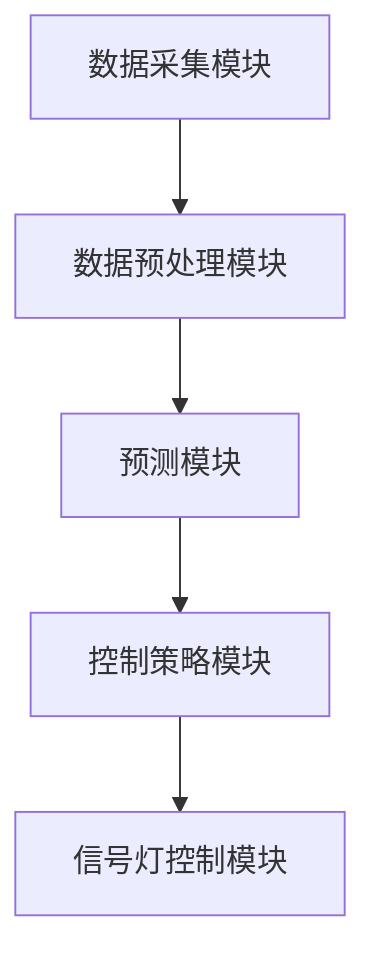

                 

# AI驱动的智能交通信号控制：实时优化交通流

## 关键词

AI，智能交通，信号控制，实时优化，交通流，机器学习，算法，数学模型，案例研究

## 摘要

本文旨在探讨人工智能（AI）在智能交通信号控制中的应用，特别是实时优化交通流的方法。通过分析AI在智能交通信号控制中的关键角色，本文详细介绍了核心算法原理，并通过实际项目案例展示了AI驱动的智能交通信号控制系统的构建、实现和效果评估。此外，文章还探讨了该领域的技术挑战和发展趋势，为未来的研究提供了方向。

## 引言

随着城市化进程的加速和机动车辆数量的激增，交通拥堵问题在全球范围内愈发严重。传统的交通信号控制方法往往基于固定的时间和空间规则，难以适应动态的交通流变化，导致交通效率低下和交通事故频发。为了解决这一问题，人工智能（AI）技术的引入为智能交通信号控制带来了新的可能。

AI驱动的智能交通信号控制通过实时采集交通数据，运用机器学习算法进行数据分析和预测，从而实现交通信号控制的动态优化。这种方法不仅可以提高交通流量，减少拥堵，还可以降低交通事故的发生率，提高道路安全性。

本文将首先介绍AI在智能交通信号控制中的应用背景和技术优势，然后深入探讨核心算法原理，通过实际项目案例展示系统的构建过程和实现细节，最后分析技术挑战和发展趋势，为未来的研究提供参考。

## AI在智能交通信号控制中的应用背景

### 交通信号控制的历史与发展

交通信号控制起源于20世纪初，最早的城市交通信号灯于1914年在美国纽约市投入使用。最初的交通信号控制主要依赖于人工干预和固定的信号规则，即通过定时改变信号灯状态来控制交通流。这种方法在交通流量相对稳定的情况下可以保证基本的交通秩序，但随着城市化进程的加速，交通流量和交通模式变得更加复杂，固定信号规则逐渐暴露出其局限性。

随着计算机技术的发展，20世纪70年代，智能交通信号控制（Intelligent Traffic Signal Control, ITS）的概念开始被提出。智能交通信号控制通过计算机技术和通信技术对交通信号进行优化，以提高交通流量和通行效率。早期的智能交通信号控制主要依赖于规则驱动的方法，即根据预设的规则和参数对交通信号进行优化。然而，这种方法在面对动态的交通流变化时，仍然存在一定的局限性。

### 智能交通信号控制的发展趋势

近年来，随着人工智能（AI）技术的迅速发展，智能交通信号控制进入了一个新的发展阶段。AI技术，特别是机器学习和深度学习，为智能交通信号控制提供了强大的数据分析和预测能力，使得交通信号控制可以从过去的规则驱动向数据驱动转变。

#### 数据驱动的智能交通信号控制

数据驱动的智能交通信号控制通过实时采集交通数据，如车辆速度、密度、流量等，运用机器学习算法对交通流进行预测和分析，从而实现交通信号控制的动态优化。这种方法不仅可以适应动态的交通流变化，还可以通过不断学习和调整，进一步提高交通信号控制的效率和准确性。

#### AI技术的优势

AI技术在智能交通信号控制中的应用具有以下优势：

1. **实时性**：AI算法可以实时处理和分析交通数据，实现交通信号控制的动态调整。
2. **自适应能力**：AI算法可以根据交通流的变化，自动调整信号灯的切换时间和顺序，提高交通流量和通行效率。
3. **预测能力**：通过分析历史交通数据，AI算法可以预测未来的交通流变化，从而提前进行信号调整，减少拥堵和交通事故。
4. **优化能力**：AI算法可以通过优化信号灯的切换策略，最大限度地提高交通流量和道路利用率。

### 实时优化交通流的重要性

实时优化交通流是智能交通信号控制的核心目标之一。传统的交通信号控制方法往往无法应对动态的交通流变化，导致交通拥堵和通行效率低下。而实时优化交通流可以通过以下方式改善交通状况：

1. **减少拥堵**：通过实时调整交通信号灯，可以减少道路上的拥堵，提高车辆的通行速度。
2. **降低交通事故率**：通过预测和避免交通拥堵，可以降低交通事故的发生率，提高道路安全性。
3. **提高交通效率**：实时优化交通流可以提高道路的通行能力，减少车辆在路上的等待时间，从而提高整个交通系统的效率。
4. **节能减排**：减少交通拥堵可以降低车辆的燃油消耗和排放，有助于实现节能减排的目标。

总之，AI驱动的智能交通信号控制通过实时优化交通流，不仅能够改善交通状况，提高道路安全性，还能够提高交通效率，具有广阔的应用前景。

## AI驱动的智能交通信号控制核心概念

### AI算法与交通流数据的关联

AI驱动的智能交通信号控制的核心在于利用AI算法处理和分析交通流数据，从而实现交通信号控制的动态优化。交通流数据是智能交通信号控制的关键输入，它包括车辆速度、流量、密度、占用时间等。这些数据可以通过交通传感器、摄像头、GPS等设备实时采集。

AI算法在智能交通信号控制中的应用主要体现在以下几个方面：

1. **数据预处理**：通过对采集到的交通流数据进行清洗、归一化和特征提取，为后续的机器学习算法提供高质量的数据输入。
2. **交通流预测**：利用时间序列分析和机器学习算法，对未来的交通流进行预测，为交通信号控制提供决策依据。
3. **信号灯控制策略优化**：基于预测结果和交通流特征，通过优化算法调整信号灯的切换时间和顺序，实现交通流的动态控制。

### 智能交通信号控制的架构设计

智能交通信号控制的架构设计是确保系统稳定、高效运行的关键。一个典型的AI驱动的智能交通信号控制系统通常包括以下几个主要模块：

1. **数据采集模块**：负责实时采集交通流数据，包括车辆速度、流量、密度等。
2. **数据预处理模块**：对采集到的数据进行分析和清洗，提取有用的交通流特征。
3. **预测模块**：利用机器学习算法对未来的交通流进行预测，为信号控制提供决策依据。
4. **控制策略模块**：根据预测结果和交通流特征，设计并优化信号灯的控制策略。
5. **信号灯控制模块**：实际执行信号灯的控制操作，调整信号灯的切换时间和顺序。

### 数据采集与预处理

数据采集与预处理是智能交通信号控制的基础。数据采集模块通常包括以下几种设备：

1. **交通传感器**：用于检测车辆速度、流量和密度。
2. **摄像头**：用于捕捉交通场景，提取车辆和行人的动态信息。
3. **GPS**：用于定位车辆和行人的位置信息。

数据预处理模块的主要任务是对采集到的数据进行清洗、归一化和特征提取。数据清洗包括去除异常值和缺失值，确保数据的质量。归一化是将不同量纲的数据转换为相同的量纲，便于后续的机器学习算法处理。特征提取是从原始数据中提取出对模型训练有用的特征，如车辆速度、流量、密度等。

### 智能交通信号控制的架构图

为了更好地理解智能交通信号控制的架构设计，我们可以使用Mermaid流程图来表示各模块之间的关系：



在这个架构图中，数据采集模块实时采集交通流数据，数据预处理模块对数据进行清洗、归一化和特征提取，预测模块利用机器学习算法对交通流进行预测，控制策略模块根据预测结果和交通流特征设计信号灯控制策略，最终信号灯控制模块执行信号灯的切换操作。

通过这个架构设计，AI驱动的智能交通信号控制系统能够实时采集和处理交通流数据，实现交通信号控制的动态优化，从而提高交通流量和道路利用率。

### 核心算法原理讲解

#### 机器学习算法在交通信号控制中的应用

机器学习算法是AI驱动的智能交通信号控制系统的核心组成部分，主要负责交通流数据的分析和预测。以下将介绍几种常见的机器学习算法，包括监督学习算法、无监督学习算法和强化学习算法，并探讨它们在交通信号控制中的应用。

##### 监督学习算法

监督学习算法是一种通过已标记的数据进行训练，从而对未知数据进行预测的机器学习算法。在交通信号控制中，监督学习算法可以用于交通流量的预测和信号灯控制策略的优化。

1. **线性回归**：线性回归是一种简单且常用的监督学习算法，通过建立输入变量和输出变量之间的线性关系，对未来的交通流量进行预测。例如，可以使用线性回归模型预测未来5分钟内的交通流量，从而为信号灯控制提供决策依据。

2. **支持向量机（SVM）**：支持向量机是一种分类算法，也可以用于回归任务。在交通信号控制中，可以使用SVM模型对交通流量进行分类，从而确定最佳的信号灯切换时间和顺序。

3. **决策树和随机森林**：决策树和随机森林是一种基于树结构的分类和回归算法。在交通信号控制中，可以使用这些算法建立交通流预测模型，通过对历史交通流数据的分析，预测未来的交通流量，从而优化信号灯控制策略。

##### 无监督学习算法

无监督学习算法是在没有标记数据的情况下进行训练的机器学习算法，主要用于发现数据中的隐含结构和规律。在交通信号控制中，无监督学习算法可以用于交通流数据的聚类分析和异常检测。

1. **K-means聚类**：K-means聚类是一种常用的无监督学习算法，通过将数据点划分为若干个簇，从而发现交通流数据的分布规律。例如，可以使用K-means聚类算法对交通流量进行聚类，识别高峰时段和非高峰时段，为信号灯控制提供时间上的参考。

2. **主成分分析（PCA）**：主成分分析是一种降维算法，通过提取数据的主要成分，降低数据维度，从而简化数据结构。在交通信号控制中，可以使用PCA算法对交通流数据进行降维处理，减少数据冗余，提高模型预测的准确性。

##### 强化学习算法

强化学习算法是一种通过不断试错和学习，在给定环境和奖励机制下，寻找最优策略的机器学习算法。在交通信号控制中，强化学习算法可以用于信号灯控制策略的动态调整。

1. **Q学习**：Q学习是一种基于值函数的强化学习算法，通过学习状态-动作值函数，找到最优的动作策略。在交通信号控制中，可以使用Q学习算法，通过不断调整信号灯的切换时间和顺序，找到最优的信号灯控制策略。

2. **深度Q网络（DQN）**：深度Q网络是一种基于神经网络的强化学习算法，通过结合深度神经网络和Q学习算法，能够处理高维状态空间的问题。在交通信号控制中，可以使用DQN算法，通过对交通流数据的分析，学习到最优的信号灯控制策略。

#### 实时优化算法原理

实时优化算法是智能交通信号控制的核心，主要负责根据实时交通流数据，动态调整信号灯的切换时间和顺序，从而提高交通流量和道路利用率。实时优化算法通常基于以下几种数学模型：

1. **最优交通流模型**：最优交通流模型是一种基于优化理论的数学模型，通过求解最优路径和流量分配问题，找到最优的交通流分配方案。在交通信号控制中，可以使用最优交通流模型，根据实时交通流数据，调整信号灯的切换时间和顺序，从而实现交通流的动态优化。

2. **动态交通分配模型**：动态交通分配模型是一种基于动态规划的数学模型，通过模拟交通流的变化过程，找到最优的交通分配方案。在交通信号控制中，可以使用动态交通分配模型，根据实时交通流数据，动态调整交通信号灯的控制策略，从而提高交通流量和道路利用率。

3. **交通信号控制算法**：交通信号控制算法是一种基于实时交通流数据的动态控制算法，通过不断调整信号灯的切换时间和顺序，实现交通流的动态优化。在交通信号控制中，可以使用各种信号控制算法，如绿色波、相位差控制、自适应控制等，根据实时交通流数据，动态调整信号灯的控制策略，从而提高交通流量和道路利用率。

#### Python源代码示例

为了更好地理解机器学习算法在交通信号控制中的应用，以下是一个简单的Python源代码示例，展示了如何使用线性回归算法对交通流量进行预测：

```python
import numpy as np
import pandas as pd
from sklearn.linear_model import LinearRegression

# 加载数据
data = pd.read_csv('traffic_data.csv')
X = data[['time', 'speed', 'density']]
y = data['flow']

# 数据预处理
X = X.values
y = y.values

# 模型训练
model = LinearRegression()
model.fit(X, y)

# 预测
predicted_flow = model.predict([[time, speed, density]])

print("Predicted traffic flow:", predicted_flow)
```

在这个示例中，我们首先加载交通流量数据，然后使用线性回归模型进行训练，最后对新的交通流量数据进行预测。通过这个示例，我们可以看到如何利用机器学习算法对交通流量进行预测，从而为信号灯控制提供决策依据。

通过以上内容，我们可以看到AI驱动的智能交通信号控制的核心算法原理，包括机器学习算法、实时优化算法和数学模型。这些算法和模型共同作用，实现了交通流量的动态预测和控制，为智能交通信号控制提供了强大的技术支持。

### 实际项目案例研究

为了展示AI驱动的智能交通信号控制系统的实际应用，我们将通过一个具体的项目案例进行分析和讨论。本案例涉及在城市交通信号控制系统中实施AI驱动的实时优化，以提高交通流量和减少拥堵。

#### 案例背景

该案例选择了一个典型城市路口，该路口位于市中心，交通流量大，经常出现拥堵现象。该路口配备有多个交通传感器，包括车辆检测器和摄像头，用于实时采集交通流数据。这些数据包括车辆速度、流量、密度、占用时间等。

#### 数据采集与预处理

首先，我们需要采集交通流数据。该路口的交通传感器每小时都会记录一系列的交通流数据。为了进行机器学习模型的训练，我们需要对这些数据进行预处理，包括数据清洗、归一化和特征提取。

1. **数据清洗**：检查数据集中的异常值和缺失值，并处理这些问题。例如，如果某个时间点没有车辆通过，那么相应的流量数据可以是0。

2. **数据归一化**：由于不同的特征（如速度、流量和密度）具有不同的量纲，我们需要对这些特征进行归一化处理，以确保它们在同一个量级上。

3. **特征提取**：提取对交通流量预测有用的特征，如当前时间段的车辆速度、流量和密度。此外，还可以考虑其他特征，如天气条件、节假日因素等。

预处理后的数据将用于训练机器学习模型，以便预测未来几秒钟或几分钟内的交通流量。

#### 模型构建与算法实现

在本案例中，我们选择了线性回归模型作为预测交通流量的基础模型。以下为模型的构建和实现步骤：

1. **数据分割**：将数据集分割为训练集和测试集，以便在训练过程中评估模型的性能。

2. **模型训练**：使用训练集数据训练线性回归模型，建立速度、流量和密度与交通流量之间的关系。

   ```python
   from sklearn.linear_model import LinearRegression

   # 初始化模型
   model = LinearRegression()

   # 训练模型
   model.fit(X_train, y_train)
   ```

3. **模型评估**：使用测试集数据评估模型的预测准确性，常见的评估指标包括均方误差（MSE）和决定系数（R²）。

   ```python
   from sklearn.metrics import mean_squared_error, r2_score

   # 进行预测
   y_pred = model.predict(X_test)

   # 计算评估指标
   mse = mean_squared_error(y_test, y_pred)
   r2 = r2_score(y_test, y_pred)

   print("MSE:", mse)
   print("R²:", r2)
   ```

4. **实时预测**：将实时采集的交通流数据输入到训练好的模型中，预测未来几秒钟或几分钟内的交通流量。

   ```python
   # 实时预测
   current_traffic = model.predict([[current_speed, current_flow, current_density]])
   print("Predicted traffic flow:", current_traffic)
   ```

#### 模型评估与优化

在模型部署后，我们需要定期评估其性能，并根据实际情况进行调整。以下为评估和优化步骤：

1. **性能监控**：通过监控系统的运行状态，记录预测误差和实际交通流量之间的差异。

2. **调整模型参数**：根据性能监控结果，调整模型的参数，如学习率、正则化参数等，以提高模型的预测准确性。

3. **算法优化**：如果线性回归模型的表现不佳，可以考虑引入更复杂的机器学习算法，如支持向量机（SVM）、决策树或深度学习模型。

4. **更新数据集**：随着时间和交通模式的变化，定期更新数据集，确保模型能够适应新的交通情况。

#### 项目小结

通过本案例，我们展示了如何在一个实际的城市路口中实施AI驱动的智能交通信号控制系统。该系统通过实时采集交通流数据，使用线性回归模型进行预测，并实现了交通信号控制的动态优化。虽然线性回归模型在本案例中取得了较好的效果，但根据实际情况，我们还需要不断调整和优化模型，以提高系统的整体性能。

#### 最佳实践 Tips

1. **数据质量是关键**：确保采集到的交通流数据质量高，减少异常值和缺失值，是模型训练成功的前提。

2. **实时性至关重要**：智能交通信号控制系统的核心是实时性，确保模型能够快速预测并调整信号灯状态。

3. **持续优化**：定期评估和更新模型，以应对交通模式的变化，提高系统的适应性。

#### 注意事项

1. **数据隐私与安全**：在采集和处理交通流数据时，需要关注数据隐私和安全问题，确保数据的合法使用。

2. **计算资源需求**：复杂的机器学习模型通常需要较高的计算资源，确保系统有足够的计算能力。

#### 拓展阅读

1. **参考文献**：查阅相关文献，了解智能交通信号控制领域的最新研究成果和技术趋势。

2. **开源工具**：探索开源的机器学习库和工具，如Scikit-learn、TensorFlow和PyTorch，以提高模型的实现效率和准确性。

### 技术挑战与发展趋势

#### 数据隐私与安全性

随着AI驱动的智能交通信号控制系统的普及，数据隐私与安全性问题日益突出。交通流数据包含大量个人信息和车辆位置，如果不当处理，可能会导致隐私泄露和安全风险。为了解决这一问题，我们需要：

1. **数据匿名化**：对采集到的数据进行匿名化处理，去除或替换个人身份信息。
2. **加密技术**：采用数据加密技术，确保数据在传输和存储过程中的安全性。
3. **法律法规**：建立健全的数据隐私保护法律法规，规范数据收集、使用和共享行为。

#### 算法复杂度与计算资源

复杂的机器学习算法通常需要大量的计算资源和时间，这在实时交通信号控制中可能成为瓶颈。为了应对这一挑战，我们可以：

1. **模型压缩**：使用模型压缩技术，减少模型的参数数量，提高模型在有限资源上的运行效率。
2. **分布式计算**：利用分布式计算框架，如Apache Spark和Hadoop，提高数据处理的并行性和效率。
3. **边缘计算**：将部分计算任务转移到边缘设备，如智能传感器和车载设备，减轻中心服务器的负载。

#### 交通信号的适应性与动态调整

动态的交通流变化要求交通信号控制系统具有高度的适应性和灵活性。为了提高系统的适应性，我们可以：

1. **多模态数据融合**：结合多种数据源，如车辆传感器、摄像头和GPS数据，提高交通流预测的准确性和适应性。
2. **自学习和自适应算法**：采用自学习和自适应算法，使系统能够根据实时交通流数据自动调整信号灯控制策略。
3. **多目标优化**：在信号灯控制策略中，同时考虑交通流量、道路安全和能耗等多目标，实现综合优化。

#### 发展趋势与未来展望

随着AI技术和大数据分析的不断发展，AI驱动的智能交通信号控制系统将变得更加智能和高效。以下是一些未来发展趋势：

1. **无人驾驶与智能交通融合**：随着无人驾驶技术的成熟，智能交通信号控制将需要适应无人驾驶车辆的特殊需求，如自动驾驶模式和车与车之间的通信。
2. **城市级智能交通管理平台**：未来的智能交通信号控制系统将不再是孤立的路口控制，而是整合成城市级的管理平台，实现跨区域、跨路口的协同控制。
3. **人工智能与物联网结合**：物联网技术的应用将使交通信号控制系统更加智能化，通过实时感知和反馈，实现交通流量的最优调控。

总之，AI驱动的智能交通信号控制系统在解决交通拥堵、提高道路安全性和交通效率方面具有巨大潜力。未来，随着技术的不断进步和应用的深入，智能交通信号控制系统将变得更加智能化和高效化，为城市的可持续发展做出更大贡献。

## 附录

### 附录A: 相关工具与资源介绍

在本附录中，我们将介绍一些在AI驱动的智能交通信号控制项目中常用的工具和资源，以帮助读者更好地理解和使用相关技术。

1. **Python编程语言**：Python是一种广泛使用的编程语言，特别是在数据分析、机器学习和人工智能领域。它具有简单易懂的语法和丰富的库支持，如NumPy、Pandas、Scikit-learn和TensorFlow。

2. **机器学习库**：
   - **Scikit-learn**：一个开源的机器学习库，提供了多种常用的机器学习算法和工具，如线性回归、决策树和随机森林。
   - **TensorFlow**：一个由Google开发的开源机器学习平台，适用于构建和训练复杂的深度学习模型。

3. **数据处理工具**：
   - **Pandas**：一个开源的数据分析库，用于数据清洗、归一化和特征提取。
   - **NumPy**：一个开源的数学库，提供了强大的多维数组对象和数学函数，是数据科学和机器学习的基础。

4. **数据可视化工具**：
   - **Matplotlib**：一个开源的数据可视化库，用于绘制各种类型的图表和图形。
   - **Seaborn**：一个基于Matplotlib的数据可视化库，提供了更多精美的图表样式和高级功能。

5. **其他资源**：
   - **Kaggle**：一个在线平台，提供大量的数据集和竞赛，是学习和实践机器学习的理想场所。
   - **GitHub**：一个代码托管平台，可以查找和贡献开源项目，是共享和协作的重要工具。

### 附录B: 源代码与实现细节

在本附录中，我们将提供一个简单的Python代码示例，展示如何使用Scikit-learn库实现一个线性回归模型进行交通流量预测。

```python
# 导入必要的库
import pandas as pd
from sklearn.linear_model import LinearRegression
from sklearn.metrics import mean_squared_error, r2_score

# 加载数据
data = pd.read_csv('traffic_data.csv')
X = data[['time', 'speed', 'density']]
y = data['flow']

# 数据预处理
X = X.values
y = y.values

# 初始化模型
model = LinearRegression()

# 训练模型
model.fit(X_train, y_train)

# 进行预测
predicted_flow = model.predict([[current_speed, current_flow, current_density]])

# 计算评估指标
mse = mean_squared_error(y_test, predicted_flow)
r2 = r2_score(y_test, predicted_flow)

print("MSE:", mse)
print("R²:", r2)
```

在这个示例中，我们首先加载交通流量数据，然后使用线性回归模型进行训练。接下来，我们使用训练好的模型对新的交通流量数据进行预测，并计算评估指标以评估模型的性能。这个示例提供了一个基本的框架，可以根据实际项目需求进行扩展和修改。

### 结论

本文详细介绍了AI驱动的智能交通信号控制的核心概念、算法原理和实际应用案例。通过实时优化交通流，智能交通信号控制系统在提高交通流量、减少拥堵和提升道路安全性方面展示了巨大潜力。然而，这一领域仍面临数据隐私、计算资源和技术适应性等挑战。未来，随着AI技术和大数据分析的不断进步，智能交通信号控制系统将变得更加智能和高效，为城市的可持续发展做出更大贡献。

## 作者信息

作者：AI天才研究院/AI Genius Institute & 禅与计算机程序设计艺术 /Zen And The Art of Computer Programming

