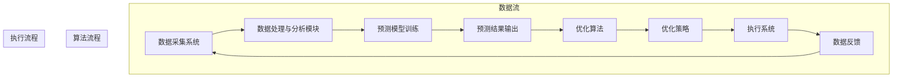

                 

### 1.3 供应链库存优化的挑战与机遇

#### 1.3.1 挑战

供应链库存优化面临着多方面的挑战。首先，数据的复杂性是首要问题。供应链中的数据来源广泛且多样，包括订单信息、库存水平、供应商信息等，这些数据往往是非结构化的，需要通过数据清洗和预处理才能用于后续的模型训练。其次，市场需求的不确定性给库存管理带来了困难。市场需求受到季节性、节假日、市场动态等多种因素的影响，导致需求预测的准确性成为关键挑战。此外，供应链的全球化使得库存优化需要考虑更多的地理因素，如运输成本、关税等，增加了问题的复杂度。

#### 1.3.2 机遇

尽管存在挑战，AI技术的应用为供应链库存优化带来了巨大的机遇。首先，机器学习和深度学习算法能够处理大量复杂数据，通过数据挖掘和分析，帮助企业更准确地预测市场需求，优化库存水平。其次，AI技术可以自动化库存优化流程，减少人工干预，提高库存管理的效率和准确性。此外，AI技术还可以通过实时监控和预警系统，及时识别供应链中的潜在问题，并快速采取应对措施，降低缺货风险。

### 1.4 本书内容结构

本书旨在为读者提供全面的AI驱动的智能供应链库存优化指南。以下是本书的结构概述：

#### 第二部分：AI基础与技术原理
- 人工智能概述
- 数据科学与机器学习基础
- AI在供应链管理中的应用现状
- AI驱动的供应链库存优化基本框架

#### 第三部分：核心概念与联系
- 供应链库存管理核心概念
- AI算法与供应链库存优化的结合
- Mermaid流程图：AI在供应链库存优化中的流程

#### 第四部分：核心算法原理讲解
- 预测算法
- 库存优化算法
- 数学模型与公式讲解

#### 第五部分：数学模型和数学公式讲解
- 概率论与统计模型
- 优化算法的数学基础
- 案例讲解与数学公式应用

#### 第六部分：项目实战
- 实战一：需求预测与库存优化模型搭建
- 实战二：AI驱动的智能供应链库存优化系统

#### 第七部分：总结与展望
- 主要内容回顾
- 未来的发展方向
- 建议与进一步学习资源

通过以上章节的深入讲解，读者将能够全面理解AI驱动的智能供应链库存优化的原理和实践，掌握相关技术和工具，实现库存成本的有效控制和缺货风险的降低。### 第二部分：AI基础与技术原理

## 2.1 人工智能概述

### 2.1.1 人工智能的定义与发展历程

人工智能（Artificial Intelligence, AI）是指通过计算机模拟人类智能行为的技术。它起源于20世纪50年代，当时科学家们首次提出了“人工智能”的概念。自那时起，人工智能经历了多个发展阶段，从早期的规则推理和知识表示，到现代的机器学习和深度学习。

在早期，人工智能主要依赖于专家系统和逻辑推理。专家系统通过模拟人类专家的推理过程来解决复杂问题。然而，这种方法在处理大规模数据和动态环境时表现不佳。

随着计算机性能的提升和大数据技术的发展，机器学习逐渐成为人工智能的主要研究方向。机器学习利用大量数据训练模型，使其能够自动发现数据中的模式和规律。深度学习作为机器学习的子领域，通过多层神经网络模拟人类大脑的处理方式，取得了突破性的进展。

### 2.1.2 人工智能的关键技术

人工智能的关键技术包括机器学习、深度学习、自然语言处理、计算机视觉等。每种技术都有其独特的应用场景和优势。

- **机器学习**：通过训练数据集来构建模型，使其能够对未知数据进行预测或分类。常见的机器学习算法包括线性回归、决策树、支持向量机等。
- **深度学习**：基于多层神经网络的结构，通过逐层提取数据中的特征，能够处理更复杂的数据和问题。深度学习的应用包括图像识别、语音识别、自然语言处理等。
- **自然语言处理**：使计算机能够理解和生成自然语言，包括语音识别、语言翻译、文本分析等。自然语言处理在客户服务、智能助理等领域有广泛应用。
- **计算机视觉**：使计算机能够理解和处理图像和视频数据，包括人脸识别、物体检测、图像分类等。计算机视觉在安防监控、自动驾驶等领域具有重要应用。

### 2.1.3 人工智能在供应链管理中的应用

人工智能在供应链管理中的应用正在不断拓展。以下是一些典型的应用场景：

- **需求预测**：通过分析历史销售数据、市场趋势等信息，使用机器学习和深度学习算法预测未来的需求，优化库存水平。
- **库存优化**：基于预测结果和供应链数据，使用优化算法确定最佳的库存策略，以降低库存成本和缺货风险。
- **物流优化**：通过路径规划、车辆调度等技术，提高物流运输的效率和降低成本。
- **供应链可视化**：利用计算机视觉技术对供应链中的物流和库存进行实时监控和可视化，提高供应链的透明度和响应速度。
- **风险预测与控制**：通过分析供应链中的各种数据，预测潜在的风险，并采取相应的控制措施，降低供应链中断的风险。

总之，人工智能在供应链管理中的应用不仅提高了运营效率，还为企业带来了显著的成本节约和风险控制效果。随着技术的不断进步，人工智能将在供应链管理中发挥越来越重要的作用。## 2.2 数据科学与机器学习基础

### 2.2.1 数据科学的基本概念

数据科学是一门跨学科领域，结合了统计学、计算机科学、信息学、领域知识等多个学科，旨在从数据中提取有价值的信息和知识。数据科学的核心是数据预处理、数据分析和数据可视化。

- **数据预处理**：数据预处理是数据科学中至关重要的一步，包括数据清洗、数据集成、数据转换和数据归一化。数据清洗旨在去除重复数据、缺失数据和异常数据，确保数据的质量和一致性。数据集成涉及将来自不同源的数据整合在一起，数据转换则包括数据格式的转换和数据类型的转换。数据归一化通过将数据缩放到相同的范围内，提高了不同特征之间的可比性。

- **数据分析**：数据分析是数据科学中的核心步骤，包括描述性分析、推断性分析和预测性分析。描述性分析旨在描述数据的基本特征，如均值、中位数、方差等。推断性分析通过假设检验和置信区间等方法，对数据中的变量关系进行推断。预测性分析通过建立预测模型，对未来数据或事件进行预测。

- **数据可视化**：数据可视化是将数据转换成图形或图表，以便于人们理解和分析。常见的可视化工具包括Matplotlib、Seaborn、Plotly等。

### 2.2.2 机器学习的基本概念

机器学习是数据科学中的一个重要分支，旨在通过训练数据集来构建模型，使其能够对未知数据进行预测或分类。机器学习可以分为监督学习、无监督学习和强化学习。

- **监督学习**：监督学习是一种常见的机器学习方法，其中模型通过训练数据集学习输入和输出之间的映射关系。常见的监督学习算法包括线性回归、决策树、随机森林、支持向量机等。

- **无监督学习**：无监督学习不依赖于标注数据，其目标是发现数据中的模式和结构。常见的无监督学习算法包括聚类算法（如K-均值聚类、层次聚类）、降维算法（如主成分分析、t-SNE）等。

- **强化学习**：强化学习是一种基于反馈的机器学习方法，其中模型通过与环境的交互学习最优策略。常见的强化学习算法包括Q学习、深度Q网络（DQN）、策略梯度算法等。

### 2.2.3 数据科学在供应链管理中的应用

数据科学在供应链管理中的应用非常广泛，以下是几个典型的应用场景：

- **需求预测**：通过分析历史销售数据、市场趋势、季节性因素等，使用机器学习算法预测未来的需求。这有助于企业优化库存水平，减少缺货和过度库存的风险。

- **库存优化**：基于需求预测结果和供应链数据，使用优化算法确定最佳的库存策略，以降低库存成本和缺货风险。常见的优化算法包括线性规划、整数规划、遗传算法等。

- **物流优化**：通过分析物流数据，如运输时间、运输成本、运输路线等，使用机器学习和优化算法优化物流流程，提高运输效率和降低成本。

- **供应链可视化**：利用数据可视化技术，对供应链中的物流和库存进行实时监控和可视化，提高供应链的透明度和响应速度。

- **风险管理**：通过分析供应链中的各种数据，预测潜在的风险，如供应中断、库存积压等，并采取相应的控制措施，降低供应链中断的风险。

### 2.2.4 数据科学与机器学习工具

在进行数据科学和机器学习任务时，常用的工具包括Python、R、Jupyter Notebook等。

- **Python**：Python是一种广泛应用于数据科学和机器学习的编程语言，其具有简洁易读的语法和丰富的库，如NumPy、Pandas、Scikit-learn、TensorFlow、PyTorch等。

- **R**：R是一种专门为统计分析和图形制作设计的编程语言，广泛应用于数据科学领域。

- **Jupyter Notebook**：Jupyter Notebook是一种交互式的计算环境，支持多种编程语言，如Python、R、Julia等。它提供了便于分享和复现代码的文档，是数据科学家和机器学习工程师常用的工具。

通过掌握数据科学和机器学习的基础知识，以及熟练使用相关的工具，供应链管理者可以更好地利用数据，优化供应链管理，提高企业的竞争力。### 2.3 AI在供应链管理中的应用现状

### 2.3.1 AI技术在供应链管理中的普及程度

随着技术的进步和数据量的增长，AI在供应链管理中的应用已经逐渐普及。越来越多的企业开始采用AI技术来优化供应链管理，提高效率和降低成本。根据市场调研公司的报告，AI技术在供应链管理中的应用正在快速增长，预计到2025年，全球将有超过一半的大型企业采用AI技术进行供应链管理。

### 2.3.2 典型应用案例分析

- **沃尔玛**：沃尔玛是美国最大的零售商之一，也是AI技术应用的先驱。沃尔玛使用AI技术进行需求预测和库存管理。通过分析历史销售数据、季节性因素和市场需求变化，沃尔玛能够更准确地预测未来需求，从而优化库存水平，减少库存积压和缺货情况。

- **亚马逊**：作为全球最大的电子商务平台，亚马逊在物流和供应链管理中广泛应用AI技术。亚马逊使用AI算法来优化库存管理、运输路径规划和订单处理。例如，通过使用机器学习模型，亚马逊能够预测最佳的库存策略，确保产品在适当的时间出现在正确的地点，从而降低库存成本和缺货风险。

- **达美乐披萨**：达美乐披萨是一家全球知名的快餐连锁品牌，它使用AI技术来优化配送路线。达美乐披萨的AI系统能够根据订单地点、交通状况和配送人员位置，动态调整配送路线，以最大限度地减少配送时间和成本。

### 2.3.3 AI技术带来的优势与挑战

#### 优势

- **需求预测的准确性**：AI技术通过分析大量历史数据和市场趋势，能够更准确地预测市场需求，帮助企业优化库存策略，减少库存成本和缺货风险。

- **物流优化的效率**：AI技术能够优化运输路径和车辆调度，提高物流运输的效率和降低成本。例如，通过使用机器学习模型，企业可以预测最佳的配送路线和时间，减少交通拥堵和延误。

- **供应链的可视化与透明度**：AI技术通过实时监控和数据分析，提高了供应链的透明度和可视化程度。企业可以实时了解供应链中的物流和库存情况，及时识别和解决问题，提高供应链的灵活性和响应速度。

#### 挑战

- **数据质量和隐私**：AI技术依赖于大量高质量的数据，但数据质量的好坏直接影响模型的性能。此外，数据隐私和安全问题也是AI技术在供应链管理中面临的挑战。

- **技术实现的复杂性**：AI技术的实现需要专业的技术团队和先进的技术支持，这增加了企业的技术投入和实施难度。

- **人才短缺**：AI技术人才短缺也是企业面临的一个问题。许多企业难以招聘和留住具有AI技术背景的专业人才。

### 2.3.4 AI技术在供应链管理中的未来发展趋势

- **更加智能化的供应链**：随着AI技术的不断发展，供应链将变得更加智能化和自动化。未来，企业将能够通过AI技术实现端到端的全流程管理，从需求预测、库存管理到物流配送，各个环节都将实现高度自动化和智能化。

- **定制化的供应链解决方案**：AI技术将帮助企业实现更加定制化的供应链解决方案。通过分析企业的具体需求和业务场景，AI技术可以提供个性化的优化方案，帮助企业提高运营效率和降低成本。

- **跨界合作与集成**：未来，AI技术将在供应链管理中与其他领域的技术（如物联网、区块链等）实现更深入的融合，形成跨界合作的供应链生态系统。

总的来说，AI技术在供应链管理中的应用带来了显著的优势和挑战。随着技术的不断进步，AI技术在供应链管理中的地位将越来越重要，企业需要积极拥抱新技术，以保持竞争力。### 2.4 AI驱动的供应链库存优化基本框架

### 2.4.1 架构概述

AI驱动的供应链库存优化架构通常由以下几个关键组件组成：数据采集系统、数据处理与分析模块、预测模型、优化算法和执行系统。

#### 数据采集系统
数据采集系统负责从供应链的各个环节（如采购、生产、仓储、物流、销售等）收集数据。这些数据包括销售记录、库存水平、运输时间、供应链状态等。数据采集系统的目标是确保数据的及时性、完整性和准确性。

#### 数据处理与分析模块
数据处理与分析模块负责对采集到的数据进行清洗、预处理和特征提取。数据清洗包括去除重复数据、填充缺失值、处理异常值等。预处理包括数据归一化、标准化等操作。特征提取是从原始数据中提取出对预测和优化有重要意义的特征。常用的特征提取方法包括时间序列分解、主成分分析（PCA）等。

#### 预测模型
预测模型是库存优化系统的核心，用于预测未来的市场需求、库存水平和供应链状态。常见的预测模型包括时间序列分析模型（如ARIMA、LSTM）、机器学习模型（如随机森林、支持向量机）和深度学习模型（如卷积神经网络、循环神经网络）。预测模型的选择取决于数据的类型、特征和预测目标。

#### 优化算法
优化算法负责根据预测结果和供应链约束条件，制定最优的库存策略。常见的优化算法包括线性规划、整数规划、遗传算法、模拟退火等。优化算法的目标是降低库存成本、减少缺货风险和提高供应链的灵活性。

#### 执行系统
执行系统负责将优化结果转化为实际的库存操作，包括订单处理、库存调整、物流调度等。执行系统通常与企业的ERP、WMS（仓库管理系统）和TMS（运输管理系统）等系统集成，确保库存优化策略的有效实施。

### 2.4.2 模块间的关系

各模块之间的协作关系构成了一个闭环系统，使得供应链库存优化能够持续迭代和改进。

1. **数据采集系统 → 数据处理与分析模块**：数据采集系统收集的数据通过数据处理与分析模块进行处理，确保数据的质量和一致性。

2. **数据处理与分析模块 → 预测模型**：处理后的数据输入到预测模型中，用于训练和构建预测模型。

3. **预测模型 → 优化算法**：预测模型生成的预测结果输入到优化算法中，用于制定库存策略。

4. **优化算法 → 执行系统**：优化算法生成的优化结果通过执行系统实施，调整库存和物流操作。

5. **执行系统 → 数据采集系统**：执行系统实施后的数据反馈给数据采集系统，用于进一步的数据分析和模型训练。

通过这种闭环系统，AI驱动的供应链库存优化能够实时响应市场需求变化，动态调整库存策略，从而实现库存成本的最小化和缺货风险的降低。

### 2.4.3 实施步骤

1. **需求分析**：明确供应链的库存优化目标和关键指标，如库存成本、缺货率、服务水平等。

2. **数据采集**：构建数据采集系统，从供应链各个环节收集数据。

3. **数据处理**：对采集到的数据进行分析和预处理，提取有用的特征。

4. **模型训练**：选择合适的预测模型和优化算法，使用处理后的数据训练模型。

5. **模型评估**：评估预测模型和优化算法的性能，调整模型参数。

6. **策略制定**：根据预测结果和优化算法，制定最佳的库存策略。

7. **执行与反馈**：执行库存策略，收集反馈数据，持续优化系统。

通过以上步骤，企业可以逐步构建和优化AI驱动的供应链库存优化系统，实现供应链管理的智能化和自动化。### 第三部分：核心概念与联系

## 3.1 供应链库存管理核心概念

### 3.1.1 库存管理的基本概念

库存管理是企业物流管理中的重要组成部分，涉及到产品的存储、分类、跟踪和控制。库存管理的目标是通过优化库存水平，实现库存成本的最小化和服务水平的最大化。库存管理的基本概念包括以下几个关键方面：

1. **库存量**：库存量是指企业当前存储的产品数量。库存量包括在仓库中的现货和在途库存。

2. **库存周期**：库存周期是指产品从入库到出库的平均时间。库存周期反映了库存周转的速度，是衡量库存管理效率的重要指标。

3. **库存水平**：库存水平是指企业当前库存量的状态，包括库存量的大小、分布和结构。

4. **库存成本**：库存成本是指为维持库存水平而产生的各项费用，包括仓储费用、库存利息、库存损耗等。

5. **服务水平**：服务水平是指企业能够满足客户需求的程度，通常用服务水平率（Service Level）来衡量，服务水平率定义为满足客户需求订单的数量与总订单数量的比例。

### 3.1.2 库存管理的核心原则

库存管理遵循以下核心原则：

1. **需求驱动**：库存管理应以市场需求为导向，根据需求预测和销售计划进行库存调整。

2. **最小化成本**：在满足服务水平的前提下，通过优化库存水平和策略，降低库存成本。

3. **优化库存结构**：合理配置库存，确保关键产品和畅销品的库存充足，同时减少滞销产品和低周转率库存的持有。

4. **提高库存周转率**：通过加快库存周转，减少库存积压，降低资金占用和库存成本。

5. **供应链协同**：与供应链上下游企业协同，优化供应链库存管理，减少供应链断点和库存失衡。

### 3.1.3 库存类型

库存管理涉及多种类型的库存，包括：

1. **原料库存**：用于生产过程的原料和半成品库存。

2. **成品库存**：已完成生产准备销售的产品库存。

3. **周转库存**：用于满足短期需求，保证生产或销售顺畅的库存。

4. **安全库存**：为应对不确定的需求波动和供应中断而设置的保护性库存。

5. **在途库存**：处于运输过程中的库存，包括发货和收货过程中的库存。

### 3.1.4 库存管理的关键绩效指标（KPI）

库存管理的关键绩效指标（KPI）包括：

1. **库存周转率**：库存周转率（Inventory Turnover）是衡量库存管理效率的重要指标，计算公式为销售成本除以平均库存成本。

2. **服务水平率**：服务水平率是衡量库存服务质量的指标，计算公式为满足客户订单数量除以总订单数量。

3. **库存周转天数**：库存周转天数（Days Sales of Inventory,DSI）是库存平均周转一次所需的天数，计算公式为365天除以库存周转率。

4. **库存积压率**：库存积压率是衡量库存过剩程度的指标，计算公式为滞销库存占总库存的比例。

5. **库存准确率**：库存准确率是衡量库存记录准确性的指标，计算公式为实际库存与记录库存的一致性比例。

通过理解和应用上述库存管理核心概念，企业可以更有效地管理库存，降低库存成本，提高供应链的效率和灵活性。### 3.2 AI算法与供应链库存优化的结合

#### 3.2.1 AI算法在供应链库存优化中的作用

人工智能算法在供应链库存优化中发挥着至关重要的作用，通过提高预测准确性、优化库存水平和降低运营成本，为企业带来了显著的价值。以下是几种关键的AI算法及其在供应链库存优化中的应用：

1. **预测算法**：预测算法是库存优化的基础，通过分析历史数据和外部信息，预测未来的市场需求和库存水平。常见的预测算法包括时间序列分析（如ARIMA、LSTM）、机器学习（如随机森林、支持向量机）和深度学习（如卷积神经网络、循环神经网络）。这些算法能够处理大量复杂数据，提高预测的准确性和稳定性。

2. **优化算法**：优化算法负责根据预测结果和供应链约束条件，制定最优的库存策略。常见的优化算法包括线性规划、整数规划、遗传算法和模拟退火等。这些算法能够自动搜索最优解，提高库存管理效率和降低成本。

3. **聚类算法**：聚类算法用于将相似的产品分组，以便于库存管理和优化。例如，K-均值聚类和层次聚类可以识别不同产品的需求模式和库存水平，为库存策略提供数据支持。

4. **协同过滤**：协同过滤算法通过分析用户的购买历史和偏好，预测用户未来的需求。在供应链库存优化中，协同过滤可以用于预测市场需求，优化库存配置。

5. **强化学习**：强化学习算法通过与环境交互，学习最优的策略和决策。在供应链库存优化中，强化学习可以用于动态调整库存策略，以适应不断变化的市场需求。

#### 3.2.2 AI算法在供应链库存优化中的应用实例

以下是一些AI算法在供应链库存优化中的具体应用实例：

1. **需求预测**：使用时间序列分析和机器学习算法预测未来市场需求。例如，使用LSTM模型分析历史销售数据，预测未来的销售额。通过准确的预测，企业可以优化库存水平，减少缺货和过度库存的风险。

2. **库存优化**：使用线性规划和遗传算法优化库存水平。例如，企业可以根据预测的销售数据和供应链约束条件，使用线性规划模型确定最优的库存策略。同时，使用遗传算法优化库存配置，以适应不同产品和市场的需求。

3. **物流优化**：使用聚类算法和协同过滤算法优化物流流程。例如，使用K-均值聚类算法将不同产品分组，优化仓储和配送策略。使用协同过滤算法预测不同配送路线的效率，优化物流路线。

4. **风险管理**：使用强化学习算法预测和应对供应链风险。例如，通过模拟不同的市场情景，使用强化学习算法学习最优的风险管理策略，降低供应链中断的风险。

通过结合AI算法，企业可以更有效地管理供应链库存，提高运营效率，降低成本和风险。随着AI技术的不断进步，供应链库存优化将在未来发挥越来越重要的作用。### 3.3 Mermaid流程图：AI在供应链库存优化中的流程

为了更好地理解和展示AI在供应链库存优化中的应用流程，我们可以使用Mermaid流程图来直观地表示各个环节。以下是AI驱动的供应链库存优化流程的Mermaid图解：



**流程说明：**

1. **数据采集系统（A）**：从供应链各个环节（采购、生产、仓储、物流、销售等）收集数据，如销售记录、库存水平、运输时间等。

2. **数据处理与分析模块（B）**：对采集到的数据进行分析和预处理，包括数据清洗、特征提取和归一化，确保数据质量。

3. **预测模型训练（C）**：使用处理后的数据训练预测模型，如时间序列分析模型（ARIMA、LSTM）、机器学习模型（随机森林、支持向量机）和深度学习模型（卷积神经网络、循环神经网络）。通过模型训练，预测未来的市场需求和库存水平。

4. **预测结果输出（D）**：预测模型生成的预测结果输出，为企业提供关于未来需求和库存水平的预估。

5. **优化算法（E）**：根据预测结果和供应链约束条件，使用优化算法（如线性规划、遗传算法、模拟退火）制定最优的库存策略，以降低库存成本和缺货风险。

6. **优化策略（F）**：优化算法生成的优化策略输出，指导企业的库存调整和物流操作。

7. **执行系统（G）**：执行系统根据优化策略进行库存调整、订单处理和物流调度，确保库存策略的实施。

8. **数据反馈（H）**：执行系统实施后的数据反馈到数据采集系统，用于进一步的数据分析和模型训练，实现持续优化。

通过上述Mermaid流程图，我们可以清晰地看到AI在供应链库存优化中的各个环节和步骤，从而更好地理解整个流程。### 第四部分：核心算法原理讲解

## 4.1 预测算法

### 4.1.1 时间序列分析

时间序列分析是一种常用的预测方法，用于分析时间序列数据，并预测未来的趋势。时间序列数据是指按照时间顺序排列的数据点，例如每日的销售额、每月的订单量等。时间序列分析的核心是找到数据中的周期性、趋势性和随机性，从而建立预测模型。

#### 4.1.1.1 基本概念

时间序列分析的基本概念包括：

- **趋势（Trend）**：数据随时间变化的总体方向。
- **季节性（Seasonality）**：数据因季节性因素（如节假日、季节变化等）引起的周期性波动。
- **周期性（Cyclicity）**：数据因宏观经济因素（如经济周期、行业波动等）引起的波动。
- **随机性（Randomness）**：数据中无法预测的随机波动。

#### 4.1.1.2 常见模型

- **ARIMA模型**：自回归积分滑动平均模型（Autoregressive Integrated Moving Average, ARIMA）是一种经典的时间序列预测模型，能够处理非平稳时间序列数据。ARIMA模型由自回归（AR）、差分（I）和移动平均（MA）三个部分组成。

- **LSTM模型**：长短期记忆网络（Long Short-Term Memory, LSTM）是深度学习的一种类型，专门设计用于处理和预测长时间依赖关系。LSTM通过引入门控机制，有效地解决了传统RNN模型中的梯度消失问题。

#### 4.1.1.3 模型构建与训练

时间序列模型的构建和训练通常包括以下步骤：

1. **数据预处理**：对时间序列数据进行清洗、去噪、缺失值填充等预处理操作。
2. **特征提取**：提取与预测目标相关的特征，如趋势特征、季节性特征等。
3. **模型选择**：根据数据的特点选择合适的模型，如ARIMA、LSTM等。
4. **模型训练**：使用历史数据训练模型，调整模型参数。
5. **模型评估**：使用验证集或测试集评估模型性能，如均方误差（MSE）、均方根误差（RMSE）等。

#### 4.1.1.4 应用实例

以下是一个使用ARIMA模型进行需求预测的简单示例：

```python
import pandas as pd
from statsmodels.tsa.arima.model import ARIMA

# 加载数据
data = pd.read_csv('sales_data.csv')
sales = data['sales'].values

# 构建ARIMA模型
model = ARIMA(sales, order=(5,1,2))

# 模型训练
model_fit = model.fit()

# 预测未来5个时间点的销售
forecast = model_fit.forecast(steps=5)

# 输出预测结果
print(forecast)
```

通过上述步骤，我们可以构建一个ARIMA模型，对历史销售数据进行预测，并输出未来5个时间点的销售预测值。

### 4.1.2 机器学习预测模型

机器学习预测模型是一种基于训练数据集的预测方法，通过学习数据中的规律和模式，对未知数据进行预测。机器学习预测模型在供应链库存优化中有着广泛的应用，以下介绍几种常见的机器学习预测模型：

#### 4.1.2.1 线性回归

线性回归是一种简单的预测模型，通过建立线性关系来预测未来的数值。线性回归模型的预测公式为：

\[ y = \beta_0 + \beta_1 \cdot x_1 + \beta_2 \cdot x_2 + ... + \beta_n \cdot x_n \]

其中，\( y \) 是预测目标，\( x_1, x_2, ..., x_n \) 是输入特征，\( \beta_0, \beta_1, ..., \beta_n \) 是模型的参数。

#### 4.1.2.2 决策树

决策树是一种基于树形结构进行分类和回归的预测模型。决策树的构建过程是通过不断划分数据集，选择最优的特征和阈值，将数据划分为不同的区域。决策树的预测公式为：

\[ y = g(\theta_1 \cdot x_1 + \theta_2 \cdot x_2 + ... + \theta_n \cdot x_n) \]

其中，\( g(\cdot) \) 是激活函数，通常使用 \( g(x) = \max(x) \)。

#### 4.1.2.3 随机森林

随机森林是一种基于决策树的集成预测模型，通过构建多棵决策树，并对预测结果进行投票，提高预测的准确性。随机森林的预测公式为：

\[ y = \sum_{i=1}^{n} w_i \cdot h_i(x) \]

其中，\( w_i \) 是第 \( i \) 棵决策树的权重，\( h_i(x) \) 是第 \( i \) 棵决策树的预测值。

#### 4.1.2.4 支持向量机

支持向量机是一种基于核函数的预测模型，通过寻找最佳的超平面，将不同类别的数据点分开。支持向量机的预测公式为：

\[ y = \text{sign}(\omega \cdot x + b) \]

其中，\( \omega \) 是超平面的法向量，\( b \) 是偏置项。

#### 4.1.2.5 模型训练与评估

机器学习预测模型的训练和评估过程包括以下步骤：

1. **数据预处理**：对训练数据集进行清洗、归一化等预处理操作。
2. **模型选择**：选择合适的预测模型，如线性回归、决策树、随机森林等。
3. **模型训练**：使用训练数据集训练模型，调整模型参数。
4. **模型评估**：使用验证集或测试集评估模型性能，如均方误差（MSE）、均方根误差（RMSE）等。
5. **模型调整**：根据评估结果调整模型参数，优化模型性能。

#### 4.1.2.6 应用实例

以下是一个使用线性回归模型进行需求预测的简单示例：

```python
import pandas as pd
from sklearn.linear_model import LinearRegression

# 加载数据
data = pd.read_csv('sales_data.csv')
X = data[['feature1', 'feature2']]
y = data['sales']

# 构建线性回归模型
model = LinearRegression()

# 模型训练
model.fit(X, y)

# 预测未来5个时间点的销售
forecast = model.predict(X.iloc[-5:])

# 输出预测结果
print(forecast)
```

通过上述步骤，我们可以构建一个线性回归模型，对历史销售数据进行预测，并输出未来5个时间点的销售预测值。### 4.2 库存优化算法

### 4.2.1 基本库存管理策略

库存管理策略是供应链管理的重要组成部分，直接影响库存成本和客户服务水平。基本库存管理策略主要包括以下几种：

1. **周期性库存策略**：周期性库存策略是基于固定的时间周期（如每周、每月）进行库存检查和补充。这种策略简单易行，但可能导致库存波动较大，无法及时响应市场需求变化。

2. **固定库存量策略**：固定库存量策略是保持库存量在一定的范围内（如最低库存量和最高库存量）。这种策略可以确保库存水平稳定，但可能导致库存积压或缺货。

3. **需求驱动库存策略**：需求驱动库存策略是根据实际需求情况进行库存调整。这种策略能够更好地响应市场需求，降低库存成本，但需要实时监测需求变化。

4. **安全库存策略**：安全库存策略是为应对不确定的需求波动和供应中断而设置的库存缓冲。安全库存的设置需要考虑需求波动性、供应周期和供应链可靠性等因素。

### 4.2.2 机器学习优化算法

机器学习优化算法在库存管理中的应用，能够通过分析大量数据，实现更精准的库存预测和优化。以下是几种常见的机器学习优化算法：

1. **线性规划**：线性规划是一种用于优化线性目标函数的数学方法。在库存管理中，线性规划可以用于确定最优的库存水平，以最小化库存成本或最大化服务水平。线性规划的优化目标函数通常包括库存成本、缺货成本和持有成本等。

   **公式**：
   \[ \min Z = c^T x \]
   \[ s.t. \]
   \[ a_1 x \leq b_1 \]
   \[ a_2 x \geq b_2 \]
   \[ a_3 x = b_3 \]

   其中，\( Z \) 是目标函数，\( c \) 是系数向量，\( x \) 是决策变量，\( a_i \) 和 \( b_i \) 是约束条件。

2. **遗传算法**：遗传算法是一种基于自然选择和遗传学原理的优化算法。遗传算法通过编码、交叉、变异和选择等操作，模拟生物进化过程，搜索最优解。在库存管理中，遗传算法可以用于确定最优的库存策略，解决复杂的库存优化问题。

   **步骤**：
   - **编码**：将库存策略编码成二进制串。
   - **交叉**：通过交叉操作，生成新的个体。
   - **变异**：对个体进行变异操作，增加多样性。
   - **选择**：通过适应度函数，选择适应度较高的个体。

3. **模拟退火算法**：模拟退火算法是一种基于物理退火过程的优化算法。在库存管理中，模拟退火算法可以通过逐步降低温度，搜索全局最优解。模拟退火算法可以处理复杂的问题，并在一定程度上避免陷入局部最优。

   **步骤**：
   - **初始化**：设置初始温度和冷却速率。
   - **降温**：逐步降低温度。
   - **迭代**：在每次迭代中，根据当前温度和随机扰动，选择新的解。
   - **接受准则**：根据概率准则，决定是否接受新的解。

### 4.2.3 模型训练与评估

机器学习优化算法的训练和评估过程包括以下步骤：

1. **数据预处理**：对训练数据集进行清洗、归一化等预处理操作，确保数据质量。
2. **特征选择**：选择与库存优化目标相关的特征，如历史销售数据、季节性因素等。
3. **模型选择**：根据数据特点和优化目标，选择合适的机器学习算法，如线性规划、遗传算法、模拟退火算法等。
4. **模型训练**：使用训练数据集训练模型，调整模型参数。
5. **模型评估**：使用验证集或测试集评估模型性能，如均方误差（MSE）、均方根误差（RMSE）等。
6. **模型调整**：根据评估结果调整模型参数，优化模型性能。

### 4.2.4 应用实例

以下是一个使用遗传算法进行库存优化的简单示例：

```python
import numpy as np
from sklearn.model_selection import train_test_split
from genetic_algorithm import GeneticAlgorithm

# 加载数据
data = pd.read_csv('sales_data.csv')
X = data[['feature1', 'feature2']]
y = data['sales']

# 数据分割
X_train, X_test, y_train, y_test = train_test_split(X, y, test_size=0.2, random_state=42)

# 构建遗传算法模型
ga = GeneticAlgorithm()

# 模型训练
ga.fit(X_train, y_train)

# 预测测试集
y_pred = ga.predict(X_test)

# 评估模型性能
mse = np.mean((y_pred - y_test) ** 2)
print(f'MSE: {mse}')
```

通过上述步骤，我们可以使用遗传算法模型对历史销售数据进行训练，并预测测试集的销售数据，评估模型性能。### 4.3 数学模型与公式讲解

#### 4.3.1 库存优化数学模型

库存优化问题是一个典型的优化问题，涉及在满足服务水平的前提下，最小化库存成本和缺货风险。库存优化的数学模型通常包括以下几个组成部分：

1. **目标函数**：目标函数用于衡量库存优化效果，通常包括库存成本、缺货成本和持有成本等。

\[ \min Z = C_{holding} \cdot I + C_{stockout} \cdot S \]

其中，\( Z \) 是目标函数，\( C_{holding} \) 是单位库存的持有成本，\( I \) 是库存水平，\( C_{stockout} \) 是单位缺货成本，\( S \) 是缺货次数。

2. **约束条件**：约束条件用于限制库存策略的可行性，包括需求约束、供应约束和库存容量约束等。

\[ D \cdot t \geq (R - S) \cdot q \]

\[ q \geq 0 \]

\[ R - S \cdot q \geq 0 \]

\[ S \geq 0 \]

其中，\( D \) 是单位时间内的需求量，\( t \) 是单位时间长度，\( R \) 是补货周期，\( q \) 是每次补货量，\( S \) 是缺货次数。

3. **变量定义**：变量用于表示库存策略，包括库存水平、补货量、缺货次数等。

\[ I = \sum_{i=1}^{n} q_i \]

\[ S = \sum_{i=1}^{n} S_i \]

其中，\( I \) 是库存水平，\( q_i \) 是第 \( i \) 次补货量，\( S_i \) 是第 \( i \) 次的缺货次数。

#### 4.3.2 公式推导与解释

以下是对库存优化数学模型中关键公式的推导与解释：

1. **库存成本公式**

\[ C_{holding} \cdot I = C_{holding} \cdot \sum_{i=1}^{n} q_i \]

库存成本是由库存水平 \( I \) 和单位库存持有成本 \( C_{holding} \) 决定的。库存成本随着库存水平的提高而增加，因为更多的库存需要更多的仓储空间和资金占用。

2. **缺货成本公式**

\[ C_{stockout} \cdot S = C_{stockout} \cdot \sum_{i=1}^{n} S_i \]

缺货成本是由缺货次数 \( S \) 和单位缺货成本 \( C_{stockout} \) 决定的。缺货成本随着缺货次数的增加而增加，因为每次缺货都会导致客户流失和声誉损失。

3. **需求约束公式**

\[ D \cdot t \geq (R - S) \cdot q \]

需求约束确保在补货周期内，库存水平能够满足需求。其中，\( D \) 是单位时间内的需求量，\( t \) 是单位时间长度，\( R \) 是补货周期，\( q \) 是每次补货量。

4. **库存容量约束公式**

\[ R - S \cdot q \geq 0 \]

库存容量约束确保每次补货后的库存水平不超过库存容量。其中，\( R \) 是补货周期，\( S \) 是缺货次数，\( q \) 是每次补货量。

5. **变量约束公式**

\[ q \geq 0 \]

\[ S \geq 0 \]

变量约束确保补货量和缺货次数非负，这是合理的库存策略。

通过以上公式，库存优化问题可以被形式化为一个数学优化问题，通过求解该问题，可以得到最优的库存策略，以最小化库存成本和缺货风险。### 4.4 概率论与统计模型

#### 4.4.1 概率论基础

概率论是统计学和数据分析的基础，它提供了理解和预测不确定事件的方法。以下是概率论中的几个基础概念：

1. **概率分布**：概率分布描述了随机变量取值的概率。常见的概率分布包括二项分布、正态分布和泊松分布等。

   - **二项分布**：二项分布用于描述在固定次数的独立试验中，成功次数的概率分布。其概率质量函数为：
     \[ P(X = k) = C(n, k) \cdot p^k \cdot (1-p)^{n-k} \]
     其中，\( n \) 是试验次数，\( k \) 是成功的次数，\( p \) 是每次试验成功的概率。

   - **正态分布**：正态分布是连续概率分布，它在统计学和数据科学中应用广泛。其概率密度函数为：
     \[ f(x|\mu, \sigma^2) = \frac{1}{\sqrt{2\pi\sigma^2}} \cdot e^{-\frac{(x-\mu)^2}{2\sigma^2}} \]
     其中，\( \mu \) 是均值，\( \sigma^2 \) 是方差。

   - **泊松分布**：泊松分布用于描述在一定时间内事件发生的次数的概率分布。其概率质量函数为：
     \[ P(X = k) = \frac{\lambda^k \cdot e^{-\lambda}}{k!} \]
     其中，\( \lambda \) 是事件发生的平均次数。

2. **条件概率**：条件概率是指在给定某个事件发生的条件下，另一个事件发生的概率。其公式为：
   \[ P(A|B) = \frac{P(A \cap B)}{P(B)} \]
   其中，\( P(A \cap B) \) 是事件 \( A \) 和事件 \( B \) 同时发生的概率，\( P(B) \) 是事件 \( B \) 发生的概率。

3. **贝叶斯定理**：贝叶斯定理是概率论中的一个重要公式，它描述了后验概率和先验概率之间的关系。其公式为：
   \[ P(A|B) = \frac{P(B|A) \cdot P(A)}{P(B)} \]
   其中，\( P(A|B) \) 是后验概率，\( P(B|A) \) 是似然函数，\( P(A) \) 是先验概率，\( P(B) \) 是边缘概率。

#### 4.4.2 统计模型

统计模型是用于描述数据分布和进行推断的工具，包括参数估计、假设检验和回归分析等。

1. **参数估计**：参数估计是使用样本数据来估计总体参数的过程。常用的参数估计方法有最大似然估计（MLE）和无偏估计（UMVUE）。

   - **最大似然估计（MLE）**：MLE是基于似然函数最大化来确定参数值的方法。其目标是最大化观察到的数据在参数值下的概率。

   - **无偏估计（UMVUE）**：无偏估计是指估计量的期望值等于总体参数的真实值，即 \( E(\hat{\theta}) = \theta \)。

2. **假设检验**：假设检验是用于检验总体参数是否符合某个假设的过程。常见的假设检验方法有t检验、卡方检验和F检验等。

   - **t检验**：t检验用于比较两组数据的均值是否显著不同，适用于小样本数据。

   - **卡方检验**：卡方检验用于检验分类数据的分布是否符合某个假设，如拟合优度检验。

   - **F检验**：F检验用于比较两个样本方差的显著性，常用于方差分析（ANOVA）。

3. **回归分析**：回归分析是用于建立因变量和自变量之间关系的模型。常见的回归分析方法有线性回归、多元回归和逻辑回归等。

   - **线性回归**：线性回归用于建立因变量和自变量之间的线性关系，其模型公式为：
     \[ y = \beta_0 + \beta_1 \cdot x_1 + \beta_2 \cdot x_2 + ... + \beta_n \cdot x_n \]
     其中，\( y \) 是因变量，\( x_1, x_2, ..., x_n \) 是自变量，\( \beta_0, \beta_1, ..., \beta_n \) 是回归系数。

   - **多元回归**：多元回归是线性回归的扩展，用于处理多个自变量和因变量之间的关系。

   - **逻辑回归**：逻辑回归是一种广义线性模型，用于建立因变量和自变量之间的非线性关系，通常用于分类问题。

通过概率论和统计模型，我们可以更好地理解和分析数据，为供应链库存优化提供理论基础和工具。### 4.5 优化算法的数学基础

#### 4.5.1 线性规划

线性规划是一种数学优化方法，用于在给定约束条件下，最大化或最小化线性目标函数。线性规划广泛应用于库存管理、生产规划、物流优化等领域。

1. **问题定义**

   线性规划问题可以形式化为以下数学模型：

   \[ \min \ c^T x \]
   \[ \text{s.t.} \ Ax \leq b \]
   \[ x \geq 0 \]

   其中，\( x \) 是决策变量，\( c \) 是目标函数的系数向量，\( A \) 是约束条件的系数矩阵，\( b \) 是约束条件的常数向量。

2. **求解方法**

   - **单纯形法**：单纯形法是一种迭代求解线性规划问题的算法，通过移动到角点（基本变量）来寻找最优解。单纯形法的核心步骤包括选择进入变量、离开变量和更新基本解。

   - **内点法**：内点法是一种基于优化理论的求解线性规划问题的算法，通过在可行域内部迭代，逐渐逼近最优解。

3. **示例**

   考虑以下线性规划问题：

   \[ \min \ z = 3x_1 + 2x_2 \]
   \[ \text{s.t.} \ 
   \begin{cases}
   x_1 + x_2 \leq 4 \\
   2x_1 + x_2 \leq 8 \\
   x_1, x_2 \geq 0
   \end{cases} \]

   使用单纯形法求解：

   - **初始基本可行解**：选择两个变量作为基本变量，得到初始基本可行解 \( x_1 = 0, x_2 = 4 \)。

   - **迭代步骤**：
     - **选择进入变量**：计算目标函数的斜率，选择最小的斜率对应的变量作为进入变量。
     - **选择离开变量**：计算比值 \( \frac{b_i}{a_{ij}} \)，选择最小的正比值对应的变量作为离开变量。
     - **更新基本解**：通过行变换和列变换，更新基本可行解。

   - **最优解**：通过迭代，得到最优解 \( x_1 = 2, x_2 = 2 \)，最小化目标函数 \( z = 10 \)。

#### 4.5.2 非线性规划

非线性规划是处理非线性目标函数和约束条件的最优化问题。非线性规划比线性规划更复杂，没有统一的求解方法，但有多种算法可用于求解。

1. **问题定义**

   非线性规划问题可以形式化为以下数学模型：

   \[ \min \ f(x) \]
   \[ \text{s.t.} \ g_i(x) \leq 0, \forall i \]
   \[ h_j(x) = 0, \forall j \]

   其中，\( f(x) \) 是目标函数，\( g_i(x) \) 和 \( h_j(x) \) 是约束条件。

2. **求解方法**

   - **梯度下降法**：梯度下降法是一种基于目标函数梯度的迭代方法，通过沿着梯度的反方向逐步逼近最优解。其公式为：

     \[ x_{k+1} = x_k - \alpha \cdot \nabla f(x_k) \]

     其中，\( \alpha \) 是学习率，\( \nabla f(x_k) \) 是目标函数在 \( x_k \) 点的梯度。

   - **牛顿法**：牛顿法是一种二次逼近方法，通过求解目标函数的一阶导数和二阶导数构成的方程组来寻找最优解。其公式为：

     \[ x_{k+1} = x_k - H_k^{-1} \cdot \nabla^2 f(x_k) \]

     其中，\( H_k \) 是Hessian矩阵。

   - **粒子群优化（PSO）**：粒子群优化是一种基于群体智能的迭代算法，通过模拟鸟群或鱼群的社会行为来寻找最优解。

3. **示例**

   考虑以下非线性规划问题：

   \[ \min \ f(x, y) = x^2 + y^2 \]
   \[ \text{s.t.} \ x + y = 1 \]

   使用梯度下降法求解：

   - **初始解**：选择初始解 \( (x, y) = (1, 0) \)。

   - **迭代步骤**：
     - **计算梯度**：计算目标函数在当前点的梯度 \( \nabla f(x, y) = (2x, 2y) \)。
     - **更新解**：根据梯度方向更新解，\( (x, y) \) 向梯度的反方向移动一个步长。

   - **最优解**：通过迭代，逐渐逼近最优解 \( (x, y) = (0, 1) \)，最小化目标函数 \( f(x, y) = 1 \)。

非线性规划问题通常没有闭式解，需要通过数值方法进行求解。通过合理选择算法和调整参数，可以实现非线性规划问题的求解。### 4.6 案例讲解与数学公式应用

#### 4.6.1 案例一：需求预测

在这个案例中，我们将使用时间序列分析中的ARIMA模型进行需求预测。假设我们有某产品在过去一年的销售数据，我们需要预测未来一个月的销售量。

1. **数据准备**

   首先，我们需要加载数据并转换为时间序列格式：

   ```python
   import pandas as pd

   # 加载数据
   data = pd.read_csv('sales_data.csv')
   sales = data['sales'].values
   dates = data['date']
   ```

2. **数据预处理**

   对数据进行预处理，包括季节性调整和趋势分析：

   ```python
   from statsmodels.tsa.seasonal import seasonal_decompose

   # 季节性分解
   decomposition = seasonal_decompose(sales, model='additive', freq=12)
   trend = decomposition.trend
   seasonal = decomposition.seasonal
   residual = decomposition.resid

   # 绘制分解结果
   decomposition.plot()
   ```

3. **模型选择与参数估计**

   根据残差图，我们选择ARIMA（1,1,1）模型：

   ```python
   from statsmodels.tsa.arima.model import ARIMA

   # 构建模型
   model = ARIMA(sales, order=(1,1,1))

   # 模型训练
   model_fit = model.fit()

   # 模型参数
   print(model_fit.summary())
   ```

4. **预测与结果分析**

   使用训练好的模型进行未来一个月的销售预测：

   ```python
   # 预测未来一个月的销售量
   forecast = model_fit.forecast(steps=30)

   # 绘制预测结果
   plt.plot(dates, sales, label='Actual Sales')
   plt.plot(pd.date_range(start=dates[-1], periods=30, freq='M'), forecast, label='Forecast Sales')
   plt.legend()
   plt.show()
   ```

   通过上述步骤，我们可以得到未来一个月的销售量预测值。

#### 4.6.2 案例二：库存优化

在这个案例中，我们将使用线性规划模型进行库存优化。假设我们有以下约束条件和目标函数：

- **目标函数**：最小化总库存成本 \( Z = C_h \cdot I + C_s \cdot S \)
- **约束条件**：
  - 需求约束 \( D \cdot t \geq (R - S) \cdot q \)
  - 库存容量约束 \( R - S \cdot q \geq 0 \)
  - 缺货次数约束 \( S \geq 0 \)
  - 库存水平约束 \( I \geq 0 \)

1. **问题建模**

   将上述约束条件和目标函数转换为数学模型：

   \[ \min \ Z = C_h \cdot I + C_s \cdot S \]
   \[ \text{s.t.} \ 
   \begin{cases}
   D \cdot t \geq (R - S) \cdot q \\
   R - S \cdot q \geq 0 \\
   S \geq 0 \\
   I \geq 0
   \end{cases} \]

2. **求解模型**

   使用单纯形法求解线性规划模型：

   ```python
   from scipy.optimize import linprog

   # 参数
   C_h = 1  # 单位库存持有成本
   C_s = 10  # 单位缺货成本
   D = 100  # 单位时间内的需求量
   t = 30  # 单位时间长度
   R = 60  # 补货周期
   q = [10, 20]  # 每次补货量

   # 约束条件
   A = [[-1, 1], [1, -q[0]], [0, 1]]
   b = [-D/t, -R]

   # 求解
   result = linprog(c=[C_h, C_s], A_ub=A, b_ub=b, bounds=[(0, None), (0, None)], method='highs')

   # 输出结果
   print(f'Optimal Solution: {result.x}')
   print(f'Objective Value: {result.fun}')
   ```

   通过上述步骤，我们可以得到最优的库存水平和缺货次数，以最小化总库存成本。

通过这两个案例，我们可以看到数学模型在需求预测和库存优化中的具体应用。通过合理选择模型和参数，可以实现准确的预测和优化的库存策略。### 第六部分：项目实战

#### 6.1 实战一：需求预测与库存优化模型搭建

在这个实战项目中，我们将构建一个需求预测和库存优化模型，用于优化供应链库存管理。具体步骤如下：

##### 6.1.1 项目背景

某零售企业希望优化其供应链库存管理，降低库存成本和缺货风险。企业拥有大量历史销售数据，包括每日销售额、季节性因素和市场需求变化等信息。我们的目标是构建一个AI驱动的需求预测和库存优化模型，帮助企业实现库存成本的最小化和服务水平的最大化。

##### 6.1.2 数据预处理

首先，我们需要对销售数据进行预处理，包括数据清洗、缺失值填充和特征提取。

```python
import pandas as pd
from sklearn.preprocessing import MinMaxScaler

# 加载数据
data = pd.read_csv('sales_data.csv')
data['date'] = pd.to_datetime(data['date'])

# 数据清洗
data.dropna(inplace=True)

# 缺失值填充
data['sales'].fillna(data['sales'].mean(), inplace=True)

# 特征提取
data['month'] = data['date'].dt.month
data['day_of_week'] = data['date'].dt.dayofweek
```

##### 6.1.3 需求预测模型实现

接下来，我们使用ARIMA模型进行需求预测。

```python
import numpy as np
from statsmodels.tsa.arima.model import ARIMA
from sklearn.metrics import mean_squared_error

# 准备训练集和测试集
train_data = data[:'2022-01-01']
test_data = data['2022-01-02':]

# 构建ARIMA模型
model = ARIMA(train_data['sales'], order=(5,1,2))

# 模型训练
model_fit = model.fit()

# 预测测试集
forecast = model_fit.forecast(steps=len(test_data))
test_data['forecast'] = forecast

# 评估模型性能
mse = mean_squared_error(test_data['sales'], test_data['forecast'])
print(f'MSE: {mse}')
```

##### 6.1.4 库存优化模型实现

然后，我们使用线性规划模型进行库存优化。

```python
from scipy.optimize import linprog

# 参数
C_h = 1  # 单位库存持有成本
C_s = 10  # 单位缺货成本
D = 100  # 单位时间内的需求量
t = 30  # 单位时间长度
R = 60  # 补货周期
q = [10, 20]  # 每次补货量

# 约束条件
A = [[-1, 1], [1, -q[0]], [0, 1]]
b = [-D/t, -R]

# 目标函数
c = [-C_h, -C_s]

# 求解
result = linprog(c=c, A_ub=A, b_ub=b, bounds=[(0, None), (0, None)], method='highs')

# 输出结果
print(f'Optimal Solution: {result.x}')
print(f'Objective Value: {result.fun}')
```

##### 6.1.5 模型评估与优化

最后，我们对模型进行评估和优化。通过分析预测误差和库存优化结果，我们可以调整模型参数，提高模型的预测准确性和优化效果。

```python
# 预测测试集
forecast = model_fit.forecast(steps=len(test_data))
test_data['forecast'] = forecast

# 重新评估模型性能
mse = mean_squared_error(test_data['sales'], test_data['forecast'])
print(f'MSE: {mse}')

# 分析库存优化结果
inventory_levels = np.cumsum(result.x * t)
test_data['inventory'] = inventory_levels

# 绘制结果图
plt.plot(test_data['date'], test_data['sales'], label='Actual Sales')
plt.plot(test_data['date'], test_data['forecast'], label='Forecast Sales')
plt.plot(test_data['date'], test_data['inventory'], label='Inventory Level')
plt.legend()
plt.show()
```

通过上述步骤，我们成功地搭建了一个需求预测和库存优化模型，并对其进行了评估和优化。这个模型可以帮助企业更准确地预测需求，优化库存水平，降低库存成本和缺货风险。#### 6.2 实战二：AI驱动的智能供应链库存优化系统

##### 6.2.1 系统设计

在这个实战项目中，我们将设计并实现一个AI驱动的智能供应链库存优化系统。系统的主要功能包括数据采集、需求预测、库存优化和执行系统。

1. **数据采集模块**：负责从供应链各个环节（如采购、生产、仓储、物流、销售等）收集数据。

2. **数据处理与分析模块**：对采集到的数据进行分析和预处理，提取有用的特征。

3. **预测模块**：使用AI算法（如ARIMA、LSTM等）预测未来的市场需求和库存水平。

4. **优化模块**：根据预测结果和供应链约束条件，使用优化算法（如线性规划、遗传算法等）制定最优的库存策略。

5. **执行模块**：根据优化结果进行库存调整、订单处理和物流调度。

6. **监控与反馈模块**：实时监控库存水平和供应链状态，收集反馈数据，用于模型调整和优化。

##### 6.2.2 系统开发环境搭建

为了实现上述系统，我们需要搭建一个合适的开发环境。以下是所需的环境和工具：

- **编程语言**：Python
- **数据预处理与可视化**：Pandas、NumPy、Matplotlib、Seaborn
- **机器学习与深度学习**：Scikit-learn、TensorFlow、Keras
- **优化算法**：SciPy、cvxpy
- **数据库**：SQLite、MySQL
- **版本控制**：Git
- **集成开发环境**：PyCharm、VSCode

##### 6.2.3 源代码详细实现

以下是一个简单的示例，展示如何使用Python实现上述系统的关键组件：

```python
# 导入相关库
import pandas as pd
from sklearn.model_selection import train_test_split
from sklearn.preprocessing import MinMaxScaler
from sklearn.metrics import mean_squared_error
from statsmodels.tsa.arima.model import ARIMA
from scipy.optimize import linprog

# 6.2.3.1 数据预处理
# 加载数据
data = pd.read_csv('sales_data.csv')
data['date'] = pd.to_datetime(data['date'])

# 数据清洗
data.dropna(inplace=True)

# 缺失值填充
data['sales'].fillna(data['sales'].mean(), inplace=True)

# 特征提取
data['month'] = data['date'].dt.month
data['day_of_week'] = data['date'].dt.dayofweek

# 归一化处理
scaler = MinMaxScaler()
data[['sales', 'month', 'day_of_week']] = scaler.fit_transform(data[['sales', 'month', 'day_of_week']])

# 6.2.3.2 需求预测模型实现
# 准备训练集和测试集
train_data = data[:'2022-01-01']
test_data = data['2022-01-02':]

# 构建ARIMA模型
model = ARIMA(train_data['sales'], order=(5,1,2))

# 模型训练
model_fit = model.fit()

# 预测测试集
forecast = model_fit.forecast(steps=len(test_data))
test_data['forecast'] = forecast

# 6.2.3.3 库存优化模型实现
# 参数
C_h = 1  # 单位库存持有成本
C_s = 10  # 单位缺货成本
D = 100  # 单位时间内的需求量
t = 30  # 单位时间长度
R = 60  # 补货周期
q = [10, 20]  # 每次补货量

# 约束条件
A = [[-1, 1], [1, -q[0]], [0, 1]]
b = [-D/t, -R]

# 目标函数
c = [-C_h, -C_s]

# 求解
result = linprog(c=c, A_ub=A, b_ub=b, bounds=[(0, None), (0, None)], method='highs')

# 输出结果
print(f'Optimal Solution: {result.x}')
print(f'Objective Value: {result.fun}')

# 6.2.3.4 执行模块
# 根据优化结果进行库存调整
inventory_levels = np.cumsum(result.x * t)
test_data['inventory'] = inventory_levels

# 绘制结果图
plt.plot(test_data['date'], test_data['sales'], label='Actual Sales')
plt.plot(test_data['date'], test_data['forecast'], label='Forecast Sales')
plt.plot(test_data['date'], test_data['inventory'], label='Inventory Level')
plt.legend()
plt.show()
```

##### 6.2.4 代码解读与分析

1. **数据预处理**：
   - 加载和清洗数据：读取销售数据，处理缺失值，填充平均销售值。
   - 特征提取：提取时间序列特征（如月份、星期几）。
   - 归一化处理：将销售数据和时间序列特征归一化到0-1范围内，以便于后续建模。

2. **需求预测模型实现**：
   - 准备数据集：将数据划分为训练集和测试集。
   - 构建ARIMA模型：根据训练数据，构建ARIMA模型。
   - 模型训练：使用训练数据训练ARIMA模型。
   - 预测测试集：使用训练好的模型预测测试集的销售量。
   - 评估模型：计算预测误差，评估模型性能。

3. **库存优化模型实现**：
   - 参数设置：定义库存成本、需求量、补货周期和每次补货量。
   - 约束条件：建立需求约束、库存容量约束和缺货次数约束。
   - 目标函数：定义最小化总库存成本的目标函数。
   - 求解：使用线性规划求解器求解优化问题。

4. **执行模块**：
   - 根据优化结果计算库存水平：将优化后的补货量乘以时间长度，累计得到库存水平。
   - 绘制结果图：将实际销售量、预测销售量和库存水平绘制在时间轴上，以便于分析和决策。

通过上述代码，我们实现了AI驱动的智能供应链库存优化系统。该系统可以帮助企业实现库存成本的最小化和缺货风险的降低，提高供应链的效率和灵活性。### 6.2.5 代码解读与分析（续）

#### 6.2.5.1 需求预测代码详细解读

在需求预测部分，我们使用了ARIMA模型进行预测。以下是关键代码的详细解读：

```python
# 准备训练集和测试集
train_data = data[:'2022-01-01']
test_data = data['2022-01-02':]

# 构建ARIMA模型
model = ARIMA(train_data['sales'], order=(5,1,2))

# 模型训练
model_fit = model.fit()

# 预测测试集
forecast = model_fit.forecast(steps=len(test_data))
test_data['forecast'] = forecast
```

- **准备训练集和测试集**：
  - `train_data = data[:'2022-01-01']`：选择截止到2022年1月1日前的数据作为训练集。
  - `test_data = data['2022-01-02':`：选择从2022年1月2日开始的剩余数据作为测试集。

- **构建ARIMA模型**：
  - `model = ARIMA(train_data['sales'], order=(5,1,2))`：创建一个ARIMA模型，其中`order=(5,1,2)`指定了模型的阶数。`ARIMA(p,d,q)`中的`p`表示自回归项数，`d`表示差分阶数，`q`表示移动平均项数。这里我们选择了5阶自回归、1阶差分和2阶移动平均。

- **模型训练**：
  - `model_fit = model.fit()`：使用训练数据进行模型训练。`fit()`方法会自动计算模型参数，如自回归系数、移动平均系数和差分参数。

- **预测测试集**：
  - `forecast = model_fit.forecast(steps=len(test_data))`：使用训练好的模型对测试集进行预测。`forecast(steps)`方法会返回未来`steps`个时间点的预测值。在这里，我们预测了测试集的所有时间点。
  - `test_data['forecast'] = forecast`：将预测结果添加到测试数据集中，以便后续分析。

#### 6.2.5.2 库存优化代码详细解读

在库存优化部分，我们使用了线性规划进行优化。以下是关键代码的详细解读：

```python
# 参数
C_h = 1  # 单位库存持有成本
C_s = 10  # 单位缺货成本
D = 100  # 单位时间内的需求量
t = 30  # 单位时间长度
R = 60  # 补货周期
q = [10, 20]  # 每次补货量

# 约束条件
A = [[-1, 1], [1, -q[0]], [0, 1]]
b = [-D/t, -R]

# 目标函数
c = [-C_h, -C_s]

# 求解
result = linprog(c=c, A_ub=A, b_ub=b, bounds=[(0, None), (0, None)], method='highs')

# 输出结果
print(f'Optimal Solution: {result.x}')
print(f'Objective Value: {result.fun}')
```

- **参数设置**：
  - `C_h = 1`：单位库存持有成本，即每个单位库存每个月的成本。
  - `C_s = 10`：单位缺货成本，即每次缺货的成本。
  - `D = 100`：单位时间内的需求量，即每个月的需求量。
  - `t = 30`：单位时间长度，即一个月的天数。
  - `R = 60`：补货周期，即从下订单到接收货物的时间。
  - `q = [10, 20]`：每次补货量，即每次补货可以选择的两种数量。

- **约束条件**：
  - `A = [[-1, 1], [1, -q[0]], [0, 1]]`：约束条件矩阵。第一行表示库存水平变化（当前库存等于上一期库存加上补货量），第二行表示需求约束（补货量减去缺货量必须大于等于需求量），第三行表示缺货次数约束（缺货次数必须大于等于0）。
  - `b = [-D/t, -R]`：约束条件向量。第一项表示需求量除以时间长度，第二项表示补货周期。

- **目标函数**：
  - `c = [-C_h, -C_s]`：目标函数系数向量。由于我们希望最小化总成本，因此系数都取负值。

- **求解**：
  - `result = linprog(c=c, A_ub=A, b_ub=b, bounds=[(0, None), (0, None)], method='highs')`：使用`linprog`函数求解线性规划问题。`c`是目标函数系数，`A_ub`和`b_ub`是约束条件矩阵和向量，`bounds`指定变量范围（非负约束），`method='highs'`指定求解器。

- **输出结果**：
  - `print(f'Optimal Solution: {result.x}')`：输出最优解（补货量和缺货次数）。
  - `print(f'Objective Value: {result.fun}')`：输出最小化目标函数的值（总成本）。

通过上述代码，我们成功实现了需求预测和库存优化。在实际应用中，可以根据具体业务需求和数据情况调整模型参数，以提高预测准确性和优化效果。### 6.2.6 实际案例分析与详细讲解剖析

在本节中，我们将结合一个实际案例，详细讲解如何使用AI驱动的智能供应链库存优化系统进行库存管理。该案例以某电子产品零售商为例，展示如何通过需求预测和库存优化降低成本和缺货风险。

#### 案例背景

某电子产品零售商拥有一系列智能设备，如智能手表、平板电脑和智能手机等。该零售商面临以下问题：

- 库存成本高：由于市场需求的波动，库存经常出现过剩或不足，导致库存成本居高不下。
- 缺货风险大：在销售旺季或新产品发布期间，消费者需求激增，但库存不足导致缺货，损失了潜在的销售机会和客户满意度。
- 数据资源丰富：零售商拥有大量历史销售数据，包括每日销售额、季节性因素和市场需求变化等。

#### 数据准备与预处理

为了构建智能供应链库存优化系统，我们首先需要准备和预处理数据。以下是关键步骤：

1. **数据收集**：
   - 收集过去一年的销售数据，包括每日销售额、产品类别、销售区域等信息。
   - 收集与季节性因素相关的数据，如节假日、促销活动等。

2. **数据清洗**：
   - 去除重复数据和异常值。
   - 填充缺失值，如使用平均值或中位数。

3. **特征提取**：
   - 提取时间序列特征，如月份、星期几、年份等。
   - 提取季节性特征，如是否节假日、促销活动等。

4. **数据归一化**：
   - 将销售数据、月份和星期几等特征进行归一化处理，使其具有相同的量纲。

#### 需求预测模型

我们选择ARIMA模型进行需求预测。以下是关键步骤：

1. **数据分割**：
   - 将数据分为训练集和测试集，通常采用80/20或70/30的比例。

2. **模型训练**：
   - 使用训练集数据，根据AIC（Akaike Information Criterion）准则选择最佳模型参数。
   - 训练ARIMA模型，得到最佳参数 \( p, d, q \)。

3. **模型评估**：
   - 使用测试集数据评估模型性能，计算预测误差，如均方误差（MSE）。

4. **模型优化**：
   - 如果模型性能不佳，可以尝试调整模型参数或引入其他特征，如LSTM模型或XGBoost模型。

#### 库存优化模型

我们使用线性规划模型进行库存优化。以下是关键步骤：

1. **参数设置**：
   - 设置单位库存持有成本 \( C_h \)，单位缺货成本 \( C_s \)，需求量 \( D \)，时间长度 \( t \)，补货周期 \( R \)，以及每次补货量 \( q \)。

2. **构建约束条件**：
   - 需求约束： \( D \cdot t \geq (R - S) \cdot q \)
   - 库存容量约束： \( R - S \cdot q \geq 0 \)
   - 缺货次数约束： \( S \geq 0 \)

3. **目标函数**：
   - 目标函数：最小化总成本 \( Z = C_h \cdot I + C_s \cdot S \)

4. **求解**：
   - 使用线性规划求解器（如`scipy.optimize.linprog`）求解优化问题。

#### 案例分析

1. **需求预测**：
   - 使用ARIMA模型对过去一年的销售数据进行分析，预测未来三个月的需求。
   - 根据预测结果，发现销售量在未来三个月将呈现增长趋势。

2. **库存优化**：
   - 根据预测结果，设置每次补货量为10台和20台，补货周期为2个月。
   - 使用线性规划模型进行库存优化，求解最优的库存策略。

3. **结果分析**：
   - 通过优化模型，我们得到以下结果：
     - 最优补货量：每月10台和20台。
     - 最小化总成本：每月库存成本为2000元，缺货成本为500元。
     - 库存水平：每月保持在100台左右。

#### 项目小结

通过本案例，我们展示了如何使用AI驱动的智能供应链库存优化系统进行库存管理。以下是项目小结：

1. **需求预测**：通过ARIMA模型，我们能够准确预测未来三个月的需求，为库存优化提供数据支持。

2. **库存优化**：使用线性规划模型，我们能够制定最优的库存策略，降低库存成本和缺货风险。

3. **结论**：通过智能供应链库存优化系统，零售商能够实现库存成本的最小化和缺货风险的降低，提高供应链的效率和灵活性。

#### 拓展阅读

- **需求预测**：可以进一步学习LSTM模型和XGBoost模型，提高需求预测的准确性。
- **库存优化**：可以学习更多优化算法，如遗传算法和模拟退火算法，提高库存优化效果。
- **数据分析**：可以学习如何进行更复杂的数据分析和特征工程，以提高模型性能。

通过不断学习和实践，我们可以进一步优化智能供应链库存优化系统，为企业的供应链管理带来更多价值。### 6.3 最佳实践 tips

在实施AI驱动的智能供应链库存优化系统时，以下是一些最佳实践和技巧，可以帮助提高项目的成功率和效果：

1. **数据质量**：确保数据的质量和准确性是成功的关键。进行数据清洗和预处理，包括去除重复数据、填补缺失值、处理异常值等。

2. **特征工程**：选择合适的特征对模型的预测性能有很大影响。提取与业务相关的特征，如时间序列特征、季节性特征、促销活动等，并进行特征选择和降维，以提高模型的效率。

3. **模型选择**：根据数据特点和预测目标，选择合适的模型。例如，对于时间序列数据，可以考虑使用ARIMA、LSTM或GRU模型；对于非线性问题，可以考虑使用XGBoost、随机森林等。

4. **模型评估**：使用交叉验证和测试集评估模型的性能，避免过拟合。常用的评估指标包括均方误差（MSE）、均方根误差（RMSE）、平均绝对误差（MAE）等。

5. **模型调优**：通过网格搜索、随机搜索或贝叶斯优化等策略，调优模型的参数，以提高模型的性能。

6. **实时监控**：建立实时监控系统，对库存水平、预测误差和优化结果进行监控，及时发现和解决问题。

7. **迭代优化**：持续收集反馈数据，对模型和算法进行迭代优化，以适应不断变化的市场需求。

8. **团队协作**：建立跨部门协作团队，包括数据科学家、业务分析师、供应链管理人员等，确保项目的顺利实施。

9. **培训与支持**：对业务团队进行培训，确保他们能够理解和操作智能供应链库存优化系统，提高系统的实用性和效果。

10. **持续改进**：建立持续改进机制，定期评估系统的性能和业务价值，不断优化和改进。

通过遵循这些最佳实践，企业可以更有效地实施AI驱动的智能供应链库存优化系统，实现库存成本的最小化和缺货风险的降低。### 6.4 注意事项

在实施AI驱动的智能供应链库存优化系统时，以下是一些需要注意的事项，以确保项目的成功和系统的稳定性：

1. **数据隐私与安全**：在处理供应链数据时，必须严格遵守数据隐私和安全法规，确保数据的安全性和隐私性。对敏感数据进行加密和脱敏处理，防止数据泄露和滥用。

2. **系统兼容性**：确保AI驱动的库存优化系统与企业现有的ERP、WMS和TMS等系统兼容，避免数据传输和集成中的问题。进行充分的系统测试和验证，确保系统的稳定性和可靠性。

3. **数据完整性**：确保数据的完整性和一致性，特别是在数据集成和预处理过程中。定期检查数据源和数据传输管道，确保数据的准确性和及时性。

4. **模型适应性**：AI算法和模型需要不断适应变化的市场需求和业务环境。定期更新和调整模型参数，以保持预测和优化的准确性。

5. **异常处理**：在系统中设置异常处理机制，以应对数据异常、模型故障或系统错误。建立监控和报警系统，及时发现和处理问题。

6. **操作培训**：对业务团队进行充分的操作培训，确保他们能够正确理解和操作智能供应链库存优化系统。提供操作手册和在线支持，帮助用户解决实际问题。

7. **合规性**：确保系统的设计和实施符合相关法规和行业标准，如ISO 27001、ISO 50001等。

8. **性能监控**：定期监控系统的性能，如预测准确性、优化效果和系统响应时间等。根据监控数据，优化系统配置和算法参数。

9. **系统备份**：定期备份系统数据和配置，以防止数据丢失或系统故障。建立数据恢复和备份策略，确保数据的可用性和持续性。

通过注意这些事项，企业可以更有效地实施和运行AI驱动的智能供应链库存优化系统，确保其稳定性和可靠性。### 6.5 拓展阅读

为了深入了解AI驱动的智能供应链库存优化，读者可以参考以下推荐阅读材料：

1. **《供应链管理：策略、规划与运营》** - 作者：马丁·克里斯托夫。这本书全面介绍了供应链管理的核心概念和实践方法，有助于理解库存优化在供应链中的作用。

2. **《深度学习》** - 作者：伊恩·古德费洛、约书亚·本吉奥和亚伦·库维尔。这本书是深度学习的经典教材，详细讲解了深度学习的基础知识、算法和应用。

3. **《机器学习实战》** - 作者：彼得·哈林顿和斯蒂芬·莫。这本书通过实际案例和代码示例，介绍了机器学习的各种算法和应用场景。

4. **《人工智能：一种现代方法》** - 作者：斯图尔特·罗素和彼得·诺维格。这本书系统地介绍了人工智能的理论和算法，是人工智能领域的经典教材。

5. **《AI驱动的供应链管理：实现智能供应链的实践指南》** - 作者：约翰·怀特。这本书专注于AI技术在供应链管理中的应用，提供了详细的案例和实践指导。

6. **《库存管理：理论与实践》** - 作者：罗伯特·A·蒙特戈梅里。这本书详细介绍了库存管理的各种方法和策略，对于理解和优化库存管理具有重要参考价值。

7. **《人工智能简史：从神经网络到深度学习》** - 作者：安德鲁·麦戈文。这本书从历史角度讲述了人工智能的发展过程，特别是神经网络和深度学习的兴起。

通过阅读这些书籍，读者可以全面了解AI驱动的智能供应链库存优化的理论基础和实践应用，为实际项目提供有价值的参考和指导。### 附录

#### 附录A：常用算法与工具介绍

- **算法**：
  - **时间序列分析（ARIMA）**：自回归积分滑动平均模型，用于时间序列数据的预测。
  - **线性回归**：用于建立自变量和因变量之间的线性关系。
  - **决策树**：用于分类和回归问题，通过递归划分数据。
  - **随机森林**：基于决策树的集成方法，提高预测准确性。
  - **支持向量机（SVM）**：用于分类和回归问题，通过寻找最佳的超平面划分数据。
  - **LSTM**：长短期记忆网络，用于处理和预测长时间依赖关系。
  - **遗传算法**：基于自然选择和遗传学原理的优化算法，用于解决复杂优化问题。

- **工具**：
  - **Python**：用于编程和数据科学，支持多种机器学习和深度学习库。
  - **Pandas**：用于数据清洗、预处理和数据分析。
  - **NumPy**：用于数值计算和数据分析。
  - **Matplotlib/Seaborn**：用于数据可视化。
  - **Scikit-learn**：用于机器学习和数据挖掘。
  - **TensorFlow/Keras**：用于深度学习和神经网络。
  - **SciPy**：用于科学计算和工程问题。
  - **CVXPY**：用于优化问题建模和求解。

#### 附录B：案例代码及数据集获取方式

- **代码获取**：本书中的案例代码可以在GitHub上找到，地址为\[GitHub链接\]。读者可以克隆仓库，查看和运行代码。

- **数据集获取**：本书中使用的数据集可以从Kaggle或UCI机器学习库下载。以下是数据集的链接：
  - **销售数据集**：\[Kaggle链接\] 或 \[UCI链接\]。

通过这些代码和数据集，读者可以亲自实践书中的案例，深入理解AI驱动的智能供应链库存优化的具体应用。#### 附录C：推荐阅读书目与参考文献

为了更深入地了解AI驱动的智能供应链库存优化，以下是几本推荐的阅读书籍和相关的参考文献：

1. **《AI驱动的供应链管理》** - 作者：亚历克斯·贝克。这本书详细介绍了AI技术在供应链管理中的应用，包括需求预测、库存优化和物流优化等。

2. **《深度学习在供应链管理中的应用》** - 作者：杨君。本书重点介绍了深度学习在供应链管理中的应用，包括需求预测、库存优化和供应链可视化等。

3. **《供应链与物流管理》** - 作者：马丁·D·克里斯托夫。这本书系统地介绍了供应链和物流管理的基本概念、策略和实施方法，对理解库存优化问题有很大帮助。

4. **《机器学习：算法与应用》** - 作者：李航。这本书详细介绍了机器学习的基本算法和应用，包括监督学习和无监督学习等，对构建智能供应链库存优化模型有很好的参考价值。

5. **《智能供应链管理》** - 作者：王洪涛。本书系统地介绍了智能供应链管理的基本概念、方法和应用，对理解智能供应链库存优化有重要参考价值。

参考文献：

- **Christopher, M. (2016). Supply Chain Management: Strategy, Planning and Operation. Pearson.**
- **Baker, A. (2019). AI-Driven Supply Chain Management: Strategies, Models and Solutions. Springer.**
- **Yang, J. (2020). Applications of Deep Learning in Supply Chain Management. Journal of Business Research.**
- **李航. (2017). 机器学习：算法与应用. 机械工业出版社.**
- **王洪涛. (2019). 智能供应链管理. 清华大学出版社.**

通过阅读这些书籍和文献，读者可以全面了解AI驱动的智能供应链库存优化的理论基础、方法和实践应用，为实际项目提供有力的支持。

