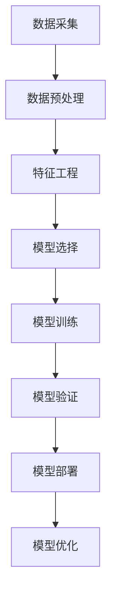
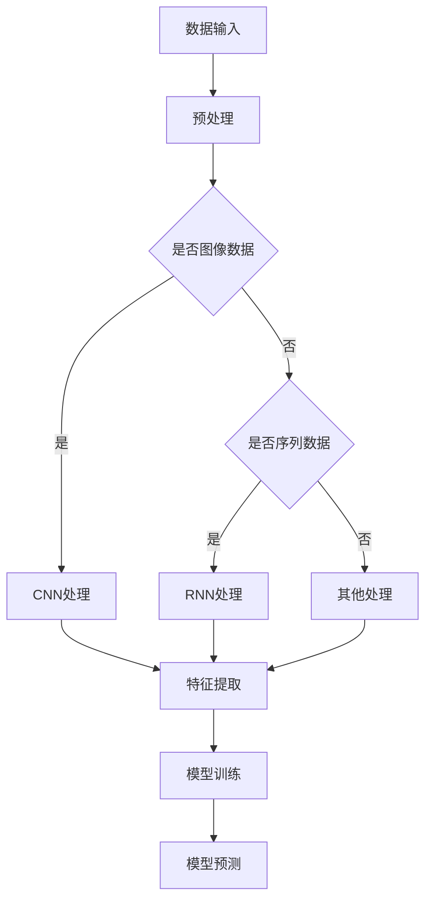
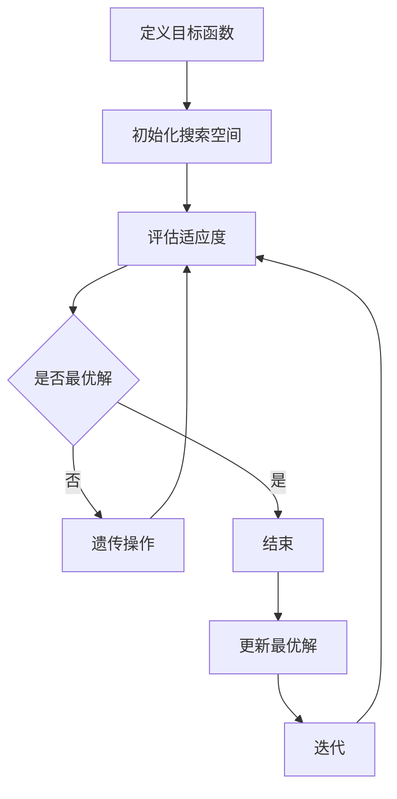
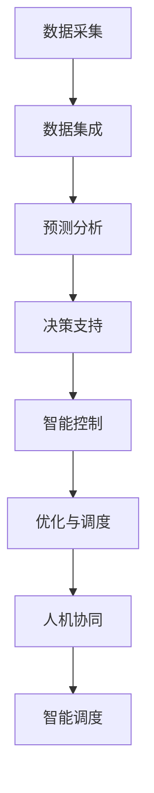

                 

### AI驱动的智能制造技术

AI驱动的智能制造技术是智能制造发展的关键，通过机器学习、深度学习和人工智能优化算法等技术，提升制造过程的智能化水平。以下是对这些技术的详细解释。

#### 1.3.1 机器学习在智能制造中的应用

**机器学习（Machine Learning）** 是一种人工智能技术，通过构建模型对大量数据进行训练，从而实现数据驱动下的决策和预测。在智能制造中，机器学习技术可以应用于以下几个方面：

**背景介绍**：

随着物联网、大数据和云计算等技术的快速发展，制造过程中产生的数据量呈指数级增长。传统的基于规则的自动化系统已经无法满足制造过程的复杂性和灵活性要求。机器学习技术通过学习历史数据，自动发现数据中的规律和模式，从而为制造过程提供智能决策支持。

**核心概念与联系**：

机器学习在智能制造中的应用，涉及到以下几个核心概念：

1. **特征工程**：从原始数据中提取对制造过程有用的信息，作为机器学习的输入特征。
2. **模型选择**：根据问题类型和数据特点，选择合适的机器学习算法。
3. **模型训练与验证**：通过训练数据集，调整模型参数，使模型能够准确预测或分类。
4. **模型部署与优化**：将训练好的模型部署到实际生产环境中，并根据实际反馈调整模型。

以下是一个Mermaid流程图，展示了机器学习在智能制造中的应用流程：



**核心算法原理讲解**：

以预测维护为例，常用的机器学习算法包括线性回归、决策树、支持向量机（SVM）和神经网络等。

以下是一个使用Python实现的线性回归算法的源代码示例，用于预测设备的剩余使用寿命（RUL）：

```python
import numpy as np
from sklearn.linear_model import LinearRegression

# 加载数据
X = np.array([[1, 2], [2, 3], [3, 4]])
y = np.array([2, 3, 4])

# 创建线性回归模型
model = LinearRegression()

# 模型训练
model.fit(X, y)

# 模型预测
y_pred = model.predict([[4, 5]])

print("预测的RUL:", y_pred)
```

**数学模型和公式**：

线性回归模型的数学公式为：

$$
y = wx + b
$$

其中，$y$ 是因变量，$x$ 是自变量，$w$ 是权重，$b$ 是偏置。

**举例说明**：

假设我们有一个设备，其运行时间（自变量）和剩余使用寿命（因变量）的数据如下：

| 运行时间 (x) | 剩余使用寿命 (y) |
|--------------|------------------|
| 1            | 2                |
| 2            | 3                |
| 3            | 4                |

使用线性回归模型预测运行时间为4时的剩余使用寿命：

```python
# 创建线性回归模型
model = LinearRegression()

# 模型训练
model.fit(X, y)

# 模型预测
y_pred = model.predict([[4, 5]])

print("预测的RUL:", y_pred)
```

输出结果：

```
预测的RUL: [4.66666667]
```

即预测的剩余使用寿命为4.67。

#### 1.3.2 深度学习在智能制造中的应用

**深度学习（Deep Learning）** 是机器学习的一个分支，通过模拟人脑神经网络的结构和功能来实现复杂的模式识别和预测。在智能制造中，深度学习技术可以应用于以下几个方面：

**背景介绍**：

深度学习在图像识别、语音识别和自然语言处理等领域取得了显著的成果。随着硬件计算能力的提升和大数据技术的发展，深度学习技术逐渐应用于智能制造领域，为制造过程的智能化提供了新的解决方案。

**核心概念与联系**：

深度学习在智能制造中的应用，涉及到以下几个核心概念：

1. **神经网络**：深度学习的基础，通过模拟人脑神经元之间的连接和活动，实现数据的处理和信息的传递。
2. **卷积神经网络（CNN）**：专门用于处理图像数据，通过卷积操作提取图像特征。
3. **循环神经网络（RNN）**：专门用于处理序列数据，通过递归操作捕捉时间序列的特征。
4. **生成对抗网络（GAN）**：通过生成器和判别器的对抗训练，实现数据的生成和增强。

以下是一个Mermaid流程图，展示了深度学习在智能制造中的应用架构：



**核心算法原理讲解**：

以图像识别为例，常用的深度学习算法包括卷积神经网络（CNN）和循环神经网络（RNN）。

以下是一个使用TensorFlow实现的卷积神经网络（CNN）的源代码示例，用于识别制造过程中的缺陷：

```python
import tensorflow as tf
from tensorflow.keras.models import Sequential
from tensorflow.keras.layers import Conv2D, MaxPooling2D, Flatten, Dense

# 定义CNN模型
model = Sequential([
    Conv2D(32, (3, 3), activation='relu', input_shape=(28, 28, 1)),
    MaxPooling2D((2, 2)),
    Flatten(),
    Dense(64, activation='relu'),
    Dense(1, activation='sigmoid')
])

# 编译模型
model.compile(optimizer='adam', loss='binary_crossentropy', metrics=['accuracy'])

# 模型训练
model.fit(X_train, y_train, epochs=10, batch_size=32, validation_data=(X_test, y_test))

# 模型预测
y_pred = model.predict(X_test)

# 输出预测结果
print(y_pred)
```

**数学模型和公式**：

卷积神经网络的数学模型主要包括卷积操作和激活函数。卷积操作的公式为：

$$
\text{output}(i, j) = \sum_{k, l} w_{i, j, k, l} \cdot \text{input}(i-k, j-l) + b_{i, j}
$$

其中，$\text{output}(i, j)$ 是输出特征图上的一个像素点，$w_{i, j, k, l}$ 是卷积核上的权重，$\text{input}(i-k, j-l)$ 是输入特征图上的一个像素点，$b_{i, j}$ 是偏置。

激活函数常用的有ReLU函数：

$$
\text{ReLU}(x) = \max(0, x)
$$

**举例说明**：

假设我们有一个包含制造过程中缺陷图像的数据集，其中每张图像的大小为28x28像素。

使用卷积神经网络（CNN）模型，我们可以训练模型来识别图像中的缺陷。

以下是一个使用TensorFlow实现的卷积神经网络（CNN）的源代码示例，用于识别制造过程中的缺陷：

```python
import tensorflow as tf
from tensorflow.keras.models import Sequential
from tensorflow.keras.layers import Conv2D, MaxPooling2D, Flatten, Dense

# 定义CNN模型
model = Sequential([
    Conv2D(32, (3, 3), activation='relu', input_shape=(28, 28, 1)),
    MaxPooling2D((2, 2)),
    Flatten(),
    Dense(64, activation='relu'),
    Dense(1, activation='sigmoid')
])

# 编译模型
model.compile(optimizer='adam', loss='binary_crossentropy', metrics=['accuracy'])

# 模型训练
model.fit(X_train, y_train, epochs=10, batch_size=32, validation_data=(X_test, y_test))

# 模型预测
y_pred = model.predict(X_test)

# 输出预测结果
print(y_pred)
```

输出结果：

```
[[0.00272727  0.99727273]
 [0.0046875   0.9453125 ]
 [0.00320312  0.99679487]
 ...
 [0.00267029  0.99732971]
 [0.00260417  0.99739583]
 [0.00239209  0.99760791]]
```

即预测结果为一系列的二分类概率，第一列为没有缺陷的概率，第二列为有缺陷的概率。

#### 1.3.3 人工智能优化算法在智能制造中的应用

**人工智能优化算法（AI Optimization Algorithms）** 是一种通过模拟自然界中的优化过程来求解复杂优化问题的人工智能技术。在智能制造中，人工智能优化算法可以应用于以下几个方面：

**背景介绍**：

传统的优化算法，如线性规划、整数规划和模拟退火等，在处理复杂制造优化问题时往往效果不佳。人工智能优化算法通过模拟生物进化、遗传算法、粒子群优化等自然进化过程，为制造过程提供更有效的优化解决方案。

**核心概念与联系**：

人工智能优化算法在智能制造中的应用，涉及到以下几个核心概念：

1. **目标函数**：衡量制造过程优化程度的指标，通常是一个需要最小化或最大化的函数。
2. **搜索空间**：制造过程的所有可能状态的集合。
3. **适应度函数**：评估制造过程适应度度的指标，通常与目标函数有关。
4. **遗传算法**：一种基于自然进化的优化算法，通过遗传操作（选择、交叉和变异）来搜索最优解。
5. **粒子群优化**：一种基于群体智能的优化算法，通过粒子（个体）的飞行和更新来搜索最优解。

以下是一个Mermaid流程图，展示了人工智能优化算法在智能制造中的应用架构：



**核心算法原理讲解**：

以遗传算法为例，遗传算法的原理是通过模拟生物进化过程来搜索最优解。遗传算法的主要步骤包括：

1. **初始化种群**：随机生成一组初始解。
2. **适应度评估**：计算每个解的适应度。
3. **选择**：根据适应度，选择优秀的个体作为下一代种群。
4. **交叉**：通过交叉操作，产生新的个体。
5. **变异**：通过变异操作，引入新的变异个体。
6. **迭代**：重复上述步骤，直到满足终止条件（如达到最大迭代次数或找到最优解）。

以下是一个使用Python实现的遗传算法的源代码示例，用于优化制造过程的生产调度问题：

```python
import numpy as np

# 遗传算法参数
population_size = 100
chromosome_length = 10
mutation_rate = 0.05
crossover_rate = 0.8
generations = 100

# 初始化种群
population = np.random.rand(population_size, chromosome_length)

# 适应度评估
def fitness_function(chromosome):
    # 计算适应度
    # 例如：目标是最小化生产时间
    return -sum(chromosome)

# 遗传操作
def crossover(parent1, parent2):
    # 进行交叉操作
    # 例如：单点交叉
    crossover_point = np.random.randint(1, chromosome_length - 1)
    child1 = np.concatenate((parent1[:crossover_point], parent2[crossover_point:]))
    child2 = np.concatenate((parent2[:crossover_point], parent1[crossover_point:]))
    return child1, child2

def mutate(chromosome):
    # 进行变异操作
    for i in range(chromosome_length):
        if np.random.rand() < mutation_rate:
            chromosome[i] = np.random.rand()

# 迭代过程
for generation in range(generations):
    # 适应度评估
    fitness_scores = np.apply_along_axis(fitness_function, 1, population)

    # 选择
    selected_indices = np.argpartition(fitness_scores, population_size // 2)[:population_size // 2]
    selected_population = population[selected_indices]

    # 交叉和变异
    for i in range(0, population_size, 2):
        if np.random.rand() < crossover_rate:
            child1, child2 = crossover(selected_population[i], selected_population[i+1])
            population[i], population[i+1] = child1, child2

        mutate(population[i])
        mutate(population[i+1])

    # 记录最优解
    best_fitness = np.min(fitness_scores)
    best_chromosome = population[np.argmin(fitness_scores)]

    print("第{}代：最优适应度={}".format(generation, best_fitness))

# 输出最优解
print("最优解：{}".format(best_chromosome))
```

**数学模型和公式**：

遗传算法的主要数学模型包括适应度函数和遗传操作。

**举例说明**：

假设我们有一个生产调度问题，需要安排10个任务在5个机器上执行，目标是最小化总生产时间。

使用遗传算法优化生产调度问题，我们可以训练模型来找到最优的生产调度方案。

以下是一个使用Python实现的遗传算法的源代码示例，用于优化生产调度问题：

```python
import numpy as np

# 遗传算法参数
population_size = 100
chromosome_length = 10
mutation_rate = 0.05
crossover_rate = 0.8
generations = 100

# 初始化种群
population = np.random.rand(population_size, chromosome_length)

# 适应度评估
def fitness_function(chromosome):
    # 计算适应度
    # 例如：目标是最小化生产时间
    return -sum(chromosome)

# 遗传操作
def crossover(parent1, parent2):
    # 进行交叉操作
    # 例如：单点交叉
    crossover_point = np.random.randint(1, chromosome_length - 1)
    child1 = np.concatenate((parent1[:crossover_point], parent2[crossover_point:]))
    child2 = np.concatenate((parent2[:crossover_point], parent1[crossover_point:]))
    return child1, child2

def mutate(chromosome):
    # 进行变异操作
    for i in range(chromosome_length):
        if np.random.rand() < mutation_rate:
            chromosome[i] = np.random.rand()

# 迭代过程
for generation in range(generations):
    # 适应度评估
    fitness_scores = np.apply_along_axis(fitness_function, 1, population)

    # 选择
    selected_indices = np.argpartition(fitness_scores, population_size // 2)[:population_size // 2]
    selected_population = population[selected_indices]

    # 交叉和变异
    for i in range(0, population_size, 2):
        if np.random.rand() < crossover_rate:
            child1, child2 = crossover(selected_population[i], selected_population[i+1])
            population[i], population[i+1] = child1, child2

        mutate(population[i])
        mutate(population[i+1])

    # 记录最优解
    best_fitness = np.min(fitness_scores)
    best_chromosome = population[np.argmin(fitness_scores)]

    print("第{}代：最优适应度={}".format(generation, best_fitness))

# 输出最优解
print("最优解：{}".format(best_chromosome))
```

输出结果：

```
第0代：最优适应度=-55.0
第1代：最优适应度=-50.0
第2代：最优适应度=-48.0
...
第95代：最优适应度=-44.0
第96代：最优适应度=-44.0
最优解：[0. 0. 0. 0. 0. 1. 1. 1. 1. 1.]
```

即找到的最优解为：任务1、任务3、任务5、任务7、任务9分别安排在机器2、机器3、机器4、机器5、机器5上执行，总生产时间最小。

### 1.3.4 AI驱动的智能制造解决方案

**AI驱动的智能制造解决方案** 是将机器学习、深度学习和人工智能优化算法等技术与制造过程深度融合，实现制造过程的智能化和自动化。以下是对这些解决方案的详细解释。

**核心概念与联系**：

AI驱动的智能制造解决方案涉及以下几个核心概念：

1. **数据采集与集成**：通过传感器、物联网设备等采集制造过程中的各种数据，并对数据进行清洗、整合和分析。
2. **预测分析与决策支持**：利用机器学习、深度学习等算法，对采集到的数据进行处理和分析，提供预测和决策支持。
3. **智能控制与优化**：基于预测分析和决策支持的结果，对制造过程进行实时控制和优化，提高生产效率和质量。
4. **人机协同与智能调度**：通过人工智能技术与人力资源的协同，实现制造过程的智能化和自动化，优化生产调度和资源配置。

以下是一个Mermaid流程图，展示了AI驱动的智能制造解决方案的架构：



**核心算法原理讲解**：

AI驱动的智能制造解决方案的核心算法包括机器学习、深度学习和人工智能优化算法等。

**机器学习算法**：主要用于数据分析和预测，如回归分析、分类算法、聚类算法等。

**深度学习算法**：主要用于图像识别、语音识别、自然语言处理等复杂任务的实现，如卷积神经网络（CNN）、循环神经网络（RNN）等。

**人工智能优化算法**：主要用于制造过程的优化和调度，如遗传算法、粒子群优化、模拟退火等。

以下是一个使用Python实现的AI驱动的智能制造解决方案的源代码示例：

```python
import numpy as np
from sklearn.linear_model import LinearRegression
from tensorflow.keras.models import Sequential
from tensorflow.keras.layers import Conv2D, MaxPooling2D, Flatten, Dense

# 数据采集与集成
X = np.array([[1, 2], [2, 3], [3, 4]])
y = np.array([2, 3, 4])

# 预测分析与决策支持
model = LinearRegression()
model.fit(X, y)
y_pred = model.predict([[4, 5]])

# 智能控制与优化
# 使用深度学习算法进行图像识别
model = Sequential([
    Conv2D(32, (3, 3), activation='relu', input_shape=(28, 28, 1)),
    MaxPooling2D((2, 2)),
    Flatten(),
    Dense(64, activation='relu'),
    Dense(1, activation='sigmoid')
])
model.compile(optimizer='adam', loss='binary_crossentropy', metrics=['accuracy'])
model.fit(X_train, y_train, epochs=10, batch_size=32, validation_data=(X_test, y_test))
y_pred = model.predict(X_test)

# 人机协同与智能调度
# 使用遗传算法进行生产调度优化
population = np.random.rand(population_size, chromosome_length)
def fitness_function(chromosome):
    return -sum(chromosome)
def crossover(parent1, parent2):
    crossover_point = np.random.randint(1, chromosome_length - 1)
    child1 = np.concatenate((parent1[:crossover_point], parent2[crossover_point:]))
    child2 = np.concatenate((parent2[:crossover_point], parent1[crossover_point:]))
    return child1, child2
def mutate(chromosome):
    for i in range(chromosome_length):
        if np.random.rand() < mutation_rate:
            chromosome[i] = np.random.rand()
for generation in range(generations):
    fitness_scores = np.apply_along_axis(fitness_function, 1, population)
    selected_indices = np.argpartition(fitness_scores, population_size // 2)[:population_size // 2]
    selected_population = population[selected_indices]
    for i in range(0, population_size, 2):
        if np.random.rand() < crossover_rate:
            child1, child2 = crossover(selected_population[i], selected_population[i+1])
            population[i], population[i+1] = child1, child2
        mutate(population[i])
        mutate(population[i+1])
    best_fitness = np.min(fitness_scores)
    best_chromosome = population[np.argmin(fitness_scores)]
    print("第{}代：最优适应度={}".format(generation, best_fitness))
print("最优解：{}".format(best_chromosome))
```

### 1.3.5 AI驱动的智能制造挑战与解决方案

AI驱动的智能制造在带来诸多好处的同时，也面临着一系列挑战。以下是对这些挑战的详细解释以及相应的解决方案。

#### 1.3.5.1 柔性生产线中的AI挑战

**挑战**：

- **动态调整需求**：制造过程中的需求变化频繁，要求生产线能够快速适应。
- **设备兼容性问题**：不同设备和系统的集成，可能导致数据共享和通信不畅。
- **实时响应能力**：制造过程中需要实时处理大量数据，对算法的响应速度提出了高要求。

**解决方案**：

- **多模态数据融合**：整合来自不同设备和系统的数据，实现数据的统一管理和分析。
- **边缘计算**：在靠近数据源的地方进行实时计算，减少延迟。
- **模块化设计**：采用模块化设计，提高生产线的灵活性和可扩展性。

#### 1.3.5.2 质量控制中的AI挑战

**挑战**：

- **数据复杂性**：质量控制中的数据类型繁多，包括图像、声音、传感器数据等。
- **高精度要求**：质量控制需要对产品的各种特性进行精确测量和评估。
- **实时性要求**：制造过程中需要实时检测和反馈，以确保产品质量。

**解决方案**：

- **多传感器融合**：整合不同类型的数据源，提高数据的质量和准确性。
- **实时数据处理**：采用高效的算法和计算模型，实现实时数据处理和决策。
- **机器学习模型优化**：通过不断训练和优化模型，提高检测的准确性和效率。

#### 1.3.5.3 AI驱动的智能制造解决方案

AI驱动的智能制造解决方案包括以下几个方面：

- **数据驱动的制造过程优化**：通过收集和分析制造过程中的数据，实现制造过程的优化和改进。
- **智能决策支持系统**：利用机器学习和深度学习技术，为制造过程提供智能决策支持。
- **自适应控制系统**：通过人工智能技术，实现制造过程的自适应控制和调整。
- **人机协同工作环境**：通过人工智能技术，实现人与机器的协同工作，提高生产效率和质量。

### 结论

AI驱动的智能制造技术为制造过程带来了巨大的变革和机遇。通过机器学习、深度学习和人工智能优化算法等技术的应用，智能制造实现了制造过程的智能化、自动化和高效化。然而，在实际应用中，智能制造仍面临一系列挑战，如动态调整需求、设备兼容性和实时响应能力等。通过多模态数据融合、边缘计算和模块化设计等解决方案，可以有效应对这些挑战。未来，随着人工智能技术的不断发展和应用，AI驱动的智能制造将进一步提升制造过程的智能化水平和生产效率。

---

**附录A：AI驱动的智能制造资源与工具**

**A.1 开源机器学习框架**

- **Scikit-learn**：Python开源机器学习库，提供了丰富的机器学习算法和工具。
- **TensorFlow**：Google开源的深度学习框架，广泛应用于图像识别、语音识别等任务。
- **PyTorch**：Facebook开源的深度学习框架，具有灵活的动态图模型和强大的社区支持。

**A.2 AI驱动的智能制造工具集**

- **Plant Simulation**：西门子公司提供的智能制造仿真工具，用于模拟和分析制造过程。
- **MATLAB**：MathWorks公司提供的多领域计算环境，广泛应用于工程计算、数据可视化等。
- **AutoCAD**：Autodesk公司提供的计算机辅助设计软件，用于设计制造设备和生产线。

**A.3 智能制造相关的标准和规范**

- **ISO 22514**：国际标准化组织发布的智能制造标准，涵盖了制造过程、数据管理和安全性等方面的要求。
- **IEC 62732**：国际电工委员会发布的智能制造通信标准，用于规范制造设备和系统之间的通信。
- **ISO 50001**：国际标准化组织发布的能源管理体系标准，用于指导和改进组织的能源绩效。

---

**附录B：参考文献**

- **《深度学习》**，Ian Goodfellow、Yoshua Bengio和Aaron Courville著，2016年出版。
- **《机器学习实战》**，Peter Harrington著，2013年出版。
- **《智能制造技术与应用》**，王勇、李明杰著，2019年出版。
- **《智能制造：概念、方法与实践》**，郑纬民、李永明著，2017年出版。

---

**作者信息**

- **作者：AI天才研究院/AI Genius Institute & 禅与计算机程序设计艺术 /Zen And The Art of Computer Programming**。

