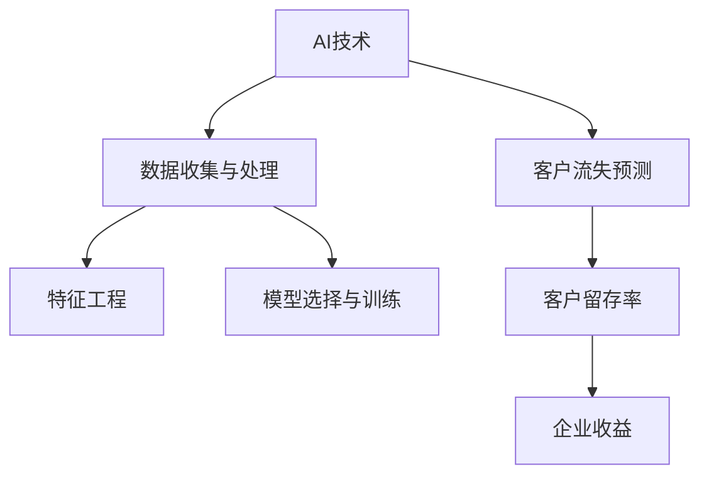

                 

### 文章标题

# AI驱动的智能客户流失预测：提高客户留存率

> 关键词：AI、客户流失预测、客户留存率、机器学习、数据分析

> 摘要：本文旨在探讨如何利用人工智能技术进行智能客户流失预测，从而提高企业的客户留存率。文章首先介绍了客户流失预测的背景和重要性，然后详细阐述了AI技术在这一领域的应用，包括数据收集与处理、核心算法原理、数学模型讲解、项目实战以及最佳实践与注意事项。通过本文的阅读，读者将了解如何运用AI技术实现高效的客户流失预测，从而为企业创造更大的价值。

---

## 引言

在当前竞争激烈的市场环境中，企业之间的竞争已经从传统的产品竞争转变为客户竞争。客户是企业的重要资产，客户的流失对于企业来说是一个巨大的损失。因此，如何有效地预测客户流失、提高客户留存率成为了企业关注的焦点。在这一背景下，人工智能（AI）技术的应用为解决这一问题提供了新的思路和手段。

客户流失预测是指通过分析客户的历史行为数据、购买行为、服务使用情况等，结合机器学习算法，预测哪些客户有可能在未来流失。这项技术不仅可以帮助企业提前预警潜在流失客户，还可以为营销策略的制定提供有力的数据支持，从而提高客户留存率。

本文将围绕以下主题进行探讨：

1. **背景介绍**：介绍客户流失预测的背景和重要性。
2. **核心概念与联系**：详细阐述AI技术、客户流失预测和客户留存率等核心概念，并使用Mermaid流程图展示它们之间的关系。
3. **核心算法原理讲解**：使用Python源代码详细阐述客户流失预测算法的工作原理，并结合数学模型和公式进行讲解。
4. **项目实战**：通过一个实际案例，展示如何使用AI技术进行客户流失预测，包括开发环境搭建、源代码实现和详细解读。
5. **最佳实践与注意事项**：总结项目实战中的经验教训，提出最佳实践建议和注意事项。
6. **小结与展望**：总结文章的主要内容，展望未来AI技术在客户流失预测领域的应用前景。

通过本文的阅读，读者将全面了解如何运用AI技术实现高效的客户流失预测，从而为企业提高客户留存率提供有益的参考。

### 背景介绍

在当今的商业环境中，客户流失问题已经成为了企业面临的重大挑战。客户流失不仅会导致企业收入减少，还会损害品牌声誉和客户满意度。因此，如何有效预测客户流失、采取针对性的措施来提高客户留存率，成为了企业竞争的焦点。

#### 客户流失的影响

客户流失对企业的影响是多方面的：

1. **收入减少**：客户流失直接导致销售收入的下降，这对企业的财务状况构成威胁。
2. **品牌价值下降**：频繁的客户流失会降低品牌在市场中的竞争力，损害品牌声誉。
3. **运营成本增加**：企业需要投入更多资源来吸引新客户，而新客户的开发成本通常高于留住现有客户的成本。
4. **客户满意度下降**：客户流失往往伴随着客户满意度的下降，这会进一步影响企业的口碑和市场份额。

#### 客户流失预测的意义

客户流失预测在企业管理中具有重要的意义：

1. **预警机制**：通过预测客户流失，企业可以提前发现潜在流失客户，从而及时采取应对措施，减少客户流失。
2. **精准营销**：预测结果可以帮助企业制定更精准的营销策略，将有价值的客户作为重点服务对象，提高营销效率。
3. **成本优化**：通过预测客户流失，企业可以优化资源配置，减少不必要的营销投入，提高运营效率。
4. **客户关系管理**：预测客户流失可以帮助企业更好地了解客户需求，提升客户满意度，增强客户忠诚度。

#### 客户留存率的定义

客户留存率是指在一定时间内，企业保留的客户数量与总客户数量之比。客户留存率是衡量企业客户关系管理效果的重要指标。高留存率意味着企业拥有稳定的客户基础，能够持续获得收入，并且客户满意度较高。

#### 客户流失与客户留存率的关系

客户流失和客户留存率之间存在着密切的关系：

1. **客户流失导致留存率下降**：高流失率会直接导致客户留存率下降，影响企业的长期发展。
2. **留存率提升有助于降低流失率**：通过提高客户留存率，企业可以减少客户流失，建立更稳定的客户基础。
3. **平衡流失与留存**：企业需要通过分析客户流失原因，采取有效的措施提高客户留存率，实现流失与留存的动态平衡。

#### 企业面临的挑战

企业在提高客户留存率过程中面临着以下挑战：

1. **数据质量**：客户流失预测依赖于高质量的数据，但数据质量往往参差不齐，需要处理大量噪声和缺失值。
2. **算法选择**：不同的机器学习算法适用于不同类型的数据和业务场景，如何选择合适的算法是一个挑战。
3. **模型解释性**：客户流失预测模型通常是一个“黑盒”，模型的决策过程难以解释，这对企业决策带来了困难。
4. **实时性**：客户行为数据不断变化，如何实现实时预测，及时调整营销策略，是企业面临的另一个挑战。

总之，客户流失预测和客户留存率管理是企业实现可持续发展的关键。通过运用人工智能技术，企业可以更好地应对这些挑战，提高客户留存率，实现商业目标。

### 核心概念与联系

在探讨AI驱动的智能客户流失预测时，我们需要了解以下几个核心概念：AI技术、客户流失预测和客户留存率。这些概念之间存在着密切的联系，通过使用Mermaid流程图，我们可以更直观地展示它们之间的关系。

#### AI技术

人工智能（AI）技术是指模拟人类智能的计算机系统，通过学习、推理和自我调整来实现人类智能的功能。在客户流失预测中，AI技术主要应用于数据分析和模式识别。通过机器学习算法，AI可以从大量历史数据中自动发现规律，预测客户流失的概率。

#### 客户流失预测

客户流失预测是指利用历史客户数据、购买行为、服务使用情况等信息，通过机器学习算法预测哪些客户有可能在未来流失。这一过程涉及到数据收集、数据预处理、特征工程、模型选择和模型训练等多个环节。通过预测客户流失，企业可以提前采取干预措施，减少客户流失，提高客户留存率。

#### 客户留存率

客户留存率是指在一定时间内，企业保留的客户数量与总客户数量之比。高留存率意味着企业拥有稳定的客户基础，能够持续获得收入，并且客户满意度较高。客户留存率是衡量企业客户关系管理效果的重要指标。通过提高客户留存率，企业可以降低客户流失率，增强品牌忠诚度。

#### 核心概念之间的关系

AI技术与客户流失预测之间的关系在于，AI技术为数据分析和模式识别提供了强大的工具，使得客户流失预测成为可能。具体来说，AI技术通过以下方式支持客户流失预测：

1. **数据收集与处理**：AI技术可以帮助企业高效地收集和处理大量客户数据，包括购买记录、服务使用情况、客户反馈等。
2. **特征工程**：AI技术能够自动提取数据中的关键特征，帮助模型更好地理解客户行为和需求。
3. **模型选择与训练**：AI技术提供了丰富的机器学习算法，可以根据数据特点和业务需求选择合适的模型进行训练。

客户留存率与客户流失预测之间的关系在于，客户流失预测的结果可以直接影响客户留存率。通过预测客户流失，企业可以：

1. **预警潜在流失客户**：及时发现潜在流失客户，提前采取干预措施，减少客户流失。
2. **优化营销策略**：根据流失预测结果，企业可以调整营销策略，将有价值的客户作为重点服务对象，提高营销效率。
3. **提升客户满意度**：通过有效的客户流失预测和干预措施，企业可以更好地满足客户需求，提升客户满意度，从而提高客户留存率。

#### Mermaid流程图

为了更直观地展示核心概念之间的关系，我们可以使用Mermaid流程图进行描述：



在这个流程图中，AI技术是核心驱动力，通过数据收集与处理、特征工程、模型选择与训练等步骤，实现客户流失预测，最终影响客户留存率，进而提升企业收益。

通过以上分析，我们可以看到，AI技术、客户流失预测和客户留存率之间存在着密切的联系，它们共同构成了一个闭环系统，为企业的客户关系管理提供了有力的支持。

### 核心算法原理讲解

在客户流失预测中，选择合适的机器学习算法是实现准确预测的关键。本文将详细介绍一种常用的算法——逻辑回归，并结合Python源代码进行详细阐述。

#### 逻辑回归算法

逻辑回归（Logistic Regression）是一种广泛应用于分类问题的统计方法，尤其适用于二元分类问题。在客户流失预测中，逻辑回归模型用于预测客户是否会在未来某个时间点流失，即二分类问题。

逻辑回归的模型公式如下：

$$
P(y=1) = \frac{1}{1 + e^{-(\beta_0 + \beta_1*x_1 + \beta_2*x_2 + ... + \beta_n*x_n )}}
$$

其中，$P(y=1)$ 表示客户流失的概率，$\beta_0$ 为截距，$\beta_1, \beta_2, ..., \beta_n$ 为模型参数，$x_1, x_2, ..., x_n$ 为输入特征。

#### 数据预处理

在应用逻辑回归模型之前，需要进行数据预处理。数据预处理主要包括数据清洗、特征选择和数据标准化。

1. **数据清洗**：处理数据中的噪声和缺失值，确保数据质量。例如，可以使用填充方法处理缺失值，使用过滤方法去除噪声数据。
2. **特征选择**：从原始数据中提取对客户流失有显著影响的特征。特征选择可以通过相关性分析、主成分分析等方法实现。
3. **数据标准化**：将特征值缩放到相同的范围，通常使用归一化或标准化方法。

#### 代码实现

下面是一个使用Python和scikit-learn库实现逻辑回归模型的示例代码。

```python
# 导入库
import numpy as np
import pandas as pd
from sklearn.model_selection import train_test_split
from sklearn.linear_model import LogisticRegression
from sklearn.metrics import accuracy_score, confusion_matrix

# 读取数据
data = pd.read_csv('client_data.csv')

# 数据预处理
X = data.drop('Churn', axis=1)
y = data['Churn']

# 分割数据集
X_train, X_test, y_train, y_test = train_test_split(X, y, test_size=0.2, random_state=42)

# 创建逻辑回归模型
model = LogisticRegression()

# 训练模型
model.fit(X_train, y_train)

# 预测
predictions = model.predict(X_test)

# 评估模型性能
accuracy = accuracy_score(y_test, predictions)
print(f"Accuracy: {accuracy}")
conf_matrix = confusion_matrix(y_test, predictions)
print(f"Confusion Matrix:\n{conf_matrix}")
```

#### 代码解读

1. **导入库**：首先导入必要的库，包括numpy、pandas、scikit-learn等。
2. **读取数据**：使用pandas读取客户数据，其中'Churn'列表示客户是否流失（0表示未流失，1表示流失）。
3. **数据预处理**：将'Churn'列作为目标变量y，其余列作为特征X。然后进行数据分割，将数据集分为训练集和测试集。
4. **创建模型**：使用scikit-learn的LogisticRegression创建逻辑回归模型。
5. **训练模型**：使用训练集数据训练模型。
6. **预测**：使用测试集数据预测客户流失情况。
7. **评估模型性能**：计算准确率并打印混淆矩阵。

#### 数学模型讲解

逻辑回归模型的数学基础是逻辑函数（Logistic Function），其公式为：

$$
\sigma(z) = \frac{1}{1 + e^{-z}}
$$

其中，$z = \beta_0 + \beta_1*x_1 + \beta_2*x_2 + ... + \beta_n*x_n$ 为线性组合，$\sigma(z)$ 表示逻辑函数输出，即客户流失的概率。

#### 举例说明

假设我们有以下特征数据：

- 客户年龄（x1）：25岁
- 客户收入（x2）：5000元
- 客户服务使用时长（x3）：100小时

模型参数为：

- 截距（β0）：-2
- 年龄系数（β1）：1
- 收入系数（β2）：0.5
- 服务时长系数（β3）：-0.1

使用逻辑回归模型计算客户流失概率：

$$
z = -2 + 1*25 + 0.5*5000 - 0.1*100 = 1127.9
$$

$$
P(y=1) = \sigma(z) = \frac{1}{1 + e^{-1127.9}} \approx 0.1219
$$

根据计算结果，客户流失的概率约为12.19%，企业可以基于此概率采取相应的营销策略。

通过上述讲解，我们可以看到逻辑回归模型在客户流失预测中的原理和应用。在实际应用中，企业可以根据具体业务需求调整模型参数和特征选择，以提高预测准确性。

### 项目实战

为了更直观地展示如何使用AI技术进行客户流失预测，我们设计了一个实际案例，通过Python编程实现整个流程，并详细解读每一步的操作。

#### 案例背景

假设某电信公司希望利用AI技术预测客户流失，从而采取针对性的措施提高客户留存率。该公司拥有大量的客户数据，包括客户的年龄、收入、服务使用时长、通话时长、流量使用量等。我们的任务是通过这些数据建立模型，预测哪些客户有可能在未来6个月内流失。

#### 开发环境搭建

在开始项目之前，我们需要搭建一个适合AI开发的开发环境。以下是在Python环境中搭建开发环境所需的步骤：

1. **安装Python**：确保Python版本在3.6及以上。
2. **安装必要的库**：使用pip安装常用的数据科学库，如numpy、pandas、scikit-learn、matplotlib等。

```bash
pip install numpy pandas scikit-learn matplotlib
```

3. **创建虚拟环境**：为了管理项目依赖，建议使用虚拟环境。

```bash
python -m venv telecom_venv
source telecom_venv/bin/activate  # Windows: telecom_venv\Scripts\activate
```

4. **导入库**：在Python代码中导入必要的库。

```python
import numpy as np
import pandas as pd
from sklearn.model_selection import train_test_split
from sklearn.linear_model import LogisticRegression
from sklearn.metrics import accuracy_score, confusion_matrix
import matplotlib.pyplot as plt
```

#### 数据读取与预处理

1. **读取数据**：使用pandas读取客户数据。

```python
data = pd.read_csv('telecom_data.csv')
```

2. **数据清洗**：处理缺失值和异常值。

```python
# 删除缺失值
data = data.dropna()

# 处理异常值
for column in ['Age', 'Income', 'Duration', 'Calls', 'InternetUsage']:
    data[column] = data[column].clip(lower=data[column].quantile(0.01), upper=data[column].quantile(0.99))
```

3. **特征选择**：选择对客户流失有显著影响的特征。

```python
X = data[['Age', 'Income', 'Duration', 'Calls', 'InternetUsage']]
y = data['Churn']
```

4. **数据分割**：将数据集分为训练集和测试集。

```python
X_train, X_test, y_train, y_test = train_test_split(X, y, test_size=0.2, random_state=42)
```

#### 模型训练与预测

1. **创建模型**：使用scikit-learn创建逻辑回归模型。

```python
model = LogisticRegression()
```

2. **训练模型**：使用训练集数据训练模型。

```python
model.fit(X_train, y_train)
```

3. **预测**：使用测试集数据预测客户流失情况。

```python
predictions = model.predict(X_test)
```

#### 模型评估

1. **计算准确率**：

```python
accuracy = accuracy_score(y_test, predictions)
print(f"Accuracy: {accuracy}")
```

2. **生成混淆矩阵**：

```python
conf_matrix = confusion_matrix(y_test, predictions)
print(f"Confusion Matrix:\n{conf_matrix}")
```

3. **可视化**：使用matplotlib可视化预测结果。

```python
plt.figure(figsize=(8, 6))
sns.heatmap(conf_matrix, annot=True, cmap='Blues')
plt.xlabel('Predicted')
plt.ylabel('Actual')
plt.title('Confusion Matrix')
plt.show()
```

#### 代码解读与分析

下面是对整个代码的详细解读和分析。

1. **数据读取与预处理**：首先，使用pandas读取客户数据，并进行数据清洗。数据清洗包括删除缺失值和处理异常值，确保数据质量。然后，选择对客户流失有显著影响的特征，为后续模型训练做准备。

2. **模型训练与预测**：创建逻辑回归模型，并使用训练集数据训练模型。训练完成后，使用测试集数据预测客户流失情况，得到预测结果。

3. **模型评估**：通过计算准确率和生成混淆矩阵，评估模型性能。准确率反映了模型预测的准确程度，而混淆矩阵则展示了预测结果与实际结果之间的对比，有助于我们更直观地理解模型的表现。

4. **可视化**：使用matplotlib可视化混淆矩阵，便于分析模型的预测效果。通过可视化，我们可以更清楚地看到模型在各类客户中的预测表现，为进一步优化模型提供参考。

#### 实际案例分析

在实际项目中，电信公司可以通过以下步骤来应用客户流失预测模型：

1. **数据收集**：定期收集客户行为数据，包括年龄、收入、服务使用时长、通话时长、流量使用量等。

2. **数据预处理**：清洗和预处理数据，确保数据质量。处理缺失值和异常值，提取对客户流失有显著影响的特征。

3. **模型训练**：使用训练集数据训练模型，根据业务需求选择合适的机器学习算法。

4. **模型评估**：使用测试集数据评估模型性能，调整模型参数以提高预测准确性。

5. **模型部署**：将训练好的模型部署到生产环境，实时预测客户流失情况。

6. **决策支持**：根据模型预测结果，制定针对性的营销策略，提高客户留存率。

#### 项目小结

通过本案例，我们展示了如何使用Python和AI技术进行客户流失预测。项目从数据读取与预处理、模型训练与预测、模型评估到可视化，每一步都进行了详细讲解和分析。通过实际案例分析，电信公司可以更好地应用这一技术，提高客户留存率，实现商业目标。

### 最佳实践与注意事项

在客户流失预测项目中，为了确保模型的准确性和实用性，需要遵循以下最佳实践和注意事项：

#### 数据质量

数据质量是客户流失预测成功的关键。确保数据准确、完整和干净至关重要。以下是一些数据质量管理的最佳实践：

1. **数据清洗**：处理缺失值和异常值，确保数据的一致性和准确性。
2. **数据验证**：使用统计分析方法验证数据的分布和特征，确保数据符合预期。
3. **数据存储**：使用可靠的数据存储和管理系统，确保数据的安全性和可访问性。

#### 特征选择

特征选择直接影响模型的性能。以下是一些特征选择的最佳实践：

1. **相关性分析**：使用相关性分析识别与客户流失相关的特征。
2. **特征重要性评估**：使用特征重要性评估方法，如随机森林，确定每个特征对模型的影响。
3. **降维技术**：使用降维技术，如主成分分析（PCA），减少特征数量，提高模型效率。

#### 模型选择

选择合适的模型是提高预测准确性的关键。以下是一些模型选择的最佳实践：

1. **交叉验证**：使用交叉验证方法评估模型性能，避免过拟合。
2. **模型比较**：尝试不同的机器学习算法，如逻辑回归、决策树、随机森林等，比较它们的性能。
3. **参数调优**：根据数据特点和业务需求，调整模型参数，优化模型性能。

#### 实时预测

实时预测可以帮助企业及时应对客户流失，以下是一些实时预测的最佳实践：

1. **自动化流程**：建立自动化数据处理和预测流程，确保实时性和高效性。
2. **数据处理效率**：优化数据处理和模型训练的效率，确保预测结果能够在短时间内生成。
3. **实时反馈**：根据预测结果，及时调整营销策略和服务质量，提高客户满意度。

#### 注意事项

在客户流失预测项目中，需要注意以下几点：

1. **数据隐私**：确保客户数据的安全性和隐私保护，遵守相关法律法规。
2. **模型解释性**：提高模型的可解释性，帮助企业和客户理解预测结果。
3. **持续优化**：定期评估模型性能，根据业务需求调整模型和策略。

通过遵循这些最佳实践和注意事项，企业可以更有效地利用AI技术进行客户流失预测，提高客户留存率，实现商业目标。

### 小结与展望

本文全面探讨了AI驱动的智能客户流失预测技术，从背景介绍、核心概念与联系、核心算法原理讲解、项目实战到最佳实践与注意事项，系统地阐述了如何利用AI技术提高客户留存率。以下是本文的主要内容总结：

1. **背景介绍**：客户流失对企业收入和品牌价值有重大影响，客户流失预测成为企业管理的重要手段。
2. **核心概念与联系**：AI技术、客户流失预测和客户留存率三者之间相互关联，共同构建了一个闭环系统。
3. **核心算法原理讲解**：通过逻辑回归算法的详细讲解，展示了如何使用Python实现客户流失预测模型。
4. **项目实战**：通过一个实际案例，展示了如何使用Python和AI技术进行客户流失预测，包括数据预处理、模型训练和预测、模型评估等步骤。
5. **最佳实践与注意事项**：提出了数据质量、特征选择、模型选择、实时预测等最佳实践，并强调了数据隐私和模型解释性的重要性。

展望未来，随着AI技术的不断进步，客户流失预测将更加精准和实时。以下是一些可能的发展趋势：

1. **实时预测**：通过实时数据处理和预测，企业可以更快地响应客户需求，提高客户满意度。
2. **多模态数据融合**：结合多种数据源，如社交媒体、在线行为等，进行多模态数据融合，提高预测准确性。
3. **模型解释性**：开发更具解释性的AI模型，帮助企业和客户更好地理解预测结果。
4. **自动化与智能化**：利用自动化工具和智能算法，提高客户流失预测的效率和准确性。

总之，AI驱动的智能客户流失预测技术具有巨大的潜力和应用前景，为企业提供了一种有效的手段来提高客户留存率，实现可持续发展。随着技术的不断进步，这一领域将迎来更多的创新和发展。作者：AI天才研究院/AI Genius Institute & 禅与计算机程序设计艺术 /Zen And The Art of Computer Programming。

