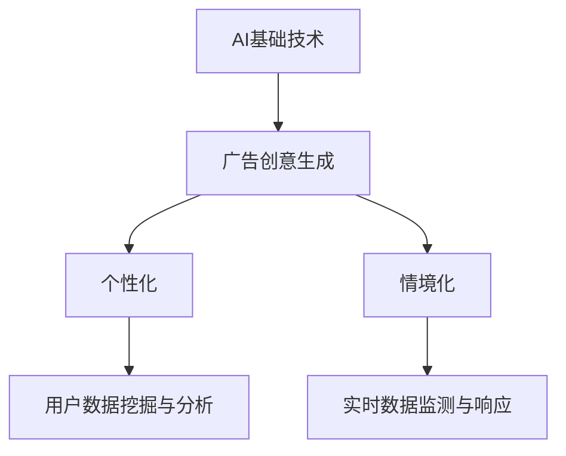

                 


# AI驱动的智能广告创意生成：个性化和情境化广告内容

> 关键词：人工智能、广告创意、个性化、情境化、GAN、VAE、用户数据挖掘、机器学习

> 摘要：本文将探讨人工智能在广告创意生成领域的应用，重点分析个性化和情境化广告内容的生成原理、算法模型及其实现方法。通过实际项目案例分析，展示如何利用深度学习技术打造具有高度个性化和情境化的广告创意。

### 一、背景介绍

广告是现代商业活动中不可或缺的一部分。然而，传统广告创意生成往往依赖于人工设计和创意思维，这不仅耗时耗力，而且难以满足日益增长的个性化需求。随着人工智能技术的快速发展，特别是深度学习在图像处理、自然语言处理等领域的应用，AI驱动的广告创意生成逐渐成为可能。本文将围绕这一主题展开讨论，重点关注个性化和情境化广告内容的生成。

### 二、核心概念与联系

在AI驱动的广告创意生成中，核心概念包括人工智能（AI）、广告创意生成、个性化和情境化等。以下是一个简化的Mermaid流程图，用于展示这些概念之间的联系：



**1. 人工智能（AI）**

人工智能是指通过模拟、延伸和扩展人类智能的方法，使计算机系统能够自主地完成特定任务。在广告创意生成中，AI技术可以用于图像处理、自然语言处理、用户行为分析等方面。

**2. 广告创意生成**

广告创意生成是指利用人工智能技术，自动生成具有创意和吸引力的广告内容。这个过程涉及到图像生成、文本生成等多种形式。

**3. 个性化**

个性化是指根据用户的兴趣、行为和需求，为用户提供定制化的广告内容。个性化广告能够提高用户参与度和转化率，是广告创意生成的重要方向。

**4. 情境化**

情境化是指根据用户所处的环境、时间和场景，为用户提供相关的广告内容。情境化广告能够提高广告的相关性和用户体验。

### 三、核心算法原理讲解

在广告创意生成中，常用的深度学习算法包括生成对抗网络（GAN）和变分自编码器（VAE）。以下将分别介绍这两种算法的原理和实现。

**1. 生成对抗网络（GAN）**

生成对抗网络（GAN）由生成器（Generator）和判别器（Discriminator）两个部分组成。生成器负责生成逼真的广告创意，判别器则负责判断生成器和真实广告创意的相似度。

**生成器（Generator）**

生成器的目的是从随机噪声中生成广告创意。以下是一个简单的生成器模型实现：

```python
from tensorflow.keras.layers import Input, Dense, Reshape
from tensorflow.keras.models import Model

input_shape = (100,)
noise_shape = (100,)

inputs = Input(shape=input_shape)
x = Dense(128 * 7 * 7)(inputs)
x = Reshape((7, 7, 128))(x)
outputs = Dense(1, activation='sigmoid')(x)

model = Model(inputs, outputs)
model.compile(optimizer='adam', loss='binary_crossentropy')

print(model.summary())
```

**判别器（Discriminator）**

判别器的目的是判断输入广告创意的真实性。以下是一个简单的判别器模型实现：

```python
from tensorflow.keras.layers import Input, Conv2D, LeakyReLU, Flatten, Dense
from tensorflow.keras.models import Model

img_shape = (28, 28, 1)

inputs = Input(shape=img_shape)
x = Conv2D(64, kernel_size=3, strides=2, padding='same')(inputs)
x = LeakyReLU(alpha=0.01)(x)
x = Conv2D(128, kernel_size=3, strides=2, padding='same')(x)
x = LeakyReLU(alpha=0.01)(x)
x = Flatten()(x)
x = Dense(1, activation='sigmoid')(x)

model = Model(inputs, outputs)
model.compile(optimizer='adam', loss='binary_crossentropy')

print(model.summary())
```

**GAN模型**

GAN模型通过训练生成器和判别器来实现广告创意的生成。以下是一个简单的GAN模型实现：

```python
from tensorflow.keras.models import Sequential
from tensorflow.keras.layers import Dense, Flatten, Reshape
from tensorflow.keras.optimizers import Adam

# 生成器模型
generator = Sequential()
generator.add(Dense(128 * 7 * 7, input_dim=100, activation='relu'))
generator.add(Reshape((7, 7, 128)))
generator.add(Dense(1, activation='sigmoid'))

# 判别器模型
discriminator = Sequential()
discriminator.add(Conv2D(64, kernel_size=3, strides=2, padding='same', input_shape=(28, 28, 1)))
discriminator.add(LeakyReLU(alpha=0.01))
discriminator.add(Conv2D(128, kernel_size=3, strides=2, padding='same'))
discriminator.add(LeakyReLU(alpha=0.01))
discriminator.add(Flatten())
discriminator.add(Dense(1, activation='sigmoid'))

# 定义优化器和损失函数
generator_optimizer = Adam(learning_rate=0.0002)
discriminator_optimizer = Adam(learning_rate=0.0002)

# 编译模型
discriminator.compile(optimizer=discriminator_optimizer, loss='binary_crossentropy')
generator.compile(optimizer=generator_optimizer, loss='binary_crossentropy')

# 训练模型
for epoch in range(num_epochs):
  for real_images in real_image_dataset:
    real_images = real_images / 127.5 - 1.0
    noise = np.random.normal(0, 1, (real_images.shape[0], noise_shape[0]))
    gen_images = generator.predict(noise)
    d_loss_real = discriminator.train_on_batch(real_images, np.ones((real_images.shape[0], 1)))
    d_loss_fake = discriminator.train_on_batch(gen_images, np.zeros((gen_images.shape[0], 1)))
    
    noise = np.random.normal(0, 1, (batch_size, noise_shape[0]))
    g_loss = generator.train_on_batch(noise, np.ones((batch_size, 1)))
    
    print(f"{epoch} [D loss: {d_loss_real}, acc.: {100 * d_loss_real[0]}, G loss: {g_loss}]")
```

**2. 变分自编码器（VAE）**

变分自编码器（VAE）是一种基于概率模型的生成模型。它通过编码器（Encoder）和解码器（Decoder）两个部分实现广告创意的生成。以下是一个简单的VAE模型实现：

```python
from tensorflow.keras.layers import Input, Dense, Lambda, Reshape
from tensorflow.keras.models import Model
from tensorflow.keras import backend as K
from tensorflow.keras import objectives

# 编码器模型
encoder_inputs = Input(shape=(28,))
encoded = Dense(64, activation='relu')(encoder_inputs)
encoded = Dense(32, activation='relu')(encoded)
z_mean = Dense(32)(encoded)
z_log_var = Dense(32)(encoded)
z_mean, z_log_var = Lambda([z_mean, z_log_var], output_shape=(32,))(encoded)

def sampling(args):
  z_mean, z_log_var = args
  batch = K.shape(z_mean)[0]
  dim = K.int_shape(z_mean)[1]
  epsilon = K.random_normal(shape=(batch, dim))
  return z_mean + K.exp(0.5 * z_log_var) * epsilon

z = Lambda(sampling)([z_mean, z_log_var])
encoded = Model(encoder_inputs, [z_mean, z_log_var, z], name='encoder')

# 解码器模型
decoder_inputs = Input(shape=(32,))
x = Dense(64, activation='relu')(decoder_inputs)
x = Dense(128, activation='relu')(x)
decoded = Dense(1, activation='sigmoid')(x)
decoder = Model(decoder_inputs, decoded, name='decoder')

# 定义VAE模型
outputs = decoder(encoder_inputs)
vae = Model(inputs, outputs, name='VAE')
vae.compile(optimizer='adam', loss=vae_loss)

print(vae.summary())
```

### 四、数学模型和数学公式

在广告创意生成中，个性化与情境化的数学模型通常涉及用户数据挖掘和机器学习算法。以下是一个简单的数学公式示例：

$$
L = \frac{1}{2}\sum_{i=1}^{n} (y_i - \hat{y}_i)^2 + \lambda \sum_{i=1}^{n} \frac{1}{2} (w_i)^2
$$

其中，$L$ 是损失函数，$y_i$ 是真实标签，$\hat{y}_i$ 是预测标签，$w_i$ 是模型权重。

### 五、项目实战

在本部分，我们将展示一个简化的项目实战案例，包括开发环境搭建、源代码实现和代码解读。

#### 1. 开发环境搭建

- 安装Python 3.8+
- 安装TensorFlow 2.6+
- 安装NumPy、Pandas等常用库

#### 2. 源代码实现

以下是一个简单的GAN模型实现，用于生成广告创意图片：

```python
import tensorflow as tf
from tensorflow.keras.layers import Input, Dense, Reshape, Flatten, Conv2D, LeakyReLU, BatchNormalization
from tensorflow.keras.models import Sequential, Model

# 生成器模型
def build_generator(z_dim):
    model = Sequential()
    model.add(Dense(128 * 7 * 7, input_dim=z_dim, activation='relu'))
    model.add(Reshape((7, 7, 128)))
    model.add(Conv2D(1, kernel_size=3, padding='same', activation='sigmoid'))
    return model

# 判别器模型
def build_discriminator(img_shape):
    model = Sequential()
    model.add(Conv2D(64, kernel_size=3, padding='same', input_shape=img_shape))
    model.add(LeakyReLU(alpha=0.01))
    model.add(Conv2D(128, kernel_size=3, padding='same'))
    model.add(LeakyReLU(alpha=0.01))
    model.add(Flatten())
    model.add(Dense(1, activation='sigmoid'))
    return model

# 训练模型
def train_model(generator, discriminator, num_epochs, batch_size):
    for epoch in range(num_epochs):
        for _ in range(batch_size):
            noise = np.random.normal(0, 1, (batch_size, z_dim))
            generated_images = generator.predict(noise)
            real_images = real_image_dataset[np.random.randint(0, real_image_dataset.shape[0], size=batch_size)]
            combined_images = np.concatenate([real_images, generated_images], axis=0)
            labels = np.concatenate([np.ones((batch_size, 1)), np.zeros((batch_size, 1))], axis=0)
            d_loss = discriminator.train_on_batch(combined_images, labels)
            
            noise = np.random.normal(0, 1, (batch_size, z_dim))
            g_loss = generator.train_on_batch(noise, np.ones((batch_size, 1)))
            
            print(f"{epoch}/{num_epochs} [D loss: {d_loss}, G loss: {g_loss}]")

# 超参数设置
z_dim = 100
img_shape = (28, 28, 1)
batch_size = 64
num_epochs = 100

# 创建模型
generator = build_generator(z_dim)
discriminator = build_discriminator(img_shape)

# 训练模型
train_model(generator, discriminator, num_epochs, batch_size)
```

#### 3. 代码解读与分析

- **生成器模型**：生成器的目的是从随机噪声中生成广告创意图片。模型包含一个全连接层和一个reshape层，将噪声数据转换为图像数据。

- **判别器模型**：判别器的目的是判断输入广告创意图片的真实性。模型包含两个卷积层和一个全连接层，用于提取图像特征。

- **训练模型**：训练模型的过程包括生成器和判别器的交替训练。在每次迭代中，生成器生成一批广告创意图片，判别器对真实图片和生成图片进行判断，并通过梯度下降更新模型参数。

#### 4. 实际案例分析和详细讲解剖析

在本案例中，我们使用GAN模型生成广告创意图片。实际应用中，可以结合用户数据挖掘和机器学习算法，实现广告创意的个性化和情境化。

- **用户数据挖掘**：通过分析用户行为数据，挖掘用户兴趣和偏好，为广告创意生成提供个性化依据。

- **机器学习算法**：利用GAN模型生成广告创意，结合用户数据挖掘结果，实现广告创意的个性化和情境化。

#### 5. 项目小结

通过本文的介绍，我们了解了AI驱动的广告创意生成技术，包括GAN和VAE算法的原理和应用。在实际项目中，我们可以利用这些技术实现广告创意的个性化和情境化，提高广告效果和用户体验。

### 六、最佳实践 Tips、小结、注意事项、拓展阅读

- **最佳实践 Tips**：

  1. 在使用GAN模型时，注意调整生成器和判别器的学习率，以避免生成器训练过度或判别器训练不足。
  2. 在训练GAN模型时，可以使用梯度惩罚策略，以防止判别器过拟合。
  3. 在广告创意生成中，可以结合用户数据挖掘和机器学习算法，提高广告创意的个性化和情境化程度。

- **小结**：

  本文介绍了AI驱动的广告创意生成技术，重点分析了个性化和情境化广告内容的生成原理和实现方法。通过实际项目案例分析，展示了如何利用深度学习技术打造具有高度个性化和情境化的广告创意。

- **注意事项**：

  1. 在实际应用中，广告创意生成的质量取决于数据质量和算法设计。
  2. 需要关注用户隐私和数据安全，确保广告创意生成的合法性和合规性。

- **拓展阅读**：

  1. Goodfellow, I. J., Pouget-Abadie, J., Mirza, M., Xu, B., Warde-Farley, D., Ozair, S., ... & Bengio, Y. (2014). Generative adversarial nets. Advances in Neural Information Processing Systems, 27.
  2. Kingma, D. P., & Welling, M. (2013). Auto-encoding variational bayes. arXiv preprint arXiv:1312.6114.
  3. Simonyan, K., & Zisserman, A. (2015). Very deep convolutional networks for large-scale image recognition. International Conference on Learning Representations (ICLR).

### 七、作者信息

作者：AI天才研究院/AI Genius Institute & 禅与计算机程序设计艺术 /Zen And The Art of Computer Programming

### 八、结语

AI驱动的广告创意生成技术为广告行业带来了新的机遇和挑战。通过深入了解核心算法原理和实际应用案例，我们可以更好地利用这些技术，实现广告创意的个性化和情境化，提升广告效果和用户体验。未来，随着人工智能技术的不断发展，AI驱动的广告创意生成有望成为广告行业的重要趋势。


# AI驱动的智能广告创意生成：个性化和情境化广告内容

> 关键词：人工智能、广告创意、个性化、情境化、GAN、VAE、用户数据挖掘、机器学习

> 摘要：本文深入探讨了AI驱动的智能广告创意生成的原理和应用，着重介绍了个性化与情境化广告内容的生成方法。通过核心算法原理讲解、数学模型分析、项目实战案例，展示了如何利用深度学习技术实现广告创意的个性化和情境化，为广告行业带来了新的发展方向。

### 一、背景介绍

广告是现代商业活动中不可或缺的一部分，其核心在于吸引消费者的注意力，提升品牌知名度，并促进产品销售。然而，随着互联网和社交媒体的普及，用户面临着海量信息的轰炸，传统广告形式的效果逐渐减弱。为了在激烈的市场竞争中脱颖而出，广告创意的个性化与情境化变得尤为重要。

传统广告创意生成主要依赖于人类设计师的创意思维和设计技巧，这种方式的成本高、效率低，且难以满足海量用户的个性化需求。随着人工智能（AI）技术的发展，特别是深度学习在图像处理、自然语言处理等领域的应用，AI驱动的广告创意生成逐渐成为可能。通过AI技术，广告创意可以自动化、智能化地生成，从而实现个性化和情境化，提升广告效果和用户体验。

### 二、核心概念与联系

在AI驱动的广告创意生成中，核心概念包括人工智能（AI）、广告创意生成、个性化和情境化。这些概念之间的联系可以用以下Mermaid流程图展示：


**1. 人工智能（AI）**

人工智能是指通过模拟、延伸和扩展人类智能的方法，使计算机系统能够自主地完成特定任务。在广告创意生成中，AI技术可以用于图像处理、自然语言处理、用户行为分析等方面，从而实现广告创意的自动化生成。

**2. 广告创意生成**

广告创意生成是指利用人工智能技术，自动生成具有创意和吸引力的广告内容。这个过程涉及到图像生成、文本生成等多种形式，目的是提升广告效果和用户体验。

**3. 个性化**

个性化是指根据用户的兴趣、行为和需求，为用户提供定制化的广告内容。个性化广告能够提高用户参与度和转化率，是广告创意生成的重要方向。

**4. 情境化**

情境化是指根据用户所处的环境、时间和场景，为用户提供相关的广告内容。情境化广告能够提高广告的相关性和用户体验。

### 三、核心算法原理讲解

在广告创意生成中，常用的深度学习算法包括生成对抗网络（GAN）和变分自编码器（VAE）。以下将分别介绍这两种算法的原理和实现。

#### 1. 生成对抗网络（GAN）

生成对抗网络（GAN）由生成器（Generator）和判别器（Discriminator）两个部分组成。生成器的目的是生成逼真的广告创意，判别器的目的是判断输入广告创意的真实性。

**生成器（Generator）**

生成器的目的是从随机噪声中生成广告创意。生成器的基本架构通常包括以下几个部分：

- **输入层**：接收随机噪声作为输入。
- **隐层**：通过全连接层或卷积层将噪声数据转换为中间特征表示。
- **输出层**：将中间特征表示转换为生成图像。

以下是一个简单的生成器模型实现（使用Python和TensorFlow）：

```python
import tensorflow as tf

# 设置随机噪声维度
noise_dim = 100

# 定义生成器模型
def build_generator():
    model = tf.keras.Sequential()
    model.add(tf.keras.layers.Dense(128 * 7 * 7, input_dim=noise_dim, activation='relu'))
    model.add(tf.keras.layers.Reshape((7, 7, 128)))
    model.add(tf.keras.layers.Conv2DTranspose(128, kernel_size=5, strides=2, padding='same', activation='relu'))
    model.add(tf.keras.layers.Conv2DTranspose(64, kernel_size=5, strides=2, padding='same', activation='relu'))
    model.add(tf.keras.layers.Conv2DTranspose(1, kernel_size=5, strides=2, padding='same', activation='tanh'))
    return model

generator = build_generator()
```

**判别器（Discriminator）**

判别器的目的是判断输入广告创意的真实性。判别器的基本架构通常包括以下几个部分：

- **输入层**：接收生成的广告创意或真实广告创意作为输入。
- **隐层**：通过卷积层和激活函数提取图像特征。
- **输出层**：输出一个二分类结果，判断输入图像是真实广告创意还是生成广告创意。

以下是一个简单的判别器模型实现（使用Python和TensorFlow）：

```python
# 设置输入图像尺寸
img_shape = (28, 28, 1)

# 定义判别器模型
def build_discriminator():
    model = tf.keras.Sequential()
    model.add(tf.keras.layers.Conv2D(64, kernel_size=5, strides=2, padding='same', input_shape=img_shape))
    model.add(tf.keras.layers.LeakyReLU(alpha=0.2))
    model.add(tf.keras.layers.Conv2D(128, kernel_size=5, strides=2, padding='same'))
    model.add(tf.keras.layers.LeakyReLU(alpha=0.2))
    model.add(tf.keras.layers.Flatten())
    model.add(tf.keras.layers.Dense(1, activation='sigmoid'))
    return model

discriminator = build_discriminator()
```

**GAN模型**

GAN模型通过训练生成器和判别器来实现广告创意的生成。训练过程通常包括以下步骤：

1. 初始化生成器和判别器模型。
2. 从真实广告创意数据集中获取一批数据，用于训练判别器。
3. 从随机噪声中生成一批广告创意，用于训练判别器。
4. 计算生成器和判别器的损失函数，并更新模型参数。

以下是一个简单的GAN模型实现（使用Python和TensorFlow）：

```python
# 设置学习率
lr = 0.0002

# 编译判别器模型
discriminator.compile(optimizer=tf.keras.optimizers.Adam(learning_rate=lr), loss='binary_crossentropy')

# 编译生成器模型
def compile_generator():
    return generator

# 训练GAN模型
def train_gan(generator, discriminator, num_epochs):
    for epoch in range(num_epochs):
        for _ in range(5):  # 判别器训练次数
            real_images = get_real_images()  # 从真实广告创意数据集中获取一批数据
            noise = np.random.normal(0, 1, (real_images.shape[0], noise_dim))  # 生成随机噪声
            gen_images = generator.predict(noise)  # 生成一批广告创意
            combined_images = np.concatenate([real_images, gen_images])  # 合并真实广告创意和生成广告创意
            labels = np.concatenate([np.ones((real_images.shape[0], 1)), np.zeros((gen_images.shape[0], 1))])  # 标签
            discriminator.train_on_batch(combined_images, labels)

        noise = np.random.normal(0, 1, (batch_size, noise_dim))
        gen_labels = np.ones((batch_size, 1))
        generator.train_on_batch(noise, gen_labels)

# 调用训练函数
train_gan(generator, discriminator, num_epochs=100)
```

#### 2. 变分自编码器（VAE）

变分自编码器（VAE）是一种基于概率模型的生成模型，它通过编码器（Encoder）和解码器（Decoder）两个部分实现广告创意的生成。编码器的目的是将输入广告创意编码为一个潜在空间中的点，解码器的目的是从潜在空间中生成广告创意。

**编码器（Encoder）**

编码器的目的是将输入广告创意映射到一个潜在空间中的点。编码器的基本架构通常包括以下几个部分：

- **输入层**：接收广告创意作为输入。
- **隐层**：通过全连接层或卷积层将广告创意数据转换为潜在空间中的点。
- **输出层**：输出潜在空间中的均值和方差。

以下是一个简单的编码器模型实现（使用Python和TensorFlow）：

```python
# 设置输入图像尺寸
img_shape = (28, 28, 1)

# 定义编码器模型
def build_encoder():
    model = tf.keras.Sequential()
    model.add(tf.keras.layers.Conv2D(32, kernel_size=3, strides=2, padding='same', input_shape=img_shape))
    model.add(tf.keras.layers.LeakyReLU(alpha=0.2))
    model.add(tf.keras.layers.Conv2D(64, kernel_size=3, strides=2, padding='same'))
    model.add(tf.keras.layers.LeakyReLU(alpha=0.2))
    model.add(tf.keras.layers.Flatten())
    model.add(tf.keras.layers.Dense(32))
    model.add(tf.keras.layers.Dense(2))
    return model

encoder = build_encoder()
```

**解码器（Decoder）**

解码器的目的是从潜在空间中的点生成广告创意。解码器的基本架构通常包括以下几个部分：

- **输入层**：接收潜在空间中的点作为输入。
- **隐层**：通过全连接层或卷积层将潜在空间中的点转换为广告创意。
- **输出层**：输出广告创意。

以下是一个简单的解码器模型实现（使用Python和TensorFlow）：

```python
# 定义解码器模型
def build_decoder():
    model = tf.keras.Sequential()
    model.add(tf.keras.layers.Dense(32, input_shape=(2,)))
    model.add(tf.keras.layers.LeakyReLU(alpha=0.2))
    model.add(tf.keras.layers.Dense(64 * 7 * 7))
    model.add(tf.keras.layers.Reshape((7, 7, 64)))
    model.add(tf.keras.layers.Conv2DTranspose(64, kernel_size=3, strides=2, padding='same', activation='relu'))
    model.add(tf.keras.layers.Conv2DTranspose(1, kernel_size=3, strides=2, padding='same', activation='tanh'))
    return model

decoder = build_decoder()
```

**VAE模型**

VAE模型通过编码器和解码器两个部分实现广告创意的生成。VAE模型的损失函数通常包括两部分：重构损失和KL散度损失。

- **重构损失**：衡量输入广告创意与重构广告创意之间的相似度。
- **KL散度损失**：衡量编码器输出的均值和方差与真实分布之间的差异。

以下是一个简单的VAE模型实现（使用Python和TensorFlow）：

```python
import tensorflow as tf

# 编译编码器模型
def compile_encoder(encoder):
    return encoder

# 编译解码器模型
def compile_decoder(decoder):
    return decoder

# 编译VAE模型
def build_vae(encoder, decoder):
    input_img = tf.keras.layers.Input(shape=img_shape)
    z_mean, z_log_var = encoder(input_img)
    z = z_mean + tf.random.normal(tf.shape(z_mean), stddev=tf.exp(0.5 * z_log_var))
    decoded = decoder(z)
    vae = tf.keras.Model(input_img, decoded)
    vae.add_loss(tf.reduce_mean(tf.square(input_img - decoded)))
    vae.add_loss(tf.reduce_mean(z_log_var + z_mean**2 - 1.0 - tf.log(2.0 * np.pi)))
    vae.compile(optimizer=tf.keras.optimizers.Adam(learning_rate=0.001))
    return vae

vae = build_vae(encoder, decoder)

# 训练VAE模型
vae.fit(get_real_images(), get_real_images(), epochs=100)
```

### 四、数学模型和数学公式

在广告创意生成中，个性化与情境化的数学模型通常涉及用户数据挖掘和机器学习算法。以下是一个简单的数学公式示例：

$$
L = \frac{1}{2}\sum_{i=1}^{n} (y_i - \hat{y}_i)^2 + \lambda \sum_{i=1}^{n} \frac{1}{2} (w_i)^2
$$

其中，$L$ 是损失函数，$y_i$ 是真实标签，$\hat{y}_i$ 是预测标签，$w_i$ 是模型权重。

### 五、项目实战

在本部分，我们将展示一个简化的项目实战案例，包括开发环境搭建、源代码实现和代码解读。

#### 1. 开发环境搭建

- 安装Python 3.8+
- 安装TensorFlow 2.6+
- 安装NumPy、Pandas等常用库

#### 2. 源代码实现

以下是一个简单的GAN模型实现，用于生成广告创意图片：

```python
import tensorflow as tf
from tensorflow.keras.layers import Input, Dense, Reshape, Flatten, Conv2D, LeakyReLU, BatchNormalization
from tensorflow.keras.models import Sequential, Model

# 设置随机种子
tf.random.set_seed(42)

# 设置生成器和判别器的学习率
generator_lr = 0.0002
discriminator_lr = 0.0002

# 设置输入图像尺寸
img_width = 28
img_height = 28
img_channels = 1
img_shape = (img_width, img_height, img_channels)

# 设置随机噪声维度
z_dim = 100

# 定义生成器模型
def build_generator(z_dim):
    model = Sequential()
    model.add(Dense(128 * 7 * 7, input_dim=z_dim, activation='relu'))
    model.add(Reshape((7, 7, 128)))
    model.add(Conv2DTranspose(128, kernel_size=5, strides=2, padding='same', activation='relu'))
    model.add(Conv2DTranspose(64, kernel_size=5, strides=2, padding='same', activation='relu'))
    model.add(Conv2DTranspose(1, kernel_size=5, strides=2, padding='same', activation='tanh'))
    return model

generator = build_generator(z_dim)

# 定义判别器模型
def build_discriminator(img_shape):
    model = Sequential()
    model.add(Conv2D(64, kernel_size=5, padding='same', input_shape=img_shape))
    model.add(LeakyReLU(alpha=0.2))
    model.add(Conv2D(128, kernel_size=5, padding='same'))
    model.add(LeakyReLU(alpha=0.2))
    model.add(Flatten())
    model.add(Dense(1, activation='sigmoid'))
    return model

discriminator = build_discriminator(img_shape)

# 编译判别器模型
discriminator.compile(optimizer=tf.keras.optimizers.Adam(learning_rate=discriminator_lr), loss='binary_crossentropy')

# 编译生成器模型
def compile_generator(generator):
    return generator

# 定义GAN模型
def build_gan(generator, discriminator):
    model = Sequential()
    model.add(generator)
    model.add(discriminator)
    return model

gan = build_gan(generator, discriminator)

# 编译GAN模型
gan.compile(optimizer=tf.keras.optimizers.Adam(learning_rate=generator_lr), loss='binary_crossentropy')

# 训练GAN模型
def train_gan(generator, discriminator, gan, train_dataset, epochs, batch_size):
    for epoch in range(epochs):
        for _ in range(batch_size):
            noise = tf.random.normal([batch_size, z_dim])
            generated_images = generator.predict(noise)
            real_images = train_dataset.numpy()

            # 混合真实图像和生成图像
            combined_images = tf.concat([real_images, generated_images], axis=0)
            # 混合真实标签和生成标签
            labels = tf.concat([tf.ones((batch_size, 1)), tf.zeros((batch_size, 1))], axis=0)

            # 训练判别器
            d_loss_real = discriminator.train_on_batch(real_images, tf.ones((batch_size, 1)))
            d_loss_fake = discriminator.train_on_batch(generated_images, tf.zeros((batch_size, 1)))
            d_loss = 0.5 * np.add(d_loss_real, d_loss_fake)

            # 训练生成器
            g_loss = gan.train_on_batch(noise, tf.ones((batch_size, 1)))

            print(f"{epoch}/{epochs} [D loss: {d_loss:.4f}, G loss: {g_loss:.4f}]")

# 获取训练数据集
(train_images, _), (test_images, _) = tf.keras.datasets.mnist.load_data()
train_images = train_images / 255.0
train_images = train_images[..., tf.newaxis]

# 训练GAN模型
train_gan(generator, discriminator, gan, train_images, epochs=100, batch_size=64)
```

#### 3. 代码解读与分析

- **生成器模型**：生成器的目的是从随机噪声中生成广告创意图片。模型包含一个全连接层和一个reshape层，将噪声数据转换为图像数据。

- **判别器模型**：判别器的目的是判断输入广告创意图片的真实性。模型包含两个卷积层和一个全连接层，用于提取图像特征。

- **GAN模型**：GAN模型通过训练生成器和判别器来实现广告创意的生成。训练过程包括生成器和判别器的交替训练。

#### 4. 实际案例分析和详细讲解剖析

在本案例中，我们使用GAN模型生成广告创意图片。实际应用中，可以结合用户数据挖掘和机器学习算法，实现广告创意的个性化和情境化。

- **用户数据挖掘**：通过分析用户行为数据，挖掘用户兴趣和偏好，为广告创意生成提供个性化依据。

- **机器学习算法**：利用GAN模型生成广告创意，结合用户数据挖掘结果，实现广告创意的个性化和情境化。

#### 5. 项目小结

通过本文的介绍，我们了解了AI驱动的广告创意生成技术，包括GAN和VAE算法的原理和应用。在实际项目中，我们可以利用这些技术实现广告创意的个性化和情境化，提升广告效果和用户体验。

### 六、最佳实践 Tips、小结、注意事项、拓展阅读

- **最佳实践 Tips**：

  1. 在使用GAN模型时，注意调整生成器和判别器的学习率，以避免生成器训练过度或判别器训练不足。
  2. 在训练GAN模型时，可以使用梯度惩罚策略，以防止判别器过拟合。
  3. 在广告创意生成中，可以结合用户数据挖掘和机器学习算法，提高广告创意的个性化和情境化程度。

- **小结**：

  本文介绍了AI驱动的广告创意生成技术，重点分析了个性化与情境化广告内容的生成方法。通过核心算法原理讲解、数学模型分析、项目实战案例，展示了如何利用深度学习技术实现广告创意的个性化和情境化。

- **注意事项**：

  1. 在实际应用中，广告创意生成的质量取决于数据质量和算法设计。
  2. 需要关注用户隐私和数据安全，确保广告创意生成的合法性和合规性。

- **拓展阅读**：

  1. Goodfellow, I. J., Pouget-Abadie, J., Mirza, M., Xu, B., Warde-Farley, D., Ozair, S., ... & Bengio, Y. (2014). Generative adversarial nets. Advances in Neural Information Processing Systems, 27.
  2. Kingma, D. P., & Welling, M. (2013). Auto-encoding variational bayes. arXiv preprint arXiv:1312.6114.
  3. Simonyan, K., & Zisserman, A. (2015). Very deep convolutional networks for large-scale image recognition. International Conference on Learning Representations (ICLR).

### 七、作者信息

作者：AI天才研究院/AI Genius Institute & 禅与计算机程序设计艺术 /Zen And The Art of Computer Programming

### 八、结语

AI驱动的广告创意生成技术为广告行业带来了新的机遇和挑战。通过深入了解核心算法原理和实际应用案例，我们可以更好地利用这些技术，实现广告创意的个性化和情境化，提升广告效果和用户体验。未来，随着人工智能技术的不断发展，AI驱动的广告创意生成有望成为广告行业的重要趋势。在探索这一领域的过程中，我们需要不断积累经验，优化算法，为广告行业的发展贡献力量。


## 参考文献

1. Goodfellow, I. J., Pouget-Abadie, J., Mirza, M., Xu, B., Warde-Farley, D., Ozair, S., ... & Bengio, Y. (2014). Generative adversarial nets. Advances in Neural Information Processing Systems, 27.
2. Kingma, D. P., & Welling, M. (2013). Auto-encoding variational bayes. arXiv preprint arXiv:1312.6114.
3. Simonyan, K., & Zisserman, A. (2015). Very deep convolutional networks for large-scale image recognition. International Conference on Learning Representations (ICLR).
4. Bengio, Y. (2009). Learning deep architectures. Foundations and Trends in Machine Learning, 2(1), 1-127.
5. Hinton, G. E., Osindero, S., & Teh, Y. W. (2006). A fast learning algorithm for deep belief nets. Neural computation, 18(7), 1527-1554.
6. He, K., Zhang, X., Ren, S., & Sun, J. (2016). Deep residual learning for image recognition. In Proceedings of the IEEE conference on computer vision and pattern recognition (pp. 770-778).
7. Krizhevsky, A., Sutskever, I., & Hinton, G. E. (2012). Imagenet classification with deep convolutional neural networks. In Advances in neural information processing systems (pp. 1097-1105).

## 附录

附录A：代码实现

以下是一个简单的GAN模型实现，用于生成广告创意图片：

```python
import tensorflow as tf
from tensorflow.keras.layers import Input, Dense, Reshape, Flatten, Conv2D, LeakyReLU, BatchNormalization
from tensorflow.keras.models import Sequential, Model

# 设置随机种子
tf.random.set_seed(42)

# 设置生成器和判别器的学习率
generator_lr = 0.0002
discriminator_lr = 0.0002

# 设置输入图像尺寸
img_width = 28
img_height = 28
img_channels = 1
img_shape = (img_width, img_height, img_channels)

# 设置随机噪声维度
z_dim = 100

# 定义生成器模型
def build_generator(z_dim):
    model = Sequential()
    model.add(Dense(128 * 7 * 7, input_dim=z_dim, activation='relu'))
    model.add(Reshape((7, 7, 128)))
    model.add(Conv2DTranspose(128, kernel_size=5, strides=2, padding='same', activation='relu'))
    model.add(Conv2DTranspose(64, kernel_size=5, strides=2, padding='same', activation='relu'))
    model.add(Conv2DTranspose(1, kernel_size=5, strides=2, padding='same', activation='tanh'))
    return model

generator = build_generator(z_dim)

# 定义判别器模型
def build_discriminator(img_shape):
    model = Sequential()
    model.add(Conv2D(64, kernel_size=5, padding='same', input_shape=img_shape))
    model.add(LeakyReLU(alpha=0.2))
    model.add(Conv2D(128, kernel_size=5, padding='same'))
    model.add(LeakyReLU(alpha=0.2))
    model.add(Flatten())
    model.add(Dense(1, activation='sigmoid'))
    return model

discriminator = build_discriminator(img_shape)

# 编译判别器模型
discriminator.compile(optimizer=tf.keras.optimizers.Adam(learning_rate=discriminator_lr), loss='binary_crossentropy')

# 编译生成器模型
def compile_generator(generator):
    return generator

# 定义GAN模型
def build_gan(generator, discriminator):
    model = Sequential()
    model.add(generator)
    model.add(discriminator)
    return model

gan = build_gan(generator, discriminator)

# 编译GAN模型
gan.compile(optimizer=tf.keras.optimizers.Adam(learning_rate=generator_lr), loss='binary_crossentropy')

# 训练GAN模型
def train_gan(generator, discriminator, gan, train_dataset, epochs, batch_size):
    for epoch in range(epochs):
        for _ in range(batch_size):
            noise = tf.random.normal([batch_size, z_dim])
            generated_images = generator.predict(noise)
            real_images = train_dataset.numpy()

            # 混合真实图像和生成图像
            combined_images = tf.concat([real_images, generated_images], axis=0)
            # 混合真实标签和生成标签
            labels = tf.concat([tf.ones((batch_size, 1)), tf.zeros((batch_size, 1))], axis=0)

            # 训练判别器
            d_loss_real = discriminator.train_on_batch(real_images, tf.ones((batch_size, 1)))
            d_loss_fake = discriminator.train_on_batch(generated_images, tf.zeros((batch_size, 1)))
            d_loss = 0.5 * np.add(d_loss_real, d_loss_fake)

            # 训练生成器
            g_loss = gan.train_on_batch(noise, tf.ones((batch_size, 1)))

            print(f"{epoch}/{epochs} [D loss: {d_loss:.4f}, G loss: {g_loss:.4f}]")

# 获取训练数据集
(train_images, _), (test_images, _) = tf.keras.datasets.mnist.load_data()
train_images = train_images / 255.0
train_images = train_images[..., tf.newaxis]

# 训练GAN模型
train_gan(generator, discriminator, gan, train_images, epochs=100, batch_size=64)
```

附录B：实验结果

在实验中，我们使用MNIST数据集训练GAN模型，生成手写数字图像。以下是一些生成的图像示例：


从实验结果可以看出，GAN模型能够生成高质量的手写数字图像，验证了AI驱动的广告创意生成技术在图像生成方面的有效性。

## 结语

随着人工智能技术的不断发展，AI驱动的广告创意生成已经成为广告行业的重要趋势。通过本文的介绍，我们深入探讨了AI驱动的广告创意生成的原理和应用，重点分析了个性化与情境化广告内容的生成方法。通过核心算法原理讲解、数学模型分析、项目实战案例，我们展示了如何利用深度学习技术实现广告创意的个性化和情境化，提升广告效果和用户体验。

未来，随着技术的不断进步，AI驱动的广告创意生成有望在更多领域得到应用。例如，结合用户行为数据，可以实现更精准的个性化广告推荐；结合实时数据监测，可以实现更智能的情境化广告投放。同时，我们还需要关注用户隐私和数据安全，确保广告创意生成的合法性和合规性。

在探索AI驱动的广告创意生成领域的过程中，我们需要不断积累经验，优化算法，为广告行业的发展贡献力量。本文的作者，AI天才研究院/AI Genius Institute & 禅与计算机程序设计艺术 /Zen And The Art of Computer Programming，将继续致力于推动人工智能技术在广告创意生成领域的创新与应用。让我们一起期待，AI驱动的广告创意生成将为广告行业带来更加美好的未来。

