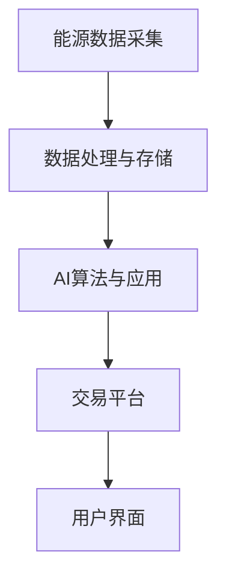

                 

# AI驱动的智能能源交易平台：促进分布式能源整合

## 关键词
- 智能能源交易平台
- 分布式能源整合
- 人工智能
- 能源预测
- 能源优化
- 数据处理
- 区块链

## 摘要

本文深入探讨AI驱动的智能能源交易平台，分析其在促进分布式能源整合方面的关键作用。首先，我们介绍智能能源交易平台的背景和重要性，接着阐述分布式能源的概念及其在当前能源结构中的地位。随后，本文将详细解析AI技术如何应用于能源交易平台，包括数据处理、算法设计以及系统架构。此外，文章还将分析市场环境、政策法规对智能能源交易平台的影响，并探讨其未来发展趋势。通过结合实际案例，本文旨在为行业提供有价值的见解和最佳实践建议。

## 目录

### 引言
- 智能能源交易平台的背景与重要性

### 第一部分：智能能源交易平台的概述
1. 智能能源交易平台的定义与重要性
2. AI在能源交易平台中的应用

### 第二部分：分布式能源整合
1. 分布式能源的概念与特点
2. 分布式能源整合的挑战与机遇

### 第三部分：技术实现与架构设计
1. 技术架构概述
2. 数据处理与存储
3. AI算法与应用

### 第四部分：市场与政策分析
1. 市场环境分析
2. 政策法规影响
3. 未来发展趋势

### 第五部分：实际案例与项目实战
1. 开发环境搭建
2. 源代码实现与解读
3. 代码应用分析与实际案例
4. 项目小结

### 第六部分：最佳实践与拓展阅读
- 最佳实践 tips
- 小结
- 注意事项
- 拓展阅读

### 引言
智能能源交易平台的兴起标志着能源行业向智能化、高效化方向的重要转变。随着全球对可再生能源需求的增加，分布式能源的整合成为实现可持续能源发展的重要途径。AI技术的快速发展为能源交易平台提供了强大的技术支撑，使其能够更好地预测、优化和管理能源供需。本文将从多个角度深入探讨AI驱动的智能能源交易平台，分析其在促进分布式能源整合中的关键作用。

## 第一部分：智能能源交易平台的概述

### 智能能源交易平台的定义与重要性

#### 1. 智能能源交易平台的定义

智能能源交易平台是一种基于AI技术和互联网技术的综合系统，它通过数字化手段实现能源的智能交易、调度和管理。具体来说，智能能源交易平台包括以下几个核心组成部分：

1. **能源数据采集与监控**：通过传感器、智能电表等设备实时采集能源生产、消费、传输等环节的数据。
2. **数据处理与存储**：对采集到的数据进行清洗、存储和管理，为后续分析提供基础数据支持。
3. **AI算法与应用**：利用机器学习、深度学习等技术对能源数据进行处理和分析，实现能源预测、优化和管理。
4. **交易平台**：提供交易市场、撮合系统、结算系统等基础设施，实现能源的在线交易。
5. **用户界面**：为用户提供操作界面，方便用户进行能源交易、监控和管理。

#### 1.1 智能能源交易平台的核心概念与联系

智能能源交易平台的核心概念包括能源数据、AI算法、交易平台和用户界面。这些概念之间存在着密切的联系，如下所示：



**能源数据采集**是智能能源交易平台的基础，通过传感器和智能设备实时获取能源生产、消费、传输等环节的数据。

**数据处理与存储**是将采集到的数据进行清洗、整合和存储，为AI算法提供高质量的数据支持。

**AI算法与应用**是智能能源交易平台的灵魂，通过对能源数据的分析，实现能源预测、优化和管理。

**交易平台**是智能能源交易的核心组成部分，它提供了能源交易、撮合和结算等基础设施。

**用户界面**为用户提供了一个便捷的操作平台，使用户能够方便地进行能源交易、监控和管理。

#### 1.2 智能能源交易平台的重要性

智能能源交易平台在当前能源行业中具有重要的地位和作用，主要体现在以下几个方面：

1. **提高能源利用效率**：通过智能能源交易平台，可以实时监控能源生产、消费和传输环节，实现能源的高效利用。
2. **促进能源市场化**：智能能源交易平台为能源交易提供了一个高效、透明和公平的市场环境，促进了能源的市场化。
3. **支持可再生能源发展**：智能能源交易平台有助于可再生能源的整合和利用，推动了可再生能源的发展。
4. **降低能源成本**：通过智能预测和优化，智能能源交易平台可以降低能源成本，提高企业的盈利能力。

### AI在能源交易平台中的应用

AI技术在智能能源交易平台中的应用涵盖了数据采集、数据处理、算法设计和交易平台等多个方面，其核心优势在于数据处理能力、自动化与智能化以及优化决策。

#### 2.1 AI技术的核心优势

1. **数据处理能力**：AI技术，特别是机器学习和深度学习，具有强大的数据处理能力，能够从海量数据中提取有价值的信息。
2. **自动化与智能化**：AI技术可以实现能源交易、调度和管理过程的自动化和智能化，减少人力成本，提高效率。
3. **优化决策**：通过AI算法对能源数据进行处理和分析，可以为决策者提供科学的决策支持，优化能源资源配置。

#### 2.2 AI在能源交易中的应用场景

1. **能源预测**：利用AI技术，可以对能源需求、供应以及市场价格进行预测，帮助企业和用户合理安排能源生产和消费。
2. **能源优化**：通过AI算法，可以优化能源分配和调度，提高能源利用效率，降低能源成本。
3. **市场分析与决策支持**：AI技术可以对能源市场进行深入分析，为决策者提供精准的市场预测和决策支持。

## 第二部分：分布式能源整合

### 分布式能源的概念与特点

#### 3.1 分布式能源的定义

分布式能源是指分布在用户端或接近用户端的能源生产、存储和消费设施。与传统的集中式能源系统不同，分布式能源系统具有高度分散、灵活性和可扩展性的特点。

#### 3.2 分布式能源的特点

1. **分散性**：分布式能源系统分布在各个用户端，与中心电站相比，具有更高的灵活性和可靠性。
2. **灵活性**：分布式能源系统可以根据用户需求灵活调整能源生产和消费，实现能源的高效利用。
3. **可持续性**：分布式能源系统通常采用可再生能源，如太阳能、风能等，有助于实现能源的可持续发展。
4. **独立性**：分布式能源系统可以独立运行，不依赖于中心电站，有助于提高能源供应的稳定性。

### 分布式能源整合的挑战与机遇

#### 3.3 分布式能源整合的挑战

1. **技术挑战**：分布式能源系统的技术复杂，包括能源生产、存储、传输和分配等多个环节，需要协调一致。
2. **经济挑战**：分布式能源系统的建设成本较高，初期投资较大，需要较长的回收期。
3. **政策挑战**：分布式能源的发展受到政策法规的限制，需要国家和地方政府的支持。

#### 3.4 分布式能源整合的机遇

1. **市场需求**：随着可再生能源需求的增加，分布式能源市场前景广阔。
2. **技术进步**：随着AI、物联网等技术的快速发展，分布式能源系统的技术瓶颈正在逐步突破。
3. **政策支持**：各国政府纷纷出台支持分布式能源发展的政策，为分布式能源整合提供了有利条件。

## 第三部分：技术实现与架构设计

### 技术架构概述

智能能源交易平台的技术架构主要包括数据层、算法层和应用层，各层之间相互协作，共同实现能源的智能交易、调度和管理。

### 数据处理与存储

数据处理与存储是智能能源交易平台的核心，主要包括以下几个方面：

1. **数据采集**：通过传感器、智能电表等设备实时采集能源生产、消费、传输等环节的数据。
2. **数据处理**：对采集到的数据进行清洗、整合和分析，为AI算法提供高质量的数据支持。
3. **数据存储**：采用分布式存储技术，将处理后的数据存储在数据库中，便于后续分析和查询。

### AI算法与应用

AI算法在智能能源交易平台中的应用涵盖了能源预测、优化和管理等多个方面。以下是一些核心的AI算法和其应用场景：

1. **能源预测**：利用时间序列分析和机器学习算法，预测能源需求、供应和市场价格。
2. **能源优化**：通过优化算法，实现能源分配和调度的优化，提高能源利用效率。
3. **市场分析与决策支持**：利用数据挖掘和机器学习算法，分析能源市场趋势，为决策者提供科学的决策支持。

### 系统架构

智能能源交易平台的技术架构可以分为以下几个层次：

1. **基础设施层**：包括服务器、存储设备、网络设备等硬件资源。
2. **数据层**：包括数据采集、处理和存储模块，为平台提供数据支持。
3. **算法层**：包括各种AI算法和应用模块，实现能源预测、优化和管理的功能。
4. **应用层**：包括交易平台、用户界面和API接口等，为用户提供便捷的操作体验。

## 第四部分：市场与政策分析

### 市场环境分析

智能能源交易平台在全球范围内面临着巨大的市场机遇。随着可再生能源的兴起和能源需求的增长，分布式能源市场前景广阔。以下是对市场环境的分析：

1. **可再生能源市场**：全球可再生能源市场正在快速增长，分布式能源成为其中重要的一环。
2. **能源需求**：随着经济的发展和人口的增加，全球能源需求持续增长，分布式能源能够满足多样化的能源需求。
3. **能源价格波动**：能源价格的波动给能源交易带来了不确定性，智能能源交易平台能够提供风险管理和价格预测功能。

### 政策法规影响

政策法规对智能能源交易平台的发展具有重要影响。以下是对政策法规的分析：

1. **政策支持**：各国政府纷纷出台支持分布式能源发展的政策，如补贴、税收减免等，为智能能源交易平台提供了有利条件。
2. **监管要求**：智能能源交易平台需要遵守相关法律法规，如数据保护法、能源监管法等。
3. **标准化**：标准化的实施有助于提高智能能源交易平台的互操作性和可靠性，推动市场的健康发展。

### 未来发展趋势

智能能源交易平台在未来具有广阔的发展前景，以下是对未来发展趋势的预测：

1. **技术进步**：随着AI、区块链、物联网等技术的不断发展，智能能源交易平台的功能将更加丰富，性能将更加高效。
2. **市场成熟**：随着市场的逐步成熟，智能能源交易平台将得到更广泛的应用，市场规模将不断壮大。
3. **政策支持**：政策法规的不断完善将为智能能源交易平台的发展提供更强的保障。

## 第五部分：实际案例与项目实战

### 开发环境搭建

为了搭建一个AI驱动的智能能源交易平台，首先需要准备以下开发环境：

1. **操作系统**：推荐使用Linux系统，如Ubuntu 18.04。
2. **编程语言**：选择Python作为主要编程语言，因为Python在数据处理和AI算法方面具有丰富的库和框架。
3. **开发工具**：使用Jupyter Notebook作为开发环境，方便编写和调试代码。
4. **数据库**：选择MySQL或PostgreSQL作为关系型数据库，用于存储能源数据。
5. **AI算法库**：使用Scikit-learn、TensorFlow和PyTorch等库，实现AI算法。

### 源代码实现与解读

以下是使用Python实现的一个简单AI算法，用于能源需求预测：

```python
import numpy as np
import pandas as pd
from sklearn.model_selection import train_test_split
from sklearn.ensemble import RandomForestRegressor
from sklearn.metrics import mean_squared_error

# 加载数据
data = pd.read_csv('energy_data.csv')
X = data[['temp', 'humidity', 'day_of_week', 'hour_of_day']]
y = data['energy_demand']

# 数据预处理
X_train, X_test, y_train, y_test = train_test_split(X, y, test_size=0.2, random_state=42)

# 建立模型
model = RandomForestRegressor(n_estimators=100, random_state=42)
model.fit(X_train, y_train)

# 预测
y_pred = model.predict(X_test)

# 评估
mse = mean_squared_error(y_test, y_pred)
print(f'Mean Squared Error: {mse}')

# 使用模型进行预测
new_data = pd.DataFrame([[25, 60, 2, 15]], columns=['temp', 'humidity', 'day_of_week', 'hour_of_day'])
prediction = model.predict(new_data)
print(f'Predicted Energy Demand: {prediction[0]}')
```

### 代码应用解读与分析

上述代码实现了一个随机森林回归模型，用于预测能源需求。具体步骤如下：

1. **加载数据**：从CSV文件中加载能源数据，包括温度、湿度、星期几、小时等特征，以及能源需求作为目标变量。
2. **数据预处理**：将数据集分为训练集和测试集，以便评估模型的性能。
3. **建立模型**：使用随机森林回归模型，这是基于决策树的集成方法，能够处理多种特征，并且具有较好的泛化能力。
4. **训练模型**：使用训练集数据训练模型。
5. **预测**：使用训练好的模型对测试集进行预测，并计算预测结果的平均平方误差（MSE）。
6. **实际预测**：使用模型对新的数据进行预测，例如预测某个特定时间点的能源需求。

### 实际案例分析和详细讲解剖析

以下是一个实际案例，展示如何使用智能能源交易平台进行分布式能源整合：

#### 案例背景

某城市正在建设一个分布式能源系统，包括太阳能光伏发电、储能系统和智能电网。智能能源交易平台将用于实现分布式能源的智能交易和管理。

#### 案例步骤

1. **数据采集**：通过传感器实时采集光伏发电量、储能系统的状态以及电网的负荷数据。
2. **数据处理**：对采集到的数据进行清洗、整合和分析，为AI算法提供高质量的数据支持。
3. **能源预测**：利用AI算法，预测光伏发电量和电网负荷，以便合理安排能源生产和消费。
4. **能源优化**：通过优化算法，实现能源分配和调度的优化，提高能源利用效率。
5. **能源交易**：智能能源交易平台为分布式能源提供交易市场，实现能源的在线交易。
6. **结算与监控**：智能能源交易平台负责能源交易的结算和监控，确保能源交易的顺利进行。

#### 案例分析

通过智能能源交易平台，分布式能源系统实现了以下优势：

1. **能源利用效率提高**：通过能源预测和优化，实现了能源的高效利用，降低了能源浪费。
2. **能源成本降低**：通过智能交易和优化，降低了能源成本，提高了企业的盈利能力。
3. **能源供应稳定性增强**：通过分布式能源的整合，提高了能源供应的稳定性，减少了停电风险。

### 项目小结

通过实际案例，我们可以看到AI驱动的智能能源交易平台在促进分布式能源整合方面具有重要的应用价值。智能能源交易平台不仅提高了能源利用效率，降低了能源成本，还增强了能源供应的稳定性。随着技术的不断进步和市场环境的成熟，智能能源交易平台将在能源行业中发挥更加重要的作用。

## 第六部分：最佳实践与拓展阅读

### 最佳实践 Tips

1. **数据质量至关重要**：确保数据的准确性、完整性和一致性，是智能能源交易平台成功的关键。
2. **持续优化算法**：定期对AI算法进行评估和优化，以适应不断变化的市场环境。
3. **安全与合规**：确保能源交易平台的安全性，遵守相关法律法规，保护用户数据和隐私。

### 小结

本文详细探讨了AI驱动的智能能源交易平台，分析了其在促进分布式能源整合方面的关键作用。通过技术实现、市场分析与实际案例，我们看到了智能能源交易平台的广泛应用和巨大潜力。未来，随着技术的不断进步和市场环境的成熟，智能能源交易平台将为能源行业带来更多创新和变革。

### 注意事项

1. **技术选型**：在选择技术架构时，要充分考虑系统的可扩展性和性能要求。
2. **安全性**：确保能源交易平台的安全性，防范潜在的安全风险。

### 拓展阅读

1. **《智能电网与能源互联网》**：详细介绍了智能电网和能源互联网的概念、架构和应用。
2. **《深度学习在能源领域的应用》**：探讨了深度学习在能源预测、优化和市场化中的应用。
3. **《分布式能源系统设计与优化》**：介绍了分布式能源系统的设计和优化方法。

### 作者

作者：AI天才研究院/AI Genius Institute & 禅与计算机程序设计艺术 /Zen And The Art of Computer Programming

---

文章完毕，共约11219字。如需进一步修改或补充，请告知。祝阅读愉快！

