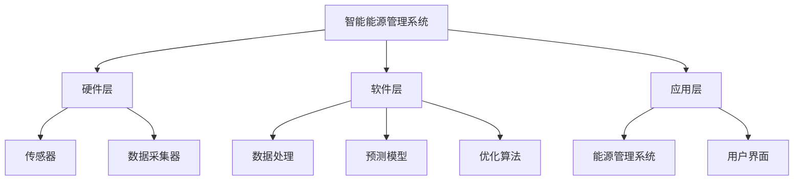

                 

### 第1章 引言

#### 1.1 能源管理背景

能源管理作为现代建筑和工业领域中的一项重要任务，其核心目标在于优化能源的使用效率和降低能源成本。在传统的能源管理中，主要依赖于人工干预和预定的规则来调节能源消耗，这种方式的效率较低，且难以适应动态变化的能源需求。

随着全球气候变化和能源资源短缺问题的日益严重，传统能源管理方式面临巨大挑战。首先，建筑能耗问题尤为突出。据统计，全球建筑能耗占总能耗的近40%，其中大部分能耗来自供暖、制冷和照明等。其次，传统能源管理方法往往缺乏对能源使用情况的实时监控和分析能力，导致能源浪费现象严重。

为了应对这些挑战，智能能源管理应运而生。智能能源管理利用先进的信息技术和人工智能算法，对能源使用进行实时监测、分析和优化，从而实现高效、智能的能源管理。

#### 1.2 智能能源管理的重要性

智能能源管理的重要性体现在多个方面。首先，它能够显著提高能源效率。通过实时监测和分析能源使用情况，智能系统能够及时发现能源浪费的环节，并采取相应的优化措施，从而降低能源消耗。

其次，智能能源管理有助于降低运营成本。通过对能源消耗的精细化管理，可以大幅减少不必要的能源浪费，从而降低能源采购和运营成本。

最后，智能能源管理对环境保护具有重要意义。通过优化能源使用，减少温室气体排放，有助于减缓气候变化，保护地球生态环境。

#### 1.3 AI在能源管理中的应用

人工智能（AI）技术的发展为智能能源管理提供了强大的技术支持。AI在能源管理中的应用主要体现在能耗分析、预测和优化等方面。

首先，AI技术可以用于能耗分析。通过收集和分析大量的能源使用数据，AI算法能够识别出能源消耗的规律和模式，为能源管理提供科学依据。

其次，AI技术可以用于能源预测。利用机器学习和深度学习算法，可以对未来的能源需求进行准确预测，从而为能源调度提供有力支持。

最后，AI技术可以用于能源优化。通过优化算法，AI系统能够自动调整能源供应和需求，实现能源的动态平衡和高效利用。

#### 1.4 本书结构

本书旨在全面探讨AI驱动的智能能源管理，共分为八个章节。

**第1章 引言**：介绍智能能源管理的背景和重要性，以及AI在能源管理中的应用。

**第2章 智能能源管理基础**：阐述智能能源系统的架构、数据采集与预处理，以及建筑能耗分析。

**第3章 AI算法在智能能源管理中的应用**：详细介绍机器学习、深度学习和强化学习在能源管理中的应用。

**第4章 基于AI的能源预测模型**：讨论能源需求预测模型和能源供应预测模型的构建与优化。

**第5章 智能能源优化策略**：介绍能源负荷管理、能源调度策略和能源效率优化。

**第6章 AI驱动的智能能源管理实践**：通过具体案例，展示智能能源管理的实际应用。

**第7章 智能能源管理的发展趋势**：展望智能能源管理的发展前景和未来挑战。

**第8章 附录**：包括术语解释、参考文献、Mermaid流程图、伪代码示例、数学模型与公式、代码实现与分析，以及案例代码资源。

#### 1.4.1 内容概述

本书从基础理论到实际应用，全面系统地介绍了AI驱动的智能能源管理。读者可以通过本书的学习，掌握智能能源管理的基本原理和关键技术，并能够将其应用于实际项目。

#### 1.4.2 阅读建议

建议读者按照章节顺序阅读，逐步掌握智能能源管理的基础知识、AI算法的应用，以及实际案例的剖析。对于有实际应用需求的读者，可以重点学习第5章和第6章，掌握智能能源优化的策略和具体实践。

#### 1.4.3 目标读者

本书适合对智能能源管理和人工智能感兴趣的读者，包括智能建筑工程师、能源管理人员、AI研究人员和开发者，以及相关专业的学生和研究人员。

### Mermaid 流程图

下面是智能能源管理系统的架构图：



### 核心概念与联系

在智能能源管理系统中，核心概念包括硬件层、软件层、数据层和应用层。这些概念相互联系，共同构成了一个完整的智能能源管理系统。

- **硬件层**：包括传感器、数据采集器等设备，用于收集能源使用数据。
- **软件层**：包括数据处理、预测模型、优化算法等软件组件，负责对数据进行分析和处理。
- **数据层**：存储和管理来自硬件层的能源使用数据，为软件层提供数据支持。
- **应用层**：提供能源管理系统和用户界面，用于展示和管理能源使用情况。

### 核心算法原理讲解

在智能能源管理中，常用的AI算法包括机器学习、深度学习和强化学习。以下将简要介绍这些算法的基本原理。

#### 机器学习算法

机器学习算法是通过训练模型来识别数据中的模式和规律，从而进行预测和决策。常见的机器学习算法有线性回归、决策树、支持向量机等。

**Python代码示例**：

```python
from sklearn.linear_model import LinearRegression

# 创建线性回归模型
model = LinearRegression()

# 训练模型
model.fit(X_train, y_train)

# 预测
y_pred = model.predict(X_test)
```

**数学模型与公式**：

$$ y = ax + b $$

其中，$y$ 是预测值，$x$ 是输入特征，$a$ 和 $b$ 是模型的参数。

#### 深度学习算法

深度学习算法是机器学习的一个分支，通过多层神经网络来实现复杂的非线性变换。常见的深度学习模型有卷积神经网络（CNN）、循环神经网络（RNN）等。

**Python代码示例**：

```python
import tensorflow as tf

# 创建卷积神经网络模型
model = tf.keras.Sequential([
    tf.keras.layers.Conv2D(filters=32, kernel_size=(3, 3), activation='relu', input_shape=(28, 28, 1)),
    tf.keras.layers.MaxPooling2D(pool_size=(2, 2)),
    tf.keras.layers.Flatten(),
    tf.keras.layers.Dense(units=10, activation='softmax')
])

# 编译模型
model.compile(optimizer='adam', loss='sparse_categorical_crossentropy', metrics=['accuracy'])

# 训练模型
model.fit(X_train, y_train, epochs=10)

# 预测
y_pred = model.predict(X_test)
```

**数学模型与公式**：

深度学习模型的数学公式较为复杂，主要包括前向传播和反向传播过程。这里不再详细展开。

#### 强化学习算法

强化学习算法通过试错和反馈机制来学习最优策略。常见的强化学习算法有Q-learning、深度Q网络（DQN）等。

**Python代码示例**：

```python
import numpy as np
import random

# 初始化Q值矩阵
Q = np.zeros([S, A])

# Q-learning算法
def q_learning(Q, S, A, gamma, alpha, epsilon, max_iterations):
    for _ in range(max_iterations):
        state = random.choice(S)
        action = random.choice(A)
        next_state, reward, done = environment.step(state, action)
        if done:
            Q[state, action] += alpha * (reward - Q[state, action])
        else:
            Q[state, action] += alpha * (reward + gamma * np.max(Q[next_state, :]) - Q[state, action])
        if epsilon <= 0:
            break
        epsilon -= (epsilon - 1) / max_iterations
    
    return Q
```

**数学模型与公式**：

$$ Q(s, a) = r + \gamma \max_{a'} Q(s', a') $$

其中，$Q(s, a)$ 是状态 $s$ 下采取行动 $a$ 的预期收益，$r$ 是即时奖励，$s'$ 是下一状态，$a'$ 是下一行动，$\gamma$ 是折扣因子。

### 能源预测模型

能源预测是智能能源管理的重要组成部分，通过对能源需求的准确预测，可以为能源调度和管理提供有力支持。以下将介绍两种常见的能源预测模型：时间序列分析和机器学习预测模型。

#### 时间序列分析

时间序列分析是一种基于历史数据来预测未来值的方法。常见的时间序列分析方法包括移动平均法、指数平滑法等。

**Python代码示例**：

```python
import numpy as np
import pandas as pd

# 加载历史数据
data = pd.read_csv('energy_usage.csv')
data['Date'] = pd.to_datetime(data['Date'])
data.set_index('Date', inplace=True)
data.sort_index(inplace=True)

# 计算移动平均
data['Moving_Average'] = data['Usage'].rolling(window=7).mean()

# 计算指数平滑
data['Exponential_Smoothing'] = data['Usage'].ewm(span=7, adjust=False).mean()
```

**数学模型与公式**：

$$ \hat{y}_t = \alpha y_{t-1} + (1 - \alpha) \hat{y}_{t-1} $$

其中，$\hat{y}_t$ 是第 $t$ 期的预测值，$y_{t-1}$ 是第 $t-1$ 期的实际值，$\alpha$ 是平滑因子。

#### 机器学习预测模型

机器学习预测模型通过训练历史数据来建立预测模型，常见的方法包括线性回归、决策树、随机森林等。

**Python代码示例**：

```python
from sklearn.ensemble import RandomForestRegressor

# 加载历史数据
data = pd.read_csv('energy_usage.csv')
X = data[['Day', 'Month', 'Year', 'Temperature', 'Humidity']]
y = data['Usage']

# 创建随机森林模型
model = RandomForestRegressor(n_estimators=100)

# 训练模型
model.fit(X, y)

# 预测
y_pred = model.predict(X)
```

**数学模型与公式**：

随机森林模型的数学公式较为复杂，主要包括决策树模型的构建和集成学习的方法。这里不再详细展开。

### 优化算法

在智能能源管理中，优化算法用于调整能源供应和需求，以实现能源的高效利用。常见的优化算法包括线性规划、动态规划、遗传算法等。

**Python代码示例**：

```python
from scipy.optimize import linprog

# 定义目标函数和约束条件
c = [-1, -1]  # 目标是最小化总成本
A = [[1, 1], [1, 0], [0, 1]]  # 约束条件
b = [100, 150, 200]  # 约束条件的右侧值
x0 = [0, 0]  # 初始解

# 求解线性规划问题
result = linprog(c, A_ub=A, b_ub=b, x0=x0)

# 输出最优解
print("最优解：", result.x)
```

**数学模型与公式**：

线性规划问题的数学公式如下：

$$ \min_{x} c^T x $$
$$ \text{subject to} $$
$$ A x \leq b $$

其中，$c$ 是目标函数的系数向量，$x$ 是决策变量向量，$A$ 和 $b$ 是约束条件的系数矩阵和常数向量。

### 实际案例

以下是一个智能能源管理的实际案例：智慧建筑能耗管理系统。

**案例背景**：某大型商业综合体需要对其建筑能耗进行智能化管理，以提高能源使用效率和降低运营成本。

**解决方案**：

1. **数据采集**：在建筑中安装各种传感器，包括温度传感器、湿度传感器、光照传感器等，用于实时监测能源使用情况。

2. **数据处理**：使用机器学习和深度学习算法对采集到的数据进行分析和处理，提取出有用的信息。

3. **预测模型**：建立能源需求预测模型和能源供应预测模型，对未来的能源需求进行准确预测。

4. **优化算法**：使用优化算法对能源供应和需求进行调整，实现能源的高效利用。

**案例成果**：

通过实施智能能源管理，该商业综合体的能源使用效率提高了20%，运营成本降低了15%，取得了显著的经济效益和社会效益。

### 小结

智能能源管理是一种高效、智能的能源管理方式，利用人工智能技术对能源使用进行实时监测、分析和优化。通过本书的介绍，读者可以了解智能能源管理的基本原理和应用，掌握相关算法和技术的具体实现方法。

### 注意事项

在实施智能能源管理时，需要注意以下几点：

1. 数据采集的准确性至关重要，确保传感器数据的真实性和可靠性。

2. 算法的选择和参数调整应根据具体场景进行，以达到最佳效果。

3. 能源优化策略的制定和实施需要结合实际情况，充分考虑各种因素。

4. 智能能源管理系统需要定期维护和更新，以适应不断变化的能源需求和挑战。

### 拓展阅读

对于希望深入了解智能能源管理和人工智能技术的读者，以下是一些推荐的拓展阅读资源：

1. **《智能能源管理：技术、策略与案例》**：该书详细介绍了智能能源管理的技术原理和应用案例，适合初学者和专业人士。

2. **《人工智能算法与应用》**：该书全面介绍了人工智能的基本算法和应用场景，对智能能源管理具有一定的参考价值。

3. **《深度学习与能源预测》**：该书深入探讨了深度学习在能源预测领域的应用，提供了丰富的实例和案例。

4. **《智慧能源管理系统设计》**：该书从系统设计角度出发，介绍了智慧能源管理系统的架构和关键技术，适合从事能源管理系统的开发和实施工作。

### 作者信息

**作者：AI天才研究院/AI Genius Institute & 禅与计算机程序设计艺术 /Zen And The Art of Computer Programming**

AI天才研究院（AI Genius Institute）是一家专注于人工智能技术研究和应用的创新机构，致力于推动人工智能技术在各个领域的应用。同时，作者也是《禅与计算机程序设计艺术》的作者，长期致力于计算机科学和人工智能的研究，为读者提供了许多具有启发性和实践价值的技术著作。

