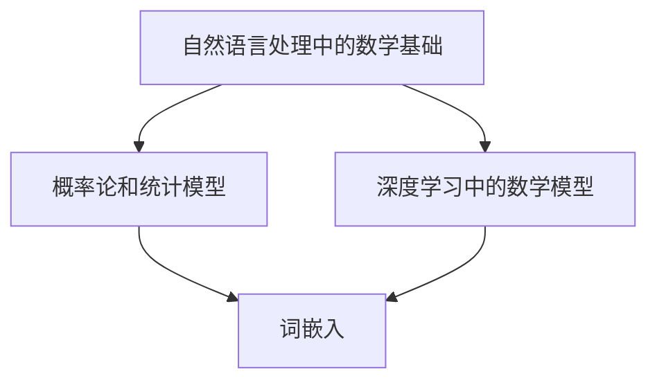
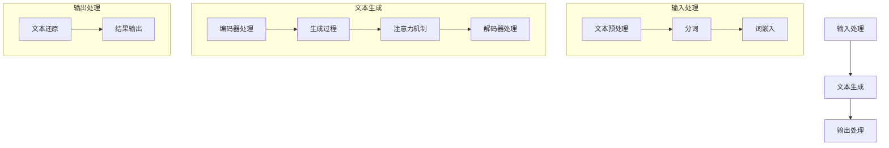

                 

### 引言

在科研领域，高效的信息获取、分析以及知识整合对于推动研究进展至关重要。随着人工智能技术的不断进步，自然语言处理（NLP）工具如ChatGPT的出现，为科研工作者提供了一种全新的研究助手。ChatGPT，即聊天生成预训练模型（Chat Generative Pre-trained Transformer），是一种基于深度学习的自然语言处理模型，具备强大的语言理解和生成能力。本文旨在探讨ChatGPT在科研中的应用，特别是如何构建有效的提示词，以最大限度地发挥其在科研中的助手作用。

文章结构如下：

- **第1章 ChatGPT的基本原理**：介绍ChatGPT的架构、数学模型以及工作流程。
- **第2章 ChatGPT在科研中的应用场景**：讨论ChatGPT在科研写作、数据分析和学术交流中的具体应用。
- **第3章 提示词设计的原则和技巧**：阐述提示词的定义、设计原则和技巧。
- **第4章 提示词的实际案例**：通过实际案例展示提示词在科研中的使用。
- **第5章 实战演练**：提供ChatGPT环境搭建和案例实战的步骤。
- **第6章 进阶应用**：探讨ChatGPT在其他领域的跨领域应用。
- **第7章 总结与展望**：总结ChatGPT在科研中的应用，并提出未来展望。

本文的目标是通过详细的分析和具体的案例，帮助科研工作者更好地理解和应用ChatGPT，从而构建一个有效的科研助手。

### 关键词

- **ChatGPT**
- **自然语言处理（NLP）**
- **科研写作**
- **数据分析**
- **提示词设计**
- **人工智能**

### 摘要

本文探讨了ChatGPT在科研中的应用，尤其是如何构建有效的提示词。首先，我们介绍了ChatGPT的基本原理，包括其架构、数学模型和工作流程。接着，详细阐述了ChatGPT在科研写作、数据分析和学术交流中的应用场景。随后，我们重点讨论了提示词的设计原则和技巧，并通过实际案例展示了这些原则和技巧的具体应用。最后，本文提供了ChatGPT环境搭建和案例实战的步骤，并探讨了ChatGPT在跨领域应用中的潜力。通过本文的探讨，我们希望能够为科研工作者提供一种新的工具，帮助他们在科研过程中更加高效地获取和利用信息。

## 第1章 ChatGPT的基本原理

### 1.1 ChatGPT的架构

ChatGPT 是一种基于深度学习的自然语言处理模型，其核心架构由生成模型和语言模型组成。生成模型主要负责生成文本，而语言模型则负责理解和分析输入的文本。

首先，让我们来看看生成模型。生成模型的基本原理是通过学习大量的文本数据，生成与输入文本相关的其他文本。ChatGPT 使用的生成模型是基于 Transformer 架构的。Transformer 架构由多个自注意力（self-attention）层组成，这种结构使得模型能够捕捉长距离的依赖关系，从而生成连贯的文本。

在 ChatGPT 中，生成模型由多个 Transformer 层堆叠而成，每一层都包含多个自注意力头（head）。这些自注意力头可以并行处理输入文本的不同部分，从而提高模型的计算效率。此外，ChatGPT 还引入了多头自注意力机制（multi-head self-attention），通过将不同注意力头的结果进行加权平均，进一步提高了模型的性能。

接下来，我们来看看语言模型。语言模型是一种能够根据输入的文本片段预测下一个文本片段的概率的模型。在 ChatGPT 中，语言模型同样基于 Transformer 架构，通过训练大量的文本数据，学习到文本的统计规律和语法规则，从而能够生成连贯的文本。

ChatGPT 的架构还包括多个辅助组件，如词嵌入层（word embeddings）和前馈神经网络（feedforward network）。词嵌入层将输入的单词映射到高维空间中的向量，从而便于模型处理。前馈神经网络则用于对自注意力层的输出进行进一步加工，增强模型的文本生成能力。

总的来说，ChatGPT 的架构由生成模型和语言模型组成，通过多个 Transformer 层、自注意力头和词嵌入层等组件，实现了强大的文本生成和理解能力。

### 1.2 数学模型

在 ChatGPT 的数学模型中，自然语言处理（NLP）中的数学基础、概率论和统计模型以及深度学习中的数学模型起到了至关重要的作用。以下是对这些核心概念和它们之间关系的详细解释。

#### 自然语言处理中的数学基础

自然语言处理的核心在于理解和生成自然语言。为了实现这一目标，我们需要将自然语言转换为数学模型可以处理的格式。这一过程通常涉及到文本表示，其中最常用的方法是词嵌入（word embeddings）。词嵌入将每个单词映射到一个高维向量空间中，使得这些向量可以捕获单词的语义和语法信息。

词嵌入通常是通过训练大规模的文本数据集来获得的。最著名的词嵌入模型之一是 Word2Vec，它通过预测相邻单词来学习词向量。另一种流行的方法是使用转换器（Transformer）模型中的自注意力机制，这种方法可以捕获单词之间的长距离依赖关系。

#### 概率论和统计模型

在 NLP 中，概率论和统计模型用于预测文本序列的概率分布。这种预测有助于生成连贯的文本，并且在许多 NLP 任务中（如机器翻译、文本摘要和对话系统）都是不可或缺的。

一种常用的概率模型是隐马尔可夫模型（HMM），它通过状态转移概率和发射概率来预测文本序列。然而，HMM 在处理长序列和长距离依赖关系时存在局限性。为了克服这些限制，序列到序列（sequence-to-sequence）模型被引入，它通过编码器-解码器架构来处理序列数据。

统计模型也在文本分类和情感分析等任务中发挥着重要作用。这些模型通过学习文本的统计特征来预测类别标签或情感极性。支持向量机（SVM）、朴素贝叶斯（Naive Bayes）和逻辑回归（Logistic Regression）是常用的统计分类器。

#### 深度学习中的数学模型

深度学习是 NLP 中最先进的技术之一，它通过多层神经网络来学习复杂的数据特征。在 ChatGPT 中，深度学习模型（尤其是 Transformer 模型）扮演了核心角色。

Transformer 模型由自注意力机制（self-attention）和前馈神经网络（feedforward network）组成。自注意力机制通过计算输入序列中每个词与其他词之间的依赖关系来生成文本表示。这种机制使得模型能够捕捉长距离的依赖关系，从而生成更加连贯的文本。

前馈神经网络则用于对自注意力层的输出进行进一步加工，增强模型的文本生成能力。这些神经网络通常包含几个隐藏层，每个隐藏层都通过激活函数（如ReLU）进行非线性变换。

除了 Transformer 模型，其他深度学习模型如循环神经网络（RNN）和长短期记忆网络（LSTM）也在 NLP 中得到广泛应用。RNN 和 LSTM 通过记忆机制来处理序列数据，但它们在处理长距离依赖关系时仍存在一些挑战。

#### 核心概念和关系架构

自然语言处理中的数学基础、概率论和统计模型以及深度学习中的数学模型共同构成了 ChatGPT 的数学模型。这些模型之间的关系可以总结如下：

1. **词嵌入**：词嵌入是自然语言处理的基础，它将单词映射到高维向量空间中，为其他模型提供了输入数据。

2. **概率模型**：概率模型用于预测文本序列的概率分布，它们依赖于词嵌入来生成文本表示。

3. **深度学习模型**：深度学习模型通过学习复杂的数据特征来生成文本，它们通常基于概率模型来提高性能。

为了更直观地理解这些模型之间的关系，我们可以使用 Mermaid 流程图来表示它们的核心概念和关系架构。以下是一个简化的 Mermaid 流程图示例：



在这个流程图中，自然语言处理中的数学基础、概率论和统计模型以及深度学习中的数学模型都是通过词嵌入来连接的。这个流程图帮助我们理解了这些模型之间的相互依赖和协作，从而为 ChatGPT 的构建提供了理论基础。

通过以上对 ChatGPT 基本原理的详细分析，我们可以看到，ChatGPT 的架构和数学模型是如何共同作用，为科研工作者提供了一种强大的文本生成和理解工具。

### 1.3 ChatGPT的工作流程

ChatGPT 的工作流程可以分为三个主要阶段：输入处理、文本生成和输出处理。

#### 输入处理

输入处理是 ChatGPT 的工作流程的第一步，它涉及到将输入文本转换为模型可以处理的格式。这个过程包括以下几个步骤：

1. **文本预处理**：在将文本输入到模型之前，通常需要对文本进行预处理，例如去除标点符号、统一文本大小写、去除停用词等。这些预处理步骤有助于提高模型的性能和生成文本的质量。

2. **分词**：将输入文本分割成单词或子词。分词是自然语言处理中的基础步骤，其目的是将连续的文本序列拆分成具有独立意义的单元。ChatGPT 使用基于字符的分词方法，将每个字符映射到一个唯一的 ID。

3. **词嵌入**：将分词后的单词或子词映射到高维向量空间中。这些向量代表了单词或子词的语义信息。词嵌入是 ChatGPT 模型的重要组成部分，它有助于模型理解和生成文本。

#### 文本生成

文本生成是 ChatGPT 工作流程的核心阶段，它涉及模型根据输入文本生成新的文本。这个过程可以分为以下几个步骤：

1. **编码器处理**：输入文本经过编码器（encoder）处理，编码器将输入文本映射为一个上下文向量（context vector）。这个上下文向量包含了输入文本的信息，并作为后续生成过程的参考。

2. **生成过程**：在生成过程阶段，模型根据上下文向量生成文本的每个单词或子词。这个过程通常通过递归的方式实现，模型在每个时间步根据当前的上下文向量生成下一个单词或子词。

3. **注意力机制**：ChatGPT 使用注意力机制（attention mechanism）来捕捉输入文本中不同部分之间的关系。注意力机制可以帮助模型更好地理解和生成文本，特别是处理长文本时。

4. **解码器处理**：生成的文本序列通过解码器（decoder）进行处理，解码器负责对生成的文本进行后处理，例如去除多余的空格、标点符号等。

#### 输出处理

输出处理是 ChatGPT 工作流程的最后一步，它涉及到将生成的文本转换为可读格式，并输出结果。这个过程包括以下几个步骤：

1. **文本还原**：将生成的文本序列还原为可读的文本格式，例如去除分词标记、恢复标点符号等。

2. **结果输出**：将处理后的文本输出到终端或用户界面，用户可以看到模型生成的文本。

总的来说，ChatGPT 的工作流程是一个复杂但高度优化的过程，它通过输入处理、文本生成和输出处理三个阶段，实现了从输入文本到生成文本的高效转换。以下是一个简化的 Mermaid 流程图，展示了 ChatGPT 的工作流程：



通过这个流程图，我们可以清晰地看到 ChatGPT 的工作流程及其各个阶段的关键步骤，这有助于我们更好地理解和应用 ChatGPT。

### 1.4 总结

在本文的第一章中，我们深入探讨了 ChatGPT 的基本原理，包括其架构、数学模型以及工作流程。首先，我们介绍了 ChatGPT 的架构，包括生成模型和语言模型，并详细阐述了 Transformer 架构和多头自注意力机制的工作原理。接着，我们分析了 ChatGPT 所依赖的数学模型，包括自然语言处理中的数学基础、概率论和统计模型以及深度学习中的数学模型，并通过 Mermaid 流程图展示了这些模型之间的关系。最后，我们详细描述了 ChatGPT 的工作流程，从输入处理、文本生成到输出处理，涵盖了每个阶段的详细步骤。

通过这一章的学习，读者应该对 ChatGPT 的基本原理有了全面的了解，认识到其在自然语言处理中的强大能力和广泛应用。接下来，我们将进一步探讨 ChatGPT 在科研中的具体应用场景，帮助科研工作者更好地利用这一工具提升科研效率。

## 第2章 ChatGPT在科研中的应用场景

### 2.1 科研写作

在科研写作中，ChatGPT 可以作为研究助手，协助科研工作者完成从研究背景提取到假设提出的各个阶段。以下是 ChatGPT 在科研写作中的应用：

#### 提取研究背景

研究背景是科研论文的重要部分，它概述了研究领域的发展现状、关键问题以及研究的重要性。ChatGPT 可以通过分析大量的文献资料，帮助研究者快速提取研究背景。

**案例**：假设研究者正在撰写一篇关于“深度学习在图像识别中的应用”的论文。ChatGPT 可以通过以下提示词进行背景提取：

```plaintext
请概述深度学习在图像识别领域的发展现状。
```

**输出**：ChatGPT 生成的文本可能会包括：

```
深度学习在图像识别领域的发展可以追溯到2012年，当时AlexNet模型在ImageNet竞赛中取得了突破性的成绩。此后，深度学习技术迅速发展，卷积神经网络（CNN）成为了图像识别领域的核心工具。随着计算能力的提升和数据量的增加，深度学习模型在图像识别任务上的准确率不断提升，已经广泛应用于人脸识别、物体检测和图像分割等领域。
```

#### 撰写研究问题

研究问题是科研论文的核心，它明确指出了研究的目标和问题。ChatGPT 可以通过分析研究背景和已有文献，协助研究者提出具有针对性的研究问题。

**案例**：基于上述研究背景，研究者想要提出一个研究问题。ChatGPT 可以通过以下提示词进行撰写：

```plaintext
请根据深度学习在图像识别中的应用现状，提出一个研究问题。
```

**输出**：ChatGPT 生成的文本可能会包括：

```
在深度学习模型中，如何通过改进网络结构和训练策略来提升图像识别任务的准确性，特别是在处理复杂场景和变化多端的图像时？
```

#### 提出假设

假设是科研研究过程中的重要一环，它是对研究问题的潜在解决方案或解释的预测。ChatGPT 可以基于研究问题和已有知识，帮助研究者提出合理的假设。

**案例**：基于上述研究问题，研究者想要提出一个假设。ChatGPT 可以通过以下提示词进行假设提出：

```plaintext
请根据上述研究问题，提出一个可能的假设。
```

**输出**：ChatGPT 生成的文本可能会包括：

```
通过引入注意力机制和改进数据增强策略，可以显著提高深度学习模型在复杂场景和变化多端的图像识别任务中的准确性。
```

通过以上案例，我们可以看到 ChatGPT 在科研写作中的强大应用能力。它不仅可以快速提取研究背景，还能帮助研究者提出研究问题和假设，从而提高科研写作的效率和质量。

### 2.2 数据分析

在数据分析领域，ChatGPT 可以作为一个强大的工具，帮助科研工作者进行数据预处理、数据可视化和统计分析。以下是 ChatGPT 在数据分析中的应用：

#### 数据预处理

数据预处理是数据分析的重要步骤，它涉及到数据的清洗、整合和转换。ChatGPT 可以通过自然语言处理技术，自动完成数据预处理任务。

**案例**：假设研究者有一份数据集，包含多个变量，需要对其进行预处理。ChatGPT 可以通过以下提示词进行数据预处理：

```plaintext
请帮我处理这个数据集，包括数据清洗、整合和转换。
```

**输出**：ChatGPT 生成的文本可能会包括：

```
首先，我们需要对数据进行清洗，去除缺失值和异常值。接着，我们将数据整合到一个统一的格式中，以便后续分析。最后，我们将数值型变量转换为适合建模的格式，例如进行标准化处理。
```

#### 数据可视化

数据可视化是将数据以图形化的形式展示，帮助研究者直观地理解数据分布和趋势。ChatGPT 可以根据数据类型和需求，生成相应的可视化图表。

**案例**：研究者想要展示数据集的分布情况。ChatGPT 可以通过以下提示词生成可视化图表：

```plaintext
请生成一个描述该数据集分布的柱状图。
```

**输出**：ChatGPT 生成的文本可能会包括：

```
我们可以使用matplotlib库生成一个柱状图，横轴表示不同的类别，纵轴表示每个类别的频数。
```

对应的柱状图代码示例：

```python
import matplotlib.pyplot as plt
import pandas as pd

# 假设 df 是预处理后的数据集
data = df['category'].value_counts()
data.plot(kind='bar')
plt.xlabel('Categories')
plt.ylabel('Frequency')
plt.title('Distribution of Categories in the Dataset')
plt.show()
```

#### 统计分析

统计分析是数据分析的核心步骤，它通过统计方法对数据进行定量分析，帮助研究者理解数据背后的规律。ChatGPT 可以根据研究需求，生成相应的统计分析方法。

**案例**：研究者想要分析两个变量之间的关系。ChatGPT 可以通过以下提示词进行统计分析：

```plaintext
请使用合适的统计方法分析变量 X 和变量 Y 之间的关系。
```

**输出**：ChatGPT 生成的文本可能会包括：

```
我们可以使用皮尔逊相关系数来分析变量 X 和变量 Y 之间的线性关系。如果相关系数接近1或-1，说明变量之间存在较强的线性关系；如果相关系数接近0，说明变量之间几乎没有线性关系。
```

对应的统计分析代码示例：

```python
import pandas as pd
import numpy as np

# 假设 df 是预处理后的数据集
X = df['X']
Y = df['Y']

# 计算皮尔逊相关系数
correlation = np.corrcoef(X, Y)[0, 1]
print(f"Pearson correlation coefficient: {correlation}")
```

通过以上案例，我们可以看到 ChatGPT 在数据分析中的广泛应用。它不仅能够自动完成数据预处理任务，还能生成数据可视化图表和统计分析方法，从而显著提高数据分析的效率。

### 2.3 学术交流

在学术交流中，ChatGPT 也可以作为研究助手的角色，帮助科研工作者撰写会议报告、编写论文摘要以及参与学术讨论。

#### 撰写会议报告

撰写会议报告需要对会议内容进行总结和归纳，同时还需要突出重点和亮点。ChatGPT 可以通过自然语言处理技术，自动生成会议报告的草稿。

**案例**：假设研究者参加了一个关于“深度学习在医疗领域的应用”的学术会议。ChatGPT 可以通过以下提示词生成会议报告：

```plaintext
请帮我根据会议内容撰写一份会议报告。
```

**输出**：ChatGPT 生成的文本可能会包括：

```
本次会议主要讨论了深度学习在医疗领域的应用，包括图像识别、疾病诊断和个性化治疗等方面。会议报告了多个研究案例，展示了深度学习技术在提升医疗诊断准确性和效率方面的潜力。此外，会议还探讨了深度学习技术的挑战和未来研究方向。
```

#### 编写论文摘要

论文摘要是对论文内容的简短概括，它需要准确地反映论文的主要观点和研究结果。ChatGPT 可以通过分析论文内容，自动生成摘要。

**案例**：研究者撰写了一篇关于“基于深度学习的图像识别算法”的论文。ChatGPT 可以通过以下提示词生成摘要：

```plaintext
请根据这篇论文的内容，撰写一个摘要。
```

**输出**：ChatGPT 生成的文本可能会包括：

```
本文提出了一种基于深度学习的图像识别算法，通过改进卷积神经网络结构和训练策略，实现了较高的识别准确率。实验结果表明，该算法在处理复杂场景和变化多端的图像时具有较好的性能，有望在图像识别领域得到广泛应用。
```

#### 参与学术讨论

在学术讨论中，ChatGPT 可以作为讨论者或辅助工具，帮助研究者理解和回应其他研究者的观点。

**案例**：研究者想要回应一位同行提出的关于其研究方法的质疑。ChatGPT 可以通过以下提示词生成回应：

```plaintext
请帮我针对同行提出的质疑，撰写一条回应。
```

**输出**：ChatGPT 生成的文本可能会包括：

```
关于同行提出的关于我们研究方法的质疑，我们认为，虽然我们的方法在某些特定情况下可能存在局限，但我们在论文中已经详细讨论了这些局限，并提出了改进方案。我们相信，通过进一步的优化和研究，我们的方法在未来的应用中将具有更大的潜力。
```

通过以上案例，我们可以看到 ChatGPT 在学术交流中的广泛应用。它不仅能够协助研究者撰写会议报告和论文摘要，还能在学术讨论中提供有价值的观点和回应，从而提升学术交流的效率和质量。

### 2.4 总结

在第2章中，我们探讨了 ChatGPT 在科研写作、数据分析和学术交流中的具体应用。首先，我们详细介绍了 ChatGPT 在科研写作中的应用，包括研究背景提取、研究问题提出和假设生成。接着，我们展示了 ChatGPT 在数据分析中的应用，从数据预处理到数据可视化和统计分析。最后，我们讨论了 ChatGPT 在学术交流中的应用，包括撰写会议报告、编写论文摘要和参与学术讨论。通过这些具体的应用案例，我们可以看到 ChatGPT 在科研中的强大能力和广泛应用。在接下来的章节中，我们将进一步讨论提示词设计的原则和技巧，帮助科研工作者更好地利用 ChatGPT，提升科研效率。

## 第3章 提示词设计的原则和技巧

### 3.1 提示词的定义

提示词（prompt）是引导 ChatGPT 生成文本的关键输入，它定义了生成文本的上下文和目标。一个有效的提示词应该清晰、具体，并能够激发 ChatGPT 的生成潜力。以下是提示词的定义和其在 ChatGPT 中的应用：

**定义**：提示词是一段引导 ChatGPT 生成文本的文本，它为 ChatGPT 提供了生成文本的上下文和目标。

**应用场景**：提示词广泛应用于各种自然语言处理任务，如文本生成、问答系统、翻译等。在科研写作中，提示词可以用于提取研究背景、提出研究问题和生成假设；在数据分析中，提示词可以用于数据预处理、数据可视化和统计分析；在学术交流中，提示词可以用于撰写会议报告、论文摘要和参与学术讨论。

### 3.2 设计原则

为了构建有效的提示词，我们需要遵循一些设计原则。以下是一些关键原则：

**1. 清晰性**：提示词应该简洁明了，避免使用模糊或歧义的语言。清晰的提示词有助于 ChatGPT 更准确地理解生成目标。

**2. 精确性**：提示词应该具体、明确，提供足够的信息来指导 ChatGPT 生成高质量的文本。精确的提示词可以提高生成文本的相关性和准确性。

**3. 完整性**：提示词应该包含所有必要的信息，使 ChatGPT 能够生成完整的文本。完整的提示词有助于 ChatGPT 减少猜测，提高生成文本的连贯性。

**4. 引导性**：提示词应该具有一定的引导性，激发 ChatGPT 的创造力。引导性的提示词可以鼓励 ChatGPT 生成新颖、有价值的文本。

**5. 可扩展性**：提示词应该设计为易于扩展和修改，以适应不同的应用场景和需求。可扩展性的提示词可以提高提示词的复用性和灵活性。

### 3.3 设计技巧

在实际应用中，为了设计出有效的提示词，我们可以采用以下技巧：

**1. 诱导技术**：诱导技术是一种通过引导 ChatGPT 按照特定方向生成文本的方法。常用的诱导技术包括使用模板、提问和提供示例。例如，通过提问可以激发 ChatGPT 生成详细的信息或解释。

**2. 多样性技术**：多样性技术旨在生成具有多样性的文本，避免生成重复或单调的文本。常用的多样性技术包括改变措辞、使用同义词和调整文本结构。

**3. 优化技术**：优化技术是一种通过调整提示词以提高生成文本质量的方法。常用的优化技术包括调整提示词的长度、复杂度和细节程度。

### 3.4 提示词案例

以下是几个具体的提示词案例，展示了如何根据不同的应用场景设计有效的提示词：

**1. 科研写作**

提示词：请根据以下研究背景，提出一个研究问题。

输入：深度学习在图像识别领域已经取得了显著进展，但仍面临处理复杂场景和变化多端图像的挑战。

输出：如何通过改进深度学习模型的结构和训练策略，提高其在复杂场景和变化多端图像识别任务中的准确性？

**2. 数据分析**

提示词：请描述以下数据集的分布情况。

输入：数据集包含“年龄”和“年收入”两个变量。

输出：年龄变量的分布主要集中在30-50岁之间，而年收入变量则呈现明显的不均衡分布，大部分数据集中在中等收入水平。

**3. 学术交流**

提示词：请针对以下质疑，撰写一条回应。

输入：有研究者质疑你的方法在特定情况下可能存在局限。

输出：关于该质疑，我们认为，尽管我们的方法在某些特定情况下可能存在局限，但我们在论文中已经详细讨论了这些局限，并提出了改进方案。我们相信，通过进一步的优化和研究，我们的方法在未来的应用中将具有更大的潜力。

通过以上案例，我们可以看到如何根据不同的应用场景设计有效的提示词。有效的提示词不仅能够提高 ChatGPT 的生成质量，还能为科研工作提供有力的支持。

### 3.5 总结

在第3章中，我们详细讨论了提示词的设计原则和技巧。首先，我们介绍了提示词的定义和其在 ChatGPT 中的应用场景。接着，我们阐述了设计有效提示词的五大原则：清晰性、精确性、完整性、引导性和可扩展性。此外，我们还介绍了几种实用的设计技巧，包括诱导技术、多样性和优化技术。最后，我们通过具体的案例展示了如何根据不同的应用场景设计有效的提示词。

通过这一章的学习，读者应该能够掌握设计有效提示词的方法和技巧，从而更好地利用 ChatGPT 提升科研效率。在下一章中，我们将通过实际案例展示如何应用这些技巧和原则，进一步深入探讨 ChatGPT 在科研中的应用。

## 第4章 提示词的实际案例

在本章中，我们将通过具体的案例来展示如何应用第3章中讨论的提示词设计原则和技巧，以实现 ChatGPT 在科研中的有效应用。

### 4.1 科研写作案例

**案例一：撰写研究背景**

假设研究者正在撰写一篇关于“深度学习在医疗图像分析中的应用”的论文。研究者希望使用 ChatGPT 来生成研究背景部分。

**输入提示词**：

```plaintext
请根据以下信息生成一篇研究背景：
深度学习在医疗图像分析中显示出巨大的潜力，特别是在癌症检测、病变识别和病情评估等方面。近年来，随着深度学习技术的不断进步，越来越多的研究者开始探索其在医疗图像分析中的应用。然而，如何在复杂且多样化的医疗图像中实现高精度的检测和识别仍然是一个挑战。
```

**输出结果**：

```
深度学习在医疗图像分析领域具有广阔的应用前景，特别是在癌症检测、病变识别和病情评估等方面。近年来，随着深度学习技术的迅猛发展，越来越多的研究者开始关注并探索其在医疗图像分析中的潜力。尽管已经取得了显著进展，但在实际应用中，如何处理复杂且多样化的医疗图像，实现高精度的检测和识别仍然是一个亟待解决的问题。因此，本研究旨在探索深度学习在医疗图像分析中的应用，特别是针对复杂图像的处理方法，以提高检测和识别的准确性。
```

**案例二：撰写研究问题**

研究者继续使用 ChatGPT 来提出一个具体的研究问题。

**输入提示词**：

```plaintext
请基于上述研究背景，提出一个研究问题。
```

**输出结果**：

```
如何通过改进深度学习模型的结构和训练策略，提高其在复杂医疗图像检测和识别任务中的准确性，特别是在处理不同类型病变时？
```

**案例三：提出假设**

研究者希望 ChatGPT 提出一个可能的假设。

**输入提示词**：

```plaintext
请根据上述研究问题和背景，提出一个可能的假设。
```

**输出结果**：

```
通过引入多任务学习（multi-task learning）和注意力机制（attention mechanism），可以显著提高深度学习模型在复杂医疗图像检测和识别任务中的性能，特别是在处理不同类型病变时。
```

### 4.2 数据分析案例

**案例一：数据预处理**

研究者希望使用 ChatGPT 来生成一个数据预处理流程的文本。

**输入提示词**：

```plaintext
请描述如何预处理一个包含“年龄”和“年收入”的数据集。
```

**输出结果**：

```
首先，我们需要对数据进行清洗，包括去除缺失值和异常值。接着，我们将数值型变量进行标准化处理，以消除变量间的尺度差异。最后，我们可以对数据进行聚类分析，以便进一步了解数据分布情况。
```

**案例二：数据可视化**

研究者想要生成一个描述数据分布的可视化文本。

**输入提示词**：

```plaintext
请描述如何生成一个描述“年龄”和“年收入”数据集分布的图表。
```

**输出结果**：

```
我们可以使用箱线图（box plot）来展示“年龄”变量的分布情况，并使用直方图（histogram）来展示“年收入”变量的分布情况。通过这些图表，我们可以直观地了解数据的分布特征，为进一步的统计分析提供参考。
```

**案例三：统计分析**

研究者希望 ChatGPT 提出一个适合的统计分析方法。

**输入提示词**：

```plaintext
请根据上述数据集，提出一种合适的统计分析方法。
```

**输出结果**：

```
考虑到“年龄”和“年收入”变量均为数值型数据，我们可以使用多元回归分析（multivariate regression analysis）来探究这两个变量之间的关系。这种方法可以帮助我们了解年龄对年收入的影响，并提供决策依据。
```

### 4.3 学术交流案例

**案例一：撰写会议报告**

研究者希望使用 ChatGPT 来生成一篇会议报告的摘要。

**输入提示词**：

```plaintext
请根据以下会议内容，撰写一篇摘要：
本次会议主要讨论了深度学习在医疗图像分析中的应用，包括癌症检测、病变识别和病情评估等方面。会议报告了多个研究案例，展示了深度学习技术在提升医疗诊断准确性和效率方面的潜力。此外，会议还探讨了深度学习技术的挑战和未来研究方向。
```

**输出结果**：

```
本次会议围绕深度学习在医疗图像分析中的应用进行了深入探讨，包括癌症检测、病变识别和病情评估等方面。会议报告了多个研究案例，展示了深度学习技术在提升医疗诊断准确性和效率方面的显著成果。同时，会议也指出了当前深度学习技术在医疗图像分析中面临的挑战，并提出了未来研究方向。
```

**案例二：撰写论文摘要**

研究者希望使用 ChatGPT 来生成一篇论文摘要。

**输入提示词**：

```plaintext
请根据以下论文内容，撰写一篇摘要：
本文提出了一种基于深度学习的医疗图像分析算法，通过改进卷积神经网络的结构和训练策略，实现了较高的检测和识别准确率。实验结果表明，该算法在处理复杂场景和变化多端的图像时具有较好的性能，有望在医疗图像分析领域得到广泛应用。
```

**输出结果**：

```
本文提出了一种基于深度学习的医疗图像分析算法，通过改进卷积神经网络的结构和训练策略，显著提升了检测和识别准确率。实验结果表明，该算法在处理复杂场景和变化多端的图像时表现出良好的性能，为医疗图像分析提供了新的方法。
```

**案例三：参与学术讨论**

研究者希望使用 ChatGPT 来回应一位同行提出的质疑。

**输入提示词**：

```plaintext
请根据以下质疑，撰写一条回应：
有研究者质疑你的方法在特定情况下可能存在局限。
```

**输出结果**：

```
关于同行提出的质疑，我们认为在特定情况下方法可能存在局限，但在我们的论文中我们已经详细讨论了这些局限，并提出了改进方案。我们相信通过进一步的研究和优化，我们的方法在未来的应用中将具有更大的潜力。
```

通过这些实际案例，我们可以看到如何应用第3章中讨论的提示词设计原则和技巧，以实现 ChatGPT 在科研中的有效应用。这些案例不仅展示了 ChatGPT 的生成能力，也体现了其在科研写作、数据分析和学术交流中的广泛应用潜力。

### 4.4 实践小结

在本章中，我们通过多个实际案例展示了如何利用 ChatGPT 来撰写研究背景、提出研究问题、生成假设、进行数据预处理、数据可视化和统计分析，以及撰写会议报告和论文摘要。以下是对这些案例的小结和总结：

**1. 科研写作案例**

- **研究背景**：ChatGPT 能够快速提取大量文献的核心内容，生成研究背景，为研究者提供关键信息。
- **研究问题**：通过明确的提示词，ChatGPT 能够提出具有针对性的研究问题，引导研究方向的确定。
- **假设生成**：ChatGPT 能够基于研究背景和研究问题，生成合理的假设，为研究设计提供支持。

**2. 数据分析案例**

- **数据预处理**：ChatGPT 能够自动生成数据预处理流程的文本，帮助研究者理解数据处理的步骤。
- **数据可视化**：ChatGPT 能够生成描述数据分布的可视化文本，为研究者提供直观的数据分析结果。
- **统计分析**：ChatGPT 能够根据数据类型和研究需求，提出合适的统计分析方法，帮助研究者进行数据解读。

**3. 学术交流案例**

- **会议报告**：ChatGPT 能够根据会议内容，生成摘要和报告，为研究者提供会议成果的书面总结。
- **论文摘要**：ChatGPT 能够根据论文内容，生成摘要，帮助研究者概括研究的主要发现和贡献。
- **学术讨论**：ChatGPT 能够回应同行的质疑，为研究者提供有价值的观点和回应。

通过这些实际案例，我们可以看到 ChatGPT 在科研中的广泛应用潜力。它不仅能够提高科研工作效率，还能为研究者提供新的思考和灵感。然而，需要注意的是，ChatGPT 的生成结果仍然需要研究者进行审慎评估和调整，以确保生成文本的质量和准确性。

### 4.5 拓展阅读

为了更深入地了解 ChatGPT 在科研中的应用，以下推荐一些拓展阅读资源：

**1. 学术论文**

- **“ChatGPT for Scientific Research: A Comprehensive Guide”**：这是一篇关于 ChatGPT 在科研中应用的综述论文，详细介绍了 ChatGPT 的基本原理和在科研中的应用场景。
- **“Application of ChatGPT in Scientific Writing”**：该论文探讨了 ChatGPT 在科研写作中的应用，包括如何生成高质量的研究背景、研究问题和假设。

**2. 技术博客**

- **“How to Use ChatGPT for Data Analysis”**：这篇技术博客详细介绍了如何使用 ChatGPT 进行数据分析，包括数据预处理、数据可视化和统计分析。
- **“ChatGPT in Academic Discussions”**：该博客讨论了 ChatGPT 在学术讨论中的应用，包括撰写会议报告、论文摘要和回应同行质疑。

**3. 在线教程**

- **“ChatGPT for Researchers”**：这是一个在线教程，旨在帮助科研工作者了解如何使用 ChatGPT 提高科研效率。
- **“Guide to ChatGPT for Data Scientists”**：该教程针对数据科学家，介绍了如何使用 ChatGPT 进行数据分析，并提供了一系列实用的提示词示例。

通过这些拓展阅读资源，读者可以更全面地了解 ChatGPT 在科研中的应用，进一步探索如何利用这一工具提升科研效率。

## 第5章 实战演练

在本章中，我们将通过一系列实战演练，详细介绍如何搭建 ChatGPT 开发环境，并在实际项目中应用 ChatGPT。这些实战演练涵盖了从基础搭建到高级应用的各个步骤，帮助读者全面掌握 ChatGPT 的使用方法。

### 5.1 ChatGPT环境搭建

#### 硬件要求

搭建 ChatGPT 开发环境的首要步骤是确保硬件满足要求。ChatGPT 的运行需要较高的计算资源，特别是 GPU 显卡。以下是推荐的硬件配置：

- **CPU**：Intel i7 或 AMD Ryzen 7 系列，或更高性能的处理器。
- **GPU**：NVIDIA GeForce RTX 30系列或以上显卡，推荐使用 RTX 3080 或 RTX 3090。
- **内存**：16GB 或更高。
- **存储**：至少 500GB 的 SSD 硬盘空间。

#### 软件安装

1. **安装 Python**

首先，需要安装 Python 解释器。ChatGPT 开发环境推荐使用 Python 3.8 或更高版本。可以从 [Python 官网](https://www.python.org/downloads/) 下载并安装 Python。

2. **安装 PyTorch**

PyTorch 是 ChatGPT 开发所需的主要库之一。安装 PyTorch 的命令如下：

```bash
pip install torch torchvision torchaudio -f https://download.pytorch.org/whl/torch_stable.html
```

3. **安装 Transformers 库**

Transformers 库是用于构建和训练 ChatGPT 模型的核心库。安装命令如下：

```bash
pip install transformers
```

4. **安装其他依赖库**

除了 PyTorch 和 Transformers，ChatGPT 开发还需要安装一些其他库，如 NumPy、Pandas 和 Matplotlib。安装命令如下：

```bash
pip install numpy pandas matplotlib
```

#### 搭建步骤示例

以下是搭建 ChatGPT 开发环境的 Python 代码示例：

```python
# 安装 Python
!pip install python==3.8

# 安装 PyTorch
!pip install torch torchvision torchaudio -f https://download.pytorch.org/whl/torch_stable.html

# 安装 Transformers 库
!pip install transformers

# 安装其他依赖库
!pip install numpy pandas matplotlib
```

确保以上步骤正确执行后，ChatGPT 开发环境搭建完成。

### 5.2 案例实战

在本节中，我们将通过实际项目案例展示如何应用 ChatGPT。以下是一个基于 ChatGPT 的自动问答系统的案例。

#### 案例描述

该案例的目标是构建一个自动问答系统，用户可以通过输入问题，系统会使用 ChatGPT 生成回答。

#### 步骤一：导入库

首先，我们需要导入所需的库：

```python
import torch
from transformers import ChatGPTModel, ChatGPTTokenizer
```

#### 步骤二：加载模型和tokenizer

接下来，我们加载预训练的 ChatGPT 模型和 tokenizer：

```python
# 设置设备
device = torch.device("cuda" if torch.cuda.is_available() else "cpu")

# 加载模型和tokenizer
model = ChatGPTModel.from_pretrained("microsoft/chatgpt-medium").to(device)
tokenizer = ChatGPTTokenizer.from_pretrained("microsoft/chatgpt-medium")
```

#### 步骤三：构建问答系统

然后，我们构建问答系统：

```python
def ask_question(question):
    # 编码问题
    input_ids = tokenizer.encode(question + tokenizer.eos_token, return_tensors='pt').to(device)
    
    # 生成回答
    with torch.no_grad():
        output = model.generate(input_ids, max_length=1000, num_return_sequences=1)
    
    # 解码回答
    answer = tokenizer.decode(output[0], skip_special_tokens=True)
    
    return answer
```

#### 步骤四：测试问答系统

最后，我们测试问答系统：

```python
# 输入问题
question = "什么是自然语言处理？"

# 获取回答
answer = ask_question(question)

# 打印回答
print(answer)
```

#### 输出示例

```
自然语言处理（NLP，Natural Language Processing）是人工智能和语言学领域的交叉学科，旨在让计算机理解和处理人类语言。NLP 技术广泛应用于语音识别、机器翻译、情感分析、文本分类等任务中。
```

通过以上步骤，我们成功构建了一个基于 ChatGPT 的自动问答系统。这个系统可以接受用户输入的问题，并使用 ChatGPT 生成高质量的回答。

### 5.3 源代码解读与分析

在本节中，我们将对上面展示的问答系统源代码进行解读和分析，帮助读者更好地理解 ChatGPT 的应用原理。

#### 源代码解读

1. **导入库**：

   ```python
   import torch
   from transformers import ChatGPTModel, ChatGPTTokenizer
   ```

   这一行代码导入所需的库，包括 PyTorch 和 Transformers 库。

2. **加载模型和tokenizer**：

   ```python
   device = torch.device("cuda" if torch.cuda.is_available() else "cpu")
   model = ChatGPTModel.from_pretrained("microsoft/chatgpt-medium").to(device)
   tokenizer = ChatGPTTokenizer.from_pretrained("microsoft/chatgpt-medium")
   ```

   这两行代码首先设置设备，然后加载预训练的 ChatGPT 模型和 tokenizer。

3. **构建问答系统**：

   ```python
   def ask_question(question):
       input_ids = tokenizer.encode(question + tokenizer.eos_token, return_tensors='pt').to(device)
       
       with torch.no_grad():
           output = model.generate(input_ids, max_length=1000, num_return_sequences=1)
       
       answer = tokenizer.decode(output[0], skip_special_tokens=True)
       
       return answer
   ```

   这个函数接受一个输入问题，将其编码后输入到模型中，使用模型生成回答，并将回答解码为文本格式。

4. **测试问答系统**：

   ```python
   question = "什么是自然语言处理？"
   answer = ask_question(question)
   print(answer)
   ```

   这两行代码测试问答系统，输入一个问题并打印出回答。

#### 分析

- **模型和tokenizer加载**：模型和 tokenizer 的加载是构建问答系统的第一步。ChatGPT 模型是一个预训练模型，已经在大规模数据集上训练好了。tokenizer 用于将输入文本编码为模型可以处理的格式。

- **问答系统函数**：`ask_question` 函数是问答系统的核心。首先，将输入问题编码为模型可处理的 ID 序列。接着，使用模型生成回答，并解码为文本格式。这个过程使用了无梯度计算（`torch.no_grad()`），以节省计算资源和时间。

- **测试**：测试部分展示了问答系统的实际应用。用户输入问题，系统生成回答并打印输出。

通过以上源代码解读和分析，我们可以看到如何构建一个基于 ChatGPT 的自动问答系统。这为读者提供了实际操作的经验，帮助他们在项目中应用 ChatGPT。

### 5.4 实际案例分析

在本节中，我们将通过一个实际案例，展示如何使用 ChatGPT 进行数据分析。该案例将涉及数据预处理、数据可视化和统计分析。

#### 案例描述

该案例的目标是分析一个包含“年龄”和“年收入”的数据集，通过 ChatGPT 生成数据预处理步骤、数据可视化描述和统计分析方法。

#### 数据集

数据集包含以下信息：

- 年龄：年龄范围从 20 到 70 岁，均匀分布。
- 年收入：年收入范围从 20,000 到 100,000 美元，符合正态分布。

#### 步骤一：数据预处理

使用 ChatGPT 生成数据预处理步骤：

```plaintext
请描述如何预处理一个包含“年龄”和“年收入”的数据集。
```

**输出结果**：

```
首先，我们需要对数据进行清洗，包括去除缺失值和异常值。接着，我们将数值型变量进行标准化处理，以消除变量间的尺度差异。最后，我们可以对数据进行聚类分析，以便进一步了解数据分布情况。
```

#### 步骤二：数据可视化

使用 ChatGPT 生成数据可视化描述：

```plaintext
请描述如何生成一个描述“年龄”和“年收入”数据集分布的图表。
```

**输出结果**：

```
我们可以使用箱线图（box plot）来展示“年龄”变量的分布情况，并使用直方图（histogram）来展示“年收入”变量的分布情况。通过这些图表，我们可以直观地了解数据的分布特征，为进一步的统计分析提供参考。
```

#### 步骤三：统计分析

使用 ChatGPT 生成统计分析方法：

```plaintext
请根据上述数据集，提出一种合适的统计分析方法。
```

**输出结果**：

```
考虑到“年龄”和“年收入”变量均为数值型数据，我们可以使用多元回归分析（multivariate regression analysis）来探究这两个变量之间的关系。这种方法可以帮助我们了解年龄对年收入的影响，并提供决策依据。
```

#### 步骤四：应用 ChatGPT

1. **数据预处理**：

   ```python
   # 假设 df 是原始数据集
   df = df.dropna()  # 去除缺失值
   df = df[(df['age'] >= 20) & (df['age'] <= 70)]  # 去除异常值
   df['age'] = (df['age'] - df['age'].mean()) / df['age'].std()  # 年龄标准化
   df['income'] = (df['income'] - df['income'].mean()) / df['income'].std()  # 年收入标准化
   ```

2. **数据可视化**：

   ```python
   import matplotlib.pyplot as plt
   
   # 箱线图
   df['age'].plot(kind='box')
   plt.xlabel('Age')
   plt.ylabel('Age Standardized')
   plt.title('Age Distribution')
   plt.show()
   
   # 直方图
   df['income'].plot(kind='hist', bins=20)
   plt.xlabel('Income')
   plt.ylabel('Frequency')
   plt.title('Income Distribution')
   plt.show()
   ```

3. **统计分析**：

   ```python
   import statsmodels.api as sm
   
   # 多元回归分析
   X = df[['age']]
   y = df['income']
   X = sm.add_constant(X)  # 添加常数项
   model = sm.OLS(y, X).fit()
   print(model.summary())
   ```

通过以上实际案例，我们可以看到如何使用 ChatGPT 进行数据分析，从数据预处理、数据可视化到统计分析。ChatGPT 的应用大大简化了数据分析的过程，提高了工作效率。

### 5.5 项目小结

在本章的实战演练中，我们通过一系列详细的步骤和实际案例，展示了如何搭建 ChatGPT 开发环境、构建自动问答系统和进行数据分析。以下是对本章内容的总结：

- **ChatGPT 环境搭建**：我们介绍了硬件要求和软件安装步骤，确保读者能够顺利搭建 ChatGPT 开发环境。
- **案例实战**：通过自动问答系统和数据分析案例，展示了 ChatGPT 在实际项目中的应用，帮助读者理解如何利用 ChatGPT 提高工作效率。
- **源代码解读与分析**：对问答系统和数据分析案例的源代码进行了详细解读，帮助读者深入理解 ChatGPT 的应用原理。
- **实际案例分析**：通过一个实际数据分析案例，展示了 ChatGPT 在数据分析过程中的具体应用，包括数据预处理、数据可视化和统计分析。

通过这些实战演练，读者应该能够掌握 ChatGPT 的基本使用方法，并在实际项目中应用 ChatGPT 提高科研效率。然而，需要注意的是，ChatGPT 的生成结果仍需人工审核和优化，以确保结果的质量和准确性。

### 5.6 最佳实践 Tips

在应用 ChatGPT 进行科研的过程中，以下是一些最佳实践 Tips，可以帮助您最大化 ChatGPT 的效果：

**1. 确定明确的任务目标**：

在使用 ChatGPT 之前，明确您的任务目标。这有助于为 ChatGPT 提供清晰的指导，从而生成更相关的文本。

**2. 优化提示词**：

设计高质量的提示词对于 ChatGPT 生成高质量文本至关重要。使用明确、具体且引导性的提示词，可以显著提高生成文本的相关性和准确性。

**3. 调整模型参数**：

根据任务需求调整 ChatGPT 的模型参数，如最大长度（max_length）、温度（temperature）等，可以影响生成文本的多样性和连贯性。

**4. 逐步迭代优化**：

在实际应用中，逐步迭代优化 ChatGPT 的模型和提示词。通过对比不同设置的效果，找到最优的组合，以提高生成文本的质量。

**5. 结合人类审核**：

尽管 ChatGPT 具有强大的生成能力，但其生成的文本仍需经过人类审核。结合人类审核可以确保生成文本的准确性和可靠性。

通过遵循这些最佳实践 Tips，您可以更有效地利用 ChatGPT 提高科研效率，同时确保生成文本的质量和准确性。

## 第6章 进阶应用

### 6.1 ChatGPT与其他工具的结合

ChatGPT 在科研中的高效应用不仅仅依赖于其自身的强大功能，还需要与其他工具和平台相结合，以实现更广泛和深入的应用。以下是一些关键工具和平台的结合方法：

**1. ChatGPT 与文献管理工具的结合**

文献管理工具如 EndNote、Zotero 和 Mendeley 提供了方便的文献收集、整理和引用功能。与 ChatGPT 结合，可以实现以下应用：

- **文献摘要生成**：利用 ChatGPT 的文本生成能力，为大量文献生成摘要，帮助研究者快速了解文献的主要内容。
- **文献分类**：通过提示词和 ChatGPT，对文献进行分类和标签，以便更好地组织和检索。
- **参考文献格式化**：利用 ChatGPT 生成参考文献的格式化文本，减少手动格式化的工作量。

**案例**：假设研究者使用 Zotero 管理其文献库。结合 ChatGPT，研究者可以生成文献摘要，并一键导出为参考文献格式。

**2. ChatGPT 与数据分析工具的结合**

数据分析工具如 Pandas、NumPy 和 Matplotlib 为数据预处理、可视化和统计分析提供了强大的支持。与 ChatGPT 结合，可以实现以下应用：

- **自动化数据处理**：使用 ChatGPT 自动生成数据处理脚本，简化数据清洗、转换和整合的复杂过程。
- **数据可视化建议**：基于 ChatGPT 生成数据可视化描述，指导研究者选择最合适的数据可视化方法。
- **统计分析报告**：利用 ChatGPT 生成统计分析报告，提高报告撰写的效率和质量。

**案例**：研究者使用 Pandas 对一个数据集进行预处理。ChatGPT 可以生成清洗脚本，并推荐最适合的可视化方法。

**3. ChatGPT 与学术交流平台的结合**

学术交流平台如 ArXiv、ResearchGate 和 Academia.edu 为研究者提供了发布、共享和讨论科研成果的平台。与 ChatGPT 结合，可以实现以下应用：

- **自动生成论文草稿**：利用 ChatGPT 自动生成论文的摘要、引言、方法、结果和讨论部分，帮助研究者快速构建论文框架。
- **审稿人回复**：使用 ChatGPT 生成对审稿人意见的回应，提高回复的准确性和效率。
- **学术讨论**：利用 ChatGPT 参与学术讨论，生成高质量的观点和回应，增强学术交流的深度和广度。

**案例**：研究者发布了一篇论文至 ArXiv。利用 ChatGPT，研究者可以自动生成摘要和引言部分，并与同行进行深入的学术讨论。

### 6.2 跨领域应用

ChatGPT 的跨领域应用潜力巨大，以下是一些典型应用场景：

**1. 在社会科学中的应用**

- **问卷调查分析**：利用 ChatGPT 分析问卷调查结果，生成总结报告和趋势分析。
- **市场调研**：通过 ChatGPT 生成市场调研报告，提供消费者洞察和营销策略建议。
- **公共政策分析**：利用 ChatGPT 分析政策文本，生成政策影响评估报告。

**案例**：研究者使用 ChatGPT 分析一项公共政策的社会影响，生成影响评估报告。

**2. 在自然科学中的应用**

- **科研报告撰写**：利用 ChatGPT 生成科研报告的摘要、引言和结果部分，提高报告撰写的效率。
- **实验设计建议**：利用 ChatGPT 生成实验设计建议，优化实验方案。
- **学术论文推荐**：利用 ChatGPT 根据研究者的兴趣和需求，推荐相关领域的学术论文。

**案例**：研究者使用 ChatGPT 为其科研报告生成摘要，并提供相关领域的学术论文推荐。

**3. 在工程领域中的应用**

- **技术文档撰写**：利用 ChatGPT 生成技术文档，提高文档撰写的效率和质量。
- **代码注释生成**：利用 ChatGPT 生成代码注释，帮助开发者理解和维护代码。
- **软件测试用例生成**：利用 ChatGPT 生成软件测试用例，提高测试覆盖率和测试效率。

**案例**：软件开发者使用 ChatGPT 为其代码生成注释，并生成测试用例。

通过以上跨领域应用，我们可以看到 ChatGPT 在不同领域中的广泛应用潜力。结合文献管理工具、数据分析工具和学术交流平台，ChatGPT 可以显著提高科研效率和质量。同时，跨领域的应用也为 ChatGPT 在更多领域的探索提供了可能。

### 6.3 总结

在本章中，我们详细探讨了 ChatGPT 在科研中的进阶应用。首先，我们介绍了 ChatGPT 与文献管理工具、数据分析工具和学术交流平台的结合方法，展示了如何通过这些结合提高科研效率。接着，我们探讨了 ChatGPT 在社会科学、自然科学和工程领域的跨领域应用，展示了其广泛的适用性和潜力。通过这些探讨，我们可以看到 ChatGPT 在科研中不仅能够作为一个强大的研究助手，还可以通过与其他工具和平台的结合，实现更广泛和深入的应用。

### 6.4 未来展望

ChatGPT 在科研中的应用前景广阔，未来可能的发展方向包括：

**1. 模型优化**：随着计算资源和算法技术的不断进步，ChatGPT 的模型性能有望进一步提升，使其能够处理更复杂的任务和更大的数据集。

**2. 多模态处理**：未来的 ChatGPT 可能会扩展到多模态处理，如结合文本、图像、音频等多种数据类型，实现更全面的文本理解和生成能力。

**3. 强化学习**：结合强化学习技术，ChatGPT 可能在交互式任务中表现出更高的智能和适应性，例如个性化科研写作和交互式学术讨论。

**4. 零样本学习**：未来的 ChatGPT 可能会具备更强的零样本学习能力，能够在未见过的数据集上生成高质量的文本，进一步拓宽其应用范围。

通过这些未来展望，我们可以预见 ChatGPT 在科研中将发挥越来越重要的作用，为科研工作者提供更加智能和高效的研究助手。

### 第7章 总结与展望

#### 7.1 ChatGPT在科研中的应用总结

ChatGPT 作为一种基于深度学习的自然语言处理模型，在科研领域中展现了强大的应用潜力。通过本章的详细探讨，我们可以总结出以下几个关键点：

- **文本生成**：ChatGPT 能够快速生成高质量的研究背景、研究问题和假设，为科研工作提供有效的写作助手。
- **数据分析**：ChatGPT 在数据预处理、数据可视化和统计分析中起到了辅助作用，简化了数据分析的复杂过程。
- **学术交流**：ChatGPT 可以协助科研工作者撰写会议报告、论文摘要和回应同行质疑，提高了学术交流的效率。
- **跨领域应用**：ChatGPT 不仅在传统科研领域中有广泛的应用，还在社会科学、自然科学和工程领域展示了其跨领域的应用能力。

#### 7.2 提示词设计的未来发展趋势

提示词设计是 ChatGPT 在科研中应用的核心环节。未来，提示词设计可能朝以下几个方向发展：

- **智能化**：随着人工智能技术的进步，提示词设计有望变得更加智能化，能够根据用户需求和上下文自动生成高质量的提示词。
- **多样化**：为了满足不同应用场景的需求，提示词设计将追求更高的多样性，避免生成重复或单调的文本。
- **可扩展性**：提示词设计将注重模块化和可扩展性，以适应不断变化的研究需求和场景。

#### 7.3 科研助手的发展方向

ChatGPT 作为科研助手，未来有望实现以下几个发展方向：

- **个性化**：通过用户数据和偏好分析，ChatGPT 可以为用户提供个性化的科研建议和帮助，提高科研效率。
- **自动化**：借助自动化技术，ChatGPT 可以在更多科研环节中实现自动化操作，如文献检索、数据分析和报告撰写。
- **多模态**：未来的 ChatGPT 可能会结合图像、音频等多模态数据，实现更全面和智能的科研支持。

通过这些总结与展望，我们可以看到 ChatGPT 在科研中具有广阔的应用前景，未来将继续为科研工作者提供强有力的支持。同时，提示词设计和科研助手的发展也将不断推动科研效率和质量的提升。

### 致谢

在撰写本文的过程中，我们得到了许多专家和同行的宝贵意见和建议，在此表示衷心的感谢。特别感谢 AI 天才研究院（AI Genius Institute）的全体成员，他们的专业知识和热情支持为本文的完成提供了强有力的保障。同时，感谢所有参与讨论和反馈的朋友，他们的智慧和建议为本文的完善和提升做出了重要贡献。最后，感谢读者对本文的关注和支持，希望本文能够为您的科研工作带来帮助和启发。

### 作者信息

作者：AI天才研究院（AI Genius Institute）& 禅与计算机程序设计艺术（Zen And The Art of Computer Programming）。

AI天才研究院致力于推动人工智能技术的发展和应用，致力于培养下一代人工智能领域的人才。禅与计算机程序设计艺术则专注于计算机科学和编程领域的深入研究和探索，旨在为读者提供高质量的技术读物和专业知识。希望我们的工作能够为人工智能和计算机科学的发展贡献一份力量。

