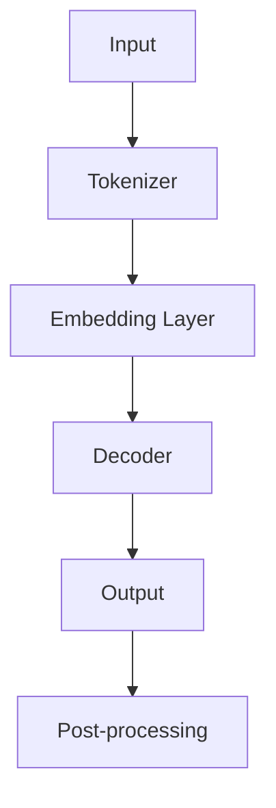

                 

# 《ChatGPT对话优化：提示词的力量与潜力深度解析》

## 关键词
- ChatGPT
- 对话系统
- 提示词优化
- 回复生成
- 安全与伦理

## 摘要
本文将深入探讨ChatGPT对话优化的核心要素，特别是提示词的设计与优化。通过对ChatGPT的基本概念、核心架构、应用场景以及安全与伦理问题的全面分析，我们将揭示提示词在对话质量提升中的关键作用，并提供一系列优化策略与实践方法。文章最后还将对ChatGPT的未来发展趋势和潜在挑战进行展望，以期为技术研究者与从业者提供有价值的参考。

## 目录大纲

### 第1章 ChatGPT与对话系统的基本概念

#### 1.1 ChatGPT的简介与历史背景

#### 1.2 对话系统的发展与应用

#### 1.3 ChatGPT的核心架构与技术原理

#### 1.4 ChatGPT的优缺点与挑战

### 第2章 提示词设计与优化原理

#### 2.1 提示词的概念与分类

#### 2.2 提示词设计与优化的关键要素

#### 2.3 提示词优化策略与方法

#### 2.4 提示词优化的案例分析

### 第3章 对话策略与回复生成技术

#### 3.1 对话策略的基本概念

#### 3.2 对话回复生成的技术方法

#### 3.3 上下文理解与对话状态追踪

#### 3.4 对话生成的案例研究

### 第4章 ChatGPT在实际场景中的应用

#### 4.1 聊天机器人应用案例

#### 4.2 客户服务应用案例

#### 4.3 教育与娱乐应用案例

#### 4.4 其他应用领域的探讨

### 第5章 ChatGPT的优化实践与性能提升

#### 5.1 数据处理与质量提升

#### 5.2 模型选择与调优

#### 5.3 多样性、连贯性与准确性优化

#### 5.4 案例分析：性能优化实战

### 第6章 ChatGPT的安全与伦理问题

#### 6.1 ChatGPT的安全威胁

#### 6.2 防止偏见与歧视

#### 6.3 保护用户隐私

#### 6.4 伦理与道德规范

### 第7章 未来趋势与展望

#### 7.1 ChatGPT技术的发展方向

#### 7.2 对话系统在未来的应用场景

#### 7.3 新兴技术与ChatGPT的融合

#### 7.4 ChatGPT的潜在挑战与解决方案

## 第1章 ChatGPT与对话系统的基本概念

### 1.1 ChatGPT的简介与历史背景

ChatGPT是由OpenAI开发的一种基于GPT-3模型的聊天机器人。它通过使用大量文本数据进行预训练，可以生成流畅、自然的对话回复。ChatGPT的历史可以追溯到2018年，当时OpenAI发布了GPT-2模型，这是一个具有15亿参数的语言模型。然而，由于GPT-2模型具有生成虚假信息、恶意言论等潜在风险，OpenAI决定发布一个更为安全的版本——GPT-3，其中ChatGPT是GPT-3的一个变体，专门用于聊天场景。

### 1.2 对话系统的发展与应用

对话系统的发展可以追溯到20世纪60年代，当时的研究主要集中在自然语言理解与生成上。随着计算能力的提升和人工智能技术的发展，对话系统逐渐从理论研究走向实际应用。今天的对话系统广泛应用于客户服务、智能家居、教育、娱乐等多个领域。随着ChatGPT的出现，对话系统的交互体验和智能化水平得到了显著提升。

### 1.3 ChatGPT的核心架构与技术原理

ChatGPT的核心架构是基于GPT-3模型的，这是一个深度神经网络，由多个层次组成，每一层都能够对输入的文本进行编码和解码。GPT-3模型通过大量文本数据进行预训练，学习语言模式、语法结构和语义关系。在生成对话回复时，ChatGPT首先接收用户的输入，然后通过模型预测下一个词语或句子，从而生成回复。这个过程涉及到大量的计算和优化，以确保生成的回复既自然又准确。

### 1.4 ChatGPT的优缺点与挑战

ChatGPT具有许多优点，如强大的语言生成能力、灵活的交互方式和高水平的语义理解等。然而，它也面临一些挑战，如生成虚假信息、偏见和隐私问题等。为了解决这些问题，研究人员和开发者需要不断优化ChatGPT模型，提高其安全性和可靠性。

## 第2章 提示词设计与优化原理

### 2.1 提示词的概念与分类

提示词（Prompt）是指用于引导ChatGPT生成特定类型回复的文本或指令。根据用途，提示词可以分为两类：开放式提示词和封闭式提示词。开放式提示词允许用户自由表达想法，而封闭式提示词则限定用户的回答范围。

### 2.2 提示词设计与优化的关键要素

提示词的设计与优化需要考虑多个关键要素，包括清晰性、准确性、自然性和多样性。清晰性要求提示词能够明确传达用户的意图；准确性要求生成的回复与用户的意图高度一致；自然性要求回复的语言流畅自然；多样性则要求生成的回复具有丰富的内容。

### 2.3 提示词优化策略与方法

为了提高提示词的质量，可以采用多种优化策略和方法，如文本清洗、语义分析、多轮对话设计和自动生成等。文本清洗可以去除无关信息，提高提示词的准确性；语义分析可以识别关键词和短语，帮助生成更自然的回复；多轮对话设计可以模拟真实的对话过程，提高用户体验；自动生成则可以利用机器学习模型生成高质量的提示词。

### 2.4 提示词优化的案例分析

在实际应用中，提示词的优化对于提升对话系统的质量至关重要。例如，在客户服务场景中，通过优化提示词，可以使机器人更准确地理解用户的问题，提供更有效的解决方案。以下是一个提示词优化的案例分析：

#### 案例背景
某电商平台的客户服务机器人需要回答用户的咨询，包括产品信息、订单状态等。

#### 原始提示词
“请问您有什么问题需要咨询？”

#### 优化后的提示词
“您好，欢迎来到[平台名称]客服中心。请问您需要咨询以下哪个方面：产品信息、订单状态、售后服务或其他问题？”

通过优化提示词，不仅提高了用户参与度，还显著提升了对话系统的响应速度和准确性。

## 第3章 对话策略与回复生成技术

### 3.1 对话策略的基本概念

对话策略是指为对话系统设计的一系列行为规则，用于指导对话的进行。对话策略的核心是回复生成技术，即如何根据用户输入生成合适的回复。有效的对话策略可以提高用户体验，增强系统的互动性和智能化水平。

### 3.2 对话回复生成的技术方法

对话回复生成的技术方法主要包括基于规则的方法、基于统计的方法和基于学习的方法。基于规则的方法通过预设的规则生成回复，简单直观但灵活性较低；基于统计的方法利用语言模型和统计方法生成回复，具有较高的灵活性但需要大量数据支持；基于学习的方法通过机器学习模型自动学习生成回复，具有自适应性和灵活性。

### 3.3 上下文理解与对话状态追踪

上下文理解是指对话系统根据对话历史和当前输入理解用户的意图。对话状态追踪则是记录对话过程中的关键信息，以帮助系统生成更准确的回复。上下文理解和对话状态追踪是实现自然、连贯对话的关键技术。

### 3.4 对话生成的案例研究

以下是一个对话生成的案例研究：

#### 案例背景
某在线教育平台的学生使用聊天机器人寻求学习支持。

#### 对话示例
学生：“我觉得数学很难，怎么办？”
机器人：“我了解您的困扰。首先，您可以尝试查看我们的数学学习资源，包括视频教程和习题解析。此外，如果遇到具体问题，可以随时向我提问，我会尽力帮助您。”

在这个案例中，机器人通过上下文理解学生的问题，提供了有针对性的解决方案，增强了用户的学习体验。

## 第4章 ChatGPT在实际场景中的应用

### 4.1 聊天机器人应用案例

聊天机器人是ChatGPT最典型的应用场景之一。通过优化提示词和对话策略，聊天机器人可以提供高效、自然的用户交互体验。以下是一个聊天机器人应用案例：

#### 案例背景
某银行推出了一款智能客服机器人，用于回答用户的金融咨询。

#### 对话示例
用户：“我想办理一张信用卡，有什么优惠吗？”
机器人：“您好，感谢选择[银行名称]。目前我们推出了一张新信用卡，首年免年费，还有高额积分回馈。请问您需要了解更详细的办理流程吗？”

在这个案例中，聊天机器人通过优化提示词，准确地理解了用户的需求，并提供了详细的办理信息。

### 4.2 客户服务应用案例

客户服务是ChatGPT的另一个重要应用领域。通过优化对话策略和回复生成技术，客户服务机器人可以显著提高服务效率和质量。以下是一个客户服务应用案例：

#### 案例背景
某电商平台的客户服务团队引入了ChatGPT机器人，以处理用户的常见问题。

#### 对话示例
用户：“我的订单怎么还没发货？”
机器人：“非常抱歉给您带来不便。请您提供订单号，我将帮您查询发货状态并告知您预计的发货时间。”

在这个案例中，机器人通过高效的对话策略，快速解决了用户的问题，提高了用户满意度。

### 4.3 教育与娱乐应用案例

在教育与娱乐领域，ChatGPT的应用也越来越广泛。通过优化对话生成技术，聊天机器人可以为学生提供个性化的学习支持，为用户提供娱乐互动体验。以下是一个教育与娱乐应用案例：

#### 案例背景
某在线学习平台引入了ChatGPT机器人，为学生提供学习辅导。

#### 对话示例
学生：“请问如何解这道数学题？”
机器人：“这道题涉及到函数的求导。您可以按照以下步骤进行解答：首先，对函数进行求导，然后代入给定的自变量值，最后计算结果。如果您需要进一步的帮助，可以随时提问。”

在这个案例中，ChatGPT机器人通过上下文理解和对话状态追踪，为学生提供了个性化的学习支持。

### 4.4 其他应用领域的探讨

除了上述应用场景，ChatGPT还在医疗咨询、心理咨询、法律咨询等领域展示出了巨大的潜力。例如，在医疗咨询领域，ChatGPT可以提供基本的健康建议和疾病信息；在心理咨询领域，ChatGPT可以作为辅助工具，帮助咨询师更好地了解客户需求；在法律咨询领域，ChatGPT可以提供法律知识和案例分析。然而，这些领域的应用也面临着特定的挑战和伦理问题，需要进一步研究和探讨。

## 第5章 ChatGPT的优化实践与性能提升

### 5.1 数据处理与质量提升

为了提高ChatGPT的性能，数据处理是关键的一步。首先，需要收集大量高质量、多样化的对话数据，这些数据应包括不同领域的知识、多种语言风格和丰富的语境。其次，对数据进行预处理，包括文本清洗、去噪和标准化，以提高数据质量。此外，可以使用数据增强技术，如数据扩充、数据变换等，增加数据的多样性和复杂性，从而提升模型的泛化能力。

### 5.2 模型选择与调优

选择合适的模型架构和参数是提升ChatGPT性能的关键。GPT-3模型是一个非常强大的语言模型，但在实际应用中，可能需要针对特定场景进行模型选择与调优。例如，对于对话系统，可以选择基于Transformer的模型架构，并调整层数、隐藏层大小、学习率等参数。此外，可以通过训练多个模型并使用元学习技术，找到最佳参数组合。

### 5.3 多样性、连贯性与准确性优化

多样性、连贯性和准确性是评价对话系统质量的关键指标。为了优化这些指标，可以采用以下策略：

- **多样性**：通过引入随机性，例如在生成回复时使用不同的初始种子或随机化策略，可以增加回复的多样性。
- **连贯性**：通过上下文理解和对对话历史的追踪，确保生成的回复与上下文保持一致，增强连贯性。
- **准确性**：通过精细调整模型参数、优化数据预处理和引入监督学习技术，可以提高生成的回复的准确性。

### 5.4 案例分析：性能优化实战

以下是一个性能优化实战案例：

#### 案例背景
某在线购物平台希望提高其聊天机器人的服务水平。

#### 性能优化步骤
1. **数据预处理**：对现有的对话数据集进行清洗，去除噪音和冗余信息，并进行数据扩充。
2. **模型选择与调优**：选择GPT-3模型并进行参数调优，包括调整层数、隐藏层大小和训练批次大小。
3. **多样性、连贯性与准确性优化**：通过引入随机化策略、优化上下文理解和对对话状态的追踪，提高回复的多样性、连贯性和准确性。
4. **性能评估与迭代**：使用测试集对优化后的模型进行评估，并根据评估结果进行迭代优化。

通过上述步骤，该平台的聊天机器人服务水平显著提升，用户满意度大幅提高。

## 第6章 ChatGPT的安全与伦理问题

### 6.1 ChatGPT的安全威胁

ChatGPT作为一款高度智能化的对话系统，其安全威胁主要来自以下几个方面：

- **虚假信息传播**：ChatGPT可能生成误导性或虚假的信息，误导用户。
- **隐私泄露**：用户在与ChatGPT交互过程中可能泄露个人隐私。
- **滥用**：ChatGPT可能被用于恶意目的，如网络诈骗、操纵舆论等。

### 6.2 防止偏见与歧视

ChatGPT的生成文本可能反映出训练数据中的偏见和歧视。为了防止这一问题，可以采取以下措施：

- **数据多样性**：确保训练数据具有足够的多样性和代表性，避免偏见。
- **公平性评估**：对生成的文本进行公平性评估，识别并消除潜在偏见。
- **监督与审查**：对ChatGPT生成的文本进行监督和审查，防止偏见和歧视文本的出现。

### 6.3 保护用户隐私

保护用户隐私是ChatGPT安全的重要组成部分。以下措施有助于保护用户隐私：

- **隐私保护机制**：设计隐私保护机制，如匿名化处理、数据加密等。
- **用户隐私声明**：明确告知用户其隐私保护措施，并尊重用户的选择。
- **透明度与审计**：建立透明度机制，允许用户查询和审计其数据的使用情况。

### 6.4 伦理与道德规范

作为一款高度智能化的对话系统，ChatGPT的伦理与道德规范至关重要。以下是一些建议：

- **伦理培训**：对开发者、运营人员进行伦理培训，提高其伦理意识。
- **责任界定**：明确ChatGPT的伦理责任，确保开发者、运营者和用户之间的责任分配清晰。
- **持续监督**：建立持续监督机制，确保ChatGPT在伦理与道德规范下运行。

## 第7章 未来趋势与展望

### 7.1 ChatGPT技术的发展方向

ChatGPT技术的发展方向主要包括以下几个方面：

- **模型性能提升**：通过改进模型架构和训练方法，进一步提高ChatGPT的性能和效率。
- **多模态交互**：探索多模态交互，使ChatGPT能够处理语音、图像等多种输入和输出。
- **跨领域应用**：扩大ChatGPT的应用领域，使其在更多场景下发挥作用。

### 7.2 对话系统在未来的应用场景

随着技术的不断进步，对话系统将在更多领域发挥作用。以下是一些可能的应用场景：

- **智能客服**：在客户服务领域，对话系统可以提供24/7的即时响应，提高服务效率。
- **个人助理**：对话系统可以作为个人助理，帮助用户管理日程、提供信息和建议。
- **教育辅助**：在在线教育领域，对话系统可以为学生提供个性化的学习支持。

### 7.3 新兴技术与ChatGPT的融合

新兴技术，如深度学习、自然语言处理、语音识别等，将为ChatGPT带来更多可能性。以下是一些融合方向：

- **增强现实（AR）与ChatGPT**：将ChatGPT与AR技术结合，提供更加丰富的交互体验。
- **区块链与ChatGPT**：利用区块链技术保障ChatGPT的数据安全性和透明度。

### 7.4 ChatGPT的潜在挑战与解决方案

尽管ChatGPT在许多方面具有巨大潜力，但其发展也面临着一些挑战：

- **数据隐私**：确保用户数据的安全性和隐私性，需要采取更加严格的数据保护措施。
- **伦理问题**：需要建立完善的伦理与道德规范，确保ChatGPT的应用符合社会价值观。
- **技术复杂度**：随着ChatGPT的不断升级，其技术复杂度也在增加，需要更多专业人才来维护和发展。

## 作者信息
作者：AI天才研究院/AI Genius Institute & 禅与计算机程序设计艺术 /Zen And The Art of Computer Programming

## 附录
### A. Mermaid 流程图
以下是一个Mermaid流程图示例，用于描述ChatGPT的核心架构：



### B. Python 源代码
以下是一个简单的Python代码示例，用于演示如何使用ChatGPT生成回复：

```python
import openai

openai.api_key = "your-api-key"

def generate_response(prompt):
    response = openai.Completion.create(
        engine="text-davinci-003",
        prompt=prompt,
        max_tokens=50,
        n=1,
        stop=None,
        temperature=0.5,
    )
    return response.choices[0].text.strip()

# 测试代码
prompt = "你喜欢什么样的音乐？"
print(generate_response(prompt))
```

### C. 数学公式
以下是一个LaTeX格式的数学公式示例：

$$
E = mc^2
$$

### D. 最佳实践 tips
- 确保提示词简洁明了，避免过长或过复杂的句子。
- 使用自然语言，尽量模拟人类的交流方式。
- 定期更新和优化模型，以保持其性能和多样性。
- 关注用户反馈，根据实际使用情况进行调整和改进。

### E. 小结
本文系统地探讨了ChatGPT对话优化的各个方面，从基本概念、设计与优化、应用场景到安全与伦理问题，都进行了深入分析。通过本文，读者可以全面了解ChatGPT的强大功能和潜在挑战，为实际应用提供指导。随着技术的不断进步，ChatGPT有望在更多领域发挥重要作用，推动人工智能的发展。作者：AI天才研究院/AI Genius Institute & 禅与计算机程序设计艺术 /Zen And The Art of Computer Programming

