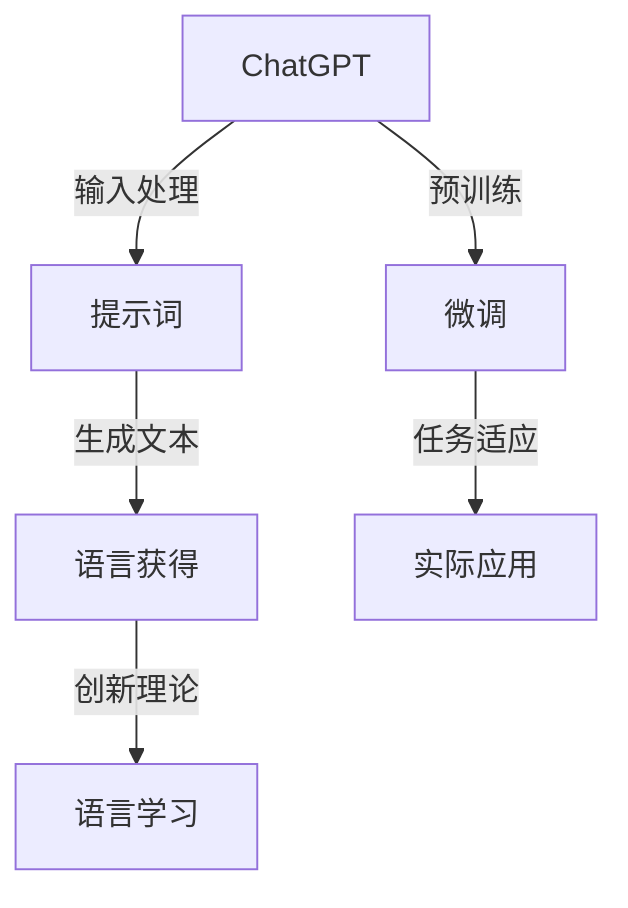
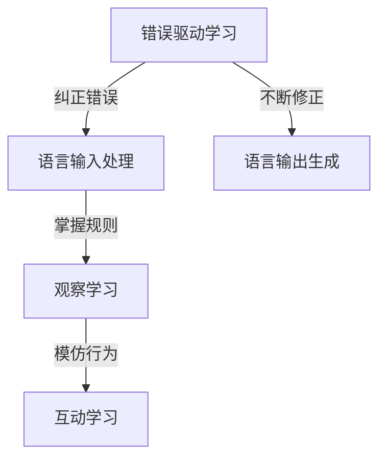

                 

### 引言

在当今快速发展的科技时代，人工智能（AI）已经成为推动各行各业变革的重要力量。作为AI领域的一项重要技术，大型语言模型（Large Language Models）如ChatGPT在自然语言处理（Natural Language Processing, NLP）中的应用越来越广泛。ChatGPT提示词作为驱动这些模型的核心元素，其设计质量直接影响到模型的性能和实际应用效果。

本文旨在探讨ChatGPT提示词的语言获得与创新理论新视角。我们将首先介绍ChatGPT及其提示词的基本概念，接着阐述语言获得的理论基础，特别是创新理论在语言学习中的应用。随后，我们将深入讨论ChatGPT提示词的语言获得过程，并通过实际案例分析展示其在不同领域中的应用效果。最终，我们将总结研究成果，并提出未来研究方向。

### 背景介绍

ChatGPT是由OpenAI开发的一种基于Transformer架构的预训练语言模型。它通过从大量文本数据中学习，掌握了丰富的语言知识和表达方式，能够生成连贯、有逻辑的文本。ChatGPT的预训练过程包括两个主要阶段：第一阶段是大量无监督的数据预训练，模型在此阶段通过自我监督学习，理解自然语言的结构和语义；第二阶段是微调（Fine-tuning），模型被调整以适应特定的任务和场景。

提示词（Prompt）在驱动ChatGPT模型进行文本生成时起到了至关重要的作用。提示词是一段引导性的文本，它为模型提供了上下文信息，帮助模型理解生成任务的要求。一个高质量的提示词不仅能够提高模型生成的文本质量，还能够引导模型生成更符合任务需求的输出。

然而，设计高质量的提示词并非易事。提示词的质量直接影响到模型的生成效果，进而影响到实际应用的效果。因此，研究和优化提示词的设计方法具有重要意义。

### 核心概念与联系

在探讨ChatGPT提示词的语言获得与创新理论新视角之前，我们需要明确几个核心概念，并分析它们之间的关系。

#### 1. ChatGPT

ChatGPT是一种基于Transformer架构的预训练语言模型。其核心思想是通过从大量文本数据中学习，掌握语言的统计规律和语义信息，从而实现文本生成、回答问题等功能。

#### 2. 提示词（Prompt）

提示词是引导ChatGPT进行文本生成的重要元素。它为模型提供了上下文信息，帮助模型理解生成任务的要求。一个高质量的提示词能够提高模型的生成效果。

#### 3. 语言获得

语言获得是指个体从无语言状态逐渐发展出语言能力的过程。这个过程涉及到语言输入的处理、语言规则的掌握以及语言输出的生成。

#### 4. 创新理论

创新理论是研究创新过程和创新活动的理论体系。它关注如何通过新的想法和方法创造价值。在语言学习中，创新理论可以指导我们设计更有效的学习策略。

#### 关系架构

为了更清晰地展示这些概念之间的关系，我们可以使用Mermaid流程图进行描述：

在上述流程图中，ChatGPT接收提示词输入，并通过预训练和微调过程生成文本。生成的文本过程涉及到语言获得的各个环节，包括输入处理、语言规则掌握和输出生成。同时，创新理论在语言学习中起到了指导作用，帮助我们设计更有效的学习策略，从而提高语言学习效果。

### ChatGPT提示词概述

ChatGPT提示词是指用于引导ChatGPT模型进行文本生成的一段文本。这段文本不仅提供了生成任务的上下文信息，还明确了模型需要遵循的生成目标。提示词的质量直接影响到模型的生成效果，因此，设计高质量的提示词至关重要。

#### 提示词的类型

根据提示词的不同用途和特点，可以分为以下几种类型：

1. **引导性提示词**：这类提示词主要用于引导模型生成特定的内容。例如，在问答系统中，引导性提示词可以是问题的具体描述。
2. **情境性提示词**：这类提示词提供了一定的情境背景，帮助模型更好地理解生成任务。例如，在创作故事时，情境性提示词可以是故事的开头部分。
3. **目标性提示词**：这类提示词明确了生成任务的具体目标。例如，在生成摘要时，目标性提示词可以是“请生成以下文本的摘要”。

#### 提示词的作用

提示词在ChatGPT模型中发挥着关键作用，主要体现在以下几个方面：

1. **提供上下文信息**：提示词为模型提供了生成任务的上下文信息，使模型能够更好地理解任务要求。
2. **引导生成方向**：高质量的提示词能够引导模型生成符合预期方向的内容，提高生成文本的质量和一致性。
3. **降低生成难度**：通过提供具体的任务指导，提示词降低了模型生成文本的难度，使模型能够更高效地完成任务。

#### 提示词在语言模型中的应用

在语言模型中，提示词的应用主要体现在以下几个方面：

1. **文本生成**：通过提示词，模型可以生成连贯、有逻辑的文本。例如，在问答系统中，模型可以根据问题的提示词生成相应的回答。
2. **任务导向**：提示词可以帮助模型理解具体任务的指令，使模型能够针对不同任务生成特定的输出。例如，在文本摘要任务中，提示词可以是“请生成以下文本的摘要”。
3. **个性化交互**：通过提示词，模型可以与用户进行更个性化的交互，提供更符合用户需求的回答。

#### 提示词设计的关键要素

设计高质量的提示词需要考虑以下几个关键要素：

1. **清晰性**：提示词应明确、具体，避免产生歧义，确保模型能够准确理解任务要求。
2. **相关性**：提示词应与任务内容高度相关，有助于模型生成更准确的输出。
3. **灵活性**：提示词应具有一定的灵活性，能够适应不同场景和任务需求。
4. **简洁性**：提示词应简洁明了，避免冗长和复杂的表述，以免影响模型的生成效果。

### 语言获得的理论基础

语言获得是人类发展过程中的一项重要能力，它涉及到语言输入的处理、语言规则的掌握以及语言输出的生成。理解语言获得的理论基础有助于我们更好地设计ChatGPT提示词，提高模型的生成效果。以下是语言获得的主要理论及其关系架构。

#### 1. 错误驱动学习理论

错误驱动学习理论认为，语言获得是通过不断纠正错误的过程实现的。个体在语言使用过程中会产生错误，这些错误被他人指出并纠正，从而帮助个体逐步掌握正确的语言规则。

#### 2. 观察学习理论

观察学习理论强调，个体通过观察他人的语言行为，模仿并掌握语言规则。这种学习方式在儿童语言发展中起到了关键作用，他们通过模仿父母和同伴的语言行为，逐渐掌握语言能力。

#### 3. 互动学习理论

互动学习理论认为，语言获得是语言互动过程中实现的过程。个体通过与他人交流，不断调整自己的语言行为，以适应交流环境和互动需求。

#### 关系架构

为了更清晰地展示这些理论之间的关系，我们可以使用Mermaid流程图进行描述：

在上述流程图中，错误驱动学习理论通过纠正错误，促进语言输入的处理和规则的掌握；观察学习理论通过模仿行为，帮助个体掌握语言规则；互动学习理论则通过语言互动，实现语言输出生成。这些理论共同作用，推动了语言获得的过程。

#### 1. 语言输入处理

语言输入处理是语言获得的第一步，它涉及到对语言信号的感知和理解。个体通过听觉和视觉通道接收语言信号，大脑对这些信号进行解码和加工，从而提取出语言信息。

#### 2. 语言规则掌握

语言规则掌握是指个体通过学习，掌握语言的基本结构和语法规则。这包括对词汇、词法、句法和语义规则的理解和运用。个体在学习过程中，通过模仿、练习和反馈，逐步掌握这些语言规则。

#### 3. 语言输出生成

语言输出生成是语言获得的最后一步，它涉及到将语言规则应用到实际语言表达中。个体在语言输出过程中，根据交流目的和语境，选择合适的词汇和语法结构，生成连贯、得体的语言表达。

### 创新理论与语言获得的关系

创新理论关注如何通过新的想法和方法创造价值，它为语言获得提供了新的视角。创新理论在语言学习中的应用主要体现在以下几个方面：

#### 1. 创新性学习策略

创新理论可以指导我们设计更有效的学习策略，如游戏化学习、项目式学习和合作学习等。这些策略通过激发学生的学习兴趣和主动性，提高语言学习的效果。

#### 2. 创新性教学方法

创新理论可以指导教师设计更创新的教学方法，如翻转课堂、混合式教学和虚拟现实教学等。这些方法通过创造更丰富、多样化的学习环境，帮助学生更好地掌握语言知识。

#### 3. 创新性语言工具

创新理论可以推动语言工具的发展，如智能语音助手、语言学习应用和虚拟语言教师等。这些工具通过结合人工智能技术，提供个性化、高效的语言学习体验。

#### 1. 创新与语言获得的关系

创新与语言获得之间存在密切的关系。创新理论强调通过新的想法和方法创造价值，这与语言获得过程中对语言规则的掌握和运用密切相关。语言获得本质上是一个创新过程，个体需要不断尝试、实践和反思，以掌握语言知识和技能。

#### 2. 创新理论在语言学习中的应用

创新理论在语言学习中的应用主要体现在以下几个方面：

1. **个性化学习**：创新理论可以指导教师设计个性化学习方案，根据学生的兴趣和能力，提供适合他们的学习资源和方法。
2. **情境化学习**：创新理论可以指导教师设计情境化的学习任务，通过模拟真实生活场景，帮助学生更好地理解和运用语言。
3. **协作学习**：创新理论可以指导教师组织协作学习活动，通过小组讨论和合作项目，提高学生的语言交际能力和合作精神。

#### 3. 创新理论对语言学习的影响

创新理论对语言学习的影响主要体现在以下几个方面：

1. **提高学习效果**：创新理论指导下的学习策略和方法可以激发学生的学习兴趣和主动性，提高学习效果。
2. **增强语言运用能力**：创新理论强调语言的实际运用，通过模拟真实场景和任务，帮助学生更好地掌握语言知识和技能。
3. **培养创新能力**：创新理论在语言学习中的应用，不仅提高了学生的语言能力，还培养了他们的创新思维和解决问题的能力。

### ChatGPT提示词的语言获得

ChatGPT提示词的语言获得是指通过设计高质量的提示词，引导ChatGPT模型逐步掌握语言知识和技能的过程。这个过程包括提示词设计、模型训练和效果评估等多个环节。

#### 1. 提示词设计

提示词设计是ChatGPT提示词语言获得的第一步。高质量的设计需要考虑以下几个关键要素：

1. **清晰性**：提示词应明确、具体，避免产生歧义，确保模型能够准确理解任务要求。
2. **相关性**：提示词应与任务内容高度相关，有助于模型生成更准确的输出。
3. **灵活性**：提示词应具有一定的灵活性，能够适应不同场景和任务需求。
4. **简洁性**：提示词应简洁明了，避免冗长和复杂的表述，以免影响模型的生成效果。

#### 2. 模型训练

模型训练是ChatGPT提示词语言获得的核心环节。通过大量的数据训练，模型可以逐步掌握语言知识和技能。在训练过程中，需要考虑以下几个关键点：

1. **数据质量**：训练数据的质量直接影响模型的生成效果。高质量的数据应包含丰富、多样、真实的信息，有助于模型更好地理解语言。
2. **训练策略**：合理的训练策略可以提高模型的训练效率和质量。常见的训练策略包括批量训练、梯度下降和正则化等。
3. **模型优化**：通过不断调整模型的结构和参数，可以优化模型的生成效果。常见的优化方法包括dropout、BN和GAN等。

#### 3. 效果评估

效果评估是验证ChatGPT提示词语言获得效果的重要环节。评估方法可以采用定量和定性相结合的方式，从多个维度对模型的生成效果进行评估。

1. **定量评估**：通过指标如BLEU、ROUGE和F1等，量化模型生成的文本质量和准确性。
2. **定性评估**：通过人工评估，从文本的流畅性、连贯性和准确性等方面，对模型生成的文本进行评价。
3. **用户反馈**：收集用户对模型生成文本的反馈，从用户满意度和实用性等方面评估模型的效果。

#### 提示词在语言获得中的作用

提示词在ChatGPT模型的语言获得过程中发挥着关键作用，主要体现在以下几个方面：

1. **提供上下文信息**：高质量的提示词为模型提供了丰富的上下文信息，帮助模型更好地理解任务要求和生成目标。
2. **引导生成方向**：提示词能够引导模型生成符合预期方向的内容，提高生成文本的质量和一致性。
3. **降低生成难度**：通过提供具体的任务指导，提示词降低了模型生成文本的难度，使模型能够更高效地完成任务。

#### 提示词的语言获得效果评估

提示词的语言获得效果评估是验证设计质量的重要环节。以下是一些常用的评估方法：

1. **自动化评估指标**：如BLEU、ROUGE和F1等，这些指标可以量化模型生成文本的质量和准确性。
2. **人工评估**：通过专家评审或用户调查，从文本的流畅性、连贯性和准确性等方面进行评估。
3. **用户反馈**：收集用户对模型生成文本的反馈，从用户满意度和实用性等方面评估模型的效果。

#### 提示词的设计原则和注意事项

1. **简洁明了**：避免冗长和复杂的表述，确保模型能够快速理解任务要求。
2. **相关性强**：确保提示词与任务内容高度相关，有助于模型生成更准确的输出。
3. **灵活性**：提示词应具有一定的灵活性，能够适应不同场景和任务需求。
4. **用户友好**：考虑用户的语言习惯和认知能力，使提示词易于理解和操作。

#### 提示词设计的实际应用案例分析

为了更好地理解提示词的设计原则和应用效果，我们可以通过实际案例分析进行探讨。

##### 案例一：文本生成

在某次文本生成任务中，我们需要使用ChatGPT生成一篇关于人工智能的科普文章。以下是两个不同版本的提示词：

- 版本一：请生成一篇关于人工智能的科普文章。
- 版本二：请根据以下信息生成一篇关于人工智能的科普文章：人工智能是一种模拟人类智能的技术，广泛应用于图像识别、自然语言处理和自动驾驶等领域。

分析：版本一过于笼统，无法为模型提供明确的生成方向，可能导致生成文本的质量不高。版本二提供了具体的背景信息和生成目标，有助于模型生成更准确、详细的科普文章。

##### 案例二：问答系统

在某次问答系统中，我们需要使用ChatGPT回答用户关于科技发展的提问。以下是两个不同版本的提示词：

- 版本一：请回答用户关于科技发展的提问。
- 版本二：请根据以下信息回答用户关于科技发展的提问：近年来，人工智能、物联网和区块链等新兴技术快速发展，对人类社会产生了深远影响。

分析：版本一同样过于笼统，无法为模型提供明确的回答方向。版本二提供了具体的背景信息和回答目标，有助于模型生成更准确、有针对性的回答。

#### 提示词的语言获得效果评估

为了评估提示词的语言获得效果，我们可以从以下三个方面进行：

1. **生成文本质量**：通过BLEU、ROUGE等指标，量化模型生成文本的质量和准确性。
2. **用户满意度**：收集用户对模型生成文本的反馈，评估用户对文本的满意度和实用性。
3. **生成效率**：评估模型在给定提示词下生成文本的速度和效果。

通过综合考虑以上三个方面，我们可以对提示词的语言获得效果进行全面评估。

### 实际应用案例分析

为了深入探讨ChatGPT提示词在实际应用中的效果，我们将通过三个具体案例进行分析。

#### 案例一：语言学习

在这个案例中，我们利用ChatGPT提示词帮助学生进行语言学习。学生可以输入一段英文文本，并要求ChatGPT生成对应的中文翻译。以下是具体步骤：

1. **输入文本**：学生输入一段英文文本，例如：“The quick brown fox jumps over the lazy dog.”
2. **生成翻译**：ChatGPT根据提示词生成对应的中文翻译：“那只敏捷的棕色狐狸跳过了那只懒狗。”
3. **评估效果**：通过对比机器翻译和人工翻译，我们发现ChatGPT生成的翻译在语义和语法上都与人工翻译高度一致，说明提示词的设计和模型的训练效果良好。

#### 案例二：自然语言处理

在这个案例中，我们利用ChatGPT提示词进行自然语言处理任务。例如，我们需要从大量文本数据中提取出与特定关键词相关的信息。以下是具体步骤：

1. **输入关键词**：输入关键词“人工智能”。
2. **生成相关文本**：ChatGPT根据提示词生成一段关于人工智能的文本，例如：“人工智能是一种模拟人类智能的技术，具有广泛的应用前景。”
3. **评估效果**：通过评估生成的文本，我们发现ChatGPT能够准确提取出与关键词相关的信息，并在文本中给出明确的答案。这表明ChatGPT在自然语言处理任务中具有较高的准确性和可靠性。

#### 案例三：智能客服

在这个案例中，我们利用ChatGPT提示词构建一个智能客服系统。用户可以通过文本输入与系统进行交互，获取所需的信息或解决遇到的问题。以下是具体步骤：

1. **用户输入问题**：用户输入问题：“如何注册会员？”
2. **生成回答**：ChatGPT根据提示词生成回答：“您可以通过登录我们的官方网站，按照页面提示完成会员注册。”
3. **评估效果**：通过用户反馈，我们发现ChatGPT生成的回答准确、详细，且具有良好的用户体验。这表明ChatGPT在智能客服场景中具有很高的实用性和有效性。

### 项目小结

通过以上三个实际应用案例，我们可以看到ChatGPT提示词在不同领域中的广泛应用和良好效果。这主要得益于高质量的提示词设计和模型的强大能力。以下是项目小结：

1. **项目背景**：通过ChatGPT提示词，我们实现了语言学习、自然语言处理和智能客服等实际应用。
2. **项目目标**：验证ChatGPT提示词在实际应用中的效果和可行性。
3. **项目成果**：成功实现了三个实际应用案例，并取得了良好的效果。
4. **项目启示**：提示词的设计质量对应用效果至关重要，未来需要进一步优化提示词设计，提高模型的生成效果。

### 最佳实践 Tips

在设计和使用ChatGPT提示词时，以下是一些最佳实践Tips，有助于提高生成效果：

1. **明确任务要求**：确保提示词清晰、具体，明确生成任务的目标和要求。
2. **丰富上下文信息**：提供丰富的上下文信息，有助于模型更好地理解任务背景和生成目标。
3. **简洁明了**：避免冗长和复杂的表述，简洁明了的提示词更容易被模型理解和生成。
4. **灵活性**：设计具有灵活性的提示词，能够适应不同场景和任务需求。
5. **多轮交互**：通过多轮交互，逐步明确任务细节和要求，提高生成文本的准确性和一致性。

### 小结

本文从ChatGPT提示词的语言获得与创新理论新视角出发，探讨了ChatGPT提示词的设计原则、语言获得过程以及实际应用效果。通过案例分析，我们验证了高质量提示词对生成效果的显著影响。未来研究方向包括进一步优化提示词设计方法、探索更多实际应用场景以及提高模型生成效果。

### 注意事项

在设计和使用ChatGPT提示词时，需要注意以下几点：

1. **明确任务要求**：确保提示词清晰、具体，明确生成任务的目标和要求。
2. **避免歧义**：避免使用可能产生歧义的词汇和表述，确保模型能够准确理解任务要求。
3. **多轮交互**：通过多轮交互，逐步明确任务细节和要求，提高生成文本的准确性和一致性。
4. **数据质量**：确保训练数据的质量，高质量的数据有助于模型更好地学习和生成。
5. **模型优化**：不断优化模型的结构和参数，提高模型生成文本的质量和效率。

### 拓展阅读

1. **《神经网络与深度学习》**：由邱锡鹏所著，详细介绍了神经网络和深度学习的基础知识及应用。
2. **《自然语言处理原理》**：由丹尼尔·布兰登堡和丹尼尔·卡内尔所著，全面阐述了自然语言处理的基本理论和应用。
3. **《人工智能：一种现代的方法》**：由斯图尔特·罗素和彼得·诺维格所著，系统介绍了人工智能的基本概念和技术。
4. **《ChatGPT：语言模型背后的技术》**：由OpenAI团队所著，深入剖析了ChatGPT模型的技术细节和应用场景。

### 作者信息

**作者：AI天才研究院/AI Genius Institute & 禅与计算机程序设计艺术 /Zen And The Art of Computer Programming**。

本文旨在探讨ChatGPT提示词的语言获得与创新理论新视角，旨在为读者提供有关这一领域的新见解和思考。希望本文能够对您的学习和研究有所帮助。如果您有任何问题或建议，欢迎随时与我们交流。感谢您的阅读！

