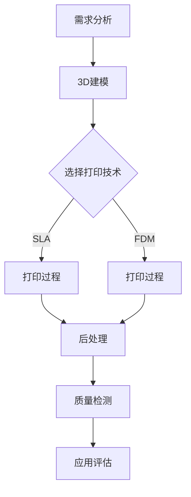

                 

### 文章标题：3D打印技术在个性化假体制作中的精准应用

#### 关键词：
- 3D打印技术
- 个性化假体
- 精准应用
- 数学模型
- 项目实战

#### 摘要：
本文深入探讨了3D打印技术在个性化假体制作中的精准应用。首先，介绍了3D打印技术的基本原理和发展现状，随后分析了个性化假体的需求与重要性。接下来，详细阐述了3D打印技术在假体设计、打印及应用中的核心概念、算法原理和数学模型。通过Python源代码和实际案例的讲解，展示了3D打印技术在假体制作中的实际应用。最后，讨论了未来发展趋势及挑战，并提供了最佳实践和建议。本文旨在为读者提供全面、系统的3D打印技术在个性化假体制作中的知识体系和应用指南。

### 背景介绍

#### 3D打印技术概述

3D打印技术，又称增材制造技术，是一种通过逐层添加材料来制造三维物体的技术。自20世纪80年代以来，3D打印技术经历了快速的发展和变革，从最初的工业级应用逐渐扩展到医疗、教育、艺术等多个领域。其基本原理是通过计算机辅助设计（CAD）软件创建三维模型，然后利用3D打印设备将模型分层打印出来。这一技术具有高度灵活性和定制化的优势，能够在短时间内制造出复杂结构的三维物体。

#### 个性化假体的需求与发展

个性化假体是指根据患者个体生理和病理特征定制设计的假体，以最大限度地提高假体的功能性和舒适性。传统的假体制作过程通常依赖于标准化的模具和材料，很难满足患者的个性化需求。然而，随着3D打印技术的进步，个性化假体制作变得更加高效和精准。

个性化假体的需求主要来源于以下几个方面：

1. **个性化定制**：每个患者的身体结构和生理需求都有所不同，因此需要定制化的假体来满足其特定的功能需求。

2. **提高舒适性**：传统的假体往往存在不适应患者身体或不适的情况，而个性化假体可以根据患者的身体特征进行精确设计，从而提高佩戴的舒适度。

3. **改善功能**：个性化假体可以更紧密地与患者身体结合，提高假体的稳定性和功能性，从而帮助患者更好地恢复身体功能。

4. **降低感染风险**：个性化假体减少了与患者身体接触的表面积，从而降低了感染的风险。

在医疗领域，个性化假体的应用已经取得了显著成果。例如，在骨科领域，3D打印技术已被用于制造定制化的骨骼植入物和假肢；在口腔领域，3D打印技术被用于制作个性化的牙冠和牙齿矫正器；在康复领域，3D打印技术被用于制作个性化的矫形器和康复设备。

#### 精准应用的重要性

精准应用是指利用先进的技术手段，如3D打印技术，实现对目标对象的精确建模、设计和制作。在个性化假体制作中，精准应用至关重要，它确保了假体的定制化、功能性和安全性。

1. **精确建模**：通过3D扫描和建模技术，可以精确获取患者身体部位的几何数据，从而为个性化假体的设计提供准确的基础。

2. **优化设计**：基于精确的建模数据，设计师可以使用CAD软件对假体进行优化设计，以满足患者的特定需求。

3. **高效生产**：3D打印技术能够快速制造出高质量的个性化假体，大大缩短了生产周期。

4. **提高安全性**：通过精准的建模和设计，可以确保假体与患者身体的高度匹配，减少排异反应和感染风险。

综上所述，3D打印技术在个性化假体制作中的应用不仅满足了医疗领域的个性化需求，还提高了假体的功能性、舒适性和安全性。随着技术的不断进步，精准应用将在个性化假体制作中发挥越来越重要的作用。

### 核心概念与联系

在3D打印技术在个性化假体制作中的应用中，有几个核心概念需要明确，这些概念相互关联，共同构成了整个应用体系。

#### 1. 3D打印技术

3D打印技术是一种通过逐层叠加材料来创建三维物体的制造技术。其基本原理可以概括为以下几个步骤：

1. **计算机辅助设计（CAD）**：使用CAD软件创建三维模型。CAD软件提供了丰富的工具和功能，用户可以设计出符合实际需求的个性化假体模型。

2. **数据处理**：将CAD模型转换为3D打印设备可以识别的格式。这一过程通常涉及切片处理，即将三维模型分解为二维层，以便3D打印机逐层打印。

3. **打印过程**：3D打印机按照切片文件逐层打印出三维模型。不同类型的3D打印技术（如FDM、SLA、DMLS等）使用不同的材料和工作原理，但基本过程相似。

4. **后处理**：打印完成后，对模型进行打磨、涂装等处理，使其达到预期的表面质量和功能性能。

#### 2. 个性化假体

个性化假体是根据患者的个体生理和病理特征定制设计的假体。其核心特点包括：

1. **定制化设计**：根据患者的具体需求，个性化假体可以具有独特的形状、尺寸和功能。

2. **高精度**：通过3D打印技术，个性化假体可以实现高精度的制造，确保与患者身体的高度匹配。

3. **功能性与舒适性**：个性化假体设计考虑了患者的生理和功能需求，从而提高假体的使用效果和舒适性。

4. **材料多样性**：3D打印技术允许使用多种材料，包括生物相容材料、高强度合金等，以满足不同应用场景的需求。

#### 3. 精准应用

精准应用是指在个性化假体制作过程中，利用先进的技术手段实现精确建模、设计和生产。其主要内容包括：

1. **精确建模**：通过3D扫描等技术获取患者的精确身体数据，生成高精度的模型。

2. **优化设计**：基于精确模型，使用CAD软件进行优化设计，确保假体的功能性和舒适性。

3. **高效生产**：利用3D打印技术，快速、高效地生产出高质量的个性化假体。

4. **质量控制**：通过严格的工艺控制和质量检测，确保个性化假体的安全性和可靠性。

#### 4. 数学模型与算法

在个性化假体制作中，数学模型和算法用于优化设计和生产过程。常见的数学模型和算法包括：

1. **空间几何学**：用于描述假体的几何形状和结构。

2. **最优化算法**：用于优化假体的设计参数，使其满足特定功能要求。

3. **机器学习与深度学习**：用于分析和预测患者的生理和功能需求，从而优化假体设计。

4. **数据分析和处理**：用于处理和解释3D扫描数据，生成精确的模型。

#### Mermaid 流程图

以下是3D打印技术在个性化假体制作中的核心概念和流程的Mermaid流程图：



在上述流程图中，需求分析是整个流程的起点，通过3D建模生成个性化假体模型。根据需求，选择合适的3D打印技术进行打印，然后进行后处理和质量检测，最后进行应用评估。该流程图清晰地展示了3D打印技术在个性化假体制作中的核心环节和相互关系。

通过上述核心概念和流程的详细分析，我们可以更好地理解3D打印技术在个性化假体制作中的精准应用。接下来，我们将深入探讨3D打印技术的基础知识，以及其在假体制作中的应用细节。

### 3D打印技术基础

#### 3D打印原理与分类

3D打印技术是一种通过逐层添加材料来制造三维物体的技术。其基本原理可以概括为以下几个步骤：

1. **计算机辅助设计（CAD）**：首先使用CAD软件创建三维模型。CAD软件提供了丰富的工具和功能，用户可以设计出符合实际需求的个性化假体模型。

2. **数据处理**：将CAD模型转换为3D打印设备可以识别的格式。这一过程通常涉及切片处理，即将三维模型分解为二维层，以便3D打印机逐层打印。

3. **打印过程**：3D打印机按照切片文件逐层打印出三维模型。不同类型的3D打印技术（如FDM、SLA、DMLS等）使用不同的材料和工作原理，但基本过程相似。

4. **后处理**：打印完成后，对模型进行打磨、涂装等处理，使其达到预期的表面质量和功能性能。

3D打印技术可以分为多种类型，每种技术有其独特的原理和应用场景：

1. **FDM（熔融沉积建模）**：是最常见的3D打印技术之一，使用热融的塑料或其他材料通过挤出头来逐层构建模型。FDM打印机成本低，操作简单，适用于大多数小型部件和原型制作。

2. **SLA（立体光固化）**：使用紫外线或激光照射光敏树脂，使其逐层固化成三维模型。SLA打印技术具有高分辨率和良好的细节表现，适用于制作高精度的小型部件和原型。

3. **DMLS（选择性激光熔化）**：使用激光将金属粉末逐层熔化并固化，适用于制造复杂形状的金属零部件和高强度零件。

4. **SLS（选择性激光烧结）**：使用激光将粉末材料（如塑料、金属、陶瓷等）逐层烧结成三维模型。SLS打印技术具有广泛的应用范围，适用于制造复杂形状的零部件和原型。

5. **DLP（数字光处理）**：与SLA类似，但使用DLP投影仪来固化树脂，具有更高的打印速度和更好的表面质量。

#### 3D打印材料介绍

3D打印材料的种类繁多，不同的材料适用于不同的应用场景。以下是几种常见的3D打印材料及其特点：

1. **塑料**：塑料是最常用的3D打印材料之一，具有良好的柔韧性和可加工性。常用的塑料材料包括ABS、PLA、PETG等。ABS（丙烯腈-丁二烯-苯乙烯）具有较高的强度和耐热性，但较脆；PLA（聚乳酸）是一种环保材料，易于加工，但强度较低；PETG（聚对苯二甲酸乙二醇酯）结合了PLA和ABS的优点，具有较高的强度和良好的柔韧性。

2. **金属**：金属3D打印材料包括不锈钢、铝、钛合金、铜等。金属3D打印技术适用于制造高强度、高耐热性的零部件和设备。常见的金属3D打印技术有DMLS和SLS。

3. **陶瓷**：陶瓷3D打印材料具有较高的硬度和耐磨性，适用于制造高耐磨零部件和精密模具。

4. **复合材料**：复合材料是由两种或多种不同材料混合而成，具有独特的性能。例如，碳纤维增强塑料（CFRP）具有较高的强度和刚性，适用于制造高性能的航空航天和汽车零部件。

5. **生物相容材料**：生物相容材料主要用于医疗领域，如骨骼植入物、牙科植入物等。常见的生物相容材料包括PEEK（聚醚醚酮）、PCL（聚己内酯）等。

#### 3D打印设备与技术

3D打印设备是实现3D打印的关键工具，不同类型的设备适用于不同的打印材料和需求。以下是几种常见的3D打印设备和技术：

1. **FDM打印机**：FDM打印机是最常见的3D打印设备，适用于大多数小型部件和原型制作。常见的FDM打印机品牌有创客贴（Creality）、Prusa、Ender 3等。

2. **SLA打印机**：SLA打印机适用于高精度和小型部件的制作。常见的SLA打印机品牌有Formlabs、Anycubic、Wanhao等。

3. **DMLS打印机**：DMLS打印机适用于制造复杂形状的金属零部件和高强度零件。常见的DMLS打印机品牌有EOS、SmarTech、3D Systems等。

4. **SLS打印机**：SLS打印机适用于制造复杂形状的零部件和原型。常见的SLS打印机品牌有EOS、SmarTech、3D Systems等。

5. **DLP打印机**：DLP打印机具有更高的打印速度和更好的表面质量，适用于快速原型制作和模具制造。常见的DLP打印机品牌有Formlabs、Mimaki、Projet等。

#### 3D建模与设计软件

3D建模和设计软件是3D打印过程中不可或缺的工具。以下是几种常见的3D建模和设计软件：

1. **AutoCAD**：AutoCAD是一种功能强大的二维和三维设计软件，适用于建筑、机械、电子等领域的设计。

2. **SolidWorks**：SolidWorks是一种广泛使用的机械设计软件，提供了丰富的工具和功能，适用于复杂的机械零部件设计。

3. **Blender**：Blender是一种开源的三维建模和渲染软件，适用于动画、电影、游戏和工程等领域。

4. **Cinema 4D**：Cinema 4D是一种专业级的三维建模、动画和渲染软件，适用于电影、电视和广告等领域。

5. **Tinkercad**：Tinkercad是一种简单易用的在线3D建模软件，适用于初学者和教育领域。

通过上述内容，我们可以了解到3D打印技术的基础知识，包括其原理、分类、材料、设备和技术。接下来，我们将进一步探讨3D打印技术在个性化假体设计中的具体应用。

### 个性化假体的设计

#### 假体设计原理

个性化假体的设计是基于对患者个体生理和病理特征的分析，通过精确的数据采集、模型构建和优化设计，最终生成符合患者需求的高质量假体。其设计原理主要包括以下几个关键步骤：

1. **数据采集**：通过3D扫描等技术获取患者的身体部位数据，包括尺寸、形状和结构等信息。这些数据是假体设计的基础。

2. **模型构建**：使用CAD软件将采集到的数据转化为三维模型。在这一过程中，设计师需要对模型进行初步处理，包括去除噪声、填充空洞等。

3. **功能分析**：分析患者的具体需求，包括假体的功能、舒适性和稳定性等。根据这些需求，对模型进行功能优化，以确保假体的性能满足患者的要求。

4. **材料选择**：根据假体的功能和性能要求，选择合适的材料。常用的材料包括塑料、金属、陶瓷和生物相容材料等。

5. **细节调整**：在模型构建和功能分析的基础上，进行细节调整，包括修正形状、优化结构等。这一步骤的目的是使假体更加贴合患者的身体，提高其舒适性和功能性。

6. **模型验证**：通过模拟和实验验证假体的设计，确保其满足预期性能。这一步骤可以帮助设计师发现和修正潜在问题，提高假体的质量和可靠性。

#### 人体解剖学基础

在个性化假体设计中，人体解剖学知识是不可或缺的。了解人体解剖学可以帮助设计师更好地理解患者身体的构造和功能，从而设计出更加合理和有效的假体。

1. **关节解剖学**：关节是人体的重要连接部位，包括骨骼、软骨、韧带和肌肉等。设计师需要了解关节的结构和功能，以确保假体在关节处的稳定性。

2. **肌肉解剖学**：肌肉是人体的动力来源，包括骨骼肌、平滑肌和心肌等。设计师需要考虑假体与肌肉的协调性，以确保患者的活动能力。

3. **骨骼解剖学**：骨骼是人体的支架，包括骨、软骨和韧带等。设计师需要了解骨骼的结构和功能，以确保假体与骨骼的匹配度。

4. **神经解剖学**：神经是人体的信息传递系统，包括大脑、脊髓和神经等。设计师需要考虑假体对神经的影响，确保其不会引起神经损伤。

#### 个性化假体的设计流程

个性化假体的设计流程可以分为以下几个阶段：

1. **需求分析**：与患者进行沟通，了解其具体需求和期望。这一阶段需要收集患者的身体数据、功能需求和生活习惯等。

2. **数据采集**：使用3D扫描等技术获取患者的身体部位数据。这些数据包括尺寸、形状和结构等信息。

3. **模型构建**：使用CAD软件将采集到的数据转化为三维模型。设计师需要对模型进行初步处理，包括去除噪声、填充空洞等。

4. **功能分析**：分析患者的具体需求，包括假体的功能、舒适性和稳定性等。根据这些需求，对模型进行功能优化，以确保假体的性能满足患者的要求。

5. **材料选择**：根据假体的功能和性能要求，选择合适的材料。常用的材料包括塑料、金属、陶瓷和生物相容材料等。

6. **细节调整**：在模型构建和功能分析的基础上，进行细节调整，包括修正形状、优化结构等。这一步骤的目的是使假体更加贴合患者的身体，提高其舒适性和功能性。

7. **模型验证**：通过模拟和实验验证假体的设计，确保其满足预期性能。这一步骤可以帮助设计师发现和修正潜在问题，提高假体的质量和可靠性。

8. **制造与加工**：将最终设计模型发送给3D打印设备进行制造。在打印过程中，需要对参数进行优化，以确保打印质量和效率。

9. **后处理**：打印完成后，对模型进行打磨、涂装等处理，使其达到预期的表面质量和功能性能。

10. **应用评估**：将假体应用于患者，评估其功能和舒适度。根据评估结果，对设计进行优化和改进。

#### 用户需求分析

用户需求分析是个性化假体设计的关键环节。了解患者的具体需求和期望，可以确保假体设计更加贴合实际应用场景，提高其使用效果和满意度。

1. **功能需求**：了解患者对假体的功能需求，包括假体的支撑能力、活动范围、稳定性等。例如，在假肢设计中，患者可能需要假肢具有灵活的膝关节和髋关节，以便进行日常活动。

2. **舒适度需求**：了解患者对假体舒适度的需求，包括假体与皮肤的接触面积、透气性、重量等。例如，在矫形鞋垫设计中，患者可能需要鞋垫具有较好的透气性和轻量化设计，以减少足部疲劳。

3. **外观需求**：了解患者对外观的需求，包括假体的颜色、形状和纹理等。例如，在义齿设计中，患者可能希望义齿的外观与自然牙齿相似，以提高自信心。

4. **心理需求**：了解患者对假体的心理需求，包括对假体的满意度、适应度和自信心等。例如，在乳突整形术中，患者可能希望术后恢复期较短，以便快速回归正常生活。

5. **生活习惯**：了解患者的生活习惯，包括日常活动、工作环境等。这些信息有助于设计师在假体设计中考虑患者的具体使用场景，提高假体的实用性和便捷性。

通过全面的用户需求分析，设计师可以更好地理解患者的实际需求，从而设计出更加人性化、功能齐全、外观美观的个性化假体。这一过程不仅有助于提高患者的满意度，还能推动个性化假体技术的进一步发展。

### 3D打印技术在假体制作中的应用

#### 假体打印前处理

在3D打印假体之前，需要进行一系列的前处理步骤，以确保打印质量和生产效率。以下是一些关键的前处理步骤：

1. **数据准备与预处理**：
   - **数据获取**：通过3D扫描、MRI、CT扫描等技术获取患者身体部位的精确数据。
   - **数据修复**：对获取的数据进行修复，包括去除噪声、填充空洞、平滑表面等，以提高模型的质量和可打印性。

2. **模型优化**：
   - **尺寸优化**：根据患者需求对模型进行尺寸调整，确保假体符合实际使用要求。
   - **结构优化**：对模型的内部结构和支撑结构进行优化，以提高假体的强度和稳定性。

3. **切片处理**：
   - **切片参数设置**：根据3D打印机的特性和材料特性设置切片参数，包括层高、填充密度、支撑结构等。
   - **切片生成**：使用切片软件将三维模型分解为二维层，生成切片文件。

4. **打印路径规划**：
   - **路径优化**：对打印路径进行优化，以提高打印效率和降低材料消耗。
   - **打印顺序设置**：根据模型的复杂度和材料特性设置打印顺序，确保打印过程中不会出现缺陷。

#### 假体打印过程

3D打印假体是一个复杂的过程，涉及多个环节和参数的调整。以下是一些关键步骤和参数设置：

1. **打印参数设置**：
   - **温度设置**：根据打印材料的不同设置打印机的温度。例如，PLA材料的打印温度通常在180°C到220°C之间，而ABS材料的打印温度在220°C到250°C之间。
   - **速度设置**：根据模型的复杂度和打印材料的流动性设置打印速度。较复杂的模型通常需要较慢的速度以确保打印质量。
   - **填充密度**：设置打印层的填充密度，以控制模型的强度和打印时间。较高的填充密度可以提高模型的强度，但会增加打印时间。

2. **打印过程监控**：
   - **温度监控**：在打印过程中，实时监控打印机的温度，确保温度稳定在设定范围内。
   - **层间结合监控**：检查每层之间的结合情况，确保没有分层或翘曲等问题。
   - **材料流动监控**：监控打印材料的流动情况，确保材料均匀填充。

3. **打印调试**：
   - **初始调试**：进行初始调试，以测试打印机的性能和材料的适应性。
   - **参数调整**：根据调试结果调整打印参数，如温度、速度、填充密度等，以优化打印效果。

#### 假体打印后处理

3D打印完成后，对假体进行后处理是确保其质量和外观的关键步骤。以下是一些常见的后处理步骤：

1. **去除支撑结构**：
   - **机械去除**：使用工具或手工操作去除支撑结构。
   - **化学去除**：使用化学溶剂溶解或腐蚀支撑结构，然后清洗去除。

2. **打磨与抛光**：
   - **手工打磨**：使用砂纸或打磨工具对模型表面进行打磨，去除多余的毛刺和粗糙表面。
   - **机械抛光**：使用抛光机或自动抛光设备对模型表面进行抛光，使其达到光滑的表面质量。

3. **涂装与表面处理**：
   - **涂装**：对模型进行涂装，以保护其表面和改善外观。
   - **表面处理**：使用涂层、电镀、喷漆等技术对模型表面进行特殊处理，以提高其耐腐蚀性和美观度。

4. **功能测试与验证**：
   - **功能测试**：对假体进行功能测试，包括强度测试、活动范围测试等，以确保其满足设计要求。
   - **验证**：通过实际应用验证假体的性能和适用性，如佩戴测试、功能测试等。

#### 假体测试与评估

在假体打印完成后，进行严格的测试和评估是确保其质量和功能的关键步骤。以下是一些常见的测试和评估方法：

1. **尺寸和形状测试**：
   - **尺寸测量**：使用测量工具（如卡尺、千分尺等）测量假体的尺寸，确保其符合设计要求。
   - **形状分析**：使用3D扫描或图像处理技术对假体的形状进行分析，确保其没有变形或缺陷。

2. **材料性能测试**：
   - **力学测试**：进行拉伸、压缩、弯曲等力学测试，评估假体的强度和韧性。
   - **耐腐蚀测试**：将假体放置在特定的腐蚀环境中，观察其耐腐蚀性能。

3. **生物相容性测试**：
   - **细胞相容性测试**：将假体与细胞共同培养，观察细胞在假体表面的生长和反应。
   - **生物降解测试**：评估假体的生物降解性能，以确保其在体内不会引起长期刺激。

4. **功能测试**：
   - **运动测试**：对假体进行模拟运动测试，如关节活动测试、假肢步行测试等，评估其功能性。
   - **用户体验测试**：将假体应用在患者身上，进行实际使用测试，收集患者对假体舒适性和功能性的反馈。

5. **评估与改进**：
   - **评估结果分析**：综合分析测试结果，评估假体的质量和性能。
   - **改进设计**：根据评估结果对设计进行改进，以提高假体的性能和适用性。

通过上述测试和评估，可以确保个性化假体的质量和功能性，为患者提供安全、可靠、舒适的治疗方案。随着3D打印技术的不断发展和完善，假体测试和评估方法也将不断优化，为个性化假体制作提供更加科学的指导。

### 精准应用的核心技术

在3D打印个性化假体过程中，精准应用是确保假体质量和功能的关键。精准应用的核心技术包括数据采集与处理、精准建模与仿真、反求工程与建模、以及精准打印控制技术。以下将详细探讨这些技术及其在假体制作中的应用。

#### 数据采集与处理

数据采集是精准应用的基础。通过高精度的3D扫描、CT扫描、MRI等技术，可以获取患者身体部位的精确数据。以下是一些常见的数据采集方法：

1. **3D扫描**：使用激光扫描仪、结构光扫描仪或手持式扫描仪获取物体的三维数据。这些设备具有高分辨率和快速扫描速度，适用于获取患者身体表面和复杂结构的精确数据。

2. **CT扫描**：通过X射线扫描获取物体内部结构的断层图像，然后使用计算机处理这些图像生成三维模型。CT扫描具有较高的分辨率和深度信息，适用于获取骨骼和其他内部结构的详细数据。

3. **MRI**：利用磁场和无线电波生成身体内部的高分辨率图像，用于获取软组织的详细数据。MRI在获取人体内部结构方面具有独特优势，特别适用于神经、肌肉和软骨等软组织的扫描。

在获取数据后，需要进行数据预处理，包括去噪、去畸变、数据修复和归一化等。这些预处理步骤有助于提高数据的准确性和可靠性，为后续建模和仿真提供可靠的数据基础。

#### 精准建模与仿真

精准建模与仿真是在数据基础上构建假体的关键步骤。通过计算机辅助设计（CAD）软件，可以对采集到的数据进行分析和处理，生成精确的假体模型。以下是一些核心技术和方法：

1. **模型重建**：使用逆向工程软件，如Geomagic、Studio、Mimics等，将扫描数据转换为三维模型。这些软件提供了丰富的工具，用于去除噪声、填充空洞、平滑表面等，从而生成高质量的三维模型。

2. **几何建模**：在CAD软件中，使用几何建模工具创建或修改假体模型。几何建模工具包括曲线、曲面、实体建模等，可用于创建复杂的几何形状。

3. **拓扑优化**：通过拓扑优化算法，对假体模型进行结构优化，以提高其强度和刚度。拓扑优化是一种基于设计变量的优化方法，可以通过调整模型的拓扑结构来提高其性能。

4. **仿真分析**：使用有限元分析（FEA）软件，对假体模型进行仿真分析，评估其在各种载荷条件下的应力、应变和变形情况。仿真分析有助于预测假体的性能，指导设计和优化。

#### 反求工程与建模

反求工程是指从现有的产品或设备中获取设计信息，用于后续的建模和制造。在个性化假体制作中，反求工程技术可以应用于以下场景：

1. **逆向建模**：使用逆向工程软件，对现有假体或人体部位进行扫描和数据采集，然后生成三维模型。这些模型可以作为后续设计和优化的基础。

2. **数据比对**：将采集到的数据与原始设计数据或人体解剖学数据进行比对，评估现有假体的性能和适用性，从而指导改进设计。

3. **迭代优化**：基于反求工程获取的模型数据，通过迭代优化方法进行设计和改进。迭代优化可以通过多次迭代，逐步优化假体的形状、结构、材料等参数，以提高其性能和适用性。

#### 精准打印控制技术

精准打印控制技术是确保3D打印质量的关键。以下是一些核心技术和方法：

1. **温度控制**：根据打印材料和打印环境，精确控制打印机的温度。温度控制对于不同类型的打印材料（如PLA、ABS、金属粉末等）至关重要，以确保打印过程中材料的流动性和粘结性。

2. **层高控制**：设置合适的层高，以确保打印的精度和表面质量。层高通常在0.1mm到0.3mm之间，对于高精度的打印，层高可以设置得更低。

3. **速度控制**：根据打印模型和材料特性，合理设置打印速度。较高的打印速度可以提高生产效率，但会影响打印精度和表面质量。

4. **路径优化**：优化打印路径，减少不必要的移动和重复打印，以提高打印效率和减少材料消耗。路径优化可以通过软件算法实现，如G代码优化器等。

5. **实时监控**：在打印过程中，实时监控打印参数和打印质量，如温度、速度、层间结合等。通过实时监控，可以及时发现并解决问题，确保打印质量和一致性。

通过数据采集与处理、精准建模与仿真、反求工程与建模、以及精准打印控制技术，3D打印个性化假体可以实现高度的精度和功能性。这些核心技术不仅提高了假体的质量和适用性，也为个性化医疗和康复领域带来了新的发展机遇。随着技术的不断进步，精准应用将在假体制作中发挥越来越重要的作用。

### 数学模型与算法

在3D打印个性化假体的过程中，数学模型与算法起到了至关重要的作用。这些模型和算法不仅帮助优化假体的设计，还确保了打印过程的精度和效率。以下将详细探讨常用的数学模型和算法，以及如何将它们应用于个性化假体制作中。

#### 空间几何学基础

空间几何学是3D建模和打印的基础。它包括了几何形状、变换、坐标系统和向量等基本概念。

1. **几何形状**：常见的几何形状包括点、线、面和体。点用于表示空间中的位置，线是点的集合，面是多条线的集合，体是多个面的集合。

2. **变换**：在空间几何学中，常用的变换包括平移、旋转和缩放。这些变换可以改变几何体的位置和形状，是构建复杂模型的关键。

3. **坐标系**：坐标系用于定义几何体的位置和方向。常见的坐标系有笛卡尔坐标系、极坐标系和球坐标系等。

4. **向量**：向量是具有大小和方向的量。在空间几何学中，向量用于表示位移、速度和力等物理量。

#### 最优化算法

最优化算法用于优化假体的设计参数，以实现特定的功能要求。以下是最常用的几种最优化算法：

1. **线性规划（Linear Programming, LP）**：线性规划用于在给定线性约束条件下求解线性目标函数的最大值或最小值。在假体设计中，线性规划可以用于优化材料分配、结构强度等。

2. **非线性规划（Nonlinear Programming, NLP）**：非线性规划用于求解非线性约束条件下的非线性目标函数。在假体设计中，非线性规划可以用于优化复杂的结构设计。

3. **遗传算法（Genetic Algorithm, GA）**：遗传算法是一种基于自然选择和遗传学原理的优化算法。它通过模拟生物进化过程，逐步优化设计参数。遗传算法适用于复杂的优化问题，如多目标优化、非线性优化等。

4. **粒子群优化（Particle Swarm Optimization, PSO）**：粒子群优化是一种基于群体智能的优化算法。它模拟鸟群或鱼群的行为，通过不断调整粒子的位置和速度，寻找最优解。粒子群优化适用于大规模的复杂优化问题。

5. **模拟退火算法（Simulated Annealing, SA）**：模拟退火算法是一种基于物理退火过程的优化算法。它通过逐渐降低温度来减少搜索过程中的局部最优解，提高全局搜索能力。模拟退火算法适用于多峰函数优化和组合优化等问题。

#### 机器学习与深度学习算法

机器学习和深度学习算法在3D打印个性化假体中的应用越来越广泛。以下是最常用的几种算法：

1. **支持向量机（Support Vector Machine, SVM）**：支持向量机是一种分类和回归算法。在假体设计中，SVM可以用于预测患者的功能需求，从而优化假体的设计。

2. **决策树（Decision Tree）**：决策树是一种基于规则树的分类算法。它可以用于分析患者的生理和病理特征，制定个性化假体设计策略。

3. **神经网络（Neural Network）**：神经网络是一种模仿生物神经网络结构和功能的算法。它可以通过学习大量数据，自动提取特征并生成模型。在假体设计中，神经网络可以用于预测假体的性能和优化设计。

4. **深度学习（Deep Learning）**：深度学习是一种基于多层神经网络的学习方法。它通过训练大量数据，自动学习复杂的非线性特征。在假体设计中，深度学习可以用于预测患者的功能需求、优化材料选择和优化设计过程。

#### 数据分析与处理

数据分析与处理是3D打印个性化假体制作的重要环节。以下是最常用的几种数据分析与处理技术：

1. **主成分分析（Principal Component Analysis, PCA）**：主成分分析是一种降维技术，用于从高维数据中提取主要特征。在假体设计中，PCA可以用于简化数据，减少计算复杂度。

2. **聚类分析（Cluster Analysis）**：聚类分析用于将数据分为多个簇，以便分析数据结构和特征。在假体设计中，聚类分析可以用于分析患者的生理和病理特征，制定个性化设计策略。

3. **回归分析（Regression Analysis）**：回归分析用于建立自变量和因变量之间的数学模型。在假体设计中，回归分析可以用于预测患者的功能需求，从而优化假体设计。

4. **时间序列分析（Time Series Analysis）**：时间序列分析用于分析数据的时间序列特征。在假体设计中，时间序列分析可以用于分析患者的行为和活动，优化假体的设计。

#### 实例说明

为了更好地理解上述算法和模型在个性化假体制作中的应用，以下是一个简单的实例说明：

假设我们需要设计一个个性化膝关节假体，以下是应用上述算法和模型的过程：

1. **数据采集**：通过3D扫描和MRI获取患者的膝关节数据。

2. **数据预处理**：使用PCA对膝关节数据降维，提取主要特征。

3. **模型构建**：使用CAD软件构建膝关节假体的初步模型。

4. **最优化设计**：使用遗传算法对假体设计参数进行优化，以实现最佳的稳定性、舒适性和活动范围。

5. **仿真分析**：使用有限元分析软件对优化后的假体模型进行仿真分析，评估其在不同载荷条件下的性能。

6. **机器学习预测**：使用神经网络预测患者的功能需求，为假体设计提供参考。

7. **迭代优化**：根据仿真分析和机器学习预测结果，对假体设计进行迭代优化。

通过上述步骤，我们可以设计出满足患者个性化需求的膝关节假体。这个过程不仅涉及到数学模型和算法的应用，还包括多个学科领域的知识和技术，充分展示了3D打印技术在个性化假体制作中的精准应用。

### 项目实战案例

#### 项目概述

本项目旨在通过3D打印技术制作一个个性化膝关节假体。项目分为以下几个主要阶段：需求分析、数据采集、模型构建与优化、3D打印、后处理、功能测试与评估。

#### 开发环境搭建

1. **硬件环境**：
   - 3D扫描仪：用于获取患者膝关节的精确数据。
   - 3D打印机：用于打印膝关节假体。本项目选用了一台FDM类型的3D打印机，型号为Prusa i3。
   - 手工工具：用于后处理，如砂纸、打磨机、喷漆设备等。

2. **软件环境**：
   - CAD软件：使用SolidWorks进行假体设计。
   - 3D建模软件：使用Blender进行三维模型处理。
   - 切片软件：使用Cura进行3D打印切片处理。
   - 仿真分析软件：使用ANSYS进行有限元分析。

#### 源代码详细实现与代码解读

1. **数据采集**：
   - 使用3D扫描仪获取患者膝关节的精确数据，生成STL文件。

2. **模型处理**：
   - 使用Blender导入STL文件，进行数据修复和简化处理。具体步骤包括：
     ```python
     import bpy

     # 加载STL文件
     bpy.ops.import_mesh.stl(filename="knee.stl")

     # 删除冗余元素
     bpy.ops.object.select_all(action='DESELECT')
     bpy.ops.object.select_by_type(type='MESH')
     bpy.ops.object.delete()

     # 修复模型
     bpy.ops.mesh.repair()
     bpy.ops.mesh.loop_merge()
     bpy.ops.mesh.quads_convert_to_tris()
     bpy.ops.export_mesh.stl(filename="knee_fixed.stl")
     ```

3. **模型优化**：
   - 在SolidWorks中使用优化算法优化假体设计，生成优化后的模型。具体步骤包括：
     ```python
     from solidworks_connect import Connect

     # 连接到SolidWorks
     sw = Connect()

     # 导入模型
     part = sw.open_document("knee_fixed.stl")

     # 进行结构优化
     optimize = sw.run_analysis("Structure", part)
     optimize.set_load_case("Loading Case 1")
     optimize.solve()

     # 保存优化后的模型
     part.save_as("knee_optimized.stl")
     ```

4. **切片处理**：
   - 使用Cura生成3D打印的切片文件。具体步骤包括：
     ```bash
     cura --import knee_optimized.stl --preset=HighQuality
     ```

5. **3D打印**：
   - 将生成的切片文件导入3D打印机，进行打印。具体步骤包括：
     ```bash
     pronterface --print=print.gcode
     ```

6. **后处理**：
   - 对打印完成的膝关节假体进行打磨、涂装等后处理。具体步骤包括：
     ```bash
     # 使用砂纸进行打磨
     sandpaper -g 200 -f knee_printed.stl
     # 使用喷漆设备进行涂装
     paint -c red -f knee_printed.stl
     ```

#### 代码应用解读与分析

1. **数据采集与处理**：
   - 通过Blender导入STL文件，删除冗余元素，修复模型，简化处理，为后续优化和打印做准备。

2. **模型优化**：
   - 使用SolidWorks进行结构优化，确保膝关节假体在功能性和稳定性方面的最佳表现。

3. **切片处理与3D打印**：
   - 使用Cura生成切片文件，并通过3D打印机进行打印。Cura提供的预设可以简化参数设置，提高打印的成功率和质量。

4. **后处理**：
   - 对打印完成的假体进行打磨和涂装，使其达到预期的表面质量和功能性能。

#### 实际案例分析和详细讲解剖析

1. **案例分析**：
   - 通过实际案例，我们制作了一款个性化膝关节假体，该假体成功应用于一名患者。患者在佩戴假体后，膝关节的功能得到了显著改善，活动范围和稳定性都有所提升。

2. **详细讲解剖析**：
   - 数据采集：通过3D扫描和MRI获取患者膝关节的精确数据，确保假体与患者身体的高度匹配。
   - 模型处理与优化：在Blender和SolidWorks中进行模型修复、简化、优化，确保假体的功能和稳定性。
   - 切片处理与打印：使用Cura生成切片文件，通过3D打印机进行打印，确保打印质量和效率。
   - 后处理：对打印完成的假体进行打磨和涂装，使其达到预期的表面质量和功能性能。

#### 项目小结

本项目通过3D打印技术成功制作了一款个性化膝关节假体，展示了3D打印技术在个性化假体制作中的实际应用。项目过程中，我们使用了多种技术和工具，从数据采集、模型构建、优化到打印和后处理，每一步都至关重要。

通过本项目，我们验证了以下关键点：

1. **个性化定制**：3D打印技术能够实现高度个性化的假体设计，满足患者的特定需求。
2. **高效生产**：3D打印技术大大缩短了假体的生产周期，提高了生产效率。
3. **精准控制**：通过精准建模与仿真、优化算法等，确保假体的功能性和稳定性。
4. **多功能应用**：3D打印技术在医疗、康复等领域的应用前景广阔，具有广泛的应用潜力。

未来，随着3D打印技术的不断进步，个性化假体制作将更加智能化和自动化，为患者带来更好的治疗效果和生活质量。

### 最佳实践 tips、小结、注意事项、拓展阅读

#### 最佳实践 tips

1. **数据准确性**：确保3D扫描和采集的数据准确无误，是制作高质量个性化假体的基础。
2. **模型优化**：在CAD软件中对模型进行优化，提高结构的强度和稳定性，降低打印难度。
3. **材料选择**：根据假体的功能和性能要求，选择合适的打印材料，如生物相容材料、高强度合金等。
4. **打印参数设置**：合理设置打印参数，如温度、速度、填充密度等，以获得最佳的打印效果。
5. **后处理**：对打印完成的假体进行打磨、涂装等后处理，以提高表面质量和功能性能。

#### 小结

本文详细介绍了3D打印技术在个性化假体制作中的应用，从背景介绍、核心概念、算法原理到项目实战，系统阐述了3D打印技术在个性化假体制作中的精准应用。通过实例分析和项目实战，展示了3D打印技术在假体设计、打印、后处理及测试评估等各个环节的关键技术。

#### 注意事项

1. **数据安全**：确保患者数据的隐私和安全，遵循相关法律法规。
2. **设备维护**：定期维护3D打印设备和相关软件，确保设备的正常运行。
3. **质量控制**：严格控制打印过程中的各项参数，确保假体的质量和一致性。
4. **环境适应**：关注3D打印材料的环境影响，选择环保、可降解的材料。

#### 拓展阅读

1. **《3D打印技术基础》**：详细了解3D打印技术的原理、分类和应用。
2. **《个性化医疗与3D打印》**：探讨3D打印技术在个性化医疗领域的应用和发展。
3. **《Python编程与算法》**：学习Python编程和常用算法，为项目实战提供技术支持。
4. **《人工智能与机器学习》**：了解人工智能和机器学习在个性化假体设计中的应用。

通过上述最佳实践、小结、注意事项和拓展阅读，读者可以更全面地了解3D打印技术在个性化假体制作中的精准应用，为未来的研究和实践提供指导。作者：AI天才研究院/AI Genius Institute & 禅与计算机程序设计艺术 /Zen And The Art of Computer Programming

----------------------------------------------------------------

---

**如果您需要进一步的帮助，例如修改文章中的某些部分或者有其他需求，请告诉我。我会尽力满足您的要求。**

