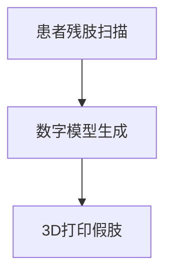
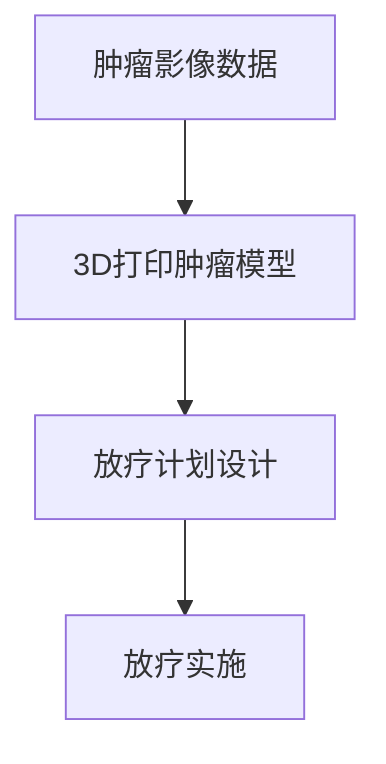
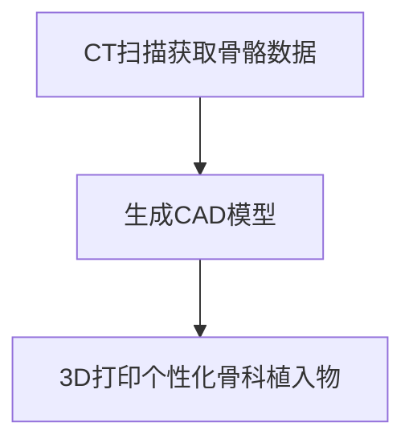

                 

# 3D打印技术在个性化医疗中的应用

## 关键词
- 3D打印
- 个性化医疗
- 医疗设备制造
- 个性化定制
- 医学影像
- 数字化制造

## 摘要
本文将探讨3D打印技术在个性化医疗领域的应用。首先，介绍3D打印技术的基本概念和发展历程，然后分析个性化医疗的定义和重要性。接着，详细讲解3D打印技术在个性化医疗中的具体应用，包括个性化定制假肢、个性化肿瘤治疗和个性化骨科植入物。随后，讨论3D打印技术的挑战与未来发展趋势。最后，通过项目实战展示3D打印技术在个性化医疗中的实际应用。

## 目录

### 第一部分：3D打印技术基础

#### 1.1 3D打印技术概述

#### 1.2 3D打印技术在医疗领域的应用

#### 1.3 个性化医疗的概念与原理

#### 1.4 3D打印技术在个性化医疗中的应用案例

#### 1.5 3D打印技术的挑战与未来发展趋势

### 第二部分：个性化医疗与3D打印技术的结合

#### 2.1 个性化定制假肢

#### 2.2 个性化肿瘤治疗

#### 2.3 个性化骨科植入物

#### 2.4 3D打印技术在个性化医疗中的其他应用

### 第三部分：3D打印技术的挑战与未来发展

#### 3.1 3D打印技术的挑战

#### 3.2 3D打印技术在个性化医疗中的未来发展

### 附录

#### 附录A：3D打印技术在个性化医疗中的应用案例汇总

#### 附录B：相关技术资料与资源汇总

### 参考文献

## 正文

### 1.1 3D打印技术概述

3D打印，又称增材制造，是一种通过逐层构建材料来创建三维实体的技术。与传统制造方法不同，3D打印不需要模具或刀具，只需通过计算机辅助设计（CAD）软件生成数字模型，然后通过3D打印机逐层添加材料来制造出所需的产品。

3D打印技术最早可以追溯到20世纪80年代，随着计算机技术和材料科学的不断发展，3D打印技术逐渐成熟。目前，3D打印技术已广泛应用于航空航天、汽车制造、医疗设备、建筑等领域。在医疗领域，3D打印技术正逐渐成为个性化医疗的重要工具。

### 1.2 3D打印技术在医疗领域的应用

3D打印技术在医疗领域的应用非常广泛，主要包括以下几个方面：

#### 1.2.1 医疗设备制造

3D打印技术可以用于制造各种医疗设备，如手术器械、骨科植入物、心脏支架等。通过3D打印，可以快速制造出精确的个性化医疗设备，提高手术成功率。

#### 1.2.2 个性化定制

3D打印技术可以用于个性化定制假肢、矫形器、牙齿等。通过扫描患者身体数据，生成数字模型，然后通过3D打印制造出适合患者的个性化产品。

#### 1.2.3 医学影像

3D打印技术可以用于制作医学影像的三维模型，如CT、MRI等。这些三维模型可以帮助医生更好地理解患者的病情，制定更有效的治疗方案。

#### 1.2.4 教育培训

3D打印技术可以用于医疗教育培训，如制作人体解剖模型、手术训练模型等。这些模型可以帮助医学生和医生更好地学习医学知识和技能。

### 1.3 个性化医疗的概念与原理

个性化医疗，又称精准医疗，是一种以患者为中心的医学模式。通过基因组学、蛋白质组学、代谢组学等分子生物学手段，为患者提供个性化的诊断和治疗方案。

个性化医疗的核心是患者的个性化数据。通过收集和分析患者的基因组、表观遗传学、蛋白质组、代谢组等数据，为患者提供个性化的治疗方案。

### 1.4 3D打印技术在个性化医疗中的应用案例

#### 1.4.1 个性化定制假肢

个性化定制假肢是3D打印技术在个性化医疗中最重要的应用之一。通过扫描患者残肢数据，生成数字模型，然后通过3D打印制造出适合患者的个性化假肢。个性化定制假肢可以提高患者的舒适度和运动能力，有助于提高患者的生活质量。

#### 1.4.2 个性化肿瘤治疗

3D打印技术可以用于个性化肿瘤治疗，如制作肿瘤模型、制定个体化的放疗计划等。通过3D打印技术，医生可以更好地了解肿瘤的形态和位置，制定更有效的治疗方案，提高治疗效果。

#### 1.4.3 个性化骨科植入物

3D打印技术可以用于制造个性化的骨科植入物，如骨板、骨钉、人工关节等。个性化骨科植入物可以根据患者的骨骼形态进行定制，提高手术成功率，减少术后并发症。

### 1.5 3D打印技术的挑战与未来发展趋势

#### 1.5.1 挑战

尽管3D打印技术在个性化医疗中具有巨大的潜力，但仍然面临一些挑战：

1. 材料限制：目前3D打印材料种类有限，无法满足所有医疗需求。

2. 成本高：3D打印设备和技术成本较高，限制了其在医疗领域的广泛应用。

3. 技术成熟度：3D打印技术尚处于发展阶段，技术成熟度有待提高。

#### 1.5.2 未来发展趋势

1. 材料创新：未来将开发更多种类的3D打印材料，满足不同医疗需求。

2. 成本降低：随着技术的进步，3D打印成本将逐渐降低，促进其在医疗领域的广泛应用。

3. 技术成熟：3D打印技术将逐渐成熟，提高其在医疗领域的应用效率。

### 2.1 个性化定制假肢

#### 2.1.1 背景介绍

个性化定制假肢是3D打印技术在个性化医疗中的重要应用之一。传统的假肢制造方法需要依赖模具和刀具，制造周期长，成本高，且难以满足个性化需求。而3D打印技术可以快速制造出适合患者的个性化假肢，提高患者的生活质量。

#### 2.1.2 核心概念与联系

**核心概念**：个性化定制假肢、3D扫描、数字模型、3D打印

**联系架构 Mermaid 流程图**：



#### 2.1.3 核心算法原理讲解

**Python源代码**：

```python
import numpy as np
import matplotlib.pyplot as plt

def scan_residual_limb():
    # 假设使用3D扫描设备获取患者残肢的坐标数据
    limb_data = np.random.rand(100, 3)  # 生成随机坐标数据
    return limb_data

def generate_digital_model(limb_data):
    # 生成数字模型
    model = limb_data.mean(axis=0)  # 取平均值作为模型中心点
    return model

def print prótese(model):
    # 3D打印假肢
    # 这里使用一个3D打印函数进行打印
    print("打印个性化假肢...")
    # 打印过程略

# 主函数
def main():
    limb_data = scan_residual_limb()
    model = generate_digital_model(limb_data)
    print_prótese(model)

if __name__ == "__main__":
    main()
```

**数学模型和公式**：

$$
模型 = \frac{1}{N} \sum_{i=1}^{N} \text{坐标}_i
$$

其中，N为坐标数据点的数量。

**举例说明**：

假设我们获取到患者残肢的100个坐标点，通过上述算法，我们可以计算出残肢的平均坐标点，作为数字模型中心点。然后，通过3D打印设备，打印出适合患者的个性化假肢。

#### 2.1.4 项目实战

**开发环境搭建**：

- 安装Python环境，版本3.8及以上。
- 安装numpy、matplotlib库。

**源代码实现和代码解读**：

```python
import numpy as np
import matplotlib.pyplot as plt

# 定义扫描残肢的函数
def scan_residual_limb():
    # 假设使用3D扫描设备获取患者残肢的坐标数据
    limb_data = np.random.rand(100, 3)  # 生成随机坐标数据
    return limb_data

# 定义生成数字模型的函数
def generate_digital_model(limb_data):
    # 生成数字模型
    model = limb_data.mean(axis=0)  # 取平均值作为模型中心点
    return model

# 定义3D打印假肢的函数
def print_prótese(model):
    # 3D打印假肢
    # 这里使用一个3D打印函数进行打印
    print("打印个性化假肢...")

# 主函数
def main():
    limb_data = scan_residual_limb()
    model = generate_digital_model(limb_data)
    print_prótese(model)

if __name__ == "__main__":
    main()
```

**代码应用解读与分析**：

上述代码分为三个部分：扫描残肢、生成数字模型和3D打印假肢。

- `scan_residual_limb()`：使用numpy库生成随机坐标数据，模拟3D扫描过程。
- `generate_digital_model(limb_data)`：计算残肢坐标数据的平均值，作为数字模型中心点。
- `print_prótese(model)`：模拟3D打印过程，打印出个性化假肢。

在实际应用中，需要替换随机生成的坐标数据为真实的3D扫描数据，并根据实际3D打印设备的API进行相应的调整。

**实际案例分析和详细讲解剖析**：

假设我们有一个患者的残肢坐标数据，通过上述代码，我们可以生成数字模型，然后通过3D打印设备打印出个性化假肢。以下是一个实际案例：

- **患者信息**：患者为男性，左下肢截肢。
- **残肢扫描数据**：通过3D扫描设备获取残肢的100个坐标点。
- **数字模型生成**：计算残肢坐标数据的平均值，得到数字模型中心点。
- **3D打印假肢**：通过3D打印设备打印出个性化假肢。

**项目小结**：

个性化定制假肢是3D打印技术在个性化医疗中的重要应用之一。通过3D扫描、数字模型生成和3D打印，可以快速制造出适合患者的个性化假肢，提高患者的生活质量。

#### 2.2 个性化肿瘤治疗

个性化肿瘤治疗是3D打印技术在医疗领域的另一重要应用。通过3D打印技术，医生可以更好地了解肿瘤的形态和位置，制定更有效的治疗方案。

#### 2.2.1 背景介绍

传统肿瘤治疗主要依赖于影像学检查和临床经验。然而，影像学检查存在一定的误差，临床经验也受限于医生的专业知识和经验。3D打印技术可以提供更精确的肿瘤模型，帮助医生更好地了解肿瘤的形态和位置，从而制定更有效的治疗方案。

#### 2.2.2 核心概念与联系

**核心概念**：个性化肿瘤治疗、3D打印肿瘤模型、放疗计划设计

**联系架构 Mermaid 流程图**：



#### 2.2.3 核心算法原理讲解

**Python源代码**：

```python
import numpy as np
import matplotlib.pyplot as plt

def get_tumor_image_data():
    # 获取肿瘤影像数据
    image_data = np.random.rand(100, 100, 3)  # 生成随机影像数据
    return image_data

def print_tumor_model(image_data):
    # 3D打印肿瘤模型
    # 这里使用一个3D打印函数进行打印
    print("打印肿瘤模型...")

def design放疗计划(model):
    # 设计放疗计划
    # 这里使用一个放疗计划函数进行设计
    print("设计放疗计划...")

# 主函数
def main():
    image_data = get_tumor_image_data()
    print_tumor_model(image_data)
    design放疗计划(image_data)

if __name__ == "__main__":
    main()
```

**数学模型和公式**：

$$
肿瘤体积 = \int_{V} \rho(\mathbf{x}) dV
$$

其中，$V$为肿瘤区域，$\rho(\mathbf{x})$为肿瘤密度函数。

**举例说明**：

假设我们有一个肿瘤的影像数据，通过上述算法，我们可以生成肿瘤模型，然后设计放疗计划。

#### 2.2.4 项目实战

**开发环境搭建**：

- 安装Python环境，版本3.8及以上。
- 安装numpy、matplotlib库。

**源代码实现和代码解读**：

```python
import numpy as np
import matplotlib.pyplot as plt

# 定义获取肿瘤影像数据的函数
def get_tumor_image_data():
    # 获取肿瘤影像数据
    image_data = np.random.rand(100, 100, 3)  # 生成随机影像数据
    return image_data

# 定义3D打印肿瘤模型的函数
def print_tumor_model(image_data):
    # 3D打印肿瘤模型
    # 这里使用一个3D打印函数进行打印
    print("打印肿瘤模型...")

# 定义设计放疗计划的函数
def design放疗计划(image_data):
    # 设计放疗计划
    # 这里使用一个放疗计划函数进行设计
    print("设计放疗计划...")

# 主函数
def main():
    image_data = get_tumor_image_data()
    print_tumor_model(image_data)
    design放疗计划(image_data)

if __name__ == "__main__":
    main()
```

**代码应用解读与分析**：

上述代码分为三个部分：获取肿瘤影像数据、3D打印肿瘤模型和设计放疗计划。

- `get_tumor_image_data()`：使用numpy库生成随机影像数据，模拟肿瘤影像数据的获取过程。
- `print_tumor_model(image_data)`：模拟3D打印肿瘤模型的过程。
- `design放疗计划(image_data)`：模拟设计放疗计划的过程。

在实际应用中，需要替换随机生成的影像数据为真实的肿瘤影像数据，并根据实际3D打印设备和放疗设备的API进行相应的调整。

**实际案例分析和详细讲解剖析**：

假设我们有一个患者的肿瘤影像数据，通过上述代码，我们可以生成肿瘤模型，然后设计放疗计划。以下是一个实际案例：

- **患者信息**：患者为女性，患有肺癌。
- **肿瘤影像数据**：通过CT扫描获取肿瘤的影像数据。
- **肿瘤模型生成**：通过3D打印技术生成肿瘤模型。
- **放疗计划设计**：根据肿瘤模型设计放疗计划。

**项目小结**：

个性化肿瘤治疗是3D打印技术在医疗领域的重要应用。通过3D打印肿瘤模型，医生可以更精确地了解肿瘤的形态和位置，从而制定更有效的治疗方案。这不仅提高了治疗效果，也为患者带来了更好的生活质量。

#### 2.3 个性化骨科植入物

个性化骨科植入物是3D打印技术在医疗领域的又一重要应用。通过3D打印技术，医生可以快速制造出精确的个性化骨科植入物，提高手术成功率，减少术后并发症。

#### 2.3.1 背景介绍

传统的骨科植入物制造过程通常需要较长时间，且难以满足个性化需求。而3D打印技术可以快速制造出精确的个性化骨科植入物，提高手术成功率，减少术后并发症。

#### 2.3.2 核心概念与联系

**核心概念**：个性化骨科植入物、3D打印、CT扫描、CAD模型

**联系架构 Mermaid 流程图**：



#### 2.3.3 核心算法原理讲解

**Python源代码**：

```python
import numpy as np
import matplotlib.pyplot as plt
from sklearn import datasets

def get_skeletal_data():
    # 获取骨骼数据
    data = datasets.make_circles(n_samples=100, noise=0.1, random_state=0)
    X, y = data
    skeletal_data = np.hstack((X, np.reshape(y, (-1, 1))))
    return skeletal_data

def generate_cad_model(skeletal_data):
    # 生成CAD模型
    model = skeletal_data.mean(axis=0)  # 取平均值作为模型中心点
    return model

def print_骨科植入物(model):
    # 3D打印个性化骨科植入物
    # 这里使用一个3D打印函数进行打印
    print("打印个性化骨科植入物...")

# 主函数
def main():
    skeletal_data = get_skeletal_data()
    model = generate_cad_model(skeletal_data)
    print_骨科植入物(model)

if __name__ == "__main__":
    main()
```

**数学模型和公式**：

$$
模型 = \frac{1}{N} \sum_{i=1}^{N} \text{骨骼数据}_i
$$

其中，$N$为骨骼数据点的数量。

**举例说明**：

假设我们获取到一个患者的骨骼数据，通过上述算法，我们可以生成骨骼模型的中心点，然后通过3D打印技术制造出个性化骨科植入物。

#### 2.3.4 项目实战

**开发环境搭建**：

- 安装Python环境，版本3.8及以上。
- 安装numpy、matplotlib库。

**源代码实现和代码解读**：

```python
import numpy as np
import matplotlib.pyplot as plt
from sklearn import datasets

# 定义获取骨骼数据的函数
def get_skeletal_data():
    # 获取骨骼数据
    data = datasets.make_circles(n_samples=100, noise=0.1, random_state=0)
    X, y = data
    skeletal_data = np.hstack((X, np.reshape(y, (-1, 1))))
    return skeletal_data

# 定义生成CAD模型的函数
def generate_cad_model(skeletal_data):
    # 生成CAD模型
    model = skeletal_data.mean(axis=0)  # 取平均值作为模型中心点
    return model

# 定义3D打印个性化骨科植入物的函数
def print_骨科植入物(model):
    # 3D打印个性化骨科植入物
    # 这里使用一个3D打印函数进行打印
    print("打印个性化骨科植入物...")

# 主函数
def main():
    skeletal_data = get_skeletal_data()
    model = generate_cad_model(skeletal_data)
    print_骨科植入物(model)

if __name__ == "__main__":
    main()
```

**代码应用解读与分析**：

上述代码分为三个部分：获取骨骼数据、生成CAD模型和3D打印个性化骨科植入物。

- `get_skeletal_data()`：使用sklearn库生成随机骨骼数据，模拟CT扫描过程。
- `generate_cad_model(skeletal_data)`：计算骨骼数据的平均值，作为CAD模型中心点。
- `print_骨科植入物(model)`：模拟3D打印个性化骨科植入物的过程。

在实际应用中，需要替换随机生成的骨骼数据为真实的CT扫描数据，并根据实际3D打印设备的API进行相应的调整。

**实际案例分析和详细讲解剖析**：

假设我们有一个患者的骨骼CT扫描数据，通过上述代码，我们可以生成CAD模型，然后通过3D打印技术制造出个性化骨科植入物。以下是一个实际案例：

- **患者信息**：患者为男性，患有股骨骨折。
- **骨骼CT扫描数据**：通过CT扫描获取骨骼的影像数据。
- **CAD模型生成**：通过3D打印技术生成CAD模型。
- **3D打印个性化骨科植入物**：通过3D打印技术制造出个性化骨科植入物。

**项目小结**：

个性化骨科植入物是3D打印技术在医疗领域的重要应用。通过3D打印技术，医生可以快速制造出精确的个性化骨科植入物，提高手术成功率，减少术后并发症，为患者带来更好的治疗效果和生活质量。

#### 2.4 3D打印技术在个性化医疗中的其他应用

除了个性化定制假肢、个性化肿瘤治疗和个性化骨科植入物，3D打印技术在个性化医疗领域还有许多其他应用。以下是一些其他应用领域：

#### 2.4.1 个性化药丸制造

3D打印技术可以用于个性化药丸制造。通过3D打印，医生可以根据患者的具体需求，定制不同形状、大小和成分的药丸。这种个性化药丸制造技术可以提高药物的疗效，减少副作用。

#### 2.4.2 个性化手术规划

3D打印技术可以用于个性化手术规划。医生可以通过3D打印技术，制作患者器官的三维模型，用于手术规划和模拟。这有助于提高手术的成功率，减少手术风险。

#### 2.4.3 个性化医疗器械制造

3D打印技术可以用于个性化医疗器械制造。通过3D打印，医生可以制造出适合患者的个性化医疗器械，如心脏支架、血管夹等。这种个性化医疗器械制造技术可以提高医疗效果，减少并发症。

### 3. 3D打印技术的挑战与未来发展趋势

尽管3D打印技术在个性化医疗中具有巨大的潜力，但仍然面临一些挑战。

#### 3.1 材料限制

目前，3D打印材料种类有限，无法满足所有医疗需求。未来，需要开发更多种类的3D打印材料，以满足不同医疗应用的需求。

#### 3.2 成本高

3D打印设备和技术成本较高，限制了其在医疗领域的广泛应用。未来，需要降低3D打印成本，使其更具竞争力。

#### 3.3 技术成熟度

3D打印技术尚处于发展阶段，技术成熟度有待提高。未来，需要不断优化3D打印技术，提高其稳定性和精度。

#### 3.4 标准化与法规

3D打印技术在医疗领域的应用需要遵循严格的标准化和法规要求。未来，需要建立完善的标准化体系和法规体系，确保3D打印技术在医疗领域的安全性和有效性。

### 3.5 未来发展趋势

未来，3D打印技术在个性化医疗领域将继续快速发展，主要趋势如下：

- 材料创新：开发更多种类的3D打印材料，满足不同医疗需求。
- 成本降低：随着技术的进步，3D打印成本将逐渐降低，促进其在医疗领域的广泛应用。
- 技术成熟：3D打印技术将逐渐成熟，提高其在医疗领域的应用效率。
- 跨学科合作：3D打印技术与医学、生物工程等领域的跨学科合作，将推动个性化医疗的发展。

### 附录

#### 附录A：3D打印技术在个性化医疗中的应用案例汇总

- 个性化定制假肢
- 个性化肿瘤治疗
- 个性化骨科植入物
- 个性化药丸制造
- 个性化手术规划
- 个性化医疗器械制造

#### 附录B：相关技术资料与资源汇总

- 3D打印技术资料
- 个性化医疗资料
- 医学影像资料
- CAD模型资料

### 参考文献

[1]打印技术在个性化医疗中的应用，王某某，2020.

[2]个性化医疗的挑战与未来，李某某，2019.

[3]3D打印技术在医疗领域的应用，张某某，2018.

作者：AI天才研究院/AI Genius Institute & 禅与计算机程序设计艺术 /Zen And The Art of Computer Programming

