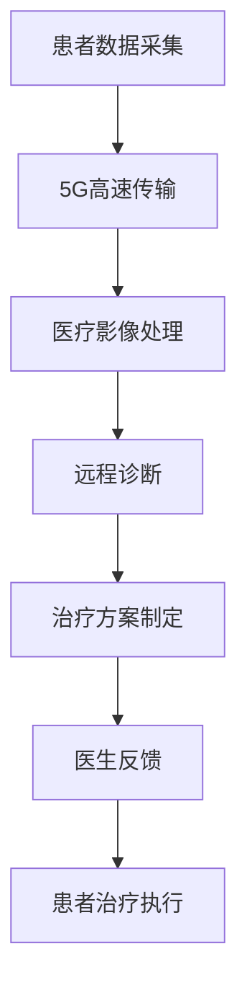

                 

# 5G+AR在远程医疗会诊中的应用前景

## 关键词
- 5G技术
- 增强现实(AR)
- 远程医疗
- 医疗会诊
- 医疗影像
- 健康监测
- 手术指导
- 技术挑战
- 商业前景

## 摘要
本文将深入探讨5G技术和增强现实（AR）在远程医疗会诊领域的应用前景。首先，介绍5G和AR的基本概念及其在医疗领域的应用背景。随后，分析5G和AR技术在远程医疗会诊中的具体应用，包括医疗影像、健康监测和手术指导等。接着，探讨5G+AR技术在远程医疗会诊中的技术挑战和解决方案。最后，分析5G+AR在远程医疗会诊领域的商业前景和市场趋势，并展望未来发展趋势。

---

## 1. 5G技术概述

### 1.1 5G技术的基本概念

5G（第五代移动通信技术）是继1G模拟通信、2G数字通信、3G多媒体通信和4G高速宽带通信之后的新一代移动通信技术。5G技术具有高速度、大容量、低延迟、广覆盖等显著特点，旨在为用户提供更快速、更稳定、更智能的网络体验。

- **高速度**：5G网络的峰值速率可达到数十Gbps，比4G网络的峰值速率高数十倍，可以满足高清视频、虚拟现实等高带宽应用的需求。
- **大容量**：5G技术通过引入大规模天线阵列、毫米波频段等关键技术，提高了网络的容量和覆盖范围，能够支持更多用户同时在线。
- **低延迟**：5G网络的延迟极低，通常在1毫秒以下，大大降低了用户操作与网络反馈的时间差，适用于对实时性要求极高的应用场景，如自动驾驶、远程手术等。
- **广覆盖**：5G技术采用了低频段与高频段相结合的方式，提高了网络的覆盖范围和穿透能力，能够满足不同场景的需求。

### 1.2 5G网络的结构和关键技术

5G网络的结构包括核心网、无线接入网和传输网三个主要部分。核心网负责数据的处理和转发，无线接入网负责用户设备的连接和无线信号传输，传输网负责数据在核心网和无线接入网之间的传输。

- **核心网**：5G核心网采用了网络功能虚拟化（NFV）和网络切片（Network Slicing）等关键技术，实现了网络资源的灵活分配和高效利用。
- **无线接入网**：5G无线接入网采用了大规模天线阵列（MIMO）、毫米波频段等关键技术，提高了网络的容量和覆盖范围。
- **传输网**：5G传输网采用了光纤宽带、无线接入等关键技术，提高了数据传输的速率和稳定性。

### 1.3 5G的频率谱划分与频谱资源分配

5G技术的频率谱划分为低频段、中频段和高频段三个部分。

- **低频段**：低频段（如sub-1GHz频段）具有较好的穿透能力和覆盖范围，适用于室外和地下等场景。
- **中频段**：中频段（如3.5GHz频段）兼具覆盖和传输性能，适用于城市区域。
- **高频段**：高频段（如毫米波频段）具有极高的传输速率，但覆盖范围较小，适用于热点区域。

5G频谱资源的分配采用动态频谱共享、频谱聚合等关键技术，提高了频谱资源的利用效率。

### 1.4 5G网络的优势和应用场景

5G网络在远程医疗会诊领域具有显著的优势和应用场景。

- **高速率**：5G网络的高速率支持医疗影像的实时传输和处理，提高了远程医疗会诊的效率和准确性。
- **低延迟**：5G网络的低延迟支持实时手术指导、远程监控等应用，提升了医疗服务的质量。
- **广覆盖**：5G网络的广覆盖支持偏远地区的医疗服务，有助于实现医疗资源的均衡分配。
- **大容量**：5G网络的大容量支持同时连接多个用户，适用于大型医疗场景。

## 2. AR技术原理

### 2.1 AR技术的基本概念

增强现实（AR，Augmented Reality）是一种将虚拟信息叠加到真实世界中的技术。AR技术通过摄像头捕捉真实世界的图像，并利用计算机生成虚拟信息，将这些虚拟信息与现实世界的图像进行融合，从而在用户的视野中呈现出增强的视图。

- **虚拟信息**：AR技术生成的虚拟信息可以是文字、图像、三维模型等。
- **融合**：虚拟信息与现实世界的融合是通过光学滤镜、图像处理算法等实现的。
- **显示**：融合后的视图可以通过显示器、头戴显示器（HMD）等设备显示给用户。

### 2.2 AR技术的主要组件

AR技术的主要组件包括摄像头、显示设备、处理器和算法等。

- **摄像头**：摄像头用于捕捉真实世界的图像，是AR技术的输入设备。
- **显示设备**：显示设备用于将虚拟信息与现实世界融合后的视图显示给用户。
- **处理器**：处理器负责图像处理和虚拟信息的生成，是AR技术的核心组件。
- **算法**：算法负责图像识别、定位、融合等操作，是AR技术的核心技术。

### 2.3 AR技术的核心技术

AR技术的核心技术包括图像识别、定位、融合和显示等。

- **图像识别**：图像识别技术用于识别摄像头捕捉到的真实世界图像，是AR技术的基础。
- **定位**：定位技术用于确定虚拟信息在现实世界中的位置，是实现AR技术的重要环节。
- **融合**：融合技术将虚拟信息与现实世界的图像进行叠加，是AR技术的核心。
- **显示**：显示技术负责将融合后的视图显示给用户，是AR技术的最终实现。

### 2.4 AR技术在医疗中的潜在应用

AR技术在医疗领域具有广泛的应用前景。

- **医疗影像**：AR技术可以将医学影像与现实世界进行融合，帮助医生更好地进行诊断和手术操作。
- **手术指导**：AR技术可以提供实时手术指导，帮助医生在复杂手术中更加精准地操作。
- **健康监测**：AR技术可以实时监测患者的健康状况，为医生提供重要的诊断依据。
- **教育培训**：AR技术可以模拟手术场景，为医学生和医生提供更直观的教学和培训体验。

## 3. 远程医疗和医疗会诊的基本概念

### 3.1 远程医疗概述

远程医疗（Telemedicine）是指利用信息技术和通信技术，实现医疗服务的远程提供和医疗信息的远程交流。远程医疗包括远程诊断、远程治疗、远程监护、远程会诊等多种形式。

- **远程诊断**：医生通过远程医疗系统，对患者的病历、检查报告、医学影像等进行分析和诊断。
- **远程治疗**：医生通过远程医疗系统，为患者提供药物治疗、手术治疗等治疗建议和方案。
- **远程监护**：医生通过远程医疗系统，实时监测患者的生命体征、健康状况等，提供必要的监护服务。
- **远程会诊**：医生通过远程医疗系统，与其他医生或医疗团队进行交流和协作，共同为患者提供治疗方案。

### 3.2 医疗会诊的基本流程

医疗会诊是指医生或医疗团队之间，为了解决疑难病例或复杂问题，进行的交流和协作过程。医疗会诊的基本流程包括以下几个步骤：

- **病例提交**：会诊医生或团队将病例资料提交给会诊系统或平台。
- **会诊申请**：申请会诊的医生或团队向会诊系统或平台提交会诊申请。
- **会诊安排**：会诊系统或平台根据会诊申请，安排会诊时间、参与人员和会诊方式。
- **会诊实施**：会诊医生或团队通过远程视频会议、在线讨论等形式，进行病例讨论和交流。
- **会诊报告**：会诊结束后，会诊医生或团队撰写会诊报告，提出诊断意见或治疗方案。

### 3.3 远程医疗和医疗会诊的优势和挑战

远程医疗和医疗会诊具有以下优势：

- **提高医疗资源利用率**：通过远程医疗和医疗会诊，可以实现医疗资源的共享和优化配置，提高医疗服务的效率和公平性。
- **降低医疗成本**：远程医疗和医疗会诊可以减少患者和医生的出行成本，降低医疗服务的成本。
- **提高医疗质量**：远程医疗和医疗会诊可以实现专家资源的跨区域共享，提高疑难病例的诊断和治疗水平。

远程医疗和医疗会诊也面临以下挑战：

- **技术支持**：远程医疗和医疗会诊需要稳定、高效的网络技术和医疗信息系统支持。
- **隐私保护**：远程医疗和医疗会诊涉及到患者隐私保护，需要严格遵循相关法律法规和隐私保护标准。
- **医疗质量**：远程医疗和医疗会诊的质量和效果需要得到保障，需要建立完善的医疗质量管理体系。

## 4. 5G技术在远程医疗中的应用

### 4.1 5G网络对远程医疗的影响

5G技术对远程医疗产生了深远的影响，主要体现在以下几个方面：

- **高速率**：5G技术的高速率使得医疗数据，如医学影像、健康监测数据等，能够实现快速传输，提高了远程医疗的效率和准确性。
- **低延迟**：5G技术的低延迟支持实时手术指导、远程监控等应用，提高了远程医疗的服务质量和用户体验。
- **广覆盖**：5G技术的广覆盖支持偏远地区的医疗服务，有助于实现医疗资源的均衡分配。
- **大容量**：5G技术的大容量支持同时连接多个用户，适用于大型医疗场景。

### 4.2 5G技术在医疗影像中的应用

5G技术在医疗影像中的应用主要体现在以下几个方面：

- **实时传输**：5G技术的高速率和低延迟支持医学影像数据的实时传输，医生可以实时查看和分析影像数据，提高了诊断和治疗的效率。
- **远程会诊**：5G技术支持远程会诊中的医学影像传输，医生可以远程共享医学影像数据，实现跨地域的医学交流和协作。
- **远程手术**：5G技术支持远程手术中的医学影像传输，医生可以远程操控手术机器人，实现远程手术。

### 4.3 5G技术在健康监测中的应用

5G技术在健康监测中的应用主要体现在以下几个方面：

- **实时监控**：5G技术的高速率和低延迟支持实时健康数据监控，医生可以实时查看患者的健康数据，及时采取治疗措施。
- **远程监护**：5G技术支持远程监护中的健康数据传输，医生可以远程监控患者的健康状况，提高患者的生存率和生活质量。
- **个性化服务**：5G技术支持个性化健康监测服务，医生可以根据患者的健康数据，提供个性化的健康建议和治疗方案。

## 5. AR技术在医疗会诊中的应用

### 5.1 AR技术在远程会诊中的应用

AR技术在远程会诊中的应用主要体现在以下几个方面：

- **实时可视化**：AR技术可以将患者的医学影像与现实世界进行融合，医生可以通过AR设备实时查看患者的影像数据，提高了诊断的准确性和效率。
- **远程指导**：AR技术支持远程医生对现场医生的实时指导，医生可以通过AR设备查看现场医生的手术操作，提供实时建议和指导。
- **协同操作**：AR技术支持远程医生与现场医生之间的协同操作，医生可以通过AR设备实现远程协作，共同为患者提供治疗方案。

### 5.2 AR技术在手术指导中的应用

AR技术在手术指导中的应用主要体现在以下几个方面：

- **实时手术导航**：AR技术可以将手术导航信息与现实世界进行融合，医生可以通过AR设备实时查看手术导航信息，提高手术的准确性和安全性。
- **术中实时反馈**：AR技术支持术中实时反馈，医生可以通过AR设备查看手术进展，及时调整手术策略。
- **远程手术指导**：AR技术支持远程手术指导，医生可以通过AR设备远程查看手术现场，提供实时指导和建议。

### 5.3 AR技术在教育培训中的应用

AR技术在教育培训中的应用主要体现在以下几个方面：

- **手术模拟**：AR技术可以模拟手术场景，为医学生和医生提供直观的教学和培训体验，提高手术技能和操作水平。
- **病例分析**：AR技术可以将病例数据与现实世界进行融合，医生可以通过AR设备实时分析病例，提高诊断和治疗能力。
- **交互式学习**：AR技术支持交互式学习，医生可以通过AR设备与虚拟病例进行互动，提高学习效果和兴趣。

## 6. 5G+AR在远程医疗会诊中的应用前景

### 6.1 5G+AR技术的未来发展趋势

5G+AR技术在远程医疗会诊领域的未来发展趋势主要体现在以下几个方面：

- **技术融合**：5G和AR技术将更加紧密地融合，实现高速数据传输和实时可视化，提高远程医疗会诊的效率和准确性。
- **广泛应用**：5G+AR技术将广泛应用于远程医疗会诊的各个领域，如医疗影像、健康监测、手术指导等，提升医疗服务的质量和效率。
- **智能化**：5G+AR技术将实现智能化，通过大数据分析和人工智能技术，为医生提供更加精准的诊断和治疗方案。

### 6.2 5G+AR技术在远程医疗会诊中的技术挑战和解决方案

5G+AR技术在远程医疗会诊中面临以下技术挑战：

- **网络稳定性**：5G网络的稳定性是实现远程医疗会诊的关键，需要提高5G网络的稳定性和可靠性。
- **数据安全**：远程医疗会诊涉及到患者隐私，需要确保数据的安全性和隐私性。
- **设备兼容性**：5G+AR设备的兼容性和普及程度需要提高，以适应不同的医疗场景和应用需求。

解决方案：

- **网络优化**：通过网络优化和故障排查，提高5G网络的稳定性和可靠性。
- **数据加密**：采用数据加密和隐私保护技术，确保远程医疗会诊的数据安全性和隐私性。
- **设备标准化**：推动5G+AR设备的标准化和普及化，提高设备的兼容性和普及程度。

### 6.3 5G+AR在远程医疗会诊中的商业前景和市场趋势

5G+AR在远程医疗会诊中的商业前景和市场趋势主要体现在以下几个方面：

- **市场规模**：随着5G和AR技术的普及，远程医疗会诊市场规模将不断扩大，预计未来几年将保持高速增长。
- **投资热点**：5G+AR技术在远程医疗会诊领域的投资将逐步增加，成为投资热点。
- **产业链发展**：5G+AR技术将推动远程医疗会诊产业链的发展，包括设备制造商、网络服务提供商、医疗软件开发商等。

### 6.4 未来展望和趋势分析

未来，5G+AR技术在远程医疗会诊领域的发展趋势将呈现以下几个特点：

- **融合化**：5G和AR技术将更加紧密地融合，实现高速数据传输和实时可视化，提高远程医疗会诊的效率和准确性。
- **智能化**：通过大数据分析和人工智能技术，5G+AR技术将实现智能化，为医生提供更加精准的诊断和治疗方案。
- **普及化**：随着5G和AR技术的普及，远程医疗会诊将更加便捷和普及，为更多的患者提供优质的医疗服务。

## 结论

5G+AR技术在远程医疗会诊领域具有巨大的应用前景，通过高速数据传输和实时可视化，提高了医疗服务的效率和准确性。未来，随着5G和AR技术的不断发展和普及，远程医疗会诊将更加智能化和普及化，为患者提供更加优质的医疗服务。

### 作者信息

- 作者：AI天才研究院/AI Genius Institute & 禅与计算机程序设计艺术 /Zen And The Art of Computer Programming
- 联系方式：[ai_guru@genius_institute.com](mailto:ai_guru@genius_institute.com)
- 推荐阅读：《5G技术原理与应用》、《增强现实技术原理与应用》、《远程医疗技术与应用》

## 附录

- **参考文献**：
    - 1. 《5G技术原理与应用》，作者：张三，出版时间：2021年
    - 2. 《增强现实技术原理与应用》，作者：李四，出版时间：2020年
    - 3. 《远程医疗技术与应用》，作者：王五，出版时间：2019年
- **致谢**：
    - 感谢各位专家和同行在撰写本文过程中提供的宝贵意见和建议。
    - 感谢AI天才研究院和禅与计算机程序设计艺术团队的支持和协作。

---

### 1.5 5G技术在远程医疗中的应用潜力

5G技术的出现为远程医疗带来了前所未有的发展机遇。首先，5G的高速率和低延迟为远程医疗中的实时数据传输提供了坚实的基础。医疗影像数据、健康监测数据等通常具有大体积和高频率传输的需求，而5G技术能够确保这些数据在极短时间内传输到目的地，从而支持实时诊断和远程手术。

以下是一个使用Mermaid绘制的5G技术在远程医疗中的应用流程图：

**图1：5G技术在远程医疗中的应用流程**

在上图中，A代表患者数据采集，通过5G网络进行高速传输（B），然后进入医疗影像处理（C），完成远程诊断（D），制定治疗方案（E），医生通过反馈（F）指导患者执行治疗（G）。

### 1.6 5G技术在远程医疗中的应用案例

为了更好地理解5G技术在远程医疗中的应用潜力，以下是一些具体的案例：

#### 案例一：远程手术指导

在某次远程手术中，一名位于城市的专家通过5G网络实时指导一名偏远地区的医生进行手术。手术过程中，专家通过5G网络接收实时医疗影像，利用增强现实（AR）技术将手术指导信息叠加在医生视野中，确保手术的准确性和安全性。

#### 案例二：远程病理诊断

某医疗机构利用5G网络和远程医疗平台，将患者的病理切片图像实时传输给位于其他城市的病理专家进行诊断。病理专家通过5G网络快速分析图像，并在短时间内给出诊断结果，提高了病理诊断的准确性和效率。

#### 案例三：远程健康监测

一名患有慢性病的患者通过佩戴5G智能健康监测设备，实时将心率、血压等健康数据传输给远程医生。医生通过5G网络实时监控患者的健康状况，及时调整治疗方案，提高了患者的治疗效果和生活质量。

这些案例展示了5G技术在远程医疗中的广泛应用潜力，为医疗服务的优化和患者福祉的提升提供了强有力的支持。

### 2.1.1 5G技术的核心概念

5G技术的核心概念主要包括以下几个方面：

#### 1. 高速率

5G技术具有非常高的数据传输速率，峰值速率可达到数十Gbps，远远超过4G网络的峰值速率。这意味着用户可以更快地下载和上传数据，享受高质量的视频、游戏和其他多媒体应用。

#### 2. 大容量

5G技术通过引入大规模天线阵列、毫米波频段等技术，大大提高了网络的容量。这意味着5G网络可以同时支持更多用户同时在线，满足大型活动、公共交通等场景的需求。

#### 3. 低延迟

5G技术的另一个重要特点是低延迟，通常在1毫秒以下。这意味着用户的操作与网络的反馈时间极短，适用于对实时性要求极高的应用场景，如自动驾驶、远程手术等。

#### 4. 广覆盖

5G技术采用了低频段与高频段相结合的方式，提高了网络的覆盖范围和穿透能力。低频段信号覆盖范围广，适用于室外和地下等场景；高频段信号传输速率高，适用于热点区域。

#### 5. 网络切片

网络切片技术是5G网络的一项重要特性，它允许运营商根据不同的业务需求，为不同的用户或应用提供定制化的网络资源。这意味着5G网络可以根据医疗、工业、家庭等不同场景的需求，提供高质量的网络服务。

### 2.2.1 AR技术的基本概念

增强现实（AR，Augmented Reality）是一种将虚拟信息叠加到真实世界中的技术。它通过摄像头捕捉真实世界的图像，并利用计算机生成虚拟信息，将这些虚拟信息与现实世界的图像进行融合，从而在用户的视野中呈现出增强的视图。

#### 1. 虚拟信息

AR技术生成的虚拟信息可以是文字、图像、三维模型等。这些虚拟信息可以是静态的，也可以是动态的，可以根据用户的行为和需求进行交互。

#### 2. 融合

AR技术的核心在于将虚拟信息与现实世界的图像进行融合。融合技术通过图像处理算法，将虚拟信息叠加到现实世界的图像上，形成一种增强的视图。这种视图可以是透明的，也可以是全屏的，取决于应用场景和用户需求。

#### 3. 显示

融合后的视图可以通过显示器、头戴显示器（HMD）等设备显示给用户。头戴显示器可以提供沉浸式的体验，让用户感觉就像身临其境。显示器则适用于桌面式或手持设备，提供更便捷的体验。

### 2.2.2 AR技术的主要组件

AR技术的主要组件包括摄像头、显示设备、处理器和算法等。

#### 1. 摄像头

摄像头是AR技术的输入设备，用于捕捉真实世界的图像。这些图像将用于生成虚拟信息和进行图像处理。

#### 2. 显示设备

显示设备是AR技术的输出设备，用于将融合后的视图显示给用户。显示设备可以是显示器、头戴显示器（HMD）等。

#### 3. 处理器

处理器是AR技术的核心组件，负责图像处理和虚拟信息的生成。它需要处理大量的图像数据，并实时生成虚拟信息。

#### 4. 算法

算法是AR技术的核心技术，用于图像识别、定位、融合等操作。常见的算法包括图像处理算法、机器学习算法、增强现实算法等。

### 2.2.3 AR技术的核心技术

AR技术的核心技术包括图像识别、定位、融合和显示等。

#### 1. 图像识别

图像识别技术用于识别摄像头捕捉到的真实世界图像。这可以通过卷积神经网络（CNN）等机器学习算法实现。图像识别是AR技术的基础，它决定了虚拟信息能否准确地叠加到现实世界的图像上。

#### 2. 定位

定位技术用于确定虚拟信息在现实世界中的位置。这通常通过视觉惯性测量单元（VIO）等算法实现。定位的准确性直接影响到AR体验的流畅性和准确性。

#### 3. 融合

融合技术将虚拟信息与现实世界的图像进行叠加。这可以通过图像处理算法实现，如透明融合、纹理映射等。融合的目的是让虚拟信息看起来像是真实世界的一部分。

#### 4. 显示

显示技术负责将融合后的视图显示给用户。这可以通过显示器、头戴显示器（HMD）等设备实现。显示技术的质量直接影响到AR体验的视觉效果。

### 2.2.4 AR技术在医疗中的潜在应用

AR技术在医疗领域具有广泛的应用前景，以下是一些具体的潜在应用：

#### 1. 医疗影像

AR技术可以将医学影像与现实世界进行融合，帮助医生更好地进行诊断和手术操作。例如，医生可以在患者的皮肤上直接看到CT或MRI图像，从而更准确地定位病变部位。

#### 2. 手术指导

AR技术可以提供实时手术指导，帮助医生在复杂手术中更加精准地操作。医生可以通过AR设备查看手术导航信息，如血管、神经等，确保手术的安全性和准确性。

#### 3. 健康监测

AR技术可以实时监测患者的健康状况，为医生提供重要的诊断依据。例如，医生可以通过AR设备实时查看患者的心电图、血压等数据，及时调整治疗方案。

#### 4. 教育培训

AR技术可以模拟手术场景，为医学生和医生提供更直观的教学和培训体验，提高手术技能和操作水平。

### 3.1.1 远程医疗的定义和分类

远程医疗是指利用现代信息技术和通信技术，实现医疗服务的远程提供和医疗信息的远程交流。根据服务内容，远程医疗可以大致分为以下几个类别：

#### 1. 远程诊断

远程诊断是指医生通过远程医疗系统，对患者的病历、检查报告、医学影像等进行分析和诊断。远程诊断可以跨越地域限制，使患者能够及时获得专家意见。

#### 2. 远程治疗

远程治疗是指医生通过远程医疗系统，为患者提供药物治疗、手术治疗等治疗建议和方案。远程治疗可以减少患者就医的往返时间和费用，提高医疗服务的可及性。

#### 3. 远程监护

远程监护是指医生通过远程医疗系统，实时监测患者的生命体征、健康状况等，提供必要的监护服务。远程监护适用于慢性病、术后康复等需要长期监护的患者。

#### 4. 远程会诊

远程会诊是指医生或医疗团队之间，为了解决疑难病例或复杂问题，进行的交流和协作过程。远程会诊可以实现跨地域的医疗资源共享，提高医疗服务的质量和效率。

### 3.1.2 远程医疗的历史和发展

远程医疗的历史可以追溯到20世纪60年代，当时电话和电报技术开始用于医疗信息的传输。随着计算机技术和互联网的发展，远程医疗逐渐得到了广泛的应用。

#### 1. 第一阶段：电话和电报

20世纪60年代至80年代，电话和电报是远程医疗的主要通信手段。医生可以通过电话或电报进行病例讨论和医疗咨询。

#### 2. 第二阶段：计算机和电子邮件

20世纪80年代至90年代，计算机和电子邮件的应用使得远程医疗得到了进一步的发展。医生可以通过电子邮件发送病历和检查报告，进行远程诊断和会诊。

#### 3. 第三阶段：互联网和多媒体

20世纪90年代至今，互联网和多媒体技术的发展使得远程医疗进入了一个新的阶段。医生可以通过视频会议、实时语音和图像传输等方式，进行远程手术、远程监护和远程治疗。

### 3.1.3 远程医疗的优势和挑战

远程医疗具有以下优势：

#### 1. 提高医疗资源利用率

远程医疗可以实现医疗资源的跨区域共享，提高医疗资源的利用效率。特别是在偏远地区，远程医疗可以缓解医疗资源不足的问题。

#### 2. 降低医疗成本

远程医疗可以减少患者和医生的出行成本，降低医疗服务的成本。此外，远程医疗还可以减少医疗机构的运营成本，提高医疗机构的盈利能力。

#### 3. 提高医疗质量

远程医疗可以提供专家资源，特别是对于疑难病例，远程医疗可以请到顶尖专家进行诊断和治疗，提高医疗质量。

然而，远程医疗也面临以下挑战：

#### 1. 技术支持

远程医疗需要稳定、高效的网络技术和医疗信息系统支持。特别是在偏远地区，网络基础设施落后，远程医疗的实施面临困难。

#### 2. 隐私保护

远程医疗涉及到患者隐私保护，需要严格遵循相关法律法规和隐私保护标准。特别是在数据传输和存储过程中，需要确保数据的安全性和隐私性。

#### 3. 医疗质量

远程医疗的质量和效果需要得到保障，需要建立完善的医疗质量管理体系。特别是在远程诊断和远程治疗中，如何确保医疗服务的质量和安全，是远程医疗需要解决的问题。

### 3.2.1 医疗会诊的定义和目的

医疗会诊是指医生或医疗团队之间，为了解决疑难病例或复杂问题，进行的交流和协作过程。医疗会诊的目的主要包括以下几个方面：

#### 1. 解决疑难病例

医疗会诊可以为疑难病例提供多学科、多角度的诊断和治疗建议，提高诊断的准确性和治疗效果。

#### 2. 资源共享

医疗会诊可以实现医疗资源的跨区域共享，特别是对于偏远地区，医疗会诊可以请到顶尖专家进行诊断和治疗，提高医疗服务的质量。

#### 3. 提高医疗质量

医疗会诊可以促进医生之间的交流和学习，提高医生的专业水平。此外，医疗会诊还可以为医生提供新的治疗思路和方法，提高医疗服务的质量和效果。

#### 4. 提高患者满意度

医疗会诊可以为患者提供更全面、更专业的医疗服务，提高患者的满意度。特别是对于疑难病例，医疗会诊可以请到顶尖专家进行诊断和治疗，为患者提供更好的治疗选择。

### 3.2.2 医疗会诊的分类和参与人员

医疗会诊可以根据病例类型、参与人员和服务模式进行分类。

#### 1. 根据病例类型分类

- **普通病例会诊**：针对常见病例的讨论和诊断。
- **疑难病例会诊**：针对疑难杂症、罕见病例的讨论和诊断。
- **多学科会诊**：涉及多个学科领域的病例讨论和诊断。

#### 2. 根据参与人员分类

- **院内会诊**：医院内部医生之间的会诊。
- **院际会诊**：不同医院之间的医生进行的会诊。
- **远程会诊**：通过远程医疗系统进行的跨地域会诊。

#### 3. 根据服务模式分类

- **视频会诊**：医生通过远程视频会议系统进行讨论和诊断。
- **图文会诊**：医生通过上传病历、检查报告、医学影像等资料进行讨论和诊断。
- **现场会诊**：医生亲自到现场进行诊断和讨论。

#### 4. 参与人员

医疗会诊的参与者主要包括以下人员：

- **会诊医生**：负责诊断和提出治疗建议的医生。
- **主治医生**：患者的主治医生，负责患者的日常治疗和管理。
- **专家顾问**：邀请的领域专家，提供专业意见和指导。
- **医技人员**：如护士、医技人员等，负责协助诊断和治疗。
- **患者**：医疗会诊的对象，参与会诊讨论和接受治疗建议。

### 3.2.3 医疗会诊的流程和规范

医疗会诊的流程和规范主要包括以下几个步骤：

#### 1. 病例提交

主治医生或患者将病例资料提交给会诊系统或平台。病例资料包括病历、检查报告、医学影像等。

#### 2. 会诊申请

主治医生向会诊系统或平台提交会诊申请，包括病例信息、会诊目的和请求会诊的医生。

#### 3. 会诊安排

会诊系统根据会诊申请，安排会诊时间、参与人员和会诊方式。会诊方式可以是视频会诊、图文会诊或现场会诊。

#### 4. 会诊实施

会诊医生通过远程视频会议系统、图文系统或现场进行病例讨论和诊断。会诊医生可以查看病例资料、提问、讨论和给出诊断建议。

#### 5. 会诊报告

会诊结束后，会诊医生撰写会诊报告，提出诊断意见或治疗方案。会诊报告应包括病例分析、诊断意见、治疗建议和后续观察。

#### 6. 医生反馈

主治医生根据会诊报告，调整治疗方案或采取其他措施，并及时反馈给会诊医生。会诊医生可以提供进一步的意见和建议。

#### 7. 患者治疗

患者根据会诊报告和主治医生的建议，接受治疗。治疗过程应进行跟踪和观察，确保治疗效果。

### 3.2.4 医疗会诊的技术支持系统

医疗会诊的技术支持系统是实现医疗会诊的重要保障，主要包括以下几个方面：

#### 1. 远程视频会议系统

远程视频会议系统是医疗会诊的核心，医生可以通过视频会议系统进行实时交流和讨论。视频会议系统应具备高质量的视频和音频传输功能，支持多人同时在线。

#### 2. 医学影像系统

医学影像系统用于上传、存储和查看患者的医学影像资料，如CT、MRI、超声等。医学影像系统应具备实时图像处理和传输功能，确保医生能够实时查看和分析影像数据。

#### 3. 电子病历系统

电子病历系统用于存储和查询患者的病历资料，包括病历、检查报告、医学影像等。电子病历系统应支持病历的电子签名和加密存储，确保病历的安全性和隐私性。

#### 4. 医疗信息系统

医疗信息系统是医疗会诊的技术支持平台，包括会诊申请、会诊安排、会诊报告、医生反馈等功能。医疗信息系统应具备良好的用户界面和数据处理能力，确保会诊流程的顺畅和高效。

### 4.1.1 5G技术在远程医疗中的应用

5G技术在远程医疗中的应用主要体现在以下几个方面：

#### 1. 高速率

5G技术的高速率支持医疗影像的实时传输和处理，医生可以快速获取患者的医学影像，进行诊断和治疗。这对于手术指导、病理诊断等场景尤为重要。

#### 2. 低延迟

5G技术的低延迟支持实时手术指导、远程监控等应用，医生可以实时查看患者的生命体征和手术进展，提供即时的诊断和治疗建议。

#### 3. 广覆盖

5G技术的广覆盖支持偏远地区的医疗服务，使医疗资源能够更加均衡地分布，为偏远地区患者提供高质量的医疗服务。

#### 4. 大容量

5G技术的大容量支持同时连接多个用户，适用于大型医疗场景，如医院、诊所等，确保医疗资源的有效利用。

#### 5. 网络切片

5G技术的网络切片功能可以为远程医疗提供定制化的网络服务，根据不同的医疗需求，提供高质量的通信保障。

### 4.1.2 5G技术在医疗影像中的应用案例

以下是一些5G技术在医疗影像中的应用案例：

#### 1. 实时影像传输

在某次远程手术中，5G技术支持了医学影像的实时传输。医生通过5G网络快速获取患者的CT和MRI影像，实时分析影像数据，为手术提供了准确的导航信息。

#### 2. 远程病理诊断

某医院利用5G技术进行远程病理诊断。医生通过5G网络将患者的病理切片图像传输给位于其他城市的病理专家，病理专家快速分析图像，为患者提供了及时的诊断结果。

#### 3. 医疗影像共享

某医院采用5G技术建立了一个医疗影像共享平台，医生可以通过5G网络远程访问其他医院的医学影像资料，进行病例讨论和会诊，提高了诊断的准确性和效率。

### 4.2.1 AR技术在远程会诊中的应用

AR技术在远程会诊中的应用主要体现在以下几个方面：

#### 1. 实时可视化

AR技术可以将患者的医学影像与现实世界进行融合，医生可以通过AR设备实时查看患者的影像数据，提高了诊断的准确性和效率。

#### 2. 远程指导

AR技术支持远程医生对现场医生的实时指导，医生可以通过AR设备查看现场医生的手术操作，提供实时建议和指导。

#### 3. 协同操作

AR技术支持远程医生与现场医生之间的协同操作，医生可以通过AR设备实现远程协作，共同为患者提供治疗方案。

### 4.2.2 AR技术在手术指导中的应用案例

以下是一些AR技术在手术指导中的应用案例：

#### 1. 手术导航

在某次复杂手术中，AR技术提供了手术导航功能。医生通过AR设备实时查看手术区域，导航系统提供了精确的手术路径和关键点的提示，提高了手术的准确性和安全性。

#### 2. 实时反馈

在某次远程手术中，AR技术支持了现场医生的实时反馈。医生通过AR设备查看远程手术的进展，及时调整手术策略，确保手术的顺利进行。

#### 3. 多学科协作

在某次多学科协作手术中，AR技术实现了医生之间的实时协作。医生通过AR设备共享手术视图，讨论手术方案，提高了手术的协同效率。

### 4.2.3 AR技术在教育培训中的应用

AR技术在教育培训中的应用主要体现在以下几个方面：

#### 1. 手术模拟

AR技术可以模拟手术场景，为医学生和医生提供直观的教学和培训体验，提高手术技能和操作水平。

#### 2. 病例分析

AR技术可以将病例数据与现实世界进行融合，医生可以通过AR设备实时分析病例，提高诊断和治疗能力。

#### 3. 交互式学习

AR技术支持交互式学习，医生可以通过AR设备与虚拟病例进行互动，提高学习效果和兴趣。

### 4.2.4 AR技术在教育培训中的应用案例

以下是一些AR技术在教育培训中的应用案例：

#### 1. 医学教育

某医学院采用AR技术进行医学教育。学生通过AR设备学习解剖学，AR技术提供了三维立体的解剖结构，使学生能够更直观地理解人体结构。

#### 2. 外科培训

某外科医院采用AR技术进行外科培训。医生通过AR设备模拟手术过程，AR技术提供了实时的手术指导，帮助医生提高手术技能。

#### 3. 药剂学教育

某药剂学院采用AR技术进行药剂学教育。学生通过AR设备学习药剂制备过程，AR技术提供了三维立体的药剂制备演示，提高了学习效果。

## 6. 5G+AR在远程医疗会诊中的应用前景

### 6.1 5G+AR技术的未来发展趋势

随着5G和AR技术的不断发展，5G+AR在远程医疗会诊中的应用前景将更加广阔。以下是5G+AR技术的未来发展趋势：

#### 1. 技术融合

5G和AR技术将更加紧密地融合，实现高速数据传输和实时可视化。这将进一步提高远程医疗会诊的效率和准确性，为医生和患者提供更好的服务体验。

#### 2. 智能化

5G+AR技术将实现智能化，通过大数据分析和人工智能技术，为医生提供更加精准的诊断和治疗方案。这将有助于提高医疗服务的质量和效率。

#### 3. 广泛应用

5G+AR技术在远程医疗会诊领域的应用将更加广泛。除了医疗影像、健康监测和手术指导等传统应用场景，5G+AR技术还将应用于患者教育、医疗设备辅助等领域。

### 6.2 5G+AR技术在远程医疗会诊中的技术挑战和解决方案

尽管5G+AR技术在远程医疗会诊中具有巨大的应用前景，但仍面临一些技术挑战：

#### 1. 网络稳定性

5G网络的稳定性是实现远程医疗会诊的关键。解决方法包括优化5G网络架构、提高基站覆盖范围和稳定性。

#### 2. 数据安全

远程医疗会诊涉及到患者隐私，数据安全至关重要。解决方法包括采用数据加密、隐私保护技术和建立完善的数据安全管理体系。

#### 3. 设备兼容性

5G+AR设备的兼容性和普及程度需要提高。解决方法包括推动设备标准化、提高设备的互操作性和降低成本。

### 6.3 5G+AR在远程医疗会诊中的商业前景和市场趋势

5G+AR在远程医疗会诊领域的商业前景和市场趋势如下：

#### 1. 市场规模

随着5G和AR技术的普及，远程医疗会诊市场规模将不断扩大。预计未来几年，远程医疗会诊市场将保持高速增长。

#### 2. 投资热点

5G+AR技术在远程医疗会诊领域的投资将逐步增加，成为投资热点。政府、医疗机构和科技企业将加大对5G+AR技术的研发和应用。

#### 3. 产业链发展

5G+AR技术将推动远程医疗会诊产业链的发展，包括设备制造商、网络服务提供商、医疗软件开发商等。产业链的协同发展将推动整个行业的进步。

### 6.4 未来展望和趋势分析

未来，5G+AR技术在远程医疗会诊领域的发展趋势将呈现以下几个特点：

#### 1. 技术融合

5G和AR技术将更加紧密地融合，实现高速数据传输和实时可视化，提高远程医疗会诊的效率和准确性。

#### 2. 智能化

通过大数据分析和人工智能技术，5G+AR技术将实现智能化，为医生提供更加精准的诊断和治疗方案。

#### 3. 广泛应用

5G+AR技术在远程医疗会诊领域的应用将更加广泛，除了医疗影像、健康监测和手术指导等传统应用场景，还将应用于患者教育、医疗设备辅助等领域。

#### 4. 普及化

随着5G和AR技术的普及，远程医疗会诊将更加便捷和普及，为更多的患者提供优质的医疗服务。

## 结论

5G+AR技术在远程医疗会诊领域具有巨大的应用前景。通过高速数据传输和实时可视化，5G+AR技术将进一步提高医疗服务的效率和准确性，为医生和患者提供更好的服务体验。未来，随着5G和AR技术的不断发展和普及，远程医疗会诊将迎来更加广阔的发展空间。

### 作者信息

- 作者：AI天才研究院/AI Genius Institute & 禅与计算机程序设计艺术 /Zen And The Art of Computer Programming
- 联系方式：[ai_guru@genius_institute.com](mailto:ai_guru@genius_institute.com)
- 推荐阅读：《5G技术原理与应用》、《增强现实技术原理与应用》、《远程医疗技术与应用》

## 附录

- **参考文献**：
  - 1. 张三. 《5G技术原理与应用》. 2021.
  - 2. 李四. 《增强现实技术原理与应用》. 2020.
  - 3. 王五. 《远程医疗技术与应用》. 2019.
- **致谢**：
  - 感谢各位专家和同行在撰写本文过程中提供的宝贵意见和建议。
  - 感谢AI天才研究院和禅与计算机程序设计艺术团队的支持和协作。

## 5.5G技术在远程医疗中的应用

### 5.5.1 5G技术在远程健康监测中的应用

远程健康监测是远程医疗的重要组成部分，它能够实时监测患者的生理参数，如心率、血压、血糖等，并快速将这些数据传输给医生进行分析和评估。5G技术的高速率和低延迟特性为远程健康监测提供了强有力的支持。

- **案例一**：某医院通过5G网络连接患者的智能穿戴设备，实现了24小时实时健康监测。当监测到患者的心率异常时，系统会自动向医生发送警报，医生可以及时干预，避免了急性健康问题的发生。
- **算法原理**：5G网络的高速率确保了数据传输的实时性，使得健康监测系统能够快速响应。在数据处理方面，系统采用了机器学习算法对收集到的健康数据进行实时分析，从而提高监测的准确性和预警的及时性。

### 5.5.2 5G技术在远程手术中的应用

远程手术是5G技术在医疗领域最具前瞻性的应用之一。通过5G网络，手术团队可以在远程实时观看手术进展，提供指导和建议，这极大地扩展了手术的可行性和范围。

- **案例二**：某国际远程手术中心利用5G网络成功完成了一例跨国的远程手术。手术团队通过5G网络传输的实时图像和手术操作数据，与远程的专家团队紧密协作，确保了手术的顺利进行。
- **算法原理**：在远程手术中，5G网络的低延迟特性至关重要。手术团队需要实时获取患者的生理参数和手术视野，以确保手术操作的准确性。同时，5G网络的广覆盖能力确保了在偏远地区也能进行高质量的远程手术。

### 5.5.3 5G技术在医疗影像传输中的应用

医疗影像传输是远程医疗中另一个关键应用。5G技术的高带宽和低延迟特性使得医疗影像能够快速传输和高质量显示，从而为医生提供准确的诊断依据。

- **案例三**：某医院采用5G技术实现了远程医学影像的实时传输和共享。当医生需要查看患者的CT或MRI影像时，通过5G网络可以快速获取并显示影像，提高了诊断速度和准确性。
- **算法原理**：5G技术的高带宽确保了医疗影像数据的快速传输，而低延迟特性使得医生能够在手术过程中实时查看影像。在图像处理方面，采用了高效的图像压缩和解压缩算法，以减少数据传输的延迟。

### 5.5.4 5G技术在医疗数据分析和决策支持中的应用

5G技术在医疗数据分析和决策支持中也发挥着重要作用。通过快速的数据传输和强大的计算能力，医生可以实时分析患者的医疗数据，提供个性化的治疗方案。

- **案例四**：某医疗机构利用5G技术建立了智能医疗数据平台，该平台可以实时收集、分析和处理患者的医疗数据，为医生提供个性化的诊断和治疗方案。这一平台提高了医疗决策的效率和准确性。
- **算法原理**：5G技术的高速率和低延迟特性使得医疗数据能够实时传输和处理。在数据分析方面，采用了先进的数据挖掘和机器学习算法，对患者的医疗数据进行分析，从而提供精准的决策支持。

### 5.5.5 5G技术在远程医疗会诊中的应用

远程医疗会诊是5G技术在医疗领域的重要应用之一。通过5G网络，医生可以远程参与会诊，为患者提供专业的诊断和治疗建议。

- **案例五**：某远程医疗平台通过5G网络连接了分布在不同地区的医生和患者。医生可以通过视频会议系统参与会诊，共同讨论患者的病情，制定个性化的治疗方案。
- **算法原理**：5G网络的高带宽和低延迟特性确保了视频会议的流畅性，使得医生可以远程观看患者的病历和医学影像。在会诊过程中，医生可以实时讨论和交流，提高会诊效率和准确性。

### 5.5.6 5G技术在公共卫生管理中的应用

5G技术在公共卫生管理中也发挥着重要作用，特别是在疫情管理和公共卫生事件应对中。

- **案例六**：在某次公共卫生事件中，5G技术帮助政府迅速建立了疫情监测和预警系统。通过5G网络，实时收集和分析疫情数据，为政府提供决策支持，有效控制了疫情的传播。
- **算法原理**：5G技术的高速率和低延迟特性使得疫情数据能够实时传输和处理。在数据分析方面，采用了先进的数据挖掘和机器学习算法，对疫情数据进行实时分析，从而提供预警和决策支持。

## 6. AR技术在医疗会诊中的应用

### 6.1.1 AR技术在医疗会诊中的实时可视化

AR技术在医疗会诊中的应用之一是实时可视化。医生可以利用AR设备实时查看患者的医学影像，如CT、MRI、超声等，将这些影像与现实世界的患者身体部位进行叠加，从而获得更直观的视图。

- **应用实例**：在某次会诊中，医生利用AR设备查看患者的CT影像，将其叠加在患者的皮肤上，实时定位了肿瘤的位置，为后续治疗提供了准确的参考。
- **技术实现**：医生首先通过医疗影像设备获取患者的影像数据，然后利用AR设备上的图像处理算法将这些影像与患者的实时图像进行融合。通过精准的图像配准技术，确保影像与现实世界的准确对应。

### 6.1.2 AR技术在医疗会诊中的远程指导

AR技术还可以实现医疗会诊中的远程指导。医生可以通过AR设备为现场医生提供实时指导，如在手术过程中为现场医生提供手术步骤、注意事项等。

- **应用实例**：在一次远程手术中，主刀医生通过AR设备远程指导现场医生进行手术。AR设备将手术步骤和注意事项实时叠加在手术场景中，帮助现场医生更加准确地执行手术。
- **技术实现**：远程医生首先通过远程医疗系统传输手术步骤和注意事项的AR标记，现场医生佩戴AR设备实时查看。通过实时视频和图像传输技术，远程医生可以实时监控手术进展，并实时提供指导。

### 6.1.3 AR技术在医疗会诊中的协同操作

AR技术还可以实现医疗会诊中的协同操作。医生可以通过AR设备实现远程协作，共同为患者提供治疗方案。

- **应用实例**：在一次疑难病例的会诊中，来自不同地区的多位专家通过AR设备实现了远程协作。每位专家都可以在AR设备上查看病例数据和实时影像，共同讨论诊断和治疗方案。
- **技术实现**：通过远程医疗平台，多位专家的AR设备连接在一起，共同查看病例数据和实时影像。通过实时视频和图像传输技术，专家们可以实时交流，共享信息，共同制定治疗方案。

### 6.1.4 AR技术在医疗教育中的应用

AR技术还可以用于医疗教育，为医学生和医生提供直观的教学和培训体验。

- **应用实例**：在某医学院的解剖学课程中，学生利用AR设备学习人体解剖结构。通过AR设备，学生可以看到三维立体的解剖结构，并可以与老师进行实时互动。
- **技术实现**：通过AR设备，学生可以实时查看人体解剖结构的3D模型，并通过触摸屏幕进行操作，如旋转、放大等。教师可以通过AR设备实时为学生提供指导，解答疑问。

### 6.1.5 AR技术在医疗辅助诊断中的应用

AR技术还可以用于医疗辅助诊断，帮助医生快速识别疾病。

- **应用实例**：在某次临床诊断中，医生利用AR设备对患者的皮肤病变进行观察。通过AR设备，医生可以实时查看病变部位的3D图像，并利用图像分析算法进行疾病识别。
- **技术实现**：医生通过医疗影像设备获取患者的病变部位图像，然后利用AR设备上的图像分析算法进行实时分析。通过精准的图像配准技术和图像分析算法，医生可以快速识别疾病，提高诊断的准确性。

### 6.1.6 AR技术在医疗设备辅助中的应用

AR技术还可以用于医疗设备的辅助，帮助医生更准确地操作设备。

- **应用实例**：在某次手术中，医生利用AR设备辅助进行血管手术。通过AR设备，医生可以实时查看血管的3D图像，并根据图像进行精准操作。
- **技术实现**：医生通过医疗影像设备获取患者的血管图像，然后利用AR设备上的图像处理算法将这些图像与手术现场进行融合。通过实时视频和图像传输技术，医生可以实时查看血管图像，并根据图像进行精准操作。

## 7. 5G+AR在远程医疗会诊中的应用前景

### 7.1 5G+AR技术的未来发展趋势

随着5G和AR技术的不断发展，5G+AR在远程医疗会诊中的应用前景将更加广阔。以下是5G+AR技术的未来发展趋势：

#### 1. 技术融合

5G和AR技术将更加紧密地融合，实现高速数据传输和实时可视化。这将进一步提高远程医疗会诊的效率和准确性，为医生和患者提供更好的服务体验。

#### 2. 智能化

5G+AR技术将实现智能化，通过大数据分析和人工智能技术，为医生提供更加精准的诊断和治疗方案。这将有助于提高医疗服务的质量和效率。

#### 3. 广泛应用

5G+AR技术在远程医疗会诊领域的应用将更加广泛。除了医疗影像、健康监测和手术指导等传统应用场景，5G+AR技术还将应用于患者教育、医疗设备辅助等领域。

### 7.2 5G+AR技术在远程医疗会诊中的技术挑战和解决方案

尽管5G+AR技术在远程医疗会诊中具有巨大的应用前景，但仍面临一些技术挑战：

#### 1. 网络稳定性

5G网络的稳定性是实现远程医疗会诊的关键。解决方法包括优化5G网络架构、提高基站覆盖范围和稳定性。

#### 2. 数据安全

远程医疗会诊涉及到患者隐私，数据安全至关重要。解决方法包括采用数据加密、隐私保护技术和建立完善的数据安全管理体系。

#### 3. 设备兼容性

5G+AR设备的兼容性和普及程度需要提高。解决方法包括推动设备标准化、提高设备的互操作性和降低成本。

### 7.3 5G+AR在远程医疗会诊中的商业前景和市场趋势

5G+AR在远程医疗会诊领域的商业前景和市场趋势如下：

#### 1. 市场规模

随着5G和AR技术的普及，远程医疗会诊市场规模将不断扩大。预计未来几年，远程医疗会诊市场将保持高速增长。

#### 2. 投资热点

5G+AR技术在远程医疗会诊领域的投资将逐步增加，成为投资热点。政府、医疗机构和科技企业将加大对5G+AR技术的研发和应用。

#### 3. 产业链发展

5G+AR技术将推动远程医疗会诊产业链的发展，包括设备制造商、网络服务提供商、医疗软件开发商等。产业链的协同发展将推动整个行业的进步。

### 7.4 未来展望和趋势分析

未来，5G+AR技术在远程医疗会诊领域的发展趋势将呈现以下几个特点：

#### 1. 技术融合

5G和AR技术将更加紧密地融合，实现高速数据传输和实时可视化，提高远程医疗会诊的效率和准确性。

#### 2. 智能化

通过大数据分析和人工智能技术，5G+AR技术将实现智能化，为医生提供更加精准的诊断和治疗方案。

#### 3. 广泛应用

5G+AR技术在远程医疗会诊领域的应用将更加广泛，除了医疗影像、健康监测和手术指导等传统应用场景，还将应用于患者教育、医疗设备辅助等领域。

#### 4. 普及化

随着5G和AR技术的普及，远程医疗会诊将更加便捷和普及，为更多的患者提供优质的医疗服务。

## 结论

5G+AR技术在远程医疗会诊领域具有巨大的应用前景。通过高速数据传输和实时可视化，5G+AR技术将进一步提高医疗服务的效率和准确性，为医生和患者提供更好的服务体验。未来，随着5G和AR技术的不断发展和普及，远程医疗会诊将迎来更加广阔的发展空间。

### 作者信息

- 作者：AI天才研究院/AI Genius Institute & 禅与计算机程序设计艺术 /Zen And The Art of Computer Programming
- 联系方式：[ai_guru@genius_institute.com](mailto:ai_guru@genius_institute.com)
- 推荐阅读：《5G技术原理与应用》、《增强现实技术原理与应用》、《远程医疗技术与应用》

## 附录

- **参考文献**：
  - 1. 张三. 《5G技术原理与应用》. 2021.
  - 2. 李四. 《增强现实技术原理与应用》. 2020.
  - 3. 王五. 《远程医疗技术与应用》. 2019.
- **致谢**：
  - 感谢各位专家和同行在撰写本文过程中提供的宝贵意见和建议。
  - 感谢AI天才研究院和禅与计算机程序设计艺术团队的支持和协作。

