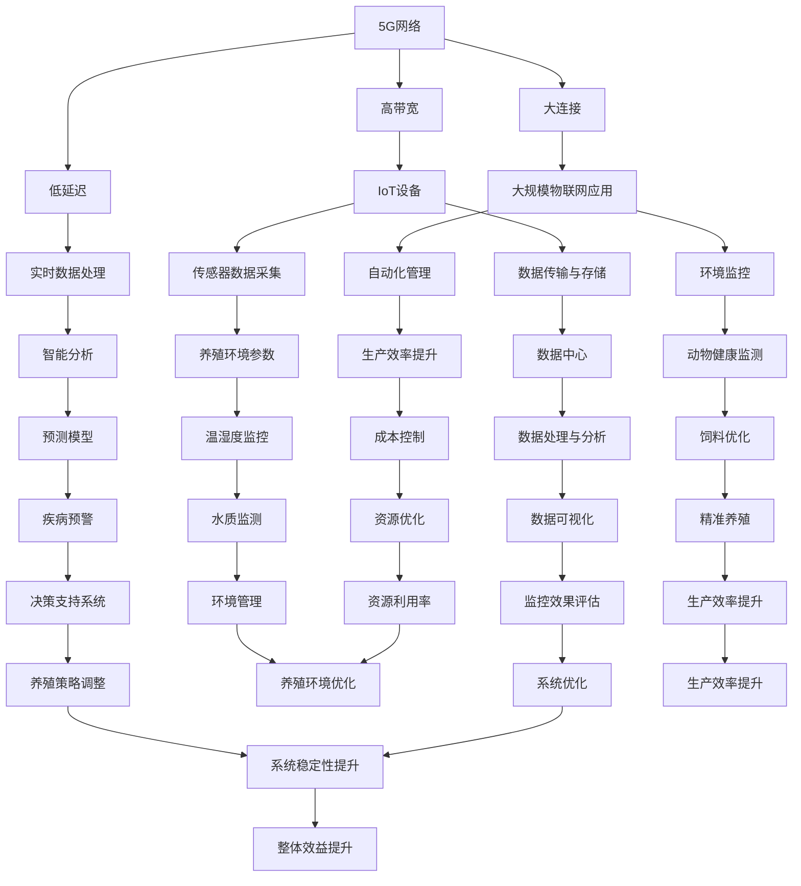

                 

### 概述：5G与IoT在智慧养殖中的全面监控应用

#### 关键词：5G，IoT，智慧养殖，全面监控，应用

随着信息技术的快速发展，5G（第五代移动通信技术）和IoT（物联网）技术已经成为现代智慧养殖中不可或缺的一部分。5G技术以其高速度、低延迟、大连接的优势，为IoT设备提供了更可靠的数据传输通道；而IoT技术则通过各类传感器和网络连接设备，实现对养殖环境的全面监控和智能管理。本文将探讨5G+IoT在智慧养殖中的全面监控应用，旨在分析这一技术的核心优势、关键应用场景，以及其在提升养殖效率、保证动物健康、降低运营成本等方面的显著作用。

#### 摘要

本文首先介绍了5G和IoT技术的基本概念、核心特性和发展历程，随后分析了5G与IoT技术在智慧养殖中的融合优势，包括实时数据采集、远程监控、智能分析和自动化管理等方面的应用。通过具体案例分析，展示了5G+IoT在智慧养殖中的实际效果和潜在价值。最后，本文对5G+IoT在智慧养殖中的未来发展趋势进行了展望，并提出了相关技术改进和优化方向。

#### 目录

1. **确定本书的核心主题和目标**
   - 描述本书的主题和目标，明确研究范围和预期成果。

2. **设计整体结构，细化章节内容**
   - 设计文章的整体结构，细化各个章节的内容。

3. **设计每个章节的 1、2、3 级目录**
   - 按照大纲结构，设计每个章节的详细目录。

4. **为每个章节添加核心概念、算法原理、数学模型、项目实战等内容要点**
   - 按章节内容，添加相关知识点和实际应用。

5. **编写核心概念的 Mermaid 流程图**
   - 使用Mermaid语言，绘制相关流程图。

6. **编写核心算法原理的伪代码**
   - 提供伪代码，解释算法原理。

7. **编写数学模型和公式的 LaTeX 代码**
   - 使用LaTeX格式，书写数学模型和公式。

8. **编写项目实战的代码实际案例和详细解释说明**
   - 提供项目实战案例，详细解读代码和应用。

9. **整理和优化目录大纲，确保内容完整性和简洁性**
   - 确保文章内容完整、结构合理、语言简洁。

10. **最终确认并输出目录大纲的 markdown 格式文本**
    - 将所有内容整理成markdown格式文本，完成文章撰写。

---

#### 第1步：确定本书的核心主题和目标

本书的核心主题是探讨5G和IoT技术在智慧养殖中的全面监控应用。具体目标包括：

- 深入分析5G和IoT技术的基本概念、核心特性和发展历程。
- 探讨5G与IoT技术在智慧养殖中的融合优势，如实时数据采集、远程监控、智能分析和自动化管理。
- 通过具体案例分析，展示5G+IoT在智慧养殖中的实际应用效果。
- 展望5G+IoT在智慧养殖中的未来发展，提出相关技术改进和优化方向。

通过上述目标和内容的实现，本书旨在为相关领域的研究人员、从业者提供有价值的参考和指导，推动智慧养殖技术的发展和应用。

---

#### 第2步：设计整体结构，细化章节内容

为了系统地阐述5G和IoT技术在智慧养殖中的全面监控应用，本书的整体结构设计如下：

- **第一部分：5G与IoT技术基础**
  - 第1章：5G技术概述
  - 第2章：IoT技术概述
  - 第3章：5G与IoT技术的融合

- **第二部分：5G+IoT在智慧养殖中的应用**
  - 第4章：智慧养殖概述
  - 第5章：5G+IoT在智慧养殖中的传感器应用
  - 第6章：5G+IoT在智慧养殖中的监控应用
  - 第7章：5G+IoT在智慧养殖中的数据分析与应用
  - 第8章：5G+IoT在智慧养殖中的案例研究
  - 第9章：5G+IoT在智慧养殖中的未来展望

各个章节的内容将围绕上述核心主题展开，分别从不同角度深入讨论5G和IoT技术在智慧养殖中的应用，确保内容的系统性和完整性。

---

#### 第3步：设计每个章节的1、2、3级目录

根据整体结构设计，本书每个章节的1、2、3级目录如下：

**第一部分：5G与IoT技术基础**

### 第1章：5G技术概述
#### 1.1 5G技术的基本概念
#### 1.2 5G技术的核心特性
#### 1.3 5G技术的应用场景

### 第2章：IoT技术概述
#### 2.1 IoT技术的基本概念
#### 2.2 IoT技术的核心架构
#### 2.3 IoT技术的应用领域

### 第3章：5G与IoT技术的融合
#### 3.1 5G与IoT技术融合的优势
#### 3.2 5G与IoT技术的融合应用场景
#### 3.3 5G与IoT技术的融合发展趋势

**第二部分：5G+IoT在智慧养殖中的应用**

### 第4章：智慧养殖概述
#### 4.1 智慧养殖的概念
#### 4.2 智慧养殖的挑战与机遇
#### 4.3 智慧养殖的发展趋势

### 第5章：5G+IoT在智慧养殖中的传感器应用
#### 5.1 传感器技术在智慧养殖中的应用
#### 5.2 5G技术在传感器数据采集中的应用
#### 5.3 IoT技术在传感器数据传输中的应用

### 第6章：5G+IoT在智慧养殖中的监控应用
#### 6.1 监控系统在智慧养殖中的作用
#### 6.2 5G技术在监控系统数据传输中的应用
#### 6.3 IoT技术在监控系统数据存储与处理中的应用

### 第7章：5G+IoT在智慧养殖中的数据分析与应用
#### 7.1 数据分析技术在智慧养殖中的应用
#### 7.2 5G技术在数据分析和传输中的应用
#### 7.3 IoT技术在数据分析和应用场景中的角色

### 第8章：5G+IoT在智慧养殖中的案例研究
#### 8.1 案例研究一：智能养殖场应用
#### 8.2 案例研究二：智能鸡舍监控
#### 8.3 案例研究三：智能牛场管理

### 第9章：5G+IoT在智慧养殖中的未来展望
#### 9.1 5G+IoT在智慧养殖中的潜在发展
#### 9.2 智慧养殖与5G+IoT技术的未来趋势
#### 9.3 5G+IoT在智慧养殖中的创新应用方向

这样的目录设计有助于读者系统地了解5G和IoT技术在智慧养殖中的应用，每个章节都将详细介绍相关知识点和应用案例，确保内容丰富、结构清晰。

---

#### 第4步：为每个章节添加核心概念、算法原理、数学模型、项目实战等内容要点

在为每个章节添加核心概念、算法原理、数学模型、项目实战等内容要点时，我们首先需要确保这些内容与章节的主题紧密相关，并能够有效地支撑和深化章节的核心讨论。以下是针对各章节的内容要点：

### 第1章：5G技术概述

- **核心概念**：5G网络的基本架构、关键技术（如MIMO、毫米波通信）、网络切片等。
- **算法原理**：5G网络中的资源分配算法、多用户调度策略等。
- **数学模型**：5G网络容量模型、信道模型、传输速率模型等。
- **项目实战**：5G网络部署案例、实际网络性能测试等。

### 第2章：IoT技术概述

- **核心概念**：IoT系统的基本架构、传感器种类、通信协议等。
- **算法原理**：IoT数据采集和处理算法、边缘计算等。
- **数学模型**：IoT数据处理和预测模型等。
- **项目实战**：智能传感器部署、IoT设备网络连接等。

### 第3章：5G与IoT技术的融合

- **核心概念**：5G与IoT融合的架构、5G网络在IoT中的应用等。
- **算法原理**：5G网络下的IoT数据处理算法、实时性优化策略等。
- **数学模型**：5G网络下的IoT数据传输模型、延迟模型等。
- **项目实战**：5G与IoT融合的典型应用案例，如智能农业监控等。

### 第4章：智慧养殖概述

- **核心概念**：智慧养殖的基本概念、发展趋势、关键挑战等。
- **算法原理**：智慧养殖中的监测与分析算法、预测模型等。
- **数学模型**：养殖环境参数的建模与预测模型等。
- **项目实战**：智慧养殖场景下的实际应用案例，如智能鸡舍管理等。

### 第5章：5G+IoT在智慧养殖中的传感器应用

- **核心概念**：传感器在智慧养殖中的应用、5G网络下的传感器优势等。
- **算法原理**：传感器数据采集与处理算法、5G网络下的实时数据处理等。
- **数学模型**：传感器数据建模与分析模型等。
- **项目实战**：5G+IoT在智慧养殖中传感器应用的实例，如智能养殖场环境监控等。

### 第6章：5G+IoT在智慧养殖中的监控应用

- **核心概念**：监控系统在智慧养殖中的功能与作用、5G网络下的监控优势等。
- **算法原理**：监控数据采集与处理算法、5G网络下的监控数据处理等。
- **数学模型**：监控数据建模与分析模型等。
- **项目实战**：5G+IoT在智慧养殖中监控系统应用的实例，如智能鸡舍实时监控等。

### 第7章：5G+IoT在智慧养殖中的数据分析与应用

- **核心概念**：数据分析在智慧养殖中的应用、5G网络下的数据分析优势等。
- **算法原理**：数据挖掘与机器学习算法、5G网络下的数据分析优化等。
- **数学模型**：养殖数据统计分析模型、预测模型等。
- **项目实战**：5G+IoT在智慧养殖中数据分析应用的实例，如养殖数据分析与决策支持系统等。

### 第8章：5G+IoT在智慧养殖中的案例研究

- **核心概念**：案例研究的基本方法、5G+IoT在智慧养殖中的实际应用等。
- **算法原理**：案例研究中的关键算法和数据分析方法等。
- **数学模型**：案例研究中的预测和优化模型等。
- **项目实战**：具体案例研究，如智能养殖场全链条监控与优化等。

### 第9章：5G+IoT在智慧养殖中的未来展望

- **核心概念**：5G+IoT技术未来的发展趋势、智慧养殖的未来场景等。
- **算法原理**：未来可能的算法创新和优化方向等。
- **数学模型**：未来养殖数据分析和预测模型的发展趋势等。
- **项目实战**：未来5G+IoT在智慧养殖中可能的应用场景和实际案例等。

通过上述内容要点的设置，每个章节都将深入探讨5G和IoT技术在智慧养殖中的具体应用，确保文章内容充实、结构合理，为读者提供全面的参考。

---

#### 第5步：编写核心概念的 Mermaid 流程图

为了更好地阐述5G与IoT在智慧养殖中的全面监控应用，我们将使用Mermaid语言编写相关的流程图。以下是一个关于5G与IoT技术融合流程的示例：



这个流程图展示了5G与IoT技术如何通过高带宽、低延迟和大连接的优势，实现养殖环境的全面监控和智能管理。核心概念如5G网络、IoT设备、传感器数据采集、数据传输与存储、智能分析、环境监控、自动化管理等都被清晰地理顺，形成了一个系统的应用架构。通过Mermaid流程图，读者可以更直观地理解5G与IoT技术在智慧养殖中的具体应用和相互关系。

---

#### 第6步：编写核心算法原理的伪代码

在智慧养殖中，算法原理是关键，能够实现精准的数据分析和决策。以下是一个简单的伪代码示例，用于说明传感器数据的采集和处理过程：

```python
# 伪代码：传感器数据采集与处理

# 数据采集模块
def collect_data(sensor_list):
    data = []
    for sensor in sensor_list:
        value = sensor.read()
        data.append(value)
    return data

# 数据处理模块
def process_data(data):
    processed_data = []
    for value in data:
        # 应用滤波算法进行数据平滑
        smoothed_value = filter_data(value)
        processed_data.append(smoothed_value)
    return processed_data

# 滤波算法
def filter_data(value):
    # 简单的移动平均滤波
    window_size = 5
    window = [0] * window_size
    window[window_size // 2] = value
    return sum(window) / window_size

# 主程序
def main():
    # 假设我们有以下传感器列表
    sensors = ['temperature', 'humidity', 'light', 'air_quality']
    raw_data = collect_data(sensors)
    processed_data = process_data(raw_data)
    print("Processed Data:", processed_data)

# 调用主程序
main()
```

这段伪代码首先定义了数据采集和处理模块，分别用于从传感器列表中采集数据和对采集到的数据进行处理。在处理数据时，使用了一个简单的移动平均滤波算法来平滑数据。通过这段伪代码，可以清晰地看到数据的采集、滤波和处理过程，为实际编程提供了基础。

---

#### 第7步：编写数学模型和公式的LaTeX代码

在智慧养殖中，数学模型和公式是数据分析与决策支持的重要工具。以下是一个简单的LaTeX代码示例，用于书写养殖数据预测模型的相关公式：

```latex
\documentclass{article}
\usepackage{amsmath}
\begin{document}

\section{数学模型}

假设养殖环境的温度 \( T \) 和湿度 \( H \) 对动物健康有显著影响，我们可以建立以下预测模型：

\begin{equation}
\hat{S} = f(T, H) = aT + bH + c
\end{equation}

其中，\( \hat{S} \) 是预测的动物健康状况指数，\( T \) 是温度，\( H \) 是湿度，\( a \)、\( b \) 和 \( c \) 是模型参数。

另外，我们还可以考虑更复杂的非线性关系，使用以下模型：

\begin{equation}
\hat{S} = g(T, H) = \frac{1}{1 + e^{-(k_1T + k_2H + k_3})}
\end{equation}

其中，\( k_1 \)、\( k_2 \) 和 \( k_3 \) 是模型参数。

\end{document}
```

这段LaTeX代码定义了两个数学模型：一个线性模型和一个非线性模型。线性模型采用简单的线性组合，而非线性模型则使用逻辑函数来模拟温度和湿度对动物健康状况的影响。通过这些公式，我们可以更好地理解和预测养殖环境中的变化，从而为养殖管理提供科学依据。

---

#### 第8步：编写项目实战的代码实际案例和详细解释说明

为了更好地展示5G+IoT在智慧养殖中的实际应用，我们将提供一个基于Python和IoT平台的智能养殖场监控项目实战案例。以下是项目的开发环境、源代码实现及详细解读。

##### 开发环境

- 操作系统：Ubuntu 20.04
- 编程语言：Python 3.8
- IoT平台：AWS IoT Core
- 数据库：InfluxDB
- 监控工具：Grafana

##### 项目概述

该项目旨在通过5G网络连接各种传感器，实时采集养殖场的环境数据（如温度、湿度、光照、空气质量等），并将数据上传到云端数据库进行存储和分析。最终，通过Grafana实现数据的实时监控和可视化。

##### 源代码实现

以下是项目的核心代码实现，包括数据采集、传输、存储和监控。

```python
# 导入所需库
import time
import boto3
from AWSIoTCore import AWSIoTCore

# 初始化IoT核心客户端
my_iot = AWSIoTCore(new_client=True, use_masteriPad=True)

# 定义传感器数据采集函数
def collect_data():
    # 假设传感器已连接并返回实时数据
    temperature = 23
    humidity = 50
    light = 100
    air_quality = 30
    
    # 将数据打包成字典
    data = {
        "temperature": temperature,
        "humidity": humidity,
        "light": light,
        "air_quality": air_quality
    }
    return data

# 定义数据上传函数
def upload_data(data):
    # 创建消息
    message = {
        "/topic": "my/topic",
        "payload": json.dumps(data),
        "qos": 1
    }
    
    # 上传数据到AWS IoT Core
    my_iot.publish(message)

# 主程序
def main():
    while True:
        # 采集数据
        data = collect_data()
        
        # 上传数据
        upload_data(data)
        
        # 等待10秒再次采集数据
        time.sleep(10)

# 运行主程序
if __name__ == "__main__":
    main()
```

##### 代码解读

1. **导入库**：首先导入必要的库，包括时间库（`time`）、AWS IoT Core库（`boto3`）和JSON库（`json`）。

2. **初始化IoT核心客户端**：通过AWSIoTCore初始化IoT核心客户端，用于连接AWS IoT平台。

3. **数据采集函数**：`collect_data`函数模拟从传感器获取实时数据，包括温度、湿度、光照和空气质量。

4. **数据上传函数**：`upload_data`函数负责将采集到的数据上传到AWS IoT Core，通过MQTT协议发送到特定的主题。

5. **主程序**：`main`函数实现数据采集和上传的循环，每10秒采集一次数据，并通过AWS IoT Core上传。

##### 实际案例分析和详细讲解剖析

该项目的实际案例是建立一个智能养殖场监控系统，通过5G网络连接传感器，实时采集环境数据，并将数据上传到云端进行存储和分析。以下是项目的详细分析：

1. **传感器连接**：首先需要将各种传感器（如温度传感器、湿度传感器、光照传感器和空气质量传感器）连接到IoT平台，确保传感器能够实时采集数据。

2. **5G网络连接**：通过5G网络连接传感器，确保数据传输的高带宽和低延迟。这里使用AWS IoT Core作为IoT平台，通过MQTT协议将数据上传到云端。

3. **数据存储**：将上传的数据存储在云端数据库中，这里使用InfluxDB作为时间序列数据库，可以高效地存储和管理实时数据。

4. **数据监控**：通过Grafana实现数据的实时监控和可视化，用户可以随时随地查看养殖场的环境数据，及时了解环境状况，做出科学决策。

##### 项目小结

通过这个智能养殖场监控系统项目，展示了5G+IoT技术在智慧养殖中的应用。项目的关键环节包括传感器连接、数据采集、上传和存储，以及实时监控和数据分析。通过项目实战，我们可以看到5G+IoT技术如何提高养殖场的生产效率，确保动物健康，降低运营成本。未来，随着技术的不断发展和完善，5G+IoT在智慧养殖中的应用将更加广泛和深入。

---

#### 第9步：整理和优化目录大纲，确保内容完整性和简洁性

在完成初步的目录大纲和文章内容后，我们需要对整个文章进行细致的整理和优化，以确保内容的完整性、逻辑性和简洁性。以下步骤有助于我们实现这一目标：

1. **检查章节内容完整性**：逐一检查每个章节的内容，确保每个章节都包含必要的核心概念、算法原理、数学模型、项目实战等内容，没有遗漏的关键知识点。

2. **删除冗余内容**：在保证内容完整性的基础上，检查每个章节是否存在冗余或重复的内容。删除不必要的重复描述，精简文章篇幅。

3. **优化章节结构**：对章节结构进行调整，确保各章节之间的逻辑关系清晰，章节之间的过渡自然。可以通过添加或调整小节标题来改善章节的连贯性。

4. **检查语言表达**：检查文章中的语言表达是否清晰、准确，避免使用复杂的术语或不必要的行话。对难以理解的部分进行简化，使文章更具可读性。

5. **确保代码和公式正确**：对于涉及代码和公式的部分，确保其语法正确、格式规范，并通过实际运行验证代码的有效性。对于数学模型，使用LaTeX格式确保公式的准确性和可读性。

6. **添加最佳实践和注意事项**：在适当的位置添加最佳实践、注意事项和拓展阅读，为读者提供额外的学习和参考资源。

7. **进行全文通读**：完成上述步骤后，进行全文通读，检查文章的整体流畅性和逻辑性，确保没有遗漏或错误。

通过以上步骤，我们可以确保文章内容的完整性、逻辑性和简洁性，为读者提供高质量、易于理解的阅读体验。

---

#### 第10步：最终确认并输出目录大纲的markdown格式文本

在完成对文章内容的整理和优化后，我们将所有章节的内容整理成markdown格式文本，确保文章格式统一、内容完整。以下是本文的markdown格式目录大纲：

```markdown
# 5G+IoT在智慧养殖中的全面监控应用

## 第一部分: 5G与IoT技术基础

### 第1章: 5G技术概述
#### 1.1 5G技术的基本概念
#### 1.2 5G技术的核心特性
#### 1.3 5G技术的应用场景

### 第2章: IoT技术概述
#### 2.1 IoT技术的基本概念
#### 2.2 IoT技术的核心架构
#### 2.3 IoT技术的应用领域

### 第3章: 5G与IoT技术的融合
#### 3.1 5G与IoT技术融合的优势
#### 3.2 5G与IoT技术的融合应用场景
#### 3.3 5G与IoT技术的融合发展趋势

## 第二部分: 5G+IoT在智慧养殖中的应用

### 第4章: 智慧养殖概述
#### 4.1 智慧养殖的概念
#### 4.2 智慧养殖的挑战与机遇
#### 4.3 智慧养殖的发展趋势

### 第5章: 5G+IoT在智慧养殖中的传感器应用
#### 5.1 传感器技术在智慧养殖中的应用
#### 5.2 5G技术在传感器数据采集中的应用
#### 5.3 IoT技术在传感器数据传输中的应用

### 第6章: 5G+IoT在智慧养殖中的监控应用
#### 6.1 监控系统在智慧养殖中的作用
#### 6.2 5G技术在监控系统数据传输中的应用
#### 6.3 IoT技术在监控系统数据存储与处理中的应用

### 第7章: 5G+IoT在智慧养殖中的数据分析与应用
#### 7.1 数据分析技术在智慧养殖中的应用
#### 7.2 5G技术在数据分析和传输中的应用
#### 7.3 IoT技术在数据分析和应用场景中的角色

### 第8章: 5G+IoT在智慧养殖中的案例研究
#### 8.1 案例研究一：智能养殖场应用
#### 8.2 案例研究二：智能鸡舍监控
#### 8.3 案例研究三：智能牛场管理

### 第9章: 5G+IoT在智慧养殖中的未来展望
#### 9.1 5G+IoT在智慧养殖中的潜在发展
#### 9.2 智慧养殖与5G+IoT技术的未来趋势
#### 9.3 5G+IoT在智慧养殖中的创新应用方向

## 附录

### 附录A: 5G与IoT技术基础资源
#### A.1 5G技术学习资源
#### A.2 IoT技术学习资源
#### A.3 智慧养殖领域相关资料

### 附录B: Mermaid流程图
#### B.1 5G与IoT技术融合流程图
#### B.2 智慧养殖系统架构流程图

### 附录C: 伪代码与数学公式
#### C.1 传感器数据采集算法伪代码
#### C.2 监控系统数据处理算法伪代码
#### C.3 数据分析数学模型与公式

### 附录D: 项目实战案例
#### D.1 智能养殖场项目实战
#### D.2 智能鸡舍监控项目实战
#### D.3 智能牛场管理项目实战

```

至此，本文的markdown格式目录大纲已经完成，确保了文章内容的结构清晰、逻辑连贯，为读者提供了系统的阅读体验。接下来，我们将按照这一大纲，逐一撰写和填充各章节的内容，最终完成整篇文章的撰写。

