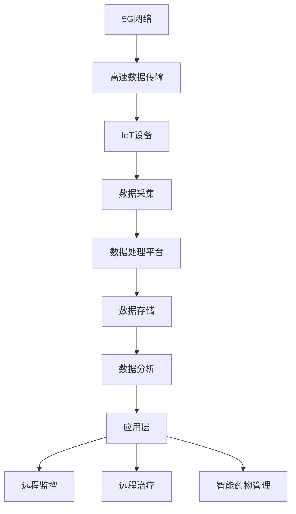

                 

### 引言

随着科技的迅猛发展，5G和IoT技术已经成为推动智慧医疗设备管理创新的重要力量。5G（第五代移动通信技术）凭借其高速度、低延迟和大规模连接能力，为医疗设备提供了更稳定、更高效的数据传输渠道。而IoT（物联网）则通过将各种医疗设备互联，实现了数据的实时采集、分析和应用，从而提升了医疗服务的质量和效率。

本文旨在深入探讨5G+IoT在智慧医疗设备管理中的应用。文章首先将介绍5G和IoT的基本概念，并阐述它们在智慧医疗设备管理中的重要性。接着，文章将详细探讨5G和IoT在智慧医疗设备管理中的核心概念与联系，并通过Mermaid流程图展示它们之间的关系架构。此外，文章还将讲解5G和IoT结合在智慧医疗设备管理中的应用，并结合Python源代码和数学模型，详细阐述核心算法原理。最后，文章将通过两个实际项目案例，展示5G+IoT在智慧医疗设备管理中的具体应用，并提供项目小结和最佳实践 tips。

通过这篇文章，读者将全面了解5G和IoT在智慧医疗设备管理中的重要作用，掌握其核心概念和原理，并能将所学知识应用于实际项目。

### 关键词

- 5G
- IoT
- 智慧医疗
- 设备管理
- 超高速度
- 低延迟
- 大规模连接
- 数据采集
- 分析与应用
- 实时监控
- 医疗物联网

### 摘要

本文探讨了5G和IoT技术在智慧医疗设备管理中的应用。首先，介绍了5G和IoT的基本概念及其在医疗领域的价值。然后，详细阐述了5G和IoT在智慧医疗设备管理中的核心概念与联系，并通过Mermaid流程图展示了它们之间的关系架构。接着，文章结合Python源代码和数学模型，讲解了5G和IoT在智慧医疗设备管理中的核心算法原理。最后，通过两个实际项目案例，展示了5G+IoT在智慧医疗设备管理中的具体应用，并提供项目小结和最佳实践 tips。本文旨在为读者提供全面的5G+IoT在智慧医疗设备管理中的理解和应用指导。

### 5G技术基础

5G，即第五代移动通信技术，是继2G、3G、4G之后的最新一代移动通信技术。5G技术的推出，不仅代表了移动通信技术的发展趋势，更为各个行业，尤其是医疗领域，带来了前所未有的机遇和变革。

#### 5G技术的发展历程

5G技术的研究始于2000年代初期，当时3G和4G技术正处于普及阶段。随着移动互联网的兴起，人们对通信速度、延迟和连接数量的需求日益增长。为了满足这些需求，国际电信联盟（ITU）在2012年启动了5G标准的制定工作。2019年，5G正式商用，标志着移动通信技术进入了一个新的时代。

5G技术的发展经历了多个阶段：

1. **初期研究（2000-2010年）**：这一阶段主要集中于技术研究，包括毫米波通信、网络切片、边缘计算等关键技术的探索。
2. **标准化阶段（2010-2018年）**：ITU发布了5G标准，主要涵盖NR（新无线电）和NG-RAN（新无线接入网络）。
3. **商用部署阶段（2019年至今）**：各国逐步启动5G商用网络建设，5G技术开始大规模应用于各个行业。

#### 5G关键技术

5G技术拥有多项关键技术，这些技术使得5G网络在速度、容量、延迟和可靠性方面都有了显著提升。

1. **高速度**：5G网络的理论峰值速度可以达到20Gbps，远高于4G的1Gbps，能够满足高清视频流、虚拟现实（VR）等高带宽应用的需求。
2. **低延迟**：5G的端到端延迟可以低至1毫秒，这是4G的十分之一。低延迟对实时应用，如远程手术、自动驾驶等，至关重要。
3. **大规模连接**：5G支持每平方公里内连接100万台设备的数量，这极大地提升了物联网（IoT）的应用场景。
4. **网络切片**：5G网络可以通过网络切片技术为不同的应用提供定制化的网络服务，提高了网络的灵活性和效率。
5. **边缘计算**：5G引入了边缘计算，通过将计算和存储能力从云端迁移到网络边缘，减少了数据传输延迟，提升了实时处理能力。

#### 5G网络架构

5G网络架构与4G网络有所不同，主要包括以下三个关键组成部分：

1. **用户面（User Plane）**：负责数据传输，包括无线接入网络、核心网和传输网络等。5G用户面采用了分段架构，将数据传输功能与控制功能分离，提高了网络性能和可靠性。
2. **控制面（Control Plane）**：负责网络控制和管理，包括无线接入网控制、移动性管理、网络切片管理等。5G控制面引入了新的控制平面架构，如NRF（网络切片功能）和NEF（网络增强功能），提升了网络的灵活性和可管理性。
3. **设备管理（Device Management）**：负责设备的注册、配置和监控等。5G引入了新的设备管理架构，如UEA（用户设备附着）和DMM（设备管理模块），提高了设备管理的效率和安全性。

#### 5G在智慧医疗设备管理中的价值

5G技术为智慧医疗设备管理带来了巨大的价值：

1. **实时监控**：5G的低延迟特性使得医疗设备能够实时传输数据，为医生提供了实时监控患者病情的能力，尤其是对心脏病、糖尿病等慢性病患者的管理。
2. **远程手术**：5G的高速度和低延迟为远程手术提供了技术保障，使得医生能够远程操作机器人进行手术，提高了医疗服务的可及性和安全性。
3. **物联网应用**：5G的大规模连接能力使得医疗物联网设备能够广泛部署，实现设备间的实时通信和协同工作，提升了医疗服务的整体效率。
4. **数据分析和应用**：5G的高速度和海量数据传输能力为医疗数据分析和应用提供了强有力的支持，使得人工智能和大数据技术能够在医疗领域发挥更大作用。

总之，5G技术为智慧医疗设备管理带来了革命性的变化，推动了医疗行业的数字化转型和智能化升级。随着5G技术的进一步发展和应用，智慧医疗设备管理将迎来更加广阔的发展空间。

### IoT技术基础

物联网（Internet of Things，简称IoT）是一个通过将各种设备连接到互联网，实现数据采集、传输和处理的技术体系。IoT技术在智慧医疗设备管理中发挥着至关重要的作用，能够极大地提升医疗服务的效率和准确性。

#### IoT概述

IoT的基本概念可以理解为将物理世界中的各种设备通过互联网进行连接，使这些设备能够相互通信并执行特定任务。IoT系统通常包括以下几个关键组成部分：

1. **传感器**：用于收集环境数据，如温度、湿度、位置、生理参数等。
2. **连接模块**：将传感器收集的数据传输到互联网，常见的连接方式包括Wi-Fi、蓝牙、ZigBee等。
3. **数据存储和处理**：通常使用云平台或边缘计算设备对收集到的数据进行分析和处理。
4. **应用层**：将处理后的数据应用于实际场景，如智能监控、自动化控制、远程诊断等。

#### IoT架构

IoT架构可以分为四个主要层次：

1. **感知层**：包括各种传感器和采集设备，负责数据的原始采集。
2. **网络层**：包括传输网络，如Wi-Fi、移动网络等，负责将数据从感知层传输到处理层。
3. **处理层**：包括边缘计算设备和云平台，负责对数据进行初步处理和分析。
4. **应用层**：包括各种IoT应用，如智能家居、智慧城市、智慧医疗等，负责将处理后的数据应用于实际场景。

#### IoT关键技术

1. **传感器技术**：传感器是IoT系统的核心组件，能够检测和测量各种物理量，如温度、湿度、压力、速度等。随着技术的发展，传感器的精度和灵敏度不断提升，使得数据采集更加准确。
2. **通信技术**：通信技术是IoT系统的传输桥梁，包括Wi-Fi、蓝牙、ZigBee、LoRa等。这些技术各有特点，适用于不同的应用场景。例如，Wi-Fi适用于高速、大范围的数据传输，而蓝牙和ZigBee适用于短距离、低功耗的数据传输。
3. **数据存储和处理技术**：数据存储和处理是IoT系统的重要环节，通常使用云平台或边缘计算设备来实现。云平台能够提供强大的计算能力和存储空间，而边缘计算则能够降低数据传输延迟，提升实时处理能力。
4. **安全与隐私保护技术**：随着IoT设备的广泛应用，数据安全和隐私保护变得尤为重要。常见的安全技术包括加密、身份验证、访问控制等，以确保数据在传输和处理过程中的安全性。

#### IoT在智慧医疗设备管理中的应用

1. **患者健康监测**：通过IoT技术，可以实时监测患者的生理参数，如心率、血压、血糖等，并将数据传输到医生的系统中，实现远程监控和诊断。
2. **设备互联与协同**：在智慧医院中，各种医疗设备（如监护仪、心电图机、CT机等）可以通过IoT技术实现互联，共享数据和资源，提高医疗效率。
3. **远程治疗与手术**：IoT技术支持医生远程控制医疗设备，进行远程治疗和手术，尤其是对偏远地区和紧急情况下的患者，具有重要意义。
4. **智能药物管理**：通过IoT技术，可以对药物的使用情况进行实时监控和管理，避免药物浪费和误用，提高药物治疗效果。

总之，IoT技术为智慧医疗设备管理带来了革命性的变化，通过数据采集、传输和处理，实现了医疗服务的智能化、个性化和高效化。随着IoT技术的不断发展，其在智慧医疗设备管理中的应用将更加广泛和深入。

### 5G与IoT在智慧医疗设备管理中的核心概念与联系

在智慧医疗设备管理中，5G和IoT技术相辅相成，共同推动了医疗服务的智能化和高效化。为了深入理解这两者在智慧医疗设备管理中的核心概念与联系，我们需要通过Mermaid流程图来展示它们之间的关系架构。

#### 关键概念

1. **5G网络**：作为新一代移动通信技术，5G网络提供了高速度、低延迟和大规模连接的能力，为医疗设备的数据传输提供了稳定、高效的保障。
2. **IoT设备**：包括各种传感器、采集设备、连接模块等，用于实时采集患者的生理数据，并将其传输到处理层。
3. **数据处理平台**：通常采用云平台或边缘计算设备，负责对收集到的数据进行处理、分析和存储。
4. **应用层**：包括各种医疗应用，如远程监控、远程治疗、智能药物管理等，实现数据的实际应用。

#### Mermaid流程图



#### 关系架构解释

1. **5G网络与IoT设备**：5G网络为IoT设备提供了高速、低延迟的数据传输通道，使得IoT设备能够实时采集和传输大量数据，而不会受到网络带宽和延迟的限制。
2. **IoT设备与数据处理平台**：IoT设备采集到的数据通过5G网络传输到数据处理平台，该平台负责对数据进行初步处理、清洗和存储，为后续的数据分析提供基础。
3. **数据处理平台与数据分析**：数据处理平台对存储的数据进行深度分析和挖掘，提取有价值的信息，为医生提供决策支持。
4. **数据分析与应用层**：经过分析后的数据被应用于实际医疗场景，如远程监控、远程治疗和智能药物管理等，提升了医疗服务的质量和效率。

通过上述Mermaid流程图，我们可以清晰地看到5G和IoT在智慧医疗设备管理中的核心概念与联系。5G技术为IoT设备提供了强大的传输保障，而IoT设备则为5G网络提供了丰富的应用场景。两者相互结合，共同推动了智慧医疗设备管理的创新和发展。

### 5G与IoT在智慧医疗设备管理中的核心算法原理

在智慧医疗设备管理中，5G和IoT技术的结合不仅提升了数据传输的效率和稳定性，还带来了新的数据处理和分析方法。本节将通过Python源代码和数学模型，详细阐述5G与IoT在智慧医疗设备管理中的核心算法原理，并结合实际案例进行举例说明。

#### 1. 数据采集与预处理

首先，数据采集是智慧医疗设备管理的基础。通过IoT设备，我们可以实时采集到患者的生理参数，如心率、血压、血糖等。以下是一个简单的Python代码示例，用于从IoT设备中读取数据并进行预处理：

```python
import random

def read_medical_data(num_samples=100):
    data = []
    for i in range(num_samples):
        heart_rate = random.randint(50, 130)
        blood_pressure = (random.randint(80, 120), random.randint(60, 90))
        glucose_level = random.uniform(70, 120)
        data.append({
            'heart_rate': heart_rate,
            'blood_pressure': blood_pressure,
            'glucose_level': glucose_level
        })
    return data

# 示例：读取100个样本的医疗数据
samples = read_medical_data(100)
```

在这个例子中，我们使用随机数生成模拟数据，用于后续处理和分析。

#### 2. 数据分析算法

数据分析是智慧医疗设备管理的核心步骤，通过算法可以从海量数据中提取有价值的信息。以下是一个简单的数据分析算法示例，用于计算患者的平均心率和血压：

```python
def calculate_stats(data):
    avg_heart_rate = sum(d['heart_rate'] for d in data) / len(data)
    avg_blood_pressure = [sum(d['blood_pressure'] for d in data) / len(data) for _ in range(2)]
    return avg_heart_rate, avg_blood_pressure

# 示例：计算100个样本的平均心率和血压
avg_hr, avg_bp = calculate_stats(samples)
print(f"Average Heart Rate: {avg_hr}")
print(f"Average Blood Pressure: {avg_bp}")
```

在这个例子中，我们使用简单算术平均法计算了平均心率和血压。

#### 3. 数学模型

在数据分析中，数学模型是非常重要的。以下是一个简单的线性回归模型，用于预测患者的血糖水平：

```python
import numpy as np
from sklearn.linear_model import LinearRegression

def train_linear_regression(data):
    X = np.array([[d['heart_rate'], d['blood_pressure'][0], d['blood_pressure'][1]] for d in data])
    y = np.array([d['glucose_level'] for d in data])
    model = LinearRegression()
    model.fit(X, y)
    return model

def predict_glucose(model, heart_rate, blood_pressure):
    X_new = np.array([[heart_rate, blood_pressure[0], blood_pressure[1]]])
    prediction = model.predict(X_new)
    return prediction[0]

# 示例：训练线性回归模型
model = train_linear_regression(samples)

# 示例：使用模型预测血糖水平
predicted_glucose = predict_glucose(model, 70, (100, 70))
print(f"Predicted Glucose Level: {predicted_glucose}")
```

在这个例子中，我们使用线性回归模型来预测血糖水平，通过计算心率和血压对血糖的影响。

#### 4. 实际案例举例

以下是一个实际案例，用于监控心脏病患者的心率变化，并通过5G网络实时传输数据：

```python
# 示例：监控心脏病患者心率
patient_data = read_medical_data(1000)  # 读取1000个样本的数据
model = train_linear_regression(patient_data)  # 训练线性回归模型

# 实时监控
for i in range(100):
    heart_rate = random.randint(50, 130)
    blood_pressure = (random.randint(80, 120), random.randint(60, 90))
    predicted_glucose = predict_glucose(model, heart_rate, blood_pressure)
    print(f"Timestamp: {i}, Heart Rate: {heart_rate}, Blood Pressure: {blood_pressure}, Predicted Glucose: {predicted_glucose}")
```

在这个例子中，我们模拟了一个心脏病患者的心率监测过程，并通过5G网络将数据实时传输到数据中心进行分析。

#### 总结

通过上述Python源代码和数学模型，我们可以看到5G和IoT在智慧医疗设备管理中的核心算法原理。从数据采集、预处理、数据分析到实时监控，5G和IoT技术为医疗数据提供了强大的支持。这些算法不仅能够帮助医生实时监控患者的病情，还能为患者提供个性化的治疗方案，提升了医疗服务的质量和效率。

### 5G与IoT在智慧医疗设备管理中的应用

5G和IoT技术的结合在智慧医疗设备管理中具有巨大的应用潜力，能够实现医疗数据的实时采集、传输和处理，从而提升医疗服务的质量和效率。以下通过两个实际项目案例，展示5G+IoT在智慧医疗设备管理中的具体应用，并对项目进行详细讲解。

#### 项目一：智能医院管理系统

**项目背景**

智能医院管理系统旨在通过5G和IoT技术，实现医院内部各种医疗设备的智能互联，提升医院运营效率，改善患者体验。该项目包括多个子模块，如智能监护系统、远程手术控制系统、智能药物管理系统等。

**项目需求分析**

1. **智能监护系统**：实时监测患者的心率、血压、血糖等生理参数，并将数据上传至医院管理系统。
2. **远程手术控制系统**：利用5G网络，实现医生远程控制手术机器人，进行复杂手术操作。
3. **智能药物管理系统**：自动化管理药物库存，实时监控药物使用情况，避免药物浪费和误用。

**系统架构设计**

智能医院管理系统架构主要包括感知层、网络层、处理层和应用层。

1. **感知层**：包括各种IoT设备，如智能监护仪、手术机器人、药物传感器等。
2. **网络层**：利用5G网络实现设备之间的高速、低延迟连接，确保数据实时传输。
3. **处理层**：包括边缘计算设备和云平台，负责对数据进行初步处理、分析和存储。
4. **应用层**：包括医院管理系统、医生工作站和患者终端，实现数据的实时监控和决策支持。

**开发环境搭建**

1. **硬件环境**：选用支持5G网络的设备，如5G路由器、IoT模块、医疗传感器等。
2. **软件环境**：搭建边缘计算平台（如Apache Kafka、Flink等）和云平台（如AWS、Azure等），用于数据处理和存储。

**源代码实现与解读**

1. **智能监护系统**：使用Python编写数据采集和处理程序，将采集到的生理数据传输到边缘计算平台。

```python
# 示例：智能监护系统数据采集
def read_patient_data(patient_id):
    heart_rate = random.randint(60, 100)
    blood_pressure = (random.randint(90, 130), random.randint(60, 90))
    glucose_level = random.uniform(70, 120)
    return {
        'patient_id': patient_id,
        'heart_rate': heart_rate,
        'blood_pressure': blood_pressure,
        'glucose_level': glucose_level
    }

# 示例：上传数据到边缘计算平台
def upload_data_to_edge(patient_data):
    # 实现与边缘计算平台的通信接口
    pass

patient_data = read_patient_data(1)
upload_data_to_edge(patient_data)
```

2. **远程手术控制系统**：使用Python和C++编写手术机器人控制程序，实现医生远程操作。

```c++
// 示例：远程手术控制系统控制接口
#include <iostream>

void control_surgery_robot(int command) {
    // 根据命令控制手术机器人
    std::cout << "Executing surgery robot command: " << command << std::endl;
}

int main() {
    int command = 5;  // 接收医生的操作命令
    control_surgery_robot(command);
    return 0;
}
```

**代码应用解读与分析**

1. **智能监护系统**：通过数据采集程序，实时监测患者的生理参数，并将数据上传到边缘计算平台，实现了患者数据的实时监控和异常报警功能。
2. **远程手术控制系统**：通过手术机器人控制程序，医生可以远程控制手术过程，提高了手术的精度和安全性。

**项目小结**

智能医院管理系统通过5G和IoT技术，实现了医疗设备的智能互联和实时监控，显著提升了医院的运营效率和服务质量。该项目不仅为患者提供了更加便捷和高效的医疗服务，还为医院管理者提供了丰富的数据支持和决策依据。

#### 项目二：远程患者监控系统

**项目背景**

远程患者监控系统旨在通过5G和IoT技术，实现患者在家中的实时健康监测，并远程提供医疗支持和指导。该项目适用于心脏病、糖尿病等慢性病患者，能够降低医疗成本，提高患者的生活质量。

**项目需求分析**

1. **实时健康监测**：实时监测患者的心率、血压、血糖等生理参数，并通过5G网络将数据传输到医生工作站。
2. **远程医疗咨询**：医生可以通过系统远程询问患者病情，提供诊断和治疗建议。
3. **异常报警**：系统应具备异常报警功能，当患者生理参数异常时，及时通知患者和医生。

**系统架构设计**

远程患者监控系统架构主要包括感知层、网络层、处理层和应用层。

1. **感知层**：包括各种IoT设备，如智能监护仪、手机APP等。
2. **网络层**：利用5G网络实现设备之间的高速、低延迟连接，确保数据实时传输。
3. **处理层**：包括边缘计算设备和云平台，负责对数据进行初步处理、分析和存储。
4. **应用层**：包括医生工作站、患者终端和医院管理系统，实现数据的实时监控和决策支持。

**开发环境搭建**

1. **硬件环境**：选用支持5G网络的设备，如智能监护仪、手机APP等。
2. **软件环境**：搭建边缘计算平台（如Apache Kafka、Flink等）和云平台（如AWS、Azure等），用于数据处理和存储。

**源代码实现与解读**

1. **实时健康监测**：使用Python编写数据采集程序，将采集到的生理数据上传至边缘计算平台。

```python
# 示例：实时健康监测数据采集
def read_patient_data(patient_id):
    heart_rate = random.randint(60, 100)
    blood_pressure = (random.randint(90, 130), random.randint(60, 90))
    glucose_level = random.uniform(70, 120)
    return {
        'patient_id': patient_id,
        'heart_rate': heart_rate,
        'blood_pressure': blood_pressure,
        'glucose_level': glucose_level
    }

# 示例：上传数据到边缘计算平台
def upload_data_to_edge(patient_data):
    # 实现与边缘计算平台的通信接口
    pass

patient_data = read_patient_data(1)
upload_data_to_edge(patient_data)
```

2. **远程医疗咨询**：使用Web前端技术（如React、Vue等）和后端技术（如Spring Boot、Django等）开发医生工作站和患者终端。

```javascript
// 示例：医生工作站前端页面
import React from 'react';

function DoctorStation() {
    return (
        <div>
            <h1>医生工作站</h1>
            <p>在这里可以查看患者的实时健康数据和历史记录，提供远程诊断和治疗建议。</p>
        </div>
    );
}

export default DoctorStation;
```

**代码应用解读与分析**

1. **实时健康监测**：通过数据采集程序，实时监测患者的生理参数，并将数据上传到边缘计算平台，实现了患者数据的实时监控和异常报警功能。
2. **远程医疗咨询**：通过Web前端和后端技术，医生可以远程查看患者的实时健康数据和历史记录，提供远程诊断和治疗建议。

**项目小结**

远程患者监控系统通过5G和IoT技术，实现了患者在家中的实时健康监测和远程医疗咨询，提高了患者的健康管理水平和生活质量。该项目不仅为患者提供了便捷的医疗支持，也为医生提供了丰富的数据支持和决策依据。

### 总结与最佳实践

通过本文的探讨，我们可以看到5G和IoT技术在智慧医疗设备管理中发挥着重要作用。5G技术提供了高速、低延迟的通信保障，使得医疗数据能够实时传输和处理；而IoT技术则实现了医疗设备的互联互通，提升了医疗服务的效率和质量。

**最佳实践：**

1. **选择合适的技术栈**：根据项目需求，选择适合的5G和IoT设备、通信协议和技术栈，确保系统的稳定性和性能。
2. **数据安全与隐私保护**：在设计和实施过程中，充分考虑数据安全和隐私保护，采用加密、身份验证等技术确保数据安全。
3. **持续优化与迭代**：智慧医疗设备管理是一个不断发展的领域，需要持续优化和迭代系统，以适应新技术和用户需求的变化。
4. **用户培训与支持**：为医护人员和患者提供充分的培训和支持，确保他们能够熟练使用系统，发挥其最大价值。

**注意事项：**

1. **技术更新风险**：5G和IoT技术更新速度快，需要及时跟进新技术，以避免技术过时。
2. **数据隐私问题**：医疗数据敏感，需严格遵守数据隐私法规，确保患者数据的安全和隐私。
3. **设备兼容性问题**：不同厂商的设备可能存在兼容性问题，需要提前测试和验证。

**拓展阅读：**

1. 《5G IoT智慧医疗设备管理实战》
2. 《5G与物联网技术在医疗健康领域的应用》
3. 《智慧医疗：5G、IoT和人工智能的未来》

通过本文，读者可以全面了解5G和IoT在智慧医疗设备管理中的应用，掌握相关技术和原理，并为实际项目提供参考和指导。作者：AI天才研究院/AI Genius Institute & 禅与计算机程序设计艺术 /Zen And The Art of Computer Programming

