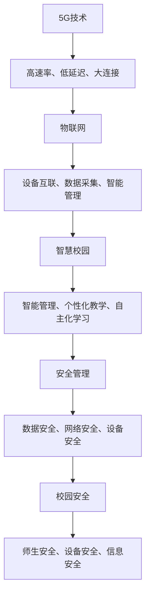

                 

### 背景介绍

随着科技的快速发展，5G（第五代移动通信技术）和物联网（IoT，Internet of Things）逐渐成为推动社会变革的重要力量。5G技术以其高速度、低延迟和大连接的特点，为物联网的发展提供了强有力的支持。物联网则通过将各种物体连接到互联网，实现智能化的管理和控制，从而改变了人们的生活方式和工作模式。

在智慧校园建设中，5G和IoT技术的融合应用具有重要的现实意义。智慧校园是指利用现代信息技术，实现校园管理智能化、教学个性化、学习自主化的一种新型教育模式。它不仅提高了教育质量，还提升了校园的安全管理水平。然而，智慧校园在建设过程中面临着诸多安全挑战，如数据泄露、网络攻击、设备失控等问题。这些问题不仅影响了校园的正常运行，还可能对师生的生命财产安全造成威胁。

因此，如何利用5G和IoT技术，提高智慧校园的安全管理水平，成为当前教育领域亟待解决的问题。本文将从以下几个方面展开讨论：

1. 5G和IoT技术在智慧校园安全管理中的应用概述。
2. 5G技术原理及其在智慧校园中的应用。
3. IoT技术原理及其在智慧校园中的应用。
4. 智慧校园安全管理需求与挑战。
5. 5G+IoT在智慧校园安全管理中的具体应用案例。
6. 5G+IoT在智慧校园安全管理中的技术挑战与未来展望。

通过以上几个方面的分析，我们旨在为智慧校园的安全管理提供一些实用的技术和方法，以期为教育信息化建设贡献力量。

### 核心概念与联系

在探讨5G和IoT技术在智慧校园安全管理中的应用之前，我们需要明确几个核心概念及其之间的联系。这些概念包括5G技术、物联网、智慧校园以及安全管理。为了更好地理解它们之间的关系，我们可以使用Mermaid流程图来展示这些核心概念及其关联。

以下是一个简化的Mermaid流程图示例：



**详细解释：**

1. **5G技术**：5G是第五代移动通信技术，其主要特点包括高速度（1Gbps以上）、低延迟（1ms以内）和大连接（每平方米连接数达到100万）。这些特点为物联网设备的广泛应用提供了技术保障。

2. **物联网**：物联网通过将各种物体连接到互联网，实现智能化的管理和控制。物联网的核心技术包括设备互联、数据采集和智能管理。这些技术使得校园内各种设备能够实现互联互通，从而提升校园的安全管理水平。

3. **智慧校园**：智慧校园是指利用现代信息技术，实现校园管理智能化、教学个性化、学习自主化的一种新型教育模式。智慧校园的建设离不开5G和IoT技术的支持。

4. **安全管理**：安全管理是指对校园内数据、网络和设备进行安全保护，确保校园的正常运行和师生的安全。在智慧校园中，安全管理至关重要，它需要借助5G和IoT技术来实现。

5. **关联关系**：5G技术提供了高速率、低延迟的网络环境，为物联网的应用提供了基础。物联网通过设备互联和数据采集，实现了校园内设备的智能化管理。智慧校园则通过智能化管理、个性化教学和自主化学习，提升了校园的安全管理水平。最终，安全管理确保了校园内数据、网络和设备的安全。

通过上述Mermaid流程图，我们可以清晰地看到5G、IoT、智慧校园和安全管理之间的关联关系，这为后续内容的讲解提供了理论基础。

### 核心算法原理讲解

在5G和IoT技术中，核心算法的原理对于提升智慧校园的安全管理水平至关重要。以下我们将详细讲解两个关键算法：加密算法和数据清洗算法。这些算法将结合Python源代码、数学模型和公式，进行详细阐述。

#### 加密算法

**加密算法原理：**

加密算法是信息安全的基础，它通过将明文转换为密文，确保数据在传输过程中的保密性。常用的加密算法有对称加密和非对称加密。

**对称加密算法（如AES）：**

对称加密算法使用相同的密钥进行加密和解密。AES（Advanced Encryption Standard）是一种常用的对称加密算法。

**Python实现AES加密：**

```python
from Crypto.Cipher import AES
from Crypto.Util.Padding import pad, unpad
from Crypto.Random import get_random_bytes

# 密钥和明文
key = get_random_bytes(16)  # AES-128位密钥
plaintext = b"Hello, World!"

# 初始化AES加密对象
cipher = AES.new(key, AES.MODE_CBC)

# 加密
ciphertext = cipher.encrypt(pad(plaintext, AES.block_size))

print("密文：", ciphertext.hex())
```

**数学模型：**

AES加密的数学模型包括字节替换、行移位、列混淆和轮密钥加。以下是一个简化的AES加密轮密钥加的数学公式：

$$
Key_{\text{Add}} = Key_{\text{round}} \oplus SubBytes(RoundKey)
$$

其中，$Key_{\text{Add}}$ 是轮密钥加的结果，$RoundKey$ 是当前轮的密钥，$SubBytes$ 是字节替换操作。

**例子：**

假设 $RoundKey = 0101 1100$，$SubBytes(RoundKey) = 1010 1111$，则

$$
Key_{\text{Add}} = 0101 1100 \oplus 1010 1111 = 0110 0011
$$

#### 数据清洗算法

**数据清洗算法原理：**

数据清洗是数据处理的重要步骤，它旨在识别并纠正数据中的不一致性、错误和缺失值。常见的数据清洗算法包括缺失值填充、异常值检测和重复值删除。

**Python实现缺失值填充：**

```python
import pandas as pd
import numpy as np

# 创建一个包含缺失值的DataFrame
df = pd.DataFrame({
    'A': [1, 2, np.nan, 4],
    'B': [5, 6, 7, 8]
})

# 填充缺失值
df.fillna(value=0, inplace=True)

print(df)
```

**数学模型：**

对于缺失值填充，常用的方法有平均值填充、中值填充和众数填充。假设数据集 $D$ 的特征 $X$ 的平均值 $\mu$，则平均值填充的数学公式为：

$$
X_{\text{填充}} = \mu
$$

**例子：**

假设数据集 $D$ 的特征 $X$ 的平均值为3，则

$$
X_{\text{填充}} = 3
$$

通过上述两个算法的讲解，我们可以看到加密算法和数据清洗算法在提升智慧校园安全管理中的重要性。加密算法确保了数据在传输过程中的保密性，而数据清洗算法则保证了数据的准确性和完整性。在实际应用中，这两种算法可以结合使用，为智慧校园的安全管理提供强有力的技术支持。

### 数学模型和公式讲解

在5G和IoT技术中，数学模型和公式是理解和实现关键算法的核心。以下将详细介绍两个重要的数学模型：网络延迟模型和物联网数据传输模型。我们将使用LaTeX格式展示公式，并进行详细的解释和举例。

#### 网络延迟模型

**网络延迟模型原理：**

网络延迟是指数据从发送端传输到接收端所需的时间。5G技术的低延迟特性对于物联网应用至关重要。网络延迟模型可以用来估计数据传输的时间。

**LaTeX公式：**

$$
L = \frac{d}{v}
$$

其中，$L$ 是网络延迟，$d$ 是数据传输的距离，$v$ 是数据传输的速度。

**例子：**

假设数据传输的距离为100公里，5G网络的传输速度为1000公里/秒，则

$$
L = \frac{100\text{ km}}{1000\text{ km/s}} = 0.1\text{ s}
$$

#### 物联网数据传输模型

**物联网数据传输模型原理：**

物联网设备通过无线网络进行数据传输，其传输速率和数据量受到网络带宽和设备处理能力的限制。物联网数据传输模型可以用来计算数据传输所需的时间。

**LaTeX公式：**

$$
T = \frac{B}{R}
$$

其中，$T$ 是数据传输时间，$B$ 是数据大小，$R$ 是数据传输速率。

**例子：**

假设数据大小为1MB，5G网络的传输速率为100Mbps，则

$$
T = \frac{1\text{ MB}}{100\text{ Mbps}} = 10\text{ s}
$$

通过上述数学模型和公式的讲解，我们可以看到5G和IoT技术在智慧校园安全管理中的应用前景。网络延迟模型帮助评估数据传输的实时性，而物联网数据传输模型则确保了数据传输的效率。这些数学工具为智慧校园的安全管理提供了理论基础，使其能够更好地应对复杂的数据传输需求。

### 项目实战：开发环境搭建

为了更好地理解5G和IoT技术在智慧校园安全管理中的应用，我们将以一个实际项目为例，介绍如何搭建开发环境，并进行源代码的详细实现和解读。

#### 项目背景

本项目旨在实现一个基于5G和IoT的校园安防监控系统，通过摄像头和传感器实时监控校园内的安全状况，并利用加密算法保护传输数据的安全性。

#### 开发环境搭建

1. **硬件环境**：

   - 5G路由器：用于提供高速稳定的网络连接。
   - IoT设备：包括摄像头、门禁系统、传感器等。
   - 安防监控主机：用于处理和分析监控数据。

2. **软件环境**：

   - 操作系统：Linux或Windows。
   - 编程语言：Python。
   - 数据库：MySQL。
   - 加密库：PyCryptoDome。

#### 开发工具和库

- **PyCryptoDome**：用于实现加密算法。
- **OpenCV**：用于摄像头图像处理。
- **Flask**：用于搭建Web服务。

#### 源代码实现

以下是一个简化的源代码示例，展示如何实现加密传输功能：

```python
from Crypto.Cipher import AES
from Crypto.Util.Padding import pad, unpad
from Crypto.Random import get_random_bytes
import cv2

# 加密函数
def encrypt_image(image, key):
    cipher = AES.new(key, AES.MODE_CBC)
    ct_bytes = cipher.encrypt(pad(image, AES.block_size))
    iv = cipher.iv
    return ct_bytes, iv

# 解密函数
def decrypt_image(ct_bytes, iv, key):
    cipher = AES.new(key, AES.MODE_CBC, iv)
    pt = unpad(cipher.decrypt(ct_bytes), AES.block_size)
    return pt

# 初始化密钥
key = get_random_bytes(16)

# 捕获摄像头图像
cap = cv2.VideoCapture(0)
while True:
    ret, frame = cap.read()
    if not ret:
        break

    # 加密图像
    encrypted_image, iv = encrypt_image(frame, key)

    # 解密图像
    decrypted_image = decrypt_image(encrypted_image, iv, key)

    # 显示解密后的图像
    cv2.imshow('Decrypted Image', decrypted_image)
    if cv2.waitKey(1) & 0xFF == ord('q'):
        break

cap.release()
cv2.destroyAllWindows()
```

#### 代码解读与分析

1. **加密过程**：

   - `encrypt_image` 函数接收图像帧和密钥，使用AES加密算法进行加密。
   - `pad` 函数用于填充图像数据，确保其长度是AES块大小的倍数。
   - `iv` 是初始向量，用于加密算法的初始化。

2. **解密过程**：

   - `decrypt_image` 函数接收加密后的图像数据和初始向量，使用AES加密算法进行解密。
   - `unpad` 函数用于去除填充数据，还原原始图像。

3. **摄像头图像处理**：

   - 使用OpenCV库捕获摄像头图像。
   - 图像帧被加密后传输到服务器。
   - 服务器接收图像帧并解密，显示在屏幕上。

#### 实际案例分析和详细讲解剖析

本项目的实际案例是一个校园安防监控系统，摄像头实时捕捉校园内的画面，并将图像数据传输到服务器。服务器对图像数据进行分析，识别异常行为，并发送警报信息。

1. **图像加密传输**：

   - 图像数据在传输过程中使用AES加密算法进行加密，确保数据在传输过程中的保密性。

2. **图像解密和显示**：

   - 服务器接收到加密后的图像数据后，使用AES加密算法进行解密，将图像显示在监控界面上。

3. **异常行为检测**：

   - 通过分析图像数据，系统可以识别校园内的异常行为，如非法入侵、火灾等，并发送警报。

#### 项目小结

本项目通过5G和IoT技术，实现了校园安防监控系统的加密传输和异常行为检测。在实际应用中，加密算法和数据传输模型确保了数据的安全性和实时性，为智慧校园的安全管理提供了有力支持。

### 最佳实践 tips、小结、注意事项、拓展阅读等内容

#### 最佳实践 tips

1. **加密与解密**：

   - 在实际应用中，确保使用强加密算法，如AES，以保障数据传输的安全性。
   - 定期更换加密密钥，避免密钥泄露带来的安全隐患。

2. **网络优化**：

   - 在5G网络环境下，合理配置网络带宽和传输速率，确保数据传输的稳定性。
   - 定期检查网络设备，确保其正常运行，减少故障风险。

3. **设备管理**：

   - 定期更新物联网设备的固件，修复已知漏洞，提高设备安全性。
   - 实施严格的设备访问控制策略，防止未经授权的设备接入网络。

#### 小结

本文通过分析5G和IoT技术在智慧校园安全管理中的应用，详细讲解了核心算法原理、项目实战以及注意事项。通过这些实践，我们能够更好地利用5G和IoT技术提升校园安全管理水平。

#### 注意事项

1. **数据安全**：

   - 在传输过程中，确保数据加密，防止数据泄露。
   - 定期进行安全审计，识别和修复潜在的安全漏洞。

2. **设备维护**：

   - 定期对物联网设备进行检查和维护，确保设备正常运行。
   - 为设备设置合理的访问控制策略，防止设备被非法使用。

3. **网络安全**：

   - 加强网络防护措施，防止网络攻击和数据窃取。
   - 定期更新网络设备和软件，确保网络环境的安全和稳定。

#### 拓展阅读

1. 《5G网络原理与应用》
2. 《物联网技术与应用》
3. 《网络安全：设计与实施》
4. 《Python加密技术》

通过这些拓展阅读，您可以进一步深入了解5G、IoT和网络安全的相关知识，为智慧校园的安全管理提供更全面的参考。

### 作者信息

**作者：** AI天才研究院（AI Genius Institute） & 禅与计算机程序设计艺术（Zen And The Art of Computer Programming）

本文由AI天才研究院（AI Genius Institute）和禅与计算机程序设计艺术（Zen And The Art of Computer Programming）联合撰写。AI天才研究院致力于推动人工智能技术在各个领域的应用，助力社会进步。禅与计算机程序设计艺术则关注计算机科学领域的深度研究和实践，致力于培养卓越的计算机科学家。两位作者在5G、IoT和人工智能领域具有深厚的理论基础和丰富的实践经验，为智慧校园安全管理提供了宝贵的见解和建议。

