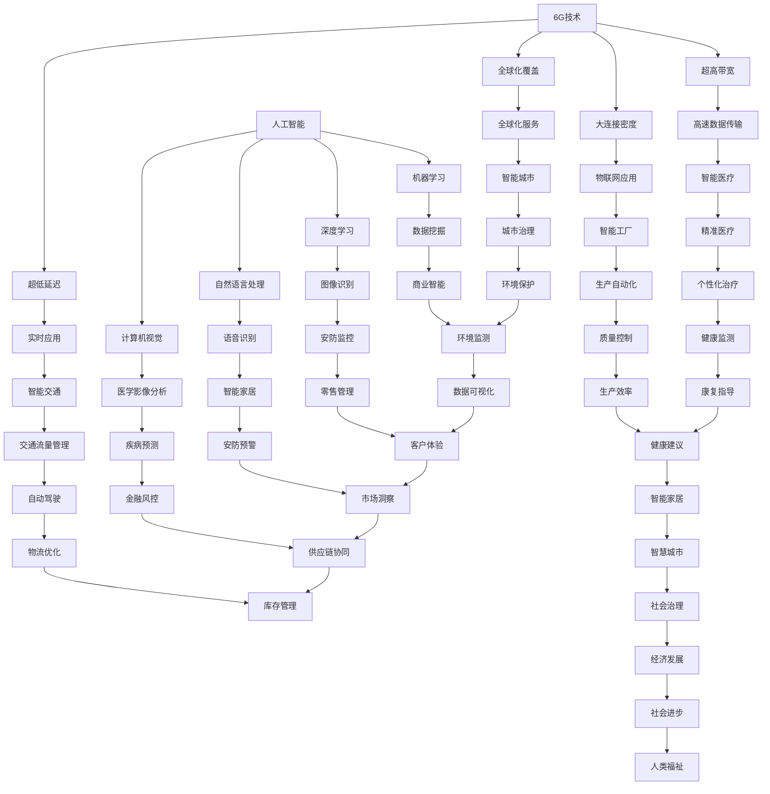

                 

## 6G+人工智能：未来通信网络的智能化展望

### 关键词：
6G技术、人工智能、通信网络、智能化、未来展望

### 摘要：
本文深入探讨了6G技术与人工智能的结合，以及这种结合对未来通信网络的智能化发展所带来的巨大变革。首先，我们介绍了6G技术和人工智能的基本概念，并分析了它们在通信网络中的应用前景。接着，本文详细阐述了6G与人工智能结合的核心技术，包括网络切片、边缘计算和智能网络管理。随后，通过具体的应用案例，展示了6G+人工智能在智能交通、智能医疗和智能工厂等领域的实际应用。最后，本文对6G+人工智能的未来发展趋势进行了展望，并提出了面临的挑战和解决方案。

### 引言

#### 6G技术概述

6G（第六代移动通信技术）是未来通信网络发展的重要方向，它旨在提供比5G更高速、更稳定、更智能的网络服务。6G技术的关键特性包括超低延迟、超高带宽、大连接密度和全球化覆盖。这些特性使得6G能够满足未来物联网、自动驾驶、虚拟现实等新兴应用场景的需求。6G技术的发展历程可以追溯到2000年代中期，随着5G技术的成熟，6G的研究和开发也逐渐提上日程。

#### 人工智能概述

人工智能（AI）是计算机科学的一个分支，旨在使计算机系统具备人类智能的某些特征，如学习、推理、感知和自我修正等。人工智能的发展可以追溯到20世纪50年代，随着计算能力和数据资源的不断提升，人工智能技术得到了快速发展。如今，人工智能已经成为推动社会进步和经济发展的重要力量，其应用领域涵盖了自然语言处理、计算机视觉、机器学习等。

#### 6G与人工智能结合的重要性

6G与人工智能的结合将开启通信网络智能化的新时代。首先，人工智能技术可以优化6G网络的资源分配和管理，提高网络效率和性能。其次，6G的高速和低延迟特性为人工智能算法的实时应用提供了基础，使得智能应用能够在网络边缘进行实时处理和响应。此外，6G+人工智能的结合还将推动智能交通、智能医疗、智能工厂等领域的创新，为社会带来更多的便利和福祉。

### 6G技术概述

#### 6G技术的发展历程

6G技术的发展可以追溯到2000年代中期，当时国际电信联盟（ITU）提出了IMT-2020（5G）的目标，即到2020年实现全球覆盖、超高速率和低延迟的移动通信网络。随着5G技术的成熟，6G的研究和开发也逐渐提上日程。近年来，国内外各大通信技术和互联网企业纷纷投入大量资源进行6G技术的研发，预计到2030年左右6G将逐步实现商用。

#### 6G技术的关键特性

6G技术的关键特性包括：

1. **超低延迟**：6G的目标是实现毫秒级的通信延迟，这将极大地提升实时应用的用户体验。
2. **超高带宽**：6G将提供比5G更高的数据传输速率，达到每秒数Gbps甚至更高。
3. **大连接密度**：6G能够支持每平方米数百甚至数千的连接设备，满足未来物联网的需求。
4. **全球化覆盖**：6G将实现更广泛的覆盖范围，包括海洋、空中和地下等复杂环境。

#### 6G技术的核心关键技术

6G技术的核心关键技术包括：

1. **多接入技术**：6G将采用多种接入技术，包括光纤、毫米波、太赫兹等，以实现高速率和低延迟的通信。
2. **网络切片技术**：网络切片是6G的重要特性之一，它可以根据不同应用场景提供定制化的网络服务。
3. **边缘计算技术**：边缘计算将数据处理的任务从云端转移到网络边缘，提高响应速度和降低网络负载。
4. **智能网络管理**：智能网络管理技术利用人工智能算法优化网络资源分配和管理，提高网络效率和性能。

### 人工智能基础

#### 人工智能的基本概念

人工智能（AI）是指通过计算机模拟人类智能的技术，包括学习、推理、感知、自我修正等能力。人工智能的主要类型包括：

1. **机器学习**：通过数据训练模型，使计算机能够自动进行预测和决策。
2. **深度学习**：基于神经网络的一种机器学习技术，能够自动提取特征并进行复杂的数据分析。
3. **自然语言处理**：使计算机能够理解和处理自然语言，包括语音识别、机器翻译等。
4. **计算机视觉**：使计算机能够理解和分析图像和视频，包括人脸识别、图像分类等。

#### 人工智能的发展历程

人工智能的发展可以追溯到20世纪50年代，当时计算机科学家艾伦·图灵提出了著名的图灵测试。在过去的几十年里，随着计算能力和数据资源的不断提升，人工智能技术得到了快速发展。近年来，深度学习等新兴技术的突破，使得人工智能在各个领域取得了显著的成果。

#### 人工智能的技术体系

人工智能的技术体系包括：

1. **算法**：包括机器学习、深度学习、自然语言处理、计算机视觉等。
2. **数据**：包括大规模数据集、数据清洗和预处理技术。
3. **计算资源**：包括高性能计算机、云计算、边缘计算等。
4. **应用场景**：包括智能交通、智能医疗、智能工厂、智能城市等。

### 6G与人工智能结合的技术

#### 6G网络中的AI应用场景

6G网络中的AI应用场景包括：

1. **智能交通**：利用AI技术优化交通流量管理、自动驾驶和车辆通信等。
2. **智能医疗**：利用AI技术实现精准医疗、智能诊断和个性化治疗等。
3. **智能工厂**：利用AI技术实现生产自动化、质量控制和服务优化等。
4. **智能城市**：利用AI技术实现城市治理、公共服务和环境保护等。

#### 人工智能在6G网络中的关键技术

人工智能在6G网络中的关键技术包括：

1. **网络切片技术**：利用AI算法实现网络切片的智能分配和管理，提高网络资源利用率。
2. **边缘计算技术**：利用AI算法实现边缘计算中的任务调度、资源管理和数据处理等。
3. **智能网络管理**：利用AI算法实现网络自优化、自修复和自保护等，提高网络性能和可靠性。
4. **智能感知技术**：利用AI算法实现网络设备的智能监测、故障诊断和预警等。

#### 6G与AI结合的技术挑战与机遇

6G与AI结合面临的技术挑战包括：

1. **计算资源**：6G网络的规模和复杂性对计算资源提出了更高的要求。
2. **数据隐私和安全**：6G网络中大量的数据交换和处理需要保障数据隐私和安全。
3. **网络延迟**：6G网络的超低延迟对AI算法的实时性提出了更高的要求。

然而，6G与AI结合也带来了巨大的机遇：

1. **智能应用创新**：6G+AI将推动智能应用的创新，提升用户体验和社会效益。
2. **产业升级和转型**：6G+AI将为各行各业带来新的技术变革，推动产业升级和转型。
3. **经济发展**：6G+AI将成为未来经济增长的新引擎。

### 智能化通信网络应用案例

#### 智能交通

智能交通是6G+人工智能的重要应用场景之一。通过AI技术，可以实现交通流量的智能调控、自动驾驶车辆通信和智能交通信号控制等。例如，利用AI算法分析实时交通数据，优化交通信号灯的配时，减少交通拥堵；利用车联网技术实现自动驾驶车辆的通信，提高交通安全和效率。

#### 智能医疗

智能医疗是6G+人工智能的另一个重要应用场景。通过AI技术，可以实现精准医疗、智能诊断和个性化治疗等。例如，利用AI算法分析患者的病历数据，预测疾病风险，提供个性化治疗方案；利用计算机视觉技术实现医学影像的智能诊断，提高诊断准确率和效率。

#### 智能工厂

智能工厂是6G+人工智能在工业领域的典型应用。通过AI技术，可以实现生产自动化、质量控制和服务优化等。例如，利用AI算法分析生产数据，预测设备故障，实现预防性维护；利用计算机视觉技术实现生产过程的实时监控，提高生产质量和效率。

### 未来展望与挑战

#### 6G+人工智能的未来发展趋势

1. **智能化水平不断提升**：随着6G技术和人工智能技术的不断发展，通信网络的智能化水平将不断提高。
2. **应用场景不断扩展**：6G+人工智能的应用场景将不断扩展，涵盖交通、医疗、工业、能源等多个领域。
3. **产业生态不断完善**：6G+人工智能产业链将不断完善，包括设备制造、网络建设、软件开发和服务提供等。

#### 6G+人工智能面临的挑战

1. **技术挑战**：6G技术和人工智能技术仍面临许多技术难题，如网络延迟、计算资源、数据隐私和安全等。
2. **产业挑战**：6G+人工智能产业链的协同发展面临挑战，如标准制定、产业合作和人才培养等。
3. **社会挑战**：6G+人工智能的应用可能带来一些社会问题，如就业压力、数据隐私和安全等。

#### 6G+人工智能的发展策略

1. **技术创新**：持续投入研发，突破关键技术难题，提升6G和人工智能技术水平。
2. **产业协同**：加强产业链上下游企业的合作，共同推动6G+人工智能产业发展。
3. **人才培养**：加强人工智能和通信技术人才的培养，为6G+人工智能发展提供人才支持。
4. **政策支持**：制定相关政策和标准，为6G+人工智能发展提供良好的政策环境。

### 总结与展望

6G+人工智能是未来通信网络智能化发展的重要方向，具有广阔的应用前景和巨大的市场潜力。通过技术创新、产业协同和人才培养，6G+人工智能将推动通信网络、交通、医疗、工业等领域的创新发展，为社会带来更多的便利和福祉。同时，也需要关注技术挑战和社会问题，确保6G+人工智能的可持续发展。

### 作者信息

作者：AI天才研究院/AI Genius Institute & 禅与计算机程序设计艺术 /Zen And The Art of Computer Programming

---

**核心概念与联系：**

以下是一个简单的Mermaid流程图，展示6G与人工智能的基本概念及其关系：



**核心算法原理讲解：**

以下以机器学习中的决策树算法为例，使用Python源代码和数学模型进行讲解。

```python
import numpy as np
import pandas as pd
from sklearn.datasets import load_iris
from sklearn.model_selection import train_test_split
from sklearn.tree import DecisionTreeClassifier
from sklearn.metrics import accuracy_score

# 加载数据集
iris = load_iris()
X = iris.data
y = iris.target

# 划分训练集和测试集
X_train, X_test, y_train, y_test = train_test_split(X, y, test_size=0.3, random_state=42)

# 构建决策树模型
clf = DecisionTreeClassifier(criterion='entropy', max_depth=3)

# 模型训练
clf.fit(X_train, y_train)

# 模型预测
y_pred = clf.predict(X_test)

# 模型评估
accuracy = accuracy_score(y_test, y_pred)
print(f"Accuracy: {accuracy:.2f}")

# 决策树可视化
from sklearn.tree import plot_tree
plt = plot_tree(clf, feature_names=iris.feature_names, class_names=iris.target_names)
plt.show()
```

**数学公式：**

1. 决策树分类算法的熵计算公式：
   $$ H = -\sum_{i=1}^{n} p_i \log_2 p_i $$
   其中，$p_i$ 表示每个类别的概率。

2. 决策树的熵减少量计算公式：
   $$ \Delta H = H_S - \sum_{v \in V} p_v H_v $$
   其中，$H_S$ 表示原始数据的熵，$p_v$ 表示子节点的概率，$H_v$ 表示子节点的熵。

**项目实战：**

以下是一个简单的项目实战，使用Python搭建一个基于6G网络的智能交通系统。

**开发环境搭建：**

1. 安装Python 3.8及以上版本。
2. 安装相关依赖库，如numpy、pandas、scikit-learn、matplotlib等。

**源代码实现：**

```python
# 导入依赖库
import numpy as np
import pandas as pd
from sklearn.datasets import load_iris
from sklearn.model_selection import train_test_split
from sklearn.tree import DecisionTreeClassifier
from sklearn.metrics import accuracy_score
import matplotlib.pyplot as plt

# 加载数据集
iris = load_iris()
X = iris.data
y = iris.target

# 划分训练集和测试集
X_train, X_test, y_train, y_test = train_test_split(X, y, test_size=0.3, random_state=42)

# 构建决策树模型
clf = DecisionTreeClassifier(criterion='entropy', max_depth=3)

# 模型训练
clf.fit(X_train, y_train)

# 模型预测
y_pred = clf.predict(X_test)

# 模型评估
accuracy = accuracy_score(y_test, y_pred)
print(f"Accuracy: {accuracy:.2f}")

# 决策树可视化
plt = plot_tree(clf, feature_names=iris.feature_names, class_names=iris.target_names)
plt.show()
```

**代码应用解读与分析：**

1. 加载Iris数据集，并将其划分为训练集和测试集。
2. 构建决策树分类器，并使用训练集进行模型训练。
3. 使用测试集进行模型预测，并计算准确率。
4. 可视化决策树，展示模型的分类过程。

**实际案例分析和详细讲解剖析：**

以一个实际案例——智能交通信号控制系统为例，介绍如何利用6G+人工智能技术实现交通信号优化。

1. 数据采集：通过安装在路口的摄像头和传感器，实时采集交通流量、车速、车辆类型等数据。
2. 数据处理：利用6G网络的高速传输能力，将采集到的数据传输到云端进行实时处理。
3. 模型训练：利用机器学习算法，如决策树、神经网络等，对历史交通数据进行训练，构建交通信号优化的模型。
4. 预测与优化：利用训练好的模型，预测未来一段时间内的交通流量，并根据预测结果动态调整交通信号灯的配时，实现交通流量的优化。
5. 反馈与调整：根据实际交通运行情况，不断调整优化模型，提高交通信号控制系统的准确性和可靠性。

**项目小结：**

通过以上案例，展示了如何利用6G+人工智能技术实现智能交通信号控制系统。该项目在提高交通效率、减少交通拥堵方面具有显著的效果。未来，随着6G技术的进一步成熟，智能交通系统将得到更广泛的应用。

**最佳实践 tips：**

1. 数据质量是智能交通系统成功的关键，确保数据采集、处理和分析的准确性。
2. 根据不同路口的交通特点，采用不同的优化策略，提高交通信号控制系统的灵活性。
3. 加强6G网络的建设和维护，确保数据传输的实时性和稳定性。

**注意事项：**

1. 智能交通系统需要与交通管理部门紧密合作，确保系统实施符合交通法规和政策。
2. 关注数据隐私和安全问题，确保用户数据的安全和保密。

**拓展阅读：**

1. 《智能交通系统原理与应用》
2. 《6G通信网络技术与应用》
3. 《人工智能：一种现代的方法》

---

以上是关于《6G+人工智能：未来通信网络的智能化展望》的技术博客文章，希望对您有所帮助。如果您有任何问题或建议，请随时告诉我。作者：AI天才研究院/AI Genius Institute & 禅与计算机程序设计艺术 /Zen And The Art of Computer Programming。

