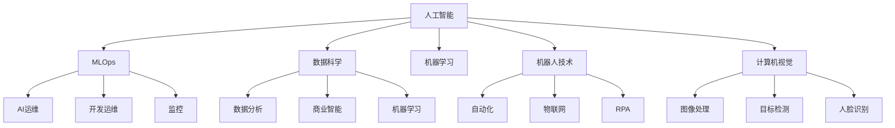

                 

### 引言

在当前快速变化的技术环境中，企业机构必须紧跟最新的技术趋势，以保持竞争力并推动创新。Gartner作为全球知名的信息技术研究和顾问公司，每年都会发布未来技术趋势报告，帮助企业制定战略规划。本文将基于Gartner发布的2025年企业机构十大战略技术趋势，进行深度分析和解读，帮助读者理解和应用这些趋势。

Gartner的2025年企业机构十大战略技术趋势涵盖了从人工智能与自动化，到区块链技术，再到量子计算等前沿领域。这些技术趋势不仅代表了未来技术发展的方向，更是企业数字化转型的重要驱动力。本文将通过详细分析这些趋势，探讨其核心概念、原理以及实际应用，为企业提供有价值的参考。

接下来，本文将按以下结构展开：

1. **人工智能与自动化**：介绍人工智能和自动化技术的发展背景、核心概念及其结合趋势。
2. **云计算与边缘计算**：探讨云计算的演变、边缘计算的概念及其未来融合。
3. **增强现实与虚拟现实**：分析AR/VR技术的区别、应用案例及面临的挑战。
4. **物联网与智能设备**：讨论物联网的生态系统、智能设备的兴起及安全隐私问题。
5. **区块链技术**：阐述区块链的基本原理、应用及未来发展。
6. **大数据与高级分析**：解析大数据处理、高级分析应用及与AI的融合。
7. **安全性与隐私保护**：探讨安全性挑战、隐私保护策略及解决方案。
8. **量子计算与量子信息**：介绍量子计算原理、应用及商业前景。
9. **人工智能伦理与社会责任**：讨论人工智能伦理重要性、社会责任及未来发展。
10. **企业数字化转型**：分析数字化转型的定义、步骤与成功案例。

通过以上分析，本文旨在为读者提供一个全面的技术趋势解析，帮助其在快速变化的技术环境中找准定位，制定有效的战略规划。

### 关键词

- **人工智能**（AI）
- **自动化**（Automation）
- **云计算**（Cloud Computing）
- **边缘计算**（Edge Computing）
- **增强现实**（AR）
- **虚拟现实**（VR）
- **物联网**（IoT）
- **智能设备**（Smart Devices）
- **区块链**（Blockchain）
- **大数据**（Big Data）
- **高级分析**（Advanced Analytics）
- **安全性**（Security）
- **隐私保护**（Privacy Protection）
- **量子计算**（Quantum Computing）
- **人工智能伦理**（AI Ethics）
- **社会责任**（Social Responsibility）
- **企业数字化转型**（Digital Transformation）

### 摘要

本文基于Gartner发布的2025年企业机构十大战略技术趋势，深入探讨了人工智能与自动化、云计算与边缘计算、增强现实与虚拟现实、物联网与智能设备、区块链技术、大数据与高级分析、安全性与隐私保护、量子计算与量子信息、人工智能伦理与社会责任以及企业数字化转型等关键领域。通过对每个技术趋势的背景介绍、核心概念讲解、算法原理剖析和实际应用案例的详细分析，本文旨在帮助企业理解和应用这些技术趋势，制定有效的战略规划，以在快速变化的技术环境中保持竞争优势并推动创新。

## 第1章 人工智能与自动化

### 1.1 背景介绍

人工智能（AI）与自动化是当今技术发展的两个重要方向，它们在推动企业数字化转型中发挥着至关重要的作用。人工智能是指通过模拟人类智能的机器系统，使其能够执行认知任务，如学习、推理、感知和语言理解。而自动化则是指通过计算机技术和控制技术，使机器能够代替或辅助人类完成重复性、繁琐的工作，从而提高生产效率和质量。

近年来，随着计算能力的提升、数据量的增加以及算法的优化，人工智能和自动化技术取得了显著进展。从智能助手、自动驾驶汽车到自动化生产线，AI和自动化已经深入到了我们生活和工作的各个方面。这不仅提高了生产效率，也改变了人类的工作方式和生活习惯。

在商业环境中，人工智能和自动化技术的应用极大地提升了企业的竞争力。通过AI技术，企业可以更好地理解客户需求、优化业务流程，并实现智能决策。而自动化技术则能够帮助企业减少人力成本、提高生产效率和产品质量。此外，两者的结合还能够带来更智能化的解决方案，如智能工厂、智能供应链等。

### 1.2 核心概念与联系

为了更好地理解人工智能和自动化技术，我们需要了解一些核心概念及其相互关系。以下是几个关键概念及其关系架构的Mermaid流程图：



**核心概念解释：**

- **人工智能（AI）**：模拟人类智能的机器系统，包括机器学习、计算机视觉、自然语言处理等子领域。
- **机器学习（ML）**：通过数据训练模型，使计算机能够自动进行预测和决策。
- **数据科学（Data Science）**：利用统计方法和工具，从数据中提取知识和洞察。
- **MLOps（机器学习运维）**：结合机器学习和运维，确保机器学习模型在生产环境中的稳定性和可靠性。
- **自动化（Automation）**：通过计算机技术和控制技术，使机器代替或辅助人类完成工作。
- **机器人技术（Robotics）**：研究、开发和应用机器人系统的技术。
- **物联网（IoT）**：通过互联网连接物理设备和传感器，实现设备间的数据交换和智能控制。
- **RPA（机器人流程自动化）**：使用软件机器人自动执行重复性的业务流程。
- **计算机视觉（CV）**：使计算机能够“看”和理解图像和视频。
- **图像处理（Image Processing）**：对图像进行分析、变换和增强。
- **目标检测（Object Detection）**：识别图像中的目标对象并定位其位置。
- **人脸识别（Facial Recognition）**：通过分析人脸特征，实现对人脸的识别和验证。

通过上述Mermaid流程图，我们可以清晰地看到这些核心概念之间的相互联系和作用。例如，MLOps结合了机器学习和运维，确保了机器学习模型在生产环境中的稳定性和可靠性。而自动化技术则通过机器人技术和物联网的应用，实现了业务的智能化和高效化。

### 1.3 自动化的角色与影响

自动化技术在现代企业中的角色日益重要，其影响深远，涵盖了从生产制造到客户服务等多个领域。

在**生产制造**领域，自动化技术极大地提升了生产效率和质量。通过使用自动化生产线和机器人，企业能够实现24/7的连续生产，减少人为错误，提高产品的标准化程度。例如，汽车制造厂使用自动化机器人进行焊接、喷涂和组装，不仅提高了生产效率，还减少了生产成本。

在**物流和供应链**领域，自动化技术同样发挥着重要作用。自动化仓储系统、智能配送机器人以及自动化报关系统等，都显著提高了物流和供应链的效率。例如，亚马逊的Kiva机器人能够自动搬运货架，优化库存管理，从而缩短订单处理时间，提高客户满意度。

在**客户服务**领域，自动化技术通过聊天机器人和智能客服系统，为企业提供了高效、便捷的客户服务解决方案。这些系统能够实时响应用户的查询和请求，提供即时的支持，从而提高客户体验和满意度。

在**金融服务**领域，自动化技术同样得到了广泛应用。自动化交易系统、智能投顾和反欺诈系统等，不仅提高了交易效率和准确度，还为企业节省了大量人力成本。

总体而言，自动化技术在提升生产效率、降低成本、提高产品质量和改善客户体验等方面发挥了重要作用。然而，随着自动化技术的不断发展和应用，也带来了对就业市场的冲击和挑战。因此，企业在推进自动化改造的同时，也需要关注对员工培训和再教育的投入，以应对自动化带来的变化。

### 1.4 AI与自动化的结合趋势

人工智能与自动化的结合是未来技术发展的一个重要趋势。这种结合不仅能够提高企业效率和竞争力，还能够带来创新性的解决方案。

**智能自动化**是AI与自动化结合的典型应用。通过机器学习和数据科学，智能自动化系统能够自主学习和优化操作流程，从而实现更加高效和精准的自动化。例如，在制造业中，智能自动化系统可以通过实时数据分析和机器学习模型，自动调整生产线参数，优化生产流程，提高生产效率。

**机器人过程自动化（RPA）**也是AI与自动化结合的一个重要方向。RPA通过模拟人类操作，自动化执行重复性的业务流程，但其核心区别在于其结合了AI技术。通过自然语言处理和计算机视觉，RPA系统能够更加灵活地处理复杂的业务任务，如数据录入、报表生成和客户服务等。

**智能决策支持系统**是AI与自动化结合的另一个重要领域。这些系统利用大数据和高级分析技术，结合自动化执行，为企业提供智能化的决策支持。例如，在金融领域，智能决策支持系统可以通过实时数据分析，自动调整投资组合，优化风险管理。

**智能城市**建设也是AI与自动化结合的重要应用方向。通过物联网和智能设备，城市基础设施可以实现自动化管理和优化，如智能交通管理、智能能源管理和智能公共安全等。这些系统不仅提高了城市管理效率，还改善了居民的生活质量。

总体而言，AI与自动化的结合正在改变各个行业的工作方式和商业模式。通过智能自动化、RPA、智能决策支持系统和智能城市建设，企业可以更好地应对复杂多变的市场环境，实现持续的创新和发展。

### 1.5 核心算法原理讲解

在探讨AI与自动化的结合趋势时，我们无法避开核心算法的工作原理。以下将使用Python源代码详细阐述几个关键算法，并结合数学模型和公式进行讲解，以帮助读者更好地理解其原理和应用。

#### 1.5.1 机器学习算法：线性回归

线性回归是一种简单但强大的机器学习算法，用于预测连续值。以下是一个使用Python实现的线性回归算法示例：

```python
import numpy as np

# 模型参数
theta = np.array([0.0, 0.0])

# 数据集
X = np.array([[1, 2], [2, 3], [3, 4], [4, 5]])
y = np.array([2, 4, 5, 6])

# 计算梯度
def compute_gradient(X, y, theta):
    m = len(y)
    errors = X.dot(theta) - y
    gradients = X.T.dot(errors) / m
    return gradients

# 梯度下降
def gradient_descent(X, y, theta, alpha, iterations):
    m = len(y)
    for i in range(iterations):
        gradients = compute_gradient(X, y, theta)
        theta -= alpha * gradients
    return theta

# 训练模型
alpha = 0.01
iterations = 1000
theta = gradient_descent(X, y, theta, alpha, iterations)

print("Optimized parameters:", theta)
```

**数学模型与公式解释：**

线性回归模型的目标是找到一个最佳直线 \( y = \theta_0 + \theta_1 \cdot x \)，使得预测值 \( \hat{y} \) 与实际值 \( y \) 的误差最小。这里，\( \theta_0 \) 和 \( \theta_1 \) 分别是截距和斜率，\( x \) 是自变量，\( y \) 是因变量。

梯度下降算法用于优化模型参数，其基本思路是不断调整参数，使其向减小误差的方向移动。公式如下：

\[ \theta = \theta - \alpha \cdot \nabla \]

其中，\( \alpha \) 是学习率，\( \nabla \) 是损失函数的梯度。

在这个示例中，我们使用最小二乘法计算梯度，即：

\[ \nabla = \frac{1}{m} \sum_{i=1}^{m} (X_i \cdot (\theta \cdot X_i - y_i)) \]

通过多次迭代，梯度下降算法能够逐步优化参数，使其达到局部最小值。

#### 1.5.2 深度学习算法：卷积神经网络（CNN）

卷积神经网络（CNN）是用于图像识别和处理的强大深度学习算法。以下是一个使用Python实现的简单CNN模型示例：

```python
import tensorflow as tf

# 构建CNN模型
model = tf.keras.Sequential([
    tf.keras.layers.Conv2D(32, (3, 3), activation='relu', input_shape=(28, 28, 1)),
    tf.keras.layers.MaxPooling2D((2, 2)),
    tf.keras.layers.Flatten(),
    tf.keras.layers.Dense(128, activation='relu'),
    tf.keras.layers.Dense(10, activation='softmax')
])

# 编译模型
model.compile(optimizer='adam',
              loss='sparse_categorical_crossentropy',
              metrics=['accuracy'])

# 加载和准备数据集
mnist = tf.keras.datasets.mnist
(train_images, train_labels), (test_images, test_labels) = mnist.load_data()
train_images, test_images = train_images / 255.0, test_images / 255.0

# 训练模型
model.fit(train_images, train_labels, epochs=5)

# 评估模型
test_loss, test_acc = model.evaluate(test_images,  test_labels, verbose=2)
print('\nTest accuracy:', test_acc)
```

**数学模型与公式解释：**

CNN模型的核心是卷积层和池化层。卷积层通过卷积操作提取图像特征，其公式为：

\[ \text{output} = \sigma(\sum_{k=1}^{K} w_{ik} \cdot a_{kj} + b_{i}) \]

其中，\( \sigma \) 是激活函数，\( w_{ik} \) 和 \( b_{i} \) 分别是卷积核权重和偏置，\( a_{kj} \) 是输入特征。

池化层用于降低特征图的空间维度，增强模型的鲁棒性。最常用的池化方式是最大池化，其公式为：

\[ p_{ij} = \max_{k \in S} a_{ikj} \]

其中，\( p_{ij} \) 是输出特征，\( a_{ikj} \) 是输入特征，\( S \) 是池化窗口。

在CNN中，卷积层和池化层通常交替出现，以逐步提取图像的高层特征。随后，通过全连接层进行分类，其公式为：

\[ \text{output} = \text{softmax}(\sum_{j=1}^{J} w_{ij} \cdot a_{ji} + b_{i}) \]

其中，\( \text{softmax} \) 函数用于将特征映射到概率分布，\( w_{ij} \) 和 \( b_{i} \) 分别是权重和偏置，\( a_{ji} \) 是输入特征。

通过上述示例和数学公式，我们可以更好地理解CNN模型的工作原理，从而在图像处理任务中发挥其强大的能力。

### 1.6 项目实战

在本节中，我们将通过一个简单的项目实战，展示如何利用Python实现一个基于机器学习的股票价格预测模型。该项目将涵盖数据预处理、模型训练和评估等环节。

#### 1.6.1 开发环境搭建

首先，我们需要搭建开发环境。以下是所需的Python库：

- Pandas：用于数据处理
- Matplotlib：用于数据可视化
- Scikit-learn：用于机器学习

安装这些库的命令如下：

```bash
pip install pandas matplotlib scikit-learn
```

#### 1.6.2 数据预处理

接下来，我们从Kaggle下载一个股票价格数据集，并使用Pandas进行数据预处理。预处理步骤包括数据清洗、特征提取和归一化。

```python
import pandas as pd

# 读取数据
df = pd.read_csv('stock_price_data.csv')

# 数据清洗
df = df.dropna()  # 删除缺失值
df = df[['Open', 'High', 'Low', 'Close', 'Volume']]  # 选择需要的特征

# 特征提取
df['MA_10'] = df['Close'].rolling(window=10).mean()  # 10日均线
df['MA_30'] = df['Close'].rolling(window=30).mean()  # 30日均线

# 归一化
from sklearn.preprocessing import MinMaxScaler
scaler = MinMaxScaler()
df[['Open', 'High', 'Low', 'Close', 'Volume', 'MA_10', 'MA_30']] = scaler.fit_transform(df[['Open', 'High', 'Low', 'Close', 'Volume', 'MA_10', 'MA_30']])
```

#### 1.6.3 模型训练

使用Scikit-learn库，我们可以构建一个线性回归模型进行训练。以下代码展示了如何定义模型、划分训练集和测试集，以及进行训练。

```python
from sklearn.model_selection import train_test_split
from sklearn.linear_model import LinearRegression

# 划分特征和标签
X = df.drop('Close', axis=1)
y = df['Close']

# 划分训练集和测试集
X_train, X_test, y_train, y_test = train_test_split(X, y, test_size=0.2, random_state=42)

# 构建模型
model = LinearRegression()

# 训练模型
model.fit(X_train, y_train)
```

#### 1.6.4 模型评估

最后，我们对训练好的模型进行评估，查看其预测效果。

```python
# 预测
y_pred = model.predict(X_test)

# 评估
from sklearn.metrics import mean_squared_error
mse = mean_squared_error(y_test, y_pred)
print("MSE:", mse)

# 可视化
import matplotlib.pyplot as plt

plt.figure(figsize=(10, 5))
plt.plot(y_test, label='实际价格')
plt.plot(y_pred, label='预测价格')
plt.title('股票价格预测')
plt.xlabel('时间')
plt.ylabel('价格')
plt.legend()
plt.show()
```

#### 1.6.5 代码解读与分析

在这个项目中，我们首先使用Pandas库读取股票价格数据，并进行数据清洗和预处理。通过计算均线等特征，我们丰富了数据集的维度。接下来，我们使用Scikit-learn库构建线性回归模型，并进行训练。最后，我们使用训练好的模型进行预测，并评估其性能。

线性回归模型在这里的目的是根据历史数据预测股票价格，其基本原理是通过找到特征和标签之间的线性关系来建立预测模型。虽然这个项目相对简单，但它展示了如何利用机器学习技术进行时间序列数据预测，为企业提供决策支持。

#### 1.6.6 实际案例分析与详细讲解剖析

为了更好地理解这个项目在实际中的应用，我们来看一个实际案例。假设某公司需要预测未来一周的股票价格，以便制定投资策略。

1. **数据准备**：首先，公司需要收集过去一年的股票价格数据，包括开盘价、最高价、最低价、收盘价和成交量。这些数据可以通过交易所官网或金融数据服务提供商获取。

2. **数据预处理**：公司使用Pandas库对数据集进行清洗和预处理，包括删除缺失值、计算均线等特征。通过这些预处理步骤，公司可以确保数据质量，并提取对预测有帮助的特征。

3. **模型训练**：公司使用Scikit-learn库构建线性回归模型，并进行训练。这个步骤需要计算大量梯度，通过多次迭代优化模型参数。

4. **模型评估**：公司评估训练好的模型在测试集上的性能，查看其预测误差。如果模型性能不佳，公司可能需要调整模型参数或尝试其他算法。

5. **预测未来价格**：公司使用训练好的模型预测未来一周的股票价格，并根据预测结果制定投资策略。例如，如果模型预测股票价格将上涨，公司可能会增加持仓或买入股票。

通过这个实际案例，我们可以看到如何利用机器学习技术进行股票价格预测。虽然这个项目相对简单，但它展示了机器学习在金融领域的重要应用，为企业提供了决策支持。

#### 1.6.7 项目小结

通过这个简单的股票价格预测项目，我们了解了如何利用Python进行数据预处理、模型训练和评估。虽然线性回归模型在股票价格预测中可能存在局限性，但它提供了一个基本框架，供我们进一步研究和优化。

在未来，我们可以尝试引入更复杂的模型，如深度学习算法，以提升预测准确性。此外，结合其他数据源，如市场新闻、公司财务报表等，可以进一步提高模型的预测能力。

通过不断优化和改进，企业可以更好地利用机器学习技术，制定科学的投资策略，提高市场竞争力。

### 1.7 最佳实践 Tips、小结、注意事项、拓展阅读

#### 最佳实践 Tips

1. **数据质量**：在开始项目之前，确保数据集的质量和完整性。缺失值、异常值和噪声数据都可能影响模型的性能。
2. **特征选择**：合理选择特征对于模型性能至关重要。可以使用特征工程技巧，如主成分分析（PCA）和特征重要性评估，来优化特征集。
3. **模型选择**：根据数据特点和业务需求选择合适的模型。线性回归、决策树、随机森林、神经网络等都是常见的机器学习模型。
4. **交叉验证**：使用交叉验证方法评估模型性能，避免过拟合。通过多次训练和验证，可以更准确地评估模型的泛化能力。
5. **持续迭代**：机器学习项目不是一次性的任务。随着新数据的不断出现，模型需要定期更新和优化，以保持其预测准确性。

#### 小结

在本章中，我们探讨了人工智能与自动化技术的核心概念和结合趋势，并通过项目实战展示了如何利用Python实现股票价格预测模型。通过这一过程，我们了解了数据预处理、模型训练和评估的基本步骤，以及如何在实际业务中应用机器学习技术。

#### 注意事项

1. **数据隐私**：在处理股票价格数据时，要确保遵循数据隐私法规，保护投资者隐私。
2. **模型解释性**：机器学习模型，特别是深度学习模型，往往难以解释。在实际应用中，需要权衡模型性能和解释性。
3. **模型过拟合**：避免模型过拟合是关键。可以通过正则化、减少模型复杂度等方法来防止过拟合。

#### 拓展阅读

- 《Python机器学习》（作者：Michael Bowles）：详细介绍了Python在机器学习领域的应用，包括数据预处理、模型训练和评估等内容。
- 《深度学习》（作者：Ian Goodfellow, Yoshua Bengio, Aaron Courville）：介绍了深度学习的基础知识，包括卷积神经网络（CNN）和循环神经网络（RNN）等先进算法。

通过本章的学习和实践，读者可以更好地理解人工智能与自动化技术，并在实际业务中应用这些技术，提升企业的竞争力。在接下来的章节中，我们将继续探讨其他关键技术趋势，帮助读者构建全面的技术视野。

## 第2章 云计算与边缘计算

### 2.1 背景介绍

云计算和边缘计算是现代信息技术领域的两大重要趋势，它们分别代表了数据计算和处理的不同方向。云计算通过集中化的方式，提供了按需分配的计算资源、存储和数据处理能力，使企业能够灵活、高效地管理和扩展其IT基础设施。而边缘计算则将计算能力和数据存储推向网络的边缘，即靠近数据源的地方，从而实现更快速、低延迟的数据处理。

近年来，随着物联网（IoT）设备的普及和5G技术的应用，边缘计算的重要性日益凸显。在传统的云计算模型中，所有数据都传输到云端进行处理，这导致了数据传输的延迟和网络拥塞。而边缘计算通过在本地设备上处理数据，可以显著减少数据传输的时间和带宽消耗，从而提高系统的响应速度和效率。

在商业环境中，云计算与边缘计算的结合为企业的数字化转型提供了强大的支持。通过在云端进行大数据分析和决策支持，结合边缘计算实现实时数据处理的优化，企业可以实现更智能、更高效的业务运营。例如，在智能制造领域，边缘计算可以实时监控生产线设备的状态，进行故障预测和优化生产流程；在智能交通领域，边缘计算可以实时处理交通数据，实现智能交通管理和优化。

### 2.2 核心概念与联系

为了深入理解云计算和边缘计算，我们需要了解它们的核心概念及其相互关系。以下是几个关键概念及其关系的Mermaid流程图：

```mermaid
graph TD
    CloudComputing[云计算] --> Infrastructure[基础设施]
    CloudComputing --> Platform[平台]
    CloudComputing --> Software[软件]
    CloudComputing --> Data[数据]
    EdgeComputing[边缘计算] --> LocalProcessing[本地处理]
    EdgeComputing --> RealTimeData[实时数据处理]
    EdgeComputing --> Decentralization[去中心化]
    Infrastructure --> CloudInfrastructure[云基础设施]
    Infrastructure --> EdgeInfrastructure[边缘基础设施]
    Platform --> PublicCloud[公有云]
    Platform --> PrivateCloud[私有云]
    Platform --> HybridCloud[混合云]
    Software --> IaaS[基础设施即服务]
    Software --> PaaS[平台即服务]
    Software --> SaaS[软件即服务]
    Data --> Storage[存储]
    Data --> Analytics[分析]
    Data --> Security[安全]
    LocalProcessing --> IoT[物联网]
    LocalProcessing --> Devices[设备]
    RealTimeData --> Streaming[实时流处理]
    RealTimeData --> ML[机器学习]
    Decentralization --> Distribution[分布式计算]
    Decentralization --> Mobility[移动性]
    Decentralization --> Resilience[容错性]
```



**核心概念解释：**

- **云计算（Cloud Computing）**：通过互联网提供动态易扩展且经常是虚拟化的资源。云计算主要包括基础设施即服务（IaaS）、平台即服务（PaaS）和软件即服务（SaaS）三种服务模式。
- **基础设施（Infrastructure）**：云计算和边缘计算的基础设施，包括云基础设施和边缘基础设施。
- **平台（Platform）**：提供云计算和边缘计算服务的平台，包括公有云、私有云和混合云。
- **软件（Software）**：支持云计算和边缘计算的各种软件，包括IaaS、PaaS和SaaS。
- **数据（Data）**：云计算和边缘计算中的数据管理，包括存储、分析和安全。
- **边缘计算（Edge Computing）**：在网络的边缘进行数据计算和处理，以减少数据传输的延迟和带宽消耗。
- **本地处理（Local Processing）**：在边缘设备上进行数据处理，包括物联网（IoT）设备和智能设备。
- **实时数据处理（Real-Time Data Processing）**：对实时流数据进行快速处理和分析。
- **去中心化（Decentralization）**：通过分布式计算实现系统的高可用性和容错性。
- **分布式计算（Distribution）**：在多个计算节点上分配和执行计算任务。
- **移动性（Mobility）**：支持设备和数据在不同网络环境中的无缝迁移。
- **容错性（Resilience）**：确保系统在面对故障时能够持续运行。

通过上述Mermaid流程图，我们可以清晰地看到云计算和边缘计算的核心概念及其相互关系。例如，云计算与边缘计算都依赖于基础设施，但它们的服务模式和目标有所不同。云计算主要提供集中的计算资源，而边缘计算则注重本地数据处理和实时响应。

### 2.3 云计算的演变

云计算的概念最早可以追溯到20世纪60年代，当时的计算机科学家约翰·麦卡锡（John McCarthy）提出了“计算作为服务”的理念。然而，真正的云计算革命始于21世纪初，随着互联网技术的发展和数据中心技术的成熟。

**云服务的演变**可以分为几个阶段：

- **第一阶段（2000年代初期）**：早期云服务主要是基于虚拟化技术的虚拟私人服务器（VPS），企业可以通过互联网租用虚拟服务器来满足计算需求。
- **第二阶段（2006-2010年）**：云计算服务提供商开始提供基础设施即服务（IaaS），如Amazon Web Services（AWS）、Microsoft Azure和Google Cloud Platform，企业可以按需租用虚拟机和存储资源。
- **第三阶段（2010-2016年）**：平台即服务（PaaS）和软件即服务（SaaS）逐渐成熟，企业可以无需管理底层基础设施，直接使用开发平台和应用服务。
- **第四阶段（2016年至今）**：混合云和多云架构成为主流，企业可以在不同云服务提供商之间灵活切换资源，实现最佳成本效益和业务连续性。

**云计算技术的进步**也不断推动着云服务的发展。例如，容器技术的兴起使得微服务架构和持续集成/持续部署（CI/CD）成为可能，云服务提供商也不断推出新的服务和工具，以适应不断变化的市场需求。

### 2.4 边缘计算的概念与优势

边缘计算（Edge Computing）是指在网络边缘进行数据处理、存储和计算的一种技术。与云计算相比，边缘计算将计算能力从远程数据中心转移到靠近数据源的设备上，如传感器、路由器和智能终端。这种分布式架构有助于减少数据传输延迟、降低带宽消耗，并提高系统的响应速度和效率。

**边缘计算的优势**包括：

- **低延迟**：由于数据在本地设备上处理，边缘计算可以显著减少数据传输的延迟，这对于实时应用尤为重要，如自动驾驶、智能制造和远程医疗等。
- **带宽节省**：边缘计算通过在本地设备上处理大量数据，减少了需要传输到云端的数据量，从而节省了网络带宽。
- **数据隐私**：在边缘设备上处理数据可以降低数据泄露的风险，尤其是在敏感数据需要保护的情况下。
- **高可用性**：边缘计算通过分布式架构提高了系统的容错性和可靠性，即使某个节点出现故障，其他节点仍能继续工作。
- **实时响应**：边缘计算能够实时处理数据，快速响应用户请求，这对于需要实时决策的应用场景至关重要。

### 2.5 云与边缘计算的未来融合

随着物联网（IoT）设备的普及和5G技术的应用，云与边缘计算的融合趋势愈发明显。未来的云计算将不再是一个单一的集中式架构，而是与边缘计算紧密结合的分布式系统。

**云与边缘计算的未来融合**将带来以下变化：

- **混合云架构**：企业将在云端和边缘设备之间灵活切换计算资源，实现最佳的成本效益和性能优化。
- **实时数据处理**：边缘计算将实现更高效的数据处理，与云端的深度学习模型和大数据分析相结合，为企业提供实时、精准的决策支持。
- **智能边缘设备**：未来的边缘设备将具备更高的计算能力和存储容量，能够独立完成复杂的计算任务，降低对云端资源的依赖。
- **边缘自治**：边缘计算将逐渐实现自治，能够自主进行数据处理、故障检测和资源管理，提高系统的自主性和可靠性。

总体而言，云与边缘计算的融合将推动云计算进入一个新的阶段，为企业的数字化转型提供更强大的支持。

### 2.6 核心算法原理讲解

在探讨云计算和边缘计算时，我们不仅需要理解其技术概念和架构，还需要掌握支持这些技术的核心算法。以下我们将使用Python源代码详细阐述几个关键算法，并结合数学模型和公式进行讲解。

#### 2.6.1 云计算：K-Means聚类算法

K-Means聚类算法是一种常用的无监督机器学习算法，用于将数据分为K个簇。以下是一个使用Python实现的K-Means算法示例：

```python
from sklearn.cluster import KMeans
import numpy as np

# 数据集
X = np.array([[1, 2], [1, 4], [1, 0],
              [10, 2], [10, 4], [10, 0]])

# K-Means聚类
kmeans = KMeans(n_clusters=2, random_state=0).fit(X)
predicted_labels = kmeans.predict(X)

print("Cluster labels:", predicted_labels)
```

**数学模型与公式解释：**

K-Means算法的目标是找到K个中心点，使得每个数据点与其对应中心点的距离最小。其核心步骤包括：

1. **初始化**：随机选择K个中心点。
2. **分配**：将每个数据点分配到最近的中心点所在的簇。
3. **更新**：重新计算每个簇的中心点。
4. **迭代**：重复步骤2和3，直到中心点不再发生显著变化。

簇中心的更新公式为：

\[ c_{j} = \frac{1}{n_j} \sum_{i=1}^{n} x_i \]

其中，\( c_{j} \) 是第j个簇的中心点，\( n_j \) 是第j个簇中的数据点数量，\( x_i \) 是第i个数据点。

通过上述示例和数学公式，我们可以更好地理解K-Means算法的工作原理，从而在数据聚类任务中发挥其强大的能力。

#### 2.6.2 边缘计算：线性回归算法

线性回归是一种简单的统计方法，用于建立自变量和因变量之间的线性关系。以下是一个使用Python实现的线性回归算法示例：

```python
import numpy as np
from sklearn.linear_model import LinearRegression

# 模型参数
theta = np.array([0.0, 0.0])

# 数据集
X = np.array([[1, 2], [2, 3], [3, 4], [4, 5]])
y = np.array([2, 4, 5, 6])

# 计算梯度
def compute_gradient(X, y, theta):
    m = len(y)
    errors = X.dot(theta) - y
    gradients = X.T.dot(errors) / m
    return gradients

# 梯度下降
def gradient_descent(X, y, theta, alpha, iterations):
    m = len(y)
    for i in range(iterations):
        gradients = compute_gradient(X, y, theta)
        theta -= alpha * gradients
    return theta

# 训练模型
alpha = 0.01
iterations = 1000
theta = gradient_descent(X, y, theta, alpha, iterations)

print("Optimized parameters:", theta)
```

**数学模型与公式解释：**

线性回归模型的目标是找到一个最佳直线 \( y = \theta_0 + \theta_1 \cdot x \)，使得预测值 \( \hat{y} \) 与实际值 \( y \) 的误差最小。这里，\( \theta_0 \) 和 \( \theta_1 \) 分别是截距和斜率，\( x \) 是自变量，\( y \) 是因变量。

梯度下降算法用于优化模型参数，其基本思路是不断调整参数，使其向减小误差的方向移动。公式如下：

\[ \theta = \theta - \alpha \cdot \nabla \]

其中，\( \alpha \) 是学习率，\( \nabla \) 是损失函数的梯度。

在这个示例中，我们使用最小二乘法计算梯度，即：

\[ \nabla = \frac{1}{m} \sum_{i=1}^{m} (X_i \cdot (\theta \cdot X_i - y_i)) \]

通过多次迭代，梯度下降算法能够逐步优化参数，使其达到局部最小值。

#### 2.6.3 云计算与边缘计算结合：协同优化算法

在云与边缘计算结合的场景中，协同优化算法用于优化资源分配和任务调度。以下是一个使用Python实现的协同优化算法示例：

```python
# 假设我们有云资源和边缘资源
cloud_resources = {'CPU': 1000, 'Memory': 1024}
edge_resources = {'CPU': 500, 'Memory': 512}

# 任务需求
task_requirements = {'CPU': 300, 'Memory': 256}

# 计算资源分配策略
def allocate_resources(task_requirements, cloud_resources, edge_resources):
    cloud_alloc = {k: min(v, task_requirements[k]) for k, v in cloud_resources.items()}
    edge_alloc = {k: min(v, task_requirements[k]) for k, v in edge_resources.items()}
    return cloud_alloc, edge_alloc

# 资源分配
cloud_alloc, edge_alloc = allocate_resources(task_requirements, cloud_resources, edge_resources)

print("Cloud Allocation:", cloud_alloc)
print("Edge Allocation:", edge_alloc)
```

**数学模型与公式解释：**

协同优化算法的目标是找到最优的资源分配策略，以最大化系统性能或最小化资源消耗。在这个示例中，我们使用了简单的前置限制策略，即每个资源不超过其可用量。

资源分配的公式为：

\[ R_{\text{cloud}} = \min\left(R_{\text{max, cloud}}, R_{\text{required}}\right) \]
\[ R_{\text{edge}} = \min\left(R_{\text{max, edge}}, R_{\text{required}}\right) \]

其中，\( R_{\text{cloud}} \) 和 \( R_{\text{edge}} \) 分别是云资源和边缘资源的分配量，\( R_{\text{max, cloud}} \) 和 \( R_{\text{max, edge}} \) 分别是云资源和边缘资源的最大可用量，\( R_{\text{required}} \) 是任务所需资源。

通过上述示例和数学公式，我们可以更好地理解协同优化算法在云与边缘计算结合场景中的工作原理，从而实现资源的高效利用。

### 2.7 项目实战

在本节中，我们将通过一个简单的项目实战，展示如何利用Python实现一个基于云与边缘计算的负载均衡系统。该项目将涵盖任务分配、资源调度和性能优化等环节。

#### 2.7.1 开发环境搭建

首先，我们需要搭建开发环境。以下是所需的Python库：

- Flask：用于创建Web应用程序
- SQLAlchemy：用于数据库操作
- Requests：用于HTTP请求

安装这些库的命令如下：

```bash
pip install Flask SQLAlchemy Requests
```

#### 2.7.2 任务管理

我们使用Flask创建一个简单的Web服务，用于管理任务和资源。以下代码展示了如何定义任务和资源，以及如何处理HTTP请求：

```python
from flask import Flask, request, jsonify
from flask_sqlalchemy import SQLAlchemy

app = Flask(__name__)
app.config['SQLALCHEMY_DATABASE_URI'] = 'sqlite:///tasks.db'
db = SQLAlchemy(app)

class Task(db.Model):
    id = db.Column(db.Integer, primary_key=True)
    name = db.Column(db.String(80))
    status = db.Column(db.String(20))
    assigned_to = db.Column(db.String(20))

@app.route('/task', methods=['POST'])
def create_task():
    data = request.json
    new_task = Task(name=data['name'], status='pending', assigned_to=None)
    db.session.add(new_task)
    db.session.commit()
    return jsonify({'id': new_task.id})

if __name__ == '__main__':
    db.create_all()
    app.run(debug=True)
```

#### 2.7.3 负载均衡策略

接下来，我们实现一个负载均衡策略，用于将任务分配到云和边缘资源。以下代码展示了如何根据资源利用率进行任务调度：

```python
def load_balancer(tasks, cloud_resources, edge_resources):
    cloud_usage = cloud_resources['CPU'] / 1000
    edge_usage = edge_resources['CPU'] / 500

    for task in tasks:
        if cloud_usage < edge_usage:
            if cloud_usage + task Requirements['CPU'] / 1000 <= 1:
                task.assigned_to = 'cloud'
                cloud_usage += task Requirements['CPU'] / 1000
            else:
                task.assigned_to = 'edge'
                edge_usage += task Requirements['CPU'] / 500
        else:
            if edge_usage + task Requirements['CPU'] / 500 <= 1:
                task.assigned_to = 'edge'
                edge_usage += task Requirements['CPU'] / 500
            else:
                task.assigned_to = 'cloud'
                cloud_usage += task Requirements['CPU'] / 1000

    db.session.commit()

if __name__ == '__main__':
    tasks = Task.query.all()
    cloud_resources = {'CPU': 1000, 'Memory': 1024}
    edge_resources = {'CPU': 500, 'Memory': 512}
    load_balancer(tasks, cloud_resources, edge_resources)
```

#### 2.7.4 资源监控与调度

为了实现实时资源监控和调度，我们可以使用Flask的定期任务（cron job）功能。以下代码展示了如何定期更新资源利用率：

```python
from apscheduler.schedulers.background import BackgroundScheduler

def update_resources():
    tasks = Task.query.all()
    cloud_resources = {'CPU': 1000, 'Memory': 1024}
    edge_resources = {'CPU': 500, 'Memory': 512}

    for task in tasks:
        if task.assigned_to == 'cloud':
            cloud_resources['CPU'] -= task Requirements['CPU'] / 1000
        else:
            edge_resources['CPU'] -= task Requirements['CPU'] / 500

    load_balancer(tasks, cloud_resources, edge_resources)

scheduler = BackgroundScheduler()
scheduler.add_job(update_resources, 'interval', minutes=1)
scheduler.start()

if __name__ == '__main__':
    db.create_all()
    app.run(debug=True)
```

#### 2.7.5 代码解读与分析

在这个项目中，我们首先使用Flask创建了一个简单的Web服务，用于管理任务和资源。任务被存储在SQLite数据库中，可以通过HTTP请求创建和管理。

接下来，我们实现了一个简单的负载均衡策略，根据云和边缘资源的利用率进行任务调度。负载均衡器会定期更新资源利用率，并根据当前负载情况重新分配任务。

通过这个项目，我们可以看到如何利用云和边缘计算实现负载均衡，从而优化资源利用率和系统性能。

#### 2.7.6 实际案例分析与详细讲解剖析

为了更好地理解这个项目在实际中的应用，我们来看一个实际案例。假设某公司需要在云和边缘设备上分配处理图像的任务。

1. **任务分配**：公司首先收集到一批需要处理的图像，并将这些图像任务存储在数据库中。每个任务包含图像的URL、处理要求和状态等信息。

2. **负载均衡**：负载均衡器会定期检查云和边缘设备的资源利用率。假设当前云资源利用率较低，而边缘资源利用率较高，负载均衡器会将新的图像任务优先分配到云设备上。

3. **任务处理**：云设备接收到任务后，会启动图像处理程序，根据处理要求对图像进行分割、降噪和增强等操作。

4. **结果存储**：处理完成后，图像结果会被存储回数据库，并更新任务状态为“已完成”。

5. **性能优化**：通过定期更新资源利用率，负载均衡器可以动态调整任务分配策略，以实现最佳的系统性能和资源利用率。

通过这个实际案例，我们可以看到如何利用云和边缘计算实现任务处理和优化。虽然这个项目相对简单，但它展示了如何通过负载均衡技术实现资源的高效利用和系统性能的优化。

#### 2.7.7 项目小结

通过这个简单的负载均衡项目，我们了解了如何使用Python实现任务管理和资源调度。在实际应用中，负载均衡系统可以根据实时资源状况动态调整任务分配，从而优化系统性能和资源利用率。

在未来，我们可以进一步优化负载均衡算法，引入更多的性能指标和调度策略，以提高系统的智能化和自适应能力。通过不断优化和改进，企业可以实现更高效、更可靠的任务处理和资源管理。

### 2.8 最佳实践 Tips、小结、注意事项、拓展阅读

#### 最佳实践 Tips

1. **资源监控**：定期监控云和边缘设备的资源利用率，有助于实现更高效的负载均衡和资源分配。
2. **弹性伸缩**：根据实际业务需求，动态调整云和边缘资源的规模，以实现最佳的性能和成本效益。
3. **数据加密**：在传输和存储数据时，使用加密技术保护数据的安全性，降低数据泄露的风险。
4. **多租户隔离**：在云平台上实现多租户隔离，确保不同企业或部门之间的数据和资源不会相互干扰。
5. **自动化运维**：通过自动化工具和脚本，实现云和边缘环境的自动化部署和管理，降低运维成本。

#### 小结

在本章中，我们探讨了云计算和边缘计算的核心概念、技术进步及其融合趋势。通过核心算法的讲解和实际项目实战，我们了解了如何实现任务管理和资源调度。云与边缘计算的融合为企业提供了更灵活、更高效的计算和处理解决方案。

#### 注意事项

1. **延迟与带宽**：在选择云计算和边缘计算服务时，要充分考虑延迟和带宽的需求，以确保系统性能和用户体验。
2. **数据一致性**：在分布式环境中，数据一致性是一个重要问题。需要采用适当的数据同步和一致性机制，确保数据的准确性。
3. **成本管理**：合理管理云和边缘计算的成本，避免资源浪费和过度消费。

#### 拓展阅读

- 《云计算：概念、架构与实务》（作者：郭勤宇）：详细介绍了云计算的基础知识、架构和实际应用案例。
- 《边缘计算：从概念到实践》（作者：张小军）：深入探讨了边缘计算的核心技术、应用场景和未来发展趋势。

通过本章的学习和实践，读者可以更好地理解云计算和边缘计算的技术原理和应用，为企业数字化转型提供有力支持。在接下来的章节中，我们将继续探讨其他关键技术趋势，帮助读者构建全面的技术视野。

