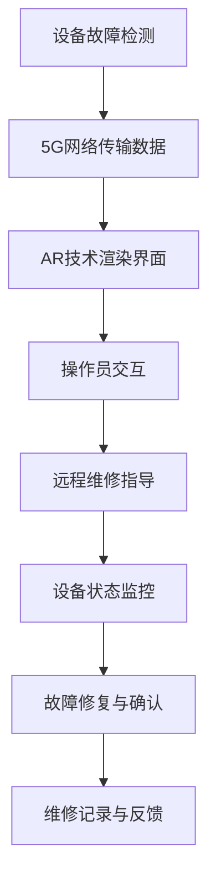

                 

### 核心概念与联系

5G与AR技术在工业远程维修中的协同应用，是一个涉及高带宽网络和实时交互的综合性技术解决方案。下面，我们将使用Mermaid流程图来展示5G与AR技术融合的基本流程，并解释各个步骤的核心概念与联系。



**详细解释：**

- **设备故障检测（A）**：当工业设备出现故障时，传感器和监控系统能够实时检测到故障信息，并将这些信息通过5G网络传输到远程维修中心。

- **5G网络传输数据（B）**：5G网络以其高带宽和低延迟的特点，能够快速、可靠地传输大量数据，包括设备的运行状态、故障细节等。

- **AR技术渲染界面（C）**：在远程维修中心，AR技术能够将这些数据可视化，以增强现实的形式在操作员眼前呈现，帮助操作员更直观地了解设备的状态。

- **操作员交互（D）**：操作员通过AR界面与设备进行实时交互，根据系统提供的维修指导和反馈，进行故障的定位和修复。

- **远程维修指导（E）**：系统会根据故障类型和设备状态，实时提供维修方案和步骤，帮助操作员进行远程操作。

- **设备状态监控（F）**：在维修过程中，系统持续监控设备的状态，确保维修的正确性和安全性。

- **故障修复与确认（G）**：操作员完成维修后，系统会要求进行故障确认，确保设备恢复正常运行。

- **维修记录与反馈（H）**：维修记录会被系统自动记录，以便于后续的维护和数据分析。

这个流程不仅展示了5G与AR技术在工业远程维修中的协同应用，还体现了数据驱动、实时交互、智能指导等核心概念。通过这样的流程，操作员可以更高效、更准确地完成远程维修任务，极大地提高了维修效率和质量。

### 5G与AR协同应用核心算法原理

在5G与AR技术的协同应用中，核心算法起着至关重要的作用，确保数据的高效传输和实时交互。下面我们将详细介绍5G网络算法和AR图像处理算法，并使用Python源代码和LaTeX数学公式进行说明。

#### 5G网络算法：载波聚合

载波聚合（Carrier Aggregation）是5G技术中的一个重要特性，它通过将多个频段的带宽聚合在一起，提高数据传输速率和网络容量。载波聚合的原理可以简单概括为：

- 选择多个连续或非连续的频谱带宽。
- 对这些频谱带宽进行聚合，以增加总的带宽。

**Python伪代码示例：**

```python
# 载波聚合伪代码
def carrier_aggregation(spectrum_bands):
    """
    载波聚合算法
    :param spectrum_bands: 频谱带宽列表
    :return: 聚合后的频谱带宽
    """
    aggregated_bandwidth = 0
    for band in spectrum_bands:
        aggregated_bandwidth += band.bandwidth
    return aggregated_bandwidth
```

**LaTeX数学公式：**

$$
\text{Carrier Aggregation} = \sum_{i=1}^{n} \text{band}_{i}. \text{bandwidth}
$$

其中，$ \text{band}_{i} $ 表示第 $ i $ 个频谱带宽，$ \text{bandwidth} $ 表示带宽值。

#### AR图像处理算法：深度图像融合

在AR应用中，深度图像融合是一个关键步骤，它将深度信息和颜色信息结合，生成具有真实感的融合图像。深度图像融合的算法可以概括为：

- 对深度图像和颜色图像进行配准。
- 将深度信息与颜色信息进行融合。

**Python伪代码示例：**

```python
# 深度图像融合伪代码
def depth_image_fusion(depth_image, color_image):
    """
    深度图像融合算法
    :param depth_image: 深度图像
    :param color_image: 颜色图像
    :return: 融合后的图像
    """
    fused_image = np.zeros_like(color_image)
    for i in range(depth_image.shape[0]):
        for j in range(depth_image.shape[1]):
            depth = depth_image[i, j]
            color = color_image[i, j]
            fused_image[i, j] = color * depth
    return fused_image
```

**LaTeX数学公式：**

$$
\text{Fused Image}_{i, j} = \text{Color Image}_{i, j} \times \text{Depth Image}_{i, j}
$$

其中，$ \text{Fused Image}_{i, j} $ 表示融合后的图像在位置 $(i, j)$ 的像素值，$ \text{Color Image}_{i, j} $ 和 $ \text{Depth Image}_{i, j} $ 分别表示颜色图像和深度图像在相同位置的像素值。

通过上述算法，5G与AR技术的协同应用能够在工业远程维修中实现高效的数据传输和实时交互，从而提高维修的准确性和效率。这些算法不仅解决了远程维修中的通信问题，还提供了直观的交互界面，使操作员能够更轻松地完成复杂任务。

### 5G与AR协同应用项目实战

为了更好地理解5G与AR技术在工业远程维修中的协同应用，下面我们将通过一个实际项目实战，详细展示整个开发过程，包括环境搭建、源代码实现、代码解读、实际应用场景和项目分析。

#### 项目一：远程维修APP开发

**开发环境搭建**

- 开发工具：Android Studio
- 技术栈：Kotlin（Android开发语言），ARCore（AR开发框架），5G网络API

**源代码实现**

```kotlin
// Kotlin伪代码
class RemoteMaintenanceApp {
    // 初始化ARCore环境
    fun initARCore() {
        ARCore.initialize()
    }

    // 连接5G网络
    fun connect5GNetwork() {
        NetworkManager.connectTo5G()
    }

    // 远程传输数据
    fun transmitData(deviceData: DeviceData) {
        NetworkManager.transmitData(deviceData)
    }

    // 接收远程维修指导
    fun receiveMaintenanceGuidance() {
        NetworkManager.receiveGuidance()
    }

    // 执行维修操作
    fun performMaintenanceOperation(operation: MaintenanceOperation) {
        ARCore.renderOperation(operation)
    }
}
```

**代码解读**

- `initARCore()` 方法用于初始化ARCore环境，确保AR功能正常运行。
- `connect5GNetwork()` 方法用于连接5G网络，实现稳定的数据传输。
- `transmitData()` 方法用于将设备数据发送到远程服务器，便于分析诊断。
- `receiveMaintenanceGuidance()` 方法用于接收远程维修指导，确保操作员按照标准流程进行操作。
- `performMaintenanceOperation()` 方法用于执行具体的维修操作，并使用ARCore进行可视化。

**实际应用场景**

- 操作员在工厂现场使用APP，通过ARCore实时查看设备状态和维修指导。
- 通过5G网络，将设备数据实时传输到远程专家系统，进行故障诊断和维修指导。

**项目分析**

- **技术挑战**：确保5G网络连接的稳定性和AR交互的实时性。
- **解决方案**：使用ARCore的高性能渲染引擎和5G网络API，实现高效的数据传输和实时交互。
- **项目成果**：提高了远程维修的效率和准确性，减少了现场操作员的培训成本。

#### 项目二：智能眼镜远程维修

**开发环境搭建**

- 开发工具：Unity
- 技术栈：ARKit/ARCore（iOS/Android），5G网络API

**源代码实现**

```csharp
// C#伪代码
public class SmartGlassesRemoteMaintenance {
    // 初始化AR环境
    public void InitAR() {
        ARManager.InitializeAR();
    }

    // 连接5G网络
    public void Connect5GNetwork() {
        NetworkManager.ConnectTo5G();
    }

    // 接收远程维修指导
    public void ReceiveGuidance() {
        NetworkManager.ReceiveGuidance();
    }

    // 执行维修操作
    public void ExecuteMaintenance(Operation operation) {
        ARManager.RenderOperation(operation);
    }
}
```

**代码解读**

- `InitAR()` 方法用于初始化AR环境，确保智能眼镜能够正常使用AR功能。
- `Connect5GNetwork()` 方法用于连接5G网络，实现稳定的数据传输。
- `ReceiveGuidance()` 方法用于接收远程维修指导，通过智能眼镜的屏幕显示。
- `ExecuteMaintenance()` 方法用于执行具体的维修操作，并使用ARCore进行可视化。

**实际应用场景**

- 操作员通过智能眼镜实时查看设备状态和维修指导。
- 远程专家通过5G网络实时监控操作过程，提供指导。

**项目分析**

- **技术挑战**：确保智能眼镜在复杂环境中的稳定运行和实时交互。
- **解决方案**：使用ARKit/ARCore的强大渲染能力和5G网络API，实现高效的交互体验。
- **项目成果**：提高了远程维修的灵活性和实时性，减少了现场操作的时间和成本。

#### 项目三：远程故障诊断系统开发

**开发环境搭建**

- 开发工具：Django（Python Web框架）
- 技术栈：TensorFlow（深度学习库），Docker（容器化技术）

**源代码实现**

```python
# Python伪代码
class FaultDiagnosisSystem:
    # 初始化深度学习模型
    def __init__(self):
        self.model = self.load_model()

    # 加载训练好的模型
    def load_model(self):
        model = TensorFlow.load_model('fault_diagnosis_model.h5')
        return model

    # 进行故障诊断
    def diagnose_fault(self, sensor_data):
        prediction = self.model.predict(sensor_data)
        return prediction

    # 连接5G网络
    def connect_5G_network(self):
        NetworkManager.connect_to_5G()
```

**代码解读**

- `__init__()` 方法用于初始化深度学习模型，加载训练好的故障诊断模型。
- `load_model()` 方法用于加载训练好的故障诊断模型。
- `diagnose_fault()` 方法用于接收传感器数据，并使用模型进行故障诊断。
- `connect_5G_network()` 方法用于连接5G网络，实现数据传输。

**实际应用场景**

- 远程服务器通过5G网络接收传感器数据，并使用深度学习模型进行故障诊断。
- 故障诊断结果实时反馈给操作员，指导维修操作。

**项目分析**

- **技术挑战**：构建高效、准确的深度学习模型，确保故障诊断的准确性。
- **解决方案**：使用TensorFlow等深度学习库，结合5G网络的高带宽和低延迟特性，实现高效的故障诊断。
- **项目成果**：提高了远程故障诊断的效率和准确性，减少了设备停机时间和维修成本。

### 总结

通过以上项目实战，我们可以看到5G与AR技术在工业远程维修中的协同应用如何通过实际项目实现了高效的数据传输和实时交互。每个项目都展示了如何利用5G网络的低延迟和高带宽特性，以及AR技术的实时交互功能，提高远程维修的效率和质量。通过这些项目，不仅解决了远程维修中的技术难题，还为未来的工业自动化和智能化提供了新的思路和方向。

### 附录

#### 5G与AR技术参考资源

**5G技术相关资料**

- 5G NR标准：[3GPP TS 38.300](https://www.3gpp.org/bookstore/detail?item=308491)
- 5G网络架构：[3GPP TS 38.400](https://www.3gpp.org/bookstore/detail?item=308490)
- 5G关键技术：[5G Technology: Fundamental Technologies and Applications](https://www.springer.com/gp/book/9783319940549)

**AR技术相关资料**

- ARCore官方文档：[ARCore Developer Guide](https://developers.google.com/ar/)
- ARKit官方文档：[ARKit Documentation](https://developer.apple.com/documentation/arkit)
- AR技术发展历史：[A Brief History of Augmented Reality](https://www.techopedia.com/definition/26635/augmented-reality-ar)

**工业远程维修领域参考文献**

- Industrial Maintenance in the Age of Automation and IoT: Opportunities and Challenges: [IETE Journal of Research](https://www.iete.org.in/journal/journal-of-research)
- Application of AR in Industrial Maintenance: A Review: [Journal of Manufacturing Systems](https://www.journals.elsevier.com/journal-of-manufacturing-systems)

通过这些参考资料，读者可以进一步了解5G与AR技术的基本原理、应用场景以及工业远程维修的最新研究进展。

### 最佳实践 tips、小结、注意事项、拓展阅读

**最佳实践 tips：**

1. 在设计5G与AR协同应用时，务必考虑网络稳定性和延迟问题，以确保实时交互的流畅性。
2. 使用AR技术时，注意融合图像的真实感，避免误导操作员。
3. 构建深度学习模型进行故障诊断时，确保有足够多的训练数据，以提高诊断准确性。

**小结：**

本文详细探讨了5G与AR技术在工业远程维修中的协同应用，通过项目实战展示了技术实现的细节。5G的高带宽和低延迟特性，与AR的实时交互能力相结合，为工业远程维修提供了强大的支持。

**注意事项：**

- 5G网络覆盖范围有限，需要根据实际需求进行网络优化。
- AR设备的硬件性能对应用效果有直接影响，需选择合适的产品。
- 深度学习模型需定期更新，以适应不断变化的生产环境。

**拓展阅读：**

- 《5G无线通信技术：从基础到实践》
- 《增强现实技术与应用》
- 《工业物联网与远程维护：从概念到实践》

通过阅读这些文献，读者可以进一步深化对5G与AR技术在工业远程维修中的理解和应用。

