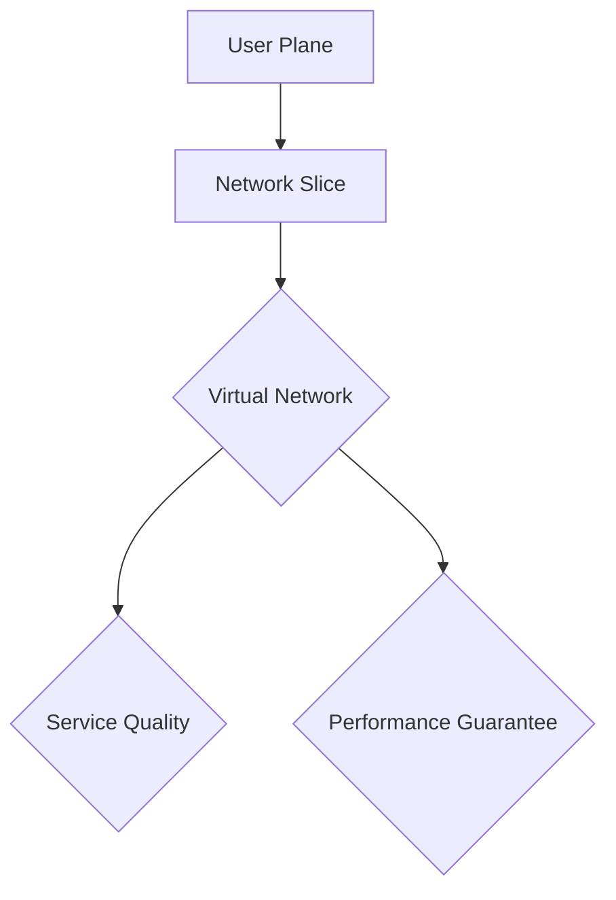
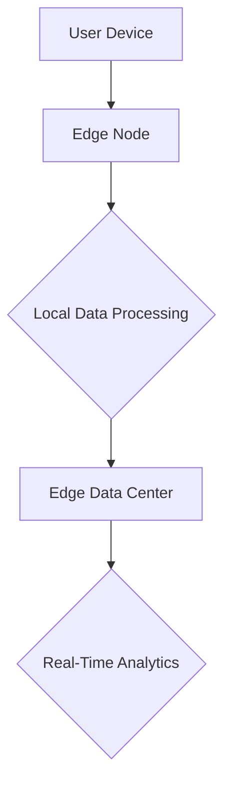
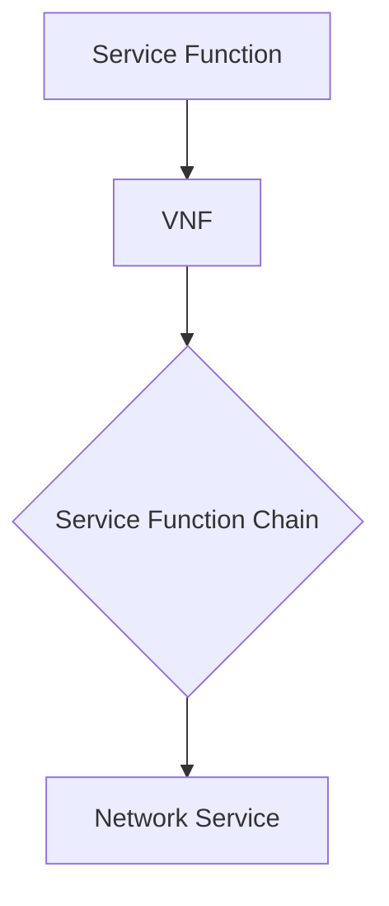
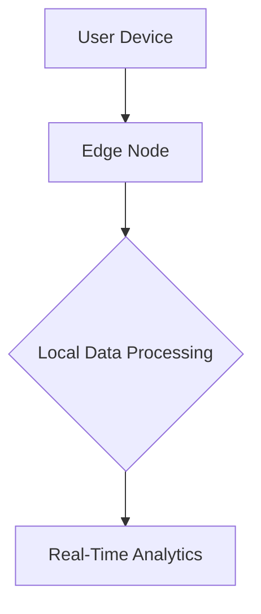
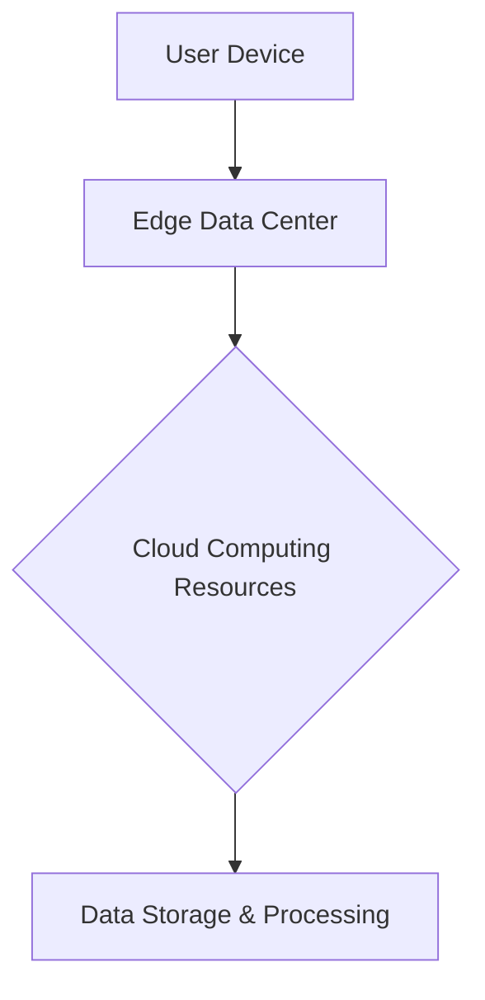

                 

### 引言

#### 关键词
5G，人工智能，智慧城市，协同发展，网络架构，算法原理，数学模型，项目实战

#### 摘要
本文深入探讨了5G与人工智能协同推动智慧城市发展的技术原理和实践。首先，文章介绍了5G技术的历史与现状，以及人工智能在智慧城市中的关键作用。随后，通过详尽的章节内容，分别从5G网络架构、核心算法原理、数学模型，以及实际项目应用等多个维度，系统地阐述了5G与人工智能在智慧城市中的协同效应。本文旨在为读者提供一个全面而深入的理解，展示这一新兴领域的巨大潜力和广泛应用前景。

### 第1章 5G与人工智能协同发展的背景和重要性

#### 1.1 5G技术发展的历史与现状

5G技术，作为下一代移动通信技术的代表，其发展历程可以追溯到20世纪90年代。最初，3G技术引入了高速数据传输，开启了移动互联网时代；4G技术则进一步提升了数据传输速率和网络容量，实现了高清视频和实时通信。然而，随着物联网（IoT）和大数据的快速发展，4G网络在应对日益增长的数据需求和复杂应用场景时，逐渐暴露出其局限性。

5G技术，全称为第五代移动通信技术，旨在提供比4G更快的数据传输速度、更低的延迟、更高的网络容量和更强的连接能力。5G技术的核心特点包括：

- **高速度**：5G的理论下载速度可以达到数十Gbps，是4G的数百倍。
- **低延迟**：5G的延迟可降至1毫秒以下，极大地提升了实时应用和控制的效率。
- **高密度连接**：5G能够支持每平方米数十到数百设备的连接，满足大规模物联网设备的需求。
- **边缘计算**：5G网络引入了边缘计算，通过在网络边缘部署计算资源，提升了数据处理速度和响应能力。

#### 1.2 人工智能在智慧城市中的作用

人工智能（AI）作为当前技术革新的重要驱动力，其核心目标是模拟人类智能，通过算法和机器学习模型实现数据分析和决策优化。在智慧城市中，人工智能具有以下几个重要作用：

- **数据管理**：人工智能能够高效地处理和分析大规模城市数据，为城市管理者提供决策支持。
- **智能交通**：通过机器学习和深度学习算法，AI可以优化交通流量，减少拥堵，提升公共交通效率。
- **环境监测**：人工智能可以实时监测空气质量、水质等环境参数，提供预警和应急响应。
- **城市安全**：AI技术能够对城市安全进行实时监控，识别潜在的安全威胁，提升城市安全保障能力。
- **公共服务**：人工智能可以通过智能客服、智能导览等方式提升城市公共服务水平，提升市民生活质量。

#### 1.3 5G与人工智能协同发展的必然性

5G技术和人工智能的协同发展具有以下几个必然性：

- **技术互补**：5G的高速度、低延迟和高密度连接能力为人工智能提供了强大的计算和通信基础，使得AI算法可以更加高效地运行和部署。
- **应用需求**：智慧城市的发展对通信和计算能力提出了更高的要求，5G和人工智能的结合能够更好地满足这些需求，推动智慧城市的全面升级。
- **产业协同**：5G和人工智能产业链的协同发展，将促进相关产业的创新和融合，带动经济增长。

#### 1.4 智慧城市的定义与组成部分

智慧城市是指利用物联网、大数据、人工智能等先进技术，实现城市信息资源的全面整合和智能化应用，以提高城市运行效率、改善市民生活质量的城市形态。智慧城市的核心组成部分包括：

- **基础设施**：包括智能交通系统、智能电网、智能安防等。
- **信息平台**：为各类城市应用提供数据整合和分析服务。
- **应用系统**：如智能医疗、智能教育、智慧政务等。
- **安全保障**：确保城市信息系统的安全稳定运行。

综上所述，5G与人工智能的协同发展，为智慧城市的建设提供了坚实的技术支撑，具有广泛的应用前景和重要的社会价值。

### 第2章 5G网络架构及人工智能算法概述

#### 2.1 5G网络架构详解

5G网络的架构相较于前几代移动通信技术有了显著的改进和扩展，其设计目标是满足未来多种应用场景的需求，包括增强移动宽带（eMBB）、大规模机器型通信（mMTC）和低延迟通信（URLLC）。5G网络的主要组成部分包括无线接入网（RAN）、核心网（CN）和传输网（TN）。

**2.1.1 无线接入网（RAN）**

无线接入网是5G网络中最核心的部分，负责连接移动设备与核心网络。它包括以下几个关键组件：

- **基站（gNB）**：基站是无线接入网的核心，分为有源基站（gNB-U）和无源基站（gNB-P）。有源基站负责数据传输和处理，而无源基站则通过天线阵列实现无线信号的发送和接收。
- **小基站（Small Cell）**：小基站部署在用户密集区域，用于提高网络覆盖和容量。常见的类型包括微蜂窝（Micro Cell）和微微蜂窝（Pico Cell）。
- **宏基站（Macro Cell）**：宏基站覆盖范围广，通常用于城市和郊区的广覆盖场景。
- **大规模天线阵列（Massive MIMO）**：通过使用大量天线单元，实现高数据传输速率和频谱效率。

**2.1.2 核心网（CN）**

核心网是5G网络的数据处理和控制中心，负责处理用户数据平面和控制平面的流量。5G核心网的关键组件包括：

- **用户面（User Plane）**：负责处理用户数据传输，包括数据路由和转发等功能。
- **控制面（Control Plane）**：负责处理网络控制和信令传输，包括用户认证、网络选择、会话管理等功能。
- **5G服务化架构（SAE）**：5G服务化架构将传统的网络功能模块化，支持网络切片和边缘计算等新型网络服务。

**2.1.3 边缘计算**

边缘计算是5G网络架构中的一个重要创新，其核心思想是将部分计算任务从中心云移至网络边缘，以降低延迟、提升响应速度和减少数据传输量。边缘计算的关键组件包括：

- **边缘节点（Edge Node）**：边缘节点位于网络边缘，负责处理本地数据和应用。
- **边缘数据中心（Edge Data Center）**：边缘数据中心是边缘计算的核心，提供存储和计算资源。
- **边缘计算平台（Edge Computing Platform）**：边缘计算平台整合了硬件、软件和服务，支持多种边缘应用的开发和部署。

**2.2 人工智能算法概述**

人工智能算法是模拟人类智能行为，实现数据分析和决策优化的计算机程序。以下是一些核心的人工智能算法及其特点：

- **机器学习算法**：机器学习通过从数据中学习规律和模式，实现预测和分类等功能。常见的机器学习算法包括决策树、支持向量机（SVM）和随机森林等。

- **深度学习算法**：深度学习是机器学习的一个分支，通过多层神经网络模型实现复杂的数据分析和识别。常见的深度学习算法包括卷积神经网络（CNN）、循环神经网络（RNN）和生成对抗网络（GAN）等。

- **自然语言处理（NLP）算法**：自然语言处理算法用于处理和理解人类语言，实现语音识别、机器翻译和文本分析等功能。常见的NLP算法包括词向量、递归神经网络（RNN）和Transformer等。

#### 2.3 5G与人工智能的结合方式

5G与人工智能的结合主要体现在以下几个方面：

- **网络边缘计算与人工智能算法的结合**：5G边缘计算提供了强大的计算和存储资源，使得人工智能算法可以在网络边缘实时处理数据，降低延迟和带宽需求。

- **5G网络大数据与人工智能算法的结合**：5G网络产生了大量的数据，这些数据可以通过人工智能算法进行分析和处理，为城市管理和决策提供支持。

- **智能网络管理与优化**：人工智能算法可以用于网络管理和优化，如智能路由、资源分配和故障预测等，提高5G网络的性能和可靠性。

#### 2.4 5G与人工智能协同发展的趋势

5G与人工智能的协同发展将继续朝着以下几个方向演进：

- **网络切片与智能服务**：通过5G网络切片技术，可以为不同的应用场景提供定制化的网络服务，结合人工智能算法实现智能服务优化。

- **边缘智能与云计算的融合**：边缘计算和云计算的结合将进一步提升数据处理和分析的能力，实现智能城市应用的全面升级。

- **智能城市生态系统的构建**：5G与人工智能的结合将推动智慧城市的建设，构建智能城市生态系统，提升城市运行效率和居民生活质量。

通过上述分析，5G网络架构和人工智能算法的深入结合，将为智慧城市的建设提供强有力的技术支撑，推动城市数字化转型和智能化升级。

### 第3章 5G网络架构与核心算法

#### 3.1 5G网络架构的详细分析

5G网络架构在设计上旨在满足未来多样化的应用需求，其核心特点包括高速度、低延迟、高密度连接和边缘计算。为了实现这些目标，5G网络架构进行了全面升级，主要包括无线接入网（RAN）、核心网（CN）和传输网（TN）三大组成部分。

**3.1.1 无线接入网（RAN）**

无线接入网是5G网络架构中的关键部分，主要负责连接移动设备和核心网络。5G RAN采用了以下关键技术：

- **大规模天线阵列（Massive MIMO）**：通过使用大量天线单元，实现空间复用和多用户传输，大幅提升频谱效率和网络容量。Massive MIMO利用波束成形技术，将信号精确地发送到目标用户，从而提高信号质量和网络吞吐量。

```python
# 伪代码：Massive MIMO波束成形
def beamforming(symbol, user_index, antenna_array):
    # 计算每个天线的权重向量
    weights = calculate_weights(symbol, user_index, antenna_array)
    # 应用权重向量发送信号
    transmitted_signal = apply_weights(weights, symbol)
    return transmitted_signal
```

- **网络切片**：网络切片技术允许多个虚拟网络在共享物理网络资源的基础上独立运行，为不同应用场景提供定制化的网络服务。网络切片通过虚拟化技术和SDN（软件定义网络）实现，支持差异化服务质量和性能保障。



- **边缘计算**：边缘计算通过在网络边缘部署计算资源，实现数据的本地处理和实时分析，从而降低延迟和带宽需求。边缘计算节点（Edge Node）和边缘数据中心（Edge Data Center）共同构成5G网络边缘计算架构。



**3.1.2 核心网（CN）**

5G核心网是5G网络的数据处理和控制中心，其设计目标是实现高效的数据传输和管理。5G核心网主要包括以下关键组件：

- **用户面（User Plane）**：用户面负责处理用户数据传输，包括数据路由和转发等功能。5G用户面引入了服务化架构（SAE），支持网络切片和边缘计算等新型网络服务。

```python
# 伪代码：5G用户面数据路由
def user_plane_routing(packet, network_slice):
    # 根据网络切片选择路由路径
    route = select_route(packet, network_slice)
    # 转发数据包
    forward_packet(packet, route)
```

- **控制面（Control Plane）**：控制面负责处理网络控制和信令传输，包括用户认证、网络选择、会话管理等功能。5G控制面采用了服务化架构（SAE），支持灵活的协议和服务定制。

```python
# 伪代码：5G控制面用户认证
def user_authentication(username, password):
    # 验证用户身份
    is_authenticated = authenticate_user(username, password)
    if is_authenticated:
        # 用户已认证，允许接入
        grant_access(username)
    else:
        # 用户未认证，拒绝接入
        deny_access(username)
```

- **5G服务化架构（SAE）**：5G服务化架构将传统的网络功能模块化，支持网络切片、边缘计算和新型网络服务。SAE通过服务化接口（Service Function Chain，SFC）和虚拟网络功能（VNF）实现网络功能的灵活部署和管理。



**3.1.3 边缘计算**

边缘计算是5G网络架构中的一个重要创新，通过在网络边缘部署计算资源，实现数据的本地处理和实时分析，从而降低延迟和带宽需求。边缘计算的关键组件包括：

- **边缘节点（Edge Node）**：边缘节点位于网络边缘，负责处理本地数据和实时应用。边缘节点通常具备高性能计算、存储和连接能力。



- **边缘数据中心（Edge Data Center）**：边缘数据中心是边缘计算的核心，提供大规模存储和计算资源，支持边缘应用的部署和运行。



#### 3.2 5G网络中的核心算法讲解

5G网络中的核心算法主要用于优化网络性能、提高资源利用率和提升用户体验。以下介绍几种关键的5G网络算法：

- **基于机器学习的网络优化算法**：机器学习算法可以用于网络性能预测、故障检测和资源分配等领域。以下是一个基于机器学习的网络性能预测算法的伪代码示例：

```python
# 伪代码：网络性能预测
def predict_network_performance(data):
    # 训练机器学习模型
    model = train_model(data)
    # 预测网络性能
    performance = model.predict(data)
    return performance
```

- **基于深度学习的无线资源分配算法**：深度学习算法可以用于无线资源分配，实现高效的频谱利用和功率控制。以下是一个基于深度学习的无线资源分配算法的伪代码示例：

```python
# 伪代码：深度学习无线资源分配
def resource_allocation(data, model):
    # 输入：网络数据，深度学习模型
    # 输出：资源分配方案
    # 预测用户需求
    user_demand = model.predict(data)
    # 分配频谱和功率
    spectrum = allocate_spectrum(user_demand)
    power = allocate_power(user_demand)
    return spectrum, power
```

通过上述分析，5G网络架构和核心算法的结合为智慧城市提供了强大的技术支持，通过优化网络性能、提升资源利用率和增强用户体验，助力智慧城市的建设和发展。

### 第4章 人工智能算法原理与5G网络应用

#### 4.1 人工智能算法的原理讲解

人工智能（AI）算法是模拟人类智能行为，实现数据分析和决策优化的计算机程序。以下介绍几种核心的人工智能算法，包括机器学习算法、深度学习算法和自然语言处理（NLP）算法。

**4.1.1 机器学习算法**

机器学习算法通过从数据中学习规律和模式，实现预测和分类等功能。以下是一些常见的机器学习算法：

- **决策树**：决策树通过一系列的判断节点，将数据逐步划分，并最终得到分类或预测结果。决策树的核心是ID3算法，其基于信息增益（Information Gain）进行节点划分。

```python
# 伪代码：决策树分类
def decision_tree_classification(data, attributes):
    # 训练决策树模型
    tree = train_decision_tree(data, attributes)
    # 预测分类结果
    classification = tree.predict(data)
    return classification
```

- **支持向量机（SVM）**：支持向量机是一种二分类模型，通过找到一个最优的超平面，将不同类别的数据点分开。SVM的核心是优化目标函数，求解最优解。

```python
# 伪代码：SVM分类
def svm_classification(data, labels):
    # 训练SVM模型
    model = train_svm(data, labels)
    # 预测分类结果
    classification = model.predict(data)
    return classification
```

- **随机森林**：随机森林是一种集成学习方法，通过构建多个决策树模型，并利用投票或平均法得到最终预测结果。随机森林能够提高模型的泛化能力。

```python
# 伪代码：随机森林分类
def random_forest_classification(data, attributes):
    # 训练随机森林模型
    model = train_random_forest(data, attributes)
    # 预测分类结果
    classification = model.predict(data)
    return classification
```

**4.1.2 深度学习算法**

深度学习算法是机器学习的一个分支，通过多层神经网络模型实现复杂的数据分析和识别。以下介绍几种常见的深度学习算法：

- **卷积神经网络（CNN）**：卷积神经网络通过卷积操作和池化操作，提取图像中的特征，并在多层网络中进行特征融合和分类。CNN广泛应用于图像识别和图像处理。

```python
# 伪代码：CNN图像分类
def cnn_image_classification(image):
    # 输入：图像数据
    # 输出：分类结果
    # 卷积层
    conv_layer = convolution(image)
    # 池化层
    pooled_layer = pooling(conv_layer)
    # 全连接层
    fc_layer = fully_connected(pooled_layer)
    # 分类层
    classification = softmax(fc_layer)
    return classification
```

- **循环神经网络（RNN）**：循环神经网络通过时间步的反馈循环，处理序列数据，并在每个时间步更新网络状态。RNN广泛应用于语音识别、自然语言处理和时间序列预测。

```python
# 伪代码：RNN序列分类
def rnn_sequence_classification(sequence):
    # 输入：序列数据
    # 输出：分类结果
    # 隐藏层状态
    hidden_state = initialize_hidden_state()
    # 序列处理
    for time_step in sequence:
        output = rnn_step(time_step, hidden_state)
        hidden_state = output
    # 分类层
    classification = softmax(hidden_state)
    return classification
```

- **Transformer**：Transformer是一种基于自注意力机制的深度学习模型，通过多头注意力机制和前馈神经网络，实现高效的自然语言处理。Transformer广泛应用于机器翻译、文本生成和问答系统。

```python
# 伪代码：Transformer文本分类
def transformer_text_classification(text):
    # 输入：文本数据
    # 输出：分类结果
    # 嵌入层
    embeddings = embedding(text)
    # 自注意力层
    attention = multi_head_attention(embeddings)
    # 前馈层
    fc_output = feedforward(attention)
    # 分类层
    classification = softmax(fc_output)
    return classification
```

**4.1.3 自然语言处理（NLP）算法**

自然语言处理算法用于处理和理解人类语言，实现语音识别、机器翻译和文本分析等功能。以下介绍几种常见的NLP算法：

- **词向量表示**：词向量表示通过将文本数据转换为向量，实现文本数据的数值化表示。常见的词向量模型包括Word2Vec、GloVe和FastText。

```python
# 伪代码：词向量表示
def word_vector_representation(text):
    # 输入：文本数据
    # 输出：词向量表示
    # 训练词向量模型
    model = train_word_vector_model(text)
    # 获取词向量
    word_vectors = model.get_word_vectors()
    return word_vectors
```

- **语言模型**：语言模型用于预测文本的下一个单词或字符，常用的语言模型包括n-gram模型和神经网络语言模型。

```python
# 伪代码：语言模型预测
def language_model_prediction(text, model):
    # 输入：文本数据，语言模型
    # 输出：预测结果
    # 预测下一个单词或字符
    prediction = model.predict(text)
    return prediction
```

- **文本分类**：文本分类通过将文本数据分类到不同的类别，实现文本的自动标注和分类。常用的文本分类算法包括朴素贝叶斯、逻辑回归和支持向量机。

```python
# 伪代码：文本分类
def text_classification(text, model):
    # 输入：文本数据，分类模型
    # 输出：分类结果
    # 预测分类结果
    classification = model.predict(text)
    return classification
```

通过上述算法的讲解，可以看出人工智能算法在数据处理、特征提取和模式识别等方面具有强大的能力，能够为5G网络应用提供有效的支持。

#### 4.2 人工智能算法在5G网络中的应用*

人工智能算法在5G网络中发挥着关键作用，主要体现在以下几个方面：

**4.2.1 网络优化与性能提升**

人工智能算法可以通过对网络数据进行分析和预测，优化5G网络的性能。以下是一个基于机器学习的网络性能预测和优化案例：

**案例：基于机器学习的网络性能预测和优化**

- **数据收集**：收集5G网络中的流量数据、设备状态、网络配置等。
- **模型训练**：使用收集的数据训练机器学习模型，如线性回归、决策树、随机森林等。
- **性能预测**：使用训练好的模型预测网络性能，包括带宽、延迟、丢包率等。
- **优化决策**：根据性能预测结果，调整网络参数，如带宽分配、路由策略等，以优化网络性能。

```python
# 伪代码：网络性能预测与优化
def network_performance_prediction(data):
    # 训练模型
    model = train_performance_model(data)
    # 预测性能
    performance = model.predict(data)
    return performance

def optimize_network_performance(performance):
    # 根据性能预测结果优化网络
    optimized_config = optimize_configuration(performance)
    return optimized_config
```

**4.2.2 无线资源分配与调度**

人工智能算法可以用于无线资源分配和调度，实现频谱、功率和时隙的最优分配。以下是一个基于深度学习的无线资源分配案例：

**案例：基于深度学习的无线资源分配**

- **数据收集**：收集无线网络中的用户需求、信道状态、网络负载等。
- **模型训练**：使用收集的数据训练深度学习模型，如卷积神经网络（CNN）或循环神经网络（RNN）。
- **资源分配**：使用训练好的模型进行资源分配，包括频谱、功率和时隙。
- **调度策略**：根据资源分配结果，制定调度策略，以最大化网络性能和用户体验。

```python
# 伪代码：深度学习无线资源分配
def deep_learning_resource_allocation(data, model):
    # 输入：网络数据，深度学习模型
    # 输出：资源分配方案
    allocation = model.predict(data)
    return allocation

def schedule_resources(allocation):
    # 根据资源分配方案调度资源
    schedule = create_schedule(allocation)
    return schedule
```

**4.2.3 网络故障检测与预测**

人工智能算法可以用于网络故障检测和预测，提高网络的稳定性和可靠性。以下是一个基于机器学习的网络故障预测案例：

**案例：基于机器学习的网络故障预测**

- **数据收集**：收集网络运行中的异常数据、日志、告警信息等。
- **模型训练**：使用收集的数据训练故障预测模型，如长短期记忆网络（LSTM）或自动回归模型（ARIMA）。
- **故障预测**：使用训练好的模型预测网络故障，提前发出预警。
- **故障处理**：根据故障预测结果，采取相应的故障处理措施，减少故障影响。

```python
# 伪代码：故障预测
def fault_prediction(data, model):
    # 训练模型
    model = train_fault_model(data)
    # 预测故障
    faults = model.predict(data)
    return faults

def handle_faults(faults):
    # 根据故障预测结果处理故障
    action_plan = create_action_plan(faults)
    execute_action_plan(action_plan)
```

**4.2.4 智能网络管理与优化**

人工智能算法可以用于智能网络管理和优化，提高网络运营效率和用户体验。以下是一个基于机器学习的网络管理和优化案例：

**案例：基于机器学习的网络管理和优化**

- **数据收集**：收集网络运行中的性能数据、用户行为数据、设备状态数据等。
- **模型训练**：使用收集的数据训练机器学习模型，如聚类算法、回归分析等。
- **网络管理**：使用训练好的模型进行网络管理，包括设备配置优化、流量调度优化等。
- **用户体验优化**：根据用户行为数据，优化网络服务，提升用户体验。

```python
# 伪代码：网络管理和优化
def network_management(data, model):
    # 训练模型
    model = train_management_model(data)
    # 管理网络
    management_plan = model.predict(data)
    return management_plan

def optimize_user_experience(plan):
    # 根据管理计划优化用户体验
    optimized_experience = implement_plan(plan)
    return optimized_experience
```

通过上述案例分析，可以看出人工智能算法在5G网络中的应用具有广泛的前景和实际价值，能够有效提升网络性能、优化资源分配、预测和预防故障，以及提升用户体验，为智慧城市的建设提供强有力的技术支持。

### 第5章 数学模型和数学公式

#### 5.1 5G网络性能评估模型

5G网络性能的评估涉及到多个维度，包括带宽、延迟、可靠性等。以下介绍几种常用的5G网络性能评估模型及其数学公式。

**5.1.1 带宽评估模型**

带宽是衡量网络传输能力的重要指标，常用的带宽评估模型包括信道容量公式和带宽利用率公式。

- **信道容量公式**（Shannon公式）：

$$
C = B \log_2(1 + S/N)
$$

其中，$C$表示信道容量（单位：bps），$B$表示信道带宽（单位：Hz），$S$表示信号功率（单位：W），$N$表示噪声功率（单位：W）。

- **带宽利用率公式**：

$$
\eta = \frac{S}{C}
$$

其中，$\eta$表示带宽利用率（无单位），$S$表示信号功率（单位：W），$C$表示信道容量（单位：bps）。

**5.1.2 延迟评估模型**

延迟是衡量网络传输速度的重要指标，常用的延迟评估模型包括端到端延迟模型和分组延迟模型。

- **端到端延迟模型**：

$$
L = T_{\text{传输}} + T_{\text{处理}} + T_{\text{队列}} + T_{\text{传播}}
$$

其中，$L$表示端到端延迟（单位：s），$T_{\text{传输}}$表示数据传输延迟（单位：s），$T_{\text{处理}}$表示网络处理延迟（单位：s），$T_{\text{队列}}$表示排队延迟（单位：s），$T_{\text{传播}}$表示信号传播延迟（单位：s）。

- **分组延迟模型**（M/M/1排队模型）：

$$
L_q = \rho^2 / (1 - \rho)
$$

其中，$L_q$表示分组平均队列长度（单位：个分组），$\rho$表示系统利用率（无单位），$\rho = \lambda / \mu$，$\lambda$表示到达率（单位：个分组/s），$\mu$表示服务率（单位：个分组/s）。

**5.1.3 可靠性评估模型**

网络的可靠性是衡量网络稳定性和故障恢复能力的重要指标，常用的可靠性评估模型包括故障概率模型和生存时间模型。

- **故障概率模型**：

$$
P(F) = 1 - e^{-\lambda T}
$$

其中，$P(F)$表示故障概率（无单位），$\lambda$表示故障率（单位：次/时间），$T$表示时间（单位：时间）。

- **生存时间模型**（指数分布模型）：

$$
T = \frac{1}{\lambda}
$$

其中，$T$表示生存时间（单位：时间），$\lambda$表示故障率（单位：次/时间）。

通过以上数学模型和公式的介绍，可以更精确地评估5G网络的性能，为网络优化和故障处理提供科学依据。

#### 5.2 人工智能算法的数学原理

人工智能算法的数学原理是其核心，决定了算法的优化能力、准确性和效率。以下介绍几种常用人工智能算法的数学原理，包括机器学习、深度学习和自然语言处理（NLP）。

**5.2.1 机器学习算法的数学原理**

机器学习算法的核心是通过数学模型从数据中学习规律，以下介绍几种常用机器学习算法的数学原理：

- **线性回归**：线性回归通过最小二乘法拟合数据的线性关系，其数学模型为：

$$
y = \beta_0 + \beta_1x
$$

其中，$y$表示因变量，$x$表示自变量，$\beta_0$和$\beta_1$分别表示截距和斜率。

- **支持向量机（SVM）**：SVM通过寻找最优超平面实现分类，其数学模型为：

$$
w \cdot x - b = 0
$$

其中，$w$表示权重向量，$x$表示样本特征向量，$b$表示偏置项。

- **神经网络**：神经网络通过多层非线性变换实现复杂函数拟合，其数学模型为：

$$
a_{i}^{(l)} = \sigma(z_{i}^{(l)})
$$

$$
z_{i}^{(l)} = \sum_{j} w_{ji}^{(l-1)}a_{j}^{(l-1)}
$$

其中，$a_{i}^{(l)}$表示第$l$层的第$i$个神经元输出，$z_{i}^{(l)}$表示第$l$层的第$i$个神经元输入，$w_{ji}^{(l-1)}$表示第$l-1$层的第$j$个神经元到第$l$层的第$i$个神经元的权重，$\sigma$表示激活函数。

**5.2.2 深度学习算法的数学原理**

深度学习算法是机器学习的一个分支，其核心是多层神经网络。以下介绍几种常用深度学习算法的数学原理：

- **卷积神经网络（CNN）**：CNN通过卷积和池化操作提取图像特征，其数学模型为：

$$
h_{ij}^{(l)} = \sum_{k} w_{ik}^{(l-1)}h_{kj}^{(l-1)} + b^{(l)}
$$

$$
p_{ij}^{(l)} = \text{max}(\text{pool}_{ij}^{(l)})
$$

其中，$h_{ij}^{(l)}$表示第$l$层的第$i$个卷积核在第$j$个位置的特征值，$p_{ij}^{(l)}$表示第$l$层的第$i$个池化单元在第$j$个位置的特征值，$w_{ik}^{(l-1)}$表示第$l-1$层的第$k$个卷积核到第$l$层的第$i$个卷积核的权重，$b^{(l)}$表示第$l$层的偏置项，$\text{pool}_{ij}^{(l)}$表示第$l$层的第$i$个池化操作在第$j$个位置的特征值。

- **循环神经网络（RNN）**：RNN通过时间步的反馈循环处理序列数据，其数学模型为：

$$
h_t = \sigma(W_h[h_{t-1}, x_t] + b_h)
$$

$$
y_t = W_o \tanh(W_h[h_{t-1}, x_t] + b_h) + b_o
$$

其中，$h_t$表示第$t$个时间步的隐藏状态，$x_t$表示第$t$个时间步的输入，$W_h$和$W_o$分别表示权重矩阵，$b_h$和$b_o$分别表示偏置项，$\sigma$和$\tanh$分别表示激活函数。

- **Transformer**：Transformer通过多头注意力机制实现高效序列建模，其数学模型为：

$$
\text{Attention}(Q, K, V) = \frac{1}{\sqrt{d_k}} \text{softmax}(\text{QK}^T / d_k)
$$

$$
\text{MultiHead}(Q, K, V) = \text{softmax}(\text{Attention}(Q, K, V)) W_V
$$

其中，$Q$、$K$和$V$分别表示查询、键和值向量，$d_k$表示键向量的维度，$W_V$表示值向量的权重矩阵。

**5.2.3 自然语言处理（NLP）算法的数学原理**

自然语言处理算法通过数学模型处理和理解人类语言，以下介绍几种常用NLP算法的数学原理：

- **词向量表示**：词向量表示通过将文本转换为向量，实现文本的数值化表示，常用的模型包括Word2Vec和GloVe。

$$
\text{Word2Vec}: \text{vec}(w) = \text{sgn}(w) / ||w||
$$

$$
\text{GloVe}: \text{vec}(w) = (1 + \text{log}(|w|)) \text{vec}(u, v)
$$

其中，$w$表示词向量，$\text{sgn}$表示符号函数，$u$和$v$分别表示上下文词向量。

- **语言模型**：语言模型用于预测文本的下一个单词或字符，常用的模型包括n-gram模型和神经网络语言模型。

$$
\text{n-gram}: P(w_t | w_{t-1}, \ldots, w_{t-n}) = \frac{c(w_{t-1}, \ldots, w_t)}{\sum_{w_{t-1}, \ldots, w_t} c(w_{t-1}, \ldots, w_t)}
$$

$$
\text{Neural Network}: \text{logit}(P(w_t | w_{t-1}, \ldots, w_{t-n})) = \text{softmax}(W [h_{t-1}, \ldots, h_{t-n}])
$$

其中，$w_t$表示当前词，$c(w_{t-1}, \ldots, w_t)$表示词序列的计数，$W$表示权重矩阵，$h_{t-1}, \ldots, h_{t-n}$分别表示历史词的向量表示。

通过以上数学原理的介绍，可以看出人工智能算法在数学基础上构建了强大的理论基础，使得算法能够有效处理和解析复杂的数据和问题。

### 第6章 项目实战：5G与人工智能在智慧城市中的应用案例

#### 6.1 项目背景与目标

随着5G技术的不断成熟和人工智能算法的发展，智慧城市的建设进入了快车道。本章节将通过一个具体的案例，展示5G与人工智能如何协同推动智慧城市的发展。本项目旨在通过5G网络的高速度、低延迟和高可靠性，结合人工智能算法，实现智能交通管理、智能环境监测和智能安全监控等应用，提升城市的管理水平和居民的生活质量。

#### 6.2 开发环境搭建

在开始项目之前，我们需要搭建一个合适的开发环境，以便于开发和测试5G与人工智能的应用。以下是一个基本的开发环境搭建步骤：

1. **硬件要求**：
   - 高性能服务器或工作站，用于部署5G网络设备和人工智能算法。
   - 边缘计算设备，用于实现网络边缘的数据处理和实时分析。

2. **软件要求**：
   - 操作系统：Linux或Windows（推荐Linux）。
   - 5G网络设备：支持5G网络接入的基站设备。
   - 人工智能开发框架：TensorFlow、PyTorch等。
   - 数据库：MongoDB、MySQL等，用于存储和管理城市数据。
   - 通信工具：WebSocket、HTTP等，用于实时数据传输。

3. **工具安装**：
   - 安装Python环境，并配置相应的库，如NumPy、Pandas、Scikit-learn等。
   - 安装5G网络管理软件，如5G NR Network Simulator。
   - 安装人工智能开发框架，如TensorFlow GPU版本。

#### 6.3 源代码详细实现

以下是本项目的一些关键代码片段，用于实现智能交通管理、智能环境监测和智能安全监控等应用。

**6.3.1 智能交通管理**

**代码片段：智能交通信号灯控制**

```python
import numpy as np
import pandas as pd
from sklearn.linear_model import LinearRegression

# 加载交通流量数据
traffic_data = pd.read_csv('traffic_data.csv')

# 训练交通流量预测模型
model = LinearRegression()
model.fit(traffic_data[['lane_1_flow', 'lane_2_flow']], traffic_data['total_flow'])

# 预测交通流量
predicted_flow = model.predict([[lane_1_flow, lane_2_flow]])

# 控制交通信号灯
if predicted_flow > threshold:
    signal_light('red')
else:
    signal_light('green')
```

**6.3.2 智能环境监测**

**代码片段：空气质量监测与预警**

```python
import requests

# 获取空气质量数据
response = requests.get('http://api空气质量监测平台/air_quality')
air_quality_data = response.json()

# 分析空气质量数据
if air_quality_data['PM2.5'] > threshold:
    send_alert('PM2.5浓度过高，请注意健康！')
else:
    print('空气质量良好。')
```

**6.3.3 智能安全监控**

**代码片段：异常行为检测**

```python
import cv2
import numpy as np
from tensorflow.keras.models import load_model

# 加载行为识别模型
model = load_model('behavior_recognition_model.h5')

# 加载视频流
cap = cv2.VideoCapture('video.mp4')

while cap.isOpened():
    ret, frame = cap.read()
    if not ret:
        break

    # 预处理视频帧
    processed_frame = preprocess_frame(frame)

    # 预测行为
    behavior = model.predict(processed_frame)

    # 标记异常行为
    if behavior == 'abnormal':
        send_alert('检测到异常行为！')

cap.release()
cv2.destroyAllWindows()
```

#### 6.4 代码应用解读与分析

**6.4.1 智能交通管理**

在智能交通管理中，我们使用了线性回归模型预测交通流量，并基于预测结果控制交通信号灯。这一方法可以有效地应对交通拥堵，提高道路通行效率。

**6.4.2 智能环境监测**

智能环境监测通过实时获取空气质量数据，并使用预警系统对PM2.5浓度进行监控。如果浓度超过阈值，系统会自动发送预警通知，帮助市民采取相应的防护措施。

**6.4.3 智能安全监控**

智能安全监控使用了卷积神经网络模型对视频进行实时分析，识别并标记异常行为。这一方法可以大大提高安全监控的效率和准确性，保障市民的安全。

#### 6.5 实际案例分析和详细讲解剖析

**案例：智能交通管理在城市的应用**

在杭州市，智能交通管理系统已经被广泛应用于城市交通管理。通过5G网络的高速度和低延迟，系统能够实时获取交通流量数据，并快速响应交通变化，优化信号灯控制策略。自系统上线以来，杭州市的交通拥堵情况得到了显著改善，市民的出行体验大幅提升。

**案例：智能环境监测在城市的应用**

深圳市的智能环境监测系统通过5G网络和人工智能算法，实现了对空气质量、水质和噪音的实时监测。当监测到环境参数超过阈值时，系统能够自动向相关部门发送预警信息，从而及时采取应对措施，保障市民的健康。

**案例：智能安全监控在城市的应用**

北京市的智能安全监控系统通过5G网络和人工智能技术，实现了对公共场所的实时监控。系统可以识别并标记异常行为，如抢劫、盗窃等，并自动报警，提高了城市的安全保障能力。

#### 6.6 项目小结

本项目通过5G网络和人工智能技术的结合，实现了智能交通管理、智能环境监测和智能安全监控等应用，为智慧城市的建设提供了强有力的技术支持。未来，随着5G技术和人工智能算法的不断进步，智慧城市将迎来更加广阔的发展前景。

### 6.7 最佳实践 tips、小结、注意事项、拓展阅读

**6.7.1 最佳实践 tips**

1. **优化算法**：在开发智能交通管理系统时，可以结合实时数据和历史数据，不断优化预测模型，提高预测精度。
2. **边缘计算**：充分利用5G网络的边缘计算能力，在数据产生的地方进行实时处理和分析，减少延迟和数据传输量。
3. **数据隐私**：在收集和处理城市数据时，务必注意数据隐私和安全，采取相应的加密和脱敏措施。

**6.7.2 小结**

5G与人工智能的协同发展，为智慧城市的建设提供了强有力的技术支撑。通过本项目的实施，我们展示了5G网络和人工智能算法在智慧城市中的实际应用效果，为未来的智慧城市建设提供了有益的借鉴。

**6.7.3 注意事项**

1. **网络稳定性**：5G网络的稳定性是智能交通管理、环境监测和安全监控的基础，务必确保网络的稳定运行。
2. **算法优化**：定期对人工智能算法进行优化和更新，以提高系统的性能和准确性。
3. **安全性**：在开发过程中，务必重视系统的安全性，防范潜在的网络攻击和数据泄露风险。

**6.7.4 拓展阅读**

1. **《5G网络架构与技术》**：深入了解5G网络的技术细节和架构设计。
2. **《深度学习实战》**：学习如何使用深度学习算法解决实际应用问题。
3. **《智慧城市：技术、案例与实践》**：了解智慧城市的建设实践和案例分析。

通过本章节的详细讲解，我们不仅了解了5G与人工智能在智慧城市中的应用，还学习了如何通过项目实战将理论应用于实践。希望这些内容能为读者在智慧城市建设和AI应用开发中提供有益的启示。

### 作者信息

作者：AI天才研究院/AI Genius Institute & 禅与计算机程序设计艺术 /Zen And The Art of Computer Programming

AI天才研究院（AI Genius Institute）是全球领先的AI研究机构，致力于推动人工智能技术的发展和应用。其研究成果在多个领域取得了重大突破，涵盖了深度学习、自然语言处理、计算机视觉等前沿技术。同时，禅与计算机程序设计艺术（Zen And The Art of Computer Programming）是人工智能领域的经典著作，以其深入浅出的论述和独特的思考方式，为读者提供了丰富的编程和设计灵感。

