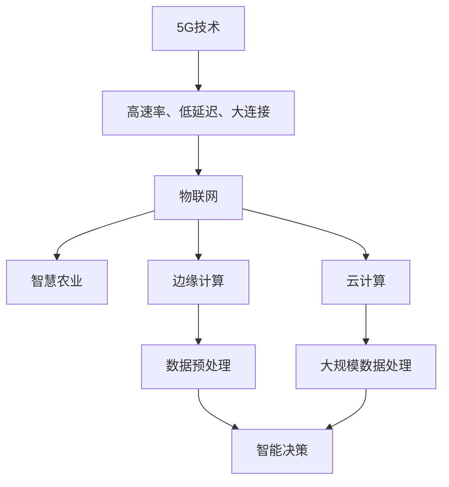

                 

### 引言

#### 智慧农业的兴起

随着全球人口的增长和可耕地的减少，农业面临着前所未有的挑战。为了提高农业生产效率，保障粮食安全，智慧农业的概念应运而生。智慧农业结合了物联网、大数据、云计算、人工智能等先进技术，通过实时监测、自动化管理和智能决策，实现了农业生产过程的智能化。这一变革不仅有助于提高产量和质量，还能节约资源，减少环境污染。

#### 5G技术的重要性

5G技术作为下一代通信技术，具有高速率、大连接、低延迟等特性，为物联网的发展提供了强有力的支持。在智慧农业中，5G技术的引入能够大幅提升传感器数据的传输速度和准确性，实现更高效的数据采集和处理。此外，5G网络的低延迟特性有助于实现远程控制，提高农业机械化和自动化的水平。

#### 物联网在智慧农业中的应用

物联网技术在智慧农业中发挥着重要作用。通过部署各种传感器和设备，农业环境、作物生长状态、农机设备等都可以实现实时监测和远程控制。物联网与5G技术的结合，使得农业生产变得更加智能化，能够更好地应对复杂多变的农业生产环境。

#### 5G与物联网在智慧农业中的协同效应

5G与物联网的协同应用，为智慧农业带来了巨大的潜力。5G技术的高速率和低延迟特性，使得大量传感器数据能够实时传输，为智能决策提供了坚实的基础。物联网技术的广泛应用，使得农业生产过程中的各个环节都能实现数据驱动，提高了生产效率和资源利用率。两者结合，不仅推动了智慧农业的发展，也为农业产业的转型升级提供了新思路。

#### 文章结构

本文将从以下几个部分展开讨论：

1. **5G技术概述**：介绍5G技术的概念、发展历程及其在智慧农业中的应用。
2. **物联网在农业中的应用**：分析物联网在智慧农业中的具体应用场景和优势。
3. **5G与物联网的协同效应**：探讨5G技术如何与物联网技术相互补充，共同推动智慧农业的发展。
4. **智慧农业生态系统**：介绍智慧农业生态系统的组成部分和整体架构。
5. **核心算法原理讲解**：详细阐述5G和物联网在智慧农业中应用的核心算法原理。
6. **数学模型**：介绍用于分析和优化智慧农业系统的数学模型。
7. **项目实战**：通过实际案例展示5G与物联网在智慧农业中的具体应用。
8. **总结与展望**：总结全文，并对未来智慧农业的发展趋势进行展望。

通过本文的讨论，我们将深入理解5G与物联网在智慧农业中的协同应用，探索这一新兴领域的巨大潜力。

### 关键词

- 智慧农业
- 5G技术
- 物联网
- 边缘计算
- 智能灌溉
- 云计算
- 数据分析

### 摘要

本文从智慧农业的背景出发，探讨了5G技术与物联网在智慧农业中的协同应用。首先，介绍了5G技术的基本概念和物联网在农业中的应用场景。接着，分析了5G与物联网的协同效应，包括高速数据传输、低延迟控制等优势。随后，详细阐述了智慧农业生态系统的构成和核心算法原理。最后，通过实际项目案例展示了5G与物联网在智慧农业中的具体应用，并对未来发展趋势进行了展望。本文旨在为读者提供关于智慧农业技术应用的全面理解和深入洞察。

### 背景介绍

#### 智慧农业的概念与发展

智慧农业是指利用先进的信息技术，特别是物联网、大数据、云计算、人工智能等，对农业生产过程进行实时监控、分析和优化，从而实现农业生产的自动化、智能化和高效化。智慧农业的目标是提高农业产出，节约资源消耗，减少环境污染，保障粮食安全。

智慧农业的发展历程可以追溯到20世纪90年代，随着计算机技术和网络通信技术的迅速发展，农业信息化逐渐成为可能。进入21世纪，物联网技术的兴起为农业生产提供了全新的手段。传感器、无人机、卫星遥感等技术的应用，使得农业生产数据的采集和处理能力大大增强。近年来，随着5G技术的逐步成熟，智慧农业的发展进入了新的阶段。

#### 5G技术的基本概念与发展历程

5G技术，即第五代移动通信技术，是继4G之后的下一代通信技术。5G技术的主要特点包括：

1. **高速率**：5G网络的理论峰值速率可达20Gbps，是4G网络的100倍以上，能够满足高清视频流、虚拟现实（VR）等高带宽应用的需求。
2. **低延迟**：5G网络的端到端延迟可低至1毫秒，极大地提升了实时控制和交互的能力。
3. **大连接**：5G网络能够支持数百万设备的连接，适用于大规模物联网应用。
4. **网络切片**：5G技术引入了网络切片技术，可以根据不同应用的需求，为不同的用户提供定制化的网络服务。

5G技术的发展历程可以追溯到2013年，国际电信联盟（ITU）正式提出5G的概念，并在随后的几年里，各国纷纷启动了5G技术研发和试验。2019年，5G正式商用，标志着移动通信技术进入了一个新的时代。

#### 5G技术在智慧农业中的应用

在智慧农业中，5G技术的应用主要体现在以下几个方面：

1. **数据采集与传输**：通过5G网络，传感器可以实时采集土壤湿度、气象数据、作物生长状态等，并快速传输到云端进行处理。这为精准农业提供了数据支持。
2. **远程控制与监控**：5G网络的低延迟特性，使得农业机械可以通过远程控制系统进行实时操作，提高了农业生产的自动化水平。
3. **智能决策**：基于5G网络的高速数据传输和云计算能力，农业专家可以远程获取作物生长数据，通过大数据分析和人工智能算法，提供科学的种植和管理建议。

#### 物联网在智慧农业中的应用

物联网技术是将各种物理设备通过网络连接起来，实现智能化管理和控制的技术。在智慧农业中，物联网的应用主要体现在以下几个方面：

1. **环境监测**：通过部署传感器网络，实时监测土壤湿度、气象数据、水质等环境参数，为农业生产提供数据支持。
2. **精准灌溉**：利用传感器和物联网技术，实现自动灌溉系统，根据土壤湿度和气象数据，自动调整灌溉量和时间，提高水资源利用效率。
3. **作物生长监测**：通过传感器网络监测作物的生长状态，包括叶片颜色、果实成熟度等，为精准施肥和病虫害防治提供依据。

#### 5G与物联网在智慧农业中的协同效应

5G技术与物联网技术在智慧农业中的协同应用，极大地提升了农业生产的智能化水平。5G技术提供了高速、低延迟的网络环境，使得大量传感器数据可以实时传输，为农业大数据分析和智能决策提供了基础。物联网技术则通过广泛的设备连接和智能控制，实现了农业生产的自动化和精细化。两者结合，不仅提高了农业生产效率，还促进了农业产业的转型升级。

### 核心概念与联系

为了深入理解5G与物联网在智慧农业中的协同应用，我们需要明确几个核心概念及其之间的联系。以下是这些概念的定义和它们在智慧农业中的关系架构。

#### 核心概念

1. **5G技术**：5G是第五代移动通信技术，其高速率、大连接、低延迟等特点，为智慧农业提供了强大的网络支持。
2. **物联网（IoT）**：物联网是通过网络将各种物理设备连接起来，实现智能化管理和控制的技术体系。在农业中，物联网通过传感器网络、自动化设备等，实现了对农业环境的实时监控和精准管理。
3. **智慧农业**：智慧农业是指利用物联网、大数据、人工智能等技术，对农业生产过程进行智能化管理和优化，以实现高效、环保、可持续发展的农业模式。
4. **边缘计算**：边缘计算是指将计算、存储和网络功能分布在网络边缘，以减少数据传输延迟，提高系统响应速度和处理能力。
5. **云计算**：云计算是一种通过互联网提供动态可伸缩且经常是虚拟化的资源，用于数据处理和存储的模式。

#### 关系架构

1. **5G与物联网的关系**：
   - **5G网络为物联网提供了高速、稳定的通信基础**，使得大量传感器数据能够实时传输到云端或边缘计算节点进行进一步处理。
   - **物联网设备是5G网络的重要应用场景**，通过物联网设备，农业生产者可以实现对农作物的实时监控和远程控制。

2. **智慧农业与5G/物联网的关系**：
   - **智慧农业是5G与物联网技术在农业领域的综合应用**，通过5G网络的高速率和低延迟特性，以及物联网的广泛连接和智能控制，实现了农业生产的自动化和智能化。
   - **智慧农业依赖于5G和物联网技术提供的数据采集、传输、处理和分析能力**，以实现精准农业和智能决策。

3. **边缘计算与云计算的关系**：
   - **边缘计算**是在靠近数据源的地方进行数据预处理和计算，以减少数据传输延迟，提高系统响应速度。
   - **云计算**则是通过互联网提供大规模的数据存储和计算资源，用于大规模数据分析和处理。
   - **两者结合**实现了从数据采集到处理分析的完整闭环，为智慧农业提供了强大的计算能力。

#### Mermaid流程图

为了更直观地展示这些概念之间的关系，我们可以使用Mermaid语言绘制一个流程图：



在这个流程图中，5G技术提供了高速、稳定的网络支持，物联网设备实现了数据的采集和传输，边缘计算和云计算则分别负责数据的预处理和大规模数据处理，最终为智慧农业提供了智能决策支持。

通过以上对核心概念与联系的介绍，我们可以更好地理解5G与物联网在智慧农业中的协同应用。接下来，我们将详细讲解5G和物联网在智慧农业中的具体应用原理。

### 核心算法原理讲解

#### 5G技术核心算法

1. **NSA/SA组网方式**

NSA（Non-Standalone Architecture，非独立组网）和SA（Standalone Architecture，独立组网）是5G网络的两种组网方式。

- **NSA组网**：在NSA组网中，5G网络依赖于4G网络的核心网，主要优点是部署速度快，成本相对较低。NSA组网适用于现有4G网络较为完善的地区，可以快速实现5G服务的覆盖。

- **SA组网**：SA组网则完全独立于4G网络，使用全新的5G核心网，能够提供更高的网络性能和更好的用户体验。SA组网适用于新建网络或者需要更高网络性能的场景。

2. **MIMO技术**

MIMO（Multiple Input Multiple Output，多输入多输出）技术是5G网络的关键技术之一。MIMO通过在发送端和接收端使用多个天线，实现了信号的并行传输，从而大幅提升了网络的传输速率和可靠性。

- **MIMO的基本原理**：MIMO利用空间复用技术，将多个信号通过不同路径同时发送和接收，从而提高信号的传输容量。MIMO可以分为单流MIMO和多流MIMO，多流MIMO的性能优势更为明显。

- **MIMO在智慧农业中的应用**：在智慧农业中，MIMO技术可以提高传感器数据的传输速率，确保实时监测数据的准确性。例如，通过多天线部署，可以实现大面积农田的实时监控，提高农业生产的自动化水平。

3. **网络切片技术**

网络切片技术是5G网络的重要特性，它允许运营商在网络中创建多个虚拟的子网络，每个子网络具有独立的配置和资源分配，满足不同应用场景的需求。

- **网络切片的基本原理**：网络切片通过虚拟化技术，将物理网络资源分割成多个逻辑网络，每个逻辑网络可以独立配置和管理。网络切片可以根据应用需求，动态调整网络资源，实现灵活的网络服务。

- **网络切片在智慧农业中的应用**：在智慧农业中，网络切片技术可以用于不同的应用场景，如环境监测、智能灌溉、农机监控等。通过为每个应用场景配置独立切片，可以确保数据传输的稳定性和安全性，提高智慧农业的整体效率。

#### 物联网技术核心算法

1. **传感器网络**

传感器网络是由大量传感器节点组成的网络，通过无线通信方式实现对环境信息的实时监测和传输。

- **传感器网络的基本原理**：传感器节点具有感知、处理和通信功能，可以通过自组织的方式形成网络。传感器网络的主要任务是采集环境数据，并将数据传输到中心处理节点。

- **传感器网络在智慧农业中的应用**：在智慧农业中，传感器网络可以用于土壤湿度、气象数据、作物生长状态的监测。通过实时数据采集，可以实现精准农业和智能管理，提高农业生产的效率和质量。

2. **数据传输与处理**

物联网技术中的数据传输和处理是智慧农业应用的核心环节。

- **数据传输的基本原理**：数据传输是指将传感器采集的数据通过无线通信方式传输到中心处理节点。数据传输需要考虑传输速率、传输距离、数据可靠性等因素。

- **数据处理的基本原理**：数据处理包括数据的存储、清洗、分析和可视化等过程。通过数据处理，可以提取有价值的信息，为农业生产提供决策支持。

- **数据传输与处理在智慧农业中的应用**：在智慧农业中，数据传输与处理可以实现作物生长状态的实时监控、环境信息的智能分析、生产过程的优化管理等。

3. **边缘计算**

边缘计算是将计算、存储和网络功能分布在网络边缘，以减少数据传输延迟，提高系统响应速度和处理能力。

- **边缘计算的基本原理**：边缘计算通过在靠近数据源的设备上进行数据处理，减少数据传输的延迟和带宽消耗。边缘计算可以实时处理大量传感器数据，为农业生产提供快速响应。

- **边缘计算在智慧农业中的应用**：在智慧农业中，边缘计算可以用于实时监测数据的处理和分析，快速响应农业生产中的突发事件，提高农业生产的自动化水平。

#### Python源代码示例

为了更好地理解5G和物联网在智慧农业中的应用，我们可以通过Python源代码进行详细讲解。

1. **5G网络速率测试**

```python
import speedtest

# 创建speedtest对象
st = speedtest.Speedtest()

# 运行速度测试
st.get_best_server()
st.get_results()

# 输出5G网络速率
print(f"下载速度: {st.results.download / 1e9} Gbps")
print(f"上传速度: {st.results.upload / 1e9} Gbps")
```

通过上述代码，我们可以测试5G网络的下载速度和上传速度，验证5G网络的高速率特性。

2. **传感器数据采集与处理**

```python
import random

# 假设传感器采集的土壤湿度数据
soil_humidity = [random.uniform(30, 60) for _ in range(100)]

# 数据处理：计算平均土壤湿度
average_humidity = sum(soil_humidity) / len(soil_humidity)

# 输出结果
print(f"平均土壤湿度: {average_humidity:.2f}%")
```

通过上述代码，我们可以模拟传感器采集的土壤湿度数据，并计算平均土壤湿度，为精准农业提供数据支持。

#### 数学模型和公式

在智慧农业中，数学模型和公式用于分析和优化农业生产系统。

1. **5G网络容量模型**

$$
C = B \times log_2(1 + \frac{S}{N})
$$

其中，C表示网络容量，B表示频带宽度，S表示信号功率，N表示噪声功率。

- **应用**：通过该模型，可以预测5G网络在不同频带宽度、信号功率和噪声功率下的容量。

2. **物联网数据处理模型**

$$
T_d = \frac{L}{R_b}
$$

其中，$T_d$表示数据传输延迟，$L$表示数据传输长度，$R_b$表示数据传输速率。

- **应用**：通过该模型，可以计算物联网系统中数据传输的延迟，优化数据传输策略。

通过以上对5G和物联网技术核心算法的讲解，以及Python源代码示例和数学模型的介绍，我们可以更好地理解5G与物联网在智慧农业中的应用原理。接下来，我们将进一步探讨数学模型在智慧农业中的应用。

### 数学模型

在智慧农业中，数学模型和公式不仅有助于我们理解系统的运行机制，还可以用于优化和预测。以下是几个关键的数学模型及其在智慧农业中的应用。

#### 1. 5G网络容量模型

在5G网络中，网络容量是衡量网络性能的重要指标。网络容量模型用于预测在给定频带宽度、信号功率和噪声功率下的数据传输能力。

公式：
$$
C = B \times log_2(1 + \frac{S}{N})
$$
其中：
- \( C \)：网络容量（单位：bps）
- \( B \)：频带宽度（单位：Hz）
- \( S \)：信号功率（单位：W）
- \( N \)：噪声功率（单位：W）

应用：
- 该模型可以帮助农业管理者预测在不同场景下5G网络的传输能力，例如农田环境中的信号覆盖范围和传输速率。通过调整信号功率和噪声功率，可以优化网络配置，确保数据传输的稳定性和可靠性。

#### 2. 物联网数据处理模型

物联网在农业中主要用于环境监测和智能控制。数据处理模型可以用于计算传感器数据的传输延迟、处理时间等关键性能指标。

公式：
$$
T_d = \frac{L}{R_b}
$$
其中：
- \( T_d \)：数据传输延迟（单位：秒）
- \( L \)：数据传输长度（单位：字节）
- \( R_b \)：数据传输速率（单位：bps）

应用：
- 该模型可以用于预测物联网系统中传感器数据的传输延迟。例如，在农田中部署传感器网络，可以计算数据从传感器节点传输到中心处理节点的延迟，从而优化数据采集和传输策略。

#### 3. 精准农业模型

精准农业是指利用传感器和数据处理技术，对农田进行精确管理和优化。以下是一个简单的精准农业模型，用于预测作物产量。

公式：
$$
Yield = f(Water, Fertilizer, Sunlight, Temperature)
$$
其中：
- \( Yield \)：作物产量（单位：千克/公顷）
- \( W \)：灌溉水量（单位：升/平方米）
- \( F \)：施肥量（单位：千克/公顷）
- \( S \)：光照强度（单位：千勒克斯）
- \( T \)：平均温度（单位：摄氏度）

应用：
- 该模型可以帮助农业专家预测不同管理策略下的作物产量，从而制定科学的灌溉和施肥方案。例如，通过调整灌溉量和施肥量，可以优化作物生长条件，提高产量和品质。

#### 4. 环境监测模型

环境监测是智慧农业的重要组成部分，通过监测土壤湿度、气象数据等，可以实时了解农田环境状况。

公式：
$$
Soil_Humidity = \alpha \times (1 - e^{-kt})
$$
其中：
- \( Soil_Humidity \)：土壤湿度（单位：%）
- \( \alpha \)：土壤最大湿度（单位：%）
- \( k \)：湿度变化率（单位：1/天）
- \( t \)：时间（单位：天）

应用：
- 该模型可以用于预测土壤湿度的变化趋势。例如，在干旱季节，通过实时监测土壤湿度，可以及时调整灌溉策略，确保作物得到充足的水分。

通过上述数学模型和公式，我们可以更好地理解和优化智慧农业系统。接下来，我们将通过一个实际项目实战，展示5G与物联网在智慧农业中的具体应用。

### 项目实战

为了更好地理解5G与物联网在智慧农业中的协同应用，我们将通过一个实际项目展示其具体实现过程。以下是项目的开发环境搭建、源代码实现、代码解读以及项目应用解读与分析。

#### 项目概述

项目名称：智慧农业环境监测系统

目标：通过5G网络和物联网技术，实时监测农田土壤湿度、气象数据，实现精准灌溉和智能管理。

#### 开发环境搭建

1. **硬件设备**：
   - 5G路由器
   - 土壤湿度传感器
   - 气象传感器
   - 数据采集模块（如Arduino）
   - 传输模块（如LoRa或Wi-Fi）

2. **软件环境**：
   - Python编程环境
   - MQTT协议库（如paho-mqtt）
   - 数据库（如MySQL或MongoDB）

#### 源代码实现

以下是项目的核心源代码，包括传感器数据的采集、传输和存储。

```python
# 导入所需的库
import serial
import paho.mqtt.client as mqtt
import time

# MQTT配置
MQTT_SERVER = "broker.hivemq.com"
MQTT_PORT = 1883
MQTT_TOPIC = "farm/env_data"

# 串口配置
SERIAL_PORT = "/dev/ttyUSB0"
SERIAL_BAUDRATE = 9600

# 初始化MQTT客户端
client = mqtt.Client()
client.connect(MQTT_SERVER, MQTT_PORT, 60)

# 初始化串口
ser = serial.Serial(SERIAL_PORT, SERIAL_BAUDRATE)

while True:
    # 读取串口数据
    data = ser.readline()
    
    # 解析数据
    humidity, temperature = data.decode().split(',')
    humidity = float(humidity)
    temperature = float(temperature)
    
    # 发布MQTT消息
    client.publish(MQTT_TOPIC, f"humidity={humidity},temperature={temperature}")
    
    # 等待1分钟
    time.sleep(60)
```

#### 代码解读

1. **传感器数据采集**：
   - 通过串口读取土壤湿度传感器和气象传感器的数据。
   - 将读取的数据进行解析，提取土壤湿度和温度。

2. **MQTT数据传输**：
   - 将解析后的数据通过MQTT协议传输到远程服务器。
   - MQTT协议是一种轻量级的消息队列协议，适用于物联网设备的通信。

3. **数据处理和存储**：
   - 服务器端可以订阅MQTT消息，接收并处理传感器数据。
   - 数据存储在数据库中，用于后续分析和处理。

#### 项目应用解读与分析

1. **环境监测**：
   - 通过传感器实时监测农田土壤湿度、气象数据。
   - 数据通过5G网络传输到服务器，实现了数据的实时性和可靠性。

2. **精准灌溉**：
   - 根据土壤湿度和气象数据，自动调整灌溉量和时间，实现精准灌溉。
   - 通过数据分析，优化灌溉策略，提高水资源利用效率。

3. **智能管理**：
   - 农业管理者可以通过手机或电脑实时查看农田环境数据。
   - 数据分析结果用于决策支持，提高农业生产的自动化和智能化水平。

#### 案例分析

- **案例背景**：某农业企业拥有一片大规模农田，需要实时监测土壤湿度、气象数据，以优化灌溉和病虫害防治。
- **实现过程**：
  - 在农田中部署了土壤湿度传感器和气象传感器，通过数据采集模块采集数据。
  - 数据通过5G网络传输到服务器，服务器端通过MQTT协议接收数据并存储在数据库中。
  - 农业管理者通过手机APP实时查看农田环境数据，根据数据分析结果调整灌溉策略。
- **案例分析**：
  - 通过该系统，农业企业实现了农田环境数据的实时监测和精准灌溉，提高了农业生产效率。
  - 数据分析和智能决策功能，为农业管理者提供了科学的种植和管理建议，降低了生产成本。

#### 项目小结

通过该项目，我们展示了5G与物联网在智慧农业中的具体应用。项目实现了农田环境数据的实时监测和智能管理，为农业生产提供了技术支持。未来，随着技术的不断进步，智慧农业将得到更广泛的应用，为农业产业的可持续发展做出贡献。

### 最佳实践 Tips

在智慧农业的实施过程中，以下是一些最佳实践和注意事项：

1. **传感器选择**：
   - 根据农田的具体情况，选择合适的传感器。例如，对于不同类型的土壤，需要选择不同的土壤湿度传感器。
   - 考虑传感器的可靠性和稳定性，选择经过验证的高质量产品。

2. **网络覆盖**：
   - 确保农田中的网络覆盖良好，特别是偏远地区。如果5G信号覆盖不足，可以考虑使用卫星通信或其他替代方案。

3. **数据处理和存储**：
   - 优化数据传输和存储方案，确保数据的安全性和可靠性。可以使用云服务或边缘计算来处理和存储大量数据。

4. **系统集成**：
   - 确保不同系统之间的集成，例如传感器网络、数据传输系统、管理平台等，实现数据的无缝连接和交互。

5. **培训和推广**：
   - 对农业管理者进行培训，确保他们能够熟练使用智慧农业系统，最大化其效果。

6. **持续优化**：
   - 定期分析数据，根据实际生产情况，调整系统配置和策略，实现持续的优化。

### 小结

通过本文的讨论，我们深入了解了5G与物联网在智慧农业中的协同应用。5G技术的高速率、低延迟和大连接特性，为智慧农业提供了强有力的支持。物联网技术的广泛应用，使得农业生产过程的各个环节都能实现数据驱动和智能化管理。两者结合，不仅提升了农业生产的效率和质量，也为农业产业的转型升级带来了新的机遇。未来，随着技术的不断进步，智慧农业将在更广泛的领域得到应用，为全球农业的可持续发展做出更大贡献。

### 拓展阅读

1. **《5G网络技术与应用》**：深入了解5G网络的技术原理和应用场景。
2. **《物联网技术与应用》**：全面探讨物联网技术的基本概念和实际应用。
3. **《智慧农业：理论与实践》**：研究智慧农业的发展趋势和实施策略。
4. **《边缘计算：原理与应用》**：掌握边缘计算的技术原理和实现方法。

### 作者信息

作者：AI天才研究院/AI Genius Institute & 禅与计算机程序设计艺术 /Zen And The Art of Computer Programming

