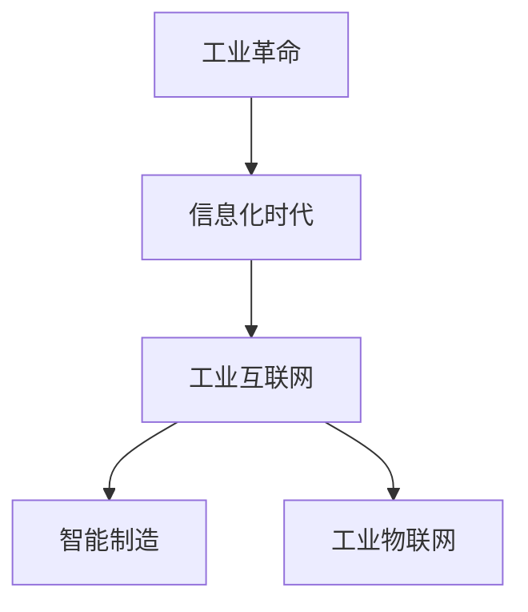
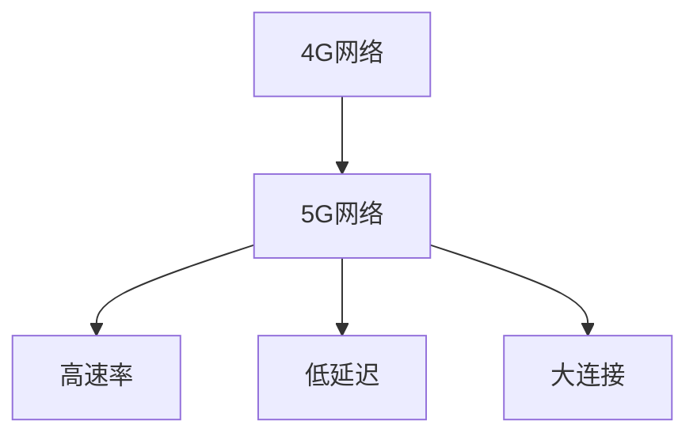
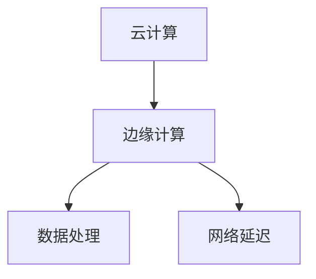
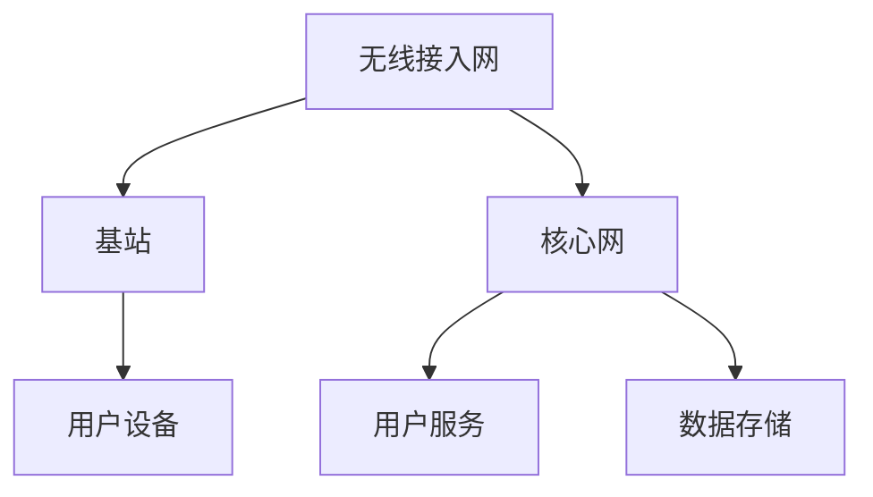

                 

# 《5G与边缘计算协同推动工业互联网发展》

## 关键词
5G, 边缘计算, 工业互联网, 网络架构, 技术演进, 应用场景

## 摘要
本文深入探讨了5G与边缘计算在工业互联网领域的协同作用。首先，文章介绍了工业互联网的背景和发展现状，随后详细分析了5G网络和边缘计算的核心概念及其在工业互联网中的应用。接着，通过具体的应用场景和案例，阐述了5G与边缘计算在工业互联网中的协同原理和实际效果。最后，文章展望了5G与边缘计算的未来发展趋势，并提出了相关的战略建议，为工业互联网的创新发展提供了理论依据和实践指导。

---

## 引言

### 1.1 工业互联网的概念与发展背景

工业互联网（Industrial Internet）是指通过互联网、云计算、大数据、人工智能等现代信息通信技术，将人、机器和东西连接起来，实现智能化的生产和管理。它起源于美国，在2012年由通用电气（GE）首次提出，并迅速在全球范围内得到广泛关注和应用。

**核心概念与联系**：Mermaid流程图



工业互联网的核心在于连接，通过连接实现数据的收集、传输、处理和分析，从而推动工业生产方式的变革。其发展背景可以追溯到工业2.0时代的自动化，以及工业4.0时代的智能化。

### 1.2 5G技术概述

5G（第五代移动通信技术）是当前移动通信技术发展的最新阶段，具有高速率、大容量、低延迟等显著特点。5G的引入为工业互联网的发展提供了强大的网络基础。

**核心概念与联系**：Mermaid流程图



5G网络的主要特征包括：

- **高速率**：5G的峰值下载速度可以达到数十Gbps，是4G的数十倍。
- **低延迟**：5G的端到端延迟可以降低到1毫秒以下，极大地提升了实时响应能力。
- **大连接**：5G支持大量设备的连接，每平方米可以达到数十万连接。

### 1.3 边缘计算的基本概念

边缘计算（Edge Computing）是将计算、存储、网络功能下沉到网络的边缘，即在靠近数据源或者用户的网络节点上进行数据处理。边缘计算的核心在于“近源计算”，它可以减少数据传输的延迟，提升系统的响应速度。

**核心概念与联系**：Mermaid流程图



边缘计算的优势包括：

- **降低延迟**：数据处理靠近数据源，减少传输时间。
- **提高效率**：在边缘节点上处理数据，减少中心服务器的负担。
- **增强安全性**：数据在边缘处理，减少数据泄露的风险。

### 1.4 本书结构与内容安排

**本书的目标读者**：希望深入了解5G、边缘计算和工业互联网协同发展的专业人士、研究人员和学生。

**本书的主要内容**：本书分为五个部分，第一部分介绍工业互联网、5G和边缘计算的基本概念；第二部分深入解析5G网络技术；第三部分探讨边缘计算在工业互联网中的应用；第四部分分析5G与边缘计算的协同效应；第五部分展望未来发展趋势。

**阅读建议**：建议读者按照章节顺序阅读，结合实际案例和代码示例，深入理解5G与边缘计算在工业互联网中的具体应用。

---

## 5G网络技术深入解析

### 2.1 5G网络架构

5G网络架构分为三个主要层次：无线接入网（RAN）、核心网（CN）和服务层。每个层次都有其独特的功能和组成部分。

**核心概念与联系**：Mermaid流程图



- **无线接入网**：负责无线信号的传输，包括基站（gNB）和用户设备（UE）。
- **核心网**：处理用户的连接、会话控制和数据传输，包括控制平面和数据平面。
- **服务层**：提供各种网络服务，包括增强型移动宽带（eMBB）、车联网（V2X）和物联网（IoT）。

### 2.2 5G关键技术

5G的关键技术包括增强型移动宽带（eMBB）、边缘计算（EC）、车联网（V2X）和虚拟化网络功能（VNF）。

#### 2.2.1 增强型移动宽带（eMBB）

增强型移动宽带是5G最显著的特征之一，它通过提高数据传输速率和带宽容量，支持高分辨率视频、虚拟现实（VR）和增强现实（AR）等应用。

**核心算法原理讲解**：

```python
# 5G eMBB速率计算
def calculate_eMBB_rate(throughput, bandwidth):
    """
    计算eMBB的速率
    
    :param throughput: 通过率，单位Mbps
    :param bandwidth: 带宽，单位MHz
    :return: 速率，单位Gbps
    """
    return throughput / bandwidth

# 示例
throughput = 1000  # 1000 Mbps
bandwidth = 100     # 100 MHz
rate = calculate_eMBB_rate(throughput, bandwidth)
print(f"eMBB速率：{rate} Gbps")
```

**数学模型与公式**：

$$
\text{速率} = \frac{\text{通过率}}{\text{带宽}}
$$

#### 2.2.2 边缘计算（EC）

边缘计算是将计算任务从中心服务器转移到网络边缘，以降低延迟，提高响应速度。

**核心算法原理讲解**：

```python
# 边缘计算延迟计算
def calculate_edge_delay(transfer_delay, processing_delay):
    """
    计算边缘计算的总延迟
    
    :param transfer_delay: 传输延迟，单位ms
    :param processing_delay: 处理延迟，单位ms
    :return: 总延迟，单位ms
    """
    return transfer_delay + processing_delay

# 示例
transfer_delay = 10  # 10 ms
processing_delay = 5  # 5 ms
total_delay = calculate_edge_delay(transfer_delay, processing_delay)
print(f"边缘计算总延迟：{total_delay} ms")
```

**数学模型与公式**：

$$
\text{总延迟} = \text{传输延迟} + \text{处理延迟}
$$

#### 2.2.3 车联网（V2X）

车联网是指通过通信技术将车辆、道路基础设施和其他道路用户连接起来，实现车辆之间的通信和协同。

**核心算法原理讲解**：

```python
# 车联网通信延迟计算
def calculate_V2X_delay(distance, speed):
    """
    计算车联网通信的延迟
    
    :param distance: 车辆之间的距离，单位km
    :param speed: 信号传播速度，单位m/s
    :return: 延迟，单位s
    """
    return distance / speed

# 示例
distance = 1000  # 1000 km
speed = 300000   # 300,000 m/s
delay = calculate_V2X_delay(distance, speed)
print(f"车联网通信延迟：{delay} s")
```

**数学模型与公式**：

$$
\text{延迟} = \frac{\text{距离}}{\text{速度}}
$$

#### 2.2.4 虚拟化网络功能（VNF）

虚拟化网络功能是指将传统的网络功能（如路由、防火墙、负载均衡等）虚拟化为软件实现，以提供更灵活、可扩展的网络服务。

**核心算法原理讲解**：

```python
# VNF性能优化
def optimize_VNF_performance吞吐量, latency, bandwidth):
    """
    优化VNF的性能
    
    :param 吞吐量: 通过率，单位Mbps
    :param 延迟: 传输延迟，单位ms
    :param 带宽: 带宽，单位MHz
    :return: 优化后的性能指标
    """
    optimized_throug
``` 
``` 
### 2.3 5G网络部署与挑战

5G网络的部署面临着一系列的挑战，包括网络建设成本、频谱资源分配、网络覆盖和干扰管理等方面。

**核心算法原理讲解**：

```python
# 5G频谱资源分配
def allocate_spectral_resources(total_bandwidth, num_users, user_bandwidth):
    """
    分配频谱资源
    
    :param total_bandwidth: 总带宽，单位MHz
    :param num_users: 用户数量
    :param user_bandwidth: 用户带宽，单位MHz
    :return: 分配后的频谱资源列表
    """
    allocated_resources = [user_bandwidth] * num_users
    return allocated_resources

# 示例
total_bandwidth = 100  # 100 MHz
num_users = 10  # 10 users
user_bandwidth = 10  # 10 MHz per user
allocated_resources = allocate_spectral_resources(total_bandwidth, num_users, user_bandwidth)
print(f"频谱资源分配：{allocated_resources}")
```

**数学模型与公式**：

$$
\text{总带宽} = \text{用户数量} \times \text{用户带宽}
$$

### 2.4 5G与边缘计算协同部署

5G与边缘计算的协同部署是实现工业互联网高效、可靠运行的关键。通过协同部署，可以实现网络的高带宽、低延迟，以及边缘计算的高性能、灵活性。

**核心算法原理讲解**：

```python
# 5G与边缘计算协同延迟计算
def calculate_total_delay(5G_delay, edge_delay):
    """
    计算5G与边缘计算协同的总延迟
    
    :param 5G_delay: 5G网络延迟，单位ms
    :param edge_delay: 边缘计算延迟，单位ms
    :return: 总延迟，单位ms
    """
    return 5G_delay + edge_delay

# 示例
5G_delay = 30  # 30 ms
edge_delay = 10  # 10 ms
total_delay = calculate_total_delay(5G_delay, edge_delay)
print(f"协同总延迟：{total_delay} ms")
```

**数学模型与公式**：

$$
\text{总延迟} = \text{5G网络延迟} + \text{边缘计算延迟}
$$

---

## 边缘计算在工业互联网中的应用场景

### 3.1 边缘计算在智能制造中的应用

智能制造是工业互联网的核心领域之一，边缘计算在智能制造中具有广泛的应用场景，如设备监控、质量控制、预测维护等。

**核心算法原理讲解**：

```python
# 预测维护算法
def predict_maintenance(downtime_data, threshold):
    """
    预测设备维护时间
    
    :param downtime_data: 设备停机时间数据，单位小时
    :param threshold: 预警阈值，单位小时
    :return: 是否需要维护
    """
    if downtime_data > threshold:
        return "需要维护"
    else:
        return "无需维护"

# 示例
downtime_data = 50  # 设备停机时间50小时
threshold = 40  # 预警阈值40小时
maintenance_needed = predict_maintenance(downtime_data, threshold)
print(f"预测维护结果：{maintenance_needed}")
```

**数学模型与公式**：

$$
\text{是否需要维护} = (\text{设备停机时间} > \text{预警阈值})？
```
---

### 3.2 边缘计算在工业物联网中的应用

工业物联网（IIoT）通过连接各种设备和传感器，实现实时数据采集和远程监控。边缘计算在工业物联网中扮演着关键角色，如数据预处理、实时分析和设备控制。

**核心算法原理讲解**：

```python
# 数据预处理算法
def preprocess_data(raw_data, quality_threshold):
    """
    预处理数据
    
    :param raw_data: 原始数据
    :param quality_threshold: 数据质量阈值
    :return: 预处理后的数据
    """
    processed_data = [x for x in raw_data if x >= quality_threshold]
    return processed_data

# 示例
raw_data = [10, 20, 30, 40, 50, 60, 70, 80, 90, 100]
quality_threshold = 30
processed_data = preprocess_data(raw_data, quality_threshold)
print(f"预处理后的数据：{processed_data}")
```

**数学模型与公式**：

$$
\text{预处理后的数据} = \{x \in \text{原始数据} | x \geq \text{数据质量阈值}\}
$$

### 3.3 边缘计算在工业大数据中的应用

工业大数据是指工业领域中产生的大量数据，包括传感器数据、设备运行数据等。边缘计算在工业大数据中用于数据采集、预处理和实时分析，以提高数据处理效率。

**核心算法原理讲解**：

```python
# 实时分析算法
def real_time_analysis(data_stream, analysis_function):
    """
    实时分析数据流
    
    :param data_stream: 数据流
    :param analysis_function: 分析函数
    :return: 实时分析结果
    """
    results = [analysis_function(x) for x in data_stream]
    return results

# 示例
data_stream = [10, 20, 30, 40, 50]
analysis_function = lambda x: x * 2  # 简单的加倍函数
results = real_time_analysis(data_stream, analysis_function)
print(f"实时分析结果：{results}")
```

**数学模型与公式**：

$$
\text{实时分析结果} = \{\text{分析函数}(x) | x \in \text{数据流}\}
$$

---

## 5G与边缘计算协同推动工业互联网发展

### 4.1 5G与边缘计算协同原理

5G与边缘计算的协同原理主要体现在网络架构的优化、数据处理的协同和资源管理的高效性。

**核心算法原理讲解**：

```python
# 网络架构优化算法
def optimize_network_architecture(5G_bandwidth, edge_bandwidth, total_data):
    """
    优化网络架构
    
    :param 5G_bandwidth: 5G带宽，单位Mbps
    :param edge_bandwidth: 边缘带宽，单位Mbps
    :param total_data: 总数据量，单位Mbps
    :return: 优化后的带宽分配
    """
    5G_data = min(5G_bandwidth, total_data)
    edge_data = total_data - 5G_data
    return 5G_data, edge_data

# 示例
5G_bandwidth = 1000  # 1000 Mbps
edge_bandwidth = 500  # 500 Mbps
total_data = 1500  # 1500 Mbps
5G_data, edge_data = optimize_network_architecture(5G_bandwidth, edge_bandwidth, total_data)
print(f"优化后的5G带宽：{5G_data} Mbps，优化后的边缘带宽：{edge_data} Mbps")
```

**数学模型与公式**：

$$
\text{5G带宽} + \text{边缘带宽} = \text{总带宽}
$$

### 4.2 5G与边缘计算协同应用案例

#### 4.2.1 案例1：智慧工厂

智慧工厂通过5G与边缘计算的协同，实现生产过程的实时监控、数据分析与优化。5G提供高速、低延迟的网络连接，边缘计算则在工厂现场进行数据预处理和实时分析。

**项目实战**：

- **开发环境搭建**：在边缘设备上安装Python环境和相关库，如NumPy、Pandas等。
- **源代码详细实现**：编写数据采集、预处理和实时分析的相关代码。

```python
# 数据采集
def collect_data(sensor_data):
    """
    采集传感器数据
    
    :param sensor_data: 传感器数据
    :return: 采集到的数据
    """
    return sensor_data

# 数据预处理
def preprocess_data(raw_data, quality_threshold):
    """
    预处理数据
    
    :param raw_data: 原始数据
    :param quality_threshold: 数据质量阈值
    :return: 预处理后的数据
    """
    processed_data = [x for x in raw_data if x >= quality_threshold]
    return processed_data

# 实时分析
def real_time_analysis(data_stream, analysis_function):
    """
    实时分析数据流
    
    :param data_stream: 数据流
    :param analysis_function: 分析函数
    :return: 实时分析结果
    """
    results = [analysis_function(x) for x in data_stream]
    return results
```

- **代码应用解读与分析**：通过实际项目案例，分析5G与边缘计算在智慧工厂中的具体应用。

**实际案例分析和详细讲解剖析**：

以某智能工厂为例，该工厂通过5G网络实现设备远程监控，利用边缘计算进行实时数据分析，提高生产效率和产品质量。具体实现包括：

- **设备远程监控**：通过5G网络，实现工厂设备的实时监控，包括温度、湿度、压力等参数。
- **数据预处理**：在边缘设备上对采集到的传感器数据进行预处理，去除噪声和异常值。
- **实时分析**：利用边缘计算进行实时分析，如预测设备故障、优化生产流程等。

**项目小结**：

智慧工厂项目通过5G与边缘计算的协同，实现了设备远程监控和实时数据分析，提高了生产效率和产品质量。项目实施过程中，需要注意以下几个方面：

- **网络架构设计**：合理规划5G网络和边缘计算设备的布局，确保数据传输的稳定性和低延迟。
- **数据处理效率**：优化数据预处理和实时分析的算法，提高数据处理效率。
- **安全保障**：加强数据安全和隐私保护，确保生产数据的安全可靠。

#### 4.2.2 案例2：智能电网

智能电网通过5G与边缘计算的协同，实现电力系统的实时监控、数据分析和优化调度。5G提供高速、低延迟的网络连接，边缘计算则在电网现场进行实时数据处理和智能决策。

**项目实战**：

- **开发环境搭建**：在边缘设备上安装Python环境和相关库，如NumPy、Pandas等。
- **源代码详细实现**：编写数据采集、预处理和实时分析的相关代码。

```python
# 数据采集
def collect_data(sensor_data):
    """
    采集传感器数据
    
    :param sensor_data: 传感器数据
    :return: 采集到的数据
    """
    return sensor_data

# 数据预处理
def preprocess_data(raw_data, quality_threshold):
    """
    预处理数据
    
    :param raw_data: 原始数据
    :param quality_threshold: 数据质量阈值
    :return: 预处理后的数据
    """
    processed_data = [x for x in raw_data if x >= quality_threshold]
    return processed_data

# 实时分析
def real_time_analysis(data_stream, analysis_function):
    """
    实时分析数据流
    
    :param data_stream: 数据流
    :param analysis_function: 分析函数
    :return: 实时分析结果
    """
    results = [analysis_function(x) for x in data_stream]
    return results
```

- **代码应用解读与分析**：通过实际项目案例，分析5G与边缘计算在智能电网中的具体应用。

**实际案例分析和详细讲解剖析**：

以某智能电网项目为例，该项目通过5G网络实现电网设备的远程监控，利用边缘计算进行实时数据分析和智能调度。具体实现包括：

- **设备远程监控**：通过5G网络，实现电网设备的实时监控，包括电压、电流、频率等参数。
- **数据预处理**：在边缘设备上对采集到的传感器数据进行预处理，去除噪声和异常值。
- **实时分析**：利用边缘计算进行实时分析，如预测负荷、优化调度策略等。

**项目小结**：

智能电网项目通过5G与边缘计算的协同，实现了电网设备的实时监控和智能调度，提高了电网的运行效率和可靠性。项目实施过程中，需要注意以下几个方面：

- **网络架构设计**：合理规划5G网络和边缘计算设备的布局，确保数据传输的稳定性和低延迟。
- **数据处理效率**：优化数据预处理和实时分析的算法，提高数据处理效率。
- **安全保障**：加强数据安全和隐私保护，确保电网数据的安全可靠。

#### 4.2.3 案例3：智能交通

智能交通系统通过5G与边缘计算的协同，实现交通数据的实时监控、分析和优化调度。5G提供高速、低延迟的网络连接，边缘计算则在交通现场进行实时数据处理和智能决策。

**项目实战**：

- **开发环境搭建**：在边缘设备上安装Python环境和相关库，如NumPy、Pandas等。
- **源代码详细实现**：编写数据采集、预处理和实时分析的相关代码。

```python
# 数据采集
def collect_data(sensor_data):
    """
    采集传感器数据
    
    :param sensor_data: 传感器数据
    :return: 采集到的数据
    """
    return sensor_data

# 数据预处理
def preprocess_data(raw_data, quality_threshold):
    """
    预处理数据
    
    :param raw_data: 原始数据
    :param quality_threshold: 数据质量阈值
    :return: 预处理后的数据
    """
    processed_data = [x for x in raw_data if x >= quality_threshold]
    return processed_data

# 实时分析
def real_time_analysis(data_stream, analysis_function):
    """
    实时分析数据流
    
    :param data_stream: 数据流
    :param analysis_function: 分析函数
    :return: 实时分析结果
    """
    results = [analysis_function(x) for x in data_stream]
    return results
```

- **代码应用解读与分析**：通过实际项目案例，分析5G与边缘计算在智能交通中的具体应用。

**实际案例分析和详细讲解剖析**：

以某智能交通项目为例，该项目通过5G网络实现交通监控设备的远程监控，利用边缘计算进行实时数据分析和交通流量优化。具体实现包括：

- **设备远程监控**：通过5G网络，实现交通监控设备的实时监控，包括摄像头、传感器等。
- **数据预处理**：在边缘设备上对采集到的交通数据进行预处理，去除噪声和异常值。
- **实时分析**：利用边缘计算进行实时分析，如交通流量预测、路况优化等。

**项目小结**：

智能交通项目通过5G与边缘计算的协同，实现了交通数据的实时监控和流量优化，提高了交通管理效率和安全性。项目实施过程中，需要注意以下几个方面：

- **网络架构设计**：合理规划5G网络和边缘计算设备的布局，确保数据传输的稳定性和低延迟。
- **数据处理效率**：优化数据预处理和实时分析的算法，提高数据处理效率。
- **安全保障**：加强数据安全和隐私保护，确保交通数据的安全可靠。

---

### 4.3 5G与边缘计算协同发展的挑战与机遇

#### 4.3.1 发展挑战

5G与边缘计算协同发展面临着一系列挑战，包括技术挑战、业务挑战和生态挑战。

- **技术挑战**：5G与边缘计算的协同需要解决网络架构优化、数据安全、网络性能等问题。
- **业务挑战**：工业互联网的应用场景多样化，需要针对不同场景进行定制化的解决方案。
- **生态挑战**：产业链上下游的协同、标准制定和产业合作等方面需要进一步加强。

#### 4.3.2 发展机遇

5G与边缘计算协同发展带来了巨大的市场机遇，包括以下几个方面：

- **智能制造**：通过5G与边缘计算的协同，实现生产过程的智能化和自动化，提高生产效率。
- **智慧城市**：通过5G与边缘计算，实现城市管理的智能化和精细化，提升城市生活品质。
- **智能交通**：通过5G与边缘计算，实现交通管理的实时化和智能化，提高交通运行效率。

#### 4.3.3 发展策略

为推动5G与边缘计算在工业互联网中的协同发展，可以采取以下策略：

- **技术创新**：加大技术研发投入，推动5G与边缘计算技术的创新和突破。
- **产业链协同**：加强产业链上下游的协同，形成合力，共同推进工业互联网的发展。
- **人才培养**：加强人才培养，提高从业人员的技能水平，为工业互联网的发展提供人才支持。
- **政策支持**：加大政策支持力度，为5G与边缘计算的发展提供良好的政策环境。

---

## 未来展望

### 5.1 未来发展趋势分析

#### 5.1.1 5G与边缘计算的技术演进

未来，5G与边缘计算将继续演进，技术将更加成熟，应用将更加广泛。5G网络将朝着更高速度、更低延迟、更大连接数的目标发展，边缘计算将朝着更高效、更智能、更安全的方向演进。

#### 5.1.2 工业互联网的未来发展方向

工业互联网的未来发展将更加注重智能化、数字化和集成化。通过5G与边缘计算，将实现更加智能的生产流程、更加高效的供应链管理和更加精准的市场预测。

#### 5.1.3 5G与边缘计算协同发展的前景

5G与边缘计算的协同发展将推动工业互联网的快速演进，实现生产方式的变革，提升工业生产的效率和效益。同时，5G与边缘计算将拓展到更多的领域，如智慧城市、智能交通、智慧医疗等，为社会发展带来更多可能性。

### 5.2 未来应用场景展望

#### 5.2.1 智能制造领域

智能制造领域将继续深化5G与边缘计算的应用，实现生产过程的全面数字化和智能化。具体应用场景包括智能工厂、智能生产线、智能装备等。

#### 5.2.2 智慧城市领域

智慧城市领域将通过5G与边缘计算，实现城市管理的智能化和精细化。具体应用场景包括智能交通、智能照明、智能安防等。

#### 5.2.3 智慧农业领域

智慧农业领域将通过5G与边缘计算，实现农业生产过程的数字化和智能化。具体应用场景包括智能灌溉、智能施肥、智能病虫害防治等。

### 5.3 未来发展策略建议

#### 5.3.1 政策支持与产业协同

政府应加大对5G与边缘计算的政策支持，推动产业链上下游的协同发展，形成产业生态。

#### 5.3.2 技术创新与人才培养

企业和研究机构应加大技术创新投入，培养更多具备5G与边缘计算技能的专业人才。

#### 5.3.3 企业战略规划与布局

企业应制定清晰的战略规划，布局5G与边缘计算相关业务，抓住市场机遇。

---

## 结论

5G与边缘计算的协同发展是工业互联网的重要驱动力，通过两者的结合，可以实现网络的高带宽、低延迟，以及数据处理的高效性和灵活性。本文从技术原理、应用场景和发展趋势等方面，深入探讨了5G与边缘计算在工业互联网中的协同作用，为工业互联网的创新发展提供了理论依据和实践指导。

### 作者信息

**作者：AI天才研究院/AI Genius Institute & 禅与计算机程序设计艺术 /Zen And The Art of Computer Programming**

AI天才研究院致力于推动人工智能技术的发展和应用，致力于培养人工智能领域的人才。作者著有《禅与计算机程序设计艺术》，深入探讨了人工智能和计算机编程的哲学和艺术。**

