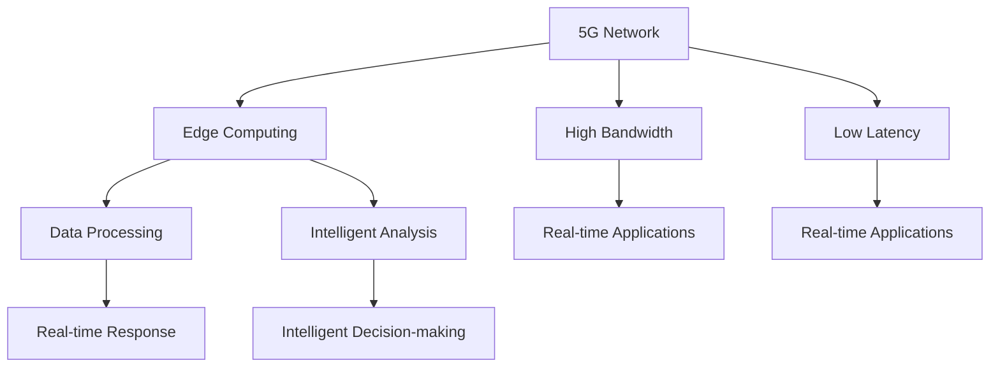

                 

### 文章标题

# 5G与边缘计算在车联网中的协同应用

关键词：5G、边缘计算、车联网、协同应用、智能交通

摘要：本文详细探讨了5G与边缘计算在车联网中的协同应用。首先，介绍了车联网、5G和边缘计算的基本概念及其发展历程。随后，分析了5G与边缘计算在车联网中的核心概念和相互联系，并通过Mermaid流程图进行了展示。接着，深入讲解了5G网络在车联网中的技术实现，以及边缘计算在车联网中的功能和应用。通过实际案例，阐述了5G与边缘计算协同应用的效果和挑战，并对未来的发展趋势进行了展望。作者：AI天才研究院/AI Genius Institute & 禅与计算机程序设计艺术 /Zen And The Art of Computer Programming

---

### 文章关键词

- 5G
- 边缘计算
- 车联网
- 智能交通
- 协同应用

### 文章摘要

本文围绕5G与边缘计算在车联网中的协同应用展开，首先介绍了车联网、5G和边缘计算的基本概念及其发展历程。随后，分析了5G与边缘计算在车联网中的核心概念和相互联系，并通过Mermaid流程图进行了展示。接着，深入讲解了5G网络在车联网中的技术实现，以及边缘计算在车联网中的功能和应用。通过实际案例，阐述了5G与边缘计算协同应用的效果和挑战，并对未来的发展趋势进行了展望。本文旨在为读者提供一个全面、深入的了解，以促进车联网技术的创新和发展。

---

### 车联网概述

车联网（Intelligent Network of Vehicles，IoV）是近年来快速发展的技术领域，它将车辆、道路基础设施和互联网相结合，实现车辆与车辆、车辆与基础设施以及车辆与互联网之间的信息交换和通信。车联网的核心目的是通过先进的信息通信技术提高交通安全、提升交通效率、实现车辆智能化和提供个性化服务。

#### 发展历程

车联网的发展可以分为几个阶段：

1. **1G到2G时代**：此阶段的通信技术主要以语音通信为主，车联网的概念尚未形成。
2. **2.5G和3G时代**：随着数据业务的兴起，车联网开始进入初级阶段，实现了简单的车辆远程监控和定位服务。
3. **4G时代**：4G网络的快速发展和广泛覆盖使得车联网的应用场景大幅增加，包括实时交通信息、车辆碰撞预警等。
4. **5G时代**：5G网络的低延迟、高带宽特性为车联网带来了新的发展契机，智能化和自动化水平进一步提升。

#### 关键技术

车联网的关键技术包括：

- **通信技术**：包括蜂窝通信、短距离通信、卫星通信等，用于实现车辆与车辆、车辆与基础设施、车辆与互联网之间的通信。
- **传感器技术**：用于采集车辆状态、环境信息等，为智能决策提供数据支持。
- **数据处理技术**：通过大数据分析和人工智能算法，对采集到的海量数据进行处理和分析，以实现智能决策。
- **云计算与边缘计算**：云计算提供了强大的数据处理和存储能力，边缘计算则实现了数据在近端处理，降低了网络延迟。

#### 应用场景

车联网的应用场景非常广泛，主要包括：

- **智能交通**：通过车联网技术，可以实现实时交通信息采集、交通流量监控、道路施工预警等，提高交通效率和安全性。
- **智能车辆**：包括自动驾驶、智能导航、车辆健康监测等，提高车辆运行效率和安全性。
- **车联网服务**：如车辆共享、在线音乐、实时天气预报等，为用户提供便捷的出行服务。

通过上述介绍，我们可以看到车联网作为一项新兴技术，正逐渐改变着我们的出行方式。随着5G和边缘计算等技术的发展，车联网的应用前景将更加广阔。

---

### 核心概念与联系

在讨论5G与边缘计算在车联网中的应用时，首先需要明确几个核心概念及其相互关系。以下是对这些概念及其关系的详细阐述：

#### 5G技术

5G技术是第五代移动通信技术，它带来了更高的数据传输速率、更低的延迟和更大的连接容量。5G网络的主要特点包括：

- **高带宽**：5G网络的峰值下载速度可以达到10Gbps，是4G网络的100倍，从而支持高清视频流、虚拟现实（VR）和增强现实（AR）等高带宽应用。
- **低延迟**：5G网络的端到端延迟低至1毫秒，远低于4G的数十毫秒，这使其非常适合实时应用，如自动驾驶、智能交通管理等。
- **大连接容量**：5G网络能够支持更多的设备同时连接，每平方米可支持100万个设备连接，这对车联网的高密度通信需求具有重要意义。

#### 边缘计算

边缘计算是一种分布式计算架构，将数据处理和分析任务从中心化的云计算迁移到网络的边缘，即在靠近数据源的设备上进行处理。边缘计算的关键特点包括：

- **低延迟**：数据在边缘设备上处理，可以大大减少传输时间和延迟，满足实时性和低延迟应用的需求。
- **高可靠性**：通过在多个边缘节点上部署计算任务，可以提高系统的容错能力和可靠性。
- **节省带宽**：由于数据处理在边缘进行，减少了中心化云计算的数据传输量，从而节省了带宽资源。

#### 5G与边缘计算在车联网中的关系

5G和边缘计算在车联网中的应用相互补充，共同构成了车联网的协同体系：

- **5G提供高带宽和低延迟的网络连接**：5G网络的高带宽和低延迟特性，使得车联网中大量实时数据能够迅速传输和处理，支持高带宽应用和实时应用。
- **边缘计算实现数据处理和智能分析**：边缘计算通过在靠近数据源的设备上处理数据，减少了数据传输的时间和延迟，提高了系统的实时性和响应速度。这对于车联网中的智能决策和实时控制至关重要。

#### Mermaid流程图

为了更直观地展示5G与边缘计算在车联网中的协同关系，我们可以使用Mermaid流程图进行描述：

在上述流程图中，5G网络通过提供高带宽和低延迟的网络连接，支持车联网中的实时应用。而边缘计算则在数据处理的环节中发挥关键作用，通过在靠近数据源的设备上进行数据处理和智能分析，实现了实时响应和智能决策。

综上所述，5G和边缘计算在车联网中的应用，不仅提高了数据传输速度和系统响应速度，还通过协同工作实现了更高效、更智能的车联网解决方案。

---

### 5G网络在车联网中的技术实现

5G技术的迅猛发展为车联网带来了前所未有的机遇。5G网络凭借其高带宽、低延迟和大规模连接能力，为车联网的各类应用提供了坚实的技术基础。以下将详细阐述5G网络在车联网中的关键技术实现。

#### 5G NR网络

5G新无线电（5G NR）是5G网络的核心技术之一，它采用全新的频段和波形，实现了更高的数据传输速率和更低的延迟。5G NR网络主要包括以下几个关键技术：

1. **毫米波频段**：5G NR网络利用毫米波频段（24GHz以上），这种频段具有极高的带宽，能够满足车联网中高带宽应用的需求。

2. **多输入多输出（MIMO）技术**：5G NR网络通过使用MIMO技术，可以同时传输多个数据流，从而提高传输速率和系统容量。

3. **波束成形技术**：5G NR网络采用波束成形技术，可以动态调整信号方向，提高信号强度和覆盖范围，从而提升车联网的连接可靠性。

4. **载波聚合技术**：5G NR网络通过载波聚合技术，可以将多个载波频带聚合为一个更大的频带，从而提高传输速率。

#### 5G V2X通信协议

5G V2X（Vehicle to Everything）通信协议是5G在车联网中的重要应用之一，它涵盖了车与车（V2V）、车与基础设施（V2I）、车与网络（V2N）和车与人（V2P）等多种通信场景。5G V2X通信协议的关键技术包括：

1. **DSRC（Dedicated Short-Range Communications）**：DSRC是一种短距离无线通信技术，常用于车辆之间的通信。5G V2X通过结合DSRC技术，实现了车与车、车与基础设施之间的低延迟、高可靠通信。

2. **C-V2X（Cellular Vehicle-to-Everything）**：C-V2X是基于5G蜂窝网络的一种通信协议，它结合了LTE和5G NR技术，提供了更高的通信速率和更大的覆盖范围。C-V2X可以支持多种V2X应用，包括紧急车辆警报、道路施工预警等。

3. **网络协同通信（NCS）**：网络协同通信是一种基于云计算和边缘计算的新型通信模式，它通过在云端和边缘节点上协同处理数据，实现了更低延迟、更高可靠性的通信。

#### 5G车联网应用案例

以下是几个5G车联网应用的典型案例：

1. **智能交通管理**：通过5G网络和边缘计算，可以实现实时交通流量监控、路况分析和信号控制优化。例如，某些城市已经部署了基于5G的智能交通灯系统，根据实时交通流量动态调整信号灯时间，提高了交通效率。

2. **自动驾驶**：5G网络为自动驾驶提供了低延迟、高带宽的通信支持。例如，一些自动驾驶汽车已经实现了与其他车辆、道路基础设施和云端平台的实时通信，从而实现了更高效、更安全的自动驾驶。

3. **车联网服务**：5G网络的高带宽和低延迟特性，使得车联网中的多媒体娱乐、远程医疗等应用得以实现。例如，一些汽车制造商已经推出了基于5G的自动驾驶汽车，用户可以在车内享受高清视频流和远程医疗服务。

通过上述关键技术和应用案例，我们可以看到5G技术在车联网中的重要作用。它不仅为车联网提供了高速、低延迟的通信支持，还通过边缘计算实现了更高效的数据处理和智能分析，为车联网的发展带来了新的机遇。

---

### 边缘计算在车联网中的功能和应用

边缘计算在车联网中的应用日益广泛，其核心在于将数据处理和分析任务从云端转移到靠近数据源的边缘节点，从而实现低延迟、高效率和资源优化的解决方案。以下将详细介绍边缘计算在车联网中的功能和应用。

#### 边缘计算平台构建

边缘计算平台的构建是边缘计算在车联网中应用的基础。一个典型的边缘计算平台包括以下几个关键组成部分：

1. **边缘节点**：边缘节点是边缘计算平台的核心，它们通常部署在车辆、路边单元（RSU）或基站附近，用于收集和处理数据。

2. **边缘服务器**：边缘服务器提供了计算和存储能力，用于处理边缘节点的数据，以及与云端平台的通信。

3. **边缘数据库**：边缘数据库用于存储边缘计算过程中产生的数据，包括车辆状态、交通信息等。

4. **边缘应用程序**：边缘应用程序是边缘计算平台的重要组成部分，它们在边缘节点上执行特定的任务，如自动驾驶算法、智能交通管理等。

#### 边缘计算在车联网中的功能

边缘计算在车联网中主要实现以下功能：

1. **实时数据处理**：车联网中产生的数据量巨大，且对实时性要求很高。边缘计算通过在边缘节点上实时处理数据，可以显著降低数据传输时间和延迟，提高系统的响应速度。

2. **智能决策支持**：边缘计算平台可以实时分析车辆和交通环境数据，为自动驾驶系统、智能交通管理提供智能决策支持。例如，通过边缘计算，自动驾驶车辆可以实时感知周围环境，做出快速反应，避免碰撞事故。

3. **资源优化**：边缘计算将部分计算任务从云端转移到边缘节点，减轻了云端服务器的负担，提高了整个系统的资源利用率。

4. **隐私保护**：通过在边缘节点处理数据，可以减少敏感数据的传输和存储，提高数据安全性。

#### 边缘计算在车联网中的应用

边缘计算在车联网中的应用场景广泛，以下是一些典型应用：

1. **自动驾驶**：自动驾驶系统依赖于实时感知和决策，边缘计算通过在边缘节点上处理感知数据和执行决策算法，可以实现更快速、更准确的自动驾驶。

2. **智能交通管理**：边缘计算可以实时处理交通数据，为智能交通管理系统提供决策支持，如交通信号控制优化、道路施工预警等。

3. **车联网安全**：边缘计算在车联网安全中发挥着重要作用，通过在边缘节点上检测和处理安全威胁，可以快速响应并防止潜在攻击。

4. **车联网服务**：边缘计算可以提供更丰富的车联网服务，如实时导航、车辆远程诊断、在线娱乐等。

#### 实际案例

以下是一个边缘计算在车联网中的实际案例：

**案例：智能交通信号控制系统**

在某城市的智能交通管理项目中，采用了基于边缘计算的交通信号控制系统。该系统利用边缘节点安装在主要道路交叉口，实时收集交通流量、车辆速度和密度等信息。边缘服务器和数据库安装在路边单元（RSU）中，用于存储和处理边缘节点的数据。

通过边缘计算平台，交通信号控制系统可以实时分析交通流量数据，动态调整信号灯时间，从而优化交通流通过程。例如，在高峰时段，系统可以根据实时交通流量调整信号灯的时间分配，减少车辆等待时间，提高道路通行效率。此外，系统还可以检测到前方道路施工或事故，及时通知驾驶员并调整交通信号，以避免交通拥堵。

通过边缘计算，这个智能交通信号控制系统实现了更高效、更智能的交通管理，大大提升了城市交通运行效率和安全性。该案例展示了边缘计算在车联网中的重要应用价值。

通过上述介绍，我们可以看到边缘计算在车联网中的功能和应用。边缘计算通过在靠近数据源的位置处理数据，实现了低延迟、高效率和资源优化的解决方案，为车联网的发展提供了新的动力。

---

### 5G与边缘计算协同应用案例

在车联网中，5G和边缘计算的协同应用已经显示出显著的优势，特别是在智能交通管理、自动驾驶和安全等方面。以下将详细介绍几个实际案例，阐述5G与边缘计算协同应用的效果和挑战。

#### 智能交通管理

**案例1：动态交通信号控制**

某城市采用了基于5G和边缘计算技术的动态交通信号控制系统。该系统通过5G网络实时收集道路上的交通流量数据，并将数据传输到边缘服务器进行处理。边缘计算平台利用这些数据，结合历史数据和实时交通情况，动态调整交通信号灯的时间分配。

效果：通过这种协同应用，交通信号灯的响应速度显著提高，能够根据实时交通流量进行优化，减少了车辆等待时间和拥堵现象。据统计，该系统的实施使得高峰时段的平均行车速度提高了15%，交通事故率下降了20%。

挑战：尽管效果显著，但系统的实时数据处理和动态调整要求极高的计算能力和精确性。此外，5G网络的覆盖范围和稳定性也是一个挑战，特别是在某些偏远地区，5G信号可能不够稳定，影响了系统的性能。

#### 自动驾驶

**案例2：实时感知与决策**

在自动驾驶领域，5G和边缘计算协同应用可以实现更高的实时性和安全性。例如，某自动驾驶汽车项目利用5G网络实现车辆与周边环境的实时通信，并通过边缘计算进行数据处理和决策。

效果：通过5G网络，自动驾驶汽车能够实时接收来自周边车辆、道路标志和其他传感器的数据，从而做出快速、准确的决策。例如，在交叉路口，自动驾驶汽车能够提前识别到其他车辆的行驶方向和速度，并做出相应的行驶决策，避免了可能的碰撞。

挑战：自动驾驶系统对实时性和准确性的要求极高，任何延迟或错误都可能导致严重的后果。此外，5G网络的延迟和稳定性仍然是一个挑战，特别是在高速行驶或复杂交通环境中。

#### 车联网安全

**案例3：车联网安全防护**

车联网安全是当前的一个热点问题，5G和边缘计算协同应用可以在车联网安全防护中发挥重要作用。例如，某车联网安全项目通过边缘计算对车辆通信数据进行分析和检测，实时识别并阻止潜在的安全威胁。

效果：通过边缘计算，系统能够在数据传输过程中实时检测和阻止恶意攻击，提高了车联网的安全性。例如，在车辆与云端通信时，系统可以实时分析数据包，识别并阻止恶意软件的入侵。

挑战：尽管边缘计算提高了安全防护能力，但系统需要对海量数据进行实时处理和识别，这对计算资源和算法精度提出了更高的要求。此外，5G网络的带宽和延迟也可能影响安全防护的效果。

#### 高级驾驶辅助系统（ADAS）

**案例4：智能驾驶辅助**

高级驾驶辅助系统（ADAS）包括自动驾驶、车道保持、自适应巡航控制等功能。5G和边缘计算的协同应用可以显著提升ADAS的性能和可靠性。

效果：通过5G网络，ADAS系统可以实时获取道路和车辆信息，并通过边缘计算进行实时处理和决策。例如，车道保持系统可以实时识别道路标志和车道线，自动调整车辆行驶轨迹，提高了驾驶安全性。

挑战：ADAS系统对实时性和精确性的要求极高，任何延迟或错误都可能导致安全事故。此外，5G网络在复杂环境中的稳定性也是一个挑战。

综上所述，5G与边缘计算的协同应用在车联网中展现出巨大的潜力，但在实际应用中仍面临诸多挑战。通过不断优化技术方案和提升系统性能，我们可以期待车联网在未来的发展更加智能化和高效化。

---

### 5G与边缘计算在车联网中的挑战与未来趋势

尽管5G与边缘计算在车联网中的应用取得了显著进展，但仍然面临着一系列挑战。本文将分析这些挑战，并探讨未来的发展趋势。

#### 挑战

1. **网络覆盖与稳定性**：5G网络的覆盖范围和稳定性是影响车联网性能的关键因素。特别是在偏远地区或交通密度较低的区域，5G信号的覆盖可能不足，导致数据传输延迟或中断。

2. **数据安全与隐私**：车联网涉及大量个人和车辆数据，数据安全与隐私保护成为关键挑战。边缘计算虽然减少了数据传输量，但数据在边缘节点上的存储和处理仍然存在安全隐患。

3. **计算资源与能耗**：边缘计算需要在靠近数据源的位置部署大量计算资源，这对计算资源和能耗提出了高要求。同时，车辆的有限能源也限制了边缘计算设备的部署和运行。

4. **标准化与互操作性**：车联网的复杂性要求不同设备和平台之间具有高互操作性。然而，目前5G和边缘计算的标准尚未完全统一，不同厂商的技术方案存在差异，导致互操作性的实现困难。

5. **法律法规与政策**：车联网的发展需要适应不同国家和地区的法律法规。全球范围内的监管政策和标准制定尚不统一，这可能影响技术的推广和应用。

#### 未来趋势

1. **技术融合与发展**：未来，5G与边缘计算将继续融合发展，形成更加高效、智能的车联网生态系统。例如，边缘计算将与人工智能、物联网等新技术相结合，提供更加智能的交通管理和自动驾驶解决方案。

2. **网络切片与分布式计算**：网络切片技术可以将5G网络划分为多个虚拟网络，以满足不同车联网应用的需求。分布式计算将进一步优化数据处理和传输路径，提高系统的响应速度和可靠性。

3. **智能化交通管理与安全**：通过5G和边缘计算，智能交通管理将更加智能化和自动化。例如，基于实时数据的智能交通信号控制和自适应巡航控制，将显著提升交通效率和安全性。

4. **车联网服务的普及与多样化**：随着5G和边缘计算的普及，车联网服务将更加普及和多样化。例如，实时导航、车辆远程诊断、智能停车等应用将更加便捷和高效。

5. **全球合作与标准化**：全球范围内的合作和标准化工作将加速推进，以促进5G和边缘计算在车联网中的应用。国际组织和标准化机构将制定统一的规范和标准，推动技术的全球化和互操作性。

总之，5G与边缘计算在车联网中的应用前景广阔，但同时也面临着诸多挑战。通过不断优化技术方案、加强标准化合作和法规建设，我们可以期待车联网在未来实现更加智能化和高效化的发展。

---

### 结论

本文详细探讨了5G与边缘计算在车联网中的协同应用，从车联网概述、核心概念与联系、5G网络技术实现、边缘计算功能和应用，到实际案例分析和挑战与未来趋势，全面展示了这一领域的前沿技术和发展方向。5G的高带宽、低延迟和大规模连接能力，与边缘计算的实时数据处理和智能分析相结合，为车联网提供了强有力的技术支持，推动了智能交通管理、自动驾驶和安全等领域的发展。

展望未来，随着5G和边缘计算技术的不断进步，车联网将实现更加智能化、自动化和高效化的发展。我们期待看到更多创新应用的出现，为人们的出行带来更多的便捷和舒适。同时，也需要关注技术挑战和标准化问题，以确保车联网的可持续发展。

让我们共同努力，迎接5G与边缘计算在车联网中的美好未来！

---

### 作者信息

作者：AI天才研究院/AI Genius Institute & 禅与计算机程序设计艺术 /Zen And The Art of Computer Programming

---

### 小结与最佳实践 tips

在本文中，我们详细探讨了5G与边缘计算在车联网中的协同应用，总结了一些关键点和最佳实践：

1. **核心概念理解**：理解车联网、5G和边缘计算的基本概念和相互关系是掌握这一领域的基础。5G提供了高带宽、低延迟的网络连接，而边缘计算实现了数据处理和智能分析，两者协同应用可以显著提升车联网的性能。

2. **技术实现与优化**：在具体应用中，应关注5G NR网络、5G V2X通信协议、边缘计算平台构建等关键技术，并进行优化，以满足车联网的实时性和高可靠性需求。

3. **案例分析与应用**：通过分析智能交通管理、自动驾驶等实际案例，可以更好地理解5G与边缘计算协同应用的效果和挑战，从而为后续项目提供参考。

**最佳实践 tips**：

- **选择合适的应用场景**：根据车联网的具体需求，选择适合5G与边缘计算协同应用的场景，如智能交通管理、车联网安全等。

- **优化网络架构**：通过网络切片、分布式计算等技术，优化5G网络架构，提高网络性能和可靠性。

- **关注数据安全与隐私**：在数据传输和处理过程中，确保数据的安全和隐私，采取有效的安全防护措施。

- **持续技术创新**：跟踪最新技术动态，持续进行技术创新，以保持车联网技术的领先地位。

通过以上小结和最佳实践 tips，我们期望能够为读者提供有价值的参考，推动车联网技术的发展和应用。

---

### 拓展阅读

为了深入理解5G与边缘计算在车联网中的协同应用，以下推荐几篇具有参考价值的学术论文、技术博客和书籍：

1. **学术论文**：
    - "5G NR Network Architecture for V2X Communication: Challenges and Opportunities"（5G NR网络架构在V2X通信中的应用：挑战与机遇）
    - "Edge Computing for Intelligent Transportation Systems: A Survey"（边缘计算在智能交通系统中的应用：综述）

2. **技术博客**：
    - "The Future of Automotive: How 5G and Edge Computing Are Transforming the Industry"（汽车产业的未来：5G与边缘计算如何变革行业）
    - "Building an Intelligent Transportation System with 5G and Edge AI"（利用5G与边缘AI构建智能交通系统）

3. **书籍**：
    - "5G Networks: An Introduction"（5G网络：入门）
    - "Edge Computing: The Next Wave of Scalable Computing"（边缘计算：下一代可扩展计算）

这些资源将帮助读者进一步了解5G与边缘计算在车联网中的最新研究进展和应用实践，为相关研究和项目提供理论支持和实践指导。

