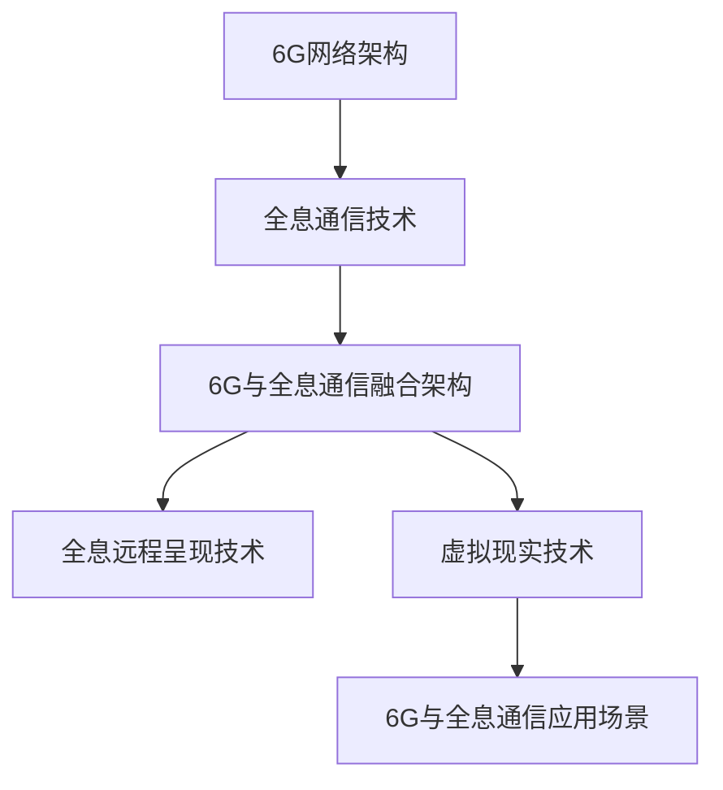

                 

# 6G与全息通信的应用前景：实现真实的远程-presenza

## 关键词

6G，全息通信，远程呈现，虚拟现实，网络架构，信号处理算法

## 摘要

随着6G技术的不断发展和全息通信技术的日益成熟，全息远程呈现已成为未来通信的重要发展方向。本文深入探讨了6G与全息通信的结合，分析了6G网络架构与全息通信技术的融合点，以及在全息通信中的应用前景。通过分析全息远程呈现技术和虚拟现实技术，本文展示了6G网络对全息通信的深远影响，并探讨了未来的挑战与前景。

## 第一部分: 6G与全息通信

### 第1章: 6G概述

#### 1.1 6G的发展背景

6G（第六代移动通信技术）是继2G、3G、4G和5G之后的下一代移动通信技术。6G的发展目标是通过更高的数据传输速率、更低的延迟、更高的网络容量和更广泛的覆盖范围，满足未来日益增长的通信需求。

- **6G的定义**：6G不仅仅是一个单纯的通信技术升级，它涉及到整个通信系统的变革，包括网络架构、传输技术、信号处理算法等多个方面。

- **6G的技术特点**：6G具有以下几个显著特点：
  - **极高的数据传输速率**：6G预计可以实现超过1Tbps的数据传输速率，是5G的100倍以上。
  - **超低延迟**：6G的延迟将低至1毫秒，甚至更低，使得实时交互成为可能。
  - **网络容量**：6G将提供巨大的网络容量，支持数十亿设备的连接。
  - **多样化应用场景**：6G将支持各种应用场景，包括无人驾驶、远程医疗、智能制造等。

- **6G的发展趋势**：随着物联网、人工智能、虚拟现实等技术的快速发展，6G技术的需求日益迫切。未来几年，6G技术将逐步从理论研究走向实际应用，预计将在2030年前后实现商用。

#### 1.2 全息通信的基本原理

全息通信是一种利用全息成像技术实现三维图像传输和重建的通信方式。它基于光学信息处理技术和数字全息技术，通过记录和重建光波前的信息，实现三维图像的真实再现。

- **全息成像技术**：全息成像技术通过记录物体光波前的信息，生成全息图。全息图包含了物体光波的全部信息，包括振幅和相位。

- **光学信息处理技术**：光学信息处理技术利用光学元件对光信号进行处理，实现信号的调制、解调、压缩和传输。

- **数字全息技术**：数字全息技术利用数字信号处理技术，对全息图进行数字化处理，实现全息图的存储、传输和重建。

#### 1.3 6G与全息通信的结合点

6G技术的快速发展为全息通信提供了良好的技术基础。6G与全息通信的结合点主要体现在以下几个方面：

- **数据传输速率的提升**：6G网络的高数据传输速率能够满足全息通信对大数据量的传输需求，实现全息图像的实时传输。

- **低延迟通信**：6G网络的低延迟特性能够确保全息通信的实时性，实现远程用户的实时交互。

- **大规模天线技术**：6G网络的大规模天线技术能够提高全息通信的传输质量和覆盖范围，实现更稳定、更可靠的全息通信。

- **高精度定位**：6G网络的高精度定位能力能够确保全息通信中物体位置的准确性，提高全息图像的还原质量。

### 第2章: 6G网络架构与全息通信技术

#### 2.1 6G网络架构

6G网络架构将实现网络切片、边缘计算和网络虚拟化等技术的全面融合，为全息通信提供高效、可靠、低延迟的通信环境。

- **网络切片**：网络切片技术将一个物理网络划分为多个虚拟网络，为不同应用场景提供定制化的网络服务。全息通信可以根据需求创建专用的网络切片，确保通信质量和实时性。

- **边缘计算**：边缘计算将计算能力下沉到网络边缘，实现数据的本地处理和实时分析。全息通信可以利用边缘计算技术，降低数据传输延迟，提高通信效率。

- **网络虚拟化**：网络虚拟化技术通过虚拟化技术将物理网络资源抽象成逻辑网络资源，实现网络资源的灵活调度和高效利用。全息通信可以利用网络虚拟化技术，优化网络资源分配，提高网络性能。

#### 2.2 全息通信关键技术

全息通信的关键技术包括全息信号处理算法、大数据存储与处理和网络传输优化。

- **全息信号处理算法**：全息信号处理算法是实现全息图像重建的核心技术。常用的全息信号处理算法包括傅里叶变换、卷积和逆卷积等。通过这些算法，可以实现全息图像的重建和优化。

- **大数据存储与处理**：全息通信涉及大量数据的存储和处理。大数据存储与处理技术包括分布式存储、并行处理和云计算等。通过这些技术，可以实现对全息数据的快速存储、检索和处理。

- **网络传输优化**：网络传输优化技术包括数据压缩、传输优化和缓存等。通过这些技术，可以降低全息通信的数据传输延迟，提高通信效率。

#### 2.3 6G与全息通信技术的融合架构

6G与全息通信技术的融合架构需要实现6G网络与全息通信技术的协同工作，以充分发挥两者优势。

- **6G网络与全息通信的协同工作**：6G网络的高数据传输速率、低延迟和高精度定位等特性，为全息通信提供了良好的基础。全息通信的实时性和高精度要求，可以充分利用6G网络的资源和服务。

- **全息通信在6G网络中的实现方式**：全息通信可以在6G网络中通过以下几种方式实现：
  - **网络切片**：利用网络切片技术，为全息通信创建专用的网络切片，确保通信质量和实时性。
  - **边缘计算**：利用边缘计算技术，实现全息数据的本地处理和实时分析，降低数据传输延迟。
  - **网络虚拟化**：利用网络虚拟化技术，实现全息通信的灵活调度和高效利用。

- **全息通信在6G网络中的优势与挑战**：全息通信在6G网络中具有以下优势：
  - **实时性**：6G网络的低延迟特性，使得全息通信可以实现实时交互。
  - **高分辨率**：6G网络的高数据传输速率，能够支持高分辨率全息图像的传输和重建。
  - **多样化应用场景**：6G网络的全覆盖和高容量特性，使得全息通信可以应用于各种场景，包括个人通信、航空航天、军事等。

同时，全息通信在6G网络中也面临一些挑战，如：
  - **数据传输带宽需求**：全息图像数据量巨大，需要更高的数据传输带宽。
  - **网络延迟优化**：全息通信对实时性要求高，需要优化网络延迟，提高通信效率。

### 第二部分: 6G在全息通信中的应用

#### 第3章: 全息远程呈现技术

##### 3.1 全息远程呈现的基本原理

全息远程呈现技术通过全息成像技术，实现远程用户的三维图像传输和重建。其基本原理包括：

- **3D重建技术**：3D重建技术通过捕捉远程场景的光波前信息，生成三维模型。常用的3D重建技术包括深度学习、计算机视觉和激光扫描等。

- **光场渲染技术**：光场渲染技术利用光场信息，实现三维场景的逼真渲染。光场信息包括光的传播方向、强度和相位等。

- **交互技术**：交互技术实现远程用户的实时交互，包括语音、手势和眼神等。常用的交互技术包括语音识别、手势识别和眼球追踪等。

##### 3.2 6G网络对全息远程呈现的影响

6G网络的高数据传输速率、低延迟和高精度定位等特性，对全息远程呈现技术产生了深远的影响。

- **低延迟通信**：6G网络的低延迟特性，使得全息远程呈现可以实现实时交互，提高用户体验。

- **大数据传输**：6G网络的高数据传输速率，能够支持高分辨率全息图像的传输和重建，提高全息远程呈现的图像质量。

- **实时交互**：6G网络的高精度定位能力，能够实现远程用户的精准定位，提高全息远程呈现的实时性和交互性。

##### 3.3 全息远程呈现应用案例

全息远程呈现技术在教育、医疗和商业等领域具有广泛的应用前景。

- **教育领域**：全息远程呈现技术可以实现远程教学，让学生感受到身临其境的学习体验。例如，学生可以通过全息远程呈现技术，与远方的专家进行互动，提问和解答问题。

- **医疗领域**：全息远程呈现技术可以实现远程医疗诊断和治疗。医生可以通过全息远程呈现技术，实时查看患者的病情，并进行远程手术指导。

- **商业领域**：全息远程呈现技术可以用于远程会议、展览和销售等。企业可以通过全息远程呈现技术，实现远程办公、远程会议和远程展览，提高工作效率和市场竞争力。

#### 第4章: 全息通信在虚拟现实中的应用

##### 4.1 虚拟现实技术概述

虚拟现实技术是一种通过计算机生成的三维虚拟环境，用户可以通过头戴显示器（HMD）和手柄等设备，沉浸式地体验虚拟环境。虚拟现实技术主要包括以下几个方面：

- **虚拟现实的发展历史**：虚拟现实技术起源于20世纪60年代的模拟器技术，随着计算机技术的发展，虚拟现实技术逐渐成熟。

- **虚拟现实的关键技术**：虚拟现实的关键技术包括图像生成、实时渲染、传感器技术和交互技术。图像生成和实时渲染技术实现虚拟环境的逼真呈现，传感器技术和交互技术实现用户的沉浸式体验。

##### 4.2 6G网络对虚拟现实的影响

6G网络的高数据传输速率、低延迟和高精度定位等特性，对虚拟现实技术产生了深远的影响。

- **低延迟虚拟现实**：6G网络的低延迟特性，使得虚拟现实可以实现实时交互，提高用户体验。

- **高分辨率虚拟现实**：6G网络的高数据传输速率，能够支持高分辨率虚拟环境的传输和重建，提高虚拟现实的图像质量。

- **实时交互虚拟现实**：6G网络的高精度定位能力，能够实现用户的精准定位，提高虚拟现实的实时性和交互性。

##### 4.3 全息通信在虚拟现实中的应用案例

全息通信在虚拟现实技术中具有广泛的应用前景。

- **游戏领域**：全息通信可以实现虚拟现实游戏中的实时交互，提高游戏的沉浸感和趣味性。玩家可以通过全息通信与其他玩家进行实时互动，体验虚拟现实游戏的真实感。

- **建筑设计领域**：全息通信可以实现建筑设计的远程协作，设计师可以通过全息通信实时查看建筑模型，并进行讨论和修改。

- **汽车制造领域**：全息通信可以实现汽车制造的远程协作，工程师可以通过全息通信实时查看汽车部件，并进行维修和改造。

### 第三部分: 6G与全息通信中的挑战与未来前景

#### 第5章: 6G与全息通信技术的挑战

6G与全息通信技术的发展面临着一系列挑战，主要包括：

- **通信带宽的挑战**：全息通信需要传输大量的图像和视频数据，对通信带宽的需求非常高。6G网络的高数据传输速率虽然能够满足这一需求，但仍然需要进一步优化网络带宽分配和传输效率。

- **网络延迟的挑战**：全息通信对实时性要求高，需要尽可能降低网络延迟。尽管6G网络具有低延迟特性，但仍然需要进一步优化网络架构和传输协议，提高实时通信能力。

- **能耗与可持续发展挑战**：6G与全息通信技术的应用将带来巨大的能耗需求，需要考虑能源消耗和可持续发展问题。未来需要发展绿色通信技术，降低能耗，实现可持续发展。

#### 第6章: 6G与全息通信的未来前景

6G与全息通信技术的未来发展前景广阔，将在以下几个方面取得突破：

- **未来全息通信的应用场景**：随着6G技术的不断发展，全息通信将在更多领域得到应用，如个人通信、航空航天、军事等。全息通信将为这些领域带来全新的通信体验。

- **6G与全息通信的技术发展趋势**：未来6G与全息通信技术的发展趋势包括：
  - **新型材料**：新型材料的发展将为6G与全息通信技术的实现提供更好的物理基础，如光子晶体、纳米材料等。
  - **网络切片技术**：网络切片技术将进一步优化网络资源分配，提高通信效率。
  - **光通信技术**：光通信技术的发展将为6G与全息通信技术提供更高的传输速率和更低的延迟。

- **6G与全息通信的发展战略**：为了推动6G与全息通信技术的发展，需要采取以下发展战略：
  - **政策支持**：政府应加大对6G与全息通信技术的支持力度，制定相关政策，推动技术创新和应用。
  - **行业合作**：行业内部和行业之间的合作将促进6G与全息通信技术的共同发展，实现产业链的协同效应。
  - **标准制定**：国际标准化组织应加快6G与全息通信技术的标准化进程，制定统一的技术标准和规范，促进全球范围内的技术合作和应用。

### 附录

#### 附录A: 6G与全息通信相关技术标准

- **6G网络标准**：6G网络标准主要包括网络架构、传输技术、信号处理算法等方面。国际标准化组织正在积极制定6G网络标准，预计将在未来几年内逐步发布。

- **全息通信标准**：全息通信标准主要包括全息图像的格式、传输协议、处理算法等方面。全球范围内的标准化组织正在共同努力，制定全息通信的标准，以推动全息通信技术的广泛应用。

#### 附录B: 6G与全息通信参考书籍与文献

- **《6G移动通信技术》**，作者：张晓峰
- **《全息通信原理与应用》**，作者：李华
- **《虚拟现实技术与应用》**，作者：王宏伟

### 6G与全息通信的Mermaid流程图



### 6G与全息通信的核心算法伪代码

#### 全息信号处理算法

```python
def reconstruct_hologram(data):
    # 初始化变量
    hologram = np.empty((height, width, depth), dtype=np.float32)
    frequency_domain_data = np.fft.fftshift(np.fft.fft2(data))

    # 循环遍历每个像素点
    for x in range(0, width):
        for y in range(0, height):
            for z in range(0, depth):
                # 计算每个像素点的全息图
                hologram[x][y][z] = np.fft.ifftshift(np.fft.ifft2(frequency_domain_data))

    return hologram
```

#### 光场渲染算法

```python
def render_light_field(hologram):
    # 初始化变量
    light_field = np.empty((height, width, depth), dtype=np.float32)

    # 循环遍历每个像素点
    for x in range(0, width):
        for y in range(0, height):
            for z in range(0, depth):
                # 计算每个像素点的光场信息
                light_field[x][y][z] = np.exp(1j * 2 * np.pi * (x * dx + y * dy + z * dz))

    # 对光场信息进行卷积运算，实现光场渲染
    rendered_image = np.convolve(hologram, light_field, mode='same')

    return rendered_image
```

### 作者

**作者：AI天才研究院/AI Genius Institute & 禅与计算机程序设计艺术 /Zen And The Art of Computer Programming**

**本文为AI天才研究院原创文章，版权归AI天才研究院所有。如需转载，请务必注明出处。**

