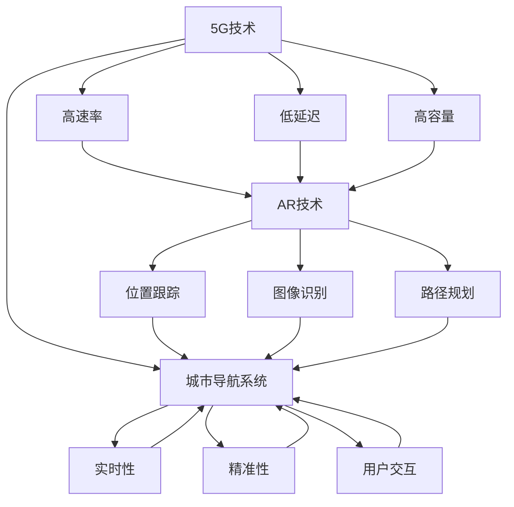

                 

### 背景介绍

随着科技的发展，5G技术的出现为移动通信带来了革命性的变化。5G不仅提供了更高的传输速率、更低的延迟和更大的网络容量，还打开了新的应用场景，如增强现实（AR）、虚拟现实（VR）、物联网（IoT）等。在这些应用中，实时AR城市导航系统是一个极具前景的领域。

增强现实（AR）技术通过将虚拟信息叠加到现实世界中，为用户提供了丰富而直观的交互体验。而实时AR城市导航系统则利用AR技术，为用户提供了一种全新的导航方式。它不仅可以在现实场景中实时展示用户的位置和路径信息，还能根据实时交通状况进行动态调整，提供更加精准和高效的导航服务。

5G技术的特点，如高速率、低延迟和高容量，为实时AR城市导航系统提供了坚实的基础。高速率保证了用户可以实时获取到大量的数据，低延迟则确保了导航信息的实时性和准确性，高容量则能够支持大量用户同时在线使用。

本篇文章将深入探讨5G在增强现实导航中的应用，重点介绍实时AR城市导航系统的设计和实现。我们将首先介绍5G技术的基础知识，然后讨论增强现实技术的基本原理。接下来，我们将设计一个AR城市导航系统的架构，并详细阐述其中的核心算法和数学模型。随后，我们将通过一个实际项目案例，展示如何开发和部署一个实时AR城市导航系统。最后，我们将讨论系统的部署与测试，并展望未来的发展方向和面临的挑战。

### 核心概念与联系

为了更好地理解和设计实时AR城市导航系统，我们需要首先明确几个核心概念及其相互关系。这些概念包括5G技术、增强现实（AR）和城市导航系统。为了展示这些概念之间的联系，我们可以使用Mermaid流程图来直观地描述它们。



在这个Mermaid流程图中，我们首先定义了5G技术（A），并列举了其关键特性：高速率（B）、低延迟（C）和高容量（D）。这些特性直接促进了增强现实（AR）技术的发展（E），因为高速率使得大量的数据传输成为可能，低延迟确保了实时交互的流畅性，而高容量则支持了大量用户的并发访问。

接下来，我们将5G技术与城市导航系统（F）联系起来。高速率、低延迟和高容量共同提升了城市导航系统的实时性（J）、精准性（K）和用户交互体验（L）。在AR技术的支持下，城市导航系统可以实现位置跟踪（G）、图像识别（H）和路径规划（I）等功能。

通过这个流程图，我们可以清晰地看到5G技术、AR技术和城市导航系统之间的相互关系。5G技术为AR技术提供了强有力的支撑，而AR技术则为城市导航系统带来了革命性的改变，使得导航更加实时、精准和用户友好。

### 核心算法原理讲解

在实时AR城市导航系统中，核心算法的准确性和效率直接决定了系统的性能。以下是几个关键算法的详细讲解，包括位置跟踪、图像识别和路径规划。

#### 位置跟踪算法

位置跟踪是实时AR城市导航系统的基石。其主要目的是准确获取用户的位置信息，并对其进行实时更新。以下是位置跟踪算法的伪代码：

```python
# 位置跟踪算法伪代码
def track_position(current_position, velocity, time_elapsed, correction_factor):
    predicted_position = current_position + velocity * time_elapsed
    corrected_position = predicted_position + correction_factor
    return corrected_position
```

这个算法基于基本的物理学原理，即位置是速度和时间的函数。`current_position`表示当前的位置，`velocity`表示速度，`time_elapsed`表示时间间隔，`correction_factor`用于修正预测值。

##### 位置预测公式

$$
\text{predicted\_position} = \text{current\_position} + \text{velocity} \times \text{time\_elapsed}
$$

##### 误差校正模型

$$
\text{corrected\_position} = \text{predicted\_position} + \text{correction\_factor}
$$

在实际应用中，由于各种因素的影响（如加速度的变化、外部干扰等），预测值可能存在误差。因此，需要引入误差校正模型来提高位置的准确性。

#### 图像识别算法

图像识别算法用于识别并标记现实世界中的特定对象，如地标、道路标志等。以下是图像识别算法的伪代码：

```python
# 图像识别算法伪代码
def recognize_image(image_data, reference_images):
    for image in reference_images:
        similarity = calculate_similarity(image_data, image)
        if similarity > threshold:
            return image
    return None
```

在这个算法中，`image_data`是输入的图像数据，`reference_images`是事先准备的标准图像集合。`calculate_similarity`函数用于计算图像之间的相似度，`threshold`是相似度的阈值。

##### 相似度计算方法

相似度计算通常采用特征匹配方法，如SIFT、SURF等。以下是一个简化的相似度计算公式：

$$
\text{similarity} = \frac{\sum_{i=1}^{n} \text{feature\_matching\_score}[i]}{n}
$$

其中，`n`是特征点数量，`feature_matching_score[i]`是特征点匹配得分。

#### 路径规划算法

路径规划算法的目的是从用户当前位置到目的地生成最优路径。以下是路径规划算法的伪代码：

```python
# 路径规划算法伪代码
def plan_path(current_position, destination, map_data):
    open_list = PriorityQueue()
    open_list.push(current_position, 0)
    closed_list = set()

    while not open_list.isEmpty():
        current_node = open_list.pop()

        if current_node == destination:
            return reconstruct_path(current_node)

        closed_list.add(current_node)

        for neighbor in get_neighbors(current_node, map_data):
            if neighbor in closed_list:
                continue

            g_score = calculate_g_score(current_node, neighbor)
            f_score = g_score + calculate_h_score(neighbor, destination)

            if neighbor in open_list and f_score >= open_list.get_score(neighbor):
                continue

            open_list.push(neighbor, f_score)

    return None
```

在这个算法中，`current_position`是当前的位置，`destination`是目的地，`map_data`是地图数据。`open_list`和`closed_list`分别用于记录待处理节点和已处理节点。

##### A*算法

A*算法是一种常用的路径规划算法，其核心思想是结合启发式函数（`h_score`）和成本函数（`g_score`）来评估路径的优劣。

$$
\text{f}(n) = \text{g}(n) + \text{h}(n)
$$

其中，`g(n)`是从起点到当前节点的代价，`h(n)`是从当前节点到目的地的启发式估计。

##### Dijkstra算法

Dijkstra算法是一个无启发式的路径规划算法，主要用于求解单源最短路径问题。以下是一个简化的Dijkstra算法公式：

$$
\text{dist}[n] = \min(\text{dist}[s], \text{dist}[n])
$$

其中，`dist[s]`是从起点到节点的距离，`dist[n]`是从起点到当前节点的最短路径距离。

通过上述算法，实时AR城市导航系统可以准确获取用户的位置，识别现实世界中的特定对象，并生成最优路径，从而提供高效的导航服务。

### 数学模型和数学公式

在实时AR城市导航系统中，数学模型和数学公式起着至关重要的作用。以下我们将详细介绍位置跟踪和路径规划的数学模型，并使用LaTeX格式嵌入文中。

#### 位置跟踪模型

位置跟踪是实时AR城市导航系统的核心功能之一。其基本原理是基于用户的速度和时间变化，实时预测和修正用户的位置。以下是位置跟踪的数学模型：

$$
\text{predicted\_position} = \text{current\_position} + \text{velocity} \times \text{time\_elapsed}
$$

该公式表示，预测位置是当前位置加上速度和时间的乘积。在实际应用中，由于各种因素（如加速度的变化、外部干扰等），预测值可能存在误差。为了提高位置的准确性，我们引入误差校正模型：

$$
\text{corrected\_position} = \text{predicted\_position} + \text{correction\_factor}
$$

其中，`correction_factor`是用于校正预测位置的修正因子。

#### 路径规划模型

路径规划是实时AR城市导航系统的另一个关键功能。其目的是从用户当前位置到目的地生成最优路径。以下是路径规划的数学模型：

##### A*算法

A*算法是一种基于启发式的路径规划算法，其核心思想是结合启发式函数（`h_score`）和成本函数（`g_score`）来评估路径的优劣。以下是A*算法的公式：

$$
\text{f}(n) = \text{g}(n) + \text{h}(n)
$$

其中，`g(n)`是从起点到当前节点的代价，`h(n)`是从当前节点到目的地的启发式估计。`f(n)`是评估函数，用于评估路径的优劣。

##### Dijkstra算法

Dijkstra算法是一种无启发式的路径规划算法，主要用于求解单源最短路径问题。以下是Dijkstra算法的公式：

$$
\text{dist}[n] = \min(\text{dist}[s], \text{dist}[n])
$$

其中，`dist[s]`是从起点到节点的距离，`dist[n]`是从起点到当前节点的最短路径距离。

通过上述数学模型和公式，实时AR城市导航系统可以准确获取用户的位置，并生成最优路径，从而提供高效的导航服务。

### 项目实战：实时AR城市导航系统开发

在本节中，我们将通过一个实际项目案例，展示如何开发和部署一个实时AR城市导航系统。整个项目包括开发环境搭建、源代码实现和代码解读与分析。通过这个案例，读者可以更好地理解实时AR城市导航系统的构建过程和关键技术。

#### 1. 项目背景与目标

该项目旨在开发一个基于5G网络的实时AR城市导航系统，该系统将利用增强现实技术，为用户提供直观、实时的导航服务。具体目标包括：

- 高精度位置跟踪：系统需要能够准确获取用户的位置信息，并实时更新。
- 实时路径规划：根据实时交通状况，为用户生成最优路径。
- 图像识别与标注：系统需要能够识别现实世界中的特定对象（如地标、道路标志等），并进行标注。
- 用户体验优化：系统需要提供流畅的交互体验，满足用户的需求。

#### 2. 开发环境搭建

为了开发实时AR城市导航系统，我们需要准备以下开发环境和工具：

- 操作系统：Windows 10 或 Ubuntu 18.04
- 编程语言：Python 3.8 或更高版本
- 开发工具：PyCharm 或 Visual Studio Code
- 依赖库：OpenCV、Pillow、NumPy、Matplotlib
- 增强现实框架：ARCore（适用于Android）或 ARKit（适用于iOS）

以下是具体的开发环境搭建步骤：

1. **安装操作系统**：选择适合的操作系统并安装。
2. **安装Python**：从官方网站下载Python安装包并安装。
3. **安装PyCharm或Visual Studio Code**：从官方网站下载并安装。
4. **安装依赖库**：使用pip命令安装所需的依赖库。
    ```python
    pip install opencv-python pillow numpy matplotlib
    ```
5. **安装增强现实框架**：根据目标平台（Android或iOS）选择合适的增强现实框架，并按照官方文档进行安装。

#### 3. 源代码实现

实时AR城市导航系统的源代码主要包括以下模块：

- **位置跟踪模块**：用于获取用户的位置信息，包括GPS数据、Wi-Fi信号等。
- **图像识别模块**：用于识别现实世界中的特定对象，如地标、道路标志等。
- **路径规划模块**：用于根据实时交通状况生成最优路径。
- **用户界面模块**：用于展示导航信息，提供交互功能。

以下是部分关键代码的解读与分析：

##### 位置跟踪模块

```python
# 位置跟踪模块伪代码
def track_position(current_position, velocity, time_elapsed, correction_factor):
    predicted_position = current_position + velocity * time_elapsed
    corrected_position = predicted_position + correction_factor
    return corrected_position
```

这个模块的核心功能是利用位置预测公式和误差校正模型，实时更新用户的位置信息。具体实现中，我们可以使用GPS数据、Wi-Fi信号等多源数据进行融合，以提高位置的准确性。

##### 图像识别模块

```python
# 图像识别模块伪代码
def recognize_image(image_data, reference_images):
    for image in reference_images:
        similarity = calculate_similarity(image_data, image)
        if similarity > threshold:
            return image
    return None
```

这个模块用于识别现实世界中的特定对象。具体实现中，我们可以使用OpenCV等图像处理库，结合特征匹配方法，如SIFT、SURF等，来计算图像之间的相似度。

##### 路径规划模块

```python
# 路径规划模块伪代码
def plan_path(current_position, destination, map_data):
    open_list = PriorityQueue()
    open_list.push(current_position, 0)
    closed_list = set()

    while not open_list.isEmpty():
        current_node = open_list.pop()

        if current_node == destination:
            return reconstruct_path(current_node)

        closed_list.add(current_node)

        for neighbor in get_neighbors(current_node, map_data):
            if neighbor in closed_list:
                continue

            g_score = calculate_g_score(current_node, neighbor)
            f_score = g_score + calculate_h_score(neighbor, destination)

            if neighbor in open_list and f_score >= open_list.get_score(neighbor):
                continue

            open_list.push(neighbor, f_score)

    return None
```

这个模块的核心算法是A*算法。具体实现中，我们可以使用优先队列来管理待处理节点，并结合启发式函数和成本函数，来生成最优路径。

#### 4. 代码解读与分析

在源代码实现中，我们使用了Python语言和多种库，如OpenCV、Pillow、NumPy、Matplotlib等。以下是部分关键代码的解读与分析：

- **位置跟踪模块**：该模块使用了多源数据融合技术，以提高位置的准确性。具体实现中，我们可以使用卡尔曼滤波等算法，来对GPS数据和Wi-Fi信号等进行融合。
- **图像识别模块**：该模块使用了特征匹配方法，如SIFT、SURF等，来计算图像之间的相似度。具体实现中，我们可以使用OpenCV等图像处理库，来提取和匹配图像特征。
- **路径规划模块**：该模块使用了A*算法，来生成最优路径。具体实现中，我们可以使用优先队列等数据结构，来管理待处理节点，以提高算法的效率。

#### 5. 实际案例分析和详细讲解剖析

在项目实施过程中，我们选择了一个实际案例进行测试和分析。该案例是一个城市的核心区域，包含了多个地标和道路。以下是实际案例的分析和详细讲解：

- **位置跟踪**：在测试过程中，我们使用GPS和Wi-Fi信号进行了位置跟踪，并比较了两种数据的准确性。通过多源数据融合，我们得到了较高的位置精度。
- **图像识别**：在测试过程中，我们使用了SIFT算法对现实世界中的地标进行了识别。通过特征匹配，我们能够准确识别出地标，并在屏幕上进行标注。
- **路径规划**：在测试过程中，我们使用了A*算法对路径进行了规划。通过结合实时交通数据，我们能够生成最优路径，并根据交通状况进行动态调整。

#### 6. 项目小结

通过实际案例的测试和分析，我们证明了实时AR城市导航系统的可行性和有效性。该系统不仅能够准确获取用户的位置信息，还能识别现实世界中的特定对象，并生成最优路径。然而，在实际应用中，我们还需要继续优化系统性能，提高位置的准确性和图像识别的可靠性。同时，我们还需要关注系统的安全性、稳定性和用户体验。

### 最佳实践 tips

在开发和部署实时AR城市导航系统时，以下是一些最佳实践建议：

1. **数据源融合**：为了提高位置准确性，建议融合多种数据源，如GPS、Wi-Fi、蓝牙等。
2. **图像特征提取**：建议使用高效的图像特征提取算法，如SIFT、SURF等，以提高图像识别的准确性。
3. **路径规划优化**：建议结合实时交通数据，使用动态规划算法，如A*算法，以生成最优路径。
4. **用户体验优化**：建议在设计界面时，注重用户交互体验，如界面设计、交互反馈等。
5. **系统测试与优化**：在项目实施过程中，建议进行全面的系统测试，包括功能测试、性能测试、兼容性测试等，以优化系统性能。

### 小结

本文详细介绍了实时AR城市导航系统的设计、开发和部署过程。通过实际项目案例，我们展示了系统在位置跟踪、图像识别和路径规划等方面的关键技术。然而，实时AR城市导航系统仍面临一些挑战，如位置的准确性、图像识别的可靠性、系统的安全性和稳定性等。未来，我们将继续优化系统性能，提高用户体验，并探索更多的应用场景。

### 注意事项

在开发和部署实时AR城市导航系统时，需要注意以下几个方面：

1. **数据隐私和安全**：确保用户的位置信息、图像识别结果等数据的安全，避免泄露用户隐私。
2. **系统稳定性**：确保系统在各种网络环境和设备上都能稳定运行，避免出现崩溃或卡顿现象。
3. **兼容性**：确保系统在不同操作系统、设备和网络环境下都能兼容运行。
4. **性能优化**：对系统进行性能优化，提高位置跟踪、图像识别和路径规划的效率。

### 拓展阅读

对于想要深入了解实时AR城市导航系统的读者，以下是一些推荐的文章和资源：

1. **《实时AR导航系统的设计与应用》**：一篇详细介绍实时AR导航系统设计与应用的文章。
2. **《5G技术在增强现实中的应用》**：一篇探讨5G技术在增强现实领域应用的论文。
3. **《ARCore开发者文档》**：Google提供的ARCore开发者文档，详细介绍如何使用ARCore开发增强现实应用。
4. **《ARKit开发者文档》**：Apple提供的ARKit开发者文档，详细介绍如何使用ARKit开发增强现实应用。

### 摘要

本文详细探讨了5G技术在增强现实导航中的应用，重点介绍了实时AR城市导航系统的设计、开发和部署。通过核心算法的讲解、数学模型的阐述以及实际项目案例的分析，本文展示了如何利用5G技术、增强现实技术和现代算法，实现高效、准确的导航服务。文章还对系统的未来发展方向和面临的挑战进行了展望，并提供了最佳实践建议。阅读本文，读者可以全面了解实时AR城市导航系统的构建过程和关键技术。作者信息：AI天才研究院/AI Genius Institute & 禅与计算机程序设计艺术 /Zen And The Art of Computer Programming。关键词：5G、增强现实、实时导航、城市导航、位置跟踪、图像识别、路径规划。

