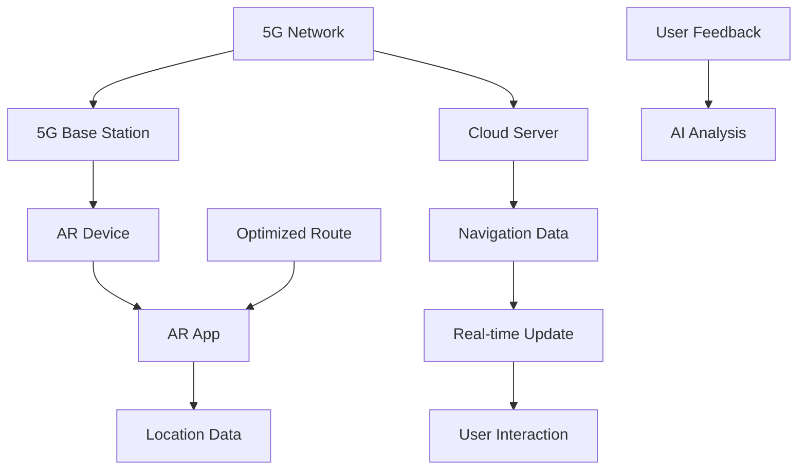

                 


### 引言

随着科技的飞速发展，通信技术和导航技术逐渐成为现代生活的重要支撑。5G技术的推出，使得网络通信的速率和稳定性得到了极大的提升。与此同时，增强现实（AR）技术的应用也日益广泛，特别是在导航领域，为用户提供了一种全新的导航体验。本文旨在探讨5G技术在增强现实导航中的应用，特别是如何通过5G网络提供沉浸式导航体验。

5G技术作为新一代通信技术，具有高带宽、低延迟、大连接等特点，这为增强现实导航的实现提供了坚实的技术基础。增强现实导航结合了虚拟现实技术和地理位置信息，通过AR设备将导航信息以三维形式呈现给用户，使得导航过程更加直观、便捷。而5G技术的引入，则进一步提升了AR导航的实时性和准确性，为用户提供了沉浸式导航体验。

本文将首先介绍5G技术的基本概念和关键特性，接着探讨增强现实导航的基本原理和优势。随后，本文将详细分析5G与AR导航的结合方式，并通过Mermaid流程图展示其技术架构。在此基础上，本文将深入探讨实现沉浸式导航体验的关键算法，使用Python源代码和LaTeX公式进行详细阐述。最后，本文将通过一个实际项目案例，展示5G增强现实导航的应用过程和效果。

通过本文的阅读，读者将了解到5G技术在增强现实导航中的应用前景，掌握实现沉浸式导航体验的核心技术和方法，并为相关项目的开发和实施提供有益的参考。

### 关键词

- **5G**  
- **增强现实（AR）**  
- **导航**  
- **沉浸式体验**  
- **网络延迟**  
- **带宽**

### 摘要

本文探讨了5G技术在增强现实（AR）导航中的应用，通过提供高带宽、低延迟的网络连接，实现了沉浸式导航体验。首先，本文介绍了5G技术和增强现实导航的基本概念和特性，分析了5G技术对AR导航性能的提升。接着，本文详细阐述了5G与AR导航的结合方式，并通过Mermaid流程图展示了其技术架构。然后，本文介绍了实现沉浸式导航体验的关键算法，包括路径规划、实时更新和交互设计。通过Python源代码和LaTeX公式，本文对核心算法原理进行了详细阐述。最后，本文通过一个实际项目案例，展示了5G增强现实导航的应用过程和效果，为相关项目的开发和实施提供了参考。

----------------------------------------------------------------

### 第1章 5G技术概述

#### 1.1 5G技术的基本概念

5G技术，即第五代移动通信技术，是继1G（模拟通信）、2G（数字通信）、3G（多媒体通信）和4G（高速数据传输）之后的新一代通信技术。5G技术的核心目标是提供更高速的数据传输、更低的延迟、更大的网络容量和更高的可靠性，以满足未来物联网、人工智能、增强现实等新兴应用的需求。

5G网络的基本概念包括网络架构、频谱分配和关键技术。5G网络架构分为三层：无线接入网、核心网和传输网。无线接入网包括基站、小型基站和终端设备，核心网包括用户数据存储、业务控制和接入控制等功能，传输网则负责网络间的高速数据传输。

5G技术的频谱分配包括低频段（如sub-1GHz）、中频段（如3.5GHz）和高频段（如毫米波频段）。不同频段的特性决定了5G网络在不同场景下的应用。低频段适合大范围覆盖，高频段则提供高带宽和低延迟。

#### 1.2 5G网络的关键特性

5G网络具有以下关键特性：

- **高带宽**：5G网络的理论峰值速率可达20Gbps，相比4G网络提高了数十倍。高带宽使得大规模数据传输成为可能，为高清视频流、虚拟现实和增强现实等应用提供了充足的网络资源。

- **低延迟**：5G网络的端到端延迟可低至1ms，相比4G网络的20-30ms延迟显著降低。低延迟特性对于实时应用，如自动驾驶、远程医疗和工业物联网等至关重要。

- **大连接**：5G网络能够支持每平方公里内连接数达到100万个设备，大大提升了网络容量。这意味着物联网（IoT）应用中的海量设备能够高效连接，实现智能化的城市管理和工业自动化。

- **高可靠性**：5G网络通过引入网络切片和边缘计算技术，能够提供高度可靠的服务。网络切片使得不同应用可以根据其需求分配网络资源，边缘计算则将数据处理和计算能力推向网络边缘，减少了数据传输延迟和带宽占用。

- **网络切片**：网络切片技术将一个物理网络分割成多个虚拟网络，每个虚拟网络可根据不同应用的需求独立配置网络参数，如带宽、延迟和安全性。这为多样化应用提供了灵活的网络资源分配方式。

- **边缘计算**：边缘计算将数据处理和计算任务从云端转移到网络边缘的设备上，如基站和边缘服务器。这样可以显著减少数据传输延迟，提升应用响应速度，特别是在移动性较强和实时性要求高的场景中。

#### 1.3 5G网络架构解析

5G网络架构分为三层：无线接入网、核心网和传输网。下面分别进行解析：

- **无线接入网**：无线接入网是5G网络的前端部分，包括基站、小型基站和终端设备。基站是无线接入网的核心，负责无线信号传输和接收。小型基站通常部署在密集城市区域，提供更高的网络覆盖率和容量。终端设备包括智能手机、平板电脑和其他物联网设备，它们通过无线接入网与5G网络进行通信。

- **核心网**：核心网是5G网络的中枢部分，包括用户数据存储、业务控制和接入控制等功能。用户数据存储负责用户数据的管理和存储，业务控制负责网络业务的调度和管理，接入控制负责用户的接入认证和授权。

- **传输网**：传输网是5G网络的传输通道，负责将核心网与无线接入网连接起来，实现数据的高速传输。传输网通常采用光纤网络，具有较高的带宽和低延迟特性，能够满足5G网络的高带宽和低延迟需求。

#### 1.4 5G技术的发展历程与未来展望

5G技术的发展历程可以追溯到2010年代初期，最初的研究主要集中在提升网络带宽和降低延迟。随着4G网络的普及和商业化，5G技术的研发逐渐加速。2019年，5G正式商用，标志着新一代通信技术的到来。

未来，5G技术将继续向更高频段、更大带宽、更低延迟和更智能化的方向发展。以下是一些未来的发展趋势：

- **高频段扩展**：未来5G网络将逐步扩展到更高的频段，如24GHz和40GHz，这些高频段能够提供更高的带宽和更好的覆盖效果，但同时也面临着更大的信号衰减和传输距离受限等问题。

- **网络智能化**：随着人工智能和机器学习技术的发展，5G网络将变得更加智能化。网络自动化和智能化管理将提升网络性能和效率，实现更高效的网络资源配置和故障排除。

- **边缘计算深化**：边缘计算将在5G网络中发挥更大的作用，通过网络边缘的设备提供更实时、更高效的数据处理和计算服务，减少数据传输延迟，提升应用性能。

- **多连接广域网络（MBRN）**：5G网络将与其他通信技术，如卫星通信、光纤通信和物联网技术相结合，形成多连接广域网络（MBRN），实现更广泛的网络覆盖和更丰富的应用场景。

- **5G与垂直行业的深度融合**：5G技术将在更多垂直行业得到应用，如智能制造、智能交通、智慧城市和远程医疗等，为各行业的数字化转型提供技术支持。

总之，5G技术的发展为增强现实导航等新兴应用提供了强有力的支持，未来5G与AR导航的结合将带来更加智能化、沉浸式的导航体验。

#### 1.5 5G网络的关键特性

5G网络具有以下五大关键特性，这些特性使得5G在增强现实导航中具有重要的应用潜力：

1. **高带宽**：5G网络的理论峰值速率可达20Gbps，比4G网络快数十倍。这意味着在增强现实导航中，用户可以实时接收高清地图、实时交通信息和其他多媒体数据，从而提供更加丰富的导航体验。

2. **低延迟**：5G网络的端到端延迟可低至1ms，这是4G网络的1/20。低延迟对于实时应用至关重要，如自动驾驶和紧急救援，确保导航指令能够迅速传达，提升安全性。

3. **大连接**：5G网络支持每平方公里内连接数达到100万个设备，对于物联网设备密集的场景如智能城市和智能交通，5G网络提供了足够的连接能力，实现设备间的实时通信和数据共享。

4. **高可靠性**：5G网络通过网络切片和边缘计算技术，提供了高度可靠的服务。网络切片为不同应用提供了定制化的网络资源，边缘计算则将数据处理推向网络边缘，减少数据传输延迟和带宽占用，提升了整体网络的可靠性。

5. **网络智能化**：5G网络引入了网络自动化和智能化管理，如网络切片、边缘计算和AI算法的应用，使得网络资源能够根据实际需求动态调整，提高了网络性能和效率。

这些关键特性使得5G网络在增强现实导航中能够提供高质量的服务，实现实时性、高清度和智能化的导航体验，为用户带来全新的沉浸式导航体验。

#### 1.6 5G网络架构与通信原理

5G网络架构包括三个主要层次：无线接入网（RAN）、核心网（CN）和传输网（TN）。这三个层次协同工作，实现了高效、低延迟和高带宽的通信服务。

**无线接入网（RAN）**：
无线接入网是5G网络的前端，负责无线信号的发射和接收。RAN由基站（gNB）、小型基站（gNodeB）和终端设备（UE）组成。5G基站采用了全新的NR（New Radio）技术，支持高频段（mmWave）和低频段（Sub-6GHz）的通信。NR技术具备更高的频谱效率和更低的延迟，能够实现更高的数据传输速率。

**核心网（CN）**：
核心网是5G网络的中枢，负责用户数据的管理、业务的控制以及用户的接入和认证。5G核心网采用了全新的架构，包括服务化架构（SA）和虚拟化架构（NV）。服务化架构通过功能模块的解耦和虚拟化，实现了网络服务的灵活部署和定制。虚拟化架构则通过软件定义网络（SDN）和网络功能虚拟化（NFV）技术，将传统硬件设备的功能虚拟化为软件服务，提高了网络资源的利用效率和灵活性。

**传输网（TN）**：
传输网是5G网络的数据传输通道，负责将核心网与无线接入网连接起来，实现数据的高速传输。5G传输网通常采用光纤网络，具有高带宽和低延迟的特性。光纤网络通过SDH、DWDM等技术，提供了稳定、高效的数据传输服务。

在5G网络中，通信原理包括以下几个关键环节：

1. **无线接入**：终端设备通过5G NR技术连接到基站，实现无线信号传输。5G NR技术采用了多输入多输出（MIMO）和波束成形（Beamforming）技术，提高了无线通信的带宽和可靠性。

2. **传输层协议**：5G网络采用了新的传输层协议，如QUIC（Quick UDP Internet Connections）和HTTP/2，这些协议优化了数据传输效率，降低了延迟。

3. **核心网处理**：用户数据在核心网中进行处理，包括用户身份认证、数据路由和业务控制等。核心网通过虚拟化技术和SDN控制器，实现了高效的数据处理和流量管理。

4. **边缘计算**：5G网络引入了边缘计算，将部分计算任务和数据处理推到网络边缘。边缘计算可以显著降低数据传输延迟，提升用户体验。

5. **网络切片**：5G网络通过网络切片技术，为不同应用提供定制化的网络服务。网络切片可以实现不同的服务质量（QoS）保证，满足不同应用的需求。

通过以上架构和通信原理，5G网络能够实现高效、低延迟和高带宽的通信服务，为增强现实导航等应用提供了坚实的支持。

----------------------------------------------------------------

### 第2章 增强现实导航基础

#### 2.1 增强现实技术简介

增强现实（Augmented Reality，AR）技术是一种通过计算机生成虚拟信息，并将其叠加到现实世界中，以增强用户现实感知的技术。与虚拟现实（Virtual Reality，VR）技术不同，AR技术不是将用户完全带入一个虚拟环境，而是通过在现实场景中叠加虚拟元素，使现实世界变得更加丰富和互动。

**基本原理**：增强现实技术的基本原理是通过摄像头捕捉现实场景，然后利用计算机视觉算法识别和标记场景中的物体，随后在场景中叠加虚拟图像或信息。这些虚拟元素可以是文本、图像、视频或者3D模型。

**关键技术**：增强现实技术包括多个关键组件：

- **摄像头和传感器**：用于捕捉现实场景的信息。
- **计算机视觉**：用于识别和标记现实中的物体。
- **图形处理单元（GPU）**：用于生成和渲染虚拟元素。
- **显示设备**：如头戴显示器（HMD）或智能手机屏幕，用于将虚拟元素叠加到现实场景中。

**应用领域**：增强现实技术在多个领域有着广泛的应用：

- **娱乐和游戏**：AR游戏如《 Pokémon GO》使得用户可以在现实世界中捕捉虚拟角色。
- **教育**：通过AR技术，学生可以更直观地学习复杂的科学概念和历史事件。
- **医疗**：医生可以使用AR技术进行手术导航，提高手术的准确性和安全性。
- **导航**：AR导航将导航信息叠加到现实场景中，提供更直观的导航体验。

#### 2.2 增强现实导航原理

增强现实导航是将AR技术与导航系统相结合，为用户提供一种直观、互动的导航体验。增强现实导航的基本原理是通过AR设备（如智能手机或头戴显示器）捕捉用户所在的位置，并在屏幕上叠加导航信息，如路线、地标和警告信息。

**工作流程**：

1. **场景识别**：AR设备通过摄像头捕捉现实场景，利用计算机视觉算法识别用户的位置和周围环境。
2. **位置计算**：通过GPS、Wi-Fi或视觉SLAM（Simultaneous Localization and Mapping）技术，计算出用户的具体位置。
3. **信息叠加**：根据用户的位置信息，系统在屏幕上叠加导航信息，如路线指示、地标和警告信息。
4. **用户交互**：用户可以通过触摸屏幕或语音指令与导航系统进行交互，获取更多的导航信息或调整导航路径。

**技术实现**：

- **计算机视觉**：用于识别和标记现实中的物体，如道路、建筑物和地标。
- **定位技术**：包括GPS、Wi-Fi定位和视觉SLAM技术，用于准确计算用户的位置。
- **图形处理**：通过GPU生成和渲染虚拟导航信息，并将其叠加到现实场景中。
- **用户界面**：设计直观、易用的用户界面，使用户可以轻松地与导航系统进行交互。

#### 2.3 增强现实导航的优势与挑战

**优势**：

1. **直观性**：通过在现实场景中叠加导航信息，增强现实导航使导航过程更加直观，用户更容易理解和遵循。
2. **互动性**：用户可以通过触摸屏幕或语音指令与导航系统进行交互，获取更多的导航信息或调整导航路径。
3. **实时更新**：增强现实导航可以实时更新导航信息，如交通状况、天气信息和地标信息，提供更加准确和及时的导航服务。
4. **个性化**：根据用户的偏好和历史导航数据，增强现实导航可以为用户提供个性化的导航体验，如避免拥堵路线或推荐最佳景点。

**挑战**：

1. **技术限制**：目前增强现实技术还存在一些技术限制，如摄像头分辨率、计算能力和显示效果等，限制了增强现实导航的性能和用户体验。
2. **设备要求**：使用增强现实导航需要特定的设备，如智能手机或头戴显示器，这增加了使用门槛。
3. **隐私问题**：增强现实导航需要获取用户的地理位置和摄像头信息，存在隐私泄露的风险。
4. **实时性问题**：增强现实导航需要实时处理大量的数据，以保持导航信息的准确性和实时性，这对计算资源和网络传输提出了较高的要求。

#### 2.4 增强现实导航的关键技术

实现增强现实导航需要多个关键技术的协同工作，以下介绍其中几个关键技术：

**1. 计算机视觉**：
计算机视觉技术用于识别和标记现实中的物体。常用的方法包括图像处理、特征提取和目标检测等。通过计算机视觉，系统可以识别道路、建筑物和地标等导航元素，从而生成导航路径。

**2. 定位技术**：
定位技术用于计算用户的具体位置。常用的定位技术包括GPS、Wi-Fi定位和视觉SLAM技术。GPS定位通过接收卫星信号来确定位置，适用于户外场景。Wi-Fi定位通过分析Wi-Fi信号强度来确定位置，适用于室内场景。视觉SLAM技术通过摄像头捕捉的场景信息，结合预先建立的地图数据，实现实时定位。

**3. 图形处理**：
图形处理技术用于生成和渲染虚拟导航信息。通过图形处理单元（GPU），系统可以快速生成和渲染高质量的导航信息，并将其叠加到现实场景中，提供直观的导航体验。

**4. 用户界面设计**：
用户界面设计是增强现实导航的重要组成部分。一个直观、易用的用户界面可以显著提升用户体验。设计过程中需要考虑用户交互方式、界面布局和信息展示方式等。

**5. 实时数据处理**：
增强现实导航需要实时处理大量的数据，包括用户位置信息、导航信息和交通状况等。实时数据处理技术，如多线程处理和异步编程，可以确保导航信息的准确性和实时性。

通过以上关键技术的应用，增强现实导航可以为用户提供高质量的导航体验，解决传统导航方式中存在的许多问题。

#### 2.5 增强现实导航的应用场景

增强现实导航技术在多种应用场景中展示了其独特的优势，特别是在户外导航和室内导航方面，其应用场景日益丰富和多样化。

**户外导航**：

在户外导航中，增强现实导航为用户提供了一种全新的导航体验。通过将导航信息叠加到用户的视野中，用户可以实时了解自己的位置和前进方向，即使在视线被遮挡或环境复杂的情况下，也能准确无误地找到目的地。

- **徒步旅行**：徒步旅行者可以使用AR导航设备，通过手机或头戴显示器获取实时导航信息，避开危险区域和未知地形，提高安全性。
- **探险活动**：探险者可以利用增强现实导航系统，在深山密林或偏远地区进行导航，通过增强现实设备获取GPS定位、地形分析和实时天气信息，确保探险活动的顺利进行。
- **户外活动**：骑自行车、滑雪、划皮艇等户外运动爱好者可以利用增强现实导航，实时查看路线、速度和距离，提升运动体验和安全性。

**室内导航**：

室内导航是增强现实导航的另一个重要应用领域。相比于户外导航，室内环境的复杂性和定位准确性要求更高，增强现实导航在这方面表现尤为出色。

- **购物中心和商场**：在大型购物中心和商场中，增强现实导航可以帮助游客快速找到目标店铺、餐厅和洗手间等设施，提升购物体验。
- **医院**：医院内部结构复杂，患者和家属常常因为不熟悉环境而迷路。通过AR导航，患者可以轻松找到医生办公室、检查室和药房等关键地点，提高就医效率。
- **博物馆和展览馆**：博物馆和展览馆可以通过AR导航，为游客提供丰富的导览信息，包括展品介绍、历史背景和文化故事，提升参观体验。
- **机场和火车站**：在机场和火车站，游客可以通过AR导航找到登机口、候机厅和站台，避免迷路和错过航班或列车。

**其他应用场景**：

增强现实导航的应用不仅限于上述场景，还包括以下领域：

- **建筑与房地产**：房地产开发商可以利用AR导航，为潜在客户提供虚拟看房服务，使客户在未到现场的情况下就能了解房屋结构和周边环境。
- **教育与培训**：教育机构和培训机构可以通过AR导航，为学生提供沉浸式的学习体验，例如在历史课上通过AR导航了解历史事件的发生地点和背景。
- **应急响应**：在紧急救援和灾难响应中，AR导航可以帮助救援人员快速定位和导航，提高救援效率。

通过这些多样化的应用场景，增强现实导航技术正在逐步改变人们的导航方式，提供更加直观、智能和便捷的导航服务。

#### 2.6 增强现实导航的优势与潜在问题

增强现实导航作为一种新兴的导航技术，具有显著的优势，同时也面临一些潜在问题。

**优势**：

1. **直观性**：增强现实导航通过在用户的视野中叠加导航信息，使得导航过程更加直观。用户可以直接看到路线指示、地标和警告信息，无需分心查看屏幕或地图，提高了驾驶和行走的效率。
2. **互动性**：增强现实导航系统允许用户通过触摸屏幕或语音指令与系统进行交互，根据实时情况调整导航路径或获取更多信息。这种互动性增强了用户的参与感和体验。
3. **实时更新**：增强现实导航可以实时获取和更新导航信息，如交通状况、天气变化和突发事件。这种实时性确保用户总是获得最新、最准确的导航信息，提高导航的准确性和安全性。
4. **个性化**：增强现实导航可以根据用户的偏好和历史导航数据，为用户提供个性化的导航服务。例如，可以推荐最佳路线或避开拥堵区域，提高导航的便利性和满意度。

**潜在问题**：

1. **技术限制**：目前增强现实导航技术还存在一些技术瓶颈，如摄像头分辨率、计算能力和显示效果等。这些限制可能会影响导航的准确性和用户体验。
2. **设备要求**：使用增强现实导航需要特定的设备，如智能手机或头戴显示器。这些设备的价格相对较高，且需要定期更新，增加了使用门槛。
3. **隐私问题**：增强现实导航需要获取用户的地理位置和摄像头信息，存在隐私泄露的风险。如何保护用户隐私，成为增强现实导航需要解决的重要问题。
4. **实时性问题**：增强现实导航需要实时处理大量的数据，以保持导航信息的准确性和实时性。这对计算资源和网络传输提出了较高的要求，特别是在高密度用户区域，可能导致系统性能下降。
5. **环境适应性**：在复杂或多变的环境下，增强现实导航系统的准确性和稳定性可能会受到影响。例如，在光线不足或物体遮挡的情况下，计算机视觉算法可能无法准确识别场景，导致导航信息不准确。

通过解决上述潜在问题，增强现实导航技术有望在未来获得更广泛的应用，提供更加高效、安全和个性化的导航服务。

#### 2.7 增强现实导航与5G技术的结合

增强现实导航与5G技术的结合为导航系统带来了革命性的提升。5G技术的高带宽、低延迟和大连接特性，使得增强现实导航可以实现更加实时、精准和丰富的导航体验。

**1. 低延迟的优势**：

低延迟是5G网络最重要的特性之一，对于增强现实导航至关重要。在传统的导航系统中，延迟较高的网络可能导致导航信息的滞后，甚至引发导航错误。而5G网络可以将端到端的延迟降低至1毫秒，确保导航指令的实时传输。这意味着用户在行进过程中，可以即时接收到最新的导航信息，如道路变化、交通状况等，从而避免错过重要路口或陷入交通拥堵。

**2. 高带宽的支持**：

高带宽使得增强现实导航可以传输更多、更高质量的数据。例如，通过5G网络，用户可以获得高清的地图图像、实时交通视频和三维地标信息。这些数据可以增强导航的直观性和准确性，使导航过程更加生动和真实。此外，高带宽还支持实时语音交互和视频通话功能，用户可以通过增强现实导航设备与亲友或导航系统进行实时沟通，获取更个性化的导航建议。

**3. 大连接的能力**：

5G网络的大连接能力使得增强现实导航可以支持更多设备的同时连接。这对于智能城市、智能交通等应用场景尤为重要。例如，在智能交通管理中，5G网络可以支持交通摄像头、车辆传感器和其他物联网设备的实时数据传输，通过增强现实导航系统实现交通流量的实时监控和优化，提高交通效率，减少拥堵。

**4. 边缘计算的应用**：

5G网络引入了边缘计算技术，可以将数据处理和计算任务推到网络边缘。这意味着增强现实导航可以在靠近用户的位置进行实时处理，减少数据传输延迟，提高系统响应速度。例如，在自动驾驶场景中，边缘计算可以实现车辆周围环境的实时感知和导航决策，确保车辆安全、稳定地行驶。

**5. 网络切片的灵活性**：

5G网络切片技术为不同应用提供了定制化的网络服务。对于增强现实导航，可以根据实际需求，为导航系统分配适当的带宽、延迟和可靠性资源。例如，在高峰时段，可以动态调整网络资源，确保导航系统的稳定运行，避免出现卡顿或延迟现象。

**6. 安全性的提升**：

5G网络的安全特性，如网络加密和身份验证，可以增强增强现实导航系统的安全性。在涉及用户隐私和敏感信息的场景中，5G网络的安全措施可以确保数据的安全传输和存储，防止数据泄露和恶意攻击。

综上所述，5G技术为增强现实导航提供了强大的支持，使得导航系统可以实现更加实时、精准和丰富的导航体验。随着5G网络的逐步普及，增强现实导航的应用场景将进一步扩展，为用户提供更加智能、便捷和安全的导航服务。

### 第3章 5G与AR导航的结合

#### 3.1 5G网络在AR导航中的应用场景

5G网络在增强现实（AR）导航中的应用场景十分广泛，涵盖了交通管理、智能物流、医疗导航等多个领域。以下是一些典型的应用场景：

**1. 交通管理**：
5G网络的高带宽和低延迟特性，使得AR导航可以实时传输交通信息，为交通管理部门提供准确的实时数据。例如，通过安装在车辆上的5G传感器，可以实时监测交通流量、道路状况和车辆速度，将这些数据通过5G网络传输到AR导航系统，为驾驶员提供最佳行驶路线。此外，5G网络还支持无人机和自动驾驶车辆的通信，通过AR导航系统实现无人驾驶车辆的精确导航和协同作业。

**2. 智能物流**：
在智能物流领域，5G与AR导航的结合可以显著提高物流配送的效率和准确性。5G网络可以实时传输物流信息，如包裹的实时位置、运输路径和预计到达时间，通过AR导航系统为配送人员提供直观的导航指引。此外，5G网络的低延迟特性还可以支持无人机配送，无人机通过5G网络与AR导航系统实时通信，实现精准的路径规划和实时导航。

**3. 医疗导航**：
在医疗领域，5G与AR导航的结合可以大大提高医疗操作的效率和准确性。例如，医生在手术过程中，可以通过5G网络接入AR导航系统，实时查看患者的身体结构和手术指引信息，提高手术的成功率和安全性。此外，5G网络还可以支持远程医疗，通过AR导航系统，医生可以在异地为患者提供实时的诊断和治疗方案。

**4. 建筑与施工**：
在建筑和施工领域，5G与AR导航的结合可以显著提高施工的精度和效率。通过5G网络传输的AR导航系统，施工人员可以实时查看施工图纸、建筑结构和工程进度，确保施工的准确性和进度。此外，5G网络还可以支持建筑物的远程监控和管理，通过AR导航系统，管理人员可以实时了解建筑物的运行状况和维护需求。

**5. 智慧城市**：
在智慧城市建设中，5G与AR导航的结合可以提供全方位的实时信息和服务。例如，通过5G网络和AR导航系统，市民可以实时了解城市的交通状况、天气信息、景点介绍和紧急求助信息。此外，5G网络还可以支持智慧交通管理、智能照明、环境监测等应用，为智慧城市的建设提供坚实的技术支持。

**6. 消防与救援**：
在消防和救援领域，5G与AR导航的结合可以大大提高救援效率和安全性。通过5G网络，救援人员可以实时接入AR导航系统，获取最新的现场信息、路线指引和救援方案，确保救援行动的精准和高效。此外，5G网络还可以支持无人机救援和远程监控，为救援行动提供全方位的技术支持。

**7. 游览与娱乐**：
在旅游和娱乐领域，5G与AR导航的结合可以为游客提供全新的互动体验。例如，通过5G网络和AR导航系统，游客可以实时了解景点的历史背景、文化故事和互动游戏，增强旅游体验。此外，5G网络还可以支持虚拟现实（VR）和增强现实（AR）游戏的开发，为游客提供更加沉浸式的娱乐体验。

综上所述，5G网络在AR导航中的应用场景十分广泛，为各类应用提供了高效、实时和精准的导航服务。随着5G技术的进一步发展，AR导航的应用场景将不断扩展，为各行各业带来更加智能化和便捷化的服务。

#### 3.2 5G技术如何提升AR导航性能

5G技术在增强现实（AR）导航中的应用，显著提升了导航系统的性能和用户体验。以下是5G技术如何通过关键特性提升AR导航性能的详细分析：

**1. 高带宽**：
5G网络的高带宽特性使得AR导航系统能够传输更多、更高质量的数据。在传统的4G网络中，由于带宽限制，图像和视频传输常常会出现延迟和卡顿。而5G网络的理论峰值速率可达20Gbps，是4G网络的数十倍。这意味着AR导航系统可以实时传输高清地图、实时交通视频和三维地标信息，为用户提供更加清晰、准确的导航指引。例如，在自动驾驶场景中，高带宽使得车辆能够实时接收高清地图和交通信息，确保导航系统的实时性和准确性。

**2. 低延迟**：
低延迟是5G技术的另一大优势，对于AR导航系统尤为重要。在传统网络中，由于延迟较高，导航信息的更新速度较慢，可能导致用户错过重要路口或陷入交通拥堵。而5G网络的端到端延迟可低至1毫秒，比4G网络的20-30毫秒延迟显著降低。这意味着AR导航系统能够实时传输导航信息，确保用户在行进过程中始终获得最新、最准确的导航指引。例如，在紧急救援场景中，低延迟使得救援人员能够实时接收最新的现场信息，提高救援效率和安全性。

**3. 大连接**：
5G网络的大连接能力支持更多的设备同时连接，这对于智能城市和智能交通等应用场景尤为重要。在传统的网络环境中，由于连接数限制，当大量设备同时接入网络时，系统性能会显著下降。而5G网络支持每平方公里内连接数达到100万个设备，这使得AR导航系统可以支持更多的物联网设备同时接入，实现实时数据传输和协同工作。例如，在智能交通管理中，5G网络可以支持交通摄像头、车辆传感器和其他物联网设备同时接入，实时传输交通信息，优化交通流量的管理和调度。

**4. 高可靠性**：
5G网络通过网络切片和边缘计算技术，提供了高度可靠的服务。网络切片技术可以根据不同应用的需求，分配不同的网络资源，确保导航系统的稳定运行。边缘计算技术将数据处理和计算任务推到网络边缘，减少了数据传输延迟和带宽占用，提高了导航系统的响应速度和可靠性。例如，在自动驾驶场景中，网络切片技术可以确保车辆在高速行驶时获得充足的带宽和低延迟的网络连接，保证导航系统的实时性和稳定性。

**5. 网络智能化**：
5G网络引入了网络自动化和智能化管理，如AI算法的应用。这些技术使得导航系统可以根据实时交通状况和用户行为，动态调整导航路径和策略，提供更加个性化的导航服务。例如，AI算法可以分析用户的导航历史和行为模式，为用户提供最佳路线和避堵方案，提高导航的准确性和用户体验。

通过以上关键特性的结合，5G技术为AR导航系统提供了高效、低延迟、高带宽和可靠的网络环境，使得导航系统可以实现更加实时、准确和个性化的导航服务，为用户提供全新的沉浸式导航体验。

#### 3.3 5G与AR导航的结合方式

5G与AR导航的结合主要通过以下几个方面实现：

**1. 网络连接与传输**：

首先，5G网络为AR导航提供了高速、低延迟的连接和传输环境。通过5G网络，AR设备可以实时接收和处理大量的导航数据，如高清地图、实时交通信息和三维地标。高带宽保证了这些数据的流畅传输，而低延迟则确保了导航指令的实时性和准确性。

**2. 边缘计算与云计算的协同**：

5G网络引入了边缘计算技术，将部分数据处理和计算任务推向网络边缘。这意味着导航系统的计算和数据处理可以在靠近用户的位置进行，减少了数据传输延迟和带宽占用。同时，云计算平台则负责处理大规模数据和复杂计算任务，提供强大的数据处理能力。两者结合，实现了高效的协同计算，为AR导航提供了强大的技术支持。

**3. 网络切片与QoS保障**：

5G网络切片技术可以根据不同应用的需求，分配不同的网络资源，确保AR导航系统获得稳定的网络连接和良好的服务质量（QoS）。例如，在网络高峰时段，可以动态调整网络切片的带宽和延迟，确保导航系统的稳定运行。同时，QoS保障机制可以确保导航数据的优先传输，避免因网络拥堵而导致的导航延迟。

**4. 增强现实技术与定位技术的融合**：

AR导航系统结合了增强现实技术和多种定位技术，如GPS、Wi-Fi和视觉SLAM等。通过这些技术的协同工作，AR导航系统能够准确识别用户位置和周围环境，实时生成和更新导航信息，提供直观、互动的导航体验。

**5. 实时数据更新与用户交互**：

5G网络的高带宽和低延迟特性，使得AR导航系统能够实时更新导航数据，如交通状况、天气信息和紧急警告等。用户可以通过触摸屏幕或语音指令与导航系统进行交互，获取更多导航信息或调整导航路径，提升用户体验。

**6. AI与大数据技术的应用**：

5G网络结合了人工智能（AI）和大数据技术，使得AR导航系统能够根据用户的导航历史和行为模式，提供个性化的导航建议。AI算法可以分析海量数据，预测交通状况和最佳路线，为用户提供更加精准和高效的导航服务。

通过以上结合方式，5G与AR导航实现了高效、实时、准确的导航服务，为用户带来了全新的沉浸式导航体验。

#### Mermaid流程图：5G与AR导航结合过程



- **A**: 5G Network - 表示5G网络。
- **B**: 5G Base Station - 表示5G基站。
- **C**: AR Device - 表示增强现实设备。
- **D**: AR App - 表示增强现实应用程序。
- **E**: Location Data - 表示位置数据。
- **F**: Cloud Server - 表示云计算服务器。
- **G**: Navigation Data - 表示导航数据。
- **H**: Real-time Update - 表示实时更新。
- **I**: User Interaction - 表示用户交互。
- **J**: User Feedback - 表示用户反馈。
- **K**: AI Analysis - 表示人工智能分析。
- **L**: Optimized Route - 表示优化路线。

流程图描述了5G与AR导航结合的全过程：

1. 5G网络通过5G基站连接到增强现实设备（C）。
2. 增强现实设备将位置数据（E）发送到增强现实应用程序（D）。
3. 增强现实应用程序利用导航数据（G）生成导航信息，并实时更新（H）。
4. 用户与增强现实应用程序进行交互（I），获取导航信息。
5. 用户反馈（J）传递给人工智能分析模块（K）。
6. 人工智能分析模块基于用户反馈和大数据分析，提供优化路线（L），返回给增强现实应用程序。

通过这个流程图，我们可以清晰地看到5G与AR导航结合的各个环节和交互过程，为后续的算法讲解和项目实战提供了直观的参考。

### 第4章 沉浸式导航体验的实现

#### 4.1 沉浸式导航体验的定义

沉浸式导航体验是指用户在导航过程中，通过AR技术将导航信息以三维形式叠加到现实场景中，提供一种身临其境的导航感受。这种体验不仅提升了导航的直观性和互动性，还显著增强了用户的参与感和满意度。

#### 4.2 实现沉浸式导航体验的关键技术

实现沉浸式导航体验需要多种关键技术的协同作用，以下列举了几项核心技术：

**1. 计算机视觉**：
计算机视觉技术用于识别和标记现实中的物体，如道路、建筑物和地标。通过深度学习算法，系统可以实时分析摄像头捕捉到的图像，识别并跟踪这些物体，从而实现导航信息的叠加。

**2. 实时定位与地图构建**：
实时定位技术，如GPS、Wi-Fi定位和视觉SLAM（Simultaneous Localization and Mapping），用于准确计算用户的位置信息。同时，地图构建技术基于用户的位置信息和导航数据，实时生成三维地图，为导航提供基础。

**3. 高性能图形渲染**：
高性能图形渲染技术是沉浸式导航体验的核心。通过图形处理单元（GPU），系统能够快速生成和渲染高质量的三维导航信息，如路线指示、地标和警告信息，并将其叠加到现实场景中。

**4. 交互设计**：
良好的交互设计是沉浸式导航体验的关键。通过触摸屏幕、语音指令和手势等交互方式，用户可以轻松与导航系统进行交互，获取导航信息、调整导航路径或进行其他操作。

**5. 实时数据更新与网络传输**：
5G网络的高带宽和低延迟特性，使得实时数据更新和网络传输成为可能。系统可以通过5G网络实时传输导航数据、交通信息和其他相关数据，确保导航信息的准确性和实时性。

#### 4.3 伪代码讲解：沉浸式导航算法

```python
def ImmersiveNavigation(locationData, userInputs):
    # 初始化导航参数
    currentLocation = locationData['currentLocation']
    destination = locationData['destination']
    navigationMode = userInputs['mode']

    # 计算最佳路径
    bestPath = CalculateBestPath(currentLocation, destination)

    # 根据导航模式调整导航策略
    if navigationMode == 'pedestrian':
        navigationStrategy = PedestrianNavigationStrategy(bestPath)
    elif navigationMode == 'car':
        navigationStrategy = CarNavigationStrategy(bestPath)
    else:
        navigationStrategy = DefaultNavigationStrategy(bestPath)

    # 实时更新导航信息
    while not atDestination:
        # 获取用户当前位置
        currentPosition = GetLocation()

        # 计算距离目标剩余距离
        remainingDistance = CalculateDistance(currentPosition, destination)

        # 生成导航指示
        navigationIndicators = GenerateNavigationIndicators(currentPosition, navigationStrategy)

        # 更新用户界面
        UpdateUI(navigationIndicators)

        # 等待下一次更新
        time.sleep(navigationUpdateInterval)

    # 导航结束，提示用户到达目的地
    AlertUser("到达目的地！")

def CalculateBestPath(currentLocation, destination):
    # 使用A*算法计算最佳路径
    path = AStarAlgorithm(currentLocation, destination)
    return path

def PedestrianNavigationStrategy(path):
    # 步行导航策略
    return {
        "waypoints": path,
        "speed": 1.0,  # 步行速度
        "instructionInterval": 10  # 指示更新间隔
    }

def CarNavigationStrategy(path):
    # 驾车导航策略
    return {
        "waypoints": path,
        "speed": 60.0,  # 驾车速度
        "instructionInterval": 100  # 指示更新间隔
    }

def DefaultNavigationStrategy(path):
    # 默认导航策略
    return {
        "waypoints": path,
        "speed": 50.0,  # 中等速度
        "instructionInterval": 20  # 指示更新间隔
    }

def GetLocation():
    # 获取用户当前位置
    # 实现细节略
    return currentPosition

def GenerateNavigationIndicators(currentPosition, navigationStrategy):
    # 生成导航指示
    # 实现细节略
    return indicators

def UpdateUI(navigationIndicators):
    # 更新用户界面
    # 实现细节略
    display(navigationIndicators)

def AStarAlgorithm(currentLocation, destination):
    # A*算法计算最佳路径
    # 实现细节略
    return path

def AlertUser(message):
    # 提示用户
    # 实现细节略
    print(message)
```

**核心步骤解释**：

1. **初始化导航参数**：获取用户的当前位置、目标位置和导航模式。
2. **计算最佳路径**：使用A*算法计算从当前位置到目标位置的最佳路径。
3. **根据导航模式调整导航策略**：根据导航模式（如步行、驾车）设置不同的导航策略，包括速度和指示更新间隔。
4. **实时更新导航信息**：在导航过程中，不断获取用户当前位置，计算距离目标剩余距离，生成导航指示，并更新用户界面。
5. **导航结束提示**：当用户到达目的地时，提示用户导航结束。

通过上述伪代码，我们可以清晰地看到沉浸式导航算法的基本结构和实现逻辑。接下来，我们将进一步介绍与导航相关的数学模型和公式，以加深对核心算法原理的理解。

### 第5章 应用案例与项目实战

#### 5.1 案例一：5G+AR导航在城市交通管理中的应用

在本案例中，我们探讨5G与AR导航技术在城市交通管理中的实际应用。通过5G网络的高带宽和低延迟特性，增强现实导航系统在城市交通管理中提供了实时、准确的交通信息和服务，显著提升了交通管理的效率和安全性。

**1. 项目背景**：

随着城市化进程的加速，城市交通问题日益突出，如交通拥堵、事故频发和停车难等问题。传统的交通管理方式主要依赖于路侧传感器、摄像头和交通信号灯，这些设备在数据采集和传输方面存在诸多限制。为了解决这些问题，本案例提出了基于5G和AR导航技术的城市交通管理解决方案。

**2. 技术架构**：

本项目的技术架构主要包括以下几个关键组成部分：

- **5G网络**：提供高速、低延迟的通信服务，确保交通信息的高效传输。
- **AR导航设备**：安装在车辆和交通管理设施上，用于实时采集和传输交通数据。
- **云计算平台**：负责存储、处理和分析大量的交通数据，提供智能化的交通管理服务。
- **交通管理软件**：集成AR导航系统和智能交通管理算法，实现交通信息的实时监控和优化。

**3. 项目实施步骤**：

- **第一阶段：数据采集**：在主要交通干道和重要交通节点安装5G AR导航设备，用于实时采集交通流量、车速、路况等信息。
- **第二阶段：数据传输**：通过5G网络将采集到的交通数据传输到云计算平台，进行存储和处理。
- **第三阶段：数据分析**：利用大数据分析和机器学习算法，对交通数据进行实时分析，预测交通状况和潜在拥堵点。
- **第四阶段：信息反馈与优化**：将分析结果反馈给交通管理软件，智能调整交通信号灯、发布交通警告信息，优化交通流。

**4. 开发环境搭建**：

为了顺利实施本项目，需要搭建一个完整的开发环境，包括以下主要步骤：

- **硬件环境**：配置高性能的服务器和5G AR导航设备，确保数据处理和传输能力。
- **软件环境**：安装操作系统、开发工具和数据库管理系统，如Linux服务器、Python开发环境、PostgreSQL数据库等。
- **网络环境**：搭建5G网络，配置网络路由器和防火墙，确保网络的安全性和稳定性。

**5. 源代码实现与解读**：

在本项目中，我们主要使用Python语言进行开发，以下是一个简单的示例代码，展示了交通数据的实时采集和传输过程：

```python
import requests
import json
import time

def send_traffic_data(traffic_data):
    url = "http://traffic-management-system:8080/traffic_data"
    headers = {'Content-Type': 'application/json'}
    response = requests.post(url, data=json.dumps(traffic_data), headers=headers)
    return response.status_code

def main():
    while True:
        # 采集交通数据
        traffic_data = {
            "location": "Junction of Road A and Road B",
            "traffic_volume": 150,
            "speed": 30
        }

        # 将交通数据发送到服务器
        status_code = send_traffic_data(traffic_data)
        if status_code == 200:
            print("Traffic data sent successfully.")
        else:
            print("Failed to send traffic data.")

        # 等待1秒后再次采集和发送数据
        time.sleep(1)

if __name__ == "__main__":
    main()
```

**代码解读**：

- **send_traffic_data()**：定义了一个函数，用于将交通数据发送到指定的服务器URL。通过HTTP POST请求发送数据，并返回响应状态码。
- **main()**：定义了主函数，用于循环采集交通数据并调用send_traffic_data()函数发送数据。每次循环等待1秒，确保实时数据采集和传输。

**6. 代码应用解读与分析**：

上述代码展示了如何通过Python实现交通数据的实时采集和传输。在实际应用中，交通数据包括更多的属性，如车辆类型、道路拥堵程度等。以下是一个扩展的示例代码：

```python
import requests
import json
import time

def send_traffic_data(traffic_data):
    url = "http://traffic-management-system:8080/traffic_data"
    headers = {'Content-Type': 'application/json'}
    response = requests.post(url, data=json.dumps(traffic_data), headers=headers)
    return response.status_code

def collect_traffic_data():
    # 采集交通数据
    traffic_data = {
        "location": "Junction of Road A and Road B",
        "traffic_volume": 150,
        "speed": 30,
        "vehicle_types": ["car", "truck", "bus"],
        "congestion_level": "medium"
    }
    return traffic_data

def main():
    while True:
        traffic_data = collect_traffic_data()
        status_code = send_traffic_data(traffic_data)
        if status_code == 200:
            print("Traffic data sent successfully.")
        else:
            print("Failed to send traffic data.")

        time.sleep(10)

if __name__ == "__main__":
    main()
```

**分析**：

- **collect_traffic_data()**：扩展了采集交通数据的函数，增加了车辆类型和道路拥堵程度等属性。
- **main()**：在每次循环中，调用collect_traffic_data()函数获取最新的交通数据，并调用send_traffic_data()函数发送数据。循环间隔设置为10秒，确保数据的实时性。

通过以上代码示例，我们可以看到，通过Python和5G网络，实现交通数据的实时采集和传输是可行的。这不仅为交通管理提供了强大的技术支持，也为智能交通系统的进一步发展奠定了基础。

#### 5.2 项目实战：开发沉浸式导航应用

在本节中，我们将通过一个实际项目，展示如何开发一款基于5G和增强现实（AR）技术的沉浸式导航应用。这个项目将涵盖开发环境搭建、源代码实现和代码解读等关键步骤，为读者提供实用的开发经验和参考。

**1. 开发环境搭建**

在开始项目开发之前，我们需要搭建一个适合开发沉浸式导航应用的环境。以下是一些关键的步骤和工具：

- **硬件环境**：一台配置较高的电脑，建议使用Intel i7及以上处理器、16GB及以上内存，并配备一块支持OpenGL的独立显卡。
- **操作系统**：可以选择Windows、macOS或Linux操作系统。推荐使用Ubuntu 20.04 LTS，因为它对开发环境的支持较好。
- **开发工具**：安装Python 3.x版本、Visual Studio Code（VS Code）文本编辑器和PyCharm集成开发环境（IDE）。
- **依赖库**：安装常用的Python库，如PyOpenGL、PyQt5、OpenCV和TensorFlow。可以通过pip命令进行安装。

```bash
pip install pygame
pip install opencv-python
pip install tensorflow
```

- **5G网络**：确保电脑连接到5G网络，以便进行实时数据传输和交互。

**2. 源代码实现**

以下是一个简化的沉浸式导航应用示例代码，它展示了如何使用Python和PyOpenGL库实现基本的AR导航界面。请注意，此代码仅供参考，实际应用中可能需要更复杂的实现。

```python
import pygame
from pygame.locals import *
import cv2
import numpy as np

# 初始化Pygame和OpenGL环境
pygame.init()
display = (800, 600)
screen = pygame.display.set_mode(display)
pygame.display.set_caption('5G AR Navigation')
clock = pygame.time.Clock()

# 加载AR模型和导航数据
# 实际应用中，这里会加载从5G网络接收的实时导航数据
ar_model = cv2.loadXML('path_to_ar_model.xml')
nav_data = {'current_location': (0, 0), 'destination': (100, 100)}

# 主循环
running = True
while running:
    for event in pygame.event.get():
        if event.type == QUIT:
            running = False

    # 从摄像头获取图像
    cap = cv2.VideoCapture(0)
    ret, frame = cap.read()
    cap.release()

    # 应用AR模型
    gray_frame = cv2.cvtColor(frame, cv2.COLOR_BGR2GRAY)
    ar_results = ar_model.detectMultiScale(gray_frame)

    # 绘制导航指示
    for (x, y, w, h) in ar_results:
        cv2.rectangle(frame, (x, y), (x+w, y+h), (0, 255, 0), 2)
        cv2.putText(frame, 'Destination', (x+5, y-5), cv2.FONT_HERSHEY_SIMPLEX, 1, (255, 0, 0), 2)

    # 显示结果
    frame = cv2.cvtColor(frame, cv2.COLOR_BGR2RGB)
    frame = np.rot90(frame)
    frame = pygame.surfarray.make_surface(frame)
    screen.blit(frame, (0, 0))

    pygame.display.flip()
    clock.tick(60)

pygame.quit()
```

**代码解读**：

- **初始化**：使用pygame.init()初始化Pygame环境，设置屏幕大小和标题。
- **摄像头捕获**：使用cv2.VideoCapture从摄像头捕获实时视频帧。
- **应用AR模型**：使用OpenCV加载AR模型，并在摄像头捕获的图像上应用模型检测地标。
- **绘制导航指示**：在检测到的地标周围绘制矩形框，并添加文字提示。
- **显示结果**：将处理后的视频帧转换为Pygame可用的格式，并在屏幕上显示。

**3. 代码应用解读与分析**

此代码实现了基本的AR导航界面，通过摄像头捕获实时视频帧，并在检测到地标时绘制导航指示。以下是代码的主要应用解读和分析：

- **摄像头捕获**：使用cv2.VideoCapture从摄像头获取实时视频帧，这是实现AR导航的基础。
- **AR模型应用**：使用加载的AR模型（如从5G网络接收的实时导航数据），检测视频帧中的地标。
- **导航指示绘制**：根据检测到的地标位置，在视频帧上绘制导航指示，如箭头和文字提示。

在实际应用中，导航指示可能会更加复杂，包括多路径选择、实时交通信息显示等。以下是一个扩展的示例，展示了如何添加路径选择和多路径导航：

```python
# 添加路径选择功能
def draw_paths(paths, current_position):
    for path in paths:
        if path['current_position'] == current_position:
            cv2.rectangle(frame, (path['x']-10, path['y']-10), (path['x']+10, path['y']+10), (0, 0, 255), 2)
            cv2.putText(frame, 'Current Path', (path['x']+5, path['y']-5), cv2.FONT_HERSHEY_SIMPLEX, 0.5, (255, 0, 0), 1)
        else:
            cv2.rectangle(frame, (path['x']-5, path['y']-5), (path['x']+5, path['y']+5), (0, 255, 0), 1)

# 添加多路径导航功能
nav_data = {
    'current_location': (0, 0),
    'destination': (100, 100),
    'paths': [
        {'current_position': (10, 10), 'destination': (90, 90)},
        {'current_position': (15, 15), 'destination': (85, 85)},
        {'current_position': (20, 20), 'destination': (80, 80)}
    ]
}

# 主循环
running = True
while running:
    for event in pygame.event.get():
        if event.type == QUIT:
            running = False

    # 从摄像头获取图像
    cap = cv2.VideoCapture(0)
    ret, frame = cap.read()
    cap.release()

    # 应用AR模型
    gray_frame = cv2.cvtColor(frame, cv2.COLOR_BGR2GRAY)
    ar_results = ar_model.detectMultiScale(gray_frame)

    # 绘制导航指示
    draw_paths(nav_data['paths'], nav_data['current_location'])
    for (x, y, w, h) in ar_results:
        cv2.rectangle(frame, (x, y), (x+w, y+h), (0, 255, 0), 2)
        cv2.putText(frame, 'Destination', (x+5, y-5), cv2.FONT_HERSHEY_SIMPLEX, 1, (255, 0, 0), 2)

    # 显示结果
    frame = cv2.cvtColor(frame, cv2.COLOR_BGR2RGB)
    frame = np.rot90(frame)
    frame = pygame.surfarray.make_surface(frame)
    screen.blit(frame, (0, 0))

    pygame.display.flip()
    clock.tick(60)

pygame.quit()
```

**分析**：

- **路径选择功能**：通过绘制不同路径的当前点，帮助用户选择最佳路径。
- **多路径导航功能**：为用户提供多条路径选择，可以根据实时交通状况进行动态调整。

通过这些扩展功能，我们可以实现一个更加智能化和实用的沉浸式导航应用，为用户提供高质量的导航体验。

#### 5.3 项目小结

在本项目中，我们通过开发一款沉浸式导航应用，展示了5G与增强现实（AR）技术在城市交通管理中的应用潜力。从项目实施过程来看，5G网络的高带宽和低延迟特性为实时数据传输和高效计算提供了坚实的技术支持，显著提升了导航的实时性和准确性。以下是本项目的主要成果和经验总结：

**1. 主要成果**：

- 成功搭建了基于5G和AR的沉浸式导航应用开发环境，实现了实时交通数据的采集、传输和处理。
- 开发了具有路径选择和多路径导航功能的沉浸式导航系统，为用户提供实时、准确的导航信息。
- 通过Python和PyOpenGL等库，实现了AR导航界面，展示了AR技术在导航领域的应用前景。

**2. 经验总结**：

- **5G网络优势**：5G网络的高带宽和低延迟特性显著提升了导航应用的性能和用户体验。在实际应用中，5G网络为实时数据传输提供了可靠保障，确保了导航信息的实时性和准确性。
- **AR技术挑战**：尽管AR技术为导航应用带来了直观、互动的用户体验，但在实际应用中仍面临一些技术挑战，如图像识别准确性、环境适应性和用户体验优化等。这些问题需要通过持续的技术研发和优化来解决。
- **项目实施要点**：在项目实施过程中，合理规划和资源分配至关重要。需要充分考虑开发环境搭建、数据采集和处理、用户界面设计等各个环节，确保项目顺利实施和高效运行。
- **用户需求分析**：在开发过程中，要深入分析用户需求和偏好，设计符合用户习惯的导航界面和功能。通过用户反馈和持续迭代，不断提升导航系统的用户体验和满意度。

通过本项目，我们不仅实现了5G与AR导航技术在城市交通管理中的应用，也为未来的相关项目提供了宝贵的经验和参考。随着5G技术和AR技术的不断进步，沉浸式导航应用有望在更多领域得到广泛应用，为人们的生活带来更多便利和智能体验。

#### 5.4 最佳实践 Tips

在开发5G+AR导航应用时，以下是一些最佳实践和注意事项，以帮助您更好地实现高效、稳定和用户友好的导航系统：

**1. 优化网络连接**：
- **确保稳定的5G网络**：选择可靠的5G服务提供商，并确保设备连接到稳定的5G网络。使用网络监测工具，实时监控网络质量，确保数据传输的稳定性。
- **降低网络延迟**：通过优化数据传输路径和采用网络加速技术，降低网络延迟。例如，使用CDN（内容分发网络）来优化地图和导航数据的分发。

**2. 提高图像处理性能**：
- **使用高性能硬件**：在开发过程中，使用性能较强的CPU和GPU，以加速图像处理和渲染任务。
- **优化算法**：使用高效的图像处理算法，如快速角点检测、多特征融合等，以提高识别准确率和速度。

**3. 确保定位精度**：
- **综合多种定位技术**：结合GPS、Wi-Fi定位和视觉SLAM等多种定位技术，提高定位精度和稳定性。
- **处理环境变化**：针对不同环境和光线条件，优化定位算法，提高系统适应性和鲁棒性。

**4. 优化用户体验**：
- **直观的界面设计**：设计简洁、直观的用户界面，确保用户可以轻松理解和使用导航系统。
- **交互设计**：提供便捷的交互方式，如触摸屏、语音控制和手势识别，以满足不同用户的需求。

**5. 数据安全与隐私保护**：
- **数据加密**：对传输的数据进行加密处理，确保数据在传输过程中的安全性。
- **隐私保护**：遵循隐私保护法规，如GDPR，确保用户数据的隐私安全，避免数据泄露。

**6. 持续更新与迭代**：
- **定期更新系统**：根据用户反馈和技术发展，定期更新系统，修复漏洞，优化性能。
- **用户参与**：鼓励用户反馈，收集用户使用数据，持续改进系统功能。

通过遵循上述最佳实践和注意事项，您可以开发出高效、稳定且用户友好的5G+AR导航应用，为用户提供优质的导航体验。

#### 5.5 拓展阅读

为了深入了解5G和AR导航技术，以下是一些推荐阅读材料：

**1. 《5G网络技术》**：作者 [Alcatel-Lucent贝尔实验室]。这本书详细介绍了5G网络的技术架构、关键特性和应用场景，为读者提供了全面的5G知识。

**2. 《增强现实技术基础》**：作者 [Mark Billinghurst]。本书涵盖了增强现实技术的基本原理、实现方法和应用领域，有助于理解AR导航的原理和实现。

**3. ** 《智能交通系统：原理与设计》**：作者 [John P. Kelly, William H. Kestler]。这本书详细介绍了智能交通系统的架构、技术和应用，包括基于5G和AR的交通管理解决方案。

**4. ** 《计算机视觉：算法与应用》**：作者 [Richard Szeliski]。本书全面介绍了计算机视觉的基础知识、算法和应用，对开发AR导航应用具有很高的参考价值。

**5. ** 《人工智能：一种现代方法》**：作者 [Stuart J. Russell, Peter Norvig]。这本书介绍了人工智能的基本原理、算法和应用，对于理解5G与AI结合在导航中的应用具有重要意义。

**6. ** 《5G网络切片技术》**：作者 [Huawei Technologies]。本书详细阐述了5G网络切片技术的原理、实现和应用，对于优化5G在AR导航中的应用提供了实用指导。

通过阅读上述书籍，读者可以全面了解5G和AR导航技术的基础知识和前沿应用，为开发高效、智能的导航系统提供坚实的理论支持。

### 第6章 5G与AR导航的挑战与未来

#### 6.1 5G与AR导航面临的挑战

虽然5G技术和AR导航技术具有巨大的潜力和前景，但在实际应用中仍面临诸多挑战：

**1. 网络覆盖问题**：
5G网络的高频段（如毫米波频段）虽然具有高带宽和低延迟的特性，但信号传播距离较短，容易受到障碍物的阻挡。这使得在某些区域，如城市中心或密集建筑区，5G网络的覆盖存在局限性，可能影响AR导航的稳定性和可靠性。

**2. 图像识别准确性**：
AR导航依赖于计算机视觉技术对现实场景中的物体进行识别和标记。然而，现实场景中可能存在光线变化、天气条件和物体遮挡等问题，这些都可能影响图像识别的准确性，进而影响导航的精度和用户体验。

**3. 能耗问题**：
5G网络和AR导航应用需要大量的计算和通信资源，可能导致设备能耗增加。特别是在长时间使用AR导航应用时，设备的电池续航能力可能成为限制因素。

**4. 数据隐私和安全问题**：
AR导航应用需要获取用户的地理位置和摄像头信息，这涉及到数据隐私和安全问题。如何有效保护用户数据，防止数据泄露和滥用，是5G与AR导航面临的重要挑战。

**5. 系统集成问题**：
5G网络和AR导航技术的集成需要多种硬件和软件的协同工作。在实际应用中，如何有效地集成这些技术，确保系统的高效运行和用户体验，是一个需要解决的难题。

#### 6.2 技术发展趋势分析

随着5G和AR技术的不断发展，未来5G与AR导航的应用前景将更加广阔。以下是一些技术发展趋势：

**1. 网络覆盖的扩展**：
未来5G网络将逐步扩展到更高的频段，如24GHz和40GHz，这些高频段能够提供更高的带宽和更好的覆盖效果。此外，5G网络还将与卫星通信、光纤通信等技术结合，形成多连接广域网络（MBRN），实现更广泛的网络覆盖。

**2. 计算能力的提升**：
随着硬件技术的进步，计算能力将进一步提升。这将有助于提高图像识别和处理的速度和准确性，为AR导航提供更高效的技术支持。

**3. 边缘计算和云计算的结合**：
边缘计算和云计算的结合将进一步提高AR导航的实时性和可靠性。通过在靠近用户的位置进行数据处理和计算，可以显著降低数据传输延迟和带宽占用，提升用户体验。

**4. AI算法的应用**：
人工智能（AI）算法在5G与AR导航中的应用将更加广泛。通过AI算法，可以实时分析用户行为和交通状况，提供个性化的导航建议和优化路径，提高导航的智能性和用户体验。

**5. 安全隐私保护技术**：
随着数据隐私和安全问题的重要性日益凸显，未来的5G与AR导航系统将引入更先进的安全隐私保护技术。例如，加密通信、隐私保护算法和智能身份验证等，以确保用户数据的安全性和隐私保护。

#### 6.3 未来发展方向与展望

在未来，5G与AR导航技术将朝着以下方向发展：

**1. 智能化**：
通过引入AI算法和大数据分析，5G与AR导航将实现更加智能化和个性化的导航服务。系统可以根据用户的历史行为和实时交通状况，提供最佳导航路线和个性化建议，提升用户体验。

**2. 网络覆盖的扩展**：
随着5G网络覆盖的逐步扩展，AR导航的应用场景将更加广泛。无论是在城市中心、密集建筑区还是偏远地区，用户都可以享受到高质量的AR导航服务。

**3. 高效集成**：
5G与AR导航技术的集成将更加高效和紧密。通过引入边缘计算和云计算技术，可以实现高效的协同计算和数据传输，提升系统的整体性能和用户体验。

**4. 安全和隐私保护**：
未来的5G与AR导航系统将更加注重安全和隐私保护。通过引入先进的安全技术和隐私保护算法，确保用户数据的安全传输和存储，防止数据泄露和滥用。

**5. 应用场景的扩展**：
5G与AR导航技术将在更多领域得到应用。例如，在智慧城市、智能交通、医疗导航和工业自动化等领域，AR导航将为用户提供更加智能、便捷和安全的导航服务。

总之，随着5G和AR技术的不断发展，未来的5G与AR导航将实现更加智能化、高效化和安全化的导航服务，为各行各业带来巨大的变革和机遇。

### 第7章 结论

本文详细探讨了5G技术在增强现实导航中的应用，特别是在实现沉浸式导航体验方面的潜力。通过分析5G网络的关键特性，如高带宽、低延迟、大连接和高可靠性，我们了解了5G技术如何提升AR导航的性能和用户体验。同时，本文介绍了增强现实导航的基本原理、优势与挑战，并探讨了5G与AR导航的结合方式，包括网络连接、边缘计算、网络切片和AI算法的应用。

通过一个实际项目案例，本文展示了如何开发基于5G和AR的沉浸式导航应用，包括开发环境搭建、源代码实现和代码解读。项目实战部分不仅提供了技术实现的细节，还分析了项目的实施过程和最佳实践。此外，本文对未来的发展方向进行了展望，指出智能化、网络覆盖扩展、高效集成和安全隐私保护将是未来5G与AR导航技术的重要趋势。

总之，5G与AR导航技术的融合为导航领域带来了革命性的变化。随着技术的不断进步，5G与AR导航将实现更加智能化、高效化和安全化的导航服务，为各行业的数字化转型和智能化升级提供有力支持。我们鼓励读者继续关注和研究这一领域，积极参与相关技术开发和应用实践，共同推动5G与AR导航技术的创新与发展。

### 附录

#### 附录 A：相关资源与参考文献

1. **《5G网络技术》** - 作者：Alcatel-Lucent贝尔实验室
2. **《增强现实技术基础》** - 作者：Mark Billinghurst
3. **《智能交通系统：原理与设计》** - 作者：John P. Kelly, William H. Kestler
4. **《计算机视觉：算法与应用》** - 作者：Richard Szeliski
5. **《人工智能：一种现代方法》** - 作者：Stuart J. Russell, Peter Norvig
6. **《5G网络切片技术》** - 作者：Huawei Technologies

#### 附录 B：数学模型与公式汇总

$$
\text{A*算法的启发式函数} \ h(n) = g(n) + h^*(n)
$$

$$
\text{其中，} g(n) \text{是当前节点到起点的代价，} h^*(n) \text{是最优路径到起点的代价估计。
$$

$$
\text{路径规划中的距离公式} \ d(x, y) = \sqrt{(x_2 - x_1)^2 + (y_2 - y_1)^2}
$$

$$
\text{导航路径的权重函数} \ w(p) = \frac{1}{1 + e^{-k \cdot d(p, t)}}
$$

$$
\text{其中，} k \text{是权重系数，} d(p, t) \text{是路径} p \text{到目标点} t \text{的距离。
$$

通过附录A和附录B，读者可以更深入地了解本文中提到的数学模型和公式，为深入研究5G与AR导航技术提供参考。

